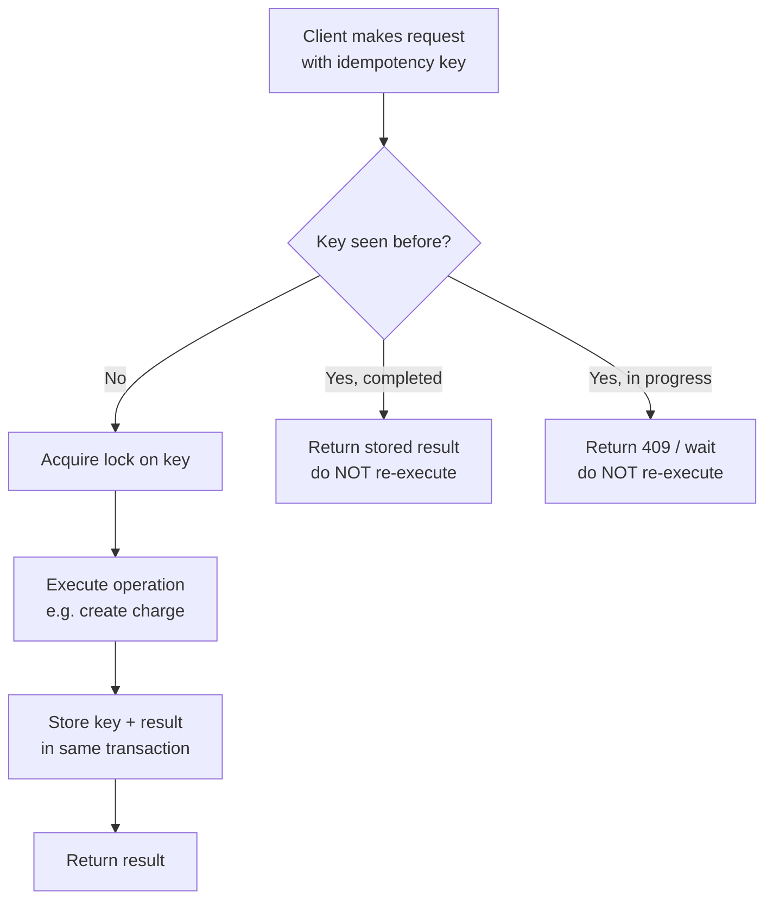

# Idempotency and the exactly-once illusion

## Why this matters

It's a Tuesday afternoon and your payments on-call phone lights up. A customer was charged $49 twice for one subscription renewal. You pull the logs. Your service called the Stripe charge API once. The charge succeeded. But the customer's bank shows two debits, and your database shows two `charge` rows with two different processor IDs.

Here is what actually happened. Your service sent the charge request. The processor received it, created the charge, and started sending back the `200 OK`. Somewhere on the way back — a load balancer idle timeout, a dropped TCP segment, a GC pause that blew your client's 5-second deadline — the response never arrived. Your HTTP client raised a timeout. Your retry logic, doing exactly what you told it to, sent the request again. The processor, having no idea it was the same logical operation, created a second charge. Two debits. One angry customer. One chargeback. One incident review where someone asks, "Why didn't we just use exactly-once delivery?"

The uncomfortable answer is that exactly-once delivery does not exist over a network, and no library, broker, or cloud vendor can sell it to you. What you can build — and what every payment system, message queue, and ledger you trust is actually built on — is at-least-once delivery plus idempotent processing. That combination produces an *effect* that happens once, which is the only thing the customer cares about. This chapter is about why the impossible thing is impossible, and how to build the achievable thing that looks identical from the outside.

The engineers who don't understand this write retry loops that double-charge customers and "deduplicate" with logic that races itself under load. The ones who do treat every mutating network call as something that might be delivered twice, and design so that the second delivery is harmless.

## Mental model

Start with the impossibility, because it's the load-bearing fact. The **Two Generals Problem** says that two parties communicating over a lossy channel can never reach guaranteed common knowledge of a single message in bounded time. The sender can't know its message arrived unless it gets an ack; the ack itself can be lost, so the receiver can't know the sender knows; and so on forever. Applied to a network call: when your request times out, you genuinely cannot tell whether the operation happened. The information you'd need is on the other side of the failure.

That gives you exactly three delivery guarantees a system can offer, and "exactly-once delivery" is not one of them:

- **At-most-once**: send and never retry. Simple, but you lose operations on failure. Fine for a metrics ping, fatal for a payment.
- **At-least-once**: retry until acknowledged. You never lose an operation, but you may apply it more than once. This is the only guarantee you can actually build on an unreliable network.
- **Exactly-once delivery**: a fiction at the transport layer.

The trick is to stop chasing exactly-once *delivery* and instead aim for exactly-once *effect* — often called **effectively-once** semantics. You get there by combining at-least-once delivery (retry aggressively, never drop the operation) with **idempotent processing** (applying the operation twice produces the same state as applying it once). The retries handle "did it arrive?"; the idempotency handles "did it arrive twice?"

Idempotency is not the same as determinism, and it is not the same as commutativity, and conflating the three is where a lot of "I thought this was safe" bugs come from. A deterministic operation returns the same output for the same input. A commutative pair of operations can be reordered without changing the result. An idempotent operation can be applied more than once without changing the result beyond the first application. You want idempotency specifically, because the failure you are defending against is *duplicate application* — not reordering, and not nondeterminism. `SET status = 'paid'` is idempotent and deterministic. Appending a line to a log is deterministic but not idempotent. Two independent balance credits are commutative with each other, but neither is idempotent on its own. When a teammate says "the operation is safe to retry," press them on which of these three properties they actually mean, because only idempotency is what makes a retry safe.

The reason effectively-once is achievable when exactly-once delivery is not comes down to *where the uncertainty lives*. The network cannot tell you whether your message arrived — that is the Two Generals result, and it is permanent. But the receiver can tell, locally and with certainty, whether it has already processed a given key, because that is a question about its own state, not a question about the channel. You move the decision from the unanswerable place (the wire) to the answerable place (the receiver's own durable storage). At-least-once delivery guarantees the key arrives *at least* once; idempotent processing guarantees the key is acted on *at most* once; the intersection is exactly once, and you got there without ever needing the network to tell you anything it cannot.



The right-hand path is the whole game. A retried request carries the same **idempotency key** as the original. The server recognizes the key, skips the side effect, and replays the stored response. The client gets the same answer whether this was the first attempt or the fourth, and the charge happens exactly once.

Two properties make an operation naturally idempotent and are worth recognizing on sight. **Set, don't add**: `balance = 100` is idempotent; `balance = balance + 50` is not. **Use stable identifiers the client generates**: if the client picks the charge ID, a retry reuses it and the database's unique constraint rejects the duplicate for free.

## In practice

Here is the double-charge bug in its natural habitat. A retry wrapper around a non-idempotent operation.

```python
# WRONG: at-least-once delivery, non-idempotent processing -> double charge
import httpx, time

def charge(customer_id: str, amount_cents: int):
    for attempt in range(3):
        try:
            resp = httpx.post(
                "https://api.processor.test/v1/charges",
                json={"customer": customer_id, "amount": amount_cents},
                timeout=5.0,
            )
            resp.raise_for_status()
            return resp.json()
        except (httpx.TimeoutException, httpx.HTTPStatusError):
            time.sleep(2 ** attempt)  # back off and retry
    raise RuntimeError("charge failed after retries")
```

*The same idea in TypeScript:*

```typescript
// WRONG: at-least-once delivery, non-idempotent processing -> double charge
const sleep = (ms: number) => new Promise((r) => setTimeout(r, ms));

async function charge(customerId: string, amountCents: number): Promise<unknown> {
  for (let attempt = 0; attempt < 3; attempt++) {
    try {
      const resp = await fetch("https://api.processor.test/v1/charges", {
        method: "POST",
        headers: { "Content-Type": "application/json" },
        body: JSON.stringify({ customer: customerId, amount: amountCents }),
        signal: AbortSignal.timeout(5000),
      });
      if (!resp.ok) throw new Error(`HTTP ${resp.status}`);
      return await resp.json();
    } catch {
      await sleep(2 ** attempt * 1000); // back off and retry
    }
  }
  throw new Error("charge failed after retries");
}
```

If the first request's *response* is lost, the processor has already created the charge. The retry creates a second one. The retry logic is correct; the operation it retries is not safe to repeat.

### The idempotency key fix

The fix is to make the request carry a client-generated key that the server uses to deduplicate. This is exactly how Stripe's idempotency works, and the pattern is worth copying verbatim.

```python
# RIGHT: at-least-once delivery + idempotent processing -> exactly-once effect
import httpx, time, uuid

def charge(customer_id: str, amount_cents: int):
    # Generate ONCE, outside the retry loop. The key is the operation's identity.
    idem_key = str(uuid.uuid4())
    for attempt in range(3):
        try:
            resp = httpx.post(
                "https://api.processor.test/v1/charges",
                headers={"Idempotency-Key": idem_key},
                json={"customer": customer_id, "amount": amount_cents},
                timeout=5.0,
            )
            resp.raise_for_status()
            return resp.json()
        except (httpx.TimeoutException, httpx.HTTPStatusError):
            time.sleep(2 ** attempt)
    raise RuntimeError("charge failed after retries")
```

*The TypeScript equivalent:*

```typescript
// RIGHT: at-least-once delivery + idempotent processing -> exactly-once effect
import { randomUUID } from "node:crypto";

const sleep = (ms: number) => new Promise((r) => setTimeout(r, ms));

async function charge(customerId: string, amountCents: number): Promise<unknown> {
  // Generate ONCE, outside the retry loop. The key is the operation's identity.
  const idemKey = randomUUID();
  for (let attempt = 0; attempt < 3; attempt++) {
    try {
      const resp = await fetch("https://api.processor.test/v1/charges", {
        method: "POST",
        headers: {
          "Content-Type": "application/json",
          "Idempotency-Key": idemKey,
        },
        body: JSON.stringify({ customer: customerId, amount: amountCents }),
        signal: AbortSignal.timeout(5000),
      });
      if (!resp.ok) throw new Error(`HTTP ${resp.status}`);
      return await resp.json();
    } catch {
      await sleep(2 ** attempt * 1000);
    }
  }
  throw new Error("charge failed after retries");
}
```

The single most important line is generating `idem_key` *outside* the loop. Generate it inside and every retry gets a fresh key, defeating the entire mechanism — a real and common bug.

### Choosing the key: natural vs synthetic

There are two ways to source an idempotency key, and the choice matters more than it looks. A **synthetic key** is a random UUID the client generates per logical operation. A **natural key** is derived from the business entity itself — for example the subscription ID plus the billing period, which uniquely identifies "the charge for this subscription in this month." Synthetic keys are trivial to generate and carry no semantics, but a client that forgets to persist the key before crashing will generate a fresh one on restart and lose its dedup protection. Natural keys survive client restarts for free because they can be recomputed from durable business state, but they require that a true uniqueness invariant actually exists in your domain. Prefer natural keys when the domain hands you one cleanly; fall back to synthetic keys persisted alongside the operation otherwise; and never mix the two strategies for the same endpoint, or you will dedup against two different namespaces and catch neither reliably.

### The server side: where deduplication actually happens

The header does nothing unless the server enforces it. The naive enforcement is a read-then-write, and it races itself:

```python
# WRONG: check-then-act has a race window under concurrent retries
def handle_charge(key, customer, amount, db):
    if db.get(key):                      # two requests both see None here...
        return db.get(key)["response"]
    result = processor.create_charge(customer, amount)  # ...both charge!
    db.set(key, {"response": result})
    return result
```

*In TypeScript:*

```typescript
// WRONG: check-then-act has a race window under concurrent retries
async function handleCharge(
  key: string,
  customer: string,
  amount: number,
  db: KeyStore,
): Promise<unknown> {
  const existing = await db.get(key); // two requests both see undefined here...
  if (existing) {
    return existing.response;
  }
  const result = await processor.createCharge(customer, amount); // ...both charge!
  await db.set(key, { response: result });
  return result;
}
```

Two retries arriving within milliseconds (a client timeout plus a near-simultaneous retry is the classic trigger) both pass the `if` and both call the processor. The correct version pushes uniqueness into the database with a constraint and a transaction, so the *database* arbitrates the race:

```python
# RIGHT: the unique constraint is the lock; the DB serializes concurrent retries
import json

def handle_charge(key, customer, amount, db):
    with db.transaction():
        try:
            # INSERT ... the key column has a UNIQUE constraint
            db.execute(
                "INSERT INTO idempotency_keys (key, status) VALUES (%s, 'in_progress')",
                (key,),
            )
        except UniqueViolation:
            row = db.execute(
                "SELECT status, response FROM idempotency_keys WHERE key = %s",
                (key,),
            ).fetchone()
            if row["status"] == "completed":
                return row["response"]      # replay the stored result
            raise Conflict(409)             # original still running; client retries later

        result = processor.create_charge(customer, amount)
        db.execute(
            "UPDATE idempotency_keys SET status='completed', response=%s WHERE key=%s",
            (json.dumps(result), key),
        )
        return result
```

*The TypeScript equivalent:*

```typescript
// RIGHT: the unique constraint is the lock; the DB serializes concurrent retries
async function handleCharge(
  key: string,
  customer: string,
  amount: number,
  db: Db,
): Promise<unknown> {
  return db.transaction(async (tx) => {
    try {
      // INSERT ... the key column has a UNIQUE constraint
      await tx.execute(
        "INSERT INTO idempotency_keys (key, status) VALUES ($1, 'in_progress')",
        [key],
      );
    } catch (err) {
      if (!(err instanceof UniqueViolation)) throw err;
      const row = (
        await tx.execute(
          "SELECT status, response FROM idempotency_keys WHERE key = $1",
          [key],
        )
      ).rows[0];
      if (row.status === "completed") {
        return row.response; // replay the stored result
      }
      throw new Conflict(409); // original still running; client retries later
    }

    const result = await processor.createCharge(customer, amount);
    await tx.execute(
      "UPDATE idempotency_keys SET status='completed', response=$1 WHERE key=$2",
      [JSON.stringify(result), key],
    );
    return result;
  });
}
```

```sql
CREATE TABLE idempotency_keys (
    key         TEXT PRIMARY KEY,            -- the unique constraint IS the dedup
    status      TEXT NOT NULL,               -- 'in_progress' | 'completed'
    response    JSONB,
    created_at  TIMESTAMPTZ NOT NULL DEFAULT now()
);
-- Expire old keys so the table doesn't grow forever (e.g. 24h retention).
CREATE INDEX ON idempotency_keys (created_at);
```

Two subtleties carry the whole design. First, the `INSERT` and the side effect should commit together when the side effect is in the same database; if the side effect is a third-party call (Stripe), store enough to make replay safe and accept that a crash between the external call and the `UPDATE` leaves an `in_progress` row you must reconcile. Second, the response is stored so the replay returns *exactly* what the first attempt returned — same charge ID, same status — not a fresh "already processed" message the client doesn't know how to parse.

### Reconciling third-party effects

The third-party case deserves its own discipline because it is where idempotency leaks past the boundary of your database. When the side effect is a call to Stripe, your transaction cannot enclose the external charge, so there is an unavoidable window: you have committed the `in_progress` row, you have called Stripe, and your process dies before the `UPDATE` that records the result. On restart you have an `in_progress` key and no idea whether the charge happened. The recovery is to ask the source of truth. Stripe lets you replay the original request with the same idempotency key and get back the original charge if it exists, or you can query the processor for charges tagged with your key. A background reconciler sweeps `in_progress` rows older than a threshold, asks the processor, and either promotes the row to `completed` with the real result or marks it failed. The invariant you are protecting is that no `in_progress` row lives forever unexamined, because an orphaned `in_progress` row is a customer who may or may not have been charged and nobody is checking.

### Deduplication in message queues

The same logic applies to consumers. Kafka and SQS deliver at-least-once; a consumer can see the same message twice after a rebalance or a redelivery. "Exactly-once" features like Kafka's transactional producer give you exactly-once *within Kafka* (read-process-write to other Kafka topics), but the moment your effect leaves Kafka — a row in Postgres, an email, a charge — you are back to needing idempotent consumers.

```python
# Consumer dedup: derive a stable key from the message, not from arrival time
def consume(msg, db):
    dedup_key = msg.headers["event_id"]   # producer-assigned, stable across redelivery
    with db.transaction():
        inserted = db.execute(
            "INSERT INTO processed_events (event_id) VALUES (%s) "
            "ON CONFLICT DO NOTHING RETURNING event_id",
            (dedup_key,),
        ).fetchone()
        if inserted is None:
            return                        # already processed; ack and move on
        apply_effect(msg, db)             # same transaction as the dedup insert
```

*In TypeScript:*

```typescript
// Consumer dedup: derive a stable key from the message, not from arrival time
async function consume(msg: Message, db: Db): Promise<void> {
  const dedupKey = msg.headers["event_id"]; // producer-assigned, stable across redelivery
  await db.transaction(async (tx) => {
    const inserted = (
      await tx.execute(
        "INSERT INTO processed_events (event_id) VALUES ($1) " +
          "ON CONFLICT DO NOTHING RETURNING event_id",
        [dedupKey],
      )
    ).rows[0];
    if (inserted === undefined) {
      return; // already processed; ack and move on
    }
    await applyEffect(msg, tx); // same transaction as the dedup insert
  });
}
```

> **Connect the dots:** This is why the saga pattern (Part 7, chapter 6) requires every step *and* every compensating action to be idempotent — a saga coordinator retries steps after crashes, so each step is delivered at-least-once by construction. It's also why event-sourced projections (chapter 5) must tolerate replaying the same event: rebuilding a read model is just deliberate at-least-once delivery of your entire event log.

> **Security note:** Idempotency keys are a replay-adjacent surface. Scope every key to the authenticated principal — store `(tenant_id, key)`, not `key` alone — or an attacker who learns a victim's key can force a stored response to be replayed to them, leaking the original result. Treat keys as opaque and never derive them from guessable inputs like sequential order numbers. For request *authentication* against replay, that's a separate mechanism (nonce + timestamp + signature), not the idempotency key, which exists to dedup *honest* retries.

## Pitfalls and anti-patterns

**Generating the idempotency key inside the retry loop.** Every retry gets a new key, so the server sees each attempt as a distinct operation and the dedup never fires. Recognize it when "we have idempotency keys" coexists with duplicate effects in production. Fix: generate the key once, at the point the operation is first conceived, and pass it through every retry. The key is the identity of the *operation*, not of the *attempt*.

**Check-then-act deduplication.** A `SELECT` to see if the key exists, followed by an `INSERT`, has a window where two concurrent retries both read "not found." Recognize it as duplicates that only appear under load or after a timeout-plus-retry. Fix: make the database arbitrate with a `UNIQUE` constraint or `INSERT ... ON CONFLICT`, and do the dedup write in the same transaction as the side effect. Never let application code be the arbiter of a race the database can win for free.

**Confusing idempotent with commutative — non-idempotent writes hiding as "safe."** `UPDATE accounts SET balance = balance + 50` looks innocuous and is *not* idempotent; applying it twice adds $100. Recognize it in any handler that increments, appends, or "adds." Fix: either make the operation set an absolute value derived from a stable input, or guard it with a dedup key so the second application is a no-op. Read operations are naturally idempotent; mutations almost never are by accident.

**Trusting a broker's "exactly-once" flag for external effects.** Enabling Kafka's `enable.idempotence` or `processing.guarantee=exactly_once` makes engineers stop writing idempotent consumers, then a charge or email fires twice after a rebalance. Recognize it when the duplicate effect is outside the broker (a database, a third party) even though the broker config claims exactly-once. Fix: understand that broker exactly-once covers only Kafka-to-Kafka; every external side effect still needs its own dedup key. The broker guarantee and the application guarantee are different problems.

**Unbounded idempotency key storage with no retention or no replay.** Keys accumulate forever (table grows without bound), or worse, keys expire faster than clients retry, so a late retry re-executes. Recognize it as either a bloating table or duplicates that only appear hours after the original. Fix: set a retention window longer than your maximum client retry horizon (24 hours is a common default), index `created_at`, and sweep expired keys on a schedule.

## Production checklist

- [ ] Every mutating endpoint accepts a client-supplied `Idempotency-Key` (or derives a stable one from a natural business ID)
- [ ] Idempotency keys are generated once per logical operation, never inside the retry loop
- [ ] Deduplication is enforced by a `UNIQUE` constraint or `INSERT ... ON CONFLICT`, not a read-then-write check
- [ ] The dedup record and the side effect commit in the same database transaction where the side effect is local
- [ ] The server stores and replays the original response, returning identical results to retried requests
- [ ] Keys are scoped to the authenticated tenant/principal, not global
- [ ] Key retention exceeds the maximum client retry window; expired keys are swept on a schedule
- [ ] Message consumers dedup on a producer-assigned stable event ID, not on arrival metadata
- [ ] "Exactly-once" broker settings are documented as Kafka-to-Kafka only; external effects have their own dedup
- [ ] `in_progress` keys orphaned by a crash mid-operation are reconciled by a background job
- [ ] Retries use bounded exponential backoff with jitter to avoid synchronized retry storms

## Exercises

1. **(Comprehension)** Explain in your own words why the Two Generals Problem makes exactly-once *delivery* impossible, and why at-least-once delivery plus idempotent processing nonetheless produces an exactly-once *effect*. Identify which of these are naturally idempotent: `SET status = 'paid'`, `INSERT ... ON CONFLICT DO NOTHING`, `balance = balance + 10`, `DELETE FROM x WHERE id = 5`, `POST /charges` without a key.

2. **(Applied)** Take the `WRONG` check-then-act handler above and write a test that reproduces the double-charge under concurrency: spawn two threads calling the handler with the same key at the same time, with a small `sleep` inside the handler to widen the race window. Confirm two charges occur. Then swap in the `UNIQUE`-constraint version and confirm exactly one charge occurs and the second caller receives the replayed response.

3. **(Design)** Design the idempotency layer for a payment service that calls a third-party processor (Stripe) you do not control. The processor call is *not* in your database transaction. Specify: what you persist before vs. after the external call, how you recover an `in_progress` key whose process crashed between the processor call and your `UPDATE`, your key retention policy, and how you'd detect a charge that succeeded at the processor but was never recorded locally. State the failure mode you're most worried about and how you'd alert on it.

## Further reading

- Jim Gray and Andreas Reuter, *Transaction Processing: Concepts and Techniques* — the canonical treatment of idempotence and recovery in transactional systems.
- E. A. Akkoyunlu, K. Ekanadham, R. V. Huber, "Some Constraints and Tradeoffs in the Design of Network Communications" (1975) — the paper that introduced what became the Two Generals Problem.
- Stripe API documentation, ["Idempotent requests"](https://docs.stripe.com/api/idempotent_requests) — the reference implementation of client keys, stored responses, and retention windows.
- Martin Kleppmann, *Designing Data-Intensive Applications*, chapters 9 and 11 — exactly-once semantics, fault-tolerant consensus, and stream processing guarantees, with precise definitions.
- Confluent, ["Exactly-Once Semantics Are Possible: Here's How Kafka Does It"](https://www.confluent.io/blog/exactly-once-semantics-are-possible-heres-how-apache-kafka-does-it/) — what Kafka's transactional guarantee does and, crucially, does not cover.
- AWS, ["Amazon SQS at-least-once delivery"](https://docs.aws.amazon.com/AWSSimpleQueueService/latest/SQSDeveloperGuide/standard-queues.html) — official documentation of why standard queues require idempotent consumers.
