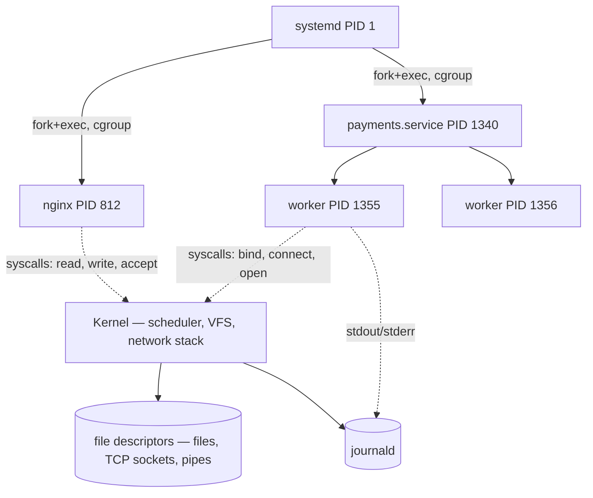

# Linux for application engineers

## Why this matters

It's a Tuesday afternoon. You merged a config change, the CI pipeline went green, and the deploy bot reported success. Then PagerDuty fires: the payments service is returning 502s. You SSH onto the box, run `systemctl status payments`, and see `active (running)` — except the port isn't listening. The load balancer health check is failing, traffic is draining, and you have maybe four minutes before someone senior joins the call.

The engineer who panics starts restarting things at random: `systemctl restart payments`, then the whole box, hoping. Sometimes it works, and you learn nothing. The engineer who knows Linux runs `ss -ltnp` to confirm nothing is listening on 8080, `journalctl -u payments -n 50` to read what the process actually printed before it gave up, and within ninety seconds sees `Permission denied: '/var/run/payments.sock'`. The service forked, the main process is "running," but the worker that binds the socket died because a deploy changed the directory owner. You don't need to restart anything blind. You `chown` the directory, restart once, and watch the port come up.

That's the gap this chapter closes. To an application engineer, the Linux box your code runs on is not a black box you escalate to the platform team. It's a small number of mechanisms — processes, signals, file permissions, network sockets, and a service manager — plus a diagnostic toolkit that turns "the service is broken" into a sequence of yes/no questions you can answer in seconds. Containers and Kubernetes don't change this; they just put a thinner wrapper around the same kernel. The engineers who can read a live box debug in minutes what others escalate for hours.

## Mental model

A running Linux system is a tree of processes, each holding numbered handles to resources (files, sockets, pipes), all talking to the kernel through system calls. Almost every diagnostic question reduces to one of: *what processes exist*, *what files/sockets do they hold*, *what syscalls are they making*, and *what did they log*.

Four facts anchor everything:

- **Every process has a PID and a parent.** PID 1 is the init system (`systemd` on modern distros), the ancestor of everything. Processes are created by `fork` + `exec` and reaped by their parent via `wait`. An unreaped dead child is a **zombie**; an unreaped *live* child whose parent died gets re-parented to PID 1.
- **Everything is a file descriptor.** An open file, a TCP socket, a pipe to another process — all are small integers in the process's descriptor table. `lsof` and `/proc/<pid>/fd` let you read that table directly.
- **Signals are the kernel's interrupt mechanism.** `SIGTERM` (15) politely asks a process to shut down; `SIGKILL` (9) cannot be caught and terminates it immediately; `SIGHUP` (1) is conventionally "reload config." Graceful shutdown is a process choosing to catch `SIGTERM` and clean up.
- **Permissions gate every resource.** A process runs as a user/group; files have owner/group/other read-write-execute bits. "Permission denied" is the single most common reason application code fails on a box it ran fine on yesterday.



The diagnostic tools map cleanly onto this picture. `ps`/`top` enumerate the process tree. `lsof`/`ss` read the file-descriptor and socket tables. `strace` traces the syscalls a process makes to the kernel. `journalctl` reads what `systemd` captured from a unit's stdout/stderr. Hold this diagram in your head and the toolkit stops being a pile of memorized flags — each command answers one question about one layer.

A second structural fact sits underneath the tree: every process belongs to a **cgroup** (control group), the kernel mechanism systemd and container runtimes use to account and cap CPU, memory, and I/O. When a process is killed for using too much memory, it isn't your application code failing — it's the kernel OOM killer enforcing a cgroup limit, and the evidence lands in `dmesg` and `journalctl`, not in your app's logs. Knowing that the limit lives outside the process saves you from staring at application code for an hour.

## In practice

### Reading the process tree

`ps aux` is the universal snapshot; `ps auxf` adds the ASCII forest so you can see parent/child relationships.

```bash
$ ps auxf | grep -A2 payments
root      1340  0.1  0.5 712044 41880 ?  Ss   13:02   0:00 /usr/bin/payments --config /etc/payments/config.yaml
www-data  1355  0.0  0.4 698112 33020 ?  S    13:02   0:00  \_ payments: worker[0]
www-data  1356  0.0  0.4 698112 33108 ?  S    13:02   0:00  \_ payments: worker[1]
```

The `STAT` column matters more than people think. `S` is interruptible sleep (waiting on I/O or a lock — normal). `R` is running/runnable. `D` is *uninterruptible* sleep, usually blocked on disk or a hung NFS mount — a process stuck in `D` can't even be killed with `SIGKILL`. `Z` is a zombie. `Ss` means a session leader. If you see a pile of `D` states, your problem is storage, not CPU.

For live triage, `top` (or better, `htop`) shows the moving picture. Press `1` to break out per-CPU, `M` to sort by memory, `P` by CPU. The load average — three numbers for 1/5/15-minute windows — counts runnable *and* uninterruptible-sleep processes, so a high load average with idle CPUs means you're blocked on I/O, not compute. Confirm memory pressure with `free -h` and per-process resident size in the `RSS` column of `ps`; a process whose `RSS` climbs steadily toward its cgroup limit is heading for an OOM kill.

### Signals and graceful shutdown

When `systemctl stop` or a `docker stop` runs, the process gets `SIGTERM` first, then `SIGKILL` after a timeout (90s default for systemd, 10s for Docker). Application code that ignores `SIGTERM` gets hard-killed, dropping in-flight requests. The right pattern, here in Node but identical in shape everywhere:

```javascript
const server = app.listen(8080);

process.on('SIGTERM', () => {
  console.log('SIGTERM received, draining connections');
  server.close(() => {        // stop accepting, finish in-flight
    db.end();                 // close pool
    process.exit(0);
  });
  // safety net: if drain hangs, exit before SIGKILL lands
  setTimeout(() => process.exit(1), 25_000).unref();
});
```

Send signals by name, not number, so the intent is legible: `kill -TERM 1340`, `kill -HUP 1340` to reload, `kill -QUIT` for a core dump. Reserve `kill -9` (`SIGKILL`) for processes that have already ignored `SIGTERM`; using it by default means your shutdown handlers never run.

### Files, descriptors, and permissions

`ls -l` shows the mode bits; reading them fluently is non-negotiable:

```bash
$ ls -l /etc/payments/
-rw-r----- 1 root payments 412 Jun 15 13:00 config.yaml
drwxr-xr-x 2 root root    4096 Jun 15 13:00 certs
```

`-rw-r-----` is `0640`: owner (root) reads/writes, group (`payments`) reads, others get nothing. If the service runs as `www-data` and `www-data` is not in the `payments` group, it cannot read its own config — that's a `Permission denied` at startup. `lsof` answers "who has this file open" and "what is this process holding":

```bash
$ lsof -p 1355 | grep -E 'sock|REG' | head
payments 1355 www-data  cwd  DIR  ...  /
payments 1355 www-data    3u IPv4 ... TCP *:8080 (LISTEN)
payments 1355 www-data    7u unix ... /var/run/payments.sock
payments 1355 www-data    9r  REG  ...  /etc/payments/config.yaml
```

`lsof -i :8080` flips the question around: "who is using port 8080?" — invaluable when a service won't start because something already owns its port.

### Networking: what's listening, what's connected

`ss` (the modern replacement for `netstat`) is the fastest way to answer socket questions:

```bash
$ ss -ltnp                         # listening TCP sockets, numeric, with PID
State   Recv-Q  Send-Q  Local Address:Port   Peer Address:Port  Process
LISTEN  0       511     0.0.0.0:80           0.0.0.0:*          users:(("nginx",pid=812))
LISTEN  0       128     127.0.0.1:8080       0.0.0.0:*          users:(("payments",pid=1355))
```

That last line is a real bug in disguise: `payments` is listening on `127.0.0.1:8080`, not `0.0.0.0:8080`, so it's reachable from localhost but invisible to the load balancer on another host. `ss -tan state established` shows live connections; a `Send-Q` that climbs and never drains means the peer isn't reading — backpressure or a dead downstream. For DNS and routing checks, `getent hosts api.internal` resolves the way the application's resolver will (respecting `/etc/nsswitch.conf`), which `dig` does not.

### systemd: the unit is the contract

A service is defined by a unit file. The fields that bite application engineers:

```ini
# /etc/systemd/system/payments.service
[Unit]
Description=Payments API
After=network-online.target
Requires=postgresql.service

[Service]
Type=notify
User=www-data
Group=payments
ExecStart=/usr/bin/payments --config /etc/payments/config.yaml
Restart=on-failure
RestartSec=5
Environment=NODE_ENV=production
EnvironmentFile=/etc/payments/env
LimitNOFILE=65536

[Install]
WantedBy=multi-user.target
```

`Type=` is the field that causes the most "it says running but it isn't" confusion. `Type=simple` (the default) considers the unit started the instant `ExecStart` is *spawned* — even if it crashes a millisecond later. `Type=notify` waits for the process to call `sd_notify(READY=1)`, so `active` actually means *ready*. `Type=forking` is for daemons that double-fork; get the `PIDFile` wrong and systemd tracks the wrong process. Match `Type` to how your app actually behaves or status will lie to you. `LimitNOFILE` sets the open-file-descriptor ceiling; a busy server that hits it logs `EMFILE: too many open files` and stops accepting connections.

After editing a unit, `systemctl daemon-reload` then `systemctl restart`. Forgetting the reload means you restarted the *old* definition.

### A real "service won't start" debug, end to end

Back to the opening incident. Status claims healthy, but the port is dead. Walk the layers:

```bash
$ systemctl status payments
   Active: active (running) since Tue 13:02:11; 2min ago
 Main PID: 1340 (payments)
```

`active (running)` but — note — `Type=` here was `simple`, so this tells us only that the main process is alive, not ready. Check the socket layer:

```bash
$ ss -ltnp | grep 8080
$                              # nothing — no listener
```

Confirmed: no listener. Now read what the process actually said:

```bash
$ journalctl -u payments -n 20 --no-pager
payments[1355]: worker[0] starting
payments[1355]: Error: bind EACCES /var/run/payments.sock
payments[1355]: worker[0] exited (1)
payments[1340]: all workers dead, parent idling
```

`EACCES` on the socket path. The parent didn't exit, so systemd is satisfied, but every worker died. If the log had been silent, `strace` would have shown the failing syscall directly:

```bash
$ strace -f -e trace=bind,open,connect -p 1340
[pid 1355] bind(7, {sa_family=AF_UNIX, sun_path="/var/run/payments.sock"}, ...) = -1 EACCES (Permission denied)
```

Now confirm the permission and the running user:

```bash
$ ls -ld /var/run/payments
drwxr-xr-x 2 root root 40 Jun 15 13:00 /var/run/payments
$ systemctl show payments -p User
User=www-data
```

The directory is owned by `root` with no group write; the process runs as `www-data`. A deploy step recreated `/var/run/payments` as root. The fix is one ownership change plus a restart:

```bash
$ sudo chown www-data:payments /var/run/payments
$ sudo systemctl restart payments
$ ss -ltnp | grep 8080
LISTEN 0 128 0.0.0.0:8080 0.0.0.0:* users:(("payments",pid=1502))
```

Port is up. Five commands, no guessing, root cause in the runbook. The durable fix is two-fold: set `Type=notify` so `active` means ready, and use a `RuntimeDirectory=payments` directive so systemd creates `/var/run/payments` with the correct owner on every start.

## Pitfalls and anti-patterns

**1. Trusting `active (running)` from a `Type=simple` unit.** With the default type, systemd reports success the moment it spawns your binary, before the app has bound a port or connected to its database. Recognize it when `systemctl status` is green but health checks fail. Fix it by using `Type=notify` and calling `sd_notify` (or a library wrapper) once your app is truly ready, so orchestration and `Requires=`/`After=` ordering reflect reality.

**2. `kill -9` as the default stop.** `SIGKILL` can't be caught, so connection draining, flushed buffers, and lock releases never run — you get corrupted state and dropped requests. Recognize it in postmortems where data is half-written after a restart. Fix it by sending `SIGTERM` first, implementing a shutdown handler, and reserving `-9` only for a process that has already ignored `SIGTERM` past its timeout.

**3. Running everything as root "to avoid permission errors."** It hides the real bug and turns any process compromise into full host compromise. Recognize it when unit files have `User=root` or containers run without a `USER` directive. Fix it by running as a dedicated unprivileged user, granting only the specific files/capabilities needed (`CAP_NET_BIND_SERVICE` to bind port 80 without root, via `AmbientCapabilities=`), and letting a real `Permission denied` teach you what access the app actually requires.

**4. Binding to `127.0.0.1` and wondering why the load balancer can't reach you.** A service on `127.0.0.1:8080` works in local testing and is invisible across the network. Recognize it instantly with `ss -ltnp` showing `127.0.0.1` instead of `0.0.0.0` or a specific interface. Fix it by binding to the intended interface — and be deliberate: bind admin/metrics ports to localhost on purpose, public ports to the routable address.

**5. Ignoring the file-descriptor ceiling until it falls on you.** Connection pools, log files, and sockets all consume descriptors; the default soft limit (often 1024) is tiny for a server. Recognize it by `EMFILE: too many open files` and a process that stops accepting new connections while staying "up." Fix it by setting `LimitNOFILE` in the unit (and the matching kernel `fs.file-max` if needed), and confirm at runtime with `cat /proc/<pid>/limits`.

## Production checklist

- [ ] Every service unit uses `Type=notify` (or an accurate `Type=`) so `active` means *ready*, not merely *spawned*
- [ ] Services run as a dedicated unprivileged `User=`/`Group=`, never root; privileged ports use `AmbientCapabilities=CAP_NET_BIND_SERVICE`
- [ ] Application catches `SIGTERM` and drains in-flight work before exit; shutdown completes inside the systemd `TimeoutStopSec` window
- [ ] `LimitNOFILE` set appropriately for the workload; verified via `/proc/<pid>/limits` under load
- [ ] `Restart=on-failure` with a sane `RestartSec`, plus `StartLimitIntervalSec`/`StartLimitBurst` to avoid crash-restart storms
- [ ] Runtime/state directories created via `RuntimeDirectory=`/`StateDirectory=` with correct ownership, not ad-hoc in deploy scripts
- [ ] Listening addresses confirmed with `ss -ltnp` after deploy — public ports on the routable interface, admin/metrics on localhost
- [ ] Logs go to stdout/stderr and are captured by `journald`; `journalctl -u <svc>` is the first stop in any incident
- [ ] Secrets delivered via `EnvironmentFile=` (mode `0600`, root-owned) or a secrets manager, never inline in the unit or in `ps`-visible args
- [ ] `strace`, `lsof`, `ss`, and `htop` installed (or available via a debug sidecar) before you need them at 3 a.m.

## Exercises

1. **(Comprehension)** Start any long-running process (e.g. `python3 -m http.server 8080`). Using only `ps`, `ss`, and `lsof`, determine: its PID and parent PID, which user it runs as, which port it listens on and on which interface, and which file descriptors point at sockets versus regular files. Then send it `SIGTERM` by name and confirm with `ps` that it's gone.

2. **(Applied)** Reproduce the chapter's incident. Write a tiny service that binds a Unix socket in a directory it can't write to, wrap it in a `Type=simple` systemd unit running as an unprivileged user, and start it. Confirm `systemctl status` reports `active (running)` while the service is actually broken. Diagnose it using `journalctl` and `strace`, then fix it two ways: the quick `chown`, and the durable `RuntimeDirectory=` + `Type=notify` change. Explain why the second survives a reboot and the first may not.

3. **(Design)** Your team runs forty microservices across a fleet, and on-call engineers waste the first ten minutes of every incident SSH-ing around running ad-hoc `ps`/`ss`/`journalctl`. Design a standard "first five minutes" diagnostic procedure and the tooling to support it: what gets collected automatically on alert, what stays manual, how you expose `journald` and socket state without giving everyone root SSH, and how this maps onto containerized workloads where `strace` needs `CAP_SYS_PTRACE` and the process tree lives inside a namespace. Name the tradeoffs and state what you'd build first.

## Further reading

- *The Linux Programming Interface*, Michael Kerrisk — the definitive reference on processes, signals, file descriptors, and syscalls; chapters 24–27 (process creation) and 20–22 (signals) are the core.
- `man 7 signal`, `man 7 credentials`, `man 5 systemd.service`, `man 5 systemd.exec` — the authoritative behavior of signals, permissions, and unit fields; read them once end to end.
- Brendan Gregg, [*Linux Performance*](https://www.brendangregg.com/linuxperf.html) — the canonical map of which tool answers which performance question, including the USE method.
- Julia Evans, [*Linux debugging tools you'll love*](https://wizardzines.com/zines/debugging-tools/) — `strace`, `lsof`, `ss`, and friends explained with unusual clarity.
- The systemd manual, [*systemd.service* and *systemd.exec*](https://www.freedesktop.org/software/systemd/man/) — primary source for `Type=`, `Restart=`, sandboxing, and capability directives.

> **Connect the dots:** Containers (Part 8, "Docker beyond `docker run`") don't replace any of this — a container is a process tree in its own namespaces and cgroups, still making the same syscalls, still subject to the same signals and permission bits. `docker stop` sends `SIGTERM`; PID 1 inside the container is your app, so it must reap zombies and handle signals or you'll leak processes. Everything here transfers directly.

> **Security note:** Apply least privilege at the process level, not just the network edge. Run services as dedicated unprivileged users; grant fine-grained Linux capabilities (`CAP_NET_BIND_SERVICE`, `CAP_SYS_PTRACE`) instead of root; and use systemd's sandboxing (`NoNewPrivileges=true`, `ProtectSystem=strict`, `PrivateTmp=true`, `ReadOnlyPaths=`) to shrink the blast radius of a compromise. Keep secrets out of `ExecStart` arguments — anything on the command line is visible to every user via `ps` and `/proc/<pid>/cmdline` — and deliver them through a root-owned `EnvironmentFile` (mode `0600`) or a secrets manager. When you must `strace` a process in production, remember that `CAP_SYS_PTRACE` lets you read another process's memory: scope it tightly and drop it afterward.
