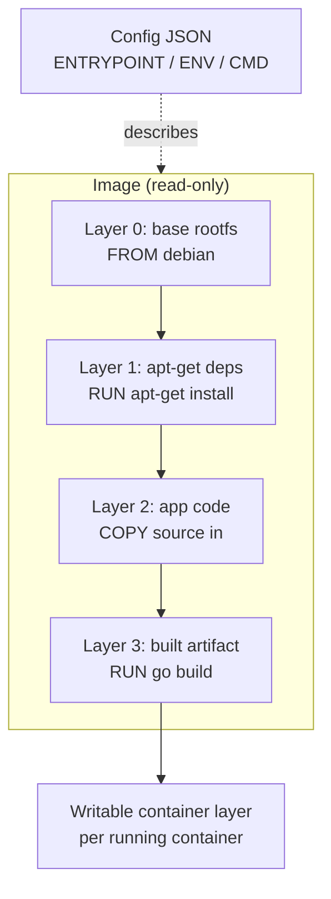

# Docker beyond docker run

## Why this matters

It's a Tuesday afternoon and the security team just opened a ticket against your service. The automated scanner flagged hundreds of known CVEs in your production image, dozens of them rated critical. You pull the image to look. It's well over a gigabyte. You didn't write a gigabyte of code — your app is a single small Go binary. So where did the rest come from, and why does a compiled binary need a C compiler, `git`, three Python versions, and the entire Debian package manager shipped to production?

The answer is in the Dockerfile nobody has touched in two years. It starts `FROM node:18`, runs `apt-get install build-essential`, copies the whole repo in with `COPY . .`, and bakes the result. Every tool used to *build* the artifact got shipped alongside the artifact. Every one of those tools is attack surface, and every one of them is something a scanner will find a vulnerability in eventually. The image is slow to pull, slow to push, expensive to store, and a liability the moment it lands in a registry.

That's the gap this chapter closes. A Docker image is not a virtual machine snapshot and it's not a tarball of your laptop. It's a stack of content-addressed layers with a precise, predictable build model on top. Once you understand what a layer is, when the cache invalidates, and how to separate the build environment from the runtime environment, you can take that bloated, vulnerability-ridden image down to a tiny one with a near-empty CVE list — without changing a line of application code. The engineers who treat `docker build` as a black box ship bloated, vulnerable images and wonder why deploys are slow. The ones who understand layers ship small, boring, fast images. This chapter is the bridge.

## Mental model

A Docker image is an ordered stack of read-only **layers** plus a JSON **config** (entrypoint, env, exposed ports). Each layer is a filesystem changeset — "these files were added, changed, or deleted relative to the layer below" — and each is content-addressed by the SHA-256 digest of its contents. This is the same content-addressable trick Git uses for blobs: identical layers across images share storage and only get pulled once.

Each instruction in a Dockerfile that changes the filesystem (`RUN`, `COPY`, `ADD`) produces one new layer on top of the previous one. Metadata-only instructions (`ENV`, `WORKDIR`, `ENTRYPOINT`, `EXPOSE`) modify the config without adding a filesystem layer. At runtime, the container engine stacks the layers with a union filesystem (overlayfs) and adds a thin writable layer on top.



Two consequences fall out of this model, and they drive every optimization in the chapter.

**The build cache is keyed on layers, in order.** When you run `docker build`, the builder walks the Dockerfile top to bottom. For each instruction it computes a cache key (the instruction text, plus for `COPY`/`ADD` the checksum of the files being copied) and checks whether it already has a layer for that key. If yes, it reuses it. The moment one instruction misses the cache, *every instruction after it* must rebuild, because each layer is built on top of the previous. This is why instruction order matters enormously: put the things that rarely change (installing dependencies) before the things that change every commit (copying source code).

**A deleted file in a later layer still costs you.** Layers are additive. If layer 1 adds a large build toolchain and layer 4 runs `rm -rf` on it, the bytes are still in layer 1 and still ship in the image — the deletion just hides them at runtime. You cannot shrink an image by deleting files in a later `RUN`. You shrink it by never putting the bytes in a shipped layer in the first place. That single fact is the whole argument for multi-stage builds.

## In practice

### The bloated, insecure version

Here is the kind of Dockerfile that produces a multi-gigabyte image. Read it as a catalog of mistakes.

```dockerfile
# DON'T DO THIS
FROM node:18

WORKDIR /app

# Copies node_modules, .git, .env, build artifacts — everything
COPY . .

# Build tools end up in the final image
RUN apt-get update && apt-get install -y build-essential python3

RUN npm install

RUN npm run build

# Runs as root
EXPOSE 3000
CMD ["npm", "start"]
```

What's wrong, in order of severity:

- `FROM node:18` is the full Debian-based image — hundreds of MB of OS packages, a shell, a package manager, and everything `apt` dragged in. Each is CVE surface.
- `COPY . .` copies the entire working directory, including `.git/`, local `.env` secrets, and whatever junk is on the build machine. Secrets in `.env` are now baked into a layer and extractable by anyone who pulls the image.
- `npm install` runs *after* `COPY . .`, so any change to any source file busts the cache and reinstalls every dependency from scratch.
- `build-essential` and `python3` are needed to compile native modules at build time, then shipped to production where they do nothing but add risk.
- The container runs as `root`. A process breakout or an RCE in your app is now root inside the container, one misconfiguration away from root on the host.

Build it and look at the damage. The exact byte counts will vary with your dependencies and base-image version, but the shape is always the same:

```bash
$ docker build -t myapp:bloated .
$ docker images myapp:bloated
REPOSITORY   TAG       SIZE
myapp        bloated   1.42GB

$ docker history myapp:bloated --human
IMAGE          CREATED BY                                      SIZE
<missing>      CMD ["npm" "start"]                             0B
<missing>      RUN npm run build                               240MB
<missing>      RUN npm install                                 410MB
<missing>      RUN apt-get install build-essential python3     520MB
<missing>      COPY . .                                        180MB
<missing>      FROM node:18                                    1.1GB ...
```

`docker history` is the single best tool for finding fat. It shows you the byte cost of each layer. The `build-essential` line is pure liability: tooling you need to *build* the app, sitting in the *runtime* image doing nothing but expanding attack surface.

### The fixed version: multi-stage build

The core idea: use a fat image with all the build tools as a disposable **build stage**, then copy only the finished artifact into a clean, minimal **runtime stage**. Only the last stage ships.

```dockerfile
# syntax=docker/dockerfile:1

# ---- Stage 1: build ----
FROM node:18-slim AS build
WORKDIR /app

# Copy only the manifests first. This layer is cached until deps change,
# so editing source code no longer triggers a full reinstall.
COPY package.json package-lock.json ./
RUN npm ci

# Now copy source and build. Only this layer rebuilds on a code change.
COPY . .
RUN npm run build && npm prune --production

# ---- Stage 2: runtime ----
FROM gcr.io/distroless/nodejs18-debian12 AS runtime
WORKDIR /app

# Copy ONLY what production needs, from the build stage.
COPY --from=build /app/node_modules ./node_modules
COPY --from=build /app/dist ./dist
COPY --from=build /app/package.json ./

# Distroless runs as non-root (uid 65532) by default.
USER nonroot
EXPOSE 3000
CMD ["dist/server.js"]
```

What changed and why it matters:

- **`node:18-slim` for building** trims the build base, and **`npm ci`** uses the lockfile for reproducible installs.
- **Manifest-first copy.** `COPY package*.json` then `npm ci` *before* `COPY . .` means the dependency-install layer is cached across every build that doesn't touch `package.json`. A one-line source change now rebuilds in seconds, not minutes.
- **`distroless` runtime base.** Google's distroless images contain your language runtime and nothing else: no shell, no package manager, no `apt`, no `ls`. There's nothing for an attacker to pivot through and almost nothing for a scanner to flag. The Node distroless image is a small fraction of the size of the full Debian-based base.
- **`COPY --from=build`** pulls only the production `node_modules` and the built `dist/` out of the build stage. The compilers, the source, the `.git` directory, the dev dependencies — none of it crosses the stage boundary. The build tools are never in a shipped layer, so the "deleted files still cost you" problem never arises.
- **`USER nonroot`.** The process runs unprivileged.

The result, for the same app and the same code, is an image a fraction of the original size:

```bash
$ docker build -t myapp:slim .
$ docker images myapp:slim
REPOSITORY   TAG     SIZE
myapp        slim    190MB
```

For a Go or Rust binary the win is even more dramatic, because a compiled static binary needs *nothing* at runtime — not even a libc:

```dockerfile
# syntax=docker/dockerfile:1
FROM golang:1.22 AS build
WORKDIR /src
COPY go.mod go.sum ./
RUN go mod download
COPY . .
RUN CGO_ENABLED=0 go build -ldflags="-s -w" -o /bin/app ./cmd/server

FROM gcr.io/distroless/static-debian12:nonroot
COPY --from=build /bin/app /app
USER nonroot
ENTRYPOINT ["/app"]
```

`CGO_ENABLED=0` produces a fully static binary; `distroless/static` is an essentially empty rootfs with CA certificates and timezone data. The final image is roughly the size of your binary plus a few MB. For a typical Go service that means a tiny image with a CVE report that is close to empty — the scanner has almost nothing to scan.

### .dockerignore: stop sending junk to the builder

Before the builder runs a single instruction, the Docker CLI tarballs the build context (your directory) and ships it to the daemon. `COPY . .` then copies from that tarball. Without a `.dockerignore`, you're sending `node_modules`, `.git`, build outputs, and secrets across that boundary — slow, and a way to leak credentials into a layer.

```gitignore
# .dockerignore
.git
.gitignore
node_modules
dist
build
*.log
.env
.env.*
Dockerfile
docker-compose.yml
.DS_Store
**/__pycache__
coverage
```

A good `.dockerignore` speeds up builds (smaller context to transfer and hash) and is a hard line of defense against baking secrets into an image. Treat it as mandatory, not optional.

### BuildKit: the modern builder

BuildKit is the default build backend in current Docker. The `# syntax=docker/dockerfile:1` line at the top opts into the latest frontend features. Two are worth knowing well.

**Cache mounts** persist a directory across builds without baking it into a layer — perfect for package-manager caches:

```dockerfile
# syntax=docker/dockerfile:1
FROM node:18-slim AS build
WORKDIR /app
COPY package.json package-lock.json ./
RUN --mount=type=cache,target=/root/.npm \
    npm ci
COPY . .
RUN npm run build
```

The `/root/.npm` download cache survives between builds, so even a cache-busting `package.json` change re-downloads only what's actually new. The cache directory is never part of the image.

**Secret mounts** expose a secret to one `RUN` step without ever writing it to a layer:

```dockerfile
# syntax=docker/dockerfile:1
FROM node:18-slim AS build
WORKDIR /app
COPY package.json package-lock.json ./
RUN --mount=type=secret,id=npmrc,target=/root/.npmrc \
    npm ci
```

```bash
$ docker build --secret id=npmrc,src=$HOME/.npmrc -t myapp .
```

The private registry token is available during `npm ci` and gone the instant the step finishes. It is never in `docker history`, never in a layer, never in the pushed image. This is the correct way to handle a build-time credential. The wrong way — `ARG NPM_TOKEN` followed by using it in a `RUN` — leaves the token recoverable from layer metadata forever.

BuildKit also parallelizes independent stages. If you have separate `frontend` and `backend` build stages feeding one runtime stage, BuildKit builds them concurrently.

### Verifying what you shipped

Don't trust, verify. Scan the image and inspect it:

```bash
# Scan for known CVEs (Trivy is a widely used open-source scanner)
$ trivy image myapp:slim

# Confirm the user is not root
$ docker inspect myapp:slim --format '{{.Config.User}}'
nonroot

# Confirm there's no shell to pivot through (distroless)
$ docker run --rm -it myapp:slim sh
# -> exec: "sh": executable file not found  (good — there is no shell)
```

## Pitfalls and anti-patterns

**1. The cache-busting COPY.** Putting `COPY . .` before your dependency install means every source edit invalidates the install layer, and your CI rebuilds all dependencies from scratch on every commit. *Recognize it:* CI build times that don't drop on tiny changes; `docker history` shows the install layer rebuilding constantly. *Fix it:* copy dependency manifests (`package.json`, `go.mod`, `requirements.txt`, `Cargo.toml`) and install *before* copying application source. Dependencies change rarely; source changes constantly. Order accordingly.

**2. Deleting files to shrink the image.** `RUN apt-get install ... && rm -rf /var/lib/apt/lists/*` in the *same* `RUN` is fine, because it's one layer. But a separate later `RUN rm -rf /some-big-thing` does nothing for image size — the bytes live in the earlier layer forever. *Recognize it:* `docker history` shows a fat layer that "should" have been cleaned. *Fix it:* clean within the same `RUN` that created the files, or better, use a multi-stage build so the bytes never enter a shipped layer.

**3. Secrets baked into layers.** `ENV API_KEY=...`, `ARG TOKEN=...`, or `COPY .env .` writes the secret into image metadata or a layer where anyone with the image can extract it via `docker history` or by unpacking the layer tarball. *Recognize it:* `docker history --no-trunc` shows credentials; secrets appear in `docker inspect`. *Fix it:* use BuildKit `--mount=type=secret` for build-time secrets, and inject runtime secrets via environment variables or a secrets manager at *deploy* time, never at build time. Add every secret pattern to `.dockerignore`.

**4. Running as root.** The default user in most base images is root, and a root process inside a container that escapes its namespace is root-adjacent on the host. *Recognize it:* `docker inspect --format '{{.Config.User}}'` returns empty or `root`. *Fix it:* add a `USER` instruction with a non-root uid, or use a base image that defaults to non-root (distroless `:nonroot` tags do). Combine with a read-only root filesystem and dropped Linux capabilities at runtime.

**5. Floating `:latest` base tags.** `FROM node:latest` means your build is not reproducible — the same Dockerfile produces different images on different days, and a base-image change can break you silently. *Recognize it:* builds that "suddenly" behave differently with no Dockerfile change. *Fix it:* pin to a specific minor version (`node:18.20-slim`) at minimum, and pin by digest (`node:18.20-slim@sha256:...`) for fully reproducible, tamper-evident builds. Let a tool like Dependabot or Renovate bump the pin via PR so upgrades are reviewed.

## Production checklist

- [ ] Multi-stage build: build tools live in a build stage, never in the runtime stage
- [ ] Runtime base is minimal — distroless, `-slim`, or `alpine` (mind musl/glibc differences with Alpine)
- [ ] Base image pinned by version, ideally by `@sha256:` digest, with automated update PRs
- [ ] Dependency manifests copied and installed *before* application source (cache-friendly layer order)
- [ ] `.dockerignore` excludes `.git`, `node_modules`, build output, and all `.env*` files
- [ ] `# syntax=docker/dockerfile:1` enabled; BuildKit cache mounts used for package caches
- [ ] Build-time secrets passed via `--mount=type=secret`, never `ARG`/`ENV`/`COPY`
- [ ] Final image runs as a non-root `USER`
- [ ] Image scanned in CI (Trivy, Grype, or registry-native scanning); build fails on critical CVEs
- [ ] Pinned, deterministic dependency install (`npm ci`, `pip install --require-hashes`, `go mod download`)
- [ ] `HEALTHCHECK` defined or orchestrator-level liveness/readiness probes configured
- [ ] Image size tracked over time; sudden growth investigated with `docker history`

## Exercises

1. **(Comprehension)** Take the bloated Dockerfile from this chapter, build it, and run `docker history --human myapp:bloated`. For each layer over 100 MB, explain in one sentence what produced those bytes and whether they are needed at *runtime*. Then run `docker history --no-trunc` and locate any value that should have been a secret.

2. **(Applied)** Convert a real service you work on (or a sample Node/Go/Python app) to a multi-stage build with a distroless or slim runtime base and a non-root user. Measure before-and-after image size with `docker images` and before-and-after CVE counts with `trivy image`. Then reorder the instructions so a one-line source change rebuilds without reinstalling dependencies, and prove it by timing two consecutive builds with a trivial code edit in between.

3. **(Design)** Your team builds 40 microservices, all from a handful of base images, and CI image builds dominate pipeline time. Design a build strategy that minimizes total build time and image size across the fleet. Consider: a shared, pre-built base image updated on a schedule; a remote BuildKit cache backend shared across CI runners; how you'd pin and roll base-image upgrades safely across 40 services at once; and how you'd enforce the security checklist (non-root, scanned, no secrets) in a way that's hard to bypass. State which constraint you'd optimize for first and why.

## Further reading

- Docker, [Best practices for writing Dockerfiles](https://docs.docker.com/develop/develop-images/dockerfile_best-practices/) — the official guidance, kept current
- Docker, [Multi-stage builds](https://docs.docker.com/build/building/multi-stage/) and [BuildKit documentation](https://docs.docker.com/build/buildkit/) — the primary sources for everything in "In practice"
- Google, [GoogleContainerTools/distroless](https://github.com/GoogleContainerTools/distroless) — the distroless images, their rationale, and supported languages
- [Open Container Initiative Image Format Specification](https://github.com/opencontainers/image-spec/blob/main/spec.md) — what an image actually is on disk: the layer and config format every tool implements
- Aqua Security, [Trivy](https://github.com/aquasecurity/trivy) — the open-source scanner used in the verification step; read its docs on failing CI on severity thresholds
- Docker, [Build secrets](https://docs.docker.com/build/building/secrets/) — the correct handling of build-time credentials with `--mount=type=secret`

> **Connect the dots:** Image layers are content-addressed by SHA-256 and shared across images — exactly the storage trick behind Git objects in Part 3. The same "hash the content, key by the hash, dedupe everything" idea powers both. And the small, non-root, scanned image you build here is the unit Kubernetes schedules in the next chapter — a bloated image makes every pod pull slower and every node fatter, so image hygiene is a cluster-wide performance and security concern, not just a local one.

> **Security note:** Apply least privilege at every layer. Run as a non-root `USER`, set a read-only root filesystem (`--read-only`) and drop all Linux capabilities you don't need at runtime. Never pass secrets via `ARG`, `ENV`, or `COPY` — they persist in image history and layer tarballs forever; use BuildKit `--mount=type=secret` at build time and a secrets manager at deploy time. Pin base images by digest so a compromised or mutated upstream tag can't silently enter your supply chain, and scan every image in CI with the build failing on critical CVEs. A distroless runtime with no shell and no package manager removes most of the tooling an attacker would use to pivot after an initial foothold — defense in depth that costs you nothing but a base-image swap.
