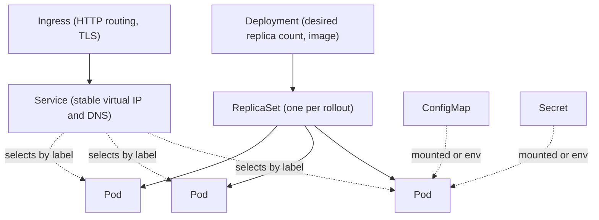

# Kubernetes for engineers who must use it

## Why this matters

It's a Tuesday afternoon. You ship a config change, the deploy goes green in CI, and ten minutes later your service is throwing 503s for one request in three. The pods are `Running`. The logs look fine. `kubectl get pods` shows three replicas, all healthy. You stare at the dashboard while the on-call channel fills up.

Someone asks: "Did the readiness probe pass on the new pods?" You run `kubectl describe pod` and see it — the new pods are `Running` but not `Ready`, because the readiness probe hits `/healthz` and your config change moved the health endpoint to `/health`. Kubernetes, doing exactly what you told it, has kept the old pods in the Service's endpoint list and is sending a third of traffic to new pods that aren't actually serving. The fix is one line in a YAML file. The cost of not knowing where Kubernetes draws the line between "the process started" and "the process is ready for traffic" was a chunk of degraded service and a postmortem.

That's the gap this chapter closes. Most application engineers don't run Kubernetes — they run *on* it, and the platform team owns the cluster. But the boundary between "your problem" and "platform's problem" runs straight through a handful of objects you edit every week: Deployments, Services, ConfigMaps, Secrets, probes, and resource limits. You don't need to know how the scheduler bin-packs nodes or how etcd reaches consensus. You need a correct mental model of the dozen objects you touch, and you need to know what each one does when it's wrong. The engineers who treat Kubernetes as a YAML-shaped black box live in fear of every deploy. The ones who understand the reconciliation loop and the object graph debug a bad rollout in two `kubectl describe` calls. This chapter is that bridge.

## Mental model

Kubernetes is a control loop over declared state. You write down what you *want* — "five replicas of this image, reachable on port 8080, with these env vars" — and a set of controllers continuously works to make the cluster's actual state match. You never imperatively say "start a container." You declare a desired state, and the system reconciles toward it, forever, including after a node dies at 3 a.m. while you sleep.

The objects you touch daily form a layered graph. Each layer creates and owns the one below it:



Read the graph top to bottom and the whole system clicks into place:

- A **Pod** is the smallest unit you deploy: one or more containers that share a network namespace (same `localhost`, same IP) and storage. Pods are disposable. They get a random IP, they die, they get replaced with a new IP. You almost never create a Pod directly.
- A **ReplicaSet** keeps N identical pods running. If one dies, it makes another. You almost never create one of these directly either.
- A **Deployment** manages ReplicaSets to give you rolling updates. Change the image, and the Deployment creates a new ReplicaSet, scales it up while scaling the old one down, and gives you rollback. This is the object you actually write.
- A **Service** gives the disposable, ever-changing set of pods a single stable virtual IP and DNS name. It finds its pods by **label selector**, not by name — the indirection that makes the whole thing work.
- An **Ingress** routes external HTTP(S) traffic to Services by host and path, and terminates TLS.

The two ideas that explain most of Kubernetes behavior: **everything is reconciled** (the gap between desired and actual is closed continuously, not once), and **everything connects by labels** (Services find pods, Deployments find their pods, network policies select pods — all by matching `key: value` labels, never by hardcoded identity). Hold those two ideas and the object graph stops being a maze.

One more distinction worth burning in early, because it explains why "the pod is up but nothing works" is so common: Kubernetes separates *scheduled* (the scheduler placed the pod on a node), *Running* (the container process started), and *Ready* (the readiness probe passed, so the pod is in its Service's endpoint list). A pod can be `Running` for minutes while serving zero real traffic because it never went `Ready`. The opening incident lives entirely in the gap between those last two states.

## In practice

Let's deploy a real service and wire up every object you'll touch. Assume a container image `ghcr.io/acme/web:1.4.0` that listens on 8080 and reads config from the environment.

### A Deployment

```yaml
# deployment.yaml
apiVersion: apps/v1
kind: Deployment
metadata:
  name: web
  labels:
    app: web
spec:
  replicas: 3
  selector:
    matchLabels:
      app: web            # which pods this Deployment owns
  template:
    metadata:
      labels:
        app: web          # MUST match the selector above
    spec:
      containers:
        - name: web
          image: ghcr.io/acme/web:1.4.0
          ports:
            - containerPort: 8080
          resources:
            requests:
              cpu: "100m"     # 0.1 of a core, guaranteed
              memory: "128Mi"
            limits:
              cpu: "500m"     # throttled above this
              memory: "256Mi" # OOM-killed above this
          readinessProbe:
            httpGet:
              path: /health
              port: 8080
            initialDelaySeconds: 5
            periodSeconds: 10
          livenessProbe:
            httpGet:
              path: /health
              port: 8080
            initialDelaySeconds: 15
            periodSeconds: 20
```

Apply it and watch the reconciliation happen:

```bash
$ kubectl apply -f deployment.yaml
deployment.apps/web created
$ kubectl get pods -l app=web
NAME                   READY   STATUS    RESTARTS   AGE
web-7d9f8c6b5-2xk4p    1/1     Running   0          18s
web-7d9f8c6b5-9wq7t    1/1     Running   0          18s
web-7d9f8c6b5-lm3vz    1/1     Running   0          18s
```

The `7d9f8c6b5` segment is the ReplicaSet hash; the Deployment created it for you. `READY 1/1` means one container in the pod, passing its readiness probe. The relationship is strict: a Deployment owns ReplicaSets, a ReplicaSet owns Pods, and ownership is recorded in each child's `metadata.ownerReferences`. Delete the Deployment and the cascade tears down everything below it. This ownership chain is also why you edit the Deployment, never the Pod — edit a Pod by hand and the ReplicaSet will happily reconcile your change away.

### Requests, limits, and probes — the parts that bite

These four fields cause most production incidents, so be precise about what they mean.

**Requests** are what the scheduler uses to place a pod. A pod requesting `100m` CPU and `128Mi` memory will only land on a node with that much free. Requests are a *guarantee*: the pod always gets at least this much, and they are the basis for the pod's Quality-of-Service class (a pod with requests equal to limits on every resource is `Guaranteed` and is evicted last under node pressure).

**Limits** are the ceiling. CPU over the limit is *throttled* — your process slows down but survives. Memory over the limit is fatal: the kernel OOM-kills the container and Kubernetes restarts it. This asymmetry matters. An under-set memory limit shows up as mysterious `CrashLoopBackOff` with exit code 137 (128 + SIGKILL 9).

**Readiness** controls traffic: a pod that fails its readiness probe is removed from the Service's endpoints but is *not* restarted. **Liveness** controls life: a pod that fails its liveness probe is *killed and restarted*. The opening scenario was a readiness bug — the pods stayed alive but should have been pulled from rotation.

The single most common probe mistake is pointing liveness at an endpoint that depends on a database. The DB hiccups, every pod fails liveness simultaneously, Kubernetes restarts the entire fleet, and now you have a thundering herd reconnecting to an already-struggling database. Liveness should answer "is this process wedged?" — nothing more. Readiness can check dependencies; liveness must not. For apps that take a while to boot, add a `startupProbe`: it suspends the liveness probe until the app has come up once, so a legitimately slow start doesn't get mistaken for a wedged process and restarted in a loop.

### Config and secrets

Never bake configuration into the image. Inject it.

```yaml
# config.yaml
apiVersion: v1
kind: ConfigMap
metadata:
  name: web-config
data:
  LOG_LEVEL: "info"
  FEATURE_NEW_CHECKOUT: "true"
---
apiVersion: v1
kind: Secret
metadata:
  name: web-secrets
type: Opaque
stringData:
  DATABASE_URL: "postgres://app:s3cr3t@db:5432/app"
```

Wire them into the container:

```yaml
# container env wiring (inside spec.template.spec.containers[0])
envFrom:
  - configMapRef:
      name: web-config
env:
  - name: DATABASE_URL
    valueFrom:
      secretKeyRef:
        name: web-secrets
        key: DATABASE_URL
```

A blunt but load-bearing fact: a Kubernetes `Secret` is only base64-encoded, not encrypted, in its default form. Anyone with read access to Secrets in the namespace can decode it instantly, and unless your cluster has [encryption at rest](https://kubernetes.io/docs/tasks/administer-cluster/encrypt-data/) enabled, it sits in etcd in plaintext. Treat the `Secret` object as an access-control boundary (gated by RBAC), not as cryptographic protection. One subtlety that surprises people: env vars sourced from a ConfigMap or Secret are read once at container start, so editing the underlying object does *not* update a running pod — you need a rollout to pick up the change. Mounted volumes, by contrast, are eventually updated in place.

### A Service and an Ingress

```yaml
# service.yaml
apiVersion: v1
kind: Service
metadata:
  name: web
spec:
  selector:
    app: web              # routes to any pod with this label
  ports:
    - port: 80            # the Service's port
      targetPort: 8080    # the container's port
---
apiVersion: networking.k8s.io/v1
kind: Ingress
metadata:
  name: web
  annotations:
    cert-manager.io/cluster-issuer: letsencrypt-prod
spec:
  rules:
    - host: app.acme.com
      http:
        paths:
          - path: /
            pathType: Prefix
            backend:
              service:
                name: web
                port:
                  number: 80
  tls:
    - hosts: [app.acme.com]
      secretName: web-tls
```

The Service gets a DNS name (`web.<namespace>.svc.cluster.local`) that other pods resolve. The Ingress sends `app.acme.com` to it from the outside world. Note the indirection: the Service never references a pod by name. It selects `app: web`, so when the Deployment rolls pods in and out, the Service's endpoint list updates automatically. Internally, the Service tracks a separate `Endpoints` (or `EndpointSlice`) object that the control plane keeps in sync with the set of `Ready` pods matching the selector — that object is the real source of truth for "where does traffic go," and it's the first thing to inspect when a Service appears to route nowhere.

### Watching a rollout and rolling back

```bash
$ kubectl set image deployment/web web=ghcr.io/acme/web:1.5.0
deployment.apps/web image updated
$ kubectl rollout status deployment/web
Waiting for deployment "web" rollout to finish: 1 out of 3 new replicas have been updated...
deployment "web" successfully rolled out
$ kubectl rollout undo deployment/web   # back to the previous ReplicaSet
deployment.apps/web rolled back
```

The Deployment keeps old ReplicaSets around precisely so `rollout undo` is instant — it just scales the previous ReplicaSet back up. This is the same idea as the reflog from the Git internals chapter: the system retains prior states so recovery is a pointer change, not a rebuild. The number of old ReplicaSets retained is governed by `spec.revisionHistoryLimit`; set it too low and you lose the ability to roll back more than a step or two.

### RBAC: the permission you'll actually request

You'll meet RBAC the day your CI pipeline's service account gets `Error from server (Forbidden)`. RBAC has four objects: a `Role` (namespaced permissions) or `ClusterRole` (cluster-wide), and a `RoleBinding`/`ClusterRoleBinding` that grants those permissions to a subject (user, group, or ServiceAccount).

```yaml
# rbac.yaml — let a deploy bot manage Deployments in 'staging' only
apiVersion: rbac.authorization.k8s.io/v1
kind: Role
metadata:
  namespace: staging
  name: deployer
rules:
  - apiGroups: ["apps"]
    resources: ["deployments"]
    verbs: ["get", "list", "watch", "create", "update", "patch"]
---
apiVersion: rbac.authorization.k8s.io/v1
kind: RoleBinding
metadata:
  namespace: staging
  name: ci-deployer
subjects:
  - kind: ServiceAccount
    name: ci-bot
    namespace: staging
roleRef:
  kind: Role
  name: deployer
  apiGroup: rbac.authorization.k8s.io
```

That grants `ci-bot` exactly the verbs it needs on exactly one resource type in exactly one namespace. RBAC is additive and deny-by-default: there is no "deny" rule, only the absence of a grant. Check what an account can do with `kubectl auth can-i`:

```bash
$ kubectl auth can-i create deployments --namespace staging \
    --as system:serviceaccount:staging:ci-bot
yes
$ kubectl auth can-i delete secrets --namespace production \
    --as system:serviceaccount:staging:ci-bot
no
```

### The three commands that debug almost everything

```bash
$ kubectl describe pod web-7d9f8c6b5-2xk4p    # events: scheduling, pulls, probe failures
$ kubectl logs web-7d9f8c6b5-2xk4p --previous  # logs from the crashed container
$ kubectl get events --sort-by=.lastTimestamp  # cluster-wide recent history
```

`describe` shows the Events list at the bottom — "Liveness probe failed," "Back-off restarting failed container," "Insufficient memory." That Events block answers most "why won't this pod start?" questions before you ever read application logs. The `--previous` flag on `logs` is the one most people forget: when a pod is in `CrashLoopBackOff`, the current container has barely started, and the logs you actually want are from the instance that just died.

## Pitfalls and anti-patterns

**1. Liveness probes that check dependencies.** *Recognize it:* every pod restarts at once whenever a downstream (DB, cache, third-party API) blips, turning a minor dependency hiccup into a full outage. *Fix it:* liveness checks only "is my own event loop alive?" Put dependency checks in the readiness probe, which pulls a pod from rotation without killing it. Add a `startupProbe` for slow-booting apps so liveness doesn't fire during a legitimately long startup.

**2. No resource requests, or limits equal to requests on memory but not CPU.** *Recognize it:* pods get scheduled onto already-saturated nodes and get throttled or evicted; or one tenant's runaway pod starves its neighbors. *Fix it:* always set memory requests *and* limits (memory can't be compressed; an over-limit pod must die). Set CPU requests for guaranteed scheduling, and be cautious with hard CPU limits — they throttle and add latency. Many teams set CPU requests but leave CPU limits off deliberately.

**3. Mutable image tags like `:latest`.** *Recognize it:* two pods of the "same" Deployment run different code because they pulled `:latest` at different times; rollbacks don't actually roll back. *Fix it:* deploy immutable, content-addressable tags (a semver or a Git SHA, e.g. `web:1.5.0` or `web:sha-a3f5c2`) and set `imagePullPolicy: IfNotPresent`. This is the same lesson as content-addressable storage in Git and Docker layers — identity should follow content.

**4. Treating Secrets as encrypted.** *Recognize it:* secrets committed to a Git repo as plain Secret manifests, or assumed safe because they're base64. *Fix it:* enable etcd encryption at rest, gate Secrets with tight RBAC, and use an external secrets store (External Secrets Operator pulling from Vault, AWS Secrets Manager, or SOPS-encrypted manifests) so plaintext never lands in your repo or your CI logs.

**5. Selector and template labels that drift apart.** *Recognize it:* `kubectl apply` errors with `selector does not match template labels`, or a Service routes to zero endpoints. *Fix it:* the Deployment's `spec.selector.matchLabels` and `spec.template.metadata.labels` must agree, and the Service's selector must match the pod labels. When a Service has no endpoints, `kubectl get endpoints <name>` showing `<none>` is the tell — it's almost always a label mismatch.

## Production checklist

- [ ] Every container sets memory **requests and limits**, and CPU **requests** (CPU limits considered deliberately, not by default)
- [ ] **Readiness** probe gates traffic; **liveness** probe checks only the process, never downstream dependencies; `startupProbe` for slow boots
- [ ] Images pinned to **immutable tags** (semver or Git SHA), never `:latest`
- [ ] Config in **ConfigMaps**, secrets in **Secrets** (or an external secret store); nothing sensitive baked into the image
- [ ] etcd **encryption at rest** enabled, and Secrets access scoped by RBAC
- [ ] Each workload runs under a **dedicated ServiceAccount** with a least-privilege Role, not the namespace `default`
- [ ] Deployment sets `replicas >= 2` and a **PodDisruptionBudget** so node drains don't take the service to zero
- [ ] A **NetworkPolicy** restricting ingress/egress to only required peers (default-deny baseline)
- [ ] Pod **`securityContext`**: `runAsNonRoot: true`, `readOnlyRootFilesystem: true`, dropped Linux capabilities
- [ ] `kubectl rollout undo` verified to work, and Deployment `revisionHistoryLimit` set high enough to roll back

## Exercises

1. **(Comprehension)** Deploy the `web` Deployment and Service above into a local cluster (`kind` or `minikube`). Then run `kubectl get endpoints web` and explain, in terms of label selectors, why the endpoint list contains exactly the pod IPs it does. Now edit the pod template's `app: web` label to `app: web2` and re-apply. Predict what happens to the Service's endpoints before you check, then verify.

2. **(Applied)** Reproduce the opening incident. Give the Deployment a readiness probe pointing at `/healthz` while the app serves health on `/health`. Roll out the change, then use `kubectl describe pod` and `kubectl get endpoints` to confirm the new pods are `Running` but not `Ready` and absent from the Service. Fix the path, roll out, and watch the endpoint list repopulate. Bonus: trigger an OOM kill by setting a `64Mi` memory limit on a process that allocates more, and identify the exit code in `kubectl describe`.

3. **(Design)** Your platform team hands every app team a single shared namespace and cluster-admin on it. Design a multi-tenant scheme that gives each team isolation without a cluster per team. Address: namespace-per-team, RBAC Roles scoped per namespace, ResourceQuotas and LimitRanges to prevent one team starving others, NetworkPolicies for tenant isolation, and how CI service accounts get scoped credentials. State which boundary you'd enforce first and what attack or accident it prevents.

## Further reading

- [Kubernetes documentation — Concepts](https://kubernetes.io/docs/concepts/) — the canonical reference; the Workloads, Services, and Configuration sections map directly to this chapter
- Brendan Burns, Brian Grant, et al., ["Borg, Omega, and Kubernetes"](https://research.google/pubs/pub44843/) (ACM Queue, 2016) — the design lineage and the reconciliation philosophy from the people who built it
- [Kubernetes Configuration Best Practices](https://kubernetes.io/docs/concepts/configuration/overview/) — official guidance on labels, images, and resource settings
- [Configure Liveness, Readiness and Startup Probes](https://kubernetes.io/docs/tasks/configure-pod-container/configure-liveness-readiness-startup-probes/) — the definitive probe reference; read it before you write your next probe
- [Using RBAC Authorization](https://kubernetes.io/docs/reference/access-authn-authz/rbac/) — the full RBAC model, including aggregation and the built-in roles
- [Encrypting Confidential Data at Rest](https://kubernetes.io/docs/tasks/administer-cluster/encrypt-data/) — how to stop storing Secrets as plaintext in etcd

> **Connect the dots:** The image you deploy here is built in the Docker chapter (Part 8, ch. 2) and the YAML you `kubectl apply` should itself be produced and deployed by a pipeline from the CI/CD chapter (ch. 4) — never `kubectl apply` from a laptop in production. The cluster, its node pools, and its IAM bindings are themselves declared as Terraform (ch. 5), so the same "declare desired state, let a controller reconcile" idea runs one layer down from Kubernetes itself.

> **Security note:** Apply least privilege at every layer. Give each workload a dedicated ServiceAccount with a Role granting only the verbs and resources it needs, never cluster-admin and never the `default` ServiceAccount. Run containers as non-root with `readOnlyRootFilesystem: true` and all Linux capabilities dropped. Treat Secrets as an RBAC-gated boundary, not encryption — enable etcd encryption at rest and pull real secrets from an external store so plaintext never reaches Git or CI logs. Default-deny network traffic with a baseline NetworkPolicy and open only the specific pod-to-pod and egress paths each service requires. Scan every image for known CVEs in CI and block deploys on critical findings; a pinned, scanned, minimal base image is your cheapest defense.
