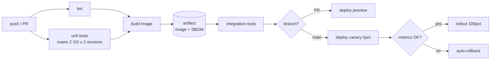

# CI/CD pipelines that don't rot

## Why this matters

It's a Tuesday afternoon. A hotfix needs to ship — a one-line change to a payment timeout that's costing the company real money every minute it's wrong. The fix takes ninety seconds to write. Then someone opens the pull request and the pipeline starts: a few minutes to provision a runner, several more because the dependency cache key changed last week and nobody noticed, so every job reinstalls from scratch, then a long test suite where a stubborn fraction of the tests are flaky and one of them fails on this run for no reason. Someone clicks "re-run failed jobs." The clock runs again. The one-line fix ships well over half an hour after it was written, and that's a good day.

This is pipeline rot, and it is the default end state of every CI/CD system that isn't actively maintained. It doesn't arrive as a single failure. It accumulates: a cache that silently stopped hitting, a test nobody trusts, a deploy step that "usually works," a sprawling YAML file that three people understand and everyone else is afraid to touch. Each addition is reasonable. The sum is a pipeline that's slow enough to discourage small commits and flaky enough that a red build no longer means "something is broken" — it means "try again."

A pipeline's entire job is to answer one question fast and honestly: *is this change safe to ship?* When it's slow, people batch changes, which makes failures harder to bisect. When it's flaky, people ignore red, which means real failures slip through. Speed and trust are not nice-to-haves; they are the product. This chapter is about building pipelines that stay fast and stay trustworthy as the codebase grows tenfold — pipelines that don't rot.

## Mental model

A CI/CD pipeline is a directed acyclic graph of jobs. Each job is a pure-ish function: it takes inputs (source at a commit, cached dependencies, artifacts from upstream jobs) and produces outputs (a test result, a built artifact, a deployment). The two properties that keep a pipeline healthy map directly onto that graph:

- **Speed** comes from the graph's *shape* — maximizing what runs in parallel, minimizing what runs at all (cache hits, change-detection), and keeping the critical path short.
- **Trust** comes from each job being *deterministic* — same inputs, same result, every time. Flakiness is just hidden non-determinism: a test that depends on wall-clock time, a shared database, the network, or test ordering.



Read the graph left to right. Cheap, fast checks (lint) gate nothing downstream and fail in seconds. The build runs once and emits an immutable artifact that every later stage consumes — you build once and promote the same bytes through every environment, never rebuilding per stage. Deployment is a fork in the graph keyed on the branch: pull requests get an ephemeral preview, `main` gets a progressive rollout guarded by a metrics check that can reverse itself.

The single most important rule lives in that artifact node: **build once, deploy many.** If staging tests a different binary than production runs, your tests proved nothing about production. The artifact is the contract between CI (which proves the artifact is good) and CD (which moves that exact artifact toward users).

One more property falls out of the graph view: the cheapest job to run is the one that doesn't run. Change-detection — only running the database integration suite when something under `db/` changed, only rebuilding the frontend when `web/` changed — keeps the critical path proportional to the size of the change, not the size of the repo. In a monorepo this is the difference between a thirty-second pull request check and a thirty-minute one. The graph makes this legible: prune the edges that this commit can't possibly have affected, and the remaining subgraph is all you owe the contributor.

## In practice

We'll use GitHub Actions because it's the most common, but every concept here — matrices, caching, artifacts, environments, progressive delivery — has a direct equivalent in GitLab CI, CircleCI, and Buildkite. The vocabulary changes; the graph does not.

### Pipeline as code, and a fast-feedback first job

Everything lives in `.github/workflows/`, versioned with the code it builds. The first job should be the cheapest gate so contributors get a red X in under a minute when they forget to format.

```yaml
# .github/workflows/ci.yml
name: ci
on:
  push:
    branches: [main]
  pull_request:

# Cancel superseded runs on the same ref — don't waste runners on stale commits.
concurrency:
  group: ci-${{ github.ref }}
  cancel-in-progress: true

permissions:
  contents: read   # least privilege by default; widen per-job only where needed

jobs:
  lint:
    runs-on: ubuntu-latest
    steps:
      - uses: actions/checkout@v4
      - uses: actions/setup-node@v4
        with:
          node-version: "22"
          cache: npm           # built-in dependency cache, keyed on package-lock.json
      - run: npm ci
      - run: npm run lint
      - run: npm run format:check
```

Two details earn their keep. `concurrency` with `cancel-in-progress` kills the previous run when you push a fixup commit, so you're not paying for runs whose result no longer matters. `permissions: contents: read` strips the default broad token down to read-only; jobs that need more (publishing a package, deploying) opt in explicitly.

### Build matrices: test the real support surface

If you claim to support Node 20 and 22 on Linux and macOS, you must run the suite on all four combinations. A matrix expands one job definition into the cross-product.

```yaml
  test:
    needs: lint
    runs-on: ${{ matrix.os }}
    strategy:
      fail-fast: false        # one failing cell shouldn't cancel the others
      matrix:
        os: [ubuntu-latest, macos-latest]
        node: ["20", "22"]
        include:
          - os: ubuntu-latest
            node: "22"
            coverage: true     # collect coverage on exactly one cell
    steps:
      - uses: actions/checkout@v4
      - uses: actions/setup-node@v4
        with:
          node-version: ${{ matrix.node }}
          cache: npm
      - run: npm ci
      - run: npm test
      - if: matrix.coverage
        run: npm run coverage && npm run coverage:upload
```

`fail-fast: false` matters for trust: when a Node-20-only bug appears, you want to see that it's *only* Node 20, not have the run cancelled the instant the first cell goes red. Collect expensive side artifacts (coverage) on a single representative cell, not all four — coverage from the same source on four runtimes tells you nothing extra and quadruples the upload.

### Caching that actually hits

A cache that always misses is slower than no cache — you pay to download and unpack nothing useful. The cache key is the whole game. Key on the lockfile hash so the cache invalidates exactly when dependencies change, and use a `restore-keys` prefix so a near-miss still restores a recent cache instead of starting cold.

```yaml
      - uses: actions/cache@v4
        with:
          path: |
            ~/.npm
            node_modules
          key: ${{ runner.os }}-node${{ matrix.node }}-${{ hashFiles('**/package-lock.json') }}
          restore-keys: |
            ${{ runner.os }}-node${{ matrix.node }}-
```

The `key` is an exact-match lookup; the `restore-keys` are ordered prefixes tried only on a miss. So when you bump one dependency, the lockfile hash changes and the exact key misses — but the prefix `ubuntu-latest-node22-` still matches the previous cache, so you restore yesterday's `node_modules` and `npm ci` only has to reconcile the delta. That partial hit is the difference between a cold install and a warm one.

For Docker builds, cache layers explicitly. BuildKit can export its layer cache to the registry so the *next* build on a fresh runner reuses layers it never built:

```yaml
  build:
    needs: test
    runs-on: ubuntu-latest
    permissions:
      contents: read
      packages: write           # widened only for this job, to push the image
      id-token: write           # OIDC, so we never store a long-lived registry secret
    steps:
      - uses: actions/checkout@v4
      - uses: docker/setup-buildx-action@v3
      - uses: docker/login-action@v3
        with:
          registry: ghcr.io
          username: ${{ github.actor }}
          password: ${{ secrets.GITHUB_TOKEN }}
      - uses: docker/build-push-action@v6
        with:
          push: true
          tags: ghcr.io/${{ github.repository }}:${{ github.sha }}
          cache-from: type=registry,ref=ghcr.io/${{ github.repository }}:buildcache
          cache-to: type=registry,ref=ghcr.io/${{ github.repository }}:buildcache,mode=max
```

Note the tag: `${{ github.sha }}`, not `latest`. The image is named by the immutable commit that produced it. That's how "build once, deploy many" becomes enforceable — every later stage references this exact digest.

### Artifacts: the contract between CI and CD

The build job produced an image in a registry. Anything not in a registry (test reports, an SBOM, a compiled binary) travels between jobs as an artifact.

```yaml
      - run: syft ghcr.io/${{ github.repository }}:${{ github.sha }} -o spdx-json > sbom.json
      - uses: actions/upload-artifact@v4
        with:
          name: sbom
          path: sbom.json
          retention-days: 30
```

A downstream job retrieves it with `actions/download-artifact`. Keep retention short — artifacts are debugging aids and supply-chain evidence, not a file store, and they bill by gigabyte-day.

### Deploy strategies: rolling, blue-green, canary

Once CI has blessed an artifact, CD moves it toward users. The three canonical strategies trade off speed of rollback against infrastructure cost.

| Strategy | How it works | Rollback | Cost | Use when |
|---|---|---|---|---|
| **Rolling** | Replace instances N at a time | Roll forward / re-deploy old | 1x | Default for stateless services |
| **Blue-green** | Stand up full new env, flip the router | Flip router back (instant) | 2x during deploy | Fast, atomic rollback matters |
| **Canary** | Send a small percent of traffic to the new version, watch metrics, ramp | Route 0 percent to canary | ~1x plus a little | High-traffic, want real-user signal before full commit |

Rolling is the Kubernetes default and the right starting point. Here's an explicit rolling `Deployment` that stays available throughout:

```yaml
spec:
  strategy:
    type: RollingUpdate
    rollingUpdate:
      maxUnavailable: 0     # never drop below desired capacity
      maxSurge: 1           # add one extra pod at a time
```

Blue-green trades cost for an instant, atomic switch. You run the new version (green) at full scale alongside the old (blue), run smoke tests against green while no real traffic touches it, then flip the router in one move. Rollback is the same flip in reverse, which is its whole appeal: there is no partial state to unwind. The price is running two full copies for the duration of the cutover, which is why it suits services where a botched rollback is more expensive than double the compute for a few minutes.

Canary is where progressive delivery earns its name: you don't trust the new version, so you give it a small slice of traffic and let production metrics vote. A controller like Argo Rollouts or Flagger automates the ramp-and-watch loop:

```yaml
# Argo Rollouts: ramp traffic, pause to evaluate metrics at each step
apiVersion: argoproj.io/v1alpha1
kind: Rollout
metadata:
  name: payments-api
spec:
  strategy:
    canary:
      steps:
        - setWeight: 5
        - pause: { duration: 5m }
        - analysis:
            templates:
              - templateName: error-rate   # query Prometheus; abort if too high
        - setWeight: 50
        - pause: { duration: 5m }
        - setWeight: 100
```

The `analysis` step is the difference between a canary and "deploying slowly." It queries your metrics backend (error rate, p99 latency) and *automatically aborts and rolls back* if the new version is worse. Without an automated quality gate, a canary just delays the outage until a higher weight. The deploy job in CD triggers this and then watches:

```yaml
  deploy:
    needs: build
    if: github.ref == 'refs/heads/main'
    runs-on: ubuntu-latest
    environment: production    # GitHub environment: required reviewers, secrets scoping
    permissions:
      id-token: write          # OIDC into AWS — no static cloud keys in CI
      contents: read
    steps:
      - uses: aws-actions/configure-aws-credentials@v4
        with:
          role-to-assume: arn:aws:iam::123456789012:role/deploy-payments
          aws-region: us-east-1
      - run: |
          kubectl set image deployment/payments-api \
            app=ghcr.io/${{ github.repository }}:${{ github.sha }}
          kubectl argo rollouts status payments-api --watch --timeout 600s
```

The GitHub `environment: production` gives you required-reviewer approval gates and scopes deploy secrets so they're unreachable from PR builds. The OIDC role assumption means CI holds *no* long-lived AWS keys — GitHub mints a short-lived token per run, and the `--watch` keeps the CI job alive and red until the rollout actually succeeds, so a failed canary fails the pipeline instead of leaving a half-shipped release behind.

## Pitfalls and anti-patterns

**The flaky-test tolerance spiral.** It starts with one test that fails intermittently. Everyone learns to click "re-run." Now a red build means nothing, so a second flaky test slips in, then a tenth, and eventually a *real* regression hides in the noise and ships. *Recognize it* when your team's muscle memory is "re-run failed jobs" rather than "read the failure." *Fix it* by quarantining: move known-flaky tests into a separate non-blocking lane the instant they're identified, track them as bugs with an owner, and keep the main suite at zero tolerance — one flake, it gets quarantined the same day. A green build must mean *safe to ship* or it means nothing.

**Rebuilding the artifact per environment.** A pipeline that runs `docker build` for the staging deploy and again for production has tested a binary that no human will ever run in prod. Subtle differences (a base image that moved, a transitive dependency version, a build-time env var) mean your staging sign-off is fiction. *Recognize it* when the same commit produces different image digests for staging and prod. *Fix it* by building exactly once, tagging by commit SHA, and having every deploy stage reference that digest. Promote bytes, not source.

**`latest` tags and other mutable references.** Deploying `myapp:latest` means you cannot answer "what is running in production right now?" and you cannot reproduce an incident, because the tag has moved since. *Recognize it* in any manifest or compose file pinning `:latest` or a floating major version. *Fix it* by pinning to immutable identifiers — image digests (`@sha256:...`) for what you deploy, full SHAs for actions (`actions/checkout@<sha>` rather than `@v4` if you're security-strict). Mutable tags are convenient until the one afternoon they aren't.

**The monolithic workflow.** A single YAML file with copy-pasted setup blocks across a dozen jobs rots because every change risks every job, and nobody refactors out of fear. *Recognize it* by duplicated `setup-node`/checkout/cache blocks and a file long enough that you scroll to find anything. *Fix it* by extracting repeated steps into a composite action (`.github/actions/setup/action.yml`) or a reusable workflow (`workflow_call`), so setup is defined once and called everywhere. Treat pipeline code like application code: keep it DRY, reviewed, and refactored.

**Secrets baked into images or logs.** Passing a secret as a Docker `--build-arg` writes it into an image layer, where `docker history` reveals it forever. Echoing a variable for debugging prints it to a build log that anyone with read access can see. *Recognize it* with image scanning (Trivy, Grype) and secret scanners (gitleaks) wired into CI — they'll flag it. *Fix it* by injecting secrets only at *runtime* via the orchestrator's secret mechanism, using BuildKit secret mounts (`--mount=type=secret`) for build-time needs so nothing persists in a layer, and never logging the value of anything from `secrets.*`.

## Production checklist

- [ ] Pipeline definition lives in the repo, versioned and code-reviewed like application code
- [ ] First job is a sub-minute fast gate (lint/format) so obvious mistakes fail fast
- [ ] `concurrency` with `cancel-in-progress` cancels superseded runs on the same ref
- [ ] Dependency cache keyed on the lockfile hash, with a `restore-keys` prefix for near-misses
- [ ] Docker layer cache exported to the registry (`cache-to`/`cache-from`)
- [ ] Build runs exactly once; the artifact is tagged by commit SHA and promoted unchanged through every environment
- [ ] Test matrix covers every OS/runtime version you publicly claim to support, with `fail-fast: false`
- [ ] Zero tolerance for flaky tests in the blocking suite; flakes quarantined same-day with an owner
- [ ] `permissions:` defaults to `contents: read`; each job widens scope explicitly
- [ ] No static cloud credentials in CI — OIDC short-lived tokens to assume deploy roles
- [ ] Production deploys gated behind a GitHub environment with required reviewers
- [ ] Progressive delivery (canary/blue-green) with an automated metrics gate that can self-rollback
- [ ] Image scanning (Trivy/Grype) and secret scanning (gitleaks) run on every build and block on findings
- [ ] An SBOM is generated and retained per release for supply-chain traceability
- [ ] Total PR pipeline wall-clock time tracked as a metric and budgeted against a target you actually enforce

## Exercises

1. **(Comprehension)** Given the `ci.yml` above, draw the job dependency graph and identify the critical path — the longest chain of `needs` from trigger to deploy. Walking that chain, which job sits on the critical path and which runs in parallel off to the side? If `test` is the slowest job on the path, which single job would you optimize first to shorten time-to-deploy, and why is optimizing a job *not* on the critical path a waste of effort?

2. **(Applied)** Take a workflow with a cache that always misses (the key includes `${{ github.sha }}`, which changes every commit). Rewrite the key so the cache invalidates only when dependencies change, add a `restore-keys` fallback, and verify with two consecutive runs that the second is a cache hit. Then add a build-matrix dimension and confirm each matrix cell gets its own correctly-scoped cache rather than colliding on one shared key.

3. **(Design)** Your team deploys a high-traffic payments API many times a day and has been burned by a deploy that passed all tests but caused a latency regression only visible under production load. Design a progressive-delivery pipeline that catches this automatically: pick a strategy (canary vs. blue-green), define the metrics that gate each ramp step, set the abort thresholds and bake times, and specify exactly what happens on a failed analysis. State your tradeoffs — how do you balance rollout speed against the time a metrics signal needs to become statistically meaningful?

## Further reading

- *Continuous Delivery*, Jez Humble and David Farley — the foundational text; the "build once, promote the artifact" principle and the deployment pipeline pattern originate here.
- [GitHub Actions documentation](https://docs.github.com/en/actions) — official reference for workflows, matrices, caching, reusable workflows, and OIDC.
- [Argo Rollouts documentation](https://argo-rollouts.readthedocs.io/) — progressive delivery (canary, blue-green) with metric-based analysis on Kubernetes.
- Martin Fowler, ["BlueGreenDeployment"](https://martinfowler.com/bliki/BlueGreenDeployment.html) and ["CanaryRelease"](https://martinfowler.com/bliki/CanaryRelease.html) — concise canonical definitions of the two strategies.
- [SLSA framework](https://slsa.dev/) — supply-chain levels for software artifacts; how SBOMs, provenance, and build integrity fit together.
- [Security hardening with OpenID Connect](https://docs.github.com/en/actions/security-for-github-actions/security-hardening-your-deployments/about-security-hardening-with-openid-connect) — eliminating long-lived cloud secrets from CI.

> **Connect the dots:** The artifact your pipeline promotes is the Docker image from Part 8's "Docker beyond `docker run`" — its layer cache is what makes builds fast, and its immutable digest is what makes "build once, deploy many" enforceable. The deploy target is the Kubernetes `Deployment` from the orchestration chapter, and the OIDC role you assume is governed by the IAM trust policy from "AWS, the working subset." CI/CD is the seam that stitches those chapters into a shipping system.

> **Security note:** A CI runner is one of the most attractive targets in your infrastructure — it can read source, holds deploy credentials, and pushes to production. Apply least privilege ruthlessly: default the workflow token to `contents: read` and widen per-job; never store long-lived cloud keys — use OIDC to mint short-lived ones scoped to a specific repo and branch via the IAM trust policy's `sub` condition; scope deploy secrets to a protected `environment` so pull-request builds from forks can never reach them. Pin third-party actions to a full commit SHA, not a tag, because a tag can be re-pointed at malicious code. Scan every image (Trivy/Grype) and every commit (gitleaks) and block the pipeline on findings. Inject secrets at runtime or via BuildKit secret mounts — never as build args, which persist in image layers, and never echoed to logs.
