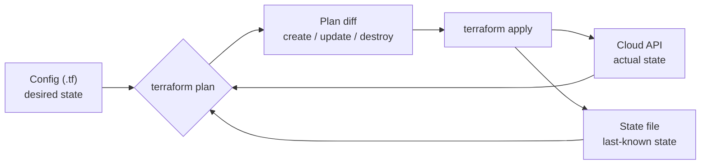

# Infrastructure as code with Terraform

## Why this matters

It's a Tuesday afternoon and the staging RDS instance is on fire. Connections are maxed out, the app is throwing timeouts, and someone three weeks ago "just bumped the instance class in the console to unblock a demo." Nobody wrote it down. The Terraform that supposedly manages this database still says `db.t3.medium`, the console says `db.r5.large`, and now you're staring at a `terraform plan` that wants to *shrink it back down* in the middle of an incident. Which one is the truth? Neither. They've diverged, and the gap between them is where outages live.

This is the cost of clickops: every manual change in a cloud console is an undocumented, unreviewed, unreproducible mutation to production. It works until the person who made the change leaves, or until you need to stand up an identical environment, or until 2 a.m. when you need to know *exactly* what is deployed and the only honest answer is "let me click through forty screens and find out." A team running ten engineers on clickops doesn't have one infrastructure — it has ten slightly different mental models of one infrastructure, and they disagree.

Infrastructure as code closes that gap. The desired state of your infrastructure becomes a file in Git: reviewable in a pull request, diffable against reality, reproducible across environments, and recoverable when someone fat-fingers a delete. Terraform is the most widely deployed tool for this because it's declarative, cloud-agnostic in shape, and built around a single load-bearing idea: a *plan* you read before you *apply*. This chapter is about making that plan trustworthy.

## Mental model

Terraform's job is to make the world match your code. You write the *desired state* (HCL config), Terraform records the *last-known state* (a state file), and on every run it reads the *actual state* (the real cloud API) and computes the diff. The plan is that three-way reconciliation made visible before anything changes.



Three concepts carry almost all the weight:

- **Resource** — one managed object, addressed as `type.name` (`aws_db_instance.primary`). The `type` maps to a provider API; the `name` is your local handle. Terraform tracks each resource's real-world ID in state.
- **State** — Terraform's memory. It maps your resource addresses to real cloud resource IDs and caches their last-seen attributes. Without state, Terraform can't tell "create a new database" from "I already created this one." State is the single most important — and most dangerous — file in the system.
- **Plan/apply** — the two-phase commit. `plan` is read-only and shows you the diff. `apply` executes it. Never skip reading the plan. The discipline of "the plan is a contract you review" is the entire safety story.

The mental shift from clickops is this: you stop *issuing commands* ("create a database") and start *declaring outcomes* ("a database with these properties should exist"). Terraform figures out the command sequence — including dependency ordering, derived from references between resources — to make the outcome true. **Drift** is the word for what happens when reality stops matching state: someone changed something out-of-band, and your next plan will try to undo it.

The dependency ordering deserves a closer look, because it is where the declarative model earns its keep. Terraform builds a directed acyclic graph from the references in your config. When `aws_instance.web` reads `aws_security_group.web.id`, an edge is drawn from the instance to the security group, and Terraform walks the graph so that dependencies are created before dependents and destroyed in the reverse order. You can inspect this graph directly with `terraform graph`, and on a confusing plan it is often the fastest way to understand why Terraform wants to do things in a particular sequence. The practical consequence: you almost never hand-write ordering, but you must understand that a reference *is* an ordering instruction. Break a reference — hard-code an ID instead of referencing the resource — and you have silently removed an edge from the graph, which is how people end up with a security group that Terraform tries to delete while an instance still depends on it.

It also helps to separate two things Terraform reads from the cloud. A **resource** is something Terraform owns and will create, change, or destroy. A **data source** is something Terraform only reads — an existing VPC, the latest AMI, a secret in a manager — to feed values into resources. Data sources never get destroyed by an apply, which makes them the right tool for consuming infrastructure that another team or another state file owns.

## In practice

### Clickops drift, then codified

Start with the broken Tuesday. Someone has an EC2 instance and a security group they created by hand in the console. There's no record of intent, no review trail, and no way to recreate it. Here's the same infrastructure codified.

```hcl
# main.tf
terraform {
  required_version = ">= 1.7"
  required_providers {
    aws = {
      source  = "hashicorp/aws"
      version = "~> 5.0"
    }
  }
}

provider "aws" {
  region = var.region
}

resource "aws_security_group" "web" {
  name        = "web-${var.environment}"
  description = "Allow HTTPS inbound"
  vpc_id      = var.vpc_id

  ingress {
    description = "HTTPS from anywhere"
    from_port   = 443
    to_port     = 443
    protocol    = "tcp"
    cidr_blocks = ["0.0.0.0/0"]
  }

  egress {
    from_port   = 0
    to_port     = 0
    protocol    = "-1"
    cidr_blocks = ["0.0.0.0/0"]
  }

  tags = local.common_tags
}

resource "aws_instance" "web" {
  ami                    = var.ami_id
  instance_type          = "t3.small"
  vpc_security_group_ids = [aws_security_group.web.id]

  tags = merge(local.common_tags, { Name = "web-${var.environment}" })
}
```

Notice `aws_instance.web` references `aws_security_group.web.id`. Terraform reads that reference and infers the dependency: the security group must exist before the instance. You never write ordering by hand — the dependency graph falls out of the references.

```hcl
# variables.tf
variable "region"      { type = string  default = "us-east-1" }
variable "environment" { type = string }
variable "vpc_id"      { type = string }
variable "ami_id"      { type = string }

# locals.tf
locals {
  common_tags = {
    Environment = var.environment
    ManagedBy   = "terraform"
    Owner       = "platform-team"
  }
}
```

The `ManagedBy = "terraform"` tag is not decoration. It's how, six months from now, an auditor (or you) can query the cloud for resources *not* tagged `terraform` and find every piece of clickops that snuck in.

A note on adopting an existing, hand-built resource rather than recreating it. You do not have to destroy the console-created instance and let Terraform rebuild it from scratch — that would mean downtime. Instead you write the matching config and then bring the real resource under management with an `import` block (Terraform 1.5+):

```hcl
# import.tf — adopt the existing instance into state
import {
  to = aws_instance.web
  id = "i-0e4f5a6b"
}
```

Run `terraform plan` and Terraform reads the live instance, writes it into state, and shows you whether your config matches what's actually deployed. The goal is a plan that reports `0 to add, 0 to change, 0 to destroy` after the import — that empty plan is proof your code is now a faithful description of reality. Any non-empty diff is a discrepancy you reconcile *before* you trust the config.

### Reading a plan

```bash
$ terraform init
Initializing provider plugins...
- Installing hashicorp/aws v5.40.0...
Terraform has been successfully initialized!

$ terraform plan
Terraform will perform the following actions:

  # aws_instance.web will be created
  + resource "aws_instance" "web" {
      + ami           = "ami-0abcd1234"
      + instance_type = "t3.small"
      + id            = (known after apply)
      ...
    }

  # aws_security_group.web will be created
  + resource "aws_security_group" "web" {
      + name = "web-staging"
      ...
    }

Plan: 2 to add, 0 to change, 0 to destroy.
```

Read the symbols like a code review: `+` create, `~` update in place, `-` destroy, and the one to fear — `-/+`, which means *destroy and recreate*. A `-/+` on a database or a load balancer is a production incident waiting to happen; Terraform annotates it with `# forces replacement` on the offending attribute. Always read which attribute forced it. The `(known after apply)` markers matter too: they are values Terraform cannot compute until the resource exists (an auto-assigned ID, a generated ARN), and a plan full of them downstream of a replacement is a hint that a single forced replacement is cascading through everything that references it.

For anything consequential, save the plan to a file and apply exactly that artifact: `terraform plan -out=tfplan` then `terraform apply tfplan`. This closes the gap between what you reviewed and what runs. Without the saved plan, `apply` re-plans against whatever the cloud looks like at apply time, and a change that landed in the intervening minutes can quietly widen the blast radius of what you approved.

```bash
$ terraform apply
# (shows the same plan, then prompts)
Do you want to perform these actions?
  Enter a value: yes

aws_security_group.web: Creating...
aws_security_group.web: Creation complete after 2s [id=sg-0a1b2c3d]
aws_instance.web: Creating...
aws_instance.web: Creation complete after 31s [id=i-0e4f5a6b]

Apply complete! Resources: 2 added, 0 changed, 0 destroyed.
```

### Remote state

The state file maps your resources to real IDs. By default it lands in `terraform.tfstate` on your laptop, which is catastrophic for a team: two people apply at once and clobber each other, the file holds secrets in plaintext, and if your laptop dies so does the only record of what's deployed. Use a remote backend with locking.

```hcl
# backend.tf
terraform {
  backend "s3" {
    bucket         = "acme-tfstate-prod"
    key            = "web/terraform.tfstate"
    region         = "us-east-1"
    dynamodb_table = "terraform-locks"   # advisory lock; prevents concurrent apply
    encrypt        = true                # SSE on the state object
  }
}
```

The DynamoDB table provides a lock: when you run `apply`, Terraform writes a lock record, and a second concurrent `apply` fails fast instead of corrupting state. (On Terraform 1.10+, S3-native locking with `use_lockfile = true` can replace the DynamoDB table.) The S3 bucket should have versioning enabled so you can roll back a botched state write.

State is editable, and occasionally you must edit it: `terraform state mv` to rename a resource without destroying it, `terraform state rm` to forget a resource Terraform should no longer manage (without deleting the real thing), and `terraform import` to adopt one. Treat these as surgery. They mutate the one file that records what is real, and a remote backend means a careless `state rm` affects the whole team. Take a backup of the state version first — bucket versioning gives you this for free — and run the command against a known lock, never while a teammate is mid-apply.

### Drift detection

Now simulate the Tuesday incident. Someone changes the instance type in the console. Terraform notices on the next plan because it refreshes actual state from the API:

```bash
$ terraform plan
  # aws_instance.web has changed outside of Terraform
  ~ resource "aws_instance" "web" {
      ~ instance_type = "t3.large" -> "t3.small"
        id            = "i-0e4f5a6b"
    }

Plan: 0 to add, 1 to change, 0 to destroy.
```

This is the whole point. The console change is now *visible* and Terraform proposes to revert it. You have a decision to make in the open: was the console change a legitimate fix (so update the code to `t3.large` and commit it), or an unauthorized change (so apply and revert it)? Either way, the divergence surfaced in a reviewable diff instead of hiding until 2 a.m. Run drift detection on a schedule with `terraform plan -detailed-exitcode` (exit code `2` means drift, `0` means no changes, `1` means error) in CI and alert on it. The schedule is what turns drift from a thing you stumble into during an incident into a thing you get paged about the morning after someone touched the console.

### Modules

Once you have a working pattern, stop copy-pasting it. A module is a reusable directory of `.tf` files with inputs (variables) and outputs.

```hcl
# modules/web-service/variables.tf
variable "environment"   { type = string }
variable "instance_type" { type = string  default = "t3.small" }
variable "vpc_id"        { type = string }
variable "ami_id"        { type = string }

# modules/web-service/outputs.tf
output "instance_id"       { value = aws_instance.web.id }
output "security_group_id" { value = aws_security_group.web.id }
```

```hcl
# environments/staging/main.tf
module "web" {
  source        = "../../modules/web-service"
  environment   = "staging"
  instance_type = "t3.small"
  vpc_id        = "vpc-0aaa"
  ami_id        = "ami-0abcd1234"
}
```

Pin module versions when sourcing from a registry or Git (`source = "git::https://...//modules/web-service?ref=v1.4.0"`). An unpinned module is a supply-chain incident waiting for a bad merge.

A good module has a narrow, intentional interface: a handful of inputs that name real decisions (instance size, environment, networking) and outputs that expose only what callers legitimately need (an ID, an ARN, an endpoint). Resist the urge to thread every internal attribute out as an output or to accept a free-form bag of overrides as input — a module that exposes everything is just copy-paste with extra steps, because callers couple to its internals and you can no longer change them safely. The discipline is the same as designing a function signature: the inputs and outputs are the contract, and the resources inside are an implementation detail you reserve the right to refactor.

### Environments

There are two ways to separate staging from production, and the choice matters more than it looks.

**Workspaces** keep one config and switch the state file by name:

```bash
$ terraform workspace new production
$ terraform workspace select production
$ terraform apply   # uses a separate state, same code
```

**Directory-per-environment** keeps a separate `environments/staging/` and `environments/production/`, each with its own backend and variables.

The field disagrees here, so I'll be opinionated: **use directories for staging vs. production, reserve workspaces for ephemeral or per-developer copies of the *same* environment.** Workspaces share one configuration and one backend prefix, which makes it dangerously easy to run an `apply` in the wrong workspace and hit production with staging's plan. The interface gives no visual wall between environments. Directories give you a different backend, a different `tfvars`, a different review trail, and the ability to let production lag behind staging on module versions. The duplication is real but cheap; the blast radius of a workspace mix-up is not.

When directories need to share values — staging's service stack needs the VPC ID that the networking stack created — wire them with a `terraform_remote_state` data source that reads the other stack's outputs, or pass the value explicitly as a variable. Explicit variables are the safer default: a remote-state coupling means a change to the producer's outputs can break consumers in ways the producer's plan won't show.

### Secrets handling

Never put secrets in `.tf` files or `.tfvars` committed to Git. Pass them at runtime or pull them from a secrets manager.

```hcl
# Pull a secret from AWS Secrets Manager at plan/apply time
data "aws_secretsmanager_secret_version" "db" {
  secret_id = "prod/db/master"
}

resource "aws_db_instance" "primary" {
  instance_class = "db.r5.large"
  username        = "admin"
  password        = jsondecode(data.aws_secretsmanager_secret_version.db.secret_string)["password"]
  # ...
}
```

The uncomfortable truth: even when you source a secret from a manager, **it gets written to the state file in plaintext.** This is why state must be encrypted at rest, access-controlled, and never committed. Treat the state file with the same care as the secrets it contains.

## Pitfalls and anti-patterns

**1. Editing infrastructure in the console while Terraform manages it.** This is the original sin — clickops drift. You recognize it when `terraform plan` shows changes you didn't make, or worse, when it proposes to *revert* a change someone made manually. Fix it by establishing one rule: the console is read-only for Terraform-managed resources. Enforce it culturally with the `ManagedBy = "terraform"` tag and a scheduled drift-detection job that alerts on any unexplained `plan` diff. When you genuinely must change something by hand in an emergency, the very next PR codifies it.

**2. Committing the state file (or secrets) to Git.** You recognize this when `terraform.tfstate` shows up in `git status`, or when a security scanner flags credentials in your repo history. The fix: a remote backend from day one, plus `*.tfstate*` and `*.tfvars` in `.gitignore`. State holds every attribute Terraform has seen, including passwords and private keys, in plaintext JSON. A committed state file is a credential leak, and Git history makes it permanent.

**3. Running `apply` without reading the plan.** Recognized by the habit of typing `terraform apply -auto-approve` on a laptop, or a CI job that applies without surfacing the plan for review. The fix: separate plan from apply. In CI, run `plan` on the pull request and post the diff as a comment; run `apply` only after merge, against the saved plan artifact. The plan is the only thing standing between you and a `-/+` that recreates your production database.

**4. Monolithic state — one state file for the whole company.** Recognized when a `plan` takes minutes, every change requires a global lock, and a typo in the networking module blocks the team shipping a Lambda. The fix: split state along blast-radius boundaries (network, data, per-service) and wire them together with `terraform_remote_state` data sources or, better, explicit input variables. Small states plan fast, lock independently, and fail in isolation.

**5. Unpinned providers and modules.** Recognized when `terraform init` on a Friday pulls a new provider major version and Monday's plan is full of surprises nobody authored. The fix: pin `required_providers` with `~>` constraints, commit `.terraform.lock.hcl`, and pin module sources to tagged refs. Reproducibility is the whole promise of IaC; floating versions break it silently.

## Production checklist

- [ ] Remote backend configured (S3 + DynamoDB lock, or equivalent) with state encryption and bucket versioning enabled
- [ ] `.terraform.lock.hcl` committed; `required_version` and `required_providers` pinned with version constraints
- [ ] `*.tfstate*`, `*.tfvars`, and `.terraform/` in `.gitignore`
- [ ] No secrets in `.tf` or committed `.tfvars`; secrets sourced from a manager and state treated as sensitive
- [ ] CI runs `terraform fmt -check`, `terraform validate`, and `terraform plan` on every pull request, posting the plan diff for review
- [ ] `apply` runs only post-merge from CI against a saved plan artifact, never `-auto-approve` from a laptop against production
- [ ] Environments separated by directory (staging vs. production), each with its own backend key
- [ ] Scheduled drift detection (`terraform plan -detailed-exitcode`) alerting on unexplained diffs
- [ ] State split along blast-radius boundaries (network / data / service), not one monolith
- [ ] `ManagedBy = "terraform"` tagging convention enforced so out-of-band resources are discoverable
- [ ] A policy-as-code gate (`tflint`, `checkov`, or OPA/Sentinel) catching public S3 buckets, open security groups, unencrypted volumes before apply

## Exercises

1. **(Comprehension)** Given a plan output line `~ instance_type = "t3.large" -> "t3.small"` and another reading `-/+ resource "aws_db_instance" "primary" ... # forces replacement`, explain in one sentence each what Terraform will do and why the second is dangerous in production. Then describe what change to the config produced each diff.

2. **(Applied)** Stand up an S3 bucket and a security group with Terraform using a local state file. Then deliberately create drift: change the bucket's versioning setting in the AWS console (or via `aws s3api`). Run `terraform plan` and confirm Terraform detects the drift. Resolve it two ways — once by reverting (apply the original), once by accepting (update the code to match reality and re-plan to a clean state). Finally, migrate the project to a remote S3 backend with locking and verify a second concurrent `apply` is blocked.

3. **(Design)** Your company is moving 40 microservices off clickops onto Terraform, run by 6 teams. Design the repository and state layout: monorepo vs. repo-per-team, state-splitting boundaries, how shared networking is consumed by service stacks, how staging and production are separated, and how a PR flows from plan to apply with policy gates. Identify the single biggest blast-radius risk in your design and how you'd contain it.

## Further reading

- [Terraform documentation](https://developer.hashicorp.com/terraform/docs) — the language, state, backends, and provider references; start with the "State" and "Backends" sections
- [HashiCorp, "Terraform recommended practices"](https://developer.hashicorp.com/terraform/cloud-docs/recommended-practices) — the canonical guidance on workspaces, state separation, and team workflows
- Yevgeniy Brikman, *Terraform: Up & Running* (O'Reilly) — the most thorough treatment of modules, state, and multi-environment patterns
- [OpenTofu documentation](https://opentofu.org/docs/) — the open-source fork; relevant if you need an MPL-licensed alternative and worth understanding for the licensing context
- [`tflint`](https://github.com/terraform-linters/tflint) and [`checkov`](https://www.checkov.io/) — static analysis and policy-as-code for catching misconfigurations before apply

> **Connect the dots:** The plan/apply discipline is the same review-before-execute idea you apply to code in Part 3 — a `terraform plan` is a diff, and a pull request that surfaces it is a code review for your infrastructure. The CI pipeline that runs plan on PR and apply on merge is exactly the "treat CI as code" pattern from Chapter 4 of this Part, pointed at infrastructure instead of application builds.

> **Security note:** Apply least privilege to the credentials Terraform runs under — a CI apply role should be scoped to the resources it manages, not `AdministratorAccess`, and ideally assumed via short-lived OIDC tokens rather than long-lived keys. Remember that state files hold every attribute Terraform has seen, including secrets, in plaintext: encrypt state at rest, lock down backend bucket access, and never commit it. Gate every apply with policy-as-code (`checkov`, OPA/Sentinel) so a public S3 bucket, a `0.0.0.0/0` SSH rule, or an unencrypted volume is rejected at plan time rather than discovered in an audit.
