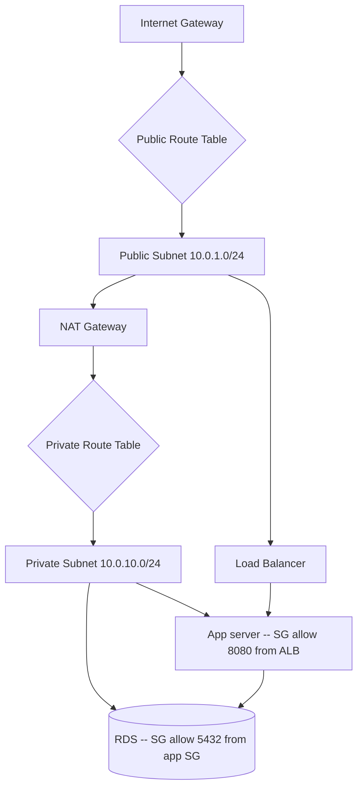

# AWS, the working subset

## Why this matters

It's a Tuesday afternoon and the new staging environment won't come up. The application server boots, but every call to the database times out after thirty seconds. The logs say `connection refused`. You can `ping` nothing, because ICMP is off. You SSH into the box, install `psql`, and the manual connection hangs in exactly the same way. Two engineers spend the better part of an hour blaming RDS, blaming the driver, blaming DNS — before someone opens the database's security group and notices the inbound rule allows port 5432 from the *old* app subnet's CIDR, not the new one. One line in a security group. An afternoon gone.

This is the texture of working with AWS. The service catalog has hundreds of entries, but the failures that eat your week come from a small core: an IAM policy that's too tight or too loose, a subnet that can't route, a security group that silently drops the packet, an S3 bucket that's either world-readable or unreachable. The breadth of AWS is a distraction. A backend engineer touches maybe ten services in earnest, and the ones that bite are always the same network and identity primitives underneath them. The console's six-hundred-product home page is theater; the thing you actually operate is much smaller and far more knowable.

This chapter is the working subset: the part you actually use, explained as a system you can reason about rather than a list of products to memorize. Get the mental model for IAM and VPC right and the rest — EC2, S3, RDS, Lambda, API Gateway, CloudWatch — stops being a grab bag and becomes a small number of compute and storage shapes plugged into the same identity and network fabric. Every one of those services answers the same two questions before it does anything useful: *is this caller allowed?* (identity) and *can this packet arrive?* (network). The engineers who fear the AWS console are the ones who never drew the picture. This chapter draws it.

## Mental model

AWS is two foundational layers with services bolted on top. The first layer is **identity**: who is allowed to call which API on which resource. The second is **the network**: which packets are allowed to reach which host. Almost every AWS outage you'll personally cause is a misconfiguration in one of these two layers, not in the compute service you were actually trying to use. When something doesn't work, your first two questions should be "is the caller authorized?" and "can the packet get there?" — in that order, because an authorization failure returns a clean error while a network failure usually just hangs.

Start with identity. Every action in AWS is an API call — launching an instance, reading an object, describing a security group — and every API call is authorized by IAM against a JSON policy before it runs. IAM is deny-by-default: if no policy explicitly allows an action, it is denied, and a single explicit `Deny` anywhere overrides every `Allow`. There are four nouns worth knowing:

| Concept | What it is |
|---|---|
| **Principal** | The thing making the request: an IAM user, a role, or an AWS service acting on your behalf |
| **Policy** | A JSON document granting or denying `Action`s on `Resource`s, optionally gated by `Condition`s |
| **Role** | A set of policies that a principal *assumes* temporarily, receiving short-lived credentials |
| **Trust policy** | Attached to a role; declares *who* is allowed to assume it |

The single most important habit: **use roles, not long-lived access keys.** An EC2 instance, a Lambda function, or a CI job assumes a role and gets credentials that auto-rotate and expire within hours. A hardcoded `AKIA...` key in a repo is the most common way companies get breached, because it does not rotate, does not expire, and survives in Git history long after you think you deleted it. A role's credentials, by contrast, are useless to an attacker an hour after they leak.

The network layer is a **VPC**: a private IP range you own inside a region. You carve it into subnets, one per availability zone, split into *public* (has a route to an Internet Gateway) and *private* (no direct inbound from the internet). A subnet's public-or-private status is not a checkbox — it is entirely a function of what its route table points at. A subnet whose route table has a `0.0.0.0/0` entry pointing at an Internet Gateway is public; one that points at a NAT gateway (or nowhere) is private. Two independent firewalls guard traffic, and confusing them is a rite of passage:



A **security group** is a stateful firewall attached to a resource (instance, RDS, load balancer). *Stateful* means return traffic is automatically allowed — you open the inbound port and the response flows back without a separate outbound rule. Security groups have only allow rules; there is no concept of a deny rule, so "not allowed" is expressed simply by the absence of a matching rule. Crucially, security groups can reference *other security groups* as their source, which is the right way to say "any app server may reach the database" without hardcoding IPs that change every time you replace an instance. A **network ACL** is a stateless firewall at the subnet boundary; it has both allow and deny rules and evaluates return traffic separately, which is why it is fiddly and why you rarely touch it. When a connection hangs with no error, the cause is almost always a security group that never allowed the packet in — a clean rejection would have produced a `connection refused` instead of a timeout.

The rule of thumb that ties it together: **public subnets are for things the internet must reach (load balancers, NAT gateways); private subnets are for everything else (app servers, databases, caches).** App servers reach the internet for outbound calls — pulling a dependency, calling a third-party API — through a NAT gateway that lives in the public subnet. Nothing on the internet initiates a connection into a private subnet directly. Hold those two layers in your head and the rest of AWS is variations on a theme.

## In practice

### IAM: a least-privilege policy and an assumable role

Here is a policy that lets a principal read and write objects in one bucket and nothing else. Note the resource scoping — the bucket ARN for listing the contents, the object ARN (`/*`) for operations on the objects themselves. These are two different resources and a common mistake is to grant only one and wonder why the other half of the workflow fails:

```json
{
  "Version": "2012-10-17",
  "Statement": [
    {
      "Sid": "ListTheBucket",
      "Effect": "Allow",
      "Action": ["s3:ListBucket"],
      "Resource": "arn:aws:s3:::acme-prod-uploads"
    },
    {
      "Sid": "ReadWriteObjects",
      "Effect": "Allow",
      "Action": ["s3:GetObject", "s3:PutObject", "s3:DeleteObject"],
      "Resource": "arn:aws:s3:::acme-prod-uploads/*"
    }
  ]
}
```

That policy says what a principal *may do*. A role also needs to declare *who may become it*. A role that a Lambda function assumes needs a **trust policy** naming the Lambda service as an allowed principal — without it, the function cannot acquire the role's credentials no matter how generous the permission policy is:

```json
{
  "Version": "2012-10-17",
  "Statement": [{
    "Effect": "Allow",
    "Principal": { "Service": "lambda.amazonaws.com" },
    "Action": "sts:AssumeRole"
  }]
}
```

When you can't figure out why a call is denied, stop guessing and ask IAM to evaluate it for you. The policy simulator runs the exact authorization logic AWS uses, against a specific principal, action, and resource, and tells you which statement decided the outcome:

```bash
aws iam simulate-principal-policy \
  --policy-source-arn arn:aws:iam::123456789012:role/uploader \
  --action-names s3:PutObject \
  --resource-arns "arn:aws:s3:::acme-prod-uploads/test.txt"
# EvalDecision: allowed | implicitDeny | explicitDeny
```

An `implicitDeny` means no statement allowed the action (add the action). An `explicitDeny` means a statement actively blocked it (find and remove it, or check for a restrictive permissions boundary or service control policy higher up).

### S3: durable object storage, blocked from the public by default

Create a bucket, enable versioning so an overwrite or delete is recoverable, and confirm public access is blocked. Block Public Access is on by default for new buckets, but verifying it is a habit worth keeping because a single careless bucket policy is how data ends up in a news headline:

```bash
aws s3api create-bucket --bucket acme-prod-uploads --region us-east-1
aws s3api put-bucket-versioning --bucket acme-prod-uploads \
  --versioning-configuration Status=Enabled
aws s3api get-public-access-block --bucket acme-prod-uploads
```

```json
{
  "PublicAccessBlockConfiguration": {
    "BlockPublicAcls": true, "IgnorePublicAcls": true,
    "BlockPublicPolicy": true, "RestrictPublicBuckets": true
  }
}
```

To let a browser upload a file directly without proxying the bytes through your server, hand it a **presigned URL** — a time-limited, signed link scoped to exactly one object and one operation. The browser PUTs straight to S3; your server's only job is to mint the URL, so a large upload never consumes your application's bandwidth or memory:

```python
import boto3

s3 = boto3.client("s3")
url = s3.generate_presigned_url(
    "put_object",
    Params={"Bucket": "acme-prod-uploads", "Key": "user/42/avatar.png"},
    ExpiresIn=300,  # seconds
)
# PUT the file bytes directly to `url`; no AWS credentials leave the server
```

### EC2 and RDS: the long-running pair

EC2 is a virtual machine; RDS is a managed database (Postgres, MySQL, and others) where AWS handles patching, backups, and failover. The pattern that comes up constantly: app server in a private subnet, database in a private subnet, security group referencing security group. With the AWS CLI, the security-group-as-source idiom looks like this:

```bash
# DB allows Postgres only from the app server's security group -- no CIDRs
aws ec2 authorize-security-group-ingress \
  --group-id sg-db00database \
  --protocol tcp --port 5432 \
  --source-group sg-app00appserver
```

This is the line that, when wrong, produces the lost afternoon from the opening. It says "any instance carrying `sg-app00appserver` may reach this database on 5432," and — this is the point — it keeps working when you replace instances, scale out behind a load balancer, or change IP addresses. A CIDR-based rule would have broken the moment the app subnet changed, which is exactly the bug in the opening scenario.

For RDS, run Multi-AZ in production so a failed primary fails over to a standby in another availability zone automatically, encrypt storage at rest, and never put the database in a public subnet:

```bash
aws rds create-db-instance \
  --db-instance-identifier acme-prod \
  --engine postgres --db-instance-class db.t3.medium \
  --allocated-storage 50 --storage-encrypted \
  --multi-az --no-publicly-accessible \
  --vpc-security-group-ids sg-db00database \
  --db-subnet-group-name acme-private-subnets
```

The `--db-subnet-group-name` points at a set of private subnets across multiple AZs; that is what lets Multi-AZ failover actually land the standby somewhere the primary isn't.

### Lambda + API Gateway: HTTP without a server

For event-driven or spiky workloads, skip the always-on instance. A Lambda function runs your code in response to an event and bills only for the milliseconds it executes; API Gateway turns an inbound HTTP request into that event. For a workload that is idle overnight and busy during the day, this can be dramatically cheaper than a permanently running EC2 instance, and it scales out automatically instead of you guessing at capacity. A minimal handler:

```python
def handler(event, context):
    params = event.get("queryStringParameters") or {}
    name = params.get("name", "world")
    return {
        "statusCode": 200,
        "headers": {"Content-Type": "application/json"},
        "body": f'{{"message": "hello {name}"}}',
    }
```

Most teams define this with infrastructure-as-code rather than clicking in the console (see the Terraform chapter, 8.5). The relevant point here is identity: the function gets an *execution role* (the trust policy shown earlier) granting exactly the permissions its code needs — read from one queue, write to one table — and nothing more. The serverless model does not change the rules; it just attaches the role to a function instead of an instance.

### CloudWatch: logs, metrics, alarms

Everything emits to CloudWatch. Lambda and many managed services log automatically; EC2 needs the CloudWatch agent installed to ship logs and memory metrics. The piece worth setting up on day one is an **alarm** that pages you before users notice — a metric crossing a threshold for a sustained window, wired to an SNS topic that fans out to your pager:

```bash
aws cloudwatch put-metric-alarm \
  --alarm-name acme-prod-5xx-high \
  --namespace AWS/ApplicationELB --metric-name HTTPCode_Target_5XX_Count \
  --statistic Sum --period 60 --evaluation-periods 5 --threshold 10 \
  --comparison-operator GreaterThanThreshold \
  --alarm-actions arn:aws:sns:us-east-1:123456789012:oncall-pager
```

When the alarm fires, you query logs without exporting them using CloudWatch Logs Insights, which runs a small query language over the log groups in place:

```text
fields @timestamp, @message
| filter @message like /ERROR/
| sort @timestamp desc
| limit 50
```

## Pitfalls and anti-patterns

**1. The wide-open security group (`0.0.0.0/0` on everything).** You're debugging a connection failure, you open the security group to `0.0.0.0/0` "just to test," and it never gets closed. Now your database accepts connections from the entire internet. Recognize it by auditing inbound rules — `aws ec2 describe-security-groups --query "SecurityGroups[].IpPermissions"` — and flagging `0.0.0.0/0` on any port other than 80/443 on a public load balancer. Fix it by scoping sources to specific security groups (for internal traffic) or to your office/VPN CIDR (for admin access), and put SSH behind Session Manager so port 22 never faces the internet at all.

**2. Long-lived access keys in code or environment files.** A committed `AKIA...` key is a leading breach vector. Recognize it by scanning history with a secret scanner and checking `aws iam list-access-keys` for keys older than 90 days. Fix it by deleting static keys entirely: EC2 uses instance profiles, Lambda uses execution roles, CI uses OIDC federation to assume a role with no stored secret at all. If a human needs CLI access, use AWS IAM Identity Center with short-lived sessions rather than minting a key.

**3. The `AdministratorAccess` shortcut.** Under deadline, someone attaches the managed `AdministratorAccess` policy to a service role because the scoped policy "wasn't working." The deny was probably a single missing action; the fix grants everything. Recognize it by listing attached policies per role and flagging `arn:aws:iam::aws:policy/AdministratorAccess` on anything that isn't a human admin. Fix it by reading the actual `AccessDenied` error — it names the action and resource — adding *that* action, and using IAM Access Analyzer to generate a least-privilege policy from observed CloudTrail activity.

**4. Single-AZ everything.** The app, the database, and the NAT gateway all live in one availability zone because that's how the first subnet got created. When that AZ has an incident, the whole stack is down. Recognize it by checking that subnets span at least two AZs and that RDS is `--multi-az`. Fix it by deploying across two or three AZs from the start; it costs more, but it's the difference between a degraded service and a dead one during one of AWS's periodic AZ events.

**5. The NAT gateway you forgot you were paying for.** Private subnets route outbound through a NAT gateway, which bills per hour *and* per gigabyte processed. A chatty app pulling large objects from the internet through NAT can run up a meaningful bill that's easy to miss. Recognize it in Cost Explorer under "NAT Gateway." Fix it by routing AWS-service traffic through VPC endpoints (the S3 and DynamoDB gateway endpoints are free and bypass NAT entirely) and by questioning whether a given workload needs outbound internet access at all.

## Production checklist

- [ ] Root account has MFA, no access keys, and is never used for daily work
- [ ] All human access via IAM Identity Center / SSO with short-lived sessions; zero long-lived user keys
- [ ] EC2 uses instance profiles, Lambda uses execution roles, CI uses OIDC role assumption — no stored secrets
- [ ] Every IAM policy scoped to specific actions and resource ARNs; no blanket `AdministratorAccess` on service roles
- [ ] VPC spans at least two AZs; databases run Multi-AZ; subnets split public/private correctly
- [ ] Security groups reference other security groups, not `0.0.0.0/0`, for internal traffic
- [ ] SSH access via SSM Session Manager, not a public port 22
- [ ] S3 buckets have Block Public Access on, versioning enabled, and encryption at rest (SSE-KMS or SSE-S3)
- [ ] RDS storage encrypted, automated backups on, deletion protection enabled on production
- [ ] Secrets in AWS Secrets Manager or SSM Parameter Store (SecureString), never in env files or AMIs
- [ ] CloudWatch alarms on error rate, latency, and saturation wired to a pager (SNS/PagerDuty)
- [ ] CloudTrail enabled in all regions, logs delivered to a write-once S3 bucket in a separate account
- [ ] Cost anomaly detection and a monthly budget alert configured (see the FinOps chapter, 8.8)

## Exercises

1. **(Comprehension)** Given the diagram in the Mental model section, trace the path of a single HTTPS request from an internet user to the database and back. Name every component the packet crosses and, at each firewall boundary, state which security group rule must exist for the packet to pass. Then explain why the app server can reach the internet for an outbound API call but the internet cannot initiate a connection to the app server.

2. **(Applied)** In a sandbox account, stand up a VPC with one public and one private subnet, an EC2 instance in the private subnet, and an RDS Postgres instance also private. Configure the security groups so the EC2 instance can connect to the database using the security-group-as-source idiom (no CIDR rules), and confirm you *cannot* reach either resource directly from the internet. Then connect to the instance using SSM Session Manager (no SSH key, no public IP) and run a query against the database.

3. **(Design)** Your team runs a monolith on a single large EC2 instance with the database on the same box. Traffic is spiky: near-zero overnight, heavy bursts during business hours. Design a target architecture using the services in this chapter that improves availability and matches cost to load. Decide where compute should be EC2, Lambda, or both; how the database should be made highly available; how secrets and identity are handled; and what you'd monitor. State the two or three tradeoffs you're least sure about and how you'd validate them.

## Further reading

- [AWS Well-Architected Framework](https://aws.amazon.com/architecture/well-architected/) — the canonical reference for the five pillars; the Security and Reliability pillars cover most of this chapter
- [IAM policy evaluation logic](https://docs.aws.amazon.com/IAM/latest/UserGuide/reference_policies_evaluation-logic.html) — the precise order in which allows, denies, and conditions are resolved; read this once and policy debugging gets faster
- [Amazon VPC User Guide](https://docs.aws.amazon.com/vpc/latest/userguide/what-is-amazon-vpc.html) — subnets, route tables, gateways, and endpoints from the source
- [Security groups for your VPC](https://docs.aws.amazon.com/vpc/latest/userguide/vpc-security-groups.html) — the stateful firewall model, and how it differs from the stateless network ACL
- [The Amazon Builders' Library](https://aws.amazon.com/builders-library/) — engineering essays on how AWS itself builds resilient systems; vendor-published but rigorous and non-promotional
- [boto3 documentation](https://boto3.amazonaws.com/v1/documentation/api/latest/index.html) — the Python SDK reference you'll keep open while scripting against the APIs above

> **Connect the dots:** This chapter is the substrate, not the surface. You'll rarely click these resources into existence in production — you'll declare them in Terraform (Part 8.5), package your app into the image that runs on EC2 or Lambda (Part 8.2), and ship it through a pipeline that assumes an AWS role via OIDC (Part 8.4). The S3 content-addressable object model echoes the same hash-keyed storage idea behind Git and Docker layers (Part 3). And the VPC network boundaries here are where the distributed-systems failure modes from Part 6 actually manifest as timeouts.

> **Security note:** The default posture for everything in this chapter is *deny, then grant the minimum*. Concretely: assume roles instead of storing keys; scope every IAM policy to named actions and resource ARNs; keep databases and app servers in private subnets with security groups that reference each other rather than IP ranges; turn on S3 Block Public Access and encryption at rest on every bucket; put all secrets in Secrets Manager or SSM Parameter Store as SecureStrings, never in AMIs, environment files, or code; scan container images and dependency manifests for known CVEs before they ship to ECR; and enable CloudTrail in all regions writing to a locked-down bucket in a separate account so an attacker who compromises one account can't erase the evidence. Least privilege is not a phase you reach later — it's cheaper to start there than to claw back over-broad grants after an audit.
