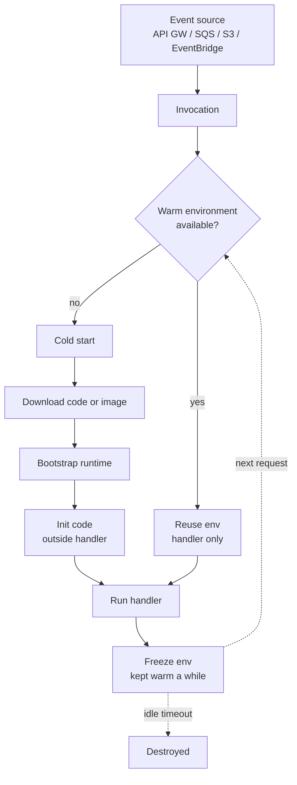

# Serverless without surprises

## Why this matters

It's a Tuesday afternoon and your image-thumbnailing Lambda — the one that's run flawlessly for eight months — is timing out. CloudWatch shows latency at the median is still healthy, but the tail has blown out from milliseconds to seconds, and the upstream API Gateway is starting to return 504s to a slice of users. Nothing changed in your code. Nothing changed in your config. What changed is that a marketing email went out, traffic surged tens of times over baseline in about a minute, and the platform spun up hundreds of new function instances to keep up. Each one of those instances had to load the runtime, import a heavy image library, and establish a fresh database connection before it could serve a single request. That's your cold start, multiplied by the size of the surge, all at once.

Worse: every one of those new instances opened its own database connection. Your RDS instance has a small, fixed `max_connections` ceiling. So the cold starts that didn't time out succeeded in exhausting the connection pool, and now your *other* services — the ones that had nothing to do with thumbnails — are getting "too many connections" errors. A thumbnail feature took down checkout.

None of this is a bug. Every piece of it is the serverless model behaving exactly as documented. The teams that get burned are the ones who adopted "serverless" because it promised they'd never think about servers again, and then discovered that the abstraction leaks in four specific, predictable places: cold starts, concurrency, statelessness, and cost. This chapter is about seeing those four places clearly enough that none of them surprises you in production.

## Mental model

A serverless function is a stateless handler that the platform runs inside a short-lived execution environment, which it creates on demand and destroys when idle. You don't provision instances; you provision *permission to be invoked*. The unit you reason about is a single invocation, and the unit the platform reasons about is a single execution environment that can serve one invocation at a time.

That "one at a time" is the load-bearing fact. AWS Lambda, for example, gives each execution environment exactly one concurrent request. To serve N simultaneous requests, the platform needs N environments. If it doesn't have them warm, it creates them — and creation is the cold start. The platform will keep scaling environments up to your account and function limits, but it scales at a bounded rate, which is precisely why a sudden surge produces a burst of cold starts rather than instant, invisible capacity.



The lifecycle has two phases that matter. **Init** runs once per environment: importing dependencies, opening connections, reading config — everything outside your handler function. **Invoke** runs once per request: just your handler body. A cold start pays for both; a warm invocation pays only for invoke. The single most effective cold-start optimization is moving expensive work from invoke into init, because init cost is amortized across every request that environment serves before it's recycled.

The second load-bearing fact: the environment is *frozen* between invocations, not destroyed. State you leave in module scope (a cached DB connection, a parsed config) survives to the next request on that same environment. State you leave on the local disk (`/tmp`) survives too. But you have zero guarantee the next request hits the same environment — it might hit a brand-new one, or one that's about to be reaped. So local state is a valid *cache* and never a valid *source of truth*. That single rule is what "stateless" actually means in practice.

## In practice

### Packaging: zip vs. container, and the dependency tax

Your cold-start time is dominated by how much code the platform has to pull and initialize. Two packaging models exist on Lambda: a zip artifact (up to 250MB unzipped) and a container image (up to 10GB). Smaller is faster to cold-start, so the discipline is the same as the Docker chapter: ship only what you run.

Here's the wrong way — a Node handler that imports the entire AWS SDK and a kitchen-sink date library at module load:

```javascript
// handler.js — slow init, fat bundle
const AWS = require('aws-sdk');          // pulls the whole v2 SDK
const moment = require('moment');         // large, plus bundled locales
const s3 = new AWS.S3();

exports.handler = async (event) => {
  const now = moment().toISOString();
  // ...
};
```

The right way — import only the client you use, and prefer the modular v3 SDK (and `Date` over `moment`):

```javascript
// handler.mjs — lean init
import { S3Client, GetObjectCommand } from '@aws-sdk/client-s3';

const s3 = new S3Client({});  // init phase: created once per environment

export const handler = async (event) => {
  const now = new Date().toISOString();
  const out = await s3.send(new GetObjectCommand({
    Bucket: event.bucket, Key: event.key,
  }));
  // ...
};
```

Two things to notice. The `S3Client` is constructed in module scope, so it's built once during init and reused across every warm invocation on that environment — that's connection reuse, for free. And by importing a single client instead of the umbrella package, the bundle the platform must download shrinks substantially, which directly trims init time. AWS's own guidance is explicit about both moves: require individual service clients rather than the whole SDK, and create clients and connections outside the handler so warm invocations reuse them.

### Defining the function as code

Never click this into existence in a console. Here's a minimal Lambda plus its API Gateway trigger in Terraform, with the knobs that actually matter set explicitly:

```hcl
resource "aws_lambda_function" "thumbnailer" {
  function_name = "thumbnailer"
  runtime       = "nodejs20.x"
  handler       = "handler.handler"
  filename      = "build/thumbnailer.zip"
  source_code_hash = filebase64sha256("build/thumbnailer.zip")

  memory_size   = 512    # CPU scales with memory; this also sets your cost-per-ms
  timeout       = 10     # fail fast; never leave this at the 900s max by default

  reserved_concurrent_executions = 50   # cap blast radius (see pitfalls)

  environment {
    variables = { LOG_LEVEL = "info" }
  }
}

resource "aws_lambda_provisioned_concurrency_config" "thumbnailer_warm" {
  function_name                     = aws_lambda_function.thumbnailer.function_name
  qualifier                         = aws_lambda_function.thumbnailer.version
  provisioned_concurrent_executions = 5   # keep 5 environments always warm
}
```

`memory_size` is the one counterintuitive dial: on Lambda, CPU is allocated proportionally to memory, so bumping memory can make a CPU-bound function *both faster and cheaper* because it finishes in a fraction of the time, offsetting the higher per-millisecond rate. Always profile this; the cost-optimal setting is rarely the minimum.

### Event sources change the contract

The function is the same; the invocation semantics are not. This is where teams trip.

| Source | Model | Retry behavior | Concurrency control |
|---|---|---|---|
| API Gateway / Function URL | Synchronous | Client retries; you own it | One env per in-flight request |
| SQS | Poll-based | Redrive to DLQ after N failures | Batch size + concurrency cap |
| S3 / SNS | Asynchronous | Automatic retries, then DLQ | Platform-managed, bursty |
| EventBridge / Cron | Asynchronous | Scheduled, at-least-once | Platform-managed |
| Kinesis / DynamoDB Streams | Poll-based, ordered | Retries block the shard | One env per shard |

The critical word hiding in this table is **at-least-once**. SQS, S3 events, and streams will, under failure, deliver the same event more than once. Your handler must be idempotent — processing the same `messageId` twice must produce the same result as processing it once. The standard pattern is a dedup key written to a conditional store:

```javascript
export const handler = async (event) => {
  for (const record of event.Records) {
    const id = record.messageId;
    try {
      // Conditional put fails if we've seen this id — DynamoDB attribute_not_exists
      await ddb.send(new PutItemCommand({
        TableName: 'processed',
        Item: { id: { S: id }, ts: { N: `${Date.now()}` } },
        ConditionExpression: 'attribute_not_exists(id)',
      }));
    } catch (e) {
      if (e.name === 'ConditionalCheckFailedException') continue; // already done
      throw e;
    }
    await doWork(record);
  }
};
```

### The cost shape

Serverless cost is `requests × (duration × memory)` plus per-request fees. The shape this produces is the whole story: cost is *linear with usage and zero at idle*. That's spectacular for spiky, low-average traffic — a webhook handler that fires a few thousand times a day costs very little. It's far less attractive for steady high-throughput workloads, because at high constant utilization a reserved or containerized instance you keep busy is cheaper per request than paying retail per-invocation rates.

The crossover is real and worth computing before you commit. A function pegged near full utilization around the clock is the canonical case where serverless is the wrong tool: you're paying a premium for elasticity you never use.

## Pitfalls and anti-patterns

**1. The connection-storm / database-exhaustion trap.** Each cold-started environment opens its own DB connection, and a traffic spike can open hundreds at once, blowing past your database's `max_connections` and taking down unrelated services. *Recognize it* by "too many connections" errors that correlate with invocation-count spikes, not query load. *Fix it* by putting a connection proxy in front of the database (RDS Proxy, PgBouncer) so functions share a managed pool, and by setting `reserved_concurrent_executions` to cap how many environments can exist at once.

**2. Treating cold starts as random noise instead of a tail-latency budget.** A function that's fine at the median can violate its SLO in the tail entirely because of cold starts, and the effect is worst exactly when traffic surges. *Recognize it* by a p99/p50 latency ratio that balloons during scale-up events. *Fix it* by trimming init (lean dependencies, lazy-load rarely-used clients), raising memory to speed bootstrap, and — for latency-critical paths — buying **provisioned concurrency** so a baseline of environments stays warm. Don't "ping to keep warm"; it's a hack that doesn't scale past one environment.

**3. Leaning on local state as truth.** Writing user session data to `/tmp` or a module-scope `Map` and assuming it'll be there next request. *Recognize it* by bugs that only reproduce under load or after a deploy, and "works on my machine, flaky in prod." *Fix it* by treating `/tmp` and module scope strictly as caches — every write that must survive goes to external storage (DynamoDB, Redis, S3). The function is stateless; act like it.

**4. The unbounded-timeout-and-cost footgun.** Leaving `timeout` at a high value and `reserved_concurrent_executions` unset means a downstream slowdown turns into thousands of long-running, billed-by-the-ms invocations piling up — a latency problem becomes a cost incident. *Recognize it* by a bill that spikes during an outage. *Fix it* by setting aggressive timeouts (fail fast), a concurrency cap per function, and a billing alarm.

**5. Forcing a long-running or stateful workload into a function.** Video transcoding that takes twenty minutes, a WebSocket server that needs persistent connections, or a steadily saturated backend. *Recognize it* by fighting the 15-minute max duration, the statelessness, or a cost curve that's worse than a box you'd keep busy anyway. *Fix it* by moving to the right tool: containers on ECS/Fargate or a Kubernetes Job for long batch work, a managed connection service for persistent sockets, a reserved instance for steady high load.

## Production checklist

- [ ] `timeout` set to a tight, profiled value — never left at the platform maximum
- [ ] `reserved_concurrent_executions` set on every function to cap blast radius and protect downstream dependencies
- [ ] Dead-letter queue (or on-failure destination) configured for every asynchronous and queue-driven function
- [ ] Handler is idempotent — verified against duplicate delivery with a dedup key
- [ ] Expensive setup (clients, connections, config parsing) lives in init/module scope, not in the handler body
- [ ] Database access goes through a connection proxy (RDS Proxy / PgBouncer), not raw per-environment connections
- [ ] Memory size profiled against the cost-vs-latency curve, not left at the minimum
- [ ] Provisioned concurrency sized for latency-critical paths; cold-start tail latency measured against the SLO
- [ ] Bundle/image trimmed to only what runs; cold-start init time tracked as a metric
- [ ] A per-function billing/cost-anomaly alarm exists so an outage can't silently become a cost incident
- [ ] Function role scoped to least privilege — one role per function, only the actions it needs

## Exercises

1. **(Comprehension)** Explain, in terms of the init/invoke lifecycle, why moving a database client constructor from inside the handler to module scope reduces *average* latency but does nothing for the *worst-case* cold-start latency. Which optimization (lean dependencies, more memory, provisioned concurrency) attacks the worst case, and why?

2. **(Applied)** Take a function that opens a fresh Postgres connection per invocation and is exhausting the database under load. Reproduce the connection storm locally or in a sandbox account by firing concurrent invocations. Then fix it two ways — first with `reserved_concurrent_executions`, then by routing through RDS Proxy — and measure peak connection count against the database in each case. Explain which fix you'd ship and when you'd want both.

3. **(Design)** You're handed a workload: ingest spiky webhook events (high daily volume, bursts well above baseline), validate and enrich them, and write to a warehouse. Design the serverless architecture end to end: event source, queue, concurrency limits, idempotency strategy, DLQ, and cost guardrails. Then identify the single change in requirements (throughput, latency SLO, or duration) that would make you abandon serverless for containers, and justify the crossover point.

## Further reading

- AWS Lambda Developer Guide — [Understanding the Lambda execution environment lifecycle](https://docs.aws.amazon.com/lambda/latest/dg/lambda-runtime-environment.html) — the authoritative description of init/invoke/freeze, cold starts, and static-init optimization
- AWS Lambda Developer Guide — [Understanding Lambda function scaling](https://docs.aws.amazon.com/lambda/latest/dg/lambda-concurrency.html) — reserved vs. provisioned concurrency, the concurrency formula, and scaling limits
- AWS Lambda Developer Guide — [Tutorial: Using a Lambda function to access an Amazon RDS database](https://docs.aws.amazon.com/lambda/latest/dg/services-rds-tutorial.html) — RDS Proxy with Lambda, the canonical fix for connection storms
- Adzic & Chatley, ["Serverless computing: economic and architectural impact"](https://dl.acm.org/doi/10.1145/3106237.3117767) (FSE 2017) — the cost-shape and migration argument
- Hellerstein et al., ["Serverless Computing: One Step Forward, Two Steps Back"](https://arxiv.org/abs/1812.03651) (CIDR 2019) — a rigorous, opinionated account of what the model does badly and why
- Lambda Powertools — [official utilities for idempotency, tracing, and structured logging](https://docs.powertools.aws.dev/lambda/) — production-grade implementations of the patterns above

> **Connect the dots:** Packaging discipline here is the same discipline as the Docker chapter (Part 8) — ship only what you run, because every megabyte is download latency. And the idempotency requirement that event sources force on you is the same at-least-once delivery problem you meet in distributed systems and message queues; the dedup-key pattern is identical.

> **Security note:** Give each function its own IAM execution role scoped to the exact actions it needs — never share a broad role across functions, and never attach `*` permissions because it was faster. Secrets belong in Secrets Manager or Parameter Store, fetched in init and cached in module scope, never baked into environment variables in plaintext or committed to the repo. Scan your deployment artifact (zip or image) for vulnerable dependencies in CI before deploy, exactly as you would a container. If a function reaches a database or internal service, run it inside your VPC with security groups that allow only the specific egress it requires — a function with internet-wide egress is an exfiltration path waiting to be found.
