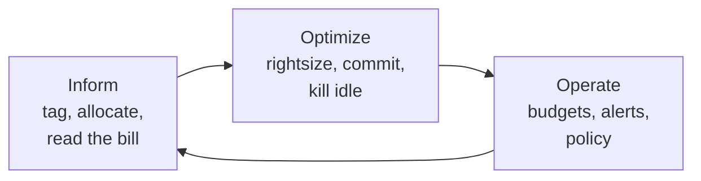

# FinOps

## Why this matters

It's a Tuesday afternoon and your CFO forwards the AWS invoice with one line highlighted: NAT Gateway data processing, $14,200 for the month. Last month it was $900. Nobody deployed a new feature. Nobody changed the network. You open Cost Explorer, group by usage type, and find the culprit: three weeks ago a backend engineer moved your nightly analytics export to pull from S3 through a private subnet. Every byte now traverses a NAT Gateway, which bills a per-GB processing fee on top of egress, instead of going through a free VPC gateway endpoint. The export moves 300GB a night. The fix is one Terraform resource — an `aws_vpc_endpoint` for S3 — and it takes ten minutes. Finding it took you three hours because you didn't know how to read the bill.

That is the entire discipline of FinOps in one anecdote. The cloud bill is not a fixed cost of doing business; it's a high-resolution log of every architectural decision your team has ever made, priced by the hour. Most of it is legible if you know where to look, and a surprising fraction of it is waste — idle instances, oversized databases, forgotten snapshots, data crossing boundaries it didn't need to cross. The teams that treat the bill as an opaque tax routinely pay a large premium over what they need to. The teams that treat it as observability data — taggable, queryable, alertable — spend their money on the things that actually serve users.

The engineer who understands the bill has leverage nobody else on the team has. You can look at a proposed architecture and say "that cross-AZ chatter will cost us more than the compute" before it ships. You can rightsize a fleet during a sprint instead of during a panic. This chapter is about building that fluency: reading the bill, attributing every dollar to a team via tags, killing idle and oversized resources, buying compute the cheap way, and wiring up the alerts that catch the next $14,000 surprise on day one instead of day thirty.

## Mental model

A cloud bill is the integral of three things over time: **what you provisioned**, **how long it ran**, and **what crossed a boundary**. Almost every surprise line item is a boundary crossing — data leaving a region, leaving the cloud, or hopping through a billed network appliance — because boundaries are invisible in your code but metered on the wire.

FinOps as a practice has a canonical lifecycle, defined by the FinOps Foundation: you cannot optimize what you cannot see, and you cannot keep it optimized without governance.



The loop matters more than any single tactic. **Inform** is making cost visible and attributable — without tags, a bill is one undifferentiated number and no team feels ownership. **Optimize** is the engineering work: rightsizing, commitment-based discounts, eliminating idle resources, fixing egress. **Operate** is the guardrails that keep you from regressing: budgets, anomaly alerts, and policy-as-code that blocks an untagged or oversized resource at deploy time.

Two pricing concepts unlock most of the savings. First, **commitment discounts**: cloud providers will sell you compute well below on-demand price if you commit to a baseline of usage (Savings Plans, Reserved Instances) or accept interruption (Spot). On-demand is the rack rate you pay only for the unpredictable margin on top of a committed base. Second, **the cost of motion**: storing data is cheap, computing on it is moderate, but moving it — especially out of a region or out to the internet — is the line item that scales with your success and surprises you the most. Ingress is almost always free; egress almost never is. Hold those two ideas and most of the bill becomes predictable.

## In practice

### Reading the bill without the console

The console's Cost Explorer is fine for clicking around, but the real tool is the **Cost and Usage Report (CUR)** — a row-per-resource-per-hour dump delivered to S3, queryable with Athena. When you need to find a surprise, group by usage type and service, then sort descending.

```sql
-- Athena query against the CUR: top spend by service + usage type, last 30 days
SELECT
  line_item_product_code            AS service,
  line_item_usage_type              AS usage_type,
  ROUND(SUM(line_item_unblended_cost), 2) AS cost_usd
FROM cur.my_account_cur
WHERE line_item_usage_start_date >= date_add('day', -30, current_date)
GROUP BY 1, 2
ORDER BY cost_usd DESC
LIMIT 20;
```

Representative output, with the surprise from the opening scenario sitting in plain sight:

```text
service          usage_type                          cost_usd
AmazonEC2        BoxUsage:m5.xlarge                   8,210.40
AmazonRDS        InstanceUsage:db.r5.2xlarge          6,950.00
AWSDataTransfer  USE1-NatGateway-Bytes                14,200.18   <-- here
AmazonS3         TimedStorage-ByteHrs                  2,310.55
AmazonEC2        EBS:VolumeUsage.gp3                   1,980.00
```

The `usage_type` column is where the answers live. `NatGateway-Bytes` is processing charges. `DataTransfer-Out-Bytes` is egress to the internet. `USE1-USW2-AWS-Out-Bytes` is cross-region transfer. Learning to read this column is most of bill literacy. The naming convention encodes the region pair (`USE1` = us-east-1) and the direction, so a single string tells you both what and where.

### Tagging and cost allocation

A dollar you can't attribute to a team is a dollar nobody will cut. Enforce a tagging schema and make it non-optional. The minimum viable set: `team`, `environment`, `service`, `cost-center`.

```hcl
# Terraform: default tags applied to every resource in the provider
provider "aws" {
  region = "us-east-1"
  default_tags {
    tags = {
      team        = "payments"
      environment = "prod"
      service     = "checkout-api"
      cost-center = "cc-4471"
      managed-by  = "terraform"
    }
  }
}
```

`default_tags` propagates to nearly every resource the provider creates, which beats hand-tagging and forgetting. But tags only become billable dimensions after you activate them as **cost allocation tags** in the Billing console — until you do, they exist on the resource but don't appear as columns in the CUR. This is the single most common tagging mistake: teams tag diligently for months, then discover the tags were never activated and the historical data can't be back-filled.

Block untagged resources at the door with policy-as-code rather than chasing them after the fact:

```json
// An SCP-style guardrail: deny RunInstances if the required tags are absent.
{
  "Effect": "Deny",
  "Action": "ec2:RunInstances",
  "Resource": "arn:aws:ec2:*:*:instance/*",
  "Condition": {
    "Null": {
      "aws:RequestTag/team": "true",
      "aws:RequestTag/cost-center": "true"
    }
  }
}
```

### Rightsizing

Provisioning is a guess; rightsizing is correcting the guess with data. The signal is CPU and memory utilization over a representative window — a fleet sitting at single-digit-percent CPU for a month is paying for an order of magnitude more compute than it uses.

```bash
# Pull 14-day average CPU for an instance; if it lives under ~20%, it's a downsize candidate
aws cloudwatch get-metric-statistics \
  --namespace AWS/EC2 --metric-name CPUUtilization \
  --dimensions Name=InstanceId,Value=i-0abc123 \
  --start-time "$(date -u -d '14 days ago' +%Y-%m-%dT%H:%M:%SZ)" \
  --end-time   "$(date -u +%Y-%m-%dT%H:%M:%SZ)" \
  --period 86400 --statistics Average Maximum
```

AWS Compute Optimizer and Cost Explorer's rightsizing recommendations automate this analysis across the fleet; use them as a candidate list, not gospel — they don't know that one box is sized for a quarterly batch job. Memory is the trap: EC2 doesn't report memory utilization by default, so a "low CPU" box may actually be memory-bound. Install the CloudWatch agent for the memory metric before you downsize, or you'll trade a CPU-idle instance for a thrashing one.

### Buying compute the cheap way: Spot and Savings Plans

For a stable baseline of usage, **Compute Savings Plans** discount on-demand rates substantially in exchange for committing to a dollars-per-hour spend; the deepest discounts come from longer terms and more upfront payment (verify current rates against AWS pricing, as they shift). They're flexible across instance family, size, and region, which makes them safer than the older Reserved Instances. The rule of thumb: commit to your trough, not your peak. Cover the bottom of your usage curve with a Savings Plan and let on-demand handle the spikes.

For interruptible work — batch jobs, CI runners, stateless web tiers behind a queue — **Spot** instances run on spare capacity at a fraction of on-demand price, with the catch that AWS can reclaim them with a two-minute warning. The pattern that makes Spot safe is diversification across instance types and AZs, plus a graceful drain on the interruption notice.

```yaml
# Kubernetes: a node pool that tolerates Spot interruptions, drained gracefully.
# Karpenter handles diversification across instance types automatically.
apiVersion: karpenter.sh/v1
kind: NodePool
metadata:
  name: spot-batch
spec:
  template:
    spec:
      requirements:
        - key: karpenter.sh/capacity-type
          operator: In
          values: ["spot"]
        - key: kubernetes.io/arch
          operator: In
          values: ["amd64", "arm64"]   # graviton is cheaper; diversify both
  disruption:
    consolidationPolicy: WhenEmptyOrUnderutilized
    consolidateAfter: 30s
```

The decision tree: stable and predictable, buy a Savings Plan; interruptible and stateless, run Spot; spiky and stateful, stay on-demand and rightsize hard. Mixing all three on one workload — a Savings-Plan-covered baseline with Spot for burst — is the mature end state.

### The cost of motion and idle

Two categories quietly dominate "where did the money go" investigations. **Egress and cross-zone transfer**: data leaving AWS to the internet is billed per GB; data crossing AZs within a region is billed in both directions; a NAT Gateway bills both an hourly rate and a per-GB processing fee. Routing S3 and DynamoDB traffic through free **VPC gateway endpoints** instead of a NAT Gateway is often the single highest-ROI change on a bill, exactly as in the opening scenario.

**Idle resources** are the other half: unattached EBS volumes, old snapshots, idle load balancers, Elastic IPs not associated with a running instance, and `dev` databases nobody stopped on Friday.

```bash
# Find unattached EBS volumes — pure waste, still billed by the GB-hour
aws ec2 describe-volumes \
  --filters Name=status,Values=available \
  --query 'Volumes[].{ID:VolumeId,GiB:Size,AZ:AvailabilityZone}' \
  --output table
```

### Budgets and alerts

The point of governance is to catch the next surprise on day one. AWS Budgets gives you both threshold alerts (notify at 80% of plan) and **anomaly detection** (notify on a statistically unusual spike, which would have caught the NAT Gateway jump).

```hcl
resource "aws_budgets_budget" "monthly_prod" {
  name         = "prod-monthly"
  budget_type  = "COST"
  limit_amount = "40000"
  limit_unit   = "USD"
  time_unit    = "MONTHLY"

  cost_filter {
    name   = "TagKeyValue"
    values = ["user:environment$prod"]
  }

  notification {
    comparison_operator        = "GREATER_THAN"
    threshold                  = 80          # percent of budgeted amount
    threshold_type             = "PERCENTAGE"
    notification_type          = "ACTUAL"
    subscriber_email_addresses = ["finops-alerts@example.com"]
  }
}
```

Pair the static budget with `aws_ce_anomaly_monitor` and `aws_ce_anomaly_subscription` so you're alerted on shape, not just on crossing a line. A 50% week-over-week jump matters even if you're still under budget — it's the leading indicator.

> **Connect the dots:** FinOps is observability pointed at dollars instead of latency. The same instincts you build for metrics and tracing in Part 9 — high-cardinality tags, baselines, anomaly detection, alerting on rate-of-change not just thresholds — are exactly what makes a cloud bill legible. And the architectural choices that drive cost (cross-AZ chatter, egress, instance sizing) are made in the Terraform and Kubernetes configs from chapters 3–6 of this Part. Cost is a property of architecture, decided long before the invoice arrives.

## Pitfalls and anti-patterns

**1. The untagged-until-too-late trap.** Teams tag resources for months but never activate the tags as cost allocation tags in the Billing console, so none of it shows up as a billable dimension — and AWS does not back-fill. *Recognize it* when Cost Explorer's "group by tag" shows everything under "No tag value" for dates before you noticed. *Fix it* by activating cost allocation tags on day one, enforcing required tags with an SCP or OPA policy, and propagating via Terraform `default_tags` so humans can't forget.

**2. Optimizing compute while egress burns.** Engineers love rightsizing instances because it's tractable, and ignore data transfer because it's diffuse. But on data-heavy systems the NAT Gateway and cross-AZ lines dwarf compute. *Recognize it* by the ratio: if `AWSDataTransfer` plus `NatGateway-Bytes` is a double-digit percentage of the bill, that's your fire. *Fix it* with VPC gateway endpoints for S3/DynamoDB, AZ-aware service placement, and caching at the edge to cut origin egress.

**3. Over-committing on Savings Plans.** A three-year all-upfront plan sized to your current peak looks great until you migrate a workload off it and keep paying for capacity you no longer use. *Recognize it* via the Savings Plans utilization report dropping below the high-90s percent. *Fix it* by sizing commitments to your stable trough, laddering shorter terms during periods of architectural change, and treating the commitment as a floor you're confident you'll exceed.

**4. Spot for stateful or undiversified workloads.** Running a database or a single-instance-type fleet on Spot turns a routine capacity reclamation into an outage. *Recognize it* by interruption-driven incidents clustering on one instance family. *Fix it* by reserving Spot for stateless, interruptible, queue-backed work, diversifying across many instance types and AZs, and handling the two-minute interruption notice with a graceful drain.

**5. Idle-by-Friday infrastructure.** Non-production environments run the full week but are actively used only a fraction of those hours. Snapshots, unattached volumes, and idle load balancers accumulate as nobody owns cleanup. *Recognize it* by non-prod spend approaching prod spend. *Fix it* with scheduled stop/start (a Lambda on EventBridge that stops `dev` nightly), lifecycle policies on snapshots, and a recurring sweep for unattached volumes and unassociated Elastic IPs.

## Production checklist

- [ ] Cost and Usage Report enabled, delivered to S3, and queryable via Athena
- [ ] Tagging schema defined (`team`, `environment`, `service`, `cost-center`) and enforced with policy-as-code (SCP / OPA)
- [ ] Cost allocation tags **activated** in the Billing console (not just applied to resources)
- [ ] Terraform `default_tags` configured per provider so tags can't be forgotten
- [ ] Monthly budget per environment with alerts at 80% and 100% of plan
- [ ] Cost anomaly detection enabled with notifications to a monitored channel
- [ ] Compute Optimizer / rightsizing recommendations reviewed each sprint, with memory metrics collected before downsizing
- [ ] Savings Plan or Reserved capacity sized to the stable usage trough; utilization tracked in the high-90s percent
- [ ] Spot used for stateless, interruptible workloads with multi-instance-type diversification and graceful drain
- [ ] VPC gateway endpoints in place for S3 and DynamoDB to avoid NAT Gateway processing charges
- [ ] Scheduled stop/start for non-production environments; lifecycle policies on snapshots
- [ ] Recurring sweep for idle resources: unattached EBS volumes, unassociated Elastic IPs, idle load balancers

## Exercises

1. **(Comprehension)** Open Cost Explorer (or run the Athena CUR query above) for the last 30 days, grouped by service and usage type. Identify your top five line items and, for each, state in one sentence what physical thing is being billed (compute-hours, GB-stored, GB-transferred-out, requests). Find at least one `DataTransfer` or `NatGateway` line and explain which boundary the data is crossing.

2. **(Applied)** In a sandbox account, deploy a small app that reads from S3 through a NAT Gateway, generate some traffic, and observe the `NatGateway-Bytes` charge in the CUR. Then add an `aws_vpc_endpoint` (gateway type) for S3, route the private subnets through it, and confirm the processing charge drops to zero. Write down the before/after and the one-line Terraform change that made the difference.

3. **(Design)** Your company is about to triple its data-pipeline volume next quarter. Design a cost strategy that keeps spend sub-linear to volume. Address: which tiers go on Savings Plans vs. Spot vs. on-demand; how you'll keep egress and cross-AZ transfer from scaling linearly with data; the tagging and budget structure that lets each team see and own its slice; and the alerts that would catch a regression in week one rather than month one. State the one tradeoff you're most worried about and how you'd monitor it.

## Further reading

- *FinOps: A New Discipline for Cloud Financial Management* — J.R. Storment and Mike Fuller (O'Reilly); the canonical text and source of the Inform/Optimize/Operate lifecycle.
- The FinOps Foundation Framework — https://www.finops.org/framework/ — vendor-neutral definitions of capabilities, principles, and the lifecycle.
- AWS, "Cost and Usage Report" documentation — https://docs.aws.amazon.com/cur/ — the schema reference for every column referenced in this chapter.
- AWS, "Overview of Data Transfer Costs for Common Architectures" — the official walkthrough of why egress, cross-AZ, and NAT Gateway charges arise and how to avoid them.
- AWS Well-Architected Framework, Cost Optimization Pillar — https://docs.aws.amazon.com/wellarchitected/latest/cost-optimization-pillar/ — the design-time companion to runtime FinOps.

> **Security note:** FinOps and security pull in the same direction more often than you'd think. The CUR contains resource ARNs, account structure, and usage patterns that map your infrastructure — treat the S3 bucket holding it as sensitive, encrypt it, and scope read access to the FinOps role under least privilege rather than handing out broad `billing:*` permissions. When you stop idle resources, also revoke their orphaned IAM roles and unused access keys; idle compute and idle credentials are the same hygiene problem. And resist the tempting cost cut of disabling CloudTrail, VPC Flow Logs, or GuardDuty to shave a few dollars — those logs are your forensic record, and the cost of losing them during an incident dwarfs any line item they add to the bill.
