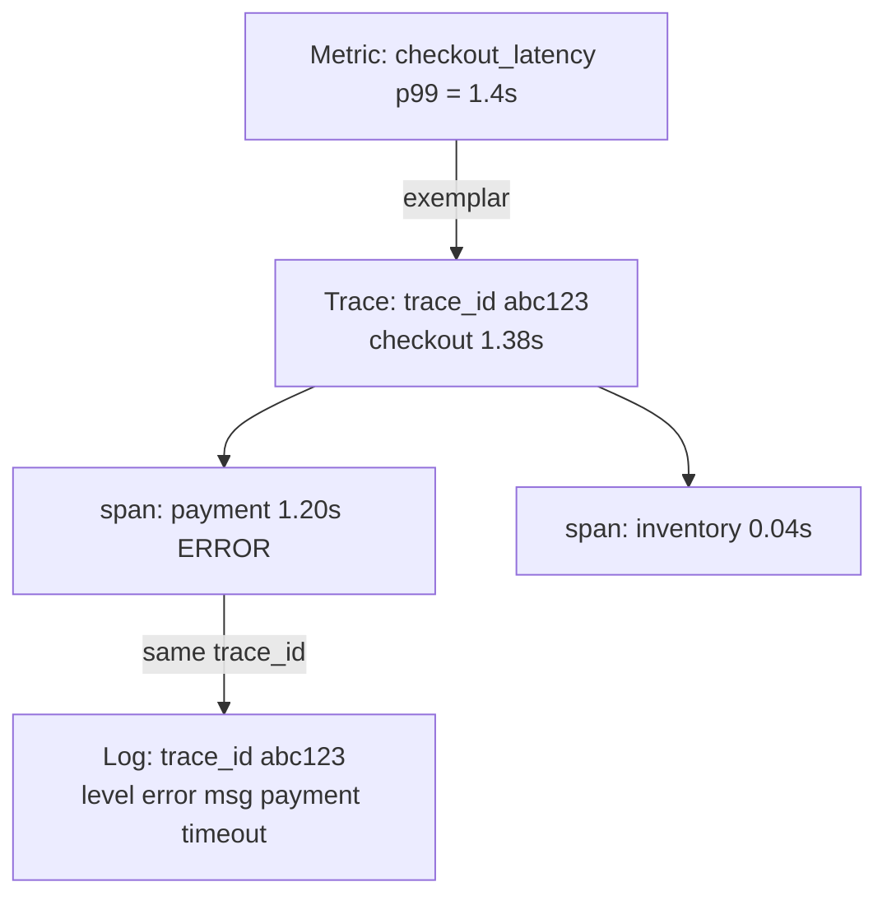

# Logs, metrics, and traces

## Why this matters

It's a Tuesday afternoon and checkout latency just tripled. The dashboard shows p99 response time climbing from 200ms to 1.4s, but only the dashboard. You know *that* it's slow. You have no idea *why*. So you start grepping the application logs, and this is what you find:

```text
2026-06-15 14:32:07 processing order
2026-06-15 14:32:07 calling payment service
2026-06-15 14:32:09 done
2026-06-15 14:32:09 processing order
2026-06-15 14:32:10 error
```

Which order was slow? Which user? Was the 2-second gap the payment call or something after it? What does `error` mean, and is it related to the slow request or a different one entirely? You can't answer any of these from this log, because nothing in it can be queried, joined, or correlated. You have a metric that tells you the building is on fire and logs that are basically a shrug. Three hours later you find the cause by adding `print` statements and redeploying, which is the observability equivalent of fixing a leak by tearing out the wall.

That three-hour gap is what this chapter closes. The fix is not "log more." It is understanding that logs, metrics, and traces answer *different questions*, each has a failure mode when used alone, and the thing that turns three disconnected data sources into one coherent story is a single piece of plumbing — the correlation ID — that costs almost nothing to add and is nearly impossible to retrofit under pressure. Engineers who instrument this before the incident debug in minutes. Engineers who don't, debug in hours, in production, with a redeploy loop.

## Mental model

The "three pillars" framing is common but slightly misleading, because it suggests three equal, interchangeable things. They are not. Each answers a distinct question, at a distinct cost, and each is nearly useless for the questions the others answer. The table below is the whole chapter in miniature — read it once and the rest is detail.

| Pillar | Answers | Cardinality cost | Failure mode in isolation |
|---|---|---|---|
| **Metrics** | "Is something wrong, and how much?" | Cheap per series, expensive per *unique label combination* | Tells you the rate is up, never which request |
| **Logs** | "What exactly happened in this one event?" | Cheap to emit, expensive to store and search at volume | A pile of events with no thread connecting them |
| **Traces** | "Where did the time/error go across services?" | Expensive per request; usually sampled | Sampled away exactly the rare request you care about |

A metric is an aggregate: a number over time, like `http_requests_total` or `checkout_latency_seconds`. It's pre-aggregated and tiny, so you can keep it for a year and alert on it cheaply. But aggregation is lossy by design — you cannot ask a counter "which user hit the slow path?" The number went up; the number cannot tell you who or why. That loss is the price of being cheap enough to keep forever.

A log is a discrete event: a structured record of one thing that happened. It carries the detail a metric throws away — the user, the order, the exact error message. But on its own a log line is an island. You can read one, but you cannot ask "how many of these happened this week" without scanning and counting every line, which is exactly the aggregation that metrics do for free.

A trace is the causal path of one request as it fans out across services, broken into **spans** (one unit of work each), linked by parent/child relationships and a shared **trace ID**. It's the only one of the three that natively captures "this call caused that call." A metric knows the system is slow; a trace knows the slowness lives in the `payment.charge` span, three services deep, and that nothing downstream of it was even reached.

The connective tissue is the correlation ID — a `trace_id` (and `request_id`) that rides on every log line, every span, and as an exemplar on metrics. With it, "p99 is up" links to the exact slow traces, which link to the exact log lines from the services involved. Without it you have three tools that each know part of the story and no way to make them agree on which request they're describing.



The arrows are the whole point. Without a shared ID those four boxes are four separate tools you alt-tab between, guessing. With it, they are one query.

## In practice

### The wrong way: unstructured logs

Here is the code that produced the useless log from the opening:

```python
import logging
logging.basicConfig(level=logging.INFO)

def process_order(order, user):
    logging.info("processing order")
    logging.info("calling payment service")
    charge(order.total)
    logging.info("done")
```

*The same idea in TypeScript:*

```typescript
function processOrder(order: Order, user: User): void {
  console.info("processing order");
  console.info("calling payment service");
  charge(order.total);
  console.info("done");
}
```

Everything wrong with this is structural, not stylistic. The messages are free text, so you can't filter by `user_id` without a regex. There's no request identifier, so concurrent orders interleave into noise. There's no severity granularity that maps to anything. And `logging.info("error")` in an except block discards the exception. You cannot answer "show me all failed checkouts for user 4412 in the last hour" — the data to answer it was never recorded in a queryable shape.

### The right way: structured logging

Emit logs as JSON with stable, typed fields. Every log backend (Loki, Elasticsearch, Datadog, CloudWatch) can index and query these fields directly.

```python
import structlog

log = structlog.get_logger()

def process_order(order, user, request_id, trace_id):
    log = structlog.get_logger().bind(
        request_id=request_id,
        trace_id=trace_id,
        user_id=user.id,
        order_id=order.id,
    )
    log.info("order.processing.start", item_count=len(order.items))
    try:
        result = charge(order.total)
        log.info("payment.charged", amount_cents=order.total, provider=result.provider)
    except PaymentTimeout as e:
        log.error("payment.timeout", amount_cents=order.total, timeout_ms=e.timeout_ms)
        raise
    log.info("order.processing.done")
```

*In TypeScript:*

```typescript
import pino from "pino";

const baseLog = pino();

function processOrder(
  order: Order,
  user: User,
  requestId: string,
  traceId: string,
): void {
  const log = baseLog.child({
    request_id: requestId,
    trace_id: traceId,
    user_id: user.id,
    order_id: order.id,
  });
  log.info({ item_count: order.items.length }, "order.processing.start");
  try {
    const result = charge(order.total);
    log.info(
      { amount_cents: order.total, provider: result.provider },
      "payment.charged",
    );
  } catch (e) {
    if (e instanceof PaymentTimeout) {
      log.error(
        { amount_cents: order.total, timeout_ms: e.timeoutMs },
        "payment.timeout",
      );
    }
    throw e;
  }
  log.info("order.processing.done");
}
```

The output is now machine-parseable:

```json
{"event": "payment.timeout", "level": "error", "request_id": "req-9f3a", "trace_id": "abc123", "user_id": 4412, "order_id": 88120, "amount_cents": 4999, "timeout_ms": 2000, "timestamp": "2026-06-15T14:32:09Z"}
```

Now the question is a query. In Loki's LogQL:

```logql
{service="checkout"} | json | level="error" and user_id="4412"
```

Two rules make structured logging pay off. First, the message field (`event`) is a low-cardinality *constant*, like `payment.timeout` — not an interpolated string. That's what lets you group and count: a thousand timeout events all share the same `event` value, so a dashboard can plot "payment.timeout per minute" without any parsing. Put the variable data in fields, never in the message. The moment you write `f"payment failed for {user}"` you have created a unique string per user and destroyed your ability to aggregate. Second, bind context once (`request_id`, `trace_id`, `user_id`) and let every subsequent line inherit it, so correlation is automatic rather than copy-pasted. Manual correlation is correlation that will be forgotten on exactly the line you needed it.

### Metrics with Prometheus, and the cardinality trap

Metrics are counters, gauges, and histograms exported for scraping. A histogram is what you want for latency, because it lets you compute quantiles server-side, after the fact, at any percentile you ask for — not the pre-baked average that hides every tail:

```python
from prometheus_client import Counter, Histogram

checkout_latency = Histogram(
    "checkout_latency_seconds",
    "End-to-end checkout duration",
    buckets=[0.05, 0.1, 0.2, 0.5, 1, 2, 5],
    labelnames=["status", "payment_provider"],
)
checkout_total = Counter(
    "checkout_total", "Checkouts attempted", labelnames=["status"]
)

with checkout_latency.labels(status="ok", payment_provider="stripe").time():
    process_order(...)
checkout_total.labels(status="ok").inc()
```

*The TypeScript equivalent:*

```typescript
import { Counter, Histogram } from "prom-client";

const checkoutLatency = new Histogram({
  name: "checkout_latency_seconds",
  help: "End-to-end checkout duration",
  buckets: [0.05, 0.1, 0.2, 0.5, 1, 2, 5],
  labelNames: ["status", "payment_provider"],
});
const checkoutTotal = new Counter({
  name: "checkout_total",
  help: "Checkouts attempted",
  labelNames: ["status"],
});

const end = checkoutLatency
  .labels({ status: "ok", payment_provider: "stripe" })
  .startTimer();
processOrder(/* ... */);
end();
checkoutTotal.labels({ status: "ok" }).inc();
```

The p99 alert that fired in the opening, in PromQL:

```promql
histogram_quantile(0.99,
  sum(rate(checkout_latency_seconds_bucket[5m])) by (le, payment_provider)
) > 1
```

Now the trap. **Cardinality** is the number of distinct time series, which is the product of every label's distinct values. `status` (3 values) × `payment_provider` (4 values) = 12 series. Fine. But add `user_id` as a label and you get 12 × *every user who ever checked out*. A Prometheus instance that was storing thousands of series is now storing millions, memory blows up, and queries crawl. This is the single most common way teams take down their own monitoring — not with too much traffic, but with one well-meaning label.

```python
# WRONG: unbounded label turns one metric into millions of series
checkout_total.labels(status="ok", user_id=user.id, order_id=order.id).inc()
```

*In TypeScript:*

```typescript
// WRONG: unbounded label turns one metric into millions of series
checkoutTotal.labels({ status: "ok", user_id: user.id, order_id: order.id }).inc();
```

The rule: **metric labels must be low-cardinality and bounded** — enums, not identifiers. User IDs, order IDs, trace IDs, raw URLs with path params, email addresses: none of these belong in labels. They belong in logs and traces, where high cardinality is the entire point. If you need to connect a latency spike to specific requests, use **exemplars** — Prometheus and OpenTelemetry let a histogram bucket carry a sampled `trace_id`, so you click the spike on the graph and jump to a real trace, without paying the cardinality cost. Exemplars are the sanctioned bridge from the cheap aggregate world to the expensive per-request world; reach for them instead of smuggling an ID into a label.

### Traces tie services together

A trace follows one request across process boundaries. With OpenTelemetry the instrumentation is explicit spans, and the trace ID is what unifies everything:

```python
from opentelemetry import trace
tracer = trace.get_tracer("checkout")

def process_order(order, user):
    with tracer.start_as_current_span("checkout") as span:
        span.set_attribute("user.id", user.id)          # high-cardinality OK here
        span.set_attribute("order.id", order.id)
        ctx = span.get_span_context()
        trace_id = format(ctx.trace_id, "032x")          # feed this to logs
        with tracer.start_as_current_span("payment.charge"):
            charge(order.total)
        with tracer.start_as_current_span("inventory.reserve"):
            reserve(order.items)
```

*The same idea in TypeScript:*

```typescript
import { trace } from "@opentelemetry/api";

const tracer = trace.getTracer("checkout");

function processOrder(order: Order, user: User): void {
  tracer.startActiveSpan("checkout", (span) => {
    span.setAttribute("user.id", user.id); // high-cardinality OK here
    span.setAttribute("order.id", order.id);
    const ctx = span.spanContext();
    const traceId = ctx.traceId; // feed this to logs
    tracer.startActiveSpan("payment.charge", (paymentSpan) => {
      charge(order.total);
      paymentSpan.end();
    });
    tracer.startActiveSpan("inventory.reserve", (inventorySpan) => {
      reserve(order.items);
      inventorySpan.end();
    });
    span.end();
  });
}
```

Span attributes are where high-cardinality data is welcome — `user.id`, `order.id`, full SQL, the works — because a trace is one request, not an aggregate. There is no series count to explode; each attribute is attached to a single span and stored once. The span tree shows you that of the 1.38s checkout, 1.20s was in `payment.charge`, and that `inventory.reserve` was fast and ran only after payment returned. That decomposition — which child ate the time, and in what order the children ran — is the "where did the time go" answer no metric or log can give you on its own.

The catch: traces are usually **sampled** (a small fraction of requests) to control cost, so the one anomalous request may not be captured. Mitigate with **tail-based sampling** — decide after the trace completes, keeping all traces that errored or exceeded a latency threshold while sampling the boring fast ones. You pay to store the traces that teach you something and discard the ones that don't. That's covered in depth in the next chapter.

### Correlation: propagate one ID everywhere

The mechanism that makes all three queryable as one story is context propagation. The incoming request carries a `traceparent` header (W3C Trace Context), the service adopts that trace ID, stamps it on every log line and span, and forwards it on outbound calls:

```python
def handle_request(request):
    request_id = request.headers.get("x-request-id") or new_id()
    span = trace.get_current_span()
    trace_id = format(span.get_span_context().trace_id, "032x")
    structlog.contextvars.bind_contextvars(request_id=request_id, trace_id=trace_id)
    # every log.info() below now carries both IDs, automatically
```

*The TypeScript equivalent:*

```typescript
import { AsyncLocalStorage } from "node:async_hooks";
import { trace } from "@opentelemetry/api";

const logContext = new AsyncLocalStorage<Record<string, string>>();

function handleRequest(request: Request): void {
  const requestId = request.headers.get("x-request-id") ?? newId();
  const span = trace.getActiveSpan();
  const traceId = span?.spanContext().traceId ?? "";
  logContext.enterWith({ request_id: requestId, trace_id: traceId });
  // every log.info() below now carries both IDs, automatically
}
```

Now the full loop closes: the alert fires on the metric, its exemplar gives you a `trace_id`, the trace shows `payment.charge` ate 1.2s, and `{service="payment"} | json | trace_id="abc123"` pulls the exact log line — `payment.timeout, provider=stripe, timeout_ms=2000` — across every service the request touched. Three hours becomes three minutes.

> **Connect the dots:** The W3C `traceparent` header only survives if every hop forwards it — through your API gateway, message queues, and background jobs. That propagation is the backbone of OpenTelemetry (Chapter 2 of this Part) and depends directly on the request-flow discipline from Part 5 (APIs) and the async patterns in Part 6. A dropped header anywhere breaks the chain into disconnected fragments.

## Pitfalls and anti-patterns

**Logging unstructured strings.** Recognize it by logs that can only be searched with regex and grep, never grouped or counted. The message is interpolated (`f"user {id} failed"`) so every line is unique. Fix: emit JSON with a constant `event` field and put all variables in typed fields. Adopt `structlog`, `zap`, `slog`, or `pino` and ban string interpolation in log messages via lint rule.

**High-cardinality metric labels.** Recognize it by Prometheus OOMing, slow queries, or a `scrape_samples_scraped` count in the millions. The cause is almost always an ID, URL, or email smuggled into a label. Fix: move identifiers to logs/trace attributes, keep labels as bounded enums, and use exemplars to jump from metric to trace. Set `sample_limit` on scrape configs as a guardrail.

**The single-pillar shop.** Recognize it by "we have great dashboards but every incident is a manual log dig," or the reverse, "we log everything but can't tell if the system is healthy." Each pillar alone has a blind spot: metrics can't explain, logs can't aggregate, traces get sampled. Fix: deploy all three with a shared correlation ID before you need them; the ID is the cheap part and the part you cannot add mid-incident.

**Log-and-rethrow noise.** Recognize it by the same error appearing five times as it bubbles up through five layers, inflating your error rate and bill. Fix: log an exception once, at the boundary where it's handled, with full context; let it propagate silently otherwise. Attach the error to the span (`span.record_exception(e)`) so it's visible in the trace without re-logging.

**Logging secrets and PII.** Recognize it by passwords, tokens, full card numbers, or emails showing up in plaintext logs — usually because someone logged a whole request or response object. Fix: a redaction processor in the logging pipeline that drops or hashes known-sensitive fields, and never `log.info("payload", body=request.json())` on untrusted shapes.

> **Security note:** Logs are a data store subject to the same rules as your database. Treat them as such: redact PII and secrets at emission, encrypt at rest, scope dashboard and log-search access by role, and keep an audit log of who queried what. A trace attribute holding a full JWT or a log line with a raw password is a breach waiting for a compliance audit. The cardinality freedom traces give you is exactly why they're a tempting place to dump sensitive data — resist it.

## Production checklist

- [ ] All application logs emit structured JSON with a constant `event`/message field and variables in typed fields
- [ ] Every log line, span, and metric exemplar carries `trace_id` (and `request_id`); context is bound once per request, not copy-pasted
- [ ] W3C `traceparent` is propagated across every service hop, queue, and background job
- [ ] Metric labels are bounded enums only; no user IDs, order IDs, raw URLs, or emails as labels
- [ ] A `sample_limit` (Prometheus) or equivalent guardrail prevents cardinality explosions from taking down monitoring
- [ ] Latency is measured with histograms (for server-side quantiles), not pre-computed averages
- [ ] Exemplars link metric spikes to representative traces
- [ ] Tracing uses tail-based sampling that always keeps errors and slow outliers
- [ ] A redaction step strips secrets and PII before logs leave the process
- [ ] Log retention, access control (RBAC), and encryption-at-rest are configured and audited
- [ ] Exceptions are logged once at the handling boundary and recorded on the span, not re-logged at every layer

## Exercises

1. **(Comprehension)** For each of these questions, name which pillar answers it best and explain why the other two can't: (a) "What is our checkout error rate over the last 30 days?" (b) "Why did request `req-9f3a` take 1.4 seconds?" (c) "What was the exact payment provider error for order 88120?" Then explain what specifically connects all three answers when they concern the same request.

2. **(Applied)** Take the unstructured `process_order` from this chapter. Convert it to structured logging, add a Prometheus histogram for end-to-end latency with `status` and `payment_provider` labels, and wrap it in an OpenTelemetry span that stamps the `trace_id` onto every log line. Then write the LogQL (or your backend's equivalent) query that returns every error log for a single `trace_id`, and the PromQL that computes p99 latency by provider. Verify the trace ID in your logs matches the one in your trace.

3. **(Design)** You run 12 services handling a high, steady request volume. Storing every trace is too expensive and 1% head sampling keeps missing the rare errors (a small fraction of traffic) that users complain about. Design a sampling and correlation strategy that (a) always captures errored and slow requests, (b) keeps a representative baseline of healthy traffic, (c) stays within a fixed trace-storage budget, and (d) still lets an on-call engineer get from a p99 metric alert to the exact failing trace and its logs. Name the tradeoffs of head vs. tail sampling and where each runs.

## Further reading

- *Distributed Systems Observability*, Cindy Sridharan (O'Reilly) — the canonical articulation of the three pillars and why correlation matters more than any single one
- *Observability Engineering*, Charity Majors, Liz Fong-Jones, George Miranda (O'Reilly) — the high-cardinality, event-based view and the argument against metrics-only monitoring
- W3C Trace Context Recommendation — the `traceparent`/`tracestate` header spec that makes cross-service correlation interoperable (https://www.w3.org/TR/trace-context/)
- OpenTelemetry specification and docs — vendor-neutral standard for traces, metrics, and logs (https://opentelemetry.io/docs/specs/otel/)
- Prometheus documentation, "Metric and label naming" and "Histograms and summaries" — the official guidance on cardinality and quantiles (https://prometheus.io/docs/practices/)
- *Site Reliability Engineering*, Google (free online), chapter "Monitoring Distributed Systems" — the four golden signals and why you measure them (https://sre.google/books/)
- Benjamin H. Sigelman et al., Dapper paper (Google, 2010) — the original large-scale distributed tracing design that modern traces descend from (https://research.google/pubs/pub36356/)
