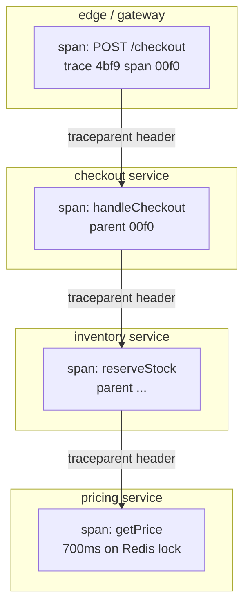

# OpenTelemetry in practice

## Why this matters

It's a Tuesday afternoon and checkout latency just doubled. The dashboard for the `checkout` service shows p99 climbing from 200ms to 900ms, but checkout's own code didn't change this week. You open the service logs and see nothing unusual — every request returns 200, every line says "order placed." The graph says you're slow; the logs say you're fine. So you start guessing. Is it the database? The payment provider? The inventory service checkout calls synchronously? You SSH into three machines, tail three log files, and try to line up timestamps across services whose clocks aren't perfectly synced. An hour goes by.

The thing you needed was a single request's full story: this `POST /checkout` entered the edge proxy, spent 4ms in `checkout`, then called `inventory`, which called `pricing`, which spent 700ms waiting on a Redis lock. One trace, spanning four services, would have pointed at the answer in thirty seconds. Without it, you're correlating log lines by eye and hoping the clocks agree.

That trace is exactly what OpenTelemetry (OTel) gives you, and it gives it to you in a vendor-neutral way: the same instrumentation feeds Jaeger, Honeycomb, Datadog, Grafana Tempo, or a homegrown backend, swappable by editing one config file. Before OTel, distributed tracing meant committing to a vendor's SDK in your application code — and migrating off it meant a re-instrumentation project across every service. OpenTelemetry is the CNCF-backed standard that decoupled "produce telemetry" from "store and query telemetry." This chapter is about wiring it up so that the next Tuesday afternoon is a thirty-second afternoon.

## Mental model

OpenTelemetry has three layers worth holding in your head: a **data model** (what telemetry looks like on the wire), an **SDK** (what runs inside your process to produce it), and the **Collector** (an out-of-process pipeline that receives, processes, and ships it). The protocol that ties them together is OTLP (OpenTelemetry Protocol), a gRPC/HTTP wire format defined by the spec.

OTel covers three signals, not one: **traces** (the request-scoped story above), **metrics** (aggregated numbers like request rate and p99 latency), and **logs** (timestamped lines). The leverage of doing all three under one project is correlation: a span carries a `trace_id`, and if your logging layer stamps that same `trace_id` onto every log line emitted inside the span, then "jump from this slow trace to its logs" becomes one click instead of a timestamp hunt. This chapter focuses on tracing because it's where the cross-service payoff is largest, but the SDK, the OTLP protocol, and the Collector pipeline you'll build are shared across all three signals — wire up tracing well and adding metrics or logs is incremental, not a second project.

The unit you'll touch most is the **span**: a single named operation with a start time, a duration, a status, a bag of attributes (key-value pairs), and a parent. A **trace** is a tree of spans sharing one `trace_id`. Each span has its own `span_id` and a `parent_span_id` pointing at the span that caused it. The root span has no parent. Attributes are where the diagnostic value lives — `http.method`, `db.statement`, `order.id` — and the **semantic conventions** spec standardizes those names so a backend can render any compliant service's spans without per-team configuration.

The magic that makes a trace cross service boundaries is **context propagation**: when service A calls service B over HTTP, A injects its current `trace_id` and `span_id` into request headers, and B extracts them to make its spans children of A's. The standard header is W3C `traceparent` (a Recommendation from the W3C Trace Context working group), which looks like this:

```text
traceparent: 00-4bf92f3577b34da6a3ce929d0e0e4736-00f067aa0ba902b7-01
             ^  ^                                ^                ^
          version  trace-id (16 bytes)      parent-id (8 bytes)  flags (sampled)
```



Every span here shares one `trace_id`. The parent pointers reconstruct the tree, and the backend renders it as a waterfall where the 700ms Redis wait is impossible to miss. The propagation is the load-bearing part: lose the header on one hop and the trace splits into two disconnected trees, which is worse than useless because it looks complete while hiding the link.

The SDK has three concepts you configure: a **Tracer** (creates spans), a **Processor** (batches or filters spans before export — almost always `BatchSpanProcessor` in production), and an **Exporter** (serializes to OTLP and ships). The recommended target is not your vendor directly but the **Collector**, a separate process that decouples your app from wherever data ultimately lands. Hold one more distinction: the **API** (the `@opentelemetry/api` surface you call from business code) is deliberately separate from the **SDK** (the implementation that actually records and exports). Libraries instrument against the API only; if no SDK is installed the API calls become no-ops, so a shared library can carry instrumentation without forcing a tracing backend on every consumer.

## In practice

### Auto-instrumentation first

The fastest win is auto-instrumentation: pre-built instrumentation libraries that patch popular frameworks (HTTP servers, gRPC, database drivers) to emit spans without you writing span code. For Node.js, the zero-code path is an environment-variable-driven loader.

```bash
npm install @opentelemetry/api \
  @opentelemetry/sdk-node \
  @opentelemetry/auto-instrumentations-node \
  @opentelemetry/exporter-trace-otlp-grpc
```

```typescript
// tracing.ts — loaded BEFORE any application code via `node -r ./tracing.js`
import { NodeSDK } from '@opentelemetry/sdk-node';
import { getNodeAutoInstrumentations } from '@opentelemetry/auto-instrumentations-node';
import { OTLPTraceExporter } from '@opentelemetry/exporter-trace-otlp-grpc';
import { resourceFromAttributes } from '@opentelemetry/resources';
import { ATTR_SERVICE_NAME, ATTR_SERVICE_VERSION } from '@opentelemetry/semantic-conventions';

const sdk = new NodeSDK({
  resource: resourceFromAttributes({
    [ATTR_SERVICE_NAME]: 'checkout',
    [ATTR_SERVICE_VERSION]: process.env.GIT_SHA ?? 'dev',
  }),
  // Exports to the Collector, not directly to a vendor.
  traceExporter: new OTLPTraceExporter({ url: 'http://otel-collector:4317' }),
  instrumentations: [getNodeAutoInstrumentations()],
});

sdk.start();
process.on('SIGTERM', () => sdk.shutdown().finally(() => process.exit(0)));
```

The `service.name` resource attribute is not optional — it's how the backend groups spans into a service. Set it via code or the `OTEL_SERVICE_NAME` env var; if you forget, every span lands in a bucket called `unknown_service` and your service map is garbage. Resource attributes are the static facts about *where* a span came from (service name, version, deployment environment, host, Kubernetes pod), as opposed to span attributes, which describe *what* one operation did. Set the environment (`deployment.environment`) too, or staging and production traces will pile into the same view.

Run it with the tracing module preloaded so instrumentation patches `http`, `express`, `pg`, etc. before they're imported:

```bash
GIT_SHA=$(git rev-parse --short HEAD) node -r ./tracing.js server.js
```

That alone gives you spans for every inbound HTTP request, every outbound HTTP call, and every database query — with `traceparent` propagation already wired between them, because the HTTP instrumentation injects on the client side and extracts on the server side automatically. The preload ordering matters: auto-instrumentation works by monkey-patching modules as they load, so if your application code `require`s `express` before `tracing.js` runs, the patch misses and those spans never appear. Loading via `-r` (or an equivalent bootstrap import) before anything else is the whole trick.

### Manual spans for business logic

Auto-instrumentation sees frameworks, not your domain. When the interesting work is a pricing calculation or a fraud check, add manual spans. Get a tracer from the global API and wrap the operation in `startActiveSpan`, which makes the new span the active context so child spans nest correctly.

```typescript
import { trace, SpanStatusCode } from '@opentelemetry/api';

const tracer = trace.getTracer('checkout', '1.0.0');

async function reserveStock(orderId: string, items: Item[]) {
  return tracer.startActiveSpan('reserveStock', async (span) => {
    try {
      span.setAttribute('order.id', orderId);
      span.setAttribute('order.item_count', items.length);

      const result = await inventoryClient.reserve(items); // auto-instrumented HTTP call nests here
      span.setAttribute('inventory.reserved', result.reservedCount);
      return result;
    } catch (err) {
      span.recordException(err as Error);
      span.setStatus({ code: SpanStatusCode.ERROR, message: (err as Error).message });
      throw err;
    } finally {
      span.end(); // ALWAYS end the span, or it leaks and never exports
    }
  });
}
```

Two rules carry most of the value here. First, `span.end()` belongs in a `finally` — an unended span is never exported and silently disappears. Second, record errors with `recordException` *and* set the status to `ERROR`; the exception gives you the stack, the status is what the backend filters on when you ask "show me failed spans." A third habit pays off later: name spans by *operation*, not by *value* — `reserveStock`, never `reserveStock order=8a3f`. The variable part belongs in an attribute. Span names become a grouping key in the backend, and a unique name per request makes that grouping useless.

The Python SDK mirrors this exactly, which is the point of a cross-language standard:

```python
from opentelemetry import trace

tracer = trace.get_tracer("pricing", "1.0.0")

def get_price(sku: str) -> Decimal:
    with tracer.start_as_current_span("get_price") as span:
        span.set_attribute("sku", sku)
        price = price_repo.lookup(sku)  # auto-instrumented DB call nests here
        span.set_attribute("price.cents", int(price * 100))
        return price
```

The TypeScript equivalent:

```typescript
import { trace } from '@opentelemetry/api';

const tracer = trace.getTracer('pricing', '1.0.0');

function getPrice(sku: string): Decimal {
  return tracer.startActiveSpan('get_price', (span) => {
    span.setAttribute('sku', sku);
    const price = priceRepo.lookup(sku); // auto-instrumented DB call nests here
    span.setAttribute('price.cents', Math.round(price.times(100).toNumber()));
    span.end();
    return price;
  });
}
```

### Following a propagated trace across services

When `checkout` calls `inventory`, the HTTP instrumentation on the client injects `traceparent`; the server instrumentation on `inventory` extracts it. You can see the linkage by logging the active span context on each side. The resulting trace looks like this in the backend (here, the Jaeger waterfall view rendered as text):

```text
Trace 4bf92f3577b34da6a3ce929d0e0e4736   total 912ms
checkout  POST /checkout                          ├──────────────────── 912ms
checkout    handleCheckout                        │ ├────────────────── 905ms
checkout      reserveStock                        │ │ ├──────────────── 880ms
inventory       POST /reserve                     │ │ │ ├────────────── 870ms
pricing           GET /price                      │ │ │ │ ├──────────── 760ms
pricing             redis GET lock:sku:42         │ │ │ │ │ ████████ 700ms  ← the culprit
```

The 700ms Redis wait is one row, attributed to the exact service and operation. No timestamp archaeology.

If you propagate context through a queue or a custom protocol that the auto-instrumentation doesn't know, you inject and extract manually using the configured propagator:

```typescript
import { propagation, context, trace } from '@opentelemetry/api';

// Producer: inject current context into a plain carrier object.
const carrier: Record<string, string> = {};
propagation.inject(context.active(), carrier);
await queue.publish({ body, headers: carrier }); // carrier now has `traceparent`

// Consumer: extract into a context, then run the handler inside it.
const ctx = propagation.extract(context.active(), msg.headers);
context.with(ctx, () => {
  tracer.startActiveSpan('process-order', (span) => {
    handle(msg);
    span.end();
  });
});
```

A queue hop also breaks the simple parent-child assumption: the producer may finish long before the consumer starts, so the consumer span is better modeled as a *link* to the producer span than as a direct child. Links let one trace reference another without implying the child ran inside the parent's lifetime — the right tool for fan-out, batching, and async handoffs where strict nesting would lie about timing.

### The Collector

Pointing every service directly at a vendor's ingest endpoint couples your fleet to that vendor and bakes API keys into every deployment. The Collector breaks that coupling. It's a standalone binary with a pipeline of **receivers** (ingest), **processors** (batch, filter, redact, sample), and **exporters** (ship onward). The common topology runs it in two tiers: an **agent** close to each workload (a sidecar or a per-node daemon) that does cheap local work like batching and adding host metadata, feeding a **gateway** pool for the cluster that does the expensive, stateful work — tail sampling and fan-out to backends. The agent tier keeps the network hop short and absorbs bursts; the gateway tier centralizes policy so you change sampling once, not per node.

```yaml
# otel-collector-config.yaml
receivers:
  otlp:
    protocols:
      grpc: { endpoint: 0.0.0.0:4317 }
      http: { endpoint: 0.0.0.0:4318 }

processors:
  batch:
    timeout: 5s
    send_batch_size: 1024
  memory_limiter:
    check_interval: 1s
    limit_mib: 512
  # Redact PII before it ever leaves your network.
  attributes/scrub:
    actions:
      - { key: user.email, action: delete }
      - { key: http.request.header.authorization, action: delete }

exporters:
  otlp/tempo:
    endpoint: tempo:4317
    tls: { insecure: true }
  # Swap vendors here, not in app code.
  # otlphttp/honeycomb:
  #   endpoint: https://api.honeycomb.io
  #   headers: { x-honeycomb-team: ${env:HONEYCOMB_API_KEY} }

service:
  pipelines:
    traces:
      receivers: [otlp]
      processors: [memory_limiter, attributes/scrub, batch]
      exporters: [otlp/tempo]
```

This config is where vendor neutrality becomes real. Your application code says `url: http://otel-collector:4317` and nothing else. To migrate from Tempo to Honeycomb, you uncomment one exporter, change one line in the pipeline, and redeploy the Collector. No application redeploy, no re-instrumentation, no code review across forty repos. That decoupling is the entire reason OTel exists, and the Collector is where you cash it in. The same shape generalizes: add a `metrics` or `logs` pipeline alongside `traces`, reuse the same receivers and the same scrubbing processor, and you've extended observability coverage without touching application code again.

> **Connect the dots:** The Collector is just a pipeline — receivers, processors, exporters — which is the same shape as the log-shipping pipelines in the previous chapter and the stream-processing topologies in Part 7. Once you see telemetry as a typed stream flowing through composable stages, you can reason about backpressure, batching, and sampling the same way everywhere.

> **Security note:** Spans are a notorious PII leak. Attributes like `user.email`, full URLs with query-string tokens, and SQL statements with literal values flow straight into a third-party backend by default. Scrub at the Collector (as above) so redaction happens once, centrally, before egress — not in N services where one will forget. Treat trace-backend access as production-data access: SSO, audit logs, and least privilege, because a trace is a high-fidelity recording of real user requests.

## Pitfalls and anti-patterns

**1. Broken propagation (the orphaned trace).** A trace silently splits into two when one hop drops the `traceparent` header — common with hand-rolled HTTP clients, message queues, or a gateway that strips unknown headers. Recognize it when a backend shows two short traces where you expected one deep one, or a service appears as a root span when it should be a child. Fix it by using instrumented HTTP clients, allow-listing `traceparent`/`tracestate` through every proxy, and for custom transports calling `propagation.inject`/`extract` explicitly.

**2. Head sampling that throws away the errors.** Sampling at the SDK ("keep 1% of traces") decides at the root span, before you know whether the request failed. You end up dropping 99% of your error traces — exactly the ones you wanted. Recognize it when incidents have no traces to look at. Fix it with **tail sampling** in the Collector, which buffers a full trace and decides after seeing the outcome, so you can keep all error and slow traces and a small fraction of fast successes.

**3. High-cardinality attributes that melt the backend (and your bill).** Putting unbounded values — `user.id`, full request URLs with IDs, raw SQL with literals — as attributes is fine for traces (you query them) but catastrophic if those same values become metric labels, where each unique value is a new time series. Recognize it via exploding metric counts or a backend bill that scales with traffic. Fix it by keeping high-cardinality data on spans, never on metric dimensions, and parameterizing route templates (`/orders/{id}`, not `/orders/8a3f`).

**4. Forgetting `span.end()` / fire-and-forget shutdown.** An unended span never exports; a process that exits before `BatchSpanProcessor` flushes loses its last batch. Recognize it as traces that are mysteriously incomplete near process boundaries or short-lived jobs. Fix it by ending spans in `finally`, and calling `sdk.shutdown()` (which flushes) on `SIGTERM` before exit.

**5. Vendor lock-in through the back door.** Importing a vendor's proprietary SDK "just for this one feature," or exporting straight from the app to the vendor's endpoint, quietly recreates the coupling OTel was meant to remove. Recognize it when "swap the backend" becomes a multi-repo code change. Fix it by treating the vendor-neutral API + OTLP-to-Collector path as a hard architectural boundary; vendor-specific behavior lives in Collector config only.

## Production checklist

- [ ] `service.name`, `service.version` (git SHA), and `deployment.environment` set on every service via resource attributes
- [ ] W3C Trace Context (`traceparent`) propagation verified end-to-end across every service hop, including queues and proxies
- [ ] App exports OTLP to a local Collector, never directly to a vendor endpoint
- [ ] `BatchSpanProcessor` in production (not `SimpleSpanProcessor`); `memory_limiter` processor enabled in the Collector
- [ ] Graceful shutdown calls `sdk.shutdown()` on `SIGTERM` to flush the final batch
- [ ] PII/secret scrubbing processor in the Collector pipeline (emails, auth headers, tokens) before any exporter
- [ ] Tail-based sampling configured to keep all errors and slow traces
- [ ] Errors recorded with both `recordException` and `setStatus({ code: ERROR })`
- [ ] Span names are operation-level, and route templates parameterized so paths don't become high-cardinality
- [ ] Trace-backend access behind SSO with audit logging; API keys live only in the Collector, not in app images

## Exercises

1. **(Comprehension)** Given the header `traceparent: 00-4bf92f3577b34da6a3ce929d0e0e4736-00f067aa0ba902b7-01`, identify the version, trace-id, parent-id, and sampled flag. Explain what changes in this header on the next service hop and what stays the same, and why a child span reuses the trace-id but gets a fresh span-id.

2. **(Applied)** Stand up two small services (A calls B over HTTP) with Node or Python auto-instrumentation, plus a local Collector exporting to Jaeger or Tempo. Send one request and confirm you see a single trace spanning both services. Then deliberately break propagation by stripping `traceparent` at a proxy or using an uninstrumented HTTP client, and observe the trace splitting into two. Restore it and explain what fixed it.

3. **(Design)** Your platform has dozens of services across three languages emitting a high, sustained trace volume, and the trace-storage bill is unsustainable. Design a sampling and Collector topology that keeps every error and every trace slower than your SLO threshold, drops most fast successes, scrubs PII before egress, and survives a Collector node failure without losing in-flight data. Specify where head vs. tail sampling lives, how you size the tail-sampling buffer, and the tradeoff you're accepting.

## Further reading

- W3C Trace Context Recommendation — the `traceparent`/`tracestate` spec every implementation follows (https://www.w3.org/TR/trace-context/)
- OpenTelemetry Specification — data model, API, SDK, and OTLP (https://opentelemetry.io/docs/specs/otel/)
- OpenTelemetry Collector documentation — receivers, processors, exporters, and deployment patterns (https://opentelemetry.io/docs/collector/)
- OpenTelemetry Semantic Conventions — the standard attribute names that make backends interoperable (https://opentelemetry.io/docs/specs/semconv/)
- Benjamin H. Sigelman et al., "Dapper, a Large-Scale Distributed Systems Tracing Infrastructure" (Google, 2010) — the paper that introduced the span/trace model OTel inherits (https://research.google/pubs/pub36356/)
- Tail sampling processor reference, opentelemetry-collector-contrib — configuration for outcome-aware sampling (https://github.com/open-telemetry/opentelemetry-collector-contrib/tree/main/processor/tailsamplingprocessor)
