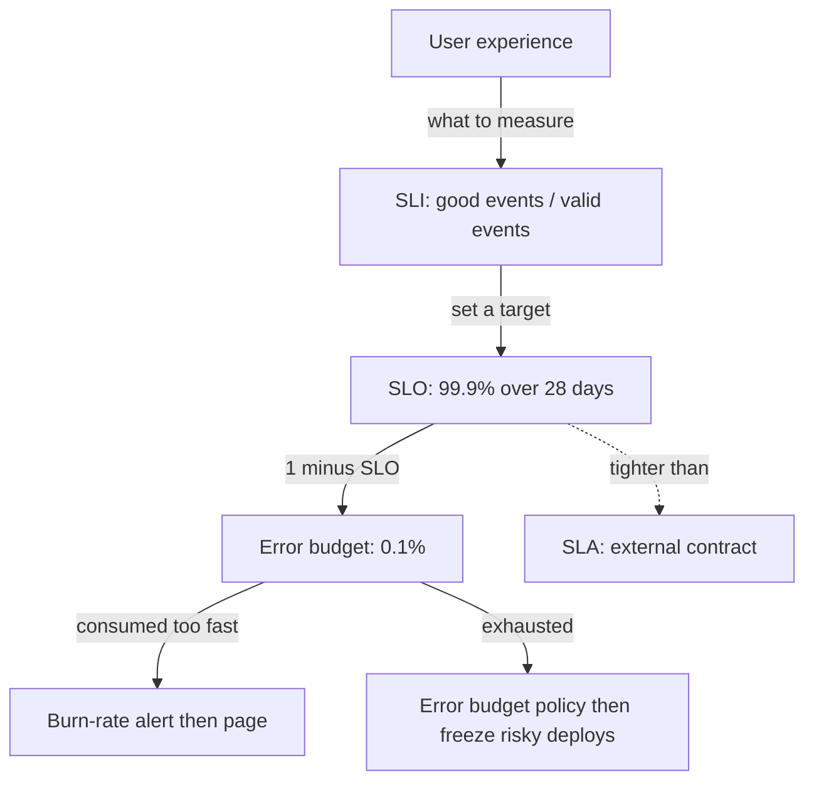

# SLOs, SLIs, and error budgets

## Why this matters

It's a Tuesday afternoon and your team is in a planning meeting. The product manager wants the checkout-redesign shipped this sprint. The senior engineer wants two weeks to pay down the flaky payment-retry code that's been waking people up at 3 a.m. Both are sure they're right, and the argument is going in circles because nobody has a number. It's reliability *feelings* versus velocity *feelings*, and feelings don't resolve.

Now replay that meeting in a team that runs error budgets. Someone pulls up a dashboard: the checkout API has a 99.9% availability target over 28 days, and it's currently at 99.94%. There's budget to spare. Ship the redesign. Three weeks later the same dashboard shows 99.87% — the budget is blown — and the same engineer says "we're over budget, the next sprint is reliability work," and nobody argues, because the policy was agreed in advance. The number did the arguing.

That is the entire point of SLOs. They are not a monitoring feature; they are a decision-making tool. An availability target, measured honestly and tied to an agreed policy, converts a recurring political fight into an arithmetic check. The cost of not having one is that every reliability-versus-features decision gets re-litigated from scratch, usually by whoever is loudest or most recently paged. This chapter shows how to define what to measure (the SLI), set a target that reflects what users actually need (the SLO), turn the gap into a spendable budget (the error budget), and alert on it in a way that wakes you up for real problems and lets you sleep through noise (burn-rate alerts).

## Mental model

Three terms, often confused, that nest cleanly:

- **SLI — Service Level Indicator.** A *measurement*: a number between 0 and 1 (or 0–100%) describing some quality of service. "The proportion of HTTP requests that returned a non-5xx status in under 300 ms." It's a ratio of good events to valid events.
- **SLO — Service Level Objective.** A *target* for an SLI over a window. "99.9% of requests succeed, measured over a rolling 28 days." It's the line you're trying to stay above.
- **SLA — Service Level Agreement.** A *contract* with consequences (refunds, credits) if you miss. Your internal SLO should be tighter than any external SLA so you find out before your customers' lawyers do.

The number that does the real work is what's left over:

> **Error budget = 1 − SLO.**

A 99.9% SLO grants a 0.1% error budget. Over 28 days that's a concrete, spendable quantity of failure. Spend it on risky deploys, experiments, and the occasional bad day. When it's gone, you stop shipping risk until it refills.



Two ideas make this useful rather than ceremonial. First, **100% is the wrong target.** Chasing 100% costs exponentially more for each added nine and denies you any budget to deploy or experiment with. The right reliability target is the lowest one your users won't notice — often well below what engineers instinctively reach for. Second, **the budget is a resource you are *meant* to spend.** An unspent error budget at the end of every quarter means you're over-investing in reliability and under-shipping. A blown budget means the opposite. Healthy teams hover near the line.

A 99.9% monthly SLO translates to roughly 43 minutes of downtime budget per 30 days; 99.99% is about 4.3 minutes. The jump from three nines to four nines is a 10x reduction in allowed failure, and usually a far larger multiple in engineering cost.

## In practice

### Choosing an SLI

Pick SLIs that track what users feel, not what's easy to scrape. CPU utilization is not an SLI — no user has ever cared about your CPU. The canonical request-driven SLIs are **availability** (fraction of requests that succeed) and **latency** (fraction of requests served faster than a threshold). Express both as `good / valid`.

The trap is the denominator. "Valid" events should exclude requests that aren't your service's fault. A client sending a malformed request and getting a 400 is working as designed; counting that 400 against your availability punishes you for your users' bugs. So:

- **Good:** status not in 5xx (and, for latency, served under the threshold).
- **Valid:** all requests *except* those you deliberately exclude (e.g. 4xx that are clearly client error, or health-check traffic).

Here's a Prometheus instrumentation in Go that records the histogram you need for both SLIs:

```go
package main

import (
	"net/http"
	"time"

	"github.com/prometheus/client_golang/prometheus"
	"github.com/prometheus/client_golang/prometheus/promauto"
)

var reqDuration = promauto.NewHistogramVec(
	prometheus.HistogramOpts{
		Name: "http_request_duration_seconds",
		Help: "Request latency by route and status class.",
		// Buckets straddle the SLO threshold (0.3s) so we can query it precisely.
		Buckets: []float64{0.05, 0.1, 0.2, 0.3, 0.5, 1, 2, 5},
	},
	[]string{"route", "status_class"},
)

// statusWriter captures the response status code for instrumentation.
type statusWriter struct {
	http.ResponseWriter
	status int
}

func (w *statusWriter) WriteHeader(code int) {
	w.status = code
	w.ResponseWriter.WriteHeader(code)
}

func instrument(route string, next http.HandlerFunc) http.HandlerFunc {
	return func(w http.ResponseWriter, r *http.Request) {
		start := time.Now()
		sw := &statusWriter{ResponseWriter: w, status: 200}
		next(sw, r)
		reqDuration.
			WithLabelValues(route, statusClass(sw.status)).
			Observe(time.Since(start).Seconds())
	}
}

func statusClass(code int) string {
	switch {
	case code >= 500:
		return "5xx"
	case code >= 400:
		return "4xx"
	default:
		return "2xx3xx"
	}
}
```

*The same idea in TypeScript:*

```typescript
import { Histogram } from "prom-client";
import type { IncomingMessage, ServerResponse } from "node:http";

const reqDuration = new Histogram({
  name: "http_request_duration_seconds",
  help: "Request latency by route and status class.",
  // Buckets straddle the SLO threshold (0.3s) so we can query it precisely.
  buckets: [0.05, 0.1, 0.2, 0.3, 0.5, 1, 2, 5],
  labelNames: ["route", "status_class"],
});

type Handler = (req: IncomingMessage, res: ServerResponse) => void;

function instrument(route: string, next: Handler): Handler {
  return (req, res) => {
    const start = process.hrtime.bigint();
    res.on("finish", () => {
      const seconds = Number(process.hrtime.bigint() - start) / 1e9;
      reqDuration
        .labels(route, statusClass(res.statusCode))
        .observe(seconds);
    });
    next(req, res);
  };
}

function statusClass(code: number): string {
  if (code >= 500) return "5xx";
  if (code >= 400) return "4xx";
  return "2xx3xx";
}
```

Keep label cardinality low. `status_class` (three values), not raw status codes; `route` as a normalized template (`/orders/:id`), never the raw path with IDs baked in. High-cardinality labels are how you turn an SLI into a Prometheus outage. (See Part 9's chapter on metrics for the cardinality discussion in depth.)

### Computing the SLI and error budget in PromQL

Availability over the last 28 days, excluding 4xx from the numerator's failures but keeping them in the denominator as valid traffic:

```promql
# Availability SLI: fraction of valid requests that did NOT 5xx, over 28d.
sum(rate(http_request_duration_seconds_count{status_class!="5xx"}[28d]))
/
sum(rate(http_request_duration_seconds_count[28d]))
```

Latency SLI — the fraction of requests served under the 300 ms bucket boundary. Because the histogram has an explicit `le="0.3"` bucket, this is exact, not an interpolated quantile:

```promql
# Latency SLI: fraction of requests faster than 300ms over 28d.
sum(rate(http_request_duration_seconds_bucket{le="0.3"}[28d]))
/
sum(rate(http_request_duration_seconds_count[28d]))
```

Now the budget arithmetic. With a 99.9% SLO the budget is 0.001. The fraction of budget *consumed* so far in the window is the observed error ratio divided by the allowed error ratio:

```promql
# Error budget consumed (1.0 = fully spent) over the 28d window.
(
  sum(rate(http_request_duration_seconds_count{status_class="5xx"}[28d]))
  /
  sum(rate(http_request_duration_seconds_count[28d]))
)
/ 0.001
```

If that expression reads `0.62`, you've spent 62% of your 28-day budget and have 38% left. If it reads `1.4`, you're 40% over budget and your error-budget policy should already have kicked in.

### Burn-rate alerting: the part that actually pages you

A naive alert fires when "availability < 99.9%." This is bad in two opposite ways at once. Over a short window it's deafeningly noisy (a 30-second blip can dip a 5-minute average below the line). Over a long window it's dangerously slow (a hard outage burning budget fast won't trip a 28-day average for hours). You can't pick one window that's both sensitive and specific.

The fix, from Google's SRE Workbook, is to alert on **burn rate**: how fast you're spending budget relative to the rate that would exactly exhaust it over the SLO window. Burn rate 1 means you'll spend the entire budget in exactly one SLO window. A burn rate of 14.4 means you'll spend a roughly month-long budget in about two days; a burn rate of 3 spends it in roughly nine. These two values (14.4 and 3) are the example thresholds the SRE Workbook recommends as starting points — calibrated against a 30-day budget — and they work well as defaults for a 28-day window too.

```promql
# Burn rate over a 1h window: (observed error ratio) / (budget ratio).
(
  sum(rate(http_request_duration_seconds_count{status_class="5xx"}[1h]))
  /
  sum(rate(http_request_duration_seconds_count[1h]))
)
/ 0.001
```

The professional pattern is **multi-window, multi-burn-rate** alerting: pair a fast burn rate over a short window with a slower burn rate over a long window, and require *both* the short and a confirming longer window to fire. This catches catastrophic burns in minutes while staying quiet on transient noise.

```yaml
# Prometheus alerting rules: page on fast burn, ticket on slow burn.
# Thresholds follow the Google SRE Workbook example for a 99.9% SLO.
groups:
  - name: slo-burn-rate
    rules:
      # FAST: 14.4x burn would exhaust a ~month-long budget in ~2 days.
      # Require a 1h AND a 5m window to agree -> page.
      - alert: ErrorBudgetBurnFast
        expr: |
          (
            sum(rate(http_request_duration_seconds_count{status_class="5xx"}[1h]))
            / sum(rate(http_request_duration_seconds_count[1h]))
          ) / 0.001 > 14.4
          and
          (
            sum(rate(http_request_duration_seconds_count{status_class="5xx"}[5m]))
            / sum(rate(http_request_duration_seconds_count[5m]))
          ) / 0.001 > 14.4
        for: 2m
        labels: { severity: page }
        annotations:
          summary: "Burning error budget 14.4x — budget gone in ~2 days at this rate."

      # SLOW: 3x burn would exhaust the budget in ~9 days.
      # Require a 6h AND a 30m window to agree -> ticket, not a page.
      - alert: ErrorBudgetBurnSlow
        expr: |
          (
            sum(rate(http_request_duration_seconds_count{status_class="5xx"}[6h]))
            / sum(rate(http_request_duration_seconds_count[6h]))
          ) / 0.001 > 3
          and
          (
            sum(rate(http_request_duration_seconds_count{status_class="5xx"}[30m]))
            / sum(rate(http_request_duration_seconds_count[30m]))
          ) / 0.001 > 3
        labels: { severity: ticket }
        annotations:
          summary: "Slow budget burn (3x) — investigate within business hours."
```

The short confirmation window matters: it makes the alert *stop* firing quickly once the incident is over, so a resolved outage doesn't keep paging while the 1h window slowly forgets it.

### The error budget policy

The alert is the smoke detector; the **policy** is what you do about the fire, agreed in advance and in writing. A minimal one:

- Budget healthy (>0 remaining): ship features at normal cadence.
- Budget exhausted: freeze all non-reliability changes. The only deploys allowed are ones that reduce risk or directly address the SLO miss.
- Budget exhausted *and* still burning: declare an incident (see the Incident management chapter).

> **Connect the dots:** Burn-rate alerts are only as good as the telemetry feeding them. The histogram buckets here come from the instrumentation patterns in *OpenTelemetry in practice*, and the page-versus-ticket severity split is what feeds *On-call practice* — an SLO without a routing policy just generates noise nobody owns.

## Pitfalls and anti-patterns

**The aspirational SLO.** A team picks 99.99% because it sounds responsible, then misses it every month and learns to ignore the alerts. *Recognize it:* the budget is always negative and nobody reacts. *Fix it:* set the SLO from observed reliability and actual user tolerance, not ambition. Start by measuring your current SLI for a month and set the target just below it, then tighten only if users demand it. An SLO you routinely miss is worse than no SLO, because it trains the team to treat reliability signals as background noise.

**The vanity SLI.** Measuring something easy (uptime of a health-check endpoint, CPU below 80%) instead of something users feel (did real requests succeed quickly?). *Recognize it:* the dashboard is green during an incident customers are complaining about. *Fix it:* measure the SLI from as close to the user as possible — the load balancer or API gateway, ideally synthetic probes plus real traffic — and define "good" in terms of the user-visible outcome.

**Threshold alerting instead of burn-rate alerting.** Paging whenever the instantaneous error rate crosses a fixed line. *Recognize it:* on-call is drowning in pages for 30-second blips, or conversely a real outage burned half the budget before anything fired. *Fix it:* adopt multi-window multi-burn-rate alerts as above. Page only on fast burn; route slow burn to a ticket queue.

**Counting client errors against yourself.** Putting all non-2xx responses in the failure numerator, so a spike of 401s from an expired token or 429s you returned on purpose tanks your availability SLI. *Recognize it:* the SLI drops but no server-side error logs or latency change accompanies it. *Fix it:* be deliberate about the denominator. Exclude well-formed client errors from "good/valid" failures; if a 429 is your rate limiter working correctly, it isn't an availability failure.

**One SLO for a service with many journeys.** A single availability number for an API where the "browse" path is 99% of traffic and the "checkout" path is 1% but is the only one that earns money. *Recognize it:* the global SLO stays green while checkout is on fire, because cheap traffic dominates the ratio. *Fix it:* define SLIs per critical user journey, and weight your attention by business impact rather than request volume.

## Production checklist

- [ ] Each user-facing service has at least one availability SLI and one latency SLI, defined as `good / valid` with an explicit, documented denominator
- [ ] SLO targets are derived from measured baseline reliability and user tolerance, not picked for how many nines sound impressive
- [ ] The internal SLO is strictly tighter than any external SLA on the same service
- [ ] Error budget is computed and visible on a dashboard the whole team sees, not buried in a query
- [ ] Histogram buckets include an explicit boundary at the latency SLO threshold (so the latency SLI is exact, not interpolated)
- [ ] Metric label cardinality is bounded: status *class* not raw codes, route *templates* not raw paths
- [ ] Alerting is multi-window, multi-burn-rate: fast burn pages, slow burn opens a ticket
- [ ] A written error-budget policy exists and names who freezes deploys and when
- [ ] SLOs are reviewed quarterly against reality and against changes in user expectations
- [ ] Critical user journeys (checkout, login) have their own SLOs, not just a service-wide aggregate

## Exercises

1. **(Comprehension)** A service has a 99.95% availability SLO over a 30-day window. How many minutes of total downtime does that budget allow in 30 days? If a single incident consumed 18 minutes of that budget, what fraction of the budget remains, and what would the burn rate have been if those 18 minutes occurred within a 1-hour window?

2. **(Applied)** Using the Go instrumentation and PromQL in this chapter, stand up a local service behind `prometheus` (Docker Compose is fine). Generate traffic with a load tool, deliberately inject 5xx responses for 10% of requests for two minutes, and confirm that (a) your error-budget-consumed query rises and (b) your `ErrorBudgetBurnFast` alert fires within the `for: 2m` window and clears shortly after you stop injecting errors. Capture the burn-rate value you observed at peak.

3. **(Design)** You own a payments API with three journeys: `browse-products` (90% of traffic), `add-to-cart` (9%), and `checkout` (1%, but all the revenue). Design an SLO scheme: how many SLOs, what targets for each, what windows, and what your error-budget policy says when only the `checkout` budget is exhausted but the aggregate is healthy. Justify each target in terms of user impact and cost-to-improve, and explain how your burn-rate alerts route differently per journey.

## Further reading

- *Site Reliability Engineering*, Beyer, Jones, Petoff, Murphy (Google, O'Reilly 2016) — chapter 4, "Service Level Objectives" (free at https://sre.google/sre-book/service-level-objectives/)
- *The Site Reliability Workbook* (Google, O'Reilly 2018) — chapter 5, "Alerting on SLOs," the canonical source for multi-window multi-burn-rate alerting (https://sre.google/workbook/alerting-on-slos/)
- *Implementing Service Level Objectives*, Alex Hidalgo (O'Reilly 2020) — book-length treatment of SLI/SLO design and the math behind error budgets
- Prometheus documentation, ["Histograms and summaries"](https://prometheus.io/docs/practices/histograms/) — why bucket choice determines the precision of your latency SLI
- OpenSLO specification (https://github.com/OpenSLO/OpenSLO) — a YAML schema for declaring SLOs as code, portable across tooling

> **Security note:** SLO dashboards and burn-rate alerts often expose request volumes, error patterns, and endpoint names that reveal traffic shape and business activity. Treat them as internal data: gate dashboard access behind SSO, scrub user identifiers and PII from any labels or annotations (route templates, not raw paths containing tokens or account IDs), and never let an alert annotation echo a raw request body. An attacker who can read your error-budget dashboard learns exactly which endpoint is fragile and when you're already too busy fighting fires to notice them.
