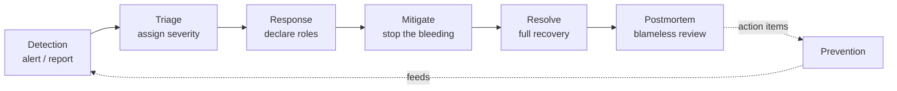

# Incident management

## Why this matters

It's a Tuesday afternoon. Checkout latency starts climbing. The on-call engineer gets paged at 14:42, opens the dashboard, sees p99 at 8 seconds, and starts poking at the payments service. Meanwhile a second engineer who also got the page is restarting pods. A third has DM'd the database team. Support is fielding angry tweets but doesn't know there's an incident. The VP of Engineering is asking in a side thread "are we down?" and nobody answers because everyone is heads-down in a terminal. Forty minutes later someone finally notices the actual cause — a config push that doubled the connection pool timeout — but by then three people have made three uncoordinated changes and nobody is sure which one helped or hurt.

That incident took an hour and a half. The technical fix took seconds. Nearly all the rest was a coordination failure: no single owner, no shared timeline, no communication to the people who needed it, and three engineers stepping on each other. The system being broken was never the expensive part. The *response* being broken was.

Incident management is the discipline that compresses that gap. It is not bureaucracy and it is not a Jira workflow. It is a small set of roles, severities, and rituals — borrowed largely from emergency services and codified for software by Google's SRE practice and PagerDuty's open response docs — that turn a panicked scramble into a coordinated operation. The engineers who treat incidents as "everyone jumps on Slack and improvises" pay for it in mean-time-to-recovery every single time. The teams that have a structure they trust recover faster, communicate calmly, and — this is the part most teams miss — actually learn something afterward that prevents the next one.

## Mental model

An incident has a lifecycle, and at each stage a different thing is the bottleneck. Early on, the bottleneck is *detection and triage* — do we even know, and how bad is it? In the middle, it's *coordination* — who decides, who acts, who tells everyone else. At the end, it's *learning* — did anything actually change so this can't recur? Naming the current bottleneck out loud is itself a useful move: a team stuck arguing about severity is not yet in the coordination phase, and a team still debugging root cause has not finished mitigating. The phases are not rigid gates, but knowing which one you're in tells you what to optimize for right now.



The single most important idea is the split between **mitigation** and **resolution**. Mitigation stops customer pain — roll back, fail over, shed load, flip a feature flag. Resolution is the full root-cause fix. These are different goals with different urgencies, and conflating them is why incidents drag on. During an active incident your job is to mitigate. Understanding *why* can wait for the postmortem; restoring service cannot. The instinct of a good engineer — to understand the system deeply before touching it — is exactly the wrong instinct mid-incident. A rollback you don't fully understand but that demonstrably restores service is worth more than a perfect diagnosis delivered twenty minutes later. You buy back the time to understand by stopping the bleeding first.

The second idea is **separation of roles**. Even a two-person incident benefits from naming who is the **Incident Commander (IC)** — the person who coordinates, decides, and owns the incident but does *not* type fixes — versus who is the operating engineer doing the hands-on work. The IC's job is explicitly to stay out of the terminal so that someone is holding the whole picture: tracking what's been tried, what's pending, who needs an update, and whether it's time to escalate. On larger incidents you add a **Communications Lead** (updates the status page and stakeholders) and a **Scribe** (maintains the timeline). The roles matter more than the headcount; one person can wear two hats on a small incident, but the *functions* must all be covered. The failure mode is the opposite — five people in the channel and no one who believes they are in charge, so decisions get made by whoever shouts loudest or, worse, not at all.

Severity is the third primitive. It exists to answer one question fast: how many people do we wake up, and how loudly? Severity is a routing decision, not a measure of how stressful the incident feels. It maps the blast radius of customer impact onto a response intensity, and it is the single field that the most people downstream — on-call rotations, comms, execs, support — key their behavior off of. A common four-level scheme:

| Sev | Meaning | Example | Response |
|---|---|---|---|
| **SEV1** | Critical, broad customer impact | Checkout down, data loss, security breach | Page IC + on-call now, all-hands, exec comms |
| **SEV2** | Major degradation, partial impact | Elevated error rate, one region down | Page on-call, declare incident, status page |
| **SEV3** | Minor / contained | Single non-critical feature degraded | Normal-hours response, ticket |
| **SEV4** | Negligible / cosmetic | Stale dashboard, internal-only glitch | Backlog |

Pick the scheme once, write it down, and apply it consistently. The exact number of levels matters far less than everyone using the same one. Severity is also not frozen for the life of the incident: a SEV2 that turns out to be losing data gets upgraded the moment that's known, and a SEV1 that's been mitigated gets downgraded so the all-hands energy winds down. The IC owns those transitions and announces them explicitly in the channel, because half the people watching are deciding whether to stay engaged based on that single number.

## In practice

### Detection: alert on symptoms, not causes

Detection comes from two sources: your monitoring fired, or a human reported it. You want the first to beat the second as often as possible — the gap between them is your mean-time-to-detect, and a customer or a support agent finding the problem before your alerts do is a signal your alerting has a hole. The trap is alerting on *causes* (CPU is high) instead of *symptoms* (users are getting errors). High CPU might be a problem or might be a perfectly healthy busy service; an elevated error rate on a checkout endpoint is unambiguously bad. A good alert maps to customer pain and to an SLO. Here's a Prometheus alert that pages on a burning error budget rather than on raw resource noise:

```yaml
# prometheus/alerts.yml
groups:
  - name: checkout-slo
    rules:
      - alert: CheckoutHighErrorRate
        # 5xx rate over 2% across a 5m window = symptom of customer pain
        expr: |
          sum(rate(http_requests_total{job="checkout",code=~"5.."}[5m]))
            / sum(rate(http_requests_total{job="checkout"}[5m]))
          > 0.02
        for: 5m
        labels:
          severity: page
        annotations:
          summary: "Checkout 5xx rate above 2% for 5m"
          runbook: "https://runbooks.internal/checkout-high-error-rate"
          dashboard: "https://grafana.internal/d/checkout"
```

Two details earn their keep. The `for: 5m` clause suppresses transient blips so you don't page on a single bad scrape. And every paging alert carries a `runbook` link — an alert that wakes a human at 03:00 with no next step is half an alert. The discipline that keeps this from rotting is a simple rule: every alert that pages a human must be actionable, and every alert that fires repeatedly without anyone acting on it is either retuned or deleted. Alert fatigue is not a personality flaw in your on-call; it is the predictable result of pages that don't mean anything. (SLOs and error budgets are the subject of the previous chapter; alerts are where they become operational.)

### Declaring and running the incident

Declaring is a deliberate act, not a vibe. The moment someone says "I'm declaring a SEV2," ambiguity collapses: an incident channel is created, an IC is named, and the clock starts. Most teams wire this to a single ChatOps command so there's zero friction. A minimal Slack slash-command handler in TypeScript:

```typescript
// POST /slack/commands/incident  ->  "/incident sev2 checkout latency spike"
app.post("/slack/commands/incident", async (req, res) => {
  const [sev, ...rest] = req.body.text.trim().split(" ");
  const title = rest.join(" ");
  const id = `INC-${Date.now().toString(36).toUpperCase()}`;

  // 1. dedicated channel keeps the incident conversation in one place
  const channel = await slack.conversations.create({
    name: `inc-${id.toLowerCase()}`,
  });

  // 2. pin the structure so anyone joining sees roles + timeline immediately
  await slack.chat.postMessage({
    channel: channel.channel.id,
    text:
      `:rotating_light: *${id}* (${sev.toUpperCase()}): ${title}\n` +
      `*IC:* _unassigned — claim with :raising_hand:_\n` +
      `*Comms:* _unassigned_   *Scribe:* _unassigned_\n` +
      `Status page: not yet posted. Runbook: search the alert.`,
  });

  // 3. SEV1/SEV2 page the on-call IC rotation
  if (sev.toLowerCase() === "sev1" || sev.toLowerCase() === "sev2") {
    await pagerduty.incidents.create({
      title: `${id}: ${title}`,
      service: "incident-command",
      urgency: "high",
    });
  }

  res.json({ response_type: "in_channel", text: `Declared ${id} in <#${channel.channel.id}>` });
});
```

The point isn't this exact code; it's that declaring should be one command that creates a channel, posts the role scaffold, and pages the right people. Make it cheaper to declare than to debate whether to declare. Over-declaring costs a few minutes; under-declaring costs the whole incident. A useful cultural norm is that anyone can declare — you do not need to be senior, and you will never be punished for declaring something that turns out to be minor. The cost of a false alarm is a channel that gets archived in ten minutes; the cost of hesitating because you weren't sure it "counted" is the forty-minute delay from the opening scenario.

### The IC keeps a running timeline

The scribe (or the IC, on a small incident) maintains a single chronological log in the channel. This is not paperwork — it's the working memory of the incident and the raw material for the postmortem. Under stress, human memory is unreliable and the order of events is the first thing to blur; a written timeline is what lets you later say with confidence that errors started one minute *after* a deploy rather than before it. Timestamps must be UTC and unambiguous:

```text
14:42 UTC  PAGE: CheckoutHighErrorRate fired, 5xx at 6%
14:44 UTC  IC: @jordan. Comms: @sam. Declared SEV2.
14:46 UTC  OBS: errors started 14:31, ~1m after config deploy #4821 (conn pool timeout 5s -> 0.5s)
14:48 UTC  HYPOTHESIS: pool exhaustion from shortened timeout. Confidence: high.
14:50 UTC  ACTION: @lee rolling back deploy #4821. NO other changes until this lands.
14:54 UTC  OBS: 5xx dropping — 6% -> 1.1%
14:57 UTC  5xx at 0.2%, baseline. MITIGATED. Monitoring before resolve.
15:12 UTC  RESOLVED. Status page updated. Postmortem owner: @jordan, due 48h.
```

Notice line 14:50: "NO other changes until this lands." That is the IC doing their actual job — serializing changes so the team can attribute cause and effect. Two simultaneous fixes mean you learn nothing from either, and worse, if the combination makes things worse you can't tell which one to back out. The IC enforces a one-change-at-a-time rhythm: propose, agree, apply, observe, then decide the next move. It feels slow in the moment and it is almost always faster end to end.

### Communications: internal and external are different jobs

Stakeholders don't need your debugging stream; they need a heartbeat. The Comms Lead posts updates on a predictable cadence (every 30 minutes for a SEV2, every 15 for a SEV1) even when the update is "still investigating, no ETA." Silence reads as chaos — when leadership and support hear nothing, they assume the worst and start their own side investigations, which pulls responders out of the channel to answer "what's going on?" A status-page update has a fixed shape: what's affected, what we're doing, when we'll update next.

```text
[Investigating] Some users may experience errors during checkout.
We identified a likely cause and are rolling back a recent change.
Next update by 15:15 UTC.
```

Internal and external comms are genuinely different jobs with different audiences. Internal updates can be candid and technical; external (status page, customer-facing) updates are deliberately conservative, avoid speculation about cause, and never promise a fix time you can't guarantee. The Comms Lead exists precisely so the IC and operators aren't context-switching between debugging and writing customer prose under pressure — two modes that are hard to hold in one head at once.

> **Security note:** For security incidents, communications follow a separate, more restrictive path. Do not disclose details (attack vector, affected data) in public or wide-internal channels until legal and security sign off — premature disclosure can aid an attacker or trigger regulatory obligations you haven't scoped yet. Keep the incident channel access-controlled, and never paste credentials, tokens, or customer PII into it. Audit-log who joined and what was shared.

### The runbook

A runbook is the procedure that turns the worst on-call engineer on your team into an adequate one at 03:00. It is tied to a specific alert and is ruthlessly concrete: how to confirm the problem, how to mitigate, how to escalate. No theory.

```markdown
# Runbook: CheckoutHighErrorRate

## Confirm (2 min)
- Grafana: https://grafana.internal/d/checkout — is 5xx > 2% sustained?
- If 5xx is only on /pay and DB latency is normal -> likely app-side. Continue.

## Mitigate (fastest first)
1. Check recent deploys: `kubectl rollout history deploy/checkout`
   - If a deploy landed in the last 15 min -> `kubectl rollout undo deploy/checkout`
2. If no recent deploy, check the payments-provider status page (often upstream).
3. If upstream is down -> flip flag `checkout.fallback_provider=true` in LaunchDarkly.

## Escalate
- DB-related symptoms (connection errors, lock waits) -> page @platform-db.
- No mitigation working after 20 min -> escalate to SEV1, page eng-director.

## Do NOT
- Do not scale up pods to "fix" errors — masks the cause and exhausts the DB.
```

Runbooks rot. The discipline is to update the runbook *as part of* the postmortem for any incident where it was wrong or missing. A runbook that sent the on-call down the wrong path is itself a contributing factor worth an action item. Ordering the mitigation steps fastest-first is deliberate: the person reading this is stressed and the goal is to get them to the highest-leverage action with the least reading.

### Blameless postmortems that change behavior

Within 48 hours of resolution (while memory is fresh), the IC writes a postmortem. "Blameless" is the load-bearing word: the document describes what happened and what the system allowed, never who to blame. The reason is mechanical, not moral — if naming a person in the document gets them punished, people hide information, and you stop learning. John Allspaw's framing is that the goal is to understand *how it made sense to the engineer to do what they did at the time*, given the information they had. The engineer who shipped the bad config was, in the moment, doing reasonable work with the tools and reviews available; if the system let a one-character change take down checkout, the system is what needs fixing, not the person.

A postmortem that works has these sections, and crucially ends in **action items with owners and due dates** tracked like any other work:

```markdown
# Postmortem: INC-LX9F2 — Checkout 5xx spike (SEV2)

## Summary
Config deploy #4821 cut the DB connection-pool timeout from 5s to 0.5s,
causing pool exhaustion under normal load. ~31 min of elevated errors
(peak 6% of checkout requests). Mitigated by rollback.

## Impact
- 14:31–15:02 UTC, ~31 min. Est. failed checkouts.
- No data loss. No security impact.

## Timeline
(UTC; pulled from incident channel — see above)

## Contributing factors (no single root cause)
- The timeout change had no review check flagging connection-pool params.
- Load tests run with a warm pool and never caught the exhaustion path.
- The alert fired correctly, but detection lagged because the dashboard
  defaults to a 1h window that smoothed the spike.

## What went well
- Rollback was clean and fast once the deploy was identified.
- Single-IC structure kept changes serialized.

## Action items
- [ ] Add a CI check rejecting pool-timeout < 2s (owner: @lee, due 2026-06-22)
- [ ] Default checkout dashboard to 15m window (owner: @sam, due 2026-06-19)
- [ ] Add a load-test scenario with a cold pool (owner: @jordan, due 2026-06-29)
```

A postmortem with no tracked action items is theater. The framing "contributing factors, no single root cause" is intentional — real incidents are rarely one mistake; they're a chain where each link individually looked fine. The test of whether your incident process works is not how good the documents look — it's whether SEV2s caused by the same class of bug stop showing up.

> **Connect the dots:** Incident management sits directly on top of the observability you built in the rest of this Part — detection comes from your metrics and alerts (Chapters 1–3), and your traces (Chapter 2) are what let an IC pinpoint the failing span in minutes instead of hours. It also closes the loop with deployment practice: the fastest mitigation is almost always a rollback, which is only as good as your release pipeline (Part 7). Chaos engineering (Chapter 6) is how you rehearse this whole machine before a real Tuesday afternoon forces you to.

## Pitfalls and anti-patterns

**The hero IC who also types the fix.** The most experienced person grabs the keyboard *and* tries to coordinate, and both jobs suffer — nobody is holding the big picture while they're deep in a stack trace. Recognize it when the channel goes quiet for ten minutes and stakeholders are asking "any update?" Fix it by enforcing the rule that the IC's hands stay off the keyboard; if the best debugger must be hands-on, they hand the IC role to someone else explicitly.

**Debugging root cause during the fire.** The team spends thirty minutes understanding *why* the database is slow while customers are getting errors that a failover would have stopped in two minutes. Recognize it when the conversation is full of "but why" and empty of "let's roll back." Fix it by making mitigation the explicit goal during an active incident and deferring all root-cause analysis to the postmortem. Stop the bleeding first.

**Severity inflation (or deflation).** Everything becomes a SEV1, so SEV1 stops meaning anything and people tune out the pages — or teams under-declare to avoid the paperwork and exec attention, so real incidents get a slow, casual response. Recognize it by tracking how many SEV1s you declare per month; if it's most pages, your scale is broken. Fix it with written, example-anchored severity definitions and a no-penalty policy for declaring (and later downgrading).

**The blameful "postmortem."** The review turns into "who pushed the bad config," the named engineer gets a talking-to, and the next time something breaks that person quietly fixes it without telling anyone. Recognize it when postmortems use names as subjects of fault and when people are visibly defensive. Fix it by writing in terms of what the *system* allowed, banning blame language in the document, and having a senior person model owning their own mistakes publicly.

**Action items that evaporate.** The postmortem lists ten great improvements, the document gets filed, and nothing is done — so the same incident recurs in six weeks. Recognize it by checking whether last quarter's action items shipped. Fix it by tracking action items in your normal backlog with owners and due dates, capping the count to what will actually get done (three real ones beat ten aspirational ones), and reviewing overdue items in a recurring reliability sync.

## Production checklist

- [ ] A written severity scheme (SEV1–SEV4) with concrete examples, visible to everyone, not just SREs
- [ ] One-command incident declaration that creates a channel, posts role scaffolding, and pages the IC rotation
- [ ] Named, on-call **Incident Commander** rotation distinct from the service on-call rotation
- [ ] Every paging alert links to a runbook and a dashboard; alerts fire on symptoms/SLOs, not raw resource metrics
- [ ] A status page (or equivalent) with a documented update cadence per severity
- [ ] A timeline kept in UTC during every incident, with changes serialized by the IC
- [ ] Mitigation paths documented and rehearsed: rollback, failover, feature-flag kill switches, load shedding
- [ ] Blameless postmortem required for every SEV1/SEV2, owner assigned, due within 48 hours
- [ ] Action items tracked in the normal backlog with owners and due dates; overdue items reviewed regularly
- [ ] Incident channels access-controlled; no PII, secrets, or credentials posted; access audit-logged
- [ ] A periodic game day or chaos exercise that runs the full process on a fake incident

## Exercises

1. **(Comprehension)** Explain, in your own words, the difference between *mitigation* and *resolution*, and why an Incident Commander should generally prioritize mitigation during an active incident. Give one concrete example of a mitigation that does not address root cause.

2. **(Applied)** Take a real alert from your system (or write one for a service you know). Author the runbook for it following the structure above: a Confirm section, a Mitigate section ordered fastest-first, an Escalate section, and an explicit "Do NOT" list. Then have a teammate who didn't write it try to follow it cold and note every place they got stuck. Revise.

3. **(Design)** Design the incident-response process for a 30-person engineering org that currently has none. Specify the severity scheme, how incidents get declared, who fills which roles (given they have no dedicated SRE team), the communication cadence, and the postmortem policy. Identify the two practices you'd introduce *first* and defend why those two, given that you can't roll out everything at once.

## Further reading

- Google, *Site Reliability Engineering*, "Managing Incidents" and "Postmortem Culture" chapters — free at https://sre.google/sre-book/managing-incidents/
- PagerDuty, [Incident Response documentation](https://response.pagerduty.com/) — an open, practical, role-by-role playbook
- John Allspaw, ["Blameless PostMortems and a Just Culture"](https://www.etsy.com/codeascraft/blameless-postmortems/) — the foundational argument for blamelessness
- Atlassian, [Incident Management Handbook](https://www.atlassian.com/incident-management) — severity levels, comms, and runbook templates
- USENIX, [the SNAFUcatchers "STELLA Report"](https://snafucatchers.github.io/) — research on how real engineers cope with anomalies in production systems
