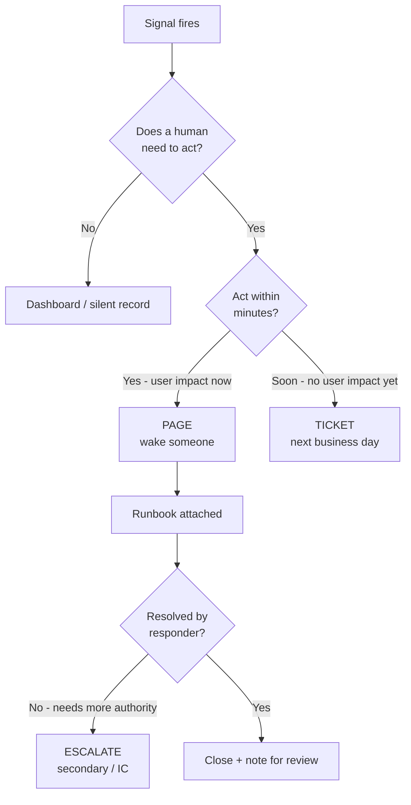

# On-call practice

## Why this matters

It's 3:14 a.m. on a Tuesday and your phone is screaming. The page says `DiskUsageHigh: node-7 at 81%`. You're awake now, heart going, laptop open. Eighty-one percent. You watch the graph for ten minutes. It's flat. It's been flat for a week. A nightly batch job writes some temp files and a cron sweeps them at 4 a.m. There was never anything to do. You set the laptop down, lie back, and stare at the ceiling because your body decided three minutes ago that it was morning.

The next night the same page fires. You silence it without looking. The night after that, a different page fires — `error_rate elevated on checkout` — and you silence that one too, because by now your reflex for "phone buzzing at night" is *make it stop*, not *go look*. Except this one was real. Checkout was returning 500s for fourteen percent of users for forty minutes before someone noticed in the morning. The signal was there. It arrived in a channel you had trained yourself to ignore.

That is the cost of bad on-call practice, and it is not mainly a tooling problem. Every alert that wakes someone for nothing spends down a finite resource: the team's willingness to trust the pager. Spend it all and your real incidents arrive as background noise. This chapter is about defending that trust — making sure every page is worth waking up for, that the person who gets it knows what to do, and that the rotation doesn't quietly burn people out. The SRE discipline calls the bad version *alert fatigue* and *toil*, and it has names and patterns for keeping both in check.

## Mental model

An alert is a hypothesis that a human needs to act, right now. That framing decides everything. If no human action is required, it is not an alert — it is a dashboard panel, a ticket, or a log line. The single most useful question to ask of any page is: *what is the human supposed to do when this fires, and can they do it now?* If the honest answer is "watch it" or "nothing, it'll clear," it should not be paging anyone.

Google's SRE practice draws the line at *symptoms versus causes*. Page on symptoms the user feels — requests failing, latency past the SLO, the queue not draining — not on causes that may or may not matter, like a single node's CPU. A high CPU number is a cause; it only deserves a page if it is *about to* turn into a symptom users feel. Most cause-based alerts are the 3 a.m. disk-usage page: technically true, operationally useless.

The second axis is *urgency*. Not everything that needs a human needs them *now*. That gives you three tiers, and keeping them distinct is the whole game:



Everything in the PAGE box must clear a high bar: it is urgent, it reflects real or imminent user impact, and it is actionable. Everything else flows to a ticket queue or a dashboard. The escalation path exists because the first responder is not always the right or available person, and a page that goes unacknowledged must reach someone else automatically rather than dying in a silenced phone.

The last piece of the model is *toil*: the SRE term for manual, repetitive, automatable work that scales with the size of the service and produces no lasting value. Acknowledging the same flapping alert every night is toil. Restarting the same stuck worker by hand is toil. Toil is worth measuring because it is the thing that, left alone, consumes the time you would otherwise spend making the toil unnecessary. The distinction that matters in practice: work that produces an enduring improvement (writing the automation, fixing the root cause) is not toil; work that you will do again next week in exactly the same way is.

## In practice

### A noisy alert, then a good one

Here is the 3 a.m. page from the opening, as it likely exists in someone's Prometheus rules. It is a textbook bad alert.

```yaml
# BAD: causes, not symptoms; no context; pages on a static threshold
groups:
  - name: node-bad
    rules:
      - alert: DiskUsageHigh
        expr: node_filesystem_avail_bytes / node_filesystem_size_bytes < 0.20
        for: 0m
        labels:
          severity: page
        annotations:
          summary: "Disk usage high on {{ $labels.instance }}"
```

Everything about this fires for the wrong reasons. It alerts on a cause (disk fullness) with no link to user impact. The threshold is static, so a node that lives happily at 81% pages every single evaluation. `for: 0m` means a momentary blip pages instantly. There is no runbook, no indication of whether this is urgent, and `severity: page` wakes a human for a condition that, here, resolves itself at 4 a.m.

Now the same underlying concern, rewritten as something worth waking up for. The thing we actually care about is: *is this disk going to fill before someone can react?* That is a prediction, not a level.

```yaml
# GOOD: predicts imminent symptom; sustained; routed by urgency; carries a runbook
groups:
  - name: node-good
    rules:
      # Page only if the disk will fill within ~4 hours at the current rate.
      - alert: DiskWillFillSoon
        expr: |
          predict_linear(node_filesystem_avail_bytes{fstype!~"tmpfs|overlay"}[1h], 4*3600) < 0
          and node_filesystem_avail_bytes{fstype!~"tmpfs|overlay"} / node_filesystem_size_bytes < 0.15
        for: 15m
        labels:
          severity: page
          team: platform
        annotations:
          summary: "Disk on {{ $labels.instance }} ({{ $labels.mountpoint }}) projected to fill within 4h"
          description: "Avail at {{ $value | humanize }}B and trending down; predicted exhaustion < 4h."
          runbook_url: "https://runbooks.internal/disk-will-fill-soon"
          dashboard_url: "https://grafana.internal/d/node/node?var-instance={{ $labels.instance }}"

      # Slow growth that is NOT urgent: open a ticket, don't page.
      - alert: DiskUsageGrowingSlowly
        expr: predict_linear(node_filesystem_avail_bytes[6h], 72*3600) < 0
        for: 1h
        labels:
          severity: ticket
          team: platform
        annotations:
          summary: "Disk on {{ $labels.instance }} trending to fill within 3 days"
          runbook_url: "https://runbooks.internal/disk-capacity-planning"
```

`predict_linear` extrapolates the trend over the next four hours; the page fires only if the disk is *both* projected to run out soon *and* already genuinely low. `for: 15m` means a momentary dip won't wake anyone. The flapping nightly job no longer pages, because its temp files clear long before the four-hour projection turns negative. The slow-leak case routes to a ticket instead. And critically, every page carries a `runbook_url` and a `dashboard_url`, so the half-asleep responder lands on instructions instead of a blank terminal.

The far better symptom-based version pages on the SLO itself — error rate, latency, saturation that users feel — and lets disk usage be a *clue you find in the runbook*, not the thing that woke you. (See the SLOs chapter in this Part for burn-rate alerting, which is the strongest pattern for "page on user impact.")

### Routing by urgency, not by source

Alertmanager is where the three tiers become real. Pages go to the pager; tickets go to a queue; nothing else interrupts a human.

```yaml
# alertmanager.yml
route:
  receiver: default-ticket
  group_by: ['alertname', 'team']
  group_wait: 30s
  group_interval: 5m
  repeat_interval: 4h
  routes:
    - matchers: [severity="page"]
      receiver: pagerduty-platform
      group_wait: 0s            # urgent: don't batch
      repeat_interval: 30m
    - matchers: [severity="ticket"]
      receiver: jira-queue

receivers:
  - name: pagerduty-platform
    pagerduty_configs:
      - service_key: "<key>"
        severity: critical
  - name: jira-queue
    webhook_configs:
      - url: "https://automation.internal/file-ticket"
  - name: default-ticket
    webhook_configs:
      - url: "https://automation.internal/file-ticket"
```

The default route is the *ticket queue*, not the pager. That inversion is deliberate: a new alert someone forgot to classify should file a ticket, never wake a person. You opt *into* paging with an explicit `severity="page"`, and the bar for adding that label is the symptom-and-urgency test above. Note the asymmetry in batching, too: pages set `group_wait: 0s` because seconds matter when users are affected, while tickets inherit the slower default grouping because nobody is waiting on them in real time.

### Runbooks that actually help

A runbook is not documentation of how the system works. It is a checklist for a stressed, possibly half-asleep human, optimized for the case where they did not write the code. The good ones share a shape:

```markdown
# Runbook: DiskWillFillSoon

## What this means
A disk is projected to exhaust within ~4 hours at the current write rate.
User impact if it fills: writes fail, the service returns 5xx.

## First 60 seconds (triage)
1. Open the dashboard linked in the alert. Confirm the trend is still rising.
2. Identify the biggest consumer:
   `ssh $INSTANCE 'sudo du -x -d1 /var | sort -rn | head'`
3. Is this a known offender? (log dir, core dumps, runaway temp files)

## Mitigations (in order of safety)
- Rotate/compress logs:  `sudo logrotate -f /etc/logrotate.conf`
- Clear reclaimable caches:  `sudo journalctl --vacuum-size=200M`
- If app temp files: `systemctl restart <worker>` (drains gracefully, see note)
- LAST RESORT: expand the volume (link to IaC change + approval step)

## If you can't resolve in 20 minutes
Escalate to secondary (PagerDuty "escalate" button). This is expected,
not a failure. Capacity changes need a second pair of eyes.

## Don't
- Don't `rm -rf` anything under /var/lib — that's state, not garbage.
- Don't expand the volume without filing the capacity-planning ticket.
```

Notice what it is *not*: an architecture diagram, a history of the service, a tour of the codebase. It tells the responder what the alert means in terms of user impact, what to check in the first minute, what to try in order of increasing risk, when to escalate, and which buttons are dangerous. The single best test of a runbook is whether someone who has never touched the service can follow it at 3 a.m. without paging the author. Order the mitigations by blast radius, cheapest-and-safest first, so the tired responder tries the reversible thing before the destructive one — and put the irreversible actions behind an explicit "last resort" label so they are never the reflex.

> **Connect the dots:** Runbook mitigations are only safe if the actions are reversible and observable. The "restart drains gracefully" note depends on the graceful-shutdown behavior covered in Part 8, and "expand the volume needs approval" depends on the infrastructure-as-code review gates from your version-control workflow (Part 3). A runbook step that bypasses code review to fix a 3 a.m. incident is how the *next* incident gets created.

### Measuring rotation health and toil

You cannot manage on-call load by feel. Track a few numbers per rotation and review them every cycle. The two that matter most are *pages per shift* (especially off-hours) and *interrupt rate during business hours*. A widely cited SRE guideline is that on-call engineers should spend no more than about half their time on operational and toil work, and a shift should generate few enough pages that the responder can give each one real attention. If a single night shift routinely fires several pages, the rotation is unhealthy and the fix is to reduce alerts, not to ask people to tough it out. (Treat specific thresholds as guidance to tune for your team rather than universal law. any concrete page-per-shift target against your own incident data and Google's *Site Reliability Engineering*, "Being On-Call.")

A simple way to surface the worst offenders is to query your alert history. If alerts flow through Prometheus, the firing series are themselves metrics:

```promql
# Top 10 noisiest paging alerts over the last 30 days
topk(10,
  sum by (alertname) (
    count_over_time(ALERTS{alertstate="firing", severity="page"}[30d])
  )
)
```

```promql
# Off-hours pages (rough proxy: fired outside 09:00-18:00 UTC), last 30d
sum by (alertname) (
  count_over_time(ALERTS{alertstate="firing", severity="page"}[30d])
  and on() (hour() < 9 or hour() >= 18)
)
```

Run these at every retro. The alert at the top of the first query is the one stealing the most attention; the one at the top of the second is the one stealing the most *sleep*. Each should get a decision: tune the threshold, downgrade to a ticket, automate the response, or delete it. An alert that fires often and is acted on *the same way every time* is not an alert — it is an automation you have not written yet. That is toil, and the responder's job during a quiet shift is to convert it.

A lightweight rule worth adopting: every page that fires gets tagged in the postmortem or weekly review as **actioned**, **self-resolved**, or **false**. Anything that is consistently "self-resolved" or "false" gets fixed or deleted within one cycle. This keeps the alert set from accreting cruft, which is the natural entropy of every monitoring system. Pair the tagging with a single owner per review cycle who is accountable for closing out the top offenders; a query nobody acts on is just another dashboard.

## Pitfalls and anti-patterns

**The Cried-Wolf Pager.** The rotation has trained itself to silence pages without looking because most pages are noise. Recognize it when acknowledgements come in under a few seconds, or when people describe the pager as "just background noise." The fix is ruthless: pull the noisiest-alert query, and for every alert that is mostly self-resolved or false, either fix the root cause, downgrade it to a ticket, or delete it. Deleting a useless alert is a feature, not a loss. Trust in the pager is the asset you are protecting, and it only refills slowly.

**Cause Alerts Instead of Symptom Alerts.** You page on CPU, memory, disk, queue depth, and pod restarts — internal causes — rather than on the SLO the user actually experiences. Recognize it when incidents are detected by customers before your alerts fire, or when half your pages have no user impact. The fix is to page primarily on symptoms (error rate, latency, throughput against the SLO) and demote cause metrics to dashboards and runbook clues. A cause alert earns a page only when it reliably predicts an imminent symptom, like the `predict_linear` disk rule above.

**Runbook Rot.** The runbook links to a dashboard that was renamed, a command that no longer works, or a service that was decommissioned. Recognize it when responders routinely ignore the runbook and improvise, or when the runbook's last edit predates the last three architecture changes. The fix is to treat runbooks as code: store them in the repo next to the service, link them from the alert, and add "is the runbook still accurate?" as a required line item in every postmortem that touched that alert.

**Escalation That Goes Nowhere.** A page is acknowledged to stop it buzzing, then nothing happens — no resolution, no handoff — because acknowledging and resolving got conflated. Recognize it when the time-to-acknowledge is healthy but time-to-resolve is terrible, or when secondaries say they're never called. The fix is to configure auto-escalation on *unresolved* (not just unacknowledged) pages, make escalating an explicitly blameless and expected action in the runbook, and review every page that escalated to learn why the first responder couldn't close it.

**Hero Toil.** One engineer quietly absorbs the operational load — manually restarting the stuck worker, hand-clearing the queue every morning — and the team mistakes their heroics for system health. Recognize it when on-call is "fine" only because a specific person is on it, or when the same manual fix appears in chat every day. The fix is to *count* the toil (the PromQL above is a start), put the most repeated manual fix on the next sprint as an automation, and rotate on-call so the pain is visible to everyone, not absorbed by one person.

## Production checklist

- [ ] Every paging alert answers "what should the human do right now?" with a concrete action, not "watch it"
- [ ] Pages fire on user-facing symptoms (SLO error rate, latency); cause metrics are dashboards or tickets
- [ ] Every paging alert has a `for:` duration so momentary blips don't wake anyone
- [ ] Every paging alert carries a `runbook_url` and a `dashboard_url` annotation
- [ ] Alertmanager default route is the ticket queue; paging is opt-in via an explicit `severity="page"`
- [ ] Three severity tiers exist and are routed distinctly: page, ticket, dashboard-only
- [ ] Escalation auto-fires on *unresolved* pages, not just unacknowledged ones; secondary and IC paths are tested
- [ ] Runbooks live in version control next to the service and are checked for accuracy in every relevant postmortem
- [ ] Noisiest-alert and off-hours-page queries are reviewed every on-call cycle; each top offender gets a decision and an owner
- [ ] On-call load is tracked (pages/shift, off-hours pages, interrupt rate) and the rotation aims to keep toil under roughly half of an engineer's time
- [ ] On-call compensation and follow-the-sun / handoff policy are written down, not assumed
- [ ] Postmortems are blameless and feed alert/runbook changes back into the repo

> **Security note:** Runbooks and dashboards routinely contain hostnames, internal URLs, sometimes credentials or `kubectl` contexts. Treat them as sensitive: store them behind SSO, never paste secrets into the runbook body (link to your secrets manager instead), and audit who can read and edit them. A paging system is also an attack surface — a flood of forged alerts is a denial-of-service against your humans. Authenticate alert sources and rate-limit the path from "metric fired" to "phone rings."

## Exercises

1. **(Comprehension)** Take the `DiskUsageHigh` bad rule and the `DiskWillFillSoon` good rule from this chapter. Write down, line by line, every property that makes the second one safer to page on: symptom vs. cause, static threshold vs. prediction, `for:` duration, runbook presence, and routing. Explain in two sentences why the nightly batch job pages the bad rule but not the good one.

2. **(Applied)** Stand up a local Prometheus + Alertmanager (the official Docker images are enough). Load both severity tiers from the "good" rules, wire `severity="page"` to a webhook receiver that hits `https://webhook.site` (or a local listener) and `severity="ticket"` to a different one. Trigger each path with a synthetic metric and confirm the page batches at `group_wait: 0s` while the ticket batches on the default interval. Then write the `topk` PromQL to find your noisiest alert and run it against the firing history.

3. **(Open-ended design)** Your team of six runs a 24/7 weekly rotation. Pages-per-night has crept up, two people have asked off the rotation, and incidents are increasingly caught by customers first. Design a 90-day plan to fix it. Address: how you'd measure the starting state, the criteria for keeping vs. cutting each existing alert, how you'd migrate from cause-based to symptom/SLO-based paging, what you'd automate to cut toil, and how you'd change the rotation structure (length, size, follow-the-sun, comp) to make it sustainable. State the one metric you'd hold yourself accountable to and why.

## Further reading

- *Site Reliability Engineering*, Beyer et al. (Google) — especially "Being On-Call," "Monitoring Distributed Systems," and "Eliminating Toil." Free at https://sre.google/sre-book/table-of-contents/
- *The Site Reliability Workbook*, Beyer et al. (Google) — "Alerting on SLOs" gives the burn-rate alerting patterns that make symptom-based paging concrete. https://sre.google/workbook/table-of-contents/
- Rob Ewaschuk, "My Philosophy on Alerting" — the original memo behind the symptom-vs-cause and "page on user pain" doctrine. https://docs.google.com/document/d/199PqyG3UsyXlwieHaqbGiWVa8eMWi8zzAn0YfcApr8Q/edit
- Prometheus documentation, "Alerting rules" and "predict_linear" — the mechanics behind the rules in this chapter. https://prometheus.io/docs/prometheus/latest/configuration/alerting_rules/
- Alertmanager documentation, "Configuration" — routing trees, grouping, and inhibition. https://prometheus.io/docs/alerting/latest/configuration/
- John Allspaw, "Blameless PostMortems and a Just Culture" — why the review that feeds your alert changes must be blameless to work. https://www.etsy.com/codeascraft/blameless-postmortems/
