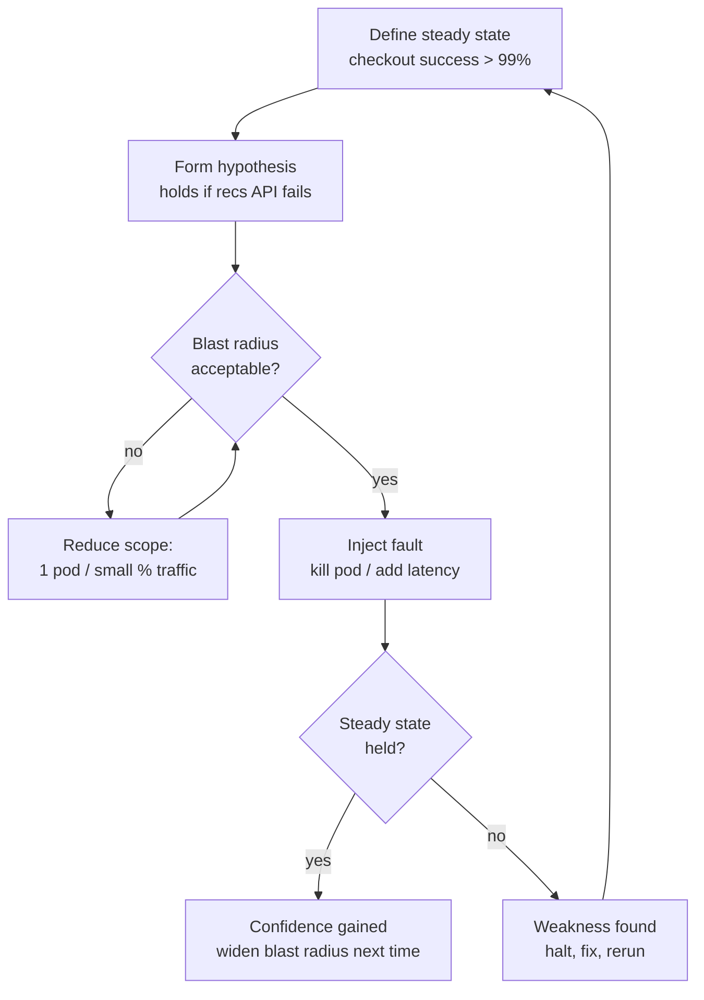

# Chaos engineering and load testing

## Why this matters

It's a Tuesday afternoon and your checkout service is healthy. P99 latency is 180ms, error rate is a rounding error, the dashboards are green. Then marketing runs a flash sale, traffic triples for forty minutes, and the service falls over. Not gracefully: the database connection pool exhausts, requests queue, health checks time out, Kubernetes kills the pods mid-request, the pods restart, the cold cache makes the first thousand requests slow, and the cascade repeats. You lost revenue during the one window that was supposed to make money. The postmortem concludes the system had a hard ceiling somewhere not far above normal load, and nobody knew, because nobody had ever pushed it there on purpose.

Here is the second half of the same Tuesday. A different service depends on a recommendations API. The recommendations API gets slow — not down, just slow, seconds instead of milliseconds. Your service has no timeout on that call, so its request threads block waiting, the thread pool drains, and now your service is down because of a dependency that was merely degraded. The recommendations team's pager never fired. Yours did. You discovered the coupling in production, at 2pm, with customers watching.

Both failures were knowable in advance. The first is a question of capacity: what is the breaking point, and how does the system behave as it approaches it? You answer that with load testing. The second is a question of resilience: when a dependency degrades, does the failure stay contained or does it spread? You answer that with chaos engineering. Both disciplines share one premise — you would rather find the limit yourself, on a Wednesday morning, with a runbook open and a rollback ready, than have your users find it for you. This chapter is about doing exactly that.

## Mental model

Load testing and chaos engineering answer different questions, but they share a method: form a hypothesis about how the system behaves under a specific condition, apply that condition in a controlled way, and compare the result to what you expected.

**Load testing** asks: how does the system perform as request volume rises? It comes in three flavors that people routinely confuse:

- **Load test** — sustained traffic at expected peak. Verifies the system meets its SLOs under realistic conditions.
- **Stress test** — push past expected peak until something breaks. Finds the ceiling and the *failure mode* (does it shed load gracefully or fall over?).
- **Soak test** — moderate load held for hours. Surfaces slow leaks: memory growth, file descriptor exhaustion, connection pools that never recover.

**Chaos engineering** asks a different question: when a specific failure is injected, does the system stay within its normal operating envelope? The discipline was formalized by the Netflix team and stated as a set of principles in *Principles of Chaos Engineering*. The core loop is four steps:

1. **Define steady state** — a measurable signal that says "the system is healthy." Not CPU usage. A business or user-facing metric: orders per minute, successful checkouts, p99 latency under target.
2. **Hypothesize** — "if the recommendations service returns errors, checkout success rate stays above 99%."
3. **Inject the fault within a bounded blast radius** — one pod, one availability zone, a small slice of traffic. Small enough that if the hypothesis is wrong, the damage is contained.
4. **Verify or disprove** — did steady state hold? If yes, you've earned confidence. If no, you've found a weakness *before* it found you.



The blast-radius gate is the part people skip and the part that matters most. A chaos experiment with no abort condition is not an experiment, it's an outage you scheduled. Every experiment needs a defined steady state to watch and an automatic stop if it breaks.

> **Connect the dots:** Steady state is exactly your SLI from the SLOs chapter (Part 9, Chapter 3). If you've already defined "successful checkout rate over a 5-minute window" as an SLI, you've already defined the steady-state metric your chaos experiments watch. The two disciplines are designed to share the same measurements.

## In practice

### A load test with k6

k6 is a load-testing tool from Grafana Labs where you write the test in JavaScript and the engine runs it in Go, so a single machine can drive a large number of virtual users. Here is a test that ramps load on a checkout endpoint and asserts on percentile latency.

```javascript
// checkout-load.js
import http from 'k6/http';
import { check, sleep } from 'k6';
import { Trend, Rate } from 'k6/metrics';

const checkoutLatency = new Trend('checkout_latency', true);
const checkoutErrors = new Rate('checkout_errors');

export const options = {
  // Ramp: warm up, hold at peak, then push past it (stress).
  stages: [
    { duration: '2m', target: 200 },   // ramp to 200 VUs
    { duration: '5m', target: 200 },   // hold (load test)
    { duration: '2m', target: 600 },   // ramp to 3x (stress test)
    { duration: '5m', target: 600 },   // hold at stress
    { duration: '2m', target: 0 },     // ramp down
  ],
  // Fail the test in CI if SLOs are violated.
  thresholds: {
    'http_req_duration{expected:true}': ['p(95)<400', 'p(99)<800'],
    checkout_errors: ['rate<0.01'],
  },
};

export default function () {
  const payload = JSON.stringify({ cartId: `cart-${__VU}-${__ITER}` });
  const params = {
    headers: { 'Content-Type': 'application/json' },
    tags: { expected: 'true' },
  };

  const res = http.post('https://staging.example.com/api/checkout', payload, params);

  checkoutLatency.add(res.timings.duration);
  checkoutErrors.add(res.status !== 200);

  check(res, {
    'status is 200': (r) => r.status === 200,
    'has order id': (r) => r.json('orderId') !== undefined,
  });

  sleep(1); // model think-time between user actions
}
```

Run it and k6 prints a percentile summary. Note that latency reporting is in percentiles, never averages — an average hides the slow tail, and the slow tail is what your users feel. The exact numbers below are illustrative of the *shape* of a result, not a benchmark of any real system.

```text
$ k6 run checkout-load.js

     ✓ status is 200
     ✓ has order id

     checkout_errors................: 0.42%  ✓ 16798  ✗ 71
     checkout_latency...............: avg=243ms min=39ms med=198ms p(90)=601ms p(95)=812ms p(99)=1.9s
     http_req_duration..............: avg=251ms ...    p(95)=812ms p(99)=1.91s
     iterations.....................: 16869  39.4/s
     vus............................: 600    min=0  max=600

   ✗ http_req_duration{expected:true}
       p(95)<400  ✗ p(95)=812ms
       p(99)<800  ✗ p(99)=1.9s

ERRO some thresholds have failed
```

This is a finding, not a failure of the test. At 200 VUs the system was fine; somewhere on the ramp to 600 the p95 blew past 400ms and p99 climbed into the seconds while errors crept up. You've located the knee of the curve between 200 and 600 concurrent users. The next step is to narrow it: re-run with intermediate stages (300, 400, 500) to find where latency degrades non-linearly, then check whether the bottleneck is CPU, the connection pool, or a downstream dependency. Because `thresholds` returns a non-zero exit code, this same test gates a deploy in CI — a regression that pushes p99 over budget fails the pipeline.

A soak test is the same script with a different `options` block: hold a moderate target for hours and watch for drift.

```javascript
export const options = {
  stages: [
    { duration: '5m', target: 150 },
    { duration: '4h', target: 150 },  // hold and watch memory / FDs / pool
    { duration: '5m', target: 0 },
  ],
};
```

If memory climbs steadily across those four hours while load is flat, you have a leak that a short load test would never reveal.

### A chaos experiment

Now the resilience question from the opening: when the recommendations dependency degrades, does checkout survive? We'll inject latency, not an outage — slow dependencies tend to cause more cascading failures than dead ones, because a dead dependency fails fast while a slow one ties up your resources.

The wrong way first. Here is "chaos engineering" as it often gets done:

```bash
# Anti-pattern: no hypothesis, no steady-state monitoring, no abort.
# SSH into a prod box on a Friday and just see what happens.
kubectl delete pod recommendations-7d9f --grace-period=0
```

That's not an experiment. There's no defined healthy signal, no blast-radius bound, no automatic stop, and it's Friday. The right way uses a tool that scopes the fault and watches a steady-state probe. Here is a Chaos Mesh experiment (Chaos Mesh is a CNCF chaos platform for Kubernetes) that injects 4 seconds of latency into 50% of traffic to the recommendations service, for one minute, scoped by label so the blast radius is explicit:

```yaml
# recs-latency-experiment.yaml
apiVersion: chaos-mesh.org/v1alpha1
kind: NetworkChaos
metadata:
  name: recs-latency
  namespace: shop
spec:
  action: delay
  mode: fixed-percent
  value: '50'                 # blast radius: half the recs traffic
  selector:
    namespaces: [shop]
    labelSelectors:
      app: recommendations
  delay:
    latency: '4s'
    jitter: '500ms'
  duration: '60s'             # auto-reverts after one minute
```

Before applying it, you write the hypothesis down where the team can see it, and you put the steady-state metric on a screen. The hypothesis is the falsifiable claim:

> **Hypothesis:** Injecting 4s latency into 50% of recommendations traffic for 60s keeps checkout success rate above 99% (the steady state), because checkout treats recommendations as a non-critical call with a 200ms timeout and an empty-list fallback.

Your steady-state probe is a PromQL query watched in real time. This is the abort condition — if it drops, you kill the experiment immediately:

```promql
# Checkout success rate over a 1-minute window.
sum(rate(http_requests_total{service="checkout", code="200"}[1m]))
/
sum(rate(http_requests_total{service="checkout"}[1m]))
```

Apply the experiment and watch:

```bash
$ kubectl apply -f recs-latency-experiment.yaml
networkchaos.chaos-mesh.org/recs-latency created
```

Two outcomes. If checkout success rate holds steady throughout — the hypothesis held. Checkout's timeout-and-fallback works; you've *proven* the coupling is safe and you can widen the blast radius next time (75%, then a full AZ). If instead success rate craters within seconds, you've reproduced the opening disaster in a controlled window: checkout has no timeout on recommendations, threads block, the pool drains. You abort (`kubectl delete networkchaos recs-latency`), and you have a precise, reproducible failure to hand to the fix:

```typescript
// The fix the experiment justifies: bounded timeout + fallback.
async function getRecommendations(cartId: string): Promise<Rec[]> {
  const controller = new AbortController();
  const timer = setTimeout(() => controller.abort(), 200); // 200ms budget
  try {
    const res = await fetch(`${RECS_URL}/recs?cart=${cartId}`, {
      signal: controller.signal,
    });
    return await res.json();
  } catch (err) {
    // Degraded, not down: checkout proceeds with no recommendations.
    log.warn({ err, cartId }, 'recs unavailable, using empty fallback');
    return [];
  } finally {
    clearTimeout(timer);
  }
}
```

Re-run the experiment after deploying the fix. Steady state holds. That re-run is the point: a chaos experiment isn't a one-time stunt, it's a regression test for resilience that you automate and run continuously, the same way the k6 thresholds gate latency regressions.

> **Security note:** Chaos and load tooling is dangerous by design — it can inject faults and generate enormous traffic. Scope its blast radius with RBAC: the chaos operator's service account should be limited to the namespaces and resources experiments are allowed to touch, never cluster-admin. Restrict who can run experiments against production, log every experiment with the operator's identity for the audit trail, and rate-limit load tests so a fat-fingered `target` can't become a self-inflicted DDoS on a shared environment.

## Pitfalls and anti-patterns

**Reporting averages instead of percentiles.** An average latency can hide a p99 of several seconds, and the p99 is the experience of your most valuable, most data-heavy users. How to recognize it: your dashboard shows a single "avg latency" number and it always looks fine while users complain. How to fix it: report p50, p95, and p99 everywhere, set SLO thresholds on the tail, and remember that with enough requests, the p99 is somebody's *every* request.

**Load testing from a single box on the same network.** Driving load from one machine in the same VPC as the target measures neither real client latency nor your CDN, load balancer, and TLS-termination layers, and the test box's own CPU becomes the bottleneck before the target's does. How to recognize it: throughput plateaus while the target's CPU sits idle, or results look great but production still falls over. How to fix it: run distributed load from multiple regions (k6 Cloud, or self-hosted k6 across several nodes), and include the full ingress path the way real traffic hits it.

**Chaos experiments with no abort condition.** Injecting a fault with no steady-state probe and no automatic stop is just scheduling an outage. How to recognize it: the experiment "runbook" is a single `kubectl delete pod` with no metric named and no rollback step. How to fix it: never run an experiment without (1) a defined steady-state metric on screen, (2) a bounded blast radius, and (3) an automatic time limit or kill switch. Chaos Mesh's `duration` field and a watched PromQL query give you both.

**Testing in an environment that doesn't match production.** A staging cluster with one replica, a tiny database, and no real data distribution will lie to you in both directions — it breaks under load production would shrug off, and it survives faults production would not. How to recognize it: staging has a fraction of the replicas and a toy seed database. How to fix it: load- and chaos-test against an environment whose topology, instance sizes, and data shape match production, or run carefully-scoped experiments in production itself with a tight blast radius (this is what the discipline is built for).

**Skipping the soak test.** Load tests that run for ten minutes pass while the system has a memory leak that takes hours to bite. How to recognize it: pods OOM-kill in production every few hours but every pre-deploy load test is green. How to fix it: run a multi-hour soak at moderate load before any major release and graph memory, file descriptors, goroutine/thread counts, and connection-pool size over the full window — look for any line that trends up and never comes back down.

## Production checklist

- [ ] Latency reported and alerted on as p50/p95/p99, never as averages
- [ ] Load-test script committed to the repo and run in CI with `thresholds` that gate the deploy on SLO regressions
- [ ] Stress test on file that documents the known breaking point (the "knee") and the failure mode at the ceiling
- [ ] Soak test (multi-hour) run before major releases, with memory / FD / connection-pool graphs reviewed for drift
- [ ] Every chaos experiment has a written, falsifiable hypothesis tied to a steady-state SLI
- [ ] Every chaos experiment has a bounded blast radius (pod / percent / AZ) and an automatic stop (duration limit or kill switch)
- [ ] Steady-state metric is on a dashboard and watched live for the duration of each experiment
- [ ] Timeouts and fallbacks exist on every cross-service call; verified by a latency-injection experiment
- [ ] Chaos tooling runs under least-privilege RBAC, scoped to allowed namespaces, with experiments logged for audit
- [ ] Resilience experiments automated and re-run on a schedule, not performed once and forgotten

## Exercises

1. **(Comprehension)** Given a k6 run reporting `avg=120ms, p(95)=900ms, p(99)=3.4s` over one million requests, explain why the average is misleading and estimate roughly how many requests in that run took longer than 3.4 seconds. State which percentile you'd put an SLO on and why.

2. **(Applied)** Take a service with at least one downstream dependency. Write a k6 script that ramps to 3x your expected peak and asserts `p(99)<800ms` and `error rate < 1%` as thresholds. Run it, find the load level where latency degrades non-linearly, and identify the bottleneck (CPU, connection pool, or downstream). Then write a one-paragraph chaos hypothesis for injecting latency into that downstream dependency, naming your steady-state metric and your abort condition.

3. **(Design)** Your company wants to run chaos experiments in production, not just staging. Design the guardrails: how do you bound blast radius, who is allowed to start an experiment, what automatic stop conditions you require, how steady state is monitored, and how you'd roll the program out from "one experiment in staging" to "automated weekly experiments in prod." Name the first three experiments you'd run and the hypothesis for each, and justify the order.

## Further reading

- *Principles of Chaos Engineering* — the canonical statement of the discipline (https://principlesofchaos.org/)
- Basiri et al., ["Chaos Engineering"](https://ieeexplore.ieee.org/document/7436642), *IEEE Software*, 2016 — the Netflix team's foundational paper
- Casey Rosenthal and Nora Jones, *Chaos Engineering: System Resiliency in Practice* (O'Reilly, 2020) — the book-length treatment
- k6 documentation — load, stress, and soak test types and thresholds (https://grafana.com/docs/k6/latest/testing-guides/test-types/)
- Chaos Mesh documentation — fault types, scoping, and the experiment lifecycle (https://chaos-mesh.org/docs/)
- Google SRE Workbook, ["Canarying Releases"](https://sre.google/workbook/canarying-releases/) — the same blast-radius discipline applied to deploys
- Dean and Barroso, ["The Tail at Scale"](https://research.google/pubs/the-tail-at-scale/), *Communications of the ACM*, 2013 — why the slow tail dominates user experience at scale
