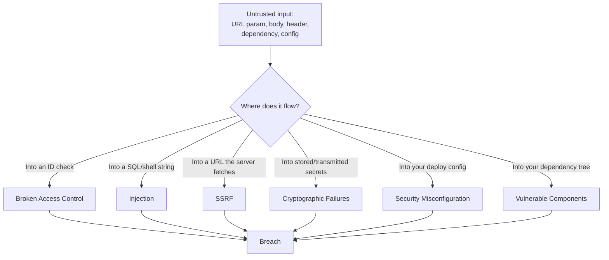

# The OWASP Top 10, demonstrated

## Why this matters

It's a Tuesday afternoon. Support forwards a ticket: a customer says they can see another company's invoices. You assume they're confused until you watch the screen recording. They changed `/api/invoices/4021` to `/api/invoices/4022` in the address bar and got back a stranger's billing data — name, amount, last four of a card. No authentication bypass, no clever payload. The endpoint checked that you were logged in. It never checked that the invoice belonged to you.

That single missing line — an ownership check — is the most common serious vulnerability on the web. It sits at the top of the OWASP Top 10, the industry's reference list of the categories that actually get applications breached. The list is not academic. Each entry maps to incidents that have cost real companies real money: ransomware that started with a vulnerable dependency, data dumps that started with a SQL string concatenation, internal metadata services pillaged through a single unvalidated URL parameter.

The attackers are not geniuses sitting in a dark room targeting you specifically. They are automated scanners walking the entire IPv4 space, trying the same dozen tricks against every host that answers. The cost of knowing these categories is one afternoon of reading. The cost of not knowing is the breach notification, the forced password reset email to every user, and the postmortem where someone asks why the invoice endpoint trusted a number from the URL. This chapter walks the highest-impact categories with code you could actually ship — the vulnerable version first, then the fix.

## Mental model

The OWASP Top 10 (current edition published at [owasp.org/Top10](https://owasp.org/www-project-top-ten/)) is a ranked list of vulnerability *categories*, not specific bugs. The ranking comes from data contributed by security firms: how often each category appears, how exploitable it is, how much damage it does. You don't memorize ten CVEs. You internalize ten *shapes* of mistake.

Almost every entry reduces to one root failure: trusting input you shouldn't, or skipping a check you should have made. The attacker controls some bytes — a URL, a form field, a header, a dependency version — and your code treats those bytes as if you had written them yourself.



The defensive posture is the same across all of them: treat every byte crossing a trust boundary as hostile until you've validated it, scoped it, escaped it, or authorized it. The categories below are just that principle applied to different boundaries.

## In practice

### A01: Broken Access Control

This is the invoice bug from the opening, and it is the number-one category for a reason. The endpoint authenticates the caller but never authorizes the *resource*. This pattern is called IDOR — Insecure Direct Object Reference.

```typescript
// VULNERABLE: authenticated, but not authorized
app.get("/api/invoices/:id", requireLogin, async (req, res) => {
  const invoice = await db.invoice.findUnique({
    where: { id: Number(req.params.id) },
  });
  res.json(invoice); // returns ANY invoice to ANY logged-in user
});
```

`requireLogin` confirms there is a session. It says nothing about whether *this* user owns *this* invoice. The fix scopes the query to the caller's tenant, so a foreign ID simply returns nothing:

```typescript
// FIXED: ownership is part of the query, not an afterthought
app.get("/api/invoices/:id", requireLogin, async (req, res) => {
  const invoice = await db.invoice.findFirst({
    where: { id: Number(req.params.id), orgId: req.user.orgId },
  });
  if (!invoice) return res.status(404).end(); // 404, not 403 — don't confirm it exists
  res.json(invoice);
});
```

The structural lesson: authorization belongs *in the data access path*, not in a separate `if` an engineer might forget. Make the scoped query the only query. Return `404` rather than `403` so you don't leak the existence of records the caller can't see.

### A03: Injection (SQL and command)

Injection happens when attacker-controlled data is concatenated into a string that an interpreter then parses as code. The classic is SQL.

```python
# VULNERABLE: string interpolation into SQL
def find_user(email):
    cur.execute(f"SELECT * FROM users WHERE email = '{email}'")
    return cur.fetchall()

# Attacker sends:  ' OR '1'='1
# Resulting query: SELECT * FROM users WHERE email = '' OR '1'='1'
# -> returns every row
```

*The same idea in TypeScript:*

```typescript
// VULNERABLE: string interpolation into SQL
function findUser(email: string) {
  return db.query(`SELECT * FROM users WHERE email = '${email}'`);
}

// Attacker sends:  ' OR '1'='1
// Resulting query: SELECT * FROM users WHERE email = '' OR '1'='1'
// -> returns every row
```

The fix is parameterized queries. The driver sends the SQL template and the values separately, so the database never parses user data as SQL syntax:

```python
# FIXED: the ? is a bound parameter, never parsed as SQL
def find_user(email):
    cur.execute("SELECT * FROM users WHERE email = ?", (email,))
    return cur.fetchall()
```

*The TypeScript equivalent:*

```typescript
// FIXED: the ? is a bound parameter, never parsed as SQL
function findUser(email: string) {
  return db.query("SELECT * FROM users WHERE email = ?", [email]);
}
```

Command injection is the same disease in a different organ. Building a shell string from input lets the attacker append their own commands.

```python
import subprocess

# VULNERABLE: filename flows into a shell
def convert(filename):
    subprocess.run(f"convert {filename} out.png", shell=True)

# Attacker sends:  photo.jpg; rm -rf /
```

*The same idea in TypeScript:*

```typescript
import { exec } from "node:child_process";

// VULNERABLE: filename flows into a shell
function convert(filename: string) {
  exec(`convert ${filename} out.png`);
}

// Attacker sends:  photo.jpg; rm -rf /
```

The fix is to pass an argument list with `shell=False` (the default), so there is no shell to interpret metacharacters:

```python
# FIXED: argv list, no shell — ';' is just part of a filename now
def convert(filename):
    subprocess.run(["convert", filename, "out.png"], shell=False)
```

*In TypeScript:*

```typescript
import { execFile } from "node:child_process";

// FIXED: argv list, no shell — ';' is just part of a filename now
function convert(filename: string) {
  execFile("convert", [filename, "out.png"]);
}
```

Never build interpreter input by concatenation — for SQL, shell, LDAP, or NoSQL. Use the API that separates code from data. If you must interpolate (rare: dynamic table names), validate against a strict allow-list.

### A02: Cryptographic Failures

This category is about secrets protected with the wrong tool — or no tool. The most frequent instance is storing passwords with a fast or reversible hash.

```python
import hashlib

# VULNERABLE: fast, unsalted hash — crackable at enormous rates on commodity GPUs
def store_password(pw):
    return hashlib.sha256(pw.encode()).hexdigest()
```

*The same idea in TypeScript:*

```typescript
import { createHash } from "node:crypto";

// VULNERABLE: fast, unsalted hash — crackable at enormous rates on commodity GPUs
function storePassword(pw: string): string {
  return createHash("sha256").update(pw).digest("hex");
}
```

SHA-256 is designed to be fast, which is exactly wrong for passwords: it lets an attacker who steals the table brute-force it cheaply. Use a slow, salted, memory-hard password hash. Argon2id is the current recommendation from the [OWASP Password Storage Cheat Sheet](https://cheatsheetseries.owasp.org/cheatsheets/Password_Storage_Cheat_Sheet.html); bcrypt remains acceptable.

```python
# FIXED: Argon2id — slow, salted, memory-hard, tunable work factor
from argon2 import PasswordHasher

ph = PasswordHasher()  # sensible defaults; salt generated per-hash

def store_password(pw: str) -> str:
    return ph.hash(pw)  # encodes algorithm, params, and salt in the string

def verify_password(stored: str, pw: str) -> bool:
    try:
        return ph.verify(stored, pw)
    except Exception:
        return False
```

*The TypeScript equivalent:*

```typescript
// FIXED: Argon2id — slow, salted, memory-hard, tunable work factor
import argon2 from "argon2";

function storePassword(pw: string): Promise<string> {
  // encodes algorithm, params, and salt in the string; salt generated per-hash
  return argon2.hash(pw, { type: argon2.argon2id });
}

async function verifyPassword(stored: string, pw: string): Promise<boolean> {
  try {
    return await argon2.verify(stored, pw);
  } catch {
    return false;
  }
}
```

The same category covers transmitting secrets over plaintext HTTP, hardcoding keys in source, using ECB mode, or reaching for `Math.random()` to generate a token. For randomness that an attacker must not predict (session IDs, password-reset tokens), use a cryptographically secure source: `crypto.randomBytes` in Node, `secrets` in Python.

### A10: Server-Side Request Forgery (SSRF)

SSRF is when your server fetches a URL the user supplies, and the attacker points it somewhere internal — most famously a cloud metadata endpoint that hands out credentials.

```typescript
// VULNERABLE: server fetches whatever URL the user provides
app.post("/api/fetch-avatar", async (req, res) => {
  const r = await fetch(req.body.imageUrl); // attacker-controlled
  res.send(await r.buffer());
});

// Attacker sends imageUrl =
//   http://169.254.169.254/latest/meta-data/iam/security-credentials/
// -> server returns its own cloud credentials
```

The fix is an allow-list plus blocking access to private and link-local ranges. Validate the *resolved* IP, not just the hostname, to defeat DNS rebinding.

```typescript
import dns from "node:dns/promises";
import ipaddr from "ipaddr.js";

const ALLOWED_HOSTS = new Set(["images.example-cdn.com"]);

async function safeFetch(rawUrl: string) {
  const url = new URL(rawUrl);
  if (url.protocol !== "https:") throw new Error("only https");
  if (!ALLOWED_HOSTS.has(url.hostname)) throw new Error("host not allowed");

  // Resolve and reject private / link-local / loopback targets
  const { address } = await dns.lookup(url.hostname);
  const range = ipaddr.parse(address).range();
  if (["private", "loopback", "linkLocal", "uniqueLocal"].includes(range)) {
    throw new Error("blocked internal address");
  }
  return fetch(url, { redirect: "error" }); // don't follow redirects to bypass the check
}
```

Note `redirect: "error"` — an allowed host that 302-redirects to `169.254.169.254` would otherwise bypass the whole check. At the infrastructure layer, requiring IMDSv2 (which demands a session token) blunts the metadata-credential attack even if application code slips.

### A05: Security Misconfiguration

The vulnerability here is in defaults and deployment, not in a line of business logic. Debug mode in production is the canonical example: a stack trace that leaks source paths, library versions, and sometimes secrets.

```python
# VULNERABLE: app.py shipped to production
app.run(debug=True)            # Flask: interactive debugger + RCE via the console
DEBUG = True                   # Django: full settings + SQL in error pages
```

*The same idea in TypeScript:*

```typescript
// VULNERABLE: server.ts shipped to production
app.set("env", "development"); // Express: leaks full stack traces in error responses
const DEBUG = true;            // app code: verbose error pages
```

```python
# FIXED: driven by environment, defaulting to safe
import os
DEBUG = os.environ.get("APP_ENV") == "development"
app.run(debug=DEBUG)
```

*The TypeScript equivalent:*

```typescript
// FIXED: driven by environment, defaulting to safe
const DEBUG = process.env.APP_ENV === "development";
app.set("env", DEBUG ? "development" : "production");
```

Misconfiguration also covers permissive CORS (`Access-Control-Allow-Origin: *` on an authenticated API), default admin credentials left in place, S3 buckets set to public, and missing security headers. Set a baseline: `Content-Security-Policy`, `Strict-Transport-Security`, `X-Content-Type-Options: nosniff`, and scope CORS to the exact origins you serve.

### A06: Vulnerable and Outdated Components

You wrote the secure code. The breach came through a transitive dependency four levels deep that you've never heard of. This is how Log4Shell and the Equifax breach (a known, unpatched Struts vulnerability) happened.

```bash
# Detection: audit the dependency tree in CI
$ npm audit --audit-level=high
# found 1 high severity vulnerability in transitive dep 'foo'

$ pip-audit          # Python
$ osv-scanner ./     # language-agnostic, backed by the OSV database
```

The fix is process, not a one-time patch: pin versions with a lockfile, run an auditing tool as a *blocking* CI gate, and adopt automated dependency-update PRs (Dependabot, Renovate) so upgrades arrive in small, reviewable increments instead of a terrifying once-a-year megabump.

```yaml
# .github/workflows/audit.yml — fail the build on known-vulnerable deps
name: audit
on: [push, pull_request]
jobs:
  osv:
    runs-on: ubuntu-latest
    steps:
      - uses: actions/checkout@v4
      - uses: google/osv-scanner-action@v1
        with:
          scan-args: "--lockfile=package-lock.json"
```

> Connect the dots: Vulnerable components are one corner of the much larger supply-chain problem — SBOMs, signed artifacts, and typosquatting — covered in depth in this Part's "Supply chain and dependency security" chapter, and the CI gating that enforces it connects back to the pipeline design in Part 9.

## Pitfalls and anti-patterns

**Client-side authorization.** *Recognize it* when the UI hides the "Delete" button for non-admins but the `DELETE /api/users/:id` endpoint has no server-side role check. The button is cosmetic; the API is the real boundary. *Fix it* by enforcing every authorization decision on the server. The client is a convenience, never a control.

**Blocklist input filtering.** *Recognize it* when you see code stripping `<script>` or rejecting the literal string `' OR '1'='1`. Attackers have infinite encodings (`<scr<script>ipt>`, hex, Unicode) and you cannot enumerate them. *Fix it* by switching to the structural defense — parameterized queries, output encoding, allow-lists — that makes the class of attack impossible rather than playing whack-a-mole with payloads.

**Rolling your own crypto.** *Recognize it* as any custom encryption routine, a homegrown JWT verifier, or `==` comparing secret tokens (which leaks length via timing). *Fix it* by using vetted libraries: `libsodium`/`nacl`, a maintained JWT library with explicit algorithm allow-listing, and constant-time comparison (`crypto.timingSafeEqual`, `hmac.compare_digest`) for any secret.

**Verbose errors in production.** *Recognize it* when a 500 returns a stack trace, SQL fragment, or framework version to the client. Each one is reconnaissance handed to an attacker. *Fix it* by returning a generic message and an opaque error ID to the user, while logging full detail server-side keyed by that ID.

**Treating dependency audits as advisory.** *Recognize it* when `npm audit` prints warnings nobody reads because the build still goes green. *Fix it* by making the audit a blocking gate with an explicit, time-boxed exception process for the rare unfixable finding — not silent indefinite ignore.

## Production checklist

- [ ] Every resource endpoint scopes its query to the caller's tenant/owner; authorization lives in the data path, not a separate check
- [ ] Object-not-found returns `404`, not `403`, so you don't confirm the existence of inaccessible records
- [ ] All database access uses parameterized queries or an ORM; zero string-built SQL
- [ ] No `shell=True` / `exec` with interpolated input; subprocess calls use argv arrays
- [ ] Passwords hashed with Argon2id or bcrypt; tokens from a CSPRNG, compared in constant time
- [ ] HTTPS enforced end to end; HSTS, CSP, and `X-Content-Type-Options: nosniff` headers set
- [ ] Server-side URL fetches go through an allow-list, block private/link-local IPs on the resolved address, and disable redirects
- [ ] IMDSv2 required on cloud instances; no long-lived credentials in environment or source
- [ ] Debug mode, default credentials, and public buckets verified off before any production deploy
- [ ] CORS scoped to explicit origins; never `*` on an authenticated API
- [ ] Dependency audit (`osv-scanner` / `npm audit` / `pip-audit`) runs as a blocking CI gate; automated update PRs enabled

## Exercises

1. **(Comprehension)** For each of the six categories in this chapter, name the trust boundary that was crossed and the single sentence describing what the vulnerable code trusted that it shouldn't have. Then explain why returning `404` instead of `403` for a forbidden invoice is a security improvement, not just a UX choice.

2. **(Applied)** Take the vulnerable SSRF endpoint above and write a test suite that proves the fix: a case for an allowed host (passes), a raw IP in a private range (blocked), a hostname that resolves to `127.0.0.1` (blocked), and an allowed host that 302-redirects to `169.254.169.254` (blocked). Confirm the original vulnerable version fails at least three of these.

3. **(Design)** You're handed a five-year-old monolith with 800 endpoints and no consistent authorization layer — every route checks ownership ad hoc, and several forget to. Design a strategy to make broken access control structurally hard: consider a centralized policy layer, default-deny middleware, query-level tenant scoping enforced by the ORM, and how you'd detect the endpoints that are currently missing checks. State which you'd build first and what you'd accept as residual risk.

## Further reading

- OWASP, [Top 10 Web Application Security Risks](https://owasp.org/www-project-top-ten/) — the canonical list, with per-category descriptions, examples, and prevention guidance
- OWASP, [Cheat Sheet Series](https://cheatsheetseries.owasp.org/) — concise, authoritative how-to pages for password storage, SQL injection prevention, SSRF, and more
- OWASP, [Application Security Verification Standard (ASVS)](https://owasp.org/www-project-application-security-verification-standard/) — a testable checklist of security requirements, far deeper than the Top 10
- PortSwigger, [Web Security Academy](https://portswigger.net/web-security) — free, hands-on labs where you exploit each vulnerability class in a sandbox
- Google, [OSV-Scanner and the OSV database](https://google.github.io/osv-scanner/) — the open vulnerability format and scanner referenced above
- D. Hardt (ed.), [RFC 6749 (OAuth 2.0)](https://datatracker.ietf.org/doc/html/rfc6749) — read alongside the AuthN/AuthZ chapter when you implement access control properly

> Security note: The Top 10 is a floor, not a ceiling — it ranks the *common* categories, which means a determined attacker targeting you specifically will look past it. Defense in depth assumes each control will eventually fail: even with perfect input validation, scope your database credentials to least privilege so a future injection bug reads less, run your URL-fetcher in a network-segmented egress proxy so a future SSRF reaches nothing, and add anomaly detection (a single user enumerating sequential invoice IDs) so the *next* access-control gap trips an alert before it becomes a breach notification. The goal is not to be unbreachable; it's to ensure no single mistake is catastrophic.
