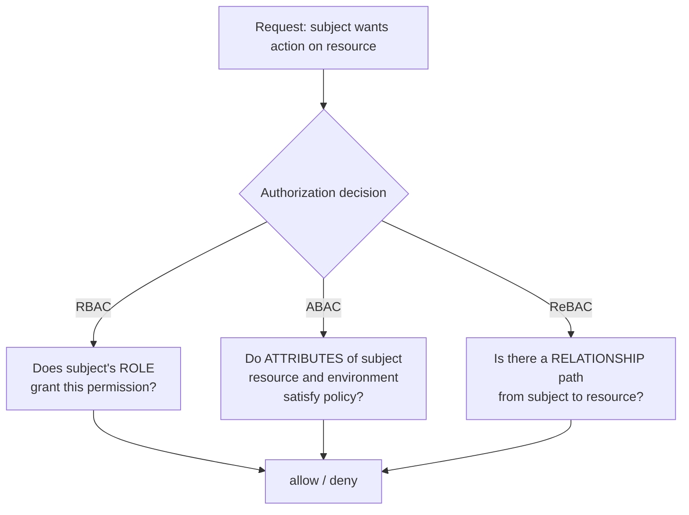

# AuthN/AuthZ models that scale

## Why this matters

It's a Tuesday afternoon. A support engineer forwards you a screenshot from an angry customer: they opened their invoice at `/api/invoices/4815` and, out of curiosity, changed the number to `4816`. They're now looking at another company's invoice — line items, billing contact, the lot. Your endpoint authenticated the request perfectly. A valid session, a valid token, a logged-in user. What it never did was ask the only question that mattered: *is this their invoice?*

That gap between "who are you" and "what are you allowed to touch" is where most real breaches live. The OWASP Top 10 has ranked Broken Access Control as the number one web application risk since 2021, and the dominant flavor of it is exactly this — Broken Object-Level Authorization, also called IDOR (Insecure Direct Object Reference). It is not exotic. It is a missing `WHERE owner_id = ?` clause, repeated across forty endpoints, each written by a different person on a different sprint, none of whom owned the authorization story end to end.

The engineers who treat authorization as "check the user's role at the top of the handler" ship these bugs constantly, because roles answer the wrong question. Authorization that scales is about *resources and relationships*, not just job titles. This chapter is about the models that get this right — RBAC, ABAC, ReBAC — when each one fits, how to express them in a policy engine instead of scattering `if` statements across your codebase, and how to kill the IDOR class of bug structurally rather than one endpoint at a time. Authentication, the "who are you" half, is covered in Part 5; here we assume you know the caller's identity and focus entirely on what that identity is permitted to do.

## Mental model

Authentication (AuthN) establishes *identity*. Authorization (AuthZ) decides *permission*. They are different problems with different failure modes, and conflating them is the root cause of the invoice bug above: a valid token proves identity, never entitlement.

Authorization models differ in what data they consult to reach a yes/no decision:



- **RBAC (Role-Based)**: permissions attach to roles, roles attach to users. `admin` can delete; `viewer` cannot. Simple, auditable, the right default for coarse-grained, organization-wide capabilities. It breaks down when permission depends on the *specific resource* — RBAC can say "editors may edit documents," not "this user may edit *this* document."

- **ABAC (Attribute-Based)**: decisions are a function of attributes — of the subject (department, clearance), the resource (classification, owner), and the environment (time, IP, device posture). Formalized in NIST SP 800-162. Extremely expressive: "allow if `subject.department == resource.department` and `request.time` is during business hours." The cost is that policies get hard to reason about and "who can access X?" becomes a query you can't answer by reading a table.

- **ReBAC (Relationship-Based)**: permission derives from a graph of relationships between subjects and objects. Popularized by Google's Zanzibar system, which the published paper describes as serving authorization for products including Calendar, Cloud, Drive, Maps, Photos, and YouTube. The core data is tuples like `document:roadmap#editor@user:alice` ("alice is an editor of the roadmap doc") and `group:eng#member@user:bob`. Permissions flow along edges: if `folder:plans#viewer@group:eng#member` and bob is in eng, bob can view everything in the folder. This is the model that natively expresses "share *this* document with *that* person" and the nested-group inheritance that real products need.

These aren't mutually exclusive. Most mature systems are RBAC for org-level capabilities, ReBAC for resource sharing, with ABAC conditions layered on top (deny outside business hours, require MFA for sensitive scopes). The unifying idea — and the one architectural decision that matters most — is to **externalize the decision into a Policy Decision Point (PDP)** that your application code (the Policy Enforcement Point, PEP) calls, rather than hardcoding rules inline. Policy as data and policy as code, separated from business logic, is what lets authorization scale across teams and stay auditable.

## In practice

### The bug: Broken Object-Level Authorization

Here is the invoice endpoint, faithfully reproduced. It is authenticated and broken.

```typescript
// VULNERABLE: authenticates the user, never checks ownership
app.get("/api/invoices/:id", requireAuth, async (req, res) => {
  const invoice = await db.invoice.findUnique({
    where: { id: Number(req.params.id) },
  });
  if (!invoice) return res.status(404).json({ error: "not found" });
  return res.json(invoice); // returns ANY invoice to ANY logged-in user
});
```

`requireAuth` confirms there is a valid session. It says nothing about whether `req.user` owns invoice `4816`. The fix is to make ownership part of the query, so an unauthorized object is indistinguishable from a nonexistent one:

```typescript
// FIXED: ownership is part of the lookup, not an afterthought
app.get("/api/invoices/:id", requireAuth, async (req, res) => {
  const invoice = await db.invoice.findFirst({
    where: {
      id: Number(req.params.id),
      organizationId: req.user.organizationId, // tenant scoping
    },
  });
  if (!invoice) return res.status(404).json({ error: "not found" }); // 404, not 403
  return res.json(invoice);
});
```

Two deliberate choices. First, the authorization predicate lives *inside* the database query — there is no window where the object is fetched and then checked, and no way to forget the check and still return data. Second, we return `404` rather than `403` for objects the caller can't access. A `403` confirms the resource exists, which leaks information and lets an attacker enumerate valid IDs. Hide existence behind authorization.

This per-query scoping is the floor. It works, but it doesn't scale: every developer must remember it on every endpoint, and the rules ("org members see org invoices, but finance role sees all, and an external auditor sees a filtered subset") inevitably grow beyond a `WHERE` clause. That's when you externalize.

### RBAC, expressed as data

Start with roles for coarse capabilities. The mistake is encoding roles as enum checks scattered through handlers (`if (user.role === "admin")`). Encode them as a permission table instead:

```typescript
const rolePermissions = {
  viewer: ["invoice:read"],
  editor: ["invoice:read", "invoice:write"],
  admin: ["invoice:read", "invoice:write", "invoice:delete"],
} as const;

function can(user: User, permission: string): boolean {
  return user.roles.some((r) => rolePermissions[r]?.includes(permission));
}
```

Now adding a permission is a data change in one place, and "what can an editor do?" is answerable by reading a table. But notice `can(user, "invoice:read")` still doesn't know *which* invoice. RBAC handles the verb; you still need resource scoping for the noun.

### ReBAC with a policy engine: OPA

For resource-level and relationship-driven decisions, externalize to a policy engine. Open Policy Agent (OPA) is the CNCF-graduated standard; you write policy in Rego, ship it alongside the app, and query it with the request context. Here is a policy that combines RBAC capability with ReBAC ownership and an ABAC time condition:

```rego
package authz

import rego.v1

default allow := false

# Admins can do anything within their org
allow if {
    input.subject.roles[_] == "admin"
    input.subject.org == input.resource.org
}

# Owners can read and write their own resource
allow if {
    input.action in {"read", "write"}
    input.resource.owner == input.subject.id
}

# Members of a group the resource is shared with can read it (ReBAC edge)
allow if {
    input.action == "read"
    some share in input.resource.shared_with
    share == input.subject.group
}

# ABAC overlay: deletes only allowed during business hours UTC
allow if {
    input.action == "delete"
    input.subject.roles[_] == "admin"
    input.time.hour >= 9
    input.time.hour < 17
}
```

The application becomes a thin enforcement point that asks OPA and obeys:

```typescript
async function authorize(input: AuthzInput): Promise<boolean> {
  const res = await fetch("http://localhost:8181/v1/data/authz/allow", {
    method: "POST",
    headers: { "content-type": "application/json" },
    body: JSON.stringify({ input }),
  });
  const { result } = await res.json();
  return result === true;
}

app.delete("/api/invoices/:id", requireAuth, async (req, res) => {
  const invoice = await db.invoice.findUnique({ where: { id: Number(req.params.id) } });
  if (!invoice) return res.status(404).json({ error: "not found" });

  const ok = await authorize({
    subject: { id: req.user.id, org: req.user.organizationId, roles: req.user.roles, group: req.user.groupId },
    action: "delete",
    resource: { owner: invoice.ownerId, org: invoice.organizationId, shared_with: invoice.sharedWith },
    time: { hour: new Date().getUTCHours() },
  });
  if (!ok) return res.status(404).json({ error: "not found" });

  await db.invoice.delete({ where: { id: invoice.id } });
  return res.status(204).end();
});
```

The decision logic now lives in version-controlled, testable, centrally-auditable policy. Security can review `authz.rego` in one PR instead of grepping forty handlers. For relationship-heavy products at scale — the "share this folder with that team, and members inherit access to everything inside" pattern — a dedicated Zanzibar-style store (SpiceDB, OpenFGA, Google's own Cloud IAM) stores the relationship tuples and answers `check(user, permission, object)` with consistency guarantees OPA's in-memory model doesn't provide on its own.

### Choosing a model

| Need | Reach for |
|---|---|
| Org-wide capabilities (admin vs. user) | RBAC |
| Decisions on subject/resource/env attributes | ABAC |
| Per-resource sharing, nested groups, inheritance | ReBAC (Zanzibar) |
| Several of the above, centrally governed | Policy engine (OPA) combining them |

My default for a new product: RBAC for the admin console, per-query tenant scoping as the non-negotiable floor, and a Zanzibar-style store the moment users can share individual resources with each other. Reach for full ABAC only when a regulatory or contextual requirement genuinely demands it — its expressiveness is also its maintenance burden.

## Pitfalls and anti-patterns

**1. The Confused Deputy.** A privileged component performs an action on behalf of a less-privileged caller without checking whether the *caller* was authorized — it acts with its own authority instead. SSRF is the classic instance: your server fetches a user-supplied URL and, because the server sits inside the VPC, the attacker reaches `http://169.254.169.254/` (cloud metadata) using your service's network position. *Recognize it* when a backend uses its own credentials or network access to satisfy a user request. *Fix it* by propagating and re-checking the original caller's authority at the deputy (pass the user identity through, validate it downstream), allowlisting destinations, and scoping service credentials to least privilege so the deputy can't do more than the caller could.

**2. Authorization at the wrong layer (client-side or gateway-only).** Hiding a delete button in the UI, or checking roles only at an API gateway while internal services trust each other, means anyone who calls the service directly bypasses the check. *Recognize it* when the only enforcement is in JavaScript or a single perimeter. *Fix it* by enforcing at the resource — the service that owns the data must check authorization on every request, regardless of how the request arrived. Defense in depth: gateway *and* service.

**3. Mass assignment / privilege escalation via the payload.** An endpoint binds the request body straight onto the model, and the body includes `{"role": "admin"}` or `{"organizationId": 99}`. The user rewrites their own privileges. *Recognize it* in code that does `Object.assign(user, req.body)` or `db.update({ data: req.body })`. *Fix it* with an explicit allowlist of mutable fields — never spread untrusted input into a persisted object, and never let the client set authorization-relevant fields.

**4. IDOR from trusting client-supplied identifiers.** Beyond path parameters, this hides in foreign keys: a "create comment" endpoint that accepts `authorId` from the body, or a "transfer funds" call that takes `fromAccount` without verifying ownership. *Recognize it* by auditing every place a client supplies an ID that selects or scopes a resource. *Fix it* by deriving owned identifiers from the authenticated session, not the request, and scoping every query by tenant/owner — the same `WHERE owner_id = ?` discipline as the invoice fix.

**5. Fail-open authorization.** The policy engine times out, throws, or returns a malformed response, and the calling code treats the error as "allow." *Recognize it* in `try { return await authorize(...) } catch { return true }` or a missing `default := false`. *Fix it* by defaulting to deny everywhere — both in Rego (`default allow := false`) and in the client (any error, timeout, or non-`true` result denies). Authorization must fail closed.

## Production checklist

- [ ] Every resource-fetching query is scoped by tenant/owner derived from the session, never from client input
- [ ] Object-not-authorized returns `404`, not `403`, to avoid existence/ID enumeration
- [ ] Authorization is enforced at the resource-owning service, not only at the UI or API gateway
- [ ] No endpoint spreads untrusted request bodies onto persisted models; mutable fields are allowlisted
- [ ] Authorization-relevant fields (`role`, `orgId`, `ownerId`) are never settable by the client
- [ ] Policy defaults to deny; every error, timeout, or non-affirmative result from the PDP fails closed
- [ ] Authorization logic is centralized (policy engine or shared library), version-controlled, and unit-tested
- [ ] Service-to-service credentials are scoped to least privilege; deputies re-check the original caller's authority
- [ ] User-supplied URLs/destinations are allowlisted to prevent SSRF/confused-deputy reach into internal networks
- [ ] Authorization decisions are logged (subject, action, resource, allow/deny) for audit and anomaly detection
- [ ] An automated test enumerates each object endpoint with a non-owner identity and asserts denial (IDOR regression suite)

## Exercises

1. **(Comprehension)** Explain, in two sentences each, why RBAC alone cannot express "Alice may edit *this specific* document while Bob may only view it," and how a ReBAC tuple like `document:42#editor@user:alice` solves it. Then state why returning `404` instead of `403` for an unauthorized object is a security improvement.

2. **(Applied)** Take the vulnerable invoice handler from this chapter and write an automated test that authenticates as a user in organization A, requests an invoice belonging to organization B, and asserts a `404`. Then add a `PATCH /api/invoices/:id` endpoint and write a second test proving a client cannot escalate by sending `{"organizationId": <other org>}` in the body. Both tests should fail against the vulnerable code and pass against the fixed code.

3. **(Design)** You're building a document collaboration product where users share files and folders with individuals and nested teams, access inherits down folder trees, and admins need an audit answer to "everyone who can read document X." Sketch the authorization architecture: which model(s) you'd use, whether you'd adopt a Zanzibar-style store (OpenFGA/SpiceDB) or build on OPA, how you'd handle the consistency problem (a user revoked from a team must lose access promptly), and how you'd answer reverse queries ("who can access X?") that simple per-request checks can't. Name the tradeoffs of your choice.

## Further reading

- NIST SP 800-162, *Guide to Attribute Based Access Control (ABAC) Definition and Considerations* — the canonical ABAC reference (https://csrc.nist.gov/publications/detail/sp/800-162/final)
- Pang et al., *Zanzibar: Google's Consistent, Global Authorization System*, USENIX ATC 2019 — the paper behind modern ReBAC (https://research.google/pubs/pub48190/)
- OWASP, *API Security Top 10* — API1:2023 Broken Object Level Authorization and API3 Broken Object Property Level Authorization (https://owasp.org/API-Security/editions/2023/en/0x11-t10/)
- Open Policy Agent documentation and the Rego language reference (https://www.openpolicyagent.org/docs/latest/)
- Norman Hardy, *The Confused Deputy (or why capabilities might have been invented)*, ACM SIGOPS Operating Systems Review, Vol. 22, Issue 4 (October 1988) — the original framing of the confused-deputy problem (overview and citation at https://en.wikipedia.org/wiki/Confused_deputy_problem)
- OpenFGA documentation — an open-source, Zanzibar-inspired authorization store (https://openfga.dev/docs/fga)

> **Connect the dots:** Authorization is only as trustworthy as the identity feeding it. The "who are you" half — sessions, OAuth/OIDC, JWT validation, token lifetimes — is Part 5's authentication chapter, and a forged or over-scoped token turns every policy in this chapter into a rubber stamp. The audit logging called for in the checklist feeds the observability and incident-response practices in Part 9.

> **Security note:** Even a perfect static policy decays over time. The harder, less-discussed problem is *re-evaluation on revocation*: a long-lived JWT carries its claims until expiry, so a user removed from a team at 2pm may still pass `check()` at 2:05pm if their token or a cached decision still says otherwise. Defense in depth here means short token lifetimes plus a revocation/denylist path, bounded cache TTLs on authorization decisions, and — for Zanzibar-style stores — using the consistency tokens ("zookies") that let you require a check be evaluated against relationship data at least as fresh as the moment of the revocation. Treat "access granted once" as a lease, never a deed.
