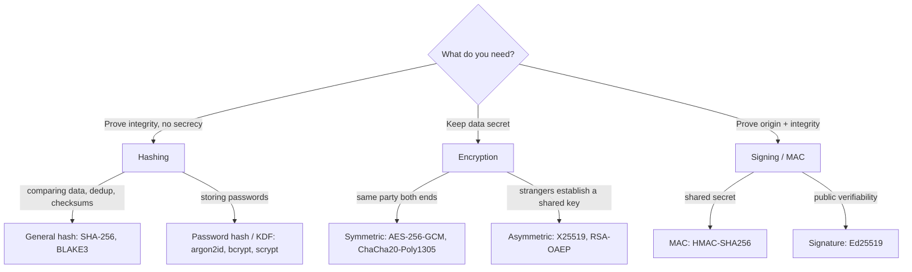

# Applied cryptography

## Why this matters

It's a Tuesday afternoon and a routine security audit lands on your desk. The auditor pulls a sample of rows from your `users` table and asks one question: "How are passwords stored?" You open the schema and find a column called `password_hash`, which feels reassuring until you look closer. The values are 64 hex characters each, and two accounts that you happen to know share the password `Summer2024!` have the *identical* hash. That's the moment your stomach drops. It's unsalted SHA-256. Anyone who dumps this table can run it against a pre-computed rainbow table or a consumer GPU and recover the common passwords in minutes, the weak ones in hours, and the rest at their leisure.

Nobody on the team was malicious or lazy. Someone reached for "the hash function I know," reasoned that hashing is one-way so passwords are safe, and shipped it. That single conflation — treating a fast cryptographic digest as a password-storage primitive — is one of the most common and most expensive mistakes in applied cryptography, and it has leaked enormous numbers of credentials across breaches like LinkedIn and Adobe, plus a long tail you've never heard of.

This chapter is about not making that class of mistake. Cryptography has maybe five primitives an application engineer touches directly, each with a precise job. Hashing is not encryption. Encryption is not signing. A general-purpose hash is not a password hash. A nonce is not a secret, but reusing one can be as fatal as leaking your key. Get the categories straight and the right algorithm for each job follows almost mechanically. Get them confused and you ship something that *looks* secure — it compiles, it round-trips, the tests pass — and is wide open.

## Mental model

Three operations get conflated constantly. Keep them in separate boxes:

| Operation | Reversible? | Needs a key? | Answers the question |
|---|---|---|---|
| **Hashing** | No (one-way) | No | "Is this the same data?" / "Do I store the password verifier?" |
| **Encryption** | Yes (with the key) | Yes | "Can only the key-holder read this?" |
| **Signing / MAC** | No (verify, don't recover) | Yes | "Did the key-holder produce this, unchanged?" |

Hashing destroys information on purpose. Encryption preserves it but locks it. Signing proves origin and integrity without hiding anything. If you ever catch yourself "decrypting a hash" or "encrypting a password for storage," stop — you've crossed a category boundary.

Within encryption there are two families. **Symmetric** (one shared secret key, e.g. AES-GCM) is fast and used for bulk data. **Asymmetric** (a public/private keypair, e.g. RSA, X25519, Ed25519) is slow and used to bootstrap trust — exchanging a symmetric key, or signing. Real systems use both: asymmetric to establish a session, symmetric for the payload. That's exactly what TLS does (Part 10, the next chapter).



Two more concepts that trip people up. A **KDF** (key derivation function) turns a low-entropy secret — a password — into a key, deliberately *slowly*, so that brute force is expensive. Password hashing is just a KDF whose output you store and compare. A **nonce/IV** (number used once / initialization vector) is a non-secret value that makes encryption of the same plaintext under the same key produce different ciphertext each time. Nonces don't need to be secret, but for AES-GCM they must *never repeat under the same key* — reuse breaks confidentiality and lets an attacker forge messages. Hold those two ideas and most of the "why is this broken" cases below become obvious.

## In practice

### Password storage: the wrong way

Here is the code from the opening scenario. It is short, it works, and it is dangerous.

```python
import hashlib

# ANTI-PATTERN - do not ship this.
def store_password(password: str) -> str:
    return hashlib.sha256(password.encode()).hexdigest()

def verify_password(password: str, stored: str) -> bool:
    return hashlib.sha256(password.encode()).hexdigest() == stored
```

Three independent failures:

1. **No salt.** Identical passwords produce identical hashes, so a single rainbow table cracks every reused password at once, and you can see which users share a password.
2. **Too fast.** SHA-256 is designed to be fast. Commodity GPU hardware computes general-purpose hashes at rates orders of magnitude faster than any deliberately-slow password hash, which is the opposite of what you want for passwords.
3. **String comparison via `==`.** This short-circuits on the first differing byte, leaking timing information about the hash. (Less critical for hashes than for MACs, but it's the wrong habit.)

### Password storage: the right way

Use a purpose-built password hash. As of this writing the default choice is **argon2id**, the winner of the Password Hashing Competition and the algorithm OWASP recommends first. `bcrypt` remains acceptable and is fine for existing systems; `scrypt` is also reasonable. Never SHA/MD5.

```python
# pip install argon2-cffi
from argon2 import PasswordHasher
from argon2.exceptions import VerifyMismatchError

# Parameters: tune so a single hash takes a few hundred ms on your hardware.
ph = PasswordHasher(
    time_cost=3,        # iterations
    memory_cost=65536,  # 64 MiB - memory-hardness is argon2id's whole point
    parallelism=4,
)

def store_password(password: str) -> str:
    # Salt is generated automatically and embedded in the output string.
    return ph.hash(password)

def verify_password(password: str, stored: str) -> bool:
    try:
        ph.verify(stored, password)
    except VerifyMismatchError:
        return False
    # Transparently re-hash if our cost parameters have since increased.
    if ph.check_needs_rehash(stored):
        # caller should persist the new hash here
        pass
    return True
```

The stored value is a self-describing PHC string that carries the algorithm, parameters, salt, and digest together:

```text
$argon2id$v=19$m=65536,t=3,p=4$c29tZXNhbHQ$RdescudvJCsgt3ub+b+dWRWJTmaaJObG
```

Because the parameters travel *with* the hash, you can raise `time_cost`/`memory_cost` next year and old hashes still verify — `check_needs_rehash` tells you when to upgrade a user's stored hash on their next successful login. That's how you ratchet security upward without a forced password reset.

The same logic in TypeScript:

```typescript
// npm install argon2
import argon2 from "argon2";

export async function storePassword(password: string): Promise<string> {
  return argon2.hash(password, {
    type: argon2.argon2id,
    memoryCost: 65536, // KiB -> 64 MiB
    timeCost: 3,
    parallelism: 4,
  });
}

export async function verifyPassword(
  password: string,
  stored: string,
): Promise<boolean> {
  return argon2.verify(stored, password); // returns false on mismatch
}
```

### Symmetric encryption: AES-256-GCM done right

When you need to store or transmit data that must stay confidential — a token, a PII field, a session payload — reach for an **AEAD** cipher (Authenticated Encryption with Associated Data). AEAD gives you confidentiality *and* integrity in one operation, so you can't forget the MAC. AES-256-GCM and ChaCha20-Poly1305 are the two you'll use.

```python
# pip install cryptography
import os
from cryptography.hazmat.primitives.ciphers.aead import AESGCM

key = AESGCM.generate_key(bit_length=256)  # store this in a KMS/Vault, not in code
aead = AESGCM(key)

def encrypt(plaintext: bytes, aad: bytes = b"") -> bytes:
    nonce = os.urandom(12)  # 96-bit nonce, FRESH per message
    ct = aead.encrypt(nonce, plaintext, aad)
    return nonce + ct       # prepend nonce so the decryptor has it

def decrypt(blob: bytes, aad: bytes = b"") -> bytes:
    nonce, ct = blob[:12], blob[12:]
    return aead.decrypt(nonce, ct, aad)  # raises if tampered or wrong key
```

Two non-negotiables hide in those few lines:

- **The nonce is fresh every time.** `os.urandom(12)` per message. With a 96-bit random nonce you can safely encrypt a large but finite number of messages under one key before birthday-bound collision probability becomes a concern; rotate keys well before then. Never use a counter you might reset, never hard-code a nonce, never reuse one.
- **The key lives outside the code.** Generate it once, store it in a KMS or secrets manager (Part 10, "Secrets management"), and load it at runtime. A key in source control is a key in your Git history forever.

The `aad` (associated data) is authenticated but not encrypted — use it to bind ciphertext to its context (a user ID, a record version) so an attacker can't paste a valid ciphertext into a different record.

### Why nonce reuse is fatal

This deserves its own demonstration because the failure is non-obvious. In GCM (a counter mode), encryption XORs the plaintext with a keystream derived from `(key, nonce)`. Reuse the nonce under the same key and two ciphertexts share a keystream:

```text
C1 = P1 XOR keystream(key, nonce)
C2 = P2 XOR keystream(key, nonce)
C1 XOR C2 = P1 XOR P2      # keystream cancels - plaintext relationship leaks
```

Worse, for GCM specifically, a single nonce reuse leaks the authentication subkey, which lets an attacker *forge* valid ciphertexts. So nonce reuse breaks both confidentiality and integrity at once. This is not theoretical — it's the kind of bug that gets a CVE. If you genuinely can't guarantee unique nonces (e.g. distributed encryptors with no coordination), use a nonce-misuse-resistant mode like AES-GCM-SIV instead.

### Asymmetric: signing with Ed25519

When two parties don't share a secret, or when you need *public* verifiability, use asymmetric crypto. Signing is the most common application-level use: prove a message came from the private-key holder and wasn't altered.

```python
from cryptography.hazmat.primitives.asymmetric.ed25519 import (
    Ed25519PrivateKey, Ed25519PublicKey,
)

private_key = Ed25519PrivateKey.generate()
public_key = private_key.public_key()  # distribute this freely

signature = private_key.sign(b"transfer 100 to alice")

# Anyone with the public key can verify; only the holder could have signed.
public_key.verify(signature, b"transfer 100 to alice")  # raises on mismatch
```

Ed25519 is fast, has small keys and signatures, and avoids the parameter-choice footguns of raw RSA. Prefer it for new signing work. Use RSA-OAEP or X25519-based key exchange when you need encryption to a public key; never use textbook RSA without padding.

### Comparing secrets in constant time

When you compare a MAC, token, or any secret, use a constant-time comparison so you don't leak the answer through timing:

```python
import hmac
hmac.compare_digest(provided_token, expected_token)  # not ==
```

The equivalent in Node is `crypto.timingSafeEqual(a, b)`, which requires both buffers to be the same length — so compare fixed-length digests, not raw user input, and length-check first.

## Pitfalls and anti-patterns

**1. Password-hashing with a general-purpose digest (SHA-256/MD5/SHA-1).** *Recognize it:* fixed-length hex in a `password` column, no per-row salt, hashing code that calls `hashlib.sha256` or `crypto.createHash`. *Fix:* migrate to argon2id. You can't reverse the old hashes, so wrap them — store `argon2(sha256(password))` and verify in two stages, or re-hash on next login. Either way, plan the migration; don't wait for the breach.

**2. Encrypting passwords instead of hashing them.** *Recognize it:* a "decrypt password" function, or passwords recoverable for "password reminder" emails. *Fix:* passwords must be *verified*, never recovered. Hash with a KDF; implement reset-by-token flows, never reminder-by-plaintext. If you can email a user their password, you've already lost.

**3. Nonce/IV reuse.** *Recognize it:* a constant or zero IV, a nonce derived deterministically from the plaintext, or a counter that resets on restart. *Fix:* generate a fresh random nonce per message (`os.urandom(12)`), store it alongside the ciphertext, and rotate keys before the safe message count is exhausted. If coordination is impossible, switch to AES-GCM-SIV.

**4. Rolling your own crypto — or your own composition of primitives.** *Recognize it:* hand-written XOR "encryption," a bespoke MAC built from a bare hash, encrypt-then-forget-to-authenticate, custom key schedules. *Fix:* use a vetted library (`cryptography`, libsodium/`PyNaCl`, Web Crypto, Tink) and prefer high-level AEAD and signing APIs over assembling primitives yourself. The dangerous part is rarely the cipher; it's the glue around it.

**5. Hard-coded or version-controlled keys.** *Recognize it:* `key = b"my-secret-key-123"` in source, a `.pem` committed to the repo, the same key across all environments. *Fix:* generate keys per environment, store them in a KMS or secrets manager, load at runtime, and rotate on a schedule. A key in Git history is compromised the moment the repo is cloned, and rewriting history doesn't un-clone it.

## Production checklist

- [ ] Passwords hashed with **argon2id** (or bcrypt for legacy), never SHA/MD5 — with per-user salt embedded in the stored hash
- [ ] Password-hash cost parameters tuned so a single hash takes a few hundred ms, and re-evaluated yearly; `check_needs_rehash` upgrades stored hashes on login
- [ ] All symmetric encryption uses an **AEAD** mode (AES-256-GCM or ChaCha20-Poly1305), never a raw/unauthenticated cipher
- [ ] A **fresh random nonce per message**, stored with the ciphertext; key rotation scheduled before the safe message count is reached
- [ ] Associated data (AAD) binds each ciphertext to its record context where applicable
- [ ] Secret comparisons use a constant-time function (`hmac.compare_digest`, `crypto.timingSafeEqual`), never `==`
- [ ] Signing uses **Ed25519** (or RSA-PSS); encryption-to-public-key uses RSA-OAEP or X25519 — never textbook RSA
- [ ] No keys in source control; keys live in a KMS/secrets manager, scoped per environment, with a rotation policy
- [ ] All crypto goes through a vetted library (libsodium, `cryptography`, Web Crypto, Tink); zero hand-rolled primitives
- [ ] A documented migration path exists for upgrading any algorithm or parameter without a forced reset

## Exercises

1. **(Comprehension)** For each of these, state whether you'd use hashing, symmetric encryption, asymmetric encryption, or signing, and name a concrete algorithm: (a) storing user passwords, (b) encrypting a PII field at rest in Postgres, (c) verifying that a webhook payload genuinely came from your payment provider, (d) deduplicating uploaded files by content. Explain why a general-purpose hash is wrong for (a) but right for (d).

2. **(Applied)** Take the insecure unsalted-SHA-256 password code from this chapter and migrate it to argon2id *without* forcing every user to reset their password. Implement the wrapper strategy (verify against the old scheme, re-hash with argon2id on successful login), and write a test proving that a user who logs in once ends up with an argon2id hash while never having entered a new password.

3. **(Design)** You're building a feature that encrypts users' private notes so that even a full database dump reveals nothing. Design the key management: where the data-encryption key lives, how it's protected (envelope encryption with a KMS), how you rotate it without re-encrypting every record at once, and how nonce uniqueness is guaranteed across multiple application servers. State the threat model you're defending against and one threat you're explicitly *not* covering.

## Further reading

- OWASP, [Password Storage Cheat Sheet](https://cheatsheetseries.owasp.org/cheatsheets/Password_Storage_Cheat_Sheet.html) — the canonical, regularly updated guidance on argon2id/bcrypt parameters
- RFC 9106, [Argon2 Memory-Hard Function for Password Hashing and Proof-of-Work Applications](https://www.rfc-editor.org/rfc/rfc9106.html)
- NIST SP 800-38D, [Recommendation for Block Cipher Modes of Operation: GCM and GMAC](https://csrc.nist.gov/publications/detail/sp/800-38d/final) — the authoritative source on nonce requirements
- RFC 8439, [ChaCha20 and Poly1305 for IETF Protocols](https://www.rfc-editor.org/rfc/rfc8439.html)
- Niels Ferguson, Bruce Schneier, Tadayoshi Kohno, *Cryptography Engineering* (2010) — the standard text on building systems with these primitives correctly
- The [libsodium documentation](https://doc.libsodium.org/) — a well-designed high-level API; reading it teaches what "safe defaults" look like

> **Connect the dots:** The asymmetric-to-bootstrap, symmetric-for-bulk pattern here is exactly the structure of the TLS handshake in the next chapter, and the "keys live in a KMS, never in code" rule is the entire subject of "Secrets management." The content-addressing in Part 3's Git internals is the same hashing primitive applied to a different problem: identity by digest rather than secrecy.

> **Security note:** Even perfect primitives leave a key alive in process memory while you use it, and that residue outlives the operation — core dumps, swap files, hibernation images, and container snapshots can all capture a plaintext key long after the request that used it returned. Defense in depth here means narrowing that window: pull keys from the KMS just-in-time rather than caching them process-wide, zero out key buffers after use where your language allows it (libsodium's `sodium_memzero`, secure-allocator types), disable core dumps for processes that hold key material, and keep swap encrypted. None of this is exotic, but it's the layer that survives after the algorithm choices above are all correct — and it's the layer attackers reach for once they have a foothold on the host rather than just a copy of the database.
