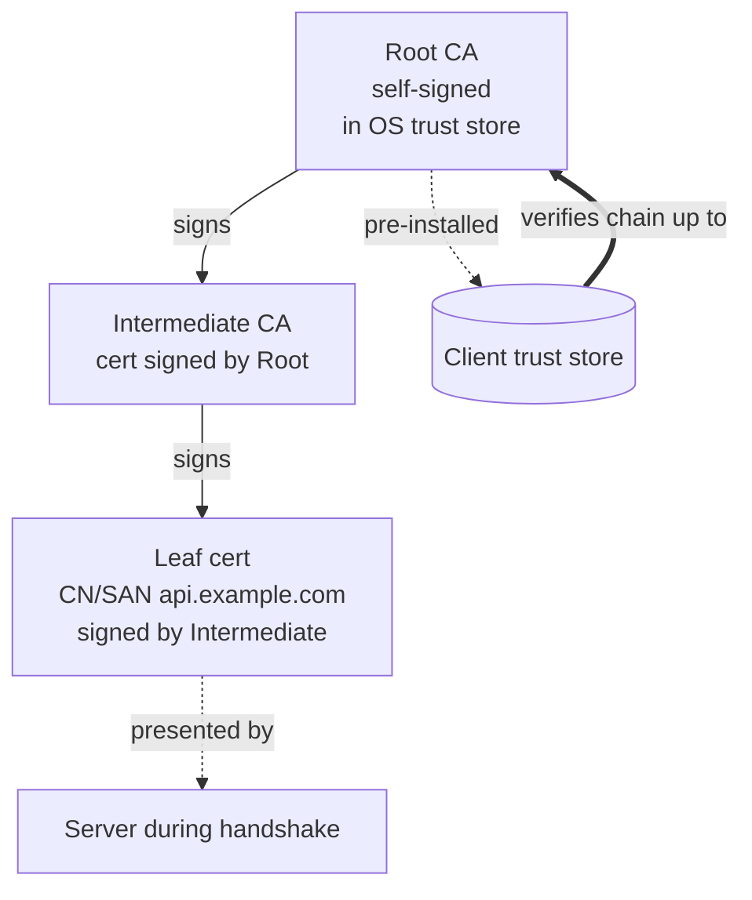

# TLS, certificates, and the trust chain

## Why this matters

It's a Tuesday afternoon. Your checkout service has been healthy for fourteen months. Then, at 09:14 UTC, payments stop. The error rate chart goes vertical. Your phone lights up. The logs from the payment gateway client read `x509: certificate has expired or is not yet valid`. Nobody deployed anything. Nobody touched the network. The code that worked at 09:13 is byte-for-byte the code that's failing at 09:14.

What happened is that a certificate the payment provider rotated three weeks ago chained to an intermediate CA, and that intermediate's certificate expired at 09:14:00 UTC. Your service had the old intermediate cached in a trust bundle baked into a Docker image from last quarter. The clock ran out on a file you didn't know you depended on, and no amount of staring at your application code will reveal it. The fix takes ninety seconds once you understand the trust chain. Finding it without that understanding can eat a whole incident bridge of senior engineers guessing.

TLS failures have this signature: they are invisible until a clock ticks past a date, a hostname changes, or someone rotates a key, and then they are total. Unlike a logic bug that affects one code path, a broken trust chain takes down every connection at once. The engineers who can read a certificate chain, reason about who signed what, and run three `openssl` commands to localize the failure resolve these incidents in minutes. Everyone else escalates. This chapter is about being the first kind of engineer.

## Mental model

TLS does two jobs at once: it proves you're talking to who you think you're talking to (authentication), and it encrypts the conversation so nobody can read or tamper with it (confidentiality and integrity). The encryption part is mechanical and rarely the problem. The authentication part is where almost all real-world failures live, and it rests entirely on a chain of digital signatures rooted in a set of certificates your machine has decided to trust.

A certificate is a public key plus an identity (a hostname) plus a signature from someone vouching for that binding. You trust a server's certificate not because you've seen it before, but because it was signed by an intermediate CA, whose certificate was signed by a root CA, whose certificate sits in your operating system's or browser's trust store. The chain has to terminate in a root you already trust, or the whole thing is worthless.



The handshake (TLS 1.3, the version you should be running) is one round trip. The client sends a `ClientHello` listing its supported cipher suites, a key share for key agreement, and two critical extensions: SNI (Server Name Indication, which tells the server which hostname you want so it can present the right certificate) and ALPN (Application-Layer Protocol Negotiation, which lets client and server agree on `h2` for HTTP/2 or `http/1.1` in the same round trip). The server replies with its certificate chain, its own key share, and a signature proving it holds the private key for the leaf certificate. Both sides derive the same session keys. From there, everything is encrypted.

The client's verification is the part that matters: it walks the presented chain, checks each signature against the issuer's public key, confirms each certificate is within its validity window, confirms the leaf's SAN (Subject Alternative Name) matches the hostname it asked for, and confirms the chain terminates in a trusted root. Any one of those failing aborts the connection. Mutual TLS (mTLS) adds the mirror image: the server also demands a client certificate and runs the same verification in reverse, which is how services authenticate each other inside a zero-trust mesh without passwords.

One thing the chain does *not* do is vouch for the operator's intentions. Verification proves the peer holds a private key bound to a name a CA was willing to certify. It says nothing about whether that name belongs to who you imagine. That gap is small in practice but real, and it shapes the defense-in-depth measures at the end of this chapter.

## In practice

### Inspect what a server actually presents

The single most useful TLS debugging command. It shows the chain, the negotiated protocol, and the cipher:

```bash
$ openssl s_client -connect api.example.com:443 -servername api.example.com </dev/null 2>/dev/null \
  | openssl x509 -noout -subject -issuer -dates -ext subjectAltName
subject=CN=api.example.com
issuer=C=US, O=Let's Encrypt, CN=R11
notBefore=Apr  1 00:00:00 2026 GMT
notAfter=Jun 30 23:59:59 2026 GMT
X509v3 Subject Alternative Name:
    DNS:api.example.com, DNS:www.example.com
```

The `-servername` flag is not optional: without it you send no SNI, and a server hosting many sites will hand you the wrong (default) certificate, producing a "hostname mismatch" that isn't real. This single omission causes a surprising share of false-alarm TLS tickets.

To see the full chain and the verification result the way a real client sees it:

```bash
$ openssl s_client -connect api.example.com:443 -servername api.example.com -showcerts </dev/null 2>/dev/null \
  | grep -E "s:|i:|Verify return code"
 0 s:CN=api.example.com
   i:C=US, O=Let's Encrypt, CN=R11
 1 s:C=US, O=Let's Encrypt, CN=R11
   i:C=US, O=Internet Security Research Group, CN=ISRG Root X1
Verify return code: 0 (ok)
```

`Verify return code: 0 (ok)` is the answer to "is the chain valid from this machine's point of view." A nonzero code names the exact failure (`10` is expired, `20` is "unable to get local issuer certificate," `62` is hostname mismatch). Read it before you theorize. The chain reads from the leaf at index `0` upward: each certificate's issuer (`i:`) line should equal the next certificate's subject (`s:`) line. When that linkage breaks, you've found the gap in the chain.

### The most common production failure: an incomplete chain

A server is supposed to send its leaf certificate *and* every intermediate up to (but not including) the root. A frequent misconfiguration is sending only the leaf. It works in your browser (which caches intermediates and can fetch them via the AIA extension) but fails in `curl`, in Go services, and in mobile clients that don't do AIA fetching. The result is the maddening "works on my laptop, fails in production" TLS bug.

```nginx
# WRONG: only the leaf certificate. Browsers may paper over it; strict clients won't.
ssl_certificate     /etc/ssl/leaf.pem;
ssl_certificate_key /etc/ssl/privkey.pem;
```

```nginx
# RIGHT: fullchain.pem is leaf + intermediates concatenated, leaf first.
ssl_certificate     /etc/ssl/fullchain.pem;
ssl_certificate_key /etc/ssl/privkey.pem;
ssl_protocols       TLSv1.2 TLSv1.3;
ssl_prefer_server_ciphers off;   # for TLS 1.3 the client's order is fine; let it choose
```

Verify the chain is complete and ordered correctly from outside your network:

```bash
$ curl -vI https://api.example.com 2>&1 | grep -E "SSL certificate|subject:|issuer:"
```

If `curl` succeeds but only after you pass `-k` (which disables verification), you have a real chain problem. `-k` in production code is the canonical way to turn a security feature into decoration; never ship it.

### Mutual TLS between services

In a service mesh, each service holds a client certificate signed by an internal CA, and every server demands one. Here is a minimal Node.js server and client doing mTLS by hand so the mechanism is visible (in production a mesh sidecar like Envoy does this transparently):

```typescript
import { createServer } from "node:https";
import { readFileSync } from "node:fs";

const server = createServer(
  {
    key: readFileSync("server-key.pem"),
    cert: readFileSync("server-cert.pem"),
    ca: readFileSync("internal-ca.pem"), // the CA that signs CLIENT certs
    requestCert: true,                   // demand a client certificate
    rejectUnauthorized: true,            // refuse if it doesn't verify
  },
  (req, res) => {
    const cert = (req.socket as any).getPeerCertificate();
    res.end(`hello, ${cert.subject?.CN ?? "anonymous"}`);
  },
);
server.listen(8443);
```

```typescript
import { request } from "node:https";
import { readFileSync } from "node:fs";

const req = request(
  {
    host: "svc-a.internal",
    port: 8443,
    key: readFileSync("client-key.pem"),
    cert: readFileSync("client-cert.pem"),
    ca: readFileSync("internal-ca.pem"), // the CA that signs the SERVER cert
    servername: "svc-a.internal",        // sets SNI and the name we verify
  },
  (res) => res.pipe(process.stdout),
);
req.end();
```

The asymmetry is the whole point: the server's `ca` is the issuer of *client* certs, and the client's `ca` is the issuer of the *server* cert. Mix these up and you get a verification failure that looks like a key problem but is actually a "which CA am I trusting for whom" problem. In a real mesh both sides usually trust the same internal root, which hides the distinction until you split issuance across two CAs and have to reason about it again.

### Certificate lifecycle: issuance, rotation, expiry, revocation

The four moments of a certificate's life are where operational discipline lives. Issuance today is automated with ACME (the protocol behind Let's Encrypt and most internal CAs); a tool like `certbot` or `cert-manager` proves control of the domain, fetches a cert, and schedules renewal. Rotation should happen well before expiry, ideally at the halfway point of the validity window so a failed renewal has slack. Expiry is the failure mode that takes you down at a precise UTC instant. Revocation is for when a private key leaks and you need to invalidate a still-valid certificate before its `notAfter`.

Revocation has a messy history. CRLs (Certificate Revocation Lists) are large and stale. OCSP (Online Certificate Status Protocol) lets a client ask "is this serial revoked?" in real time, but it leaks browsing data to the CA and adds latency. OCSP stapling fixes both: the *server* periodically fetches a signed OCSP response from the CA and "staples" it into the handshake, so the client gets fresh revocation status with no extra round trip and no privacy leak. Enable it:

```nginx
ssl_stapling          on;
ssl_stapling_verify   on;
ssl_trusted_certificate /etc/ssl/fullchain.pem;
resolver              1.1.1.1 valid=300s;
```

The industry direction is toward shorter-lived certificates: validity windows have been shrinking for years, and the published direction from the CA/Browser Forum is to keep cutting the maximum over the rest of the decade. Shorter lifetimes make revocation matter less, because a leaked key's window of usefulness is small, but they make *automated rotation* non-negotiable. A short-lived certificate you renew by hand is just a shorter fuse on the same bomb. If your renewal isn't automated and monitored, shorter lifetimes hurt you rather than help.

Monitor expiry as a first-class metric, not a calendar reminder:

```bash
# Days until expiry for a host; wire this into your alerting.
$ echo | openssl s_client -connect api.example.com:443 -servername api.example.com 2>/dev/null \
  | openssl x509 -noout -enddate
notAfter=Jun 30 23:59:59 2026 GMT
```

A single host check is the building block; the actual win is running this across every endpoint, internal and external, and feeding the remaining days into the same alerting pipeline that pages you for everything else. The most common cause of an expiry outage is not a missing check but a check that was never extended to the one certificate nobody owned.

## Pitfalls and anti-patterns

**The disabled-verification escape hatch.** Under deadline pressure someone hits a cert error and "fixes" it with `rejectUnauthorized: false`, `curl -k`, `verify=False` in Python `requests`, or `InsecureSkipVerify: true` in Go. The error goes away and the code ships. You now have a service that will connect to *any* server presenting *any* certificate, defeating the entire point of TLS and inviting trivial man-in-the-middle attacks. Recognize it by grepping your codebase for those exact tokens. Fix it by adding the missing CA to the trust store (for internal CAs) or fixing the server's chain (for the incomplete-chain bug), never by silencing the check.

**Hostname mismatch from CN-only certificates or missing SNI.** Modern clients verify the hostname against the certificate's SAN extension and ignore the legacy Common Name entirely. A cert issued only with a CN, or a request that fails to send SNI, produces `hostname mismatch` even when the certificate is otherwise valid. Recognize it: `Verify return code: 62` or an error naming the expected vs. presented name. Fix it: ensure every cert lists all hostnames in the SAN, and always pass the server name (`-servername`, `servername:`, `ServerName`) on the client.

**The baked-in trust bundle that goes stale.** Containers that copy a `ca-certificates` bundle at build time freeze the trust store at that moment. When a root or intermediate rotates, the container can't verify chains that newer clients accept fine. Recognize it: failures only inside containers, only after a CA change, with `unable to get local issuer certificate`. Fix it: install `ca-certificates` fresh in the image build, rebuild images on a schedule, and never `COPY` a years-old bundle into a long-lived base image.

**Mixed content silently breaking HTTPS pages.** An HTTPS page that loads a script, stylesheet, or iframe over `http://` gets that resource blocked by the browser (active mixed content) or flagged as insecure (passive). The page "works" in dev where everything is `http://localhost`, then half the UI dies in production. Recognize it: browser console `Mixed Content` warnings and missing assets only on the deployed site. Fix it: use absolute `https://` URLs everywhere, and set a `Content-Security-Policy` with `upgrade-insecure-requests` to catch stragglers.

**Weak protocol and cipher configuration left at defaults.** Servers that still accept TLS 1.0/1.1, RC4, 3DES, or RSA key exchange (no forward secrecy) fail compliance scans and are exploitable. Recognize it: a Qualys SSL Labs grade below A, or `nmap --script ssl-enum-ciphers`. Fix it: restrict to TLS 1.2+ (prefer 1.3), use ECDHE for forward secrecy, and copy a current Mozilla SSL Configuration Generator "intermediate" profile rather than hand-rolling a cipher list.

## Production checklist

- [ ] TLS 1.2 minimum, TLS 1.3 enabled and preferred; TLS 1.0/1.1 and SSLv3 disabled
- [ ] Server sends the **full chain** (leaf + intermediates), leaf first, root omitted
- [ ] All hostnames present in the certificate's **SAN**; clients always send SNI
- [ ] Cipher suites restricted to forward-secret (ECDHE) suites; weak ciphers removed (use a current Mozilla config profile)
- [ ] Certificate issuance and renewal fully automated (ACME via `certbot` / `cert-manager`); no manual steps
- [ ] Renewal triggers at the halfway point of the validity window, not the last day
- [ ] Expiry monitored as an alerting metric, with a warning threshold and an earlier page threshold, for **every** cert, including internal and client certs
- [ ] OCSP stapling enabled and verified, where supported
- [ ] HSTS header set (`Strict-Transport-Security`) with a sane `max-age` after you've confirmed HTTPS is solid
- [ ] No `InsecureSkipVerify` / `rejectUnauthorized:false` / `-k` / `verify=False` anywhere in production code (enforce via lint/CI grep)
- [ ] Container images install fresh `ca-certificates` at build and are rebuilt on a schedule
- [ ] For mTLS: internal CA private key in an HSM or KMS; client and server trust the correct issuing CA for the correct peer

## Exercises

1. **(Comprehension)** Pick any public HTTPS site and run `openssl s_client -connect HOST:443 -servername HOST -showcerts`. Identify the leaf, each intermediate, and the root by reading the `s:` (subject) and `i:` (issuer) lines. Confirm that each certificate's issuer matches the next certificate's subject, and that the chain terminates in a root present in your OS trust store. State the `Verify return code` and what it means.

2. **(Applied)** Stand up a local mTLS pair. Create an internal CA, issue one server and one client certificate from it, and run the Node.js server and client from this chapter so a request succeeds. Then deliberately break it three ways and record the exact error for each: (a) present a client cert signed by a *different* CA, (b) let the server cert's SAN not match the requested hostname, (c) set the server's `notAfter` in the past. Map each error to the verification step it violated.

3. **(Design)** You run forty internal microservices that must authenticate to each other with mTLS, plus a public edge that terminates TLS for customers. Design the certificate lifecycle: which CA(s) issue what, how certs are distributed to pods, how rotation happens with zero downtime, how you'd revoke a compromised service identity within minutes, and how you'd monitor the whole fleet for impending expiry. Name where you'd use a service mesh versus handling TLS in-process, and justify the boundary.

## Further reading

- [RFC 8446 — The Transport Layer Security (TLS) Protocol Version 1.3](https://www.rfc-editor.org/rfc/rfc8446) — the authoritative spec; the handshake section is more readable than its reputation suggests
- [RFC 5280 — X.509 Public Key Infrastructure Certificate and CRL Profile](https://www.rfc-editor.org/rfc/rfc5280) — what's actually inside a certificate and how validation is defined
- [RFC 8555 — Automatic Certificate Management Environment (ACME)](https://www.rfc-editor.org/rfc/rfc8555) — the protocol behind Let's Encrypt and most automated issuance
- [Mozilla SSL Configuration Generator](https://ssl-config.mozilla.org/) — paste in your server, get a vetted protocol and cipher config; the practical antidote to hand-rolled cipher lists
- [Qualys SSL Labs Server Test](https://www.ssllabs.com/ssltest/) — grades a public endpoint's TLS config and explains every deduction
- [BadSSL.com](https://badssl.com/) — a gallery of deliberately broken TLS configs (expired, self-signed, wrong host, weak cipher) to test client behavior against
- Ivan Ristić, *Bulletproof TLS and PKI* — the definitive book-length treatment of deploying TLS in production

> **Connect the dots:** The asymmetric signatures that make the trust chain work — a private key signs, anyone with the public key verifies — are the same primitive covered in the applied cryptography chapter (Part 10, Chapter 3), and the same one Git uses to sign commits and tags (Part 3). The trust store is just a curated set of public keys you've decided to believe; understand it here and signed software supply chains (Part 10, Chapter 6) use the identical model.

> **Security note:** A valid certificate chain proves you're talking to *a* legitimately-certified holder of that domain's key, not that the domain is run by who you think. Attackers who can obtain a real certificate (via a compromised DNS record, a registrar takeover, or a mis-issuing CA) get a green padlock too. Defense-in-depth here is **Certificate Transparency** monitoring: every publicly-trusted cert is now logged to append-only CT logs, and you can subscribe to alerts (via a tool like `certspotter` or a CT-monitoring service) that fire whenever a certificate is issued for your domains. If a cert you didn't request appears, you've caught a mis-issuance or a hijack before it's used against your users. For your highest-value domains, pair this with CAA DNS records that restrict which CAs are allowed to issue at all.
