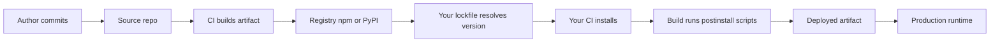

# Supply chain and dependency security

## Why this matters

It's a Tuesday afternoon. CI is green, the build deploys, and twenty minutes later your error tracker lights up with outbound connections to a domain nobody on the team recognizes. You bisect. The culprit isn't your code. A transitive dependency four levels down — something you never typed into a `package.json` — published a patch release overnight. The patch added a postinstall script that read environment variables and POSTed them to an attacker's collector. Your CI runner had your npm token, your cloud credentials, and a deploy key in its environment. All three are now compromised.

This is not hypothetical. It is the shape of `event-stream` (2018), the `ua-parser-js` hijack (2021), the `node-ipc` protestware sabotage (2022), and a steady stream of crypto-stealer packages on npm and PyPI. The common thread: the malicious code arrived through a dependency you trusted transitively, executed in an environment you trusted implicitly, and exfiltrated secrets you forgot were even there. A modern web app pulls in hundreds to thousands of packages. You wrote a few dozen of them. The rest you are running on faith.

The uncomfortable truth is that `npm install` is remote code execution by design. So is `pip install`, `cargo build` with build scripts, and every Docker `FROM`. The supply chain is the largest attack surface most teams have, and the one they audit least. This chapter is about shrinking that surface: knowing what you actually depend on, proving it hasn't been tampered with, and making your build pipeline a control point instead of a blind spot. The engineers who treat dependencies as free live one bad `npm install` away from a breach. The ones who treat the supply chain as adversarial sleep better.

## Mental model

A supply chain attack succeeds by injecting malicious code at any link between an author's keyboard and your running process. There are more links than people expect:



Every arrow is an attack point. A stolen registry credential compromises the `Registry` node. A compromised CI for the upstream project poisons `CI builds`. A name you fat-fingered hijacks `Your lockfile resolves`. The defenses map onto the same diagram: **integrity** (lockfiles, signed artifacts) protects the arrows; **provenance** (SBOMs, attestations) tells you what each node actually is; and **isolation** (sandboxed builds, scoped tokens) limits the blast radius when a node is compromised anyway.

Two threat classes deserve names because they exploit the *resolution* step specifically:

- **Typosquatting**: the attacker publishes `reqeusts`, `loadsh`, `python-sqlite`, `crossenv` — names a tired developer types or a careless LLM hallucinates. The package looks legitimate and may even re-export the real one so nothing breaks while it steals.
- **Dependency confusion** (Alex Birsan's 2021 research): your private package `@acme/auth-utils` exists only on your internal registry. An attacker publishes a *public* package with the same name and a higher version number. Many installers, when configured to check both registries, prefer the higher version — and pull the attacker's code into your build.

Hold one idea above all: **a dependency is code you run with your full privileges, authored by someone you've never met, updated without your review.** Every control in this chapter is a way to claw back some of that trust deficit.

## In practice

### Pin everything: the lockfile is the contract

Your manifest (`package.json`, `pyproject.toml`) declares *ranges*. Your lockfile records *exact resolved versions plus content hashes*. The manifest is intent; the lockfile is the contract. Here is the vulnerable pattern — a caret range with no committed lockfile:

```json
{
  "dependencies": {
    "left-pad": "^1.3.0"
  }
}
```

With `^1.3.0` and no lockfile, every `npm install` is free to resolve a *different* version than the one you tested. If `1.3.1` is published with malware at 2am, your next CI run pulls it silently. The fix is twofold: commit the lockfile, and in CI install from the lockfile *exactly*, refusing to mutate it.

```bash
# WRONG in CI: may update the lockfile, may resolve new versions
npm install

# RIGHT in CI: fails if package.json and lockfile disagree,
# installs exact pinned versions, never writes the lockfile
npm ci
```

The Python equivalents:

```bash
# pip with a fully hashed requirements file
pip install --require-hashes -r requirements.txt

# Poetry / uv: commit poetry.lock / uv.lock and install --frozen
uv sync --frozen
```

A lockfile entry carries the integrity hash that makes tampering detectable. The `integrity` value below is illustrative — your real lockfile will carry the actual SRI hash for the published tarball:

```json
"node_modules/left-pad": {
  "version": "1.3.0",
  "resolved": "https://registry.npmjs.org/left-pad/-/left-pad-1.3.0.tgz",
  "integrity": "sha512-<SRI-hash-of-the-published-tarball>"
}
```

If the bytes at `resolved` ever change, the `integrity` SRI hash won't match and the install aborts. This is your first and cheapest line of defense, and it costs nothing but discipline. (For the deeper question of *which* ranges to allow and when auto-upgrades are safe, see the semver chapter in Part 5 — caret ranges plus `npm audit fix --force` is exactly how teams get auto-upgraded into a compromised release.)

### Defend against dependency confusion

The confusion attack hinges on the installer being willing to fetch a private name from a public registry. Close that door explicitly. Scope your private packages and pin the scope to your registry:

```ini
# .npmrc — bind the @acme scope to the internal registry, not npmjs.org
@acme:registry=https://npm.internal.acme.com/
//npm.internal.acme.com/:_authToken=${NPM_TOKEN}
```

Now `@acme/auth-utils` can *only* come from your registry; a public package of that name is never consulted. For Python, set the index explicitly and disable the implicit fallback:

```ini
# pip.conf — single source of truth, no silent fallback to PyPI
[global]
index-url = https://pypi.internal.acme.com/simple/
```

The anti-pattern to avoid is `extra-index-url` (pip) or mixing registries without scoping (npm): when two indexes can both answer a name, the installer's version-preference logic becomes the attacker's lever. The safest posture is one authoritative index per scope, with internal mirrors proxying public packages so that even your "public" dependencies flow through a registry you control and can quarantine.

### Generate and consume an SBOM

A Software Bill of Materials is the ingredient list for your artifact: every component, its version, and ideally its hash and license. You can't audit what you can't see. Generate one in CI with a standard format (CycloneDX or SPDX):

```bash
# Generate a CycloneDX SBOM from the installed dependency tree
npx @cyclonedx/cyclonedx-npm --output-file sbom.json

# Or language-agnostic, scanning the filesystem / image
syft packages dir:. -o spdx-json > sbom.spdx.json

# Then scan the SBOM against known-vulnerability databases
grype sbom:sbom.spdx.json --fail-on high
```

The SBOM is what lets you answer "are we affected by this CVE?" in seconds instead of days — the exact question every team scrambled to answer during Log4Shell. Store it as a build artifact and attach it to releases. An SBOM produced *after* the build, from the actually-installed tree, is far more trustworthy than one derived from your manifest, because it reflects the versions that truly resolved rather than the ranges you asked for.

### Verify provenance with signed artifacts

A hash proves bytes didn't change in transit. It does not prove *who* produced them or *how*. Signing closes that gap. Sigstore's `cosign` lets you sign artifacts and container images using short-lived, keyless certificates tied to an OIDC identity (a GitHub Actions workload, say) with a public transparency log:

```bash
# Keyless sign a container image, identity comes from CI's OIDC token
cosign sign ghcr.io/acme/api@sha256:<digest>

# At deploy time, verify it was signed by *our* CI workflow and no one else
cosign verify \
  --certificate-identity-regexp 'https://github.com/acme/.+/.github/workflows/release.yml@refs/tags/.+' \
  --certificate-oidc-issuer https://token.actions.githubusercontent.com \
  ghcr.io/acme/api@sha256:<digest>
```

The verification step is the one with teeth: an admission controller or deploy gate that runs `cosign verify` will refuse to launch any image not signed by your own release pipeline. An attacker who pushes a malicious image to your registry can't forge the signature without compromising your CI identity itself.

The same idea, formalized, is **SLSA** (Supply-chain Levels for Software Artifacts), a framework for build provenance: at higher levels your build system emits a signed attestation describing exactly which source commit and build steps produced the artifact, so a tampered build is detectable.

### Treat CI as the crown jewels

Your build pipeline has, in one place, the credentials to publish packages, push images, and deploy to production. It also executes arbitrary code from every dependency via install scripts. That combination is why CI is the highest-value target in the chain.

```yaml
# .github/workflows/release.yml — hardening highlights
permissions:
  contents: read          # least privilege: default to read-only
  id-token: write         # only what cosign keyless / OIDC needs

jobs:
  build:
    runs-on: ubuntu-latest
    steps:
      # Pin actions by full commit SHA, never by mutable tag like @v4.
      # Resolve the SHA for the version you intend, then pin to it.
      - uses: actions/checkout@<full-commit-sha>   # pinned, replaces @v4
      - uses: actions/setup-node@<full-commit-sha> # pinned, replaces @v4
        with:
          node-version: 20
      # Disable lifecycle scripts during install to neuter postinstall RCE
      - run: npm ci --ignore-scripts
```

Two non-obvious controls there. **Pinning third-party Actions by commit SHA** means a compromised maintainer republishing `v4` can't silently change what runs in your pipeline — `@v4` is a moving tag, a SHA is immutable (the same lesson as the Git internals chapter: tags can move, hashes can't). **`--ignore-scripts`** removes the single most common malware execution path; you re-enable scripts only for the specific trusted packages that genuinely need a native build step.

## Pitfalls and anti-patterns

**1. The uncommitted or regenerated lockfile.** Recognize it when CI runs `npm install` (not `npm ci`), or when the lockfile is in `.gitignore`, or when builds are not reproducible across machines. The dependency tree your reviewer approved is not the one production runs. Fix: commit the lockfile, run `npm ci` / `uv sync --frozen` / `pip --require-hashes` in CI, and fail the build if the lockfile would change.

**2. `npm audit fix --force` as a reflex.** Recognize it in a cron job or a "fix vulnerabilities" PR that bumps dozens of packages across major versions unattended. You are auto-applying upgrades you haven't reviewed — the exact mechanism by which a freshly-compromised release reaches production. Fix: treat audit output as a prioritized worklist, not an auto-merge trigger. Pin, review the diff, and let upgrades soak before they hit `main`.

**3. Trusting install-time and build-time scripts implicitly.** Recognize it when a postinstall hook does network I/O or reads secrets, or when nobody can say what `node-gyp`-adjacent steps actually run. Install scripts are arbitrary code executing with your CI's privileges. Fix: `npm ci --ignore-scripts` by default, allowlist the few packages that need scripts, and run installs in a sandbox with no production credentials in the environment.

**4. Mutable references everywhere.** Recognize it as `FROM node:latest`, `uses: some/action@main`, or floating `:latest` image tags in deploy manifests. A "reference" that can change underneath you is an open invitation to swap code post-review. Fix: pin Docker images by digest (`FROM node:20@sha256:...`), pin Actions by commit SHA, and pin deploys to immutable image digests.

**5. Over-privileged, long-lived CI tokens.** Recognize it as a single npm/registry token with publish rights stored as a static secret, reused across every job. One leaked log line and an attacker can publish to your namespace. Fix: scope tokens to the narrowest registry path, prefer short-lived OIDC-federated credentials over static secrets, and grant `write` permissions only to the specific job that publishes.

## Production checklist

- [ ] Lockfile committed for every project; CI installs with `npm ci` / `uv sync --frozen` / `pip --require-hashes`
- [ ] CI fails the build if the lockfile would be modified during install
- [ ] Private package names are scoped and bound to the internal registry in `.npmrc` / `pip.conf`; no public fallback for private scopes
- [ ] `npm ci --ignore-scripts` (or equivalent) by default; lifecycle scripts allowlisted per-package
- [ ] Third-party CI Actions pinned by full commit SHA, not mutable tags
- [ ] Container base images pinned by digest; deploys reference immutable image digests
- [ ] SBOM (CycloneDX or SPDX) generated per release and stored as an artifact
- [ ] Vulnerability scan (`grype`, `osv-scanner`, `npm audit`) runs in CI with a failing severity gate
- [ ] Release artifacts and images signed with `cosign`; deploy gate verifies signature and signer identity
- [ ] CI workflows declare least-privilege `permissions`; publish credentials are short-lived OIDC, scoped to the publishing job
- [ ] No production credentials present in the environment during dependency installation
- [ ] Automated dependency PRs (Dependabot/Renovate) require human review; no unattended `--force` upgrades

## Exercises

1. **(Comprehension)** Take any project with a `package-lock.json`. Find a single dependency entry and explain each field: `version`, `resolved`, and `integrity`. Describe precisely what happens during `npm ci` if an attacker republishes that exact version with one byte changed, and which field catches it.

2. **(Applied)** Reproduce a dependency-confusion setup safely on your own machine. Create a private-scoped package `@yourname/internal-lib` and a local registry (e.g. Verdaccio). Misconfigure `.npmrc` with an unscoped public fallback, observe how a higher public version would be preferred, then fix the config so the private scope is bound exclusively to the local registry. Document the before/after install resolution.

3. **(Design)** Design a build-provenance gate for a team shipping container images to production. Specify: what gets signed and when, which identity signs it, where the verification happens (admission controller, deploy step, or both), how you handle the break-glass case when the signing service is down, and how you'd detect an image that reached the registry without a valid attestation. State your SLSA target level and justify the tradeoff against developer friction.

## Further reading

- Alex Birsan, ["Dependency Confusion: How I Hacked Into Apple, Microsoft and Dozens of Other Companies"](https://medium.com/@alex.birsan/dependency-confusion-4a5d60fec610) — the original research that named the attack class
- [SLSA: Supply-chain Levels for Software Artifacts](https://slsa.dev/) — the canonical framework for build integrity and provenance levels
- [Sigstore documentation](https://docs.sigstore.dev/) and the `cosign` reference — keyless signing and the transparency-log model
- [CycloneDX](https://cyclonedx.org/) and [SPDX](https://spdx.dev/) — the two standard SBOM formats; read the spec for the format you'll adopt
- NIST SP 800-218, [Secure Software Development Framework (SSDF)](https://csrc.nist.gov/pubs/sp/800/218/final) — the provenance and integrity practices regulators increasingly expect
- [OpenSSF Scorecard](https://github.com/ossf/scorecard) — automated checks for the security posture of a dependency before you adopt it

> **Connect the dots:** The "pin by immutable hash, never by a mutable name" principle here is the same one from the Git internals chapter (Part 3) — branches and tags move, content hashes don't. It reappears in container image digests (Part 8) and in the lockfile integrity SRI hashes above. Learn it once as content-addressing and it secures three different layers of your stack.

> **Security note:** Defense-in-depth means assuming a malicious package will eventually run despite every control above. Add a runtime layer the build pipeline can't provide: egress filtering on production and CI hosts so an exfiltration attempt to an unknown domain fails at the network even when the code executes, and seccomp/AppArmor profiles that deny dependencies the syscalls they have no business making. Pair that with anomaly detection on package publish events — a new maintainer, a sudden postinstall script, or a version that skips ahead are signals worth quarantining a release on before it ever reaches a developer's machine. The strongest supply-chain programs assume the artifact will misbehave and constrain what "misbehaving" can accomplish.
