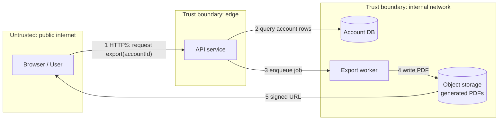

# Threat modeling and compliance touchpoints

## Why this matters

It's a Tuesday afternoon. Your team is two weeks from shipping a feature that lets users export their account history as a PDF. The code works, the tests pass, the demo looked great. Then someone in the standup asks a question nobody had written down: "When user A requests their export, what stops them from passing user B's account ID in the URL?" Silence. You check. Nothing stops them. The endpoint trusts the `accountId` query parameter and never checks it against the session. You just found an IDOR — insecure direct object reference — that would have leaked every customer's financial history to anyone who could increment an integer.

The fix is two lines. The expensive part is that nobody asked the question until late, by accident, in a meeting. A threat model is the practice of asking that question on purpose, early, on a whiteboard, before the code exists. It costs an hour. The IDOR you find on the whiteboard costs an hour to design out. The same IDOR found by a security researcher costs a disclosure email, an incident, and possibly a breach notification under GDPR Article 33 with a 72-hour clock attached.

This chapter is about two linked disciplines. The first is threat modeling: a structured way to enumerate what can go wrong with a feature before you build it, so the answers get designed in rather than bolted on. The second is the compliance reality you meet downstream — SOC 2, GDPR, HIPAA — not as legal abstractions, but as the specific engineering hooks (data classification, audit logs, retention windows, deletion) that auditors and regulators actually inspect. The engineers who treat security as something the security team does live in permanent firefighting mode. The ones who can run a lightweight threat model on their own feature in an afternoon ship things that don't come back to bite them.

## Mental model

Threat modeling answers four questions, in order: What are we building? What can go wrong? What are we going to do about it? Did we do a good job? Adam Shostack's framing in *Threat Modeling: Designing for Security* is the canonical version, and the four-question structure is the part worth memorizing.

The dominant taxonomy for "what can go wrong" is **STRIDE**, a Microsoft mnemonic where each letter is a threat category that maps cleanly to a security property it violates:

| Threat | Violates | Plain-English question |
|---|---|---|
| **S**poofing | Authentication | Can someone pretend to be someone they're not? |
| **T**ampering | Integrity | Can someone modify data they shouldn't? |
| **R**epudiation | Non-repudiation | Can someone deny doing a thing, and can we prove otherwise? |
| **I**nformation disclosure | Confidentiality | Can someone read data they shouldn't? |
| **D**enial of service | Availability | Can someone make the system unusable? |
| **E**levation of privilege | Authorization | Can someone gain rights they shouldn't have? |

The structural artifact that makes STRIDE concrete is the **data-flow diagram** (DFD). You draw the external entities, processes, data stores, and the flows between them, and then you draw **trust boundaries** — the lines where data crosses from a context you control less into one you control more (or vice versa). Threats cluster on trust boundaries. Every arrow that crosses a boundary is a place to walk the STRIDE letters.



Read that diagram with STRIDE in hand. Flow 1 crosses from the public internet into your edge: spoofing (is the session real?), elevation of privilege (does this session own that `accountId`? — the IDOR from the opening), denial of service (can someone enqueue a million exports?). Flow 5 hands a file back across the boundary: information disclosure (is the signed URL scoped, time-limited, single-account?). The boundaries tell you where to look. STRIDE tells you what to look for.

The third tool, **attack trees**, is for going deep on a single goal rather than broad across a system. You put the attacker's goal at the root and decompose it into AND/OR subgoals. "Read another user's export" might branch into "guess the signed URL" OR "exploit the IDOR" OR "compromise the worker's storage credentials." Attack trees are heavier; reach for them on the two or three flows that matter most, not the whole diagram.

## In practice

### Running a lightweight threat model on a real feature

You do not need a week or a specialized tool. For most features, a 60-to-90-minute session with the people who'll build it and one sheet of structure is enough. Here's the structure, applied to the PDF export feature above.

**Step 1 — Draw the DFD and mark the boundaries.** Whiteboard or the Mermaid block above. The only thing that matters is that every data store, process, and crossing is on the page. The act of drawing surfaces the question "wait, who can call this?" reliably.

**Step 2 — Walk STRIDE on each boundary-crossing flow.** Capture findings in a flat table. Don't over-formalize; rows you can act on beat a polished document.

| # | Flow | STRIDE | Threat | Mitigation | Status |
|---|---|---|---|---|---|
| 1 | Request export | E (priv) | Caller requests another user's `accountId` (IDOR) | Authorize `accountId` against session, server-side | Must-fix |
| 2 | Request export | D (DoS) | Unbounded export jobs exhaust workers | Per-user rate limit + queue depth cap | Must-fix |
| 3 | Signed URL | I (disclosure) | URL is guessable or long-lived | Short expiry, high-entropy random key, scoped to one object | Must-fix |
| 4 | PDF in storage | I (disclosure) | Bucket readable cross-tenant | Per-tenant prefix + IAM, no public ACL | Must-fix |
| 5 | Export contents | R (repudiation) | No record of who exported what, when | Append export event to audit log | Should-fix |

**Step 3 — Decide and assign.** Each row gets an owner and a status (must-fix before ship, should-fix, accepted-risk-with-reason). "Accepted risk" is a legitimate outcome as long as it's *written down* with a rationale and a name attached. Undocumented accepted risk is just an undiscovered incident.

Here's the IDOR fix from row 1. The vulnerable version first:

```typescript
// VULNERABLE: trusts the caller-supplied accountId
app.get("/exports", async (req, res) => {
  const accountId = req.query.accountId as string;
  const rows = await db.account.history(accountId); // no ownership check
  const job = await exportQueue.enqueue({ accountId });
  res.json({ jobId: job.id });
});
```

The fix is to never trust an identifier the client can choose. Derive the account from the authenticated session, or verify ownership explicitly:

```typescript
// FIXED: authorize the resource against the authenticated principal
app.get("/exports", requireAuth, rateLimit({ perUser: 5, per: "hour" }), async (req, res) => {
  const accountId = req.query.accountId as string;

  // Authorization, not just authentication: does THIS user own THIS account?
  if (!(await authz.canAccessAccount(req.user.id, accountId))) {
    return res.status(404).json({ error: "not_found" }); // 404, not 403: don't confirm existence
  }

  const job = await exportQueue.enqueue({ accountId, requestedBy: req.user.id });
  await audit.record({
    actor: req.user.id, action: "export.requested",
    resource: `account:${accountId}`, at: new Date().toISOString(),
  });
  res.json({ jobId: job.id });
});
```

Two details worth their own mention. Returning `404` rather than `403` on an authorization failure avoids confirming that the resource exists — a small information-disclosure hardening. And the `audit.record` call is where threat modeling meets compliance: the repudiation mitigation (row 5) is the same line of code an auditor will ask for.

### From threats to compliance touchpoints

Most of what compliance frameworks ask of engineers reduces to a handful of concrete capabilities. The frameworks differ in scope and legal force, but the engineering hooks overlap heavily.

**Data classification.** You cannot protect data you haven't categorized. Every framework assumes you know which fields are sensitive. The practical move is to tag data at the schema or type level so policy can be enforced mechanically rather than remembered.

```python
from enum import Enum
from dataclasses import dataclass

class Sensitivity(Enum):
    PUBLIC = "public"
    INTERNAL = "internal"
    PII = "pii"          # GDPR personal data: name, email, IP
    PHI = "phi"          # HIPAA protected health info
    SECRET = "secret"    # credentials, keys

@dataclass
class Field:
    name: str
    sensitivity: Sensitivity
    # retention in days; None = retain per business rule, 0 = don't persist
    retention_days: int | None = None

# Retention windows below are illustrative — set them from your own
# legal/compliance review, not from these placeholder values.
USER_SCHEMA = [
    Field("id", Sensitivity.INTERNAL),
    Field("email", Sensitivity.PII, retention_days=None),
    Field("diagnosis_code", Sensitivity.PHI, retention_days=2190),  # placeholder window
    Field("session_token", Sensitivity.SECRET, retention_days=0),
]
```

Once classification is data rather than tribal knowledge, you can drive log redaction, encryption-at-rest decisions, retention jobs, and access reviews from one source of truth.

**Audit logs.** SOC 2 (Trust Services Criteria, the Common Criteria around logging and monitoring) and HIPAA (the audit controls standard, 45 CFR 164.312(b)) both require a tamper-evident record of who did what to sensitive data. The engineering requirements that actually get tested: logs are append-only, they capture actor / action / resource / timestamp / outcome, they don't themselves leak the sensitive payload, and they're retained long enough.

```python
from datetime import datetime, timezone

def record(actor: str, action: str, resource: str, outcome: str = "success"):
    entry = {
        "actor": actor, "action": action, "resource": resource,
        "outcome": outcome, "at": datetime.now(timezone.utc).isoformat(),
    }
    # Append-only sink (e.g., WORM bucket / managed log store), NOT the app DB
    # the app can also delete from. Never log the sensitive value itself.
    audit_sink.append(entry)
```

The classic mistake is writing audit events to the same database table the application can `UPDATE` and `DELETE`. If the audited system can rewrite its own audit trail, it isn't an audit trail. Ship audit events to a separate, append-only, restricted-access store.

**Retention and the right to deletion.** GDPR Article 17 (right to erasure) and Article 5(1)(e) (storage limitation) mean personal data has a lifecycle that ends. HIPAA, by contrast, often *requires* you to keep records for years. These tensions are real and they collide: a deletion request for a patient may legally conflict with a retention obligation, and the resolution is usually to delete what you can and document the legal basis for what you must keep.

The engineering pattern that handles deletion sanely is **crypto-shredding**: encrypt each subject's data with a per-subject key, and to "delete" them, destroy the key. The ciphertext remains in backups you can't selectively edit, but it's permanently unreadable.

```python
def erase_subject(subject_id: str):
    # 1. Hard-delete from primary stores where feasible
    db.delete_subject_rows(subject_id)
    # 2. Crypto-shred: destroy the per-subject data key in the KMS.
    #    Backups/immutable logs now hold unrecoverable ciphertext.
    kms.schedule_key_deletion(f"subject-data-key:{subject_id}")
    # 3. Record the erasure itself (the audit log keeps the EVENT, not the data)
    audit.record(actor="system", action="gdpr.erasure",
                 resource=f"subject:{subject_id}")
    # 4. Propagate to downstream processors (analytics, warehouse, search index)
    erasure_bus.publish(subject_id)
```

Step 4 is the one teams forget. Personal data is rarely in one place. If you copy users into a data warehouse, a search index, and an analytics pipeline, an erasure request has to reach all of them, which is far easier if you built a deletion fan-out from the start than if you bolt it on under GDPR's roughly one-month response deadline.

## Pitfalls and anti-patterns

**Threat modeling theater.** A team produces a long, polished threat model document, files it in a wiki, and never looks at it again; the code ships unchanged. You recognize it when the document has no owners, no statuses, and no link to actual tickets. Fix it by keeping the artifact small and *actionable*: a findings table where every row is either fixed, ticketed, or an explicitly-accepted risk with a name attached. The document is a byproduct; the design changes are the point.

**Modeling the system you wish you had.** The DFD shows a clean architecture, but the real system has an undocumented admin endpoint, a legacy cron job with database superuser credentials, and a "temporary" debug route nobody owns. Threats live in exactly those undrawn flows. Recognize it when the diagram is suspiciously tidy. Fix it by drawing from reality — pull the actual routes, the actual IAM policies, the actual data stores — not from the architecture slide.

**Authentication mistaken for authorization.** The opening IDOR is this pattern: the endpoint checked that *someone* was logged in (authentication) but never that *this* someone was allowed to touch *that* resource (authorization). Recognize it whenever a request contains a resource identifier the caller can choose — IDs, filenames, account numbers in URLs or bodies. Fix it by authorizing every resource access against the authenticated principal, server-side, on every request. (Part 10's AuthN/AuthZ chapter goes deep on the policy models that make this systematic.)

**Compliance as a one-time event.** The team scrambles before the SOC 2 audit, screenshots some dashboards, and exhales. Then drift sets in: a new service ships without audit logging, a retention job silently fails, an over-broad IAM role gets added. SOC 2 Type II specifically tests controls *over a period*, not at a moment. Recognize it when compliance work is calendar-driven rather than continuous. Fix it by encoding controls as code and tests — automated checks that audit logging is wired up, that retention jobs ran, that no bucket is public — so the audit is a report on a healthy system rather than a fire drill.

**The mutable audit log.** Audit events written to a table the application can update or delete. Recognize it by asking "if an attacker gets app-level DB access, can they erase their tracks?" — if yes, it's not an audit trail. Fix it by sending audit events to an append-only, separately-permissioned sink (a WORM-configured object store, a managed immutable log service) that the application's runtime credentials cannot mutate.

## Production checklist

- [ ] Every new feature with a trust boundary gets a lightweight threat model (DFD + STRIDE table) before implementation, not after
- [ ] The DFD is drawn from the real system (actual routes, IAM, data stores), not the architecture diagram
- [ ] Every boundary-crossing flow has been walked through all six STRIDE letters
- [ ] Each threat has a status: fixed, ticketed, or accepted-risk-with-named-owner-and-rationale
- [ ] Every resource access is authorized against the authenticated principal server-side (no client-chosen IDs trusted)
- [ ] Sensitive data is classified at the schema/type level (PII / PHI / secret), not by memory
- [ ] Audit logs capture actor / action / resource / timestamp / outcome and go to an append-only, separately-permissioned sink
- [ ] Audit logs never contain the sensitive payload itself (no passwords, tokens, full PII in log lines)
- [ ] Retention windows are defined per data class and enforced by an automated job that alerts on failure
- [ ] A deletion path exists and fans out to every downstream copy (warehouse, search index, analytics, backups via crypto-shredding)
- [ ] Compliance controls are encoded as automated tests/checks, not assembled manually before an audit

## Exercises

1. **(Comprehension)** Take the data-flow diagram in the Mental model section and walk STRIDE across flow 5 (the signed URL handed back to the user). List one concrete, plausible threat for at least four of the six STRIDE categories, and name the mitigation you'd apply for each.

2. **(Applied)** Pick a real endpoint in a service you work on that accepts a resource identifier in the path, query, or body. Write a failing test that requests a resource belonging to a *different* user with a valid session, and assert the response is `404`/`403`. If the test passes (the IDOR exists), implement the authorization check and the audit log entry, then confirm the test goes red-to-green.

3. **(Design)** Your product stores user records in Postgres, replicates them to a Snowflake warehouse for analytics, indexes a subset in Elasticsearch for search, and includes them in nightly encrypted backups. A user invokes their GDPR right to erasure. Design the end-to-end deletion flow: what gets hard-deleted, what gets crypto-shredded, how the request fans out to each store, how you handle the backup window, and what you record in the audit log. Identify where a HIPAA retention obligation could conflict and how you'd resolve it.

## Further reading

- Adam Shostack, *Threat Modeling: Designing for Security* (Wiley, 2014) — the four-question framework and the definitive treatment of STRIDE and DFDs
- Microsoft, "The STRIDE Threat Model" — the original taxonomy and its mapping to security properties (https://learn.microsoft.com/en-us/azure/security/develop/threat-modeling-tool-threats)
- OWASP, "Threat Modeling Process" and the Threat Modeling Cheat Sheet (https://owasp.org/www-community/Threat_Modeling)
- Regulation (EU) 2016/679 (GDPR) — read Articles 5, 17, 30, and 33 directly; they are shorter and clearer than most summaries (https://eur-lex.europa.eu/eli/reg/2016/679/oj)
- HIPAA Security Rule, 45 CFR Part 164 Subpart C — the administrative, physical, and technical safeguards (https://www.ecfr.gov/current/title-45/subtitle-A/subchapter-C/part-164)
- AICPA, Trust Services Criteria (the basis for SOC 2) — the control criteria auditors actually test (https://www.aicpa-cima.com/resources/landing/system-and-organization-controls-soc-suite-of-services)

> **Connect the dots:** Threat modeling is where this Part stops being a list of attacks and becomes a habit. The DFD you draw here is the same artifact that drives the secrets-management decisions of Part 10's vaults chapter (which flows carry credentials?) and the supply-chain analysis (which processes run third-party code?). And the audit-log sink you wire up connects straight to the observability and event-streaming patterns of the data and platform Parts — an audit log is just an event log with stricter integrity requirements.

> **Security note:** Threat modeling is a snapshot of a moving target. The model you build today assumes a fixed set of components and trust boundaries, but systems mutate — a new microservice, a third-party SDK, an LLM call added to a request path quietly redraws your boundaries and invents new flows you never STRIDE'd. Treat the threat model as a living document tied to architecture change: any pull request that adds a new external dependency, a new data store, or a new trust boundary should trigger a re-walk of the affected flows. The most dangerous threat is the one introduced by a change that nobody recognized as security-relevant.
