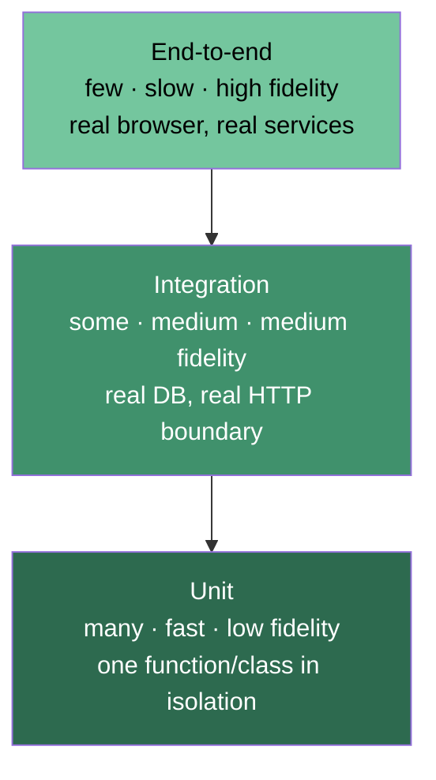

# The test pyramid, revisited

## Why this matters

It's a Tuesday afternoon and the checkout service just charged a customer twice. The on-call engineer pulls up the dashboard: 412 unit tests green, 38 integration tests green, the deploy went out clean an hour ago. Coverage is 94%. And yet the bug is real, reproducible, and sitting in a Stripe webhook handler that every test in the suite "covered."

When she opens the test file, the cause is obvious in about ninety seconds. The handler's test mocks the payment client, mocks the database, mocks the idempotency-key store, and asserts that `paymentClient.charge` was called once. It passes because the test built a world where charging twice is impossible — the mock doesn't track state. The production code increments a retry counter, re-enters the handler on a webhook redelivery, and charges again because the real idempotency store was never exercised. The test verified that the code calls the functions the author expected. It never verified that the system does the right thing.

This is the central problem of testing, and it has nothing to do with how many tests you have. A suite can be enormous, fast, and green while the system is broken, because every test was written against the author's mental model rather than against reality. The test pyramid is the oldest answer to "how do I spend my testing budget so the green checkmark actually means something" — and it's worth revisiting in 2026 because the advice has fractured into camps (pyramid, trophy, honeycomb) that mostly agree once you strip away the slogans. This chapter is about what each layer of test actually catches, what it costs, and how to choose doubles so your tests fail when the system is broken and only then.

## Mental model

Three things vary across the layers of a test suite, and they trade off against each other: **scope** (how much of the system runs), **speed** (how fast the test gives feedback), and **fidelity** (how closely the test resembles production). You cannot maximize all three. A unit test is fast and narrow and low-fidelity; an end-to-end test is slow and broad and high-fidelity.

The classic pyramid (Mike Cohn, *Succeeding with Agile*, 2009) says: write many fast narrow tests at the bottom, fewer as you go up, very few slow broad ones at the top.



The reasoning is economic. A failing unit test points at one function; a failing end-to-end test could be anything from a CSS change to a database migration, and it takes minutes to run and re-run while you bisect. So you push as much coverage as possible down to the cheap, precise layer.

The **testing trophy** (Kent C. Dodds, 2018) pushes back: for application code — especially front-end and glue code that mostly wires libraries together — unit tests of individual functions are low-value because the bugs live in the *integration* between units, not inside them. The trophy puts the largest band at the integration layer, with a thin static-analysis foundation underneath and a small E2E cap on top. His slogan is "write tests that resemble the way your software is used." The **honeycomb** (a model popularized in Spotify's engineering writing) makes a parallel argument for microservice backends: the cells that matter most are integrated tests of a single service against its real adjacent dependencies, with thin slivers for isolated-unit and full-system tests on either side. All three shapes are arguing about the same thing — *which layer holds your service's real bugs* — and disagreeing only because they're picturing different kinds of code.

Both are right about different code. Algorithmic code (a pricing engine, a parser, a permission resolver) has real logic inside the units and deserves dense unit tests. Glue code (a React form, a CRUD controller) has its bugs at the seams and deserves integration tests. The honest synthesis: **don't pick a shape, pick a target per module based on where that module's bugs actually live.** The pyramid is a default, not a law.

Underneath all of this sits the question of *test doubles* — the stand-ins you use when the real dependency is slow, non-deterministic, or has side effects. Gerard Meszaros gave us the taxonomy in *xUnit Test Patterns* (2007), and the distinctions matter:

| Double | What it does | Verifies |
|---|---|---|
| **Stub** | Returns canned answers to calls | State (what the code does with the answer) |
| **Fake** | A real, lightweight implementation (in-memory DB, in-memory queue) | State, with real behavior |
| **Mock** | Records calls; you assert it was called a certain way | Interaction (that a call happened) |
| **Spy** | A wrapper that records calls but delegates to the real thing | Interaction, with real side effects |

The double you reach for decides what your test can catch. Mocks verify *that you called something*. Fakes verify *that calling it produced the right result*. The double-charge bug above is what happens when you mock something that should have been a fake.

There's a deeper reason mocks lie so easily: a mock is code the test author wrote, and it encodes only the behavior the author thought to encode. It cannot enforce an invariant the author didn't anticipate, cannot drift out of sync when the real dependency changes its contract, and cannot fail in the surprising way production does. A fake or a real container, by contrast, has its own behavior that the author does not fully control — which is precisely why it can contradict the author's assumptions and catch the bug. The amount of truth a test can tell is bounded by how much of its world is real rather than authored.

## In practice

### A unit test that earns its place

Unit tests pay off when there is logic worth isolating. Here's a permission resolver — real branching, real edge cases — tested with Vitest:

```typescript
// permissions.ts
type Role = "viewer" | "editor" | "admin";

export function canEdit(role: Role, resourceOwnerId: string, userId: string): boolean {
  if (role === "admin") return true;
  if (role === "editor") return true;
  if (role === "viewer") return resourceOwnerId === userId; // owners can edit their own
  return false;
}
```

```typescript
// permissions.test.ts
import { describe, it, expect } from "vitest";
import { canEdit } from "./permissions";

describe("canEdit", () => {
  it("lets admins edit anything", () => {
    expect(canEdit("admin", "owner-1", "user-2")).toBe(true);
  });
  it("lets viewers edit only resources they own", () => {
    expect(canEdit("viewer", "user-1", "user-1")).toBe(true);
    expect(canEdit("viewer", "owner-2", "user-1")).toBe(false);
  });
});
```

No doubles, no I/O, microseconds to run. This is the layer working as designed: pure logic, exhaustively pinned down. If someone adds a `"banned"` role and forgets the resolver, a unit test is the cheapest possible place to catch it.

### The over-mocked test that passes while the system is broken

Now the anti-pattern from the opening, in full. This is the test that was green while customers got double-charged.

```typescript
// charge.test.ts — DO NOT COPY. This is the broken version.
import { describe, it, expect, vi } from "vitest";
import { handleWebhook } from "./charge";

describe("handleWebhook (over-mocked)", () => {
  it("charges the customer", async () => {
    const paymentClient = { charge: vi.fn().mockResolvedValue({ id: "ch_1" }) };
    const idempotencyStore = {
      has: vi.fn().mockResolvedValue(false),   // <-- always says "never seen"
      add: vi.fn().mockResolvedValue(undefined),
    };

    await handleWebhook({ event: "invoice.paid", invoiceId: "inv_9" }, {
      paymentClient, idempotencyStore,
    });

    expect(paymentClient.charge).toHaveBeenCalledOnce();
    expect(paymentClient.charge).toHaveBeenCalledWith("inv_9");
  });
});
```

The test asserts `charge` was called once — and it was, *in this single invocation*. But Stripe redelivers webhooks. The real bug only appears on the second delivery, and the `idempotencyStore` mock hard-codes `has → false`, so it can never represent "I've seen this invoice before." The mock encodes the author's assumption that redelivery won't happen. The test is a mirror of the author's mind, not of production.

Swap the mock for a **fake** — a real, in-memory implementation — and the test starts telling the truth:

```typescript
// A fake: tiny but behaviorally real. Tracks state like the real store.
class InMemoryIdempotencyStore {
  private seen = new Set<string>();
  async has(key: string) { return this.seen.has(key); }
  async add(key: string) { this.seen.add(key); }
}

describe("handleWebhook (with a fake store)", () => {
  it("does not charge twice on webhook redelivery", async () => {
    const paymentClient = { charge: vi.fn().mockResolvedValue({ id: "ch_1" }) };
    const idempotencyStore = new InMemoryIdempotencyStore();
    const event = { event: "invoice.paid", invoiceId: "inv_9" };

    await handleWebhook(event, { paymentClient, idempotencyStore });
    await handleWebhook(event, { paymentClient, idempotencyStore }); // redelivery

    expect(paymentClient.charge).toHaveBeenCalledOnce(); // FAILS on the buggy handler
  });
});
```

Run it against the original handler and it fails — exactly when the system is broken, which is the entire point of a test. The fix in the handler is `if (await idempotencyStore.has(event.invoiceId)) return;` before charging, and then the test goes green for the right reason. The lesson is precise: **mock interactions you don't control (the payment API); fake state you depend on (the idempotency store).** Mocking stateful collaborators is how you build a passing suite over a broken system.

One caveat about fakes, so you don't trade one false sense of security for another: a fake is only trustworthy if it stays behaviorally faithful to the real thing. An in-memory store that is case-sensitive while real Postgres collation is not, or that ignores the `UNIQUE` constraint the production schema enforces, will pass tests that production fails. The discipline that keeps fakes honest is a *shared contract test* — one suite of behavioral assertions run against both the fake and the real implementation, so they cannot silently diverge. When you can't afford to maintain that, skip the fake and reach straight for a real dependency in a container, which is the next section.

### An integration test at the real boundary

The trophy's insight is that the bug above is fundamentally an integration bug — it lives between the handler and its store. The highest-fidelity cheap way to catch it is to run the handler against a real database in a container. With pytest and `testcontainers`:

```python
# test_charge_integration.py
import pytest
from testcontainers.postgres import PostgresContainer
from app.charge import handle_webhook
from app.store import PostgresIdempotencyStore

@pytest.fixture(scope="module")
def db_url():
    with PostgresContainer("postgres:16") as pg:
        yield pg.get_connection_url()

def test_redelivery_does_not_double_charge(db_url):
    store = PostgresIdempotencyStore(db_url)
    store.migrate()
    charges = []
    fake_payment = type("P", (), {"charge": lambda self, inv: charges.append(inv)})()

    event = {"event": "invoice.paid", "invoiceId": "inv_9"}
    handle_webhook(event, payment_client=fake_payment, idempotency_store=store)
    handle_webhook(event, payment_client=fake_payment, idempotency_store=store)

    assert charges == ["inv_9"]  # exactly one charge, verified against real Postgres
```

This runs in seconds, not milliseconds, and it exercises the real SQL — including the `UNIQUE` constraint and the transaction boundary that an in-memory fake can't model. If the idempotency guarantee actually lives in a database constraint rather than application code, only this test can prove it. This is the band the testing trophy wants you to invest in, and for stateful glue code it's the best dollar-for-confidence ratio you'll find.

### An end-to-end test at the top

E2E tests verify the wired-together system through its real interface. With Playwright:

```typescript
import { test, expect } from "@playwright/test";

test("a user can complete checkout once", async ({ page }) => {
  await page.goto("/cart");
  await page.getByRole("button", { name: "Checkout" }).click();
  await page.getByLabel("Card number").fill("4242424242424242");
  await page.getByRole("button", { name: "Pay" }).click();
  await expect(page.getByText("Payment confirmed")).toBeVisible();
});
```

This catches things no lower test can: the button is disabled by a CSS bug, the API route isn't registered, the env var is missing in staging. It also costs the most — slow, flaky under network jitter, expensive to debug. Keep them few and reserve them for the handful of revenue-critical journeys (sign-up, checkout, the one workflow that, if broken, means a phone call at 2am).

### Choosing the ratio

A defensible default for a typical full-stack service: heavy unit coverage on pure logic, a solid band of integration tests at every external boundary (DB, queue, third-party HTTP), and a thin layer of E2E for critical user journeys. Resist exact-number dogma. The right question per module is "where do this module's bugs come from?" — and write the test at the layer that catches that bug while staying as cheap as possible.

Two practical constraints discipline the ratio more honestly than any target percentage. The first is *feedback latency*: the suite a developer runs before pushing has to return in a time short enough that they actually wait for it rather than push and context-switch. When that inner loop creeps past the patience threshold, people stop running it locally and the suite stops protecting the moment that matters most. That pressure naturally caps how many slow tests you can carry. The second is the *flake budget*: every nondeterministic test spends trust, and a suite that cries wolf trains engineers to rerun red builds without reading them — at which point a real failure sails through on the second attempt. Because flakiness rises sharply with scope, the flake budget is itself an argument for keeping the broad, slow layers thin and pushing each assertion to the lowest layer that can still catch its bug.

> **Connect the dots:** The integration-test boundary is exactly where contract testing (Chapter 4 of this Part) takes over: a `testcontainers` test proves *your* code works against a real Postgres, but a Pact contract proves *your service* and *its consumer* still agree on the wire format even when you can't run both in one process. And the in-memory fake pattern here is the same dependency-inversion idea you'll see in Part 6 — depend on an interface, supply a real implementation in production and a fake in tests.

## Pitfalls and anti-patterns

**Mocking what you should fake.** Recognize it when a test mocks a stateful collaborator (a store, a cache, a queue) and hard-codes its return values. The mock then encodes the author's assumptions and can't represent the states that cause bugs (re-entry, redelivery, concurrent access). Fix: write a small in-memory fake that tracks real state, or run an integration test against the real thing in a container. Reserve mocks for collaborators you don't own and can't run (third-party APIs, payment processors).

**Asserting on interactions instead of outcomes (mockists' trap).** Recognize it when tests assert `expect(x.method).toHaveBeenCalledWith(...)` instead of asserting on the result the user or caller observes. These tests pass when you refactor the implementation to do the right thing a different way, and *fail* on harmless internal changes — they couple the test to the code's structure, not its behavior. Fix: assert on return values and observable state. Verify a call happened only when the call itself is the observable effect (e.g., "an email was sent").

**Ice-cream-cone suites.** Recognize it when the slow E2E layer is the biggest band and CI takes far too long, flakes constantly, and developers retry failures instead of reading them. This is the pyramid upside-down. Fix: for each flaky E2E failure, ask "what's the smallest test that would have caught this?" and push the assertion down a layer. Keep E2E for journeys, not for logic.

**Coverage as a goal instead of a signal.** Recognize it when there's a hard coverage gate and PRs add tests that execute code without asserting anything meaningful, just to clear the bar. 94% coverage double-charged the customer in the opening. Fix: treat coverage as a map of *untested* code (the gaps are useful), never as a quality score. Mutation testing (Chapter 3) measures whether tests actually catch bugs; coverage only measures whether lines ran.

**Shared mutable fixtures across tests.** Recognize it when tests pass alone but fail when run together, or pass in one order and fail in another. Usually a fake or a database row is shared and one test's writes leak into another's reads. Fix: build fresh state per test (fresh fake instance, transactional rollback, or a truncate-between-tests strategy), and never rely on test execution order.

> **Security note:** Authorization is the most dangerous thing to over-mock. A test that mocks the auth check and asserts the handler "was called" proves nothing about whether an unauthorized user is actually blocked — the real check never ran. Test authorization at the integration layer with real (test) tokens and real policy evaluation, and add explicit negative tests: a viewer attempting an admin action must get a 403, verified end-to-end through the real middleware. Most broken-access-control vulnerabilities (OWASP A01) pass a green unit suite precisely because the guard was mocked away.

## Production checklist

- [ ] Pure/algorithmic modules have dense unit tests; glue/IO modules lean on integration tests
- [ ] Stateful collaborators (stores, queues, caches) use fakes or real containers, never hard-coded mocks
- [ ] Any in-memory fake is pinned to its real counterpart by a shared contract test so the two can't silently diverge
- [ ] Mocks are reserved for third-party services you don't own and can't run locally
- [ ] Every external boundary (DB, message broker, outbound HTTP) has at least one integration test against the real thing (e.g., `testcontainers`)
- [ ] E2E tests cover only revenue/safety-critical journeys and run in CI on every merge to main
- [ ] Tests assert on observable outcomes (return values, persisted state, emitted events), not on internal call shapes
- [ ] Each test sets up and tears down its own state; the suite passes under randomized order (`vitest --sequence.shuffle`, `pytest -p randomly`)
- [ ] Coverage is reported as a gap-finding signal, not enforced as a quality bar; consider a mutation-testing run on critical modules
- [ ] At least one explicit negative authorization test per protected route, exercised through the real middleware
- [ ] CI test wall-clock is monitored; an upward creep triggers pushing assertions down the pyramid

## Exercises

1. **(Comprehension)** For each of the following, name the test double you'd use (stub, fake, mock, or spy) and justify it in one sentence: (a) a third-party SMS gateway, (b) the application's own Redis-backed rate limiter, (c) a system clock, (d) an analytics event your handler is supposed to emit. Then explain why using a mock for (b) would let a bug through that a fake would catch.

2. **(Applied)** Take the over-mocked `handleWebhook` test from this chapter. First make it pass against a deliberately buggy handler that double-charges. Then rewrite it with the `InMemoryIdempotencyStore` fake and watch it fail. Fix the handler so the fake-based test passes. Finally, add a `testcontainers` integration test that proves the guarantee holds against a real database with a `UNIQUE` constraint — and confirm it catches a handler that relies only on the DB constraint (no app-level check) versus one that checks in app code.

3. **(Design)** You inherit a service with 1,200 unit tests (mostly mocked), 4 integration tests, 0 E2E tests, 91% coverage, and a production incident every other week. You have two engineer-weeks to spend on test quality. Sketch a plan: how do you decide which existing tests to delete, which boundaries to cover with integration tests first, and which one or two E2E journeys to add? Define the metric you'd use to know your two weeks worked — and argue why it isn't coverage.

## Further reading

- Mike Cohn, *Succeeding with Agile* (2009) — the chapter on the test automation pyramid; the original source of the shape.
- Gerard Meszaros, *xUnit Test Patterns: Refactoring Test Code* (2007) — the definitive taxonomy of test doubles (stub, fake, mock, spy, dummy). The vocabulary everyone uses, defined precisely.
- Martin Fowler, ["Mocks Aren't Stubs"](https://martinfowler.com/articles/mocksArentStubs.html) — the clearest treatment of the classicist-vs-mockist split and when interaction testing is appropriate.
- Martin Fowler, ["TestPyramid"](https://martinfowler.com/bliki/TestPyramid.html) — concise modern restatement, including the "ice-cream cone" anti-pattern.
- Kent C. Dodds, ["The Testing Trophy and Testing Classifications"](https://kentcdodds.com/blog/the-testing-trophy-and-testing-classifications) — the counter-argument for integration-heavy suites in application code.
- Google Testing Blog, ["Just Say No to More End-to-End Tests"](https://testing.googleblog.com/2015/04/just-say-no-to-more-end-to-end-tests.html) — the operational case against an E2E-heavy suite, from a team running them at scale.
- [Testcontainers documentation](https://testcontainers.com/) — running real dependencies in throwaway containers for high-fidelity integration tests.
