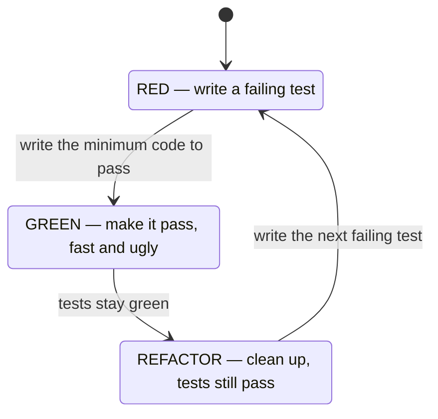

# TDD and BDD

## Why this matters

It's a Tuesday afternoon and you're three commits into a "quick" refactor of the billing module. You renamed a function, threaded a new `currency` argument through four call sites, and pushed. CI goes green. You deploy. Forty minutes later a support ticket lands: a customer in the EU was charged in dollars at a number that looks suspiciously like the euro amount. The conversion never ran. The test suite passed because there was no test that asserted "an EU invoice converts to EUR before charging" — there was a test that asserted `calculateTotal(items)` returns `42`, and it still returned `42`, because you never touched that path.

This is the failure that test-driven development is built to prevent. Not "we forgot to write tests" — you had tests — but "the tests describe the code that exists, not the behavior the business requires." A test written after the fact tends to encode whatever the implementation happens to do. A test written before the code is forced to encode what the code is *supposed* to do, because there is no implementation to copy from yet. The order matters. Writing the assertion first is the entire trick.

The engineers who treat tests as a chore they do after the feature works ship suites that are simultaneously large, slow, and useless — high coverage, low confidence. The ones who let a failing test drive the next line of production code tend to write smaller units, fewer of them, with sharper assertions, and they refactor without fear because the test is a contract they wrote down before they could cheat. This chapter is about that discipline: the red-green-refactor loop, where it genuinely pays off, where it actively wastes your time, and how BDD reframes the same loop in language a product manager can read.

## Mental model

TDD is a loop with three states. You are always in exactly one of them, and you never write production code outside of the "green" transition.



**Red**: write one small test for behavior that does not exist yet, and run it. It must fail, and it must fail for the *right reason* — a missing function, a wrong return value — not a typo in the test or an import error. A test that fails because the file won't compile told you nothing.

**Green**: write the least code that makes the test pass. Not the elegant version. The dumbest thing that works, even hard-coding a return value if that's genuinely all the current tests demand. The point is to get back to a known-good state quickly.

**Refactor**: now that you have a passing test as a safety net, improve the design — extract a function, remove duplication, rename — and rerun the tests after every change. If they stay green, the refactor was behavior-preserving. If one goes red, you broke something and you know exactly which step did it.

The loop is tight on purpose. Kent Beck's framing in *Test-Driven Development: By Example* is that each cycle should be minutes, not hours. The discipline is psychological as much as technical: it keeps you from writing a hundred lines on a hunch and then discovering the hunch was wrong.

BDD (behavior-driven development) is the same loop with the vocabulary moved up a level. Instead of "test that `convert(100, 'USD', 'EUR')` returns `92`," you write "Given an EU customer, When they are invoiced, Then the charge is in EUR." The Given-When-Then structure (Gherkin syntax) is readable by non-engineers, which is the whole point: BDD pushes the *specification* conversation to before the code, with the people who actually know the rules.

## In practice

### One real TDD cycle, start to finish

We'll build a small piece of the billing logic from the opening scenario: a function that applies a currency conversion to an invoice total. TypeScript with Vitest.

**Red.** Write the test first. There is no `convertTotal` yet.

```typescript
// billing.test.ts
import { describe, it, expect } from 'vitest';
import { convertTotal } from './billing';

describe('convertTotal', () => {
  it('converts a USD total to EUR using the given rate', () => {
    expect(convertTotal({ amount: 100, currency: 'USD' }, 'EUR', 0.92))
      .toEqual({ amount: 92, currency: 'EUR' });
  });
});
```

Run it:

```bash
$ npx vitest run
 FAIL  billing.test.ts > convertTotal > converts a USD total to EUR
Error: Failed to resolve import "./billing"
```

That's a *bad* red — it failed on the import, not the assertion. Create the module with a stub so the failure is meaningful:

```typescript
// billing.ts
export function convertTotal(invoice: unknown, target: string, rate: number): unknown {
  throw new Error('not implemented');
}
```

```bash
$ npx vitest run
 FAIL  billing.test.ts > convertTotal > converts a USD total to EUR
Error: not implemented
```

Now it's a *good* red: the test runs, calls the function, and fails because the behavior is missing.

**Green.** Write the minimum to pass.

```typescript
// billing.ts
type Money = { amount: number; currency: string };

export function convertTotal(invoice: Money, target: string, rate: number): Money {
  return { amount: invoice.amount * rate, currency: target };
}
```

```bash
$ npx vitest run
 ✓ billing.test.ts > convertTotal > converts a USD total to EUR
 Test Files  1 passed (1)
```

Green. Resist the urge to add rounding, validation, or multi-currency tables right now — none of that is demanded by a failing test yet.

**Red again.** Drive the next behavior. Floating-point money is a known trap, so assert rounding to cents:

```typescript
  it('rounds to two decimal places', () => {
    expect(convertTotal({ amount: 99.99, currency: 'USD' }, 'EUR', 0.915))
      .toEqual({ amount: 91.49, currency: 'EUR' });
  });
```

`99.99 * 0.915 = 91.49085`, so the naive implementation returns `91.49085` and the test fails. Good red.

**Green.**

```typescript
export function convertTotal(invoice: Money, target: string, rate: number): Money {
  return {
    amount: Math.round(invoice.amount * rate * 100) / 100,
    currency: target,
  };
}
```

Both tests pass.

**Refactor.** The magic number `100` deserves a name, and `Math.round` for money has its own subtleties (banker's rounding, negative amounts) worth isolating. Extract:

```typescript
const CENTS = 100;
const toCents = (n: number) => Math.round(n * CENTS) / CENTS;

export function convertTotal(invoice: Money, target: string, rate: number): Money {
  return { amount: toCents(invoice.amount * rate), currency: target };
}
```

Rerun — still green. The refactor was safe precisely because the tests were already there.

> **Security note:** When you TDD anything involving money, money is the obvious thing to test, but authorization is the easy thing to forget. If `convertTotal` is reachable from an API where the caller supplies the `rate`, your first *red* test should be "a caller cannot pass an arbitrary rate to inflate a refund." TDD-ing the unhappy path — rejected inputs, unauthorized actors, negative amounts — is where the discipline earns its keep, because those are exactly the branches developers skip when writing tests after the fact.

### The pytest equivalent

The same loop in Python looks structurally identical:

```python
# test_billing.py
import pytest
from billing import convert_total

def test_converts_usd_to_eur():
    assert convert_total({"amount": 100, "currency": "USD"}, "EUR", 0.92) == \
        {"amount": 92.0, "currency": "EUR"}

def test_rejects_negative_rate():
    with pytest.raises(ValueError):
        convert_total({"amount": 100, "currency": "USD"}, "EUR", -1)
```

*The same idea in TypeScript:*

```typescript
// billing.test.ts
import { describe, it, expect } from 'vitest';
import { convertTotal } from './billing';

describe('convertTotal', () => {
  it('converts a USD total to EUR', () => {
    expect(convertTotal({ amount: 100, currency: 'USD' }, 'EUR', 0.92))
      .toEqual({ amount: 92, currency: 'EUR' });
  });

  it('rejects a negative rate', () => {
    expect(() => convertTotal({ amount: 100, currency: 'USD' }, 'EUR', -1))
      .toThrow('rate must be non-negative');
  });
});
```

```python
# billing.py
def convert_total(invoice, target, rate):
    if rate < 0:
        raise ValueError("rate must be non-negative")
    return {"amount": round(invoice["amount"] * rate, 2), "currency": target}
```

*In TypeScript:*

```typescript
// billing.ts
type Money = { amount: number; currency: string };

export function convertTotal(invoice: Money, target: string, rate: number): Money {
  if (rate < 0) {
    throw new Error('rate must be non-negative');
  }
  return { amount: Math.round(invoice.amount * rate * 100) / 100, currency: target };
}
```

For real money, neither `Math.round` nor Python's `round` is good enough — use `decimal.Decimal` in Python and a library like `dinero.js` in TypeScript. The point here is the loop, not the rounding strategy.

### BDD and Gherkin

BDD moves the first conversation up a level. The same currency rule, written as an executable specification with Cucumber's Gherkin syntax:

```gherkin
# billing.feature
Feature: Invoice currency conversion
  EU customers must be charged in EUR.

  Scenario: An EU customer is invoiced
    Given a customer in region "EU"
    And an invoice total of 100 USD
    When the invoice is finalized
    Then the customer is charged 92 EUR
```

The `.feature` file is glued to code via step definitions. With `@cucumber/cucumber` in TypeScript:

```typescript
// steps.ts
import { Given, When, Then } from '@cucumber/cucumber';
import { strict as assert } from 'assert';
import { convertTotal } from './billing';

let region: string;
let invoice: { amount: number; currency: string };
let charge: { amount: number; currency: string };

Given('a customer in region {string}', (r: string) => { region = r; });
Given('an invoice total of {int} USD', (n: number) => {
  invoice = { amount: n, currency: 'USD' };
});
When('the invoice is finalized', () => {
  const rate = region === 'EU' ? 0.92 : 1;
  charge = convertTotal(invoice, region === 'EU' ? 'EUR' : 'USD', rate);
});
Then('the customer is charged {int} EUR', (n: number) => {
  assert.equal(charge.amount, n);
  assert.equal(charge.currency, 'EUR');
});
```

The value of this is not the test mechanics — a plain unit test is shorter and faster. The value is that a product manager can read `billing.feature`, confirm "yes, EU means EUR," and catch a wrong rule before any code exists. Use BDD when the *specification itself* is contested or business-owned. Skip it when the spec is obvious to engineers; the Gherkin indirection is pure overhead for testing a sort function.

> **Connect the dots:** TDD operates at the base of the test pyramid from the previous chapter — fast unit tests driving small units. BDD scenarios usually sit higher, at the integration or acceptance layer, which is why they're slower and you want far fewer of them. The pyramid tells you the *ratio*; TDD and BDD tell you the *order* in which to write each layer.

### What TDD is good and bad at

TDD shines when the behavior is specifiable in advance: pure functions, parsers, business rules, state machines, bug fixes (write the failing test that reproduces the bug, *then* fix it — now you have a permanent regression guard). It is poor at exploratory work where you don't yet know what you're building: UI layout, a spike to learn an unfamiliar API, performance tuning where the "assertion" is a profiler graph. Forcing TDD onto a research spike produces tests for code you're about to throw away. Beck's own advice is to spike first to learn, then delete the spike and TDD the real thing.

## Pitfalls and anti-patterns

**Testing the implementation, not the behavior.** A test that asserts "method `_recalculate` was called twice" breaks the moment you refactor internals, even though the observable behavior is unchanged. *Recognize it* when your tests fail on every refactor despite no behavior change, or when they're full of mock assertions about private method calls. *Fix it* by asserting on outputs and observable side effects (return values, persisted rows, emitted events), never on how the answer was computed.

**The fake green — writing the test after the code.** People claim to do TDD but actually write the implementation first and the test second, then watch it pass. The test never failed, so you have no evidence it can fail. *Recognize it* by asking "did you watch this test go red?" — if the answer is no, it's not a tested assertion, it's a hopeful one. *Fix it* by temporarily breaking the production code and confirming the test catches it; in a real cycle the red comes for free.

**Over-mocking until tests assert nothing real.** Mock the database, mock the HTTP client, mock the clock, mock the function under test's collaborators — and now the test verifies that your mocks return what you told them to. *Recognize it* when a test has more lines of mock setup than assertions, or passes while production is broken. *Fix it* by mocking only at true boundaries (network, time, randomness) and using real objects for your own code; prefer a real in-memory database (e.g. SQLite, testcontainers) over a mocked repository.

**Gherkin theater.** Teams adopt Cucumber, write `.feature` files no non-engineer ever reads, and now every test costs a feature file plus step definitions plus glue. *Recognize it* when the people Gherkin was meant to serve (PMs, QA, domain experts) never open the files. *Fix it* by demoting those scenarios to plain unit tests; reserve Gherkin for the handful of business-critical rules that genuinely benefit from a shared, readable spec.

**Chasing 100% coverage as the goal.** Coverage measures which lines ran, not whether you asserted anything meaningful about them. A test that executes a line without checking its effect raises coverage and confidence equally — falsely. *Recognize it* by the presence of tests with no assertions, or tests written solely to color a coverage report green. *Fix it* by treating coverage as a floor that flags *untested* code, never a target; pair it with mutation testing (next chapter) to measure whether your assertions actually catch bugs.

## Production checklist

- [ ] Every bug fix starts with a failing test that reproduces the bug, committed in the same PR as the fix
- [ ] Tests assert observable behavior (return values, persisted state, emitted events), not internal method calls
- [ ] You have watched each critical test fail at least once — a green that never went red proves nothing
- [ ] Mocks are confined to true boundaries: network, filesystem, clock, randomness; your own code runs for real
- [ ] Unit tests run in single-digit seconds locally so the red-green loop stays tight
- [ ] Test names describe behavior ("rejects a negative conversion rate"), not methods ("test convertTotal 2")
- [ ] BDD/Gherkin is used only where a non-engineer actually reads the scenarios; otherwise plain unit tests
- [ ] Unhappy paths (invalid input, unauthorized caller, boundary values) have their own red-first tests
- [ ] Coverage is a CI signal for *gaps*, not a target to hit; it is paired with a mutation-testing run on core logic
- [ ] CI runs the full suite on every PR and blocks merge on failure

## Exercises

1. **(Comprehension)** Take the `convertTotal` function from this chapter and explain, for each of its current tests, what production change would make that specific test go red. Then identify one behavior the function exhibits that has *no* test guarding it, and describe the red test you'd write next.

2. **(Applied)** Pick a real bug from your project's issue tracker (or introduce one: make `convertTotal` ignore the rate and return the amount unchanged). Following strict red-green-refactor, first write a test that reproduces the bug and watch it fail, then fix the code to make it pass, then refactor. Confirm the test fails on the buggy version and passes on the fixed one by checking out each commit.

3. **(Design)** Your team maintains a pricing engine with rules that change quarterly and are owned by the finance department, who currently email spreadsheets to engineers. Design a BDD setup where finance can review (and ideally propose) the rules as Gherkin scenarios. Decide which rules belong in `.feature` files versus plain unit tests, how step definitions stay maintainable as scenarios grow, and how you'd prevent the "Gherkin theater" anti-pattern. State the tradeoff you're accepting.

## Further reading

- Kent Beck, *Test-Driven Development: By Example* (Addison-Wesley, 2002) — the foundational text; the loop, the rhythm, and the worked money example this chapter echoes
- Dan North, ["Introducing BDD"](https://dannorth.net/introducing-bdd/) — the original essay that coined behavior-driven development and the Given-When-Then framing
- Martin Fowler, ["Mocks Aren't Stubs"](https://martinfowler.com/articles/mocksArentStubs.html) — the canonical taxonomy of test doubles and the classicist-vs-mockist debate behind the over-mocking pitfall
- Martin Fowler, ["TestPyramid"](https://martinfowler.com/bliki/TestPyramid.html) and ["UnitTest"](https://martinfowler.com/bliki/UnitTest.html) — where TDD's units sit and what "unit" actually means
- [Cucumber documentation: Gherkin reference](https://cucumber.io/docs/gherkin/reference/) — the official, complete Gherkin syntax for writing executable specifications
- David Heinemeier Hansson, ["TDD is dead. Long live testing."](https://dhh.dk/2014/test-induced-design-damage.html) — the strongest mainstream critique; read it to understand where the discipline over-reaches
