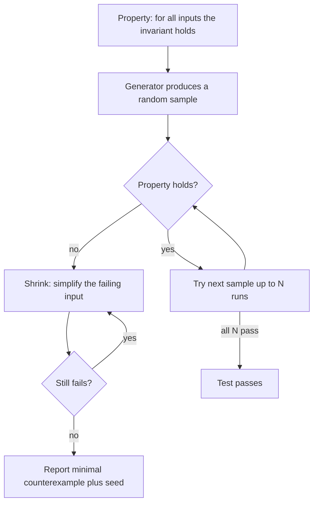

# Property-based and mutation testing

## Why this matters

It's a Tuesday afternoon and the support queue lights up: three customers in different time zones report that their invoices show the wrong total. You pull up the function. It's a `splitAmount(total, parts)` helper that divides a payment into equal installments and you have a test for it — `splitAmount(100, 4)` returns `[25, 25, 25, 25]`, green check, shipped months ago. The test was right. The code was wrong. `splitAmount(100.10, 3)` returns `[33.36, 33.36, 33.36]`, which sums to `100.08`, two cents short, and those two cents have been quietly vanishing on every odd-cent split since launch.

Your example-based test passed because you, the author, chose the example. You picked `100` and `4` because they divide cleanly — the same reason the bug was invisible. You tested the case you already understood. The case that broke production was the one you never thought to write down, and no amount of staring at a list of hand-picked examples was ever going to surface it.

This chapter is about two techniques that attack that blind spot from opposite directions. **Property-based testing** generates hundreds of inputs you'd never think to type, including the ugly ones — `100.10` split three ways, the empty list, the negative number, the integer one past the boundary — and checks that a *property* holds across all of them. **Mutation testing** asks the harder question in the other direction: when your tests are green, are they green because the code is correct, or because the tests don't actually assert anything? It deliberately breaks your code and checks whether your suite notices. Coverage tells you which lines ran. Mutation testing tells you which lines were *checked*. One finds bugs in your code; the other finds bugs in your tests.

## Mental model

An example-based test is a single point sampled from an enormous input space. A property-based test describes the space and a rule that must hold everywhere in it, then lets a generator sample it for you — and when it finds a failure, *shrinks* that failure to the smallest input that still breaks.

Shrinking is the feature that makes the technique usable. A generator might hand you a 400-character string with three Unicode combining marks that triggers the bug, but that's useless for debugging. The framework then repeatedly simplifies the failing input — shorter strings, smaller numbers, fewer list elements — re-running the property each time, until it finds the minimal counterexample. You don't get "it broke on this mess"; you get "it broke on `[0, -1]`."



Mutation testing inverts the question. It treats your *test suite* as the system under test. The tool parses your source, applies a small semantic change — flip `>` to `>=`, replace `a + b` with `a - b`, delete a statement, swap `true` for `false` — producing a *mutant*. Then it runs your tests against that mutant. If a test fails, the mutant is **killed** (good — your tests detected the corruption). If every test still passes, the mutant **survives** (bad — that line could be wrong and your suite would never know). The mutation score is `killed / total`, and a survived mutant is a precise, actionable map to a missing or weak assertion.

The two techniques are complementary. Property-based testing widens the inputs you feed the code. Mutation testing verifies the assertions actually constrain behavior. Coverage measures neither — a test can execute every line and assert nothing.

## In practice

### A property test that catches the rounding bug

Here is the buggy splitter and a conventional example-based test in TypeScript with Vitest:

```typescript
// money.ts
export function splitAmount(totalCents: number, parts: number): number[] {
  const each = Math.floor(totalCents / parts);
  return Array.from({ length: parts }, () => each);
}
```

```typescript
// money.test.ts
import { describe, it, expect } from "vitest";
import { splitAmount } from "./money";

describe("splitAmount", () => {
  it("splits 100 cents four ways", () => {
    expect(splitAmount(100, 4)).toEqual([25, 25, 25, 25]);
  });
});
```

Green. Ships. The example was chosen to divide evenly, so the `Math.floor` truncation never bites. Now state the *property* instead of an example, using [fast-check](https://fast-check.dev/):

```typescript
// money.property.test.ts
import { it, expect } from "vitest";
import fc from "fast-check";
import { splitAmount } from "./money";

it("conserves the total — the split always sums back to the input", () => {
  fc.assert(
    fc.property(
      fc.integer({ min: 0, max: 1_000_000 }), // totalCents
      fc.integer({ min: 1, max: 100 }),        // parts
      (totalCents, parts) => {
        const split = splitAmount(totalCents, parts);
        const sum = split.reduce((a, b) => a + b, 0);
        expect(sum).toBe(totalCents); // money is never created or destroyed
      },
    ),
  );
});
```

The property is the invariant that actually matters to the business: a split conserves money. Run it:

```text
$ npx vitest run money.property.test.ts

FAIL  money.property.test.ts > conserves the total
Property failed after 1 tests
{ seed: <printed-seed>, path: "0:0:1", endOnFailure: true }
Counterexample: [1, 2]
Shrunk N time(s)
Expected sum 0 to be 1
```

fast-check found a failing case in the first run, then shrank it to the minimal counterexample: `splitAmount(1, 2)` returns `[0, 0]`, summing to `0` instead of `1`. One cent went into two parts and both got `Math.floor(0.5) === 0`. That is the production bug, reproduced as the smallest possible input. The `seed` is printed so you can replay the exact run deterministically. The fix distributes the remainder:

```typescript
export function splitAmount(totalCents: number, parts: number): number[] {
  const base = Math.floor(totalCents / parts);
  const remainder = totalCents % parts;
  return Array.from({ length: parts }, (_, i) => base + (i < remainder ? 1 : 0));
}
```

Re-run and every generated case passes. Note what the property bought you: you never had to imagine `1` split `2` ways. You stated a truth and the generator found the violation.

### Choosing good properties

The hard part of property-based testing is not the tooling, it's naming an invariant. Useful patterns, in rough order of how often they apply:

- **Round-trip** — `decode(encode(x)) === x`. The strongest property you can have for any serializer, parser, or codec. If JSON, base64, or your wire format survives a round trip for arbitrary input, you've tested it harder than any example suite.
- **Invariant preserved** — the splitter above; a sort that preserves length and multiset of elements; a balance transfer that conserves total funds.
- **Oracle / model** — compare against a slow-but-obviously-correct reference. Test your optimized cache against a plain `Map`. Test your custom sort against the language's built-in.
- **Idempotence** — `f(f(x)) === f(x)`. Normalizers, deduplicators, `PUT` handlers.
- **Metamorphic** — relationships between outputs when you perturb inputs. `search(q)` returns a superset of `search(q + " extraword")` results, even when you don't know the right answer for either.

Metamorphic properties are the escape hatch when you have no oracle and no clean invariant. You often can't say what the *right* output is for a fuzzy function — a ranking, a route, a recommendation — but you can say how the output must *change* when you change the input. Adding a constraint should never grow a result set; sorting then reversing should equal sorting with the opposite comparator; scaling every input by a constant should scale a linear output by that constant. These relational truths are weaker than a round-trip, but they apply exactly where example-based testing is most helpless, because the answer itself is hard to write down.

Here's a round-trip property in Python with [Hypothesis](https://hypothesis.readthedocs.io/), the canonical implementation for that ecosystem:

```python
# test_codec.py
from hypothesis import given, strategies as st
from myapp.codec import encode, decode

@given(st.dictionaries(st.text(), st.integers()))
def test_encode_decode_round_trips(value):
    assert decode(encode(value)) == value
```

*The same idea in TypeScript:*

```typescript
// codec.property.test.ts
import { it, expect } from "vitest";
import fc from "fast-check";
import { encode, decode } from "./codec";

it("encode/decode round trips", () => {
  fc.assert(
    fc.property(
      fc.dictionary(fc.string(), fc.integer()),
      (value) => {
        expect(decode(encode(value))).toEqual(value);
      },
    ),
  );
});
```

Hypothesis will throw empty dicts, dicts with empty-string keys, huge integers, and surrogate-pair Unicode at this. It also has a `.hypothesis/` example database: once it finds a failing input, it saves it and replays it first on every future run, so a fixed bug stays fixed.

### Measuring whether your tests assert anything

Now the other direction. Suppose someone wrote this test for the *fixed* splitter:

```typescript
it("returns one entry per part", () => {
  expect(splitAmount(100, 4)).toHaveLength(4);
});
```

It passes. Coverage reports 100% of `splitAmount` executed. But it only checks the array *length* — every cent could be wrong and this test would stay green. Mutation testing exposes exactly this. Using [Stryker](https://stryker-mutator.io/) for JavaScript/TypeScript:

```jsonc
// stryker.config.json
{
  "$schema": "./node_modules/@stryker-mutator/core/schema/stryker-schema.json",
  "testRunner": "vitest",
  "mutate": ["src/money.ts"],
  "reporters": ["html", "clear-text"],
  "thresholds": { "high": 80, "low": 60, "break": 50 }
}
```

```text
$ npx stryker run

#1. [Survived] ArithmeticOperator src/money.ts:2:16
-  const base = Math.floor(totalCents / parts);
+  const base = Math.floor(totalCents * parts);
Tests ran but none failed.

#2. [Survived] ConditionalExpression src/money.ts:4:35
-  return ... (i < remainder ? 1 : 0);
+  return ... (false ? 1 : 0);
Tests ran but none failed.

Mutation score: low — neither mutant was killed by the suite
```

Stryker mutated `/` to `*` and the remainder-distribution to constant `false`, and *no test died*. The length-only test ran, passed, and never noticed the math was corrupted. The fix is to add the conservation assertion (the property test above kills both mutants instantly, because `*` and dropped remainders break the sum). Re-run Stryker and the score jumps; the surviving-mutant list is your to-do list for assertions.

For Python the equivalent tool is [mutmut](https://mutmut.readthedocs.io/) or `cosmic-ray`; the workflow is identical — run it, read the surviving mutants, add the assertion each one demands.

### Where each belongs in CI

Property tests are ordinary unit tests; run them on every push with a fixed run count (typically in the hundreds to low thousands). Pin a seed in CI for reproducibility but let it vary locally to keep exploring. Mutation testing is expensive — it runs your suite once per mutant, so thousands of suite runs — so scope it to changed files (`--since`) on pull requests, or run the full pass nightly. Don't gate every commit on a full-repo mutation run; you'll wait forever. A practical split is: property tests in the fast per-push job, a diff-scoped mutation pass as a non-blocking PR comment, and the full mutation sweep on a nightly schedule whose report you read each morning.

> **Connect the dots:** A property-based generator is a fuzzer aimed at a logical invariant instead of a crash. The same engine that finds your rounding bug is structurally the input fuzzing used in security testing (Part 12) and the load-shape generation in performance testing (Part 11, Chapter 5). Learn the generator-and-shrink model once and it transfers across all three.

> **Security note:** Property generators excel at finding the malformed inputs attackers send. Point a property test at any parser, auth-token validator, or path-sanitizer: assert that `validate(maliciousInput)` never throws an unhandled exception, never returns `true` for a forged token, and never escapes the intended directory. Coverage-guided fuzzers (libFuzzer, AFL++, Go's native `testing.F`) take the same idea further by mutating inputs toward unexplored code paths. A property that says "this function never panics on arbitrary bytes" has surfaced real, exploitable parser bugs in production software.

## Pitfalls and anti-patterns

**1. Tautological properties (testing the implementation, not the spec).** The classic failure is writing the property by copying the code: `expect(splitAmount(t, p)).toEqual(myReimplementationOfSplit(t, p))`. If your reference reimplements the same logic, it has the same bug, and the property passes while production burns. *Recognize it:* the property restates the algorithm instead of an externally meaningful truth. *Fix it:* assert properties of the *output* (sums, lengths, ordering, round-trips) or use a genuinely independent oracle — a naive brute-force reference, or the language's built-in.

**2. Generators that never reach the interesting region.** A generator of `fc.integer()` rarely produces `0`, `-1`, `MAX_SAFE_INTEGER`, or the off-by-one boundary your bug lives at, unless the framework biases toward them (good ones do, but custom generators often don't). *Recognize it:* the property has passed thousands of times and you've never seen it explore an edge. *Fix it:* constrain ranges to the meaningful domain, add explicit boundary examples with `fc.constantFrom` / Hypothesis `@example`, and check your framework's statistics output to confirm the distribution covers what you care about.

**3. Chasing 100% mutation score.** Some mutants are *equivalent* — semantically identical to the original (e.g., mutating `i <= n` to `i < n + 1`), so no test can ever kill them. Others mutate logging, telemetry, or performance code where behavior genuinely doesn't change. Demanding 100% wastes hours hunting unkillable mutants. *Recognize it:* the last few survivors are all equivalent or in non-behavioral code. *Fix it:* set a pragmatic threshold (a common range is roughly 70–85% on core logic), exclude generated and trivial files from `mutate`, and treat the surviving-mutant *list* as more valuable than the score.

**4. Flaky property tests from hidden nondeterminism.** A property that touches `Date.now()`, `Math.random()`, the filesystem, or unsorted map iteration will fail intermittently, and the printed seed won't reproduce it because the flakiness is outside the generated input. *Recognize it:* a counterexample that passes when you replay the seed. *Fix it:* inject clocks and randomness as parameters (generate them too), make the property pure, and ensure the only source of variation is the framework's generator.

**5. Slow properties that get deleted.** A property that spins up a database or makes network calls per generated case takes minutes per run, so someone caps it at a handful of cases or marks it skip, and it quietly stops finding anything. *Recognize it:* run counts dialed down to single digits, or `.skip` in the history. *Fix it:* keep property tests pure and in-memory (test the model, not the I/O), push integration concerns to a handful of example-based integration tests, and reserve generators for logic.

## Production checklist

- [ ] Every serializer, parser, or codec has a `decode(encode(x)) === x` round-trip property
- [ ] Core domain invariants (money conserved, sort preserves multiset, balances never negative) are expressed as properties, not just examples
- [ ] Property tests are pure: clocks, randomness, and I/O are injected, not called directly
- [ ] CI pins a seed for reproducibility; local runs use a random seed to keep exploring
- [ ] The framework's example database (`.hypothesis/`, fast-check `examples`) is committed or persisted so fixed bugs stay fixed
- [ ] Boundary values (0, -1, empty, max) are added as explicit examples alongside generated ones
- [ ] Mutation testing runs on changed files per PR (`--since`) and full-suite nightly
- [ ] A mutation-score threshold gates core logic modules (start conservative and ratchet up); generated/trivial files are excluded from `mutate`
- [ ] Surviving mutants are triaged in review: kill it with an assertion, or document it as equivalent
- [ ] Property and mutation runs have time budgets so no one quietly dials the run count to zero

## Exercises

1. **(Comprehension)** Take the buggy `splitAmount` and the conservation property from this chapter. Run it, read the printed counterexample and seed, then explain in two sentences *why* shrinking reported `[1, 2]` rather than the larger random input that first triggered the failure. What would you lose if the framework reported the original input instead of the shrunk one?

2. **(Applied)** Write a `parseDuration("1h30m")` → seconds function and a `formatDuration(seconds)` inverse. Test them with a round-trip property (`parse(format(s)) === s`) using fast-check or Hypothesis. Then run a mutation testing pass (Stryker or mutmut) against your implementation. For each surviving mutant, decide whether it reveals a missing assertion or is genuinely equivalent, and add tests until your core function exceeds an 80% mutation score.

3. **(Open-ended design)** You own a `transferFunds(from, to, amountCents)` function backing a payments ledger. Design a property-based test strategy that gives you confidence the system never creates or destroys money across arbitrary sequences of transfers — including failed transfers, concurrent transfers, and transfers to the same account. Specify the generators (what is an "arbitrary sequence of operations"?), the invariants you'd assert after each step, how you'd model the ledger as an oracle, and how mutation testing would verify those invariants actually constrain the code. Note where property testing stops being enough and you'd reach for contract or integration tests (Part 11, Chapter 4).

## Further reading

- Koen Claessen and John Hughes, ["QuickCheck: A Lightweight Tool for Random Testing of Haskell Programs"](https://www.cs.tufts.edu/~nr/cs257/archive/john-hughes/quick.pdf) (ICFP 2000) — the paper that introduced property-based testing and shrinking; still the clearest statement of the idea
- Hypothesis documentation, ["What you can generate and how"](https://hypothesis.readthedocs.io/en/latest/data.html) — the definitive guide to strategies, the engine behind Python's property testing
- fast-check documentation, [Properties and arbitraries](https://fast-check.dev/docs/core-blocks/properties/) — the TypeScript/JavaScript reference, including shrinking and seed replay
- Stryker Mutator, [official docs](https://stryker-mutator.io/docs/) — mutation testing for JS/TS, C#, and Scala, with a clear catalog of mutation operators
- Jia and Harman, ["An Analysis and Survey of the Development of Mutation Testing"](https://ieeexplore.ieee.org/document/5487526) (IEEE TSE, 2011) — the academic survey of mutation testing, including equivalent-mutant theory
- John Hughes, ["Don't Write Tests"](https://www.youtube.com/watch?v=hXnS_Xjwk2Y) — conference talk walking through real bugs QuickCheck found that no example test would have
