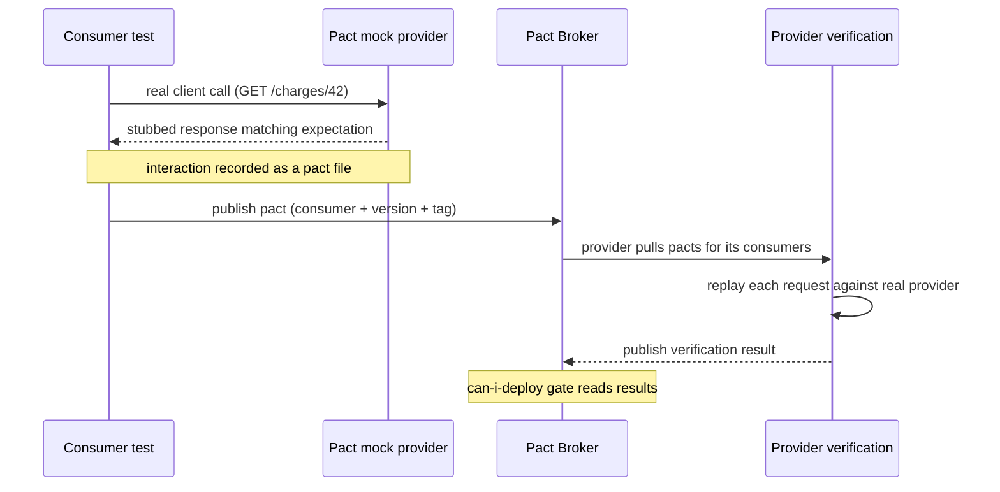

# Contract testing

## Why this matters

It's a Tuesday afternoon. The payments team merges a tidy little refactor: they rename the JSON field `amount_cents` to `amountMinor` in the response from `POST /charges`, because someone finally noticed the old name was inconsistent with the rest of the API. Their integration tests are green. Their unit tests are green. The deploy goes out at 2:14 PM.

At 2:31 PM, the checkout service starts throwing. It reads `response.amount_cents`, gets `undefined`, multiplies by a quantity, and writes `NaN` into the orders table. Nothing crashed loudly. The payments team's tests never exercised a real consumer, and the checkout team's tests mocked the payments response with the *old* shape, so they were green too. Both services tested themselves in isolation and both lied. The bug only existed in the gap between them, and nothing in either CI pipeline was looking at that gap.

This is the failure mode that end-to-end tests are supposed to catch and usually don't: they're slow, flaky, expensive to run on every PR, and they test one frozen snapshot of the whole system rather than the specific promise each service makes to each caller. Contract testing closes the gap directly. Instead of standing up both services and hoping the seams line up, you capture the exact expectations each consumer has of each provider, turn those expectations into a machine-checkable artifact, and fail the provider's build the moment it breaks a promise — before it deploys. The renamed field would have turned the payments pipeline red at 2:10 PM, with a message naming the consumer it would have broken.

The engineers who skip contract testing tend to compensate with a heavy shared integration environment — a staging cluster where every service runs together and a nightly suite tries to catch the breakages. That environment is expensive to keep healthy, it serializes teams behind a single shared resource, and it answers the wrong question. It tells you whether the current snapshot of everything works together right now; it does not tell you whether a specific change to one service is safe to ship independently of the others. Contract testing answers that narrower, more useful question on every PR, in seconds, without standing up anyone else's service.

## Mental model

A contract is a concrete, executable description of one interaction between a *consumer* (the service making the request) and a *provider* (the service answering it). The key insight of *consumer-driven* contract testing, popularized by Pact, is that the consumer owns the contract. The consumer says "when I send *this* request I expect *this* response shape," and the provider's job is to prove it still satisfies every such expectation from every consumer.

This inverts the usual direction of API documentation. The provider doesn't publish a spec and hope consumers conform; consumers publish what they actually depend on, and the provider verifies against the union of real usage. A field no consumer reads can be removed safely. A field one consumer reads cannot. The contract encodes exactly that — and nothing more, which is the property that keeps it honest.



There are two broad families here, and they solve different problems:

- **Consumer-driven contracts (Pact)** verify the *runtime behavior* of an HTTP or message interaction: given this request, does the provider still return a response the consumer can parse? The contract is generated by running the consumer's own client code against a mock.
- **Schema registries (Confluent Schema Registry for Avro/Protobuf/JSON Schema, or a shared OpenAPI/GraphQL schema)** verify *structural compatibility* of a data format independent of any specific request. The registry enforces compatibility rules (backward, forward, full) at the moment a new schema version is registered.

Pact answers "will this consumer still work against this provider?" A schema registry answers "is this new version of the data format compatible with the old one, by these rules?" Mature systems use both: Pact for synchronous service-to-service HTTP, a registry for event streams (Kafka topics) where there's no request to replay, only a serialized payload.

The artifact that makes this work in CI is the **broker** (Pact Broker / PactFlow) — a service that stores published pacts, matrixes which consumer version was verified against which provider version, and answers one critical question: `can-i-deploy`. That question is what turns contract tests from a local curiosity into a deployment gate. Without it you have generated some JSON files; with it you have a rule that physically blocks a provider from shipping a change that would break a consumer currently running in production.

It is worth being precise about what a contract is *not*. It is not a substitute for the provider's own unit tests of its business logic — verification only replays the interactions consumers recorded, so logic no consumer exercises is invisible to it. It is not a full API specification, because consumers only encode what they read. And it is not an end-to-end test: it never runs two real services against each other at the same time. The consumer test runs against a mock; the provider test replays recorded requests against a real provider. Those two halves never meet in one process. The broker is the only place they are reconciled, asynchronously, by comparing recorded expectations against recorded verification results.

## In practice

We'll build the payments/checkout example end to end with Pact in TypeScript, then show the breaking-change failure, then cover the schema-registry path for events.

### The consumer test generates the contract

The consumer writes a normal test against its own HTTP client, but points the client at a Pact mock server. The mock records each interaction into a pact file.

```typescript
// checkout/src/payments-client.ts — the real client under test
export interface Charge {
  id: string;
  amountCents: number;
  currency: string;
}

export async function getCharge(baseUrl: string, id: string): Promise<Charge> {
  const res = await fetch(`${baseUrl}/charges/${id}`);
  if (!res.ok) throw new Error(`charge fetch failed: ${res.status}`);
  const body = await res.json();
  return {
    id: body.id,
    amountCents: body.amount_cents, // <-- the field this consumer depends on
    currency: body.currency,
  };
}
```

```typescript
// checkout/test/payments-client.pact.test.ts
import { PactV3, MatchersV3 } from "@pact-foundation/pact";
import { describe, it, expect } from "vitest";
import { getCharge } from "../src/payments-client";

const { like, integer, string } = MatchersV3;

const provider = new PactV3({
  consumer: "checkout",
  provider: "payments",
  dir: "./pacts",
});

describe("payments client", () => {
  it("fetches a charge by id", async () => {
    provider
      .given("charge 42 exists")
      .uponReceiving("a request for charge 42")
      .withRequest({ method: "GET", path: "/charges/42" })
      .willRespondWith({
        status: 200,
        headers: { "Content-Type": "application/json" },
        body: like({
          id: string("42"),
          amount_cents: integer(1999),
          currency: string("USD"),
        }),
      });

    await provider.executeTest(async (mockServer) => {
      const charge = await getCharge(mockServer.url, "42");
      expect(charge.amountCents).toBe(1999);
    });
  });
});
```

Two things matter here. First, we test the *real* client (`getCharge`), not a hand-written mock, so the contract reflects exactly which fields the code touches. Second, we use **matchers** (`integer`, `string`, `like`) instead of literal values. The contract should assert "there is an integer field named `amount_cents`," not "it equals 1999." Asserting on exact values couples your contract to test data and produces brittle provider verifications. Match on type and structure; assert on exact values only when the value itself is the contract (an enum, a status code).

Running it produces `checkout/pacts/checkout-payments.json`:

```json
{
  "consumer": { "name": "checkout" },
  "provider": { "name": "payments" },
  "interactions": [
    {
      "description": "a request for charge 42",
      "providerState": "charge 42 exists",
      "request": { "method": "GET", "path": "/charges/42" },
      "response": {
        "status": 200,
        "body": { "id": "42", "amount_cents": 1999, "currency": "USD" },
        "matchingRules": {
          "body": {
            "$.amount_cents": { "matchers": [{ "match": "integer" }] }
          }
        }
      }
    }
  ]
}
```

Note what the `matchingRules` block does and does not contain. It pins `$.amount_cents` to an integer matcher, so verification checks the *type* at that path, not the literal `1999` echoed in the example body. The example body exists only to make the pact readable and to feed the mock during the consumer test; the matchers are the actual assertions. This distinction is the single most common source of brittle contracts when people get it wrong.

### The provider verifies against the contract

The provider pulls this pact and replays every recorded request against a real running instance, asserting the responses still satisfy the matchers. `providerState` is the hook that lets the provider set up data: "charge 42 exists" maps to a setup function that seeds the database (or stubs the repository) so the request returns a 200.

```typescript
// payments/test/verify.pact.test.ts
import { Verifier } from "@pact-foundation/pact";
import { describe, it } from "vitest";
import { startServer, seedCharge, clearCharges } from "./helpers";

describe("payments provider verification", () => {
  it("honors the checkout contract", async () => {
    const server = await startServer({ port: 8081 });
    const verifier = new Verifier({
      provider: "payments",
      providerBaseUrl: "http://localhost:8081",
      pactUrls: ["../checkout/pacts/checkout-payments.json"],
      stateHandlers: {
        "charge 42 exists": async () => {
          await clearCharges();
          await seedCharge({ id: "42", amount_cents: 1999, currency: "USD" });
        },
      },
    });
    await verifier.verifyProvider();
    await server.close();
  });
});
```

With the original code, this passes:

```text
Verifying a pact between checkout and payments
  a request for charge 42
    returns a response which
      has status code 200 (OK)
      has a matching body (OK)
PASS  test/verify.pact.test.ts
```

The `stateHandlers` are the part teams most often cut corners on. Each `providerState` string is a contract in its own right between the consumer (which named the precondition) and the provider (which must make it true). Keep the setup at the repository or database boundary so the request flows through real routing and real serialization. If a state handler instead stubs the HTTP layer, you are back to verifying a mock — see the anti-pattern below.

### Watching it fail on a breaking change

Now the payments team makes the rename. They change the handler to emit `amountMinor` instead of `amount_cents`:

```typescript
// payments/src/routes/charges.ts — the breaking change
res.json({
  id: charge.id,
  amountMinor: charge.amount_cents, // renamed from amount_cents
  currency: charge.currency,
});
```

Their own tests pass. But provider verification replays the checkout contract, which still demands an integer at `$.amount_cents`:

```text
Verifying a pact between checkout and payments
  a request for charge 42
    returns a response which
      has status code 200 (OK)
      has a matching body (FAILED)

Failures:

1) Verifying a pact between checkout and payments
   Given charge 42 exists
   a request for charge 42 returns a response which has a matching body

   $.amount_cents -> Expected an integer but the value was missing

   Diff:
   {
   -  "amount_cents": 1999,
   +  "amountMinor": 1999,
      "currency": "USD",
      "id": "42"
   }

FAIL  test/verify.pact.test.ts
```

This is the whole point. The provider's CI is now red, the diff names the exact field, and the failure references the consumer (`checkout`) whose expectation was violated. The 2:14 PM deploy never happens. The payments team's options are now explicit: keep `amount_cents` as a deprecated alias alongside `amountMinor`, coordinate the rename with checkout, or expand the contract first. Contract testing didn't prevent the change; it surfaced its blast radius before production did.

### Wiring the broker and `can-i-deploy` into CI

Locally sharing pact files via relative paths doesn't scale. In CI, the consumer publishes pacts to a broker tagged with its version and branch; the provider verifies and publishes results back. The deployment gate then queries the matrix.

```bash
# Consumer CI, after the pact test passes:
pact-broker publish ./pacts \
  --consumer-app-version "$GIT_SHA" \
  --branch "$GIT_BRANCH" \
  --broker-base-url "$PACT_BROKER_URL"

# Provider CI verifies pacts for all consumers and publishes the result:
PACT_PUBLISH_VERIFICATION_RESULTS=true npm run test:pact:verify

# Either side, immediately before deploy — the gate:
pact-broker can-i-deploy \
  --pacticipant payments \
  --version "$GIT_SHA" \
  --to-environment production \
  --broker-base-url "$PACT_BROKER_URL"
# exits non-zero if any consumer in production hasn't verified this version
```

`can-i-deploy` is the line that earns the whole setup. It reads the verification matrix and answers: "if I deploy payments@$GIT_SHA to production, is there any consumer currently in production whose contract this version fails?" If yes, the deploy is blocked. This is what lets independent teams deploy on their own cadence without a coordinating integration environment.

For the matrix to reflect reality, both sides must also record what they actually shipped, using `record-deployment` (for environments a service is deployed into) or `record-release` (for versioned releases). If deployments are never recorded, `can-i-deploy` reasons about a fiction — it cannot know which consumer version is "currently in production" — and its answer is worthless. Treat the publish, the verify, and the record steps as a single non-optional trio in every pipeline.

### Schema registries for events

Pact replays requests, which works for HTTP and request/reply messaging. For fire-and-forget event streams (Kafka), there's no response to verify — only a serialized payload that some unknown set of future consumers will read. Here a schema registry enforces compatibility at registration time.

```python
# producer registers an Avro schema; the registry rejects incompatible changes
from confluent_kafka.schema_registry import SchemaRegistryClient, Schema

client = SchemaRegistryClient({"url": "http://schema-registry:8081"})

schema_v2 = """
{
  "type": "record", "name": "ChargeCreated", "namespace": "payments",
  "fields": [
    {"name": "id", "type": "string"},
    {"name": "amount_cents", "type": "long"},
    {"name": "currency", "type": "string"},
    {"name": "method", "type": ["null", "string"], "default": null}
  ]
}
"""

# With subject compatibility set to BACKWARD, the registry accepts this:
# the new optional 'method' field has a default, so old consumers still read.
client.register_schema("payments.charges-value", Schema(schema_v2, "AVRO"))
```

*The same idea in TypeScript:*

```typescript
// producer registers an Avro schema; the registry rejects incompatible changes
const registryUrl = "http://schema-registry:8081";

const schemaV2 = `
{
  "type": "record", "name": "ChargeCreated", "namespace": "payments",
  "fields": [
    {"name": "id", "type": "string"},
    {"name": "amount_cents", "type": "long"},
    {"name": "currency", "type": "string"},
    {"name": "method", "type": ["null", "string"], "default": null}
  ]
}
`;

// With subject compatibility set to BACKWARD, the registry accepts this:
// the new optional 'method' field has a default, so old consumers still read.
const res = await fetch(
  `${registryUrl}/subjects/payments.charges-value/versions`,
  {
    method: "POST",
    headers: { "Content-Type": "application/vnd.schemaregistry.v1+json" },
    body: JSON.stringify({ schema: schemaV2, schemaType: "AVRO" }),
  },
);
if (!res.ok) throw new Error(await res.text());
```

If the producer instead tried to *remove* `amount_cents` or rename it, registration under `BACKWARD` compatibility fails:

```text
confluent_kafka.schema_registry.error.SchemaRegistryError:
  Schema being registered is incompatible with an earlier schema for
  subject "payments.charges-value", details: [Found incompatible change:
  READER_FIELD_MISSING_DEFAULT_VALUE 'amount_cents']  (HTTP 409)
```

The compatibility mode is the contract. `BACKWARD` (the Confluent default) means new schemas can read data written by the old schema, so you upgrade consumers first. `FORWARD` means old schemas can read new data, so you upgrade producers first. `FULL` requires both. Choosing the mode per topic is a deliberate decision about deploy ordering, not a default to leave alone.

> **Connect the dots:** Schema compatibility rules are the same backward/forward reasoning Martin Kleppmann develops for data evolution in *Designing Data-Intensive Applications*, Chapter 4, "Encoding and Evolution." Avro, Protobuf, and Thrift each encode it differently, but the question is identical: can a reader on one schema version decode a writer on another? Contract testing is that question applied to the wire between services.

> **Security note:** A passing contract proves the response *shape* a consumer expects, not that the provider applied the right *authorization*. Pact verification typically seeds `providerState` and replays the request against a real handler, but the recorded request rarely carries production credentials, and the matchers assert structure, not access control. Do not let a green contract suite stand in for tests that a charge belongs to the requesting tenant, that a 403 is returned for an unauthorized caller, or that personally identifiable fields are redacted for the right roles. Keep authorization and data-exposure assertions in dedicated security and integration tests; contract tests verify the seam, not who is allowed through it.

## Pitfalls and anti-patterns

**Contracts that mirror the implementation instead of the dependency.** A consumer test that asserts on every field the provider returns — including fields the consumer never reads — turns every provider addition into a false failure and pressures the provider to freeze its whole response. Recognize it when adding an unused field to a provider breaks a consumer's contract. Fix it by asserting only on the fields the client code actually consumes, using type matchers, not literals. The contract should shrink to exactly the consumer's real surface area.

**Verifying against mocks on both sides (bi-directional mocking).** If the consumer mocks the provider and the provider's "contract test" is itself another mock, you've tested two fictions against each other and proven nothing — this is the original 2:14 PM bug dressed up as testing. Recognize it when provider verification never starts a real server or real handler. Fix it by replaying the consumer's pact against the actual provider application (real routes, real serialization), with `providerState` seeding real or repository-level data.

**No `can-i-deploy` gate.** Teams generate and publish pacts, feel virtuous, and still deploy without checking the verification matrix. Contracts that aren't a deployment gate are documentation, not protection. Recognize it when pacts exist in the broker but no pipeline step blocks on `can-i-deploy`. Fix it by making `can-i-deploy --to-environment production` a required step before every production deploy, for both consumers and providers, and recording deployments back to the broker (`record-deployment`).

**Stale contracts from abandoned branches.** A broker accumulates pacts from feature branches that were never merged, and providers waste cycles verifying expectations no live consumer holds — or worse, a stale contract blocks a legitimate provider change. Recognize it when verification fails against a consumer version that isn't deployed anywhere. Fix it by tagging pacts with branch and environment, verifying provider changes against the `deployed`/`released` set via `consumerVersionSelectors`, and enabling branch/version cleanup in the broker.

**Wrong compatibility mode for the deploy order.** Setting a Kafka topic to `BACKWARD` when your operational reality requires producers to ship first (or vice versa) means the registry blocks safe changes and waves through unsafe ones. Recognize it when a clearly compatible change is rejected, or an incompatible one slips through and breaks consumers. Fix it by choosing the mode from how you actually deploy: `BACKWARD` (default) when consumers upgrade first, `FORWARD` when producers upgrade first, `FULL` when ordering isn't guaranteed.

## Production checklist

- [ ] Consumer contract tests run the real client code against the Pact mock, not a hand-written stub
- [ ] Contracts assert with type/structure matchers; exact-value assertions reserved for enums and status codes
- [ ] Provider verification replays pacts against a real running provider with `stateHandlers` seeding `providerState`
- [ ] A Pact Broker / PactFlow stores pacts and verification results; nothing relies on relative-path file sharing in CI
- [ ] Pacts published with `--consumer-app-version` (git SHA) and `--branch` on every consumer build
- [ ] `PACT_PUBLISH_VERIFICATION_RESULTS=true` set so provider results land in the broker
- [ ] `can-i-deploy --to-environment production` is a required, blocking step before every production deploy (both sides)
- [ ] Deployments recorded to the broker (`record-deployment` / `record-release`) so the matrix reflects reality
- [ ] Provider verifies against `deployed` and `released` consumer selectors, not every historical pact
- [ ] Authorization, tenancy, and data-redaction assertions live in dedicated security/integration tests, not in contracts
- [ ] Event streams use a schema registry with an explicit per-subject compatibility mode chosen from deploy order
- [ ] Schema registration runs in CI so incompatible Avro/Protobuf changes fail the build, not production
- [ ] Webhook configured so a new consumer contract triggers provider re-verification automatically

## Exercises

1. **(Comprehension)** In the failing verification output above, the diff shows `amount_cents` missing and `amountMinor` present. Explain why the payments team's own unit and integration tests stayed green through this change, and identify the single property of the checkout contract (hint: it's about which fields are asserted) that made the provider verification catch it. What would have happened if the checkout contract had used `like()` on the whole body but never referenced `amount_cents`?

2. **(Applied)** Stand up the consumer/provider pair from this chapter. Run the consumer test to generate the pact, verify it against the provider (green), then introduce the `amount_cents` → `amountMinor` rename and watch verification fail. Now make the change *non-breaking*: have the provider emit both fields, re-verify to green, then update the consumer to read `amountMinor`, regenerate the pact, and finally remove `amount_cents` from the provider. Confirm each step's verification status. This is the safe two-phase rename every production rename should follow.

3. **(Design)** You own a Kafka topic consumed by six teams you don't control, and you need to split one field (`full_name`) into two (`first_name`, `last_name`). Design the migration using schema-registry compatibility modes so that no consumer breaks and you never need a coordinated big-bang deploy. Specify the compatibility mode, the intermediate schema(s), the order of producer and consumer rollouts, and how you'd know it's safe to retire `full_name`. Then argue whether Pact, a schema registry, or both should govern this topic, and why.

## Further reading

- Ian Robinson, ["Consumer-Driven Contracts: A Service Evolution Pattern"](https://martinfowler.com/articles/consumerDrivenContracts.html) — the foundational pattern, on martinfowler.com
- [Pact documentation](https://docs.pact.io/) — the canonical reference for the consumer-driven contract workflow, the broker, and `can-i-deploy`
- Martin Fowler, ["ContractTest"](https://martinfowler.com/bliki/ContractTest.html) and ["IntegrationContractTest"](https://martinfowler.com/bliki/IntegrationContractTest.html) — where contract tests sit relative to integration and end-to-end tests
- [Confluent Schema Registry documentation: Schema Evolution and Compatibility](https://docs.confluent.io/platform/current/schema-registry/fundamentals/avro.html) — the precise semantics of `BACKWARD`, `FORWARD`, and `FULL`
- Martin Kleppmann, *Designing Data-Intensive Applications*, Chapter 4, "Encoding and Evolution" — the deepest treatment of schema evolution and why backward/forward compatibility is the real contract
- [PactFlow: "Bi-Directional Contract Testing"](https://docs.pactflow.io/docs/bi-directional-contract-testing) — when to combine a provider's OpenAPI spec with consumer contracts instead of replaying requests
