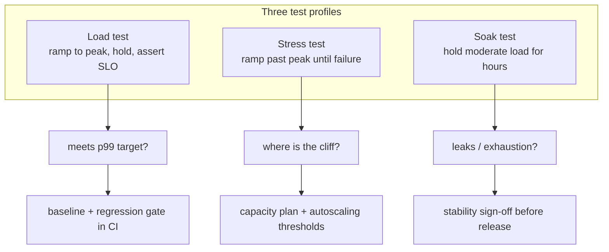

# Performance and load testing

## Why this matters

It's a Tuesday afternoon and the checkout API is "fine." The dashboard says average response time is 180ms, well under your 500ms SLO. The unit tests are green. The staging smoke test passed. You ship the Black Friday promo code feature and go home.

By 7pm, support is on fire. Customers can't check out. The dashboard still says average is 210ms — barely moved. But when you actually pull the latency histogram, the picture is different: p50 is 190ms, p99 is several seconds, and a long tail is timing out at the load balancer's 30-second limit. The average lied to you because averages always lie about latency. One slow request in a hundred doesn't move the mean much, but it's the request that loses the sale, and at checkout volume one-in-a-hundred is a large number of angry customers an hour.

The root cause turns out to be a connection pool that holds 10 connections. Under your normal load of 50 requests/second it never saturates. Under promo load several times higher, requests queue waiting for a free connection, and once the pool is exhausted the wait time doesn't grow linearly — it falls off a cliff. This is the thing nobody tested, because nobody ran the system at the load where it breaks before customers did.

That's the gap this chapter closes. Performance testing is the discipline of finding the cliff before your users do: measuring the right statistic (percentiles, not averages), under realistic load patterns (load, stress, soak), with a baseline you can regress against in CI so the cliff doesn't quietly reappear three sprints later. The teams that skip this learn about their cliffs at 7pm on a Tuesday. The teams that don't learn about them in a pull request.

## Mental model

There are three distinct questions, and they need three distinct test shapes. Conflating them is the most common mistake in the field.

- **Load test** — "Does the system meet its SLOs at expected peak traffic?" You ramp to a target throughput, hold it, and assert on percentile latency and error rate. This is your regression gate.
- **Stress test** — "Where does it break, and how?" You push past expected peak until something fails, to learn the breaking point and the failure mode (graceful degradation vs. cascading collapse).
- **Soak test** — "Does it survive sustained load over hours?" You hold moderate load for a long time to surface memory leaks, connection-pool exhaustion, disk fill, and log-rotation bugs that only appear after hours.

These are not three intensities of the same test; they answer orthogonal questions and have different stopping conditions. A load test stops when it has confirmed (or denied) the SLO at peak. A stress test stops when the system falls over — failure is the result you want. A soak test stops when the clock runs out, and its result is a trend line, not a single number: a flat memory curve over six hours is a pass, a slowly rising one is a leak even if no single request ever missed its SLO. Trying to make one script serve all three is how you end up with a test that proves nothing about any of them.

The second pillar is the statistic. Latency distributions are right-skewed with a long tail, so the mean sits to the left of where the pain is. You care about **tail percentiles** — p95, p99, p99.9 — because at scale a user's session touches many requests, and the slowest one dominates their experience. A request flow that fans out to 100 backend calls and waits for all of them will, on average, hit the p99 of at least one of them. This is why Google's tail-at-scale work argues that p99 of a single service is the *typical* experience of a composite request. The corollary is uncomfortable: the more you decompose a system into microservices, the more the tail of each dependency leaks into the median of the whole, so the tail percentiles you measure on a single service understate the user-facing pain once that service is one hop in a longer chain.



The third pillar is the **baseline**. A latency number in isolation is meaningless — "p99 is 400ms" is only good or bad relative to last week and relative to your SLO. A baseline is a committed, version-controlled record of acceptable thresholds. Regression detection means failing CI when a change pushes p99 past the baseline, the same way a failing unit test gates a merge. Without a baseline, performance erodes one "small" PR at a time until you're back at 7pm on a Tuesday. The baseline also gives you an error budget you can spend deliberately: if your SLO is p99 under 500ms and you measure 300ms, you have headroom for a feature that adds latency, and the baseline file is where that decision gets recorded and reviewed instead of discovered in production.

One non-negotiable principle, due to Gil Tene: **never measure latency without accounting for coordinated omission.** If your load generator sends a request, waits for the response, then sends the next one, a slow response *delays* the next request instead of being recorded as a backlog of slow requests. You silently under-count the tail. The intuition: imagine a server that freezes for one second. An open-model generator firing 100 requests per second records roughly 100 slow requests stacking up behind the freeze; a closed-model generator with a handful of looping workers records only those few, and misses the hundred that a real arriving crowd would have generated. Closed-model tools must correct for this (k6 does; check your tool), or you must drive an open model where request arrival is independent of response timing.

## In practice

We'll use [k6](https://grafana.com/docs/k6/) (Go core, JavaScript test scripts) because it's scriptable, CI-friendly, and emits structured thresholds. Locust (Python) is the equivalent if your team lives in Python; the concepts map one-to-one.

### A first load test that asserts on percentiles

```javascript
// checkout-load.js
import http from 'k6/http';
import { check, sleep } from 'k6';
import { Trend } from 'k6/metrics';

const checkoutLatency = new Trend('checkout_latency', true);

export const options = {
  scenarios: {
    peak_load: {
      executor: 'ramping-arrival-rate', // open model: arrivals independent of responses
      startRate: 50,
      timeUnit: '1s',
      preAllocatedVUs: 200,
      maxVUs: 1000,
      stages: [
        { target: 50, duration: '30s' },   // warm up
        { target: 400, duration: '1m' },   // ramp to promo peak
        { target: 400, duration: '3m' },   // hold at peak
        { target: 0, duration: '30s' },    // ramp down
      ],
    },
  },
  thresholds: {
    // The regression gate. CI fails if these are breached.
    http_req_failed: ['rate<0.01'],                 // <1% errors
    checkout_latency: ['p(95)<500', 'p(99)<1000'],  // SLO in milliseconds
  },
};

export default function () {
  const res = http.post(
    'https://staging.example.com/api/checkout',
    JSON.stringify({ cart: 'cart_123', promo: 'BLACKFRIDAY' }),
    { headers: { 'Content-Type': 'application/json' } },
  );
  checkoutLatency.add(res.timings.duration);
  check(res, { 'status is 200': (r) => r.status === 200 });
  sleep(1);
}
```

Two deliberate choices. First, `ramping-arrival-rate` is an **open-model** executor: it tries to start N requests per second regardless of how fast prior requests finish. That's what protects you from coordinated omission. The naive alternative, a fixed pool of virtual users that loop, is a closed model — under that model, when the server slows down, your offered load silently drops and you never see the cliff. Second, the SLO lives in `thresholds`, so the test is self-asserting: the run exits non-zero the moment a threshold is breached, with no human eyeballing a graph.

### Surfacing the p99 cliff

Run it and watch what the averages hide. The output below is illustrative — the exact numbers depend on your service — but the *shape* is what matters:

```bash
$ k6 run checkout-load.js
     scenarios: (100.00%) 1 scenario, 1000 max VUs, 5m30s max duration
  ...
     # illustrative output — your numbers will differ
     checkout_latency.............: avg=212ms  min=41ms  med=190ms
                                    p(90)=240ms p(95)=480ms p(99)=9410ms
     http_req_failed..............: 3.74%
     ✗ checkout_latency
        p(95)<500    p95=480ms
        p(99)<1000   p99=9410ms   ← FAIL
     ✗ http_req_failed
        rate<0.01    rate=0.0374  ← FAIL
```

The average and even the median look healthy. p95 squeaks under. But **p99 is several seconds** — and a roughly 20x jump from p95 to p99 is the signature of a cliff: a shared resource saturating under load. The threshold block fails the run with a non-zero exit code, which is exactly what makes this a CI gate rather than a vibe check.

To find the cliff, re-run as a **stress test** that ramps past peak and graphs latency against throughput:

```javascript
// Replace the stages to push past the breaking point:
stages: [
  { target: 100, duration: '1m' },
  { target: 800, duration: '4m' },  // keep climbing
  { target: 1500, duration: '2m' }, // until it falls over
],
```

Plotting p99 against arrival rate shows latency flat across the lower range, then a near-vertical wall once a shared resource saturates. In the opening scenario that inflection is the connection pool exhausting at its 10-connection limit. The fix (raise pool size, add backpressure, or shed load) is now a measurable hypothesis: change one thing, re-run the same stress profile, and watch whether the wall moves to a higher arrival rate.

> **Connect the dots:** The cliff here is the connection pool, but the same vertical-wall signature shows up at every saturating resource — thread pools, database locks, Lambda concurrency limits. Queueing theory (the M/M/1 model) predicts it: wait time grows in proportion to 1/(1−ρ) where ρ is utilization, so latency heads toward infinity as utilization approaches 1. That is also why a system at 50% utilization feels instant and the same system at 90% feels broken — the last 10% of capacity buys you a disproportionate share of the latency. See Part 9 on system design for the math; here, just remember that the wall is real and you want to find it in a test, not in production.

### Reading the server side while you load

A client-side cliff tells you *that* the system broke; it rarely tells you *why*. Run the load test with server-side instrumentation captured over the same window so you can line up the latency wall against a resource curve. The USE method (Brendan Gregg) is the fastest checklist: for every resource, look at **U**tilization, **S**aturation, and **E**rrors. The connection pool from the opening story shows up as pool saturation (requests queued waiting for a connection) climbing to 100% at the exact arrival rate where client p99 goes vertical. Other usual suspects: CPU run-queue depth, garbage-collection pause time, database lock waits, file-descriptor counts, and thread-pool queue length. If you only keep client-side latency, every cliff looks the same and you're left guessing; with the server-side curve overlaid, the saturating resource names itself.

### Soak tests find what load tests can't

A load test that passes for five minutes can still hide a leak that takes three hours to bite. A soak test holds a moderate, sustained load — well below the cliff — for hours and watches slopes, not snapshots. Memory that climbs and never plateaus is a leak. Connection counts that ratchet up are a pool that isn't returning connections. Disk that fills is unrotated logs or an unbounded cache. The point is that none of these necessarily break a single request's latency until the moment they exhaust the resource entirely, which is why they survive every short test and surface only in week-two of production. Schedule the soak nightly or weekly against a stable environment and alert on the trend.

### The Locust equivalent

```python
# locustfile.py
from locust import HttpUser, task, constant_throughput

class CheckoutUser(HttpUser):
    wait_time = constant_throughput(1)  # 1 request/s per user

    @task
    def checkout(self):
        with self.client.post(
            "/api/checkout",
            json={"cart": "cart_123", "promo": "BLACKFRIDAY"},
            catch_response=True,
        ) as res:
            if res.elapsed.total_seconds() > 1.0:
                res.failure(f"too slow: {res.elapsed.total_seconds():.2f}s")
```

*The same idea in TypeScript (a k6 script, paced by arrival rate to approximate the open model):*

```typescript
// checkout-throughput.ts
import http from 'k6/http';
import { check } from 'k6';
import type { Options } from 'k6/options';

export const options: Options = {
  scenarios: {
    checkout: {
      executor: 'constant-arrival-rate', // pace by arrival, not by think-time
      rate: 400, // 400 requests/s ≈ 400 users at 1 req/s each
      timeUnit: '1s',
      duration: '5m',
      preAllocatedVUs: 400,
      maxVUs: 1000,
    },
  },
};

export default function (): void {
  const res = http.post(
    'https://staging.example.com/api/checkout',
    JSON.stringify({ cart: 'cart_123', promo: 'BLACKFRIDAY' }),
    { headers: { 'Content-Type': 'application/json' } },
  );
  check(res, {
    'not too slow': (r) => {
      const tooSlow = r.timings.duration > 1000;
      if (tooSlow) {
        console.error(`too slow: ${(r.timings.duration / 1000).toFixed(2)}s`);
      }
      return !tooSlow;
    },
  });
}
```

```bash
$ locust -f locustfile.py --host https://staging.example.com \
    --users 400 --spawn-rate 50 --run-time 5m --headless \
    --csv results
```

Locust writes `results_stats.csv` with per-endpoint percentiles. One caveat: Locust's default model is closed (each user waits for its response), so to approximate an open model and avoid coordinated omission, use `constant_throughput` (pace by arrival, not by think-time) and provision enough users that they never become the bottleneck.

### Baselines and regression detection in CI

Export percentiles as machine-readable JSON, commit a baseline, and diff against it.

```bash
# Emit a summary the pipeline can parse
$ k6 run --summary-export=summary.json checkout-load.js
```

```javascript
// compare-baseline.js — fail the build on regression
import { readFileSync } from 'node:fs';

const baseline = JSON.parse(readFileSync('perf-baseline.json', 'utf8'));
const current = JSON.parse(readFileSync('summary.json', 'utf8'));

const p99 = current.metrics.checkout_latency.values['p(99)'];
const budget = baseline.checkout_p99_ms * 1.10; // allow 10% noise margin

if (p99 > budget) {
  console.error(`REGRESSION: p99 ${p99}ms exceeds budget ${budget}ms`);
  process.exit(1);
}
console.log(`OK: p99 ${p99}ms within budget ${budget}ms`);
```

```yaml
# .github/workflows/perf.yml
name: performance
on: [pull_request]
jobs:
  load-test:
    runs-on: ubuntu-latest
    steps:
      - uses: actions/checkout@v4
      - uses: grafana/setup-k6-action@v1
      - run: k6 run --summary-export=summary.json checkout-load.js
        env:
          K6_TARGET: ${{ secrets.STAGING_URL }}
      - run: node compare-baseline.js
```

The 10% margin matters: shared CI runners are noisy, and a too-tight gate flaps and gets disabled, which is worse than no gate. Pick the margin from the runner's measured variance rather than a round guess — run the unchanged test ten times, take the spread, and set the margin above it. Update `perf-baseline.json` deliberately, in its own reviewed commit, so a baseline change is a visible decision rather than a silent ratchet that lets performance rot one merge at a time.

## Pitfalls and anti-patterns

**1. Reporting averages instead of percentiles.** A mean latency hides the tail completely; you can have a healthy average and a catastrophic p99 simultaneously (the opening scenario). *Recognize it* when your dashboard shows one latency number and it's called "avg" or "mean." *Fix it* by reporting p50/p95/p99/p99.9 everywhere, and never aggregating pre-computed percentiles by averaging them — averaging percentiles is statistically meaningless. Aggregate the underlying histogram (an HDR histogram or a t-digest), then read percentiles off the merged distribution.

**2. Coordinated omission.** A closed-model load generator that waits for each response before sending the next under-counts the tail, because a slow response suppresses the requests that would have piled up behind it. *Recognize it* when your tool uses a fixed VU pool with think-time and your reported tail looks suspiciously clean under heavy load. *Fix it* by using an open arrival-rate model (k6 `ramping-arrival-rate`, Locust `constant_throughput`) so request arrival is independent of server speed.

**3. Load-testing from one box on the same network.** Generating load from a single machine, or from inside the same VPC as the target, hides client-side limits (the generator's own CPU and file-descriptor ceiling) and network reality (TLS handshakes, real RTT, DNS). *Recognize it* when throughput plateaus at a suspiciously round number unrelated to the server, or when latency is implausibly low. *Fix it* by distributing load generation across multiple hosts and regions and watching the generator's own resource usage — if the load box is at 100% CPU, you're measuring the test, not the system.

**4. No warm-up, cold-cache results.** Measuring the first 30 seconds catches JIT compilation, cold connection pools, empty caches, and lazy-loaded modules, producing pessimistic and noisy numbers. *Recognize it* when the first stage's p99 dwarfs the steady-state and your runs don't reproduce. *Fix it* with an explicit warm-up stage whose metrics you exclude from the assertion, asserting only on the steady-state hold.

**5. Testing a toy environment and extrapolating.** A load test against a single-instance staging box with a tiny database tells you nothing about production with read replicas, a CDN, autoscaling, and orders of magnitude more data. *Recognize it* when staging has fundamentally different topology or data volume than production. *Fix it* by testing against a production-shaped environment with production-shaped data, or by being explicit that the test only catches relative regressions, not absolute capacity.

> **Security note:** Performance tests double as a discovery tool for denial-of-service amplification. If a single authenticated request triggers an unbounded fan-out (an N+1 query, an unpaginated export, a regex with catastrophic backtracking), your stress test will surface it as a cliff at surprisingly low request rates — which is exactly the asymmetry an attacker exploits to take you down with a trickle of traffic. Treat any endpoint that falls over at far lower load than its peers as a security finding, not just a performance one, and add a rate limit or an input bound.

## Production checklist

- [ ] Every latency-sensitive SLO is expressed as a percentile (p95/p99), never an average
- [ ] Load tests use an open arrival-rate model (or explicitly correct for coordinated omission)
- [ ] A committed `perf-baseline.json` with thresholds, updated only via reviewed commits
- [ ] CI fails the build when p99 or error-rate exceeds baseline plus a documented noise margin
- [ ] Separate, named profiles exist for load, stress, and soak — not one script doing all three
- [ ] A soak test (1+ hour) runs on a schedule and watches memory, connections, and file descriptors
- [ ] Warm-up stages are excluded from threshold assertions
- [ ] Load is generated from outside the target's network, across enough hosts to avoid client-side bottlenecks
- [ ] The test environment's topology and data volume are documented relative to production
- [ ] Stress-test results feed capacity planning and autoscaling thresholds, not just a pass/fail
- [ ] Server-side metrics (CPU, pool saturation, GC pauses) are captured alongside client-side latency for root-causing

## Exercises

1. **(Comprehension)** Given this distribution of 1,000 request latencies — 990 requests at 100ms and 10 requests at 8,000ms — compute the mean and the p99. Explain in two sentences why a dashboard showing only the mean would report this system as healthy, and what a user at p99 actually experiences.

2. **(Applied)** Take any HTTP endpoint you own (or a local server) and write a k6 script with an open-model `ramping-arrival-rate` scenario that ramps to a load high enough to find a cliff. Add a `thresholds` block asserting `p(99)<500`. Run it, capture the failing output, then change one thing (connection pool size, worker count, or add a cache) and show the p99 cliff moving to a higher arrival rate. Report both runs' p50/p95/p99.

3. **(Design)** Design the full performance-regression strategy for a service with a 200ms p99 SLO that deploys 20 times a day. Address: which profile(s) run on every PR vs. nightly vs. weekly; how you keep CI-runner noise from flapping the gate; how the baseline is stored, reviewed, and updated; how you avoid load-testing production while still getting production-representative numbers; and what you do when a legitimate feature must raise the baseline. State your choices and the tradeoff behind each.

## Further reading

- Gil Tene, ["How NOT to Measure Latency"](https://www.youtube.com/watch?v=lJ8ydIuPFeU) — the definitive talk on coordinated omission and why averages lie; watch before you trust any latency number.
- Jeffrey Dean and Luiz André Barroso, ["The Tail at Scale"](https://research.google/pubs/the-tail-at-scale/), *Communications of the ACM*, 2013 — why p99 of a single service becomes the typical experience of a composite request.
- [k6 documentation](https://grafana.com/docs/k6/latest/) — official docs, especially the sections on executors (open vs. closed model) and thresholds.
- [Locust documentation](https://docs.locust.io/) — official docs, including wait-time strategies and distributed load generation.
- Google SRE Book, [chapter 4, "Service Level Objectives"](https://sre.google/sre-book/service-level-objectives/) — how to choose the percentiles and targets your tests should assert on.
- Brendan Gregg, *Systems Performance* (2nd ed.) — the USE method and how to read server-side saturation signals that explain a client-side cliff.
