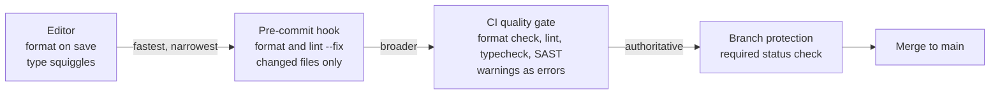

# Static analysis, linters, and formatters

## Why this matters

It's a Tuesday afternoon and a payment webhook handler is throwing in production. The on-call engineer pulls the logs: `TypeError: Cannot read properties of undefined (reading 'amount')`. The offending line looks innocent — `const total = event.data.object.amount + fee;` — and it shipped three days ago in a routine PR that two people approved. The bug is that `event.data.object` is `undefined` for one of the seven event types the handler subscribes to, and nobody enumerated them. The fix takes four minutes. Finding it took two hours, and it processed a few hundred mis-handled events before anyone noticed.

The maddening part is that a type checker would have refused to compile that line. The webhook payload is a discriminated union; `amount` only exists on three of the seven variants; `tsc` with `strictNullChecks` flags `object` as possibly `undefined` and the property access as an error. The bug never reaches review, never reaches CI, never reaches production. It dies on the developer's laptop with a red squiggle, the cheapest place a bug can possibly die.

That is the entire economics of static analysis. A bug found by a linter or type checker costs seconds. The same bug found in code review costs a reviewer's attention and a round-trip. Found in CI it costs a pipeline run. Found in staging it costs a deploy. Found in production it costs an incident, a postmortem, and the trust of whoever was on the receiving end. Static analysis is the only quality gate that runs before the code is even saved, and it is the only one that scales to every line you write without a human in the loop. This chapter is about treating it as a hard gate, not a suggestion.

## Mental model

Three distinct tools get lumped together as "linting," and conflating them is the first mistake. They answer different questions, run at different points, and have different authority over your merge.

| Tool | Question it answers | Wrong-vs-right axis | Example |
|---|---|---|---|
| **Formatter** | How should this code *look*? | No semantic opinion; purely layout | Prettier, Black, gofmt, `ruff format` |
| **Linter** | Is this code *suspicious or unidiomatic*? | Heuristic; may have false positives | ESLint, Ruff, Clippy, golangci-lint |
| **Type checker** | Is this code *provably type-correct*? | Sound(ish); a pass is a real guarantee | TypeScript `tsc`, mypy, pyright |
| **SAST** | Does this code have a *security flaw*? | Taint/pattern analysis; tuned for security | Semgrep, CodeQL, Bandit |

A formatter has zero opinions about correctness — it rewrites whitespace and never changes behavior, so it can run on every save with full auto-fix and you never argue about it. A linter encodes accumulated wisdom ("you wrote `==` where you almost certainly meant `===`") and lives on a spectrum from mechanical to heuristic. A type checker is the only one of the four that proves something: when `tsc` passes under `strict`, a whole class of `undefined`-shaped runtime errors is genuinely impossible. SAST is a linter specialized for security, usually with data-flow (taint) analysis that tracks untrusted input from source to sink.

These tools form a sequence of gates, each cheaper and earlier than the one after it. The leftmost gate is the fastest and narrowest — it runs in your editor on a single file as you type. The rightmost is the slowest and broadest — it runs the full ruleset across the whole repo, and it is the only one nobody can skip:



The design principle: each gate should catch as much as possible as early as possible, but the *authoritative* gate is CI, because it's the only one a developer cannot skip. Local hooks improve the experience; the CI check enforces the contract. Never rely on a hook alone — `git commit --no-verify` exists and people use it at 5pm on a Friday.

## In practice

### A bug a type checker catches before runtime

Start with the webhook bug from the opening, reduced. Here is the wrong version that compiles in a loose setup and crashes at runtime:

```typescript
// types.ts
type WebhookEvent =
  | { type: "payment.succeeded"; data: { amount: number; currency: string } }
  | { type: "payment.failed"; data: { reason: string } }
  | { type: "customer.created"; data: { email: string } };

// handler.ts — the bug
function handle(event: WebhookEvent) {
  // assumes every event has `data.amount`
  const total = event.data.amount + 100;
  console.log(`Charged ${total}`);
}
```

With `strict` mode on, `tsc` rejects this before you can run it:

```text
handler.ts:4:31 - error TS2339: Property 'amount' does not exist on type
'{ amount: number; currency: string } | { reason: string } | { email: string }'.
  Property 'amount' does not exist on type '{ reason: string }'.
```

The compiler forces you to discriminate on the union, and the right version is exhaustive:

```typescript
function handle(event: WebhookEvent) {
  switch (event.type) {
    case "payment.succeeded":
      console.log(`Charged ${event.data.amount + 100}`);
      break;
    case "payment.failed":
      console.warn(`Failed: ${event.data.reason}`);
      break;
    case "customer.created":
      console.log(`New customer ${event.data.email}`);
      break;
    default: {
      // exhaustiveness check: if a new variant is added to the union
      // and not handled here, this line fails to compile.
      const _exhaustive: never = event;
      throw new Error(`Unhandled event: ${JSON.stringify(_exhaustive)}`);
    }
  }
}
```

The `never` trick is the load-bearing part. Add a fourth event type to the union next quarter and forget to handle it, and `tsc` points at this exact line: the new variant is no longer assignable to `never`, and you get a compile error precisely at the place you'd otherwise have shipped an unhandled case. That is a regression caught at the moment it's introduced, by the type system, with no test written for it. No example-based test gives you that for free, because a test can only check the cases someone remembered to write.

### Configure strictness, then treat warnings as errors

The single highest-leverage config change in a TypeScript codebase is turning on `strict`. It bundles `strictNullChecks`, `noImplicitAny`, and several others under one flag. Add `noUncheckedIndexedAccess` for array and record safety — without it, `arr[i]` is typed as `T` even though it can be `undefined` at runtime, which is the array-shaped twin of the webhook bug:

```jsonc
// tsconfig.json
{
  "compilerOptions": {
    "strict": true,
    "noUncheckedIndexedAccess": true,
    "noImplicitOverride": true,
    "noFallthroughCasesInSwitch": true,
    "verbatimModuleSyntax": true
  }
}
```

A linter is only a gate if a warning fails the build. Warnings that don't fail anything are noise that everyone learns to ignore — the codebase accretes hundreds of them and the signal is gone. Run the linter in CI with a zero-tolerance flag:

```bash
# ESLint: fail on any warning, not just errors
eslint . --max-warnings 0

# Ruff (Python): lint + format check in one fast pass
ruff check .
ruff format --check .

# mypy: strict type checking
mypy --strict src/

# tsc: type check only, no emit
tsc --noEmit
```

The flat ESLint config (the `eslint.config.js` format, default since ESLint 9) with type-aware rules:

```javascript
// eslint.config.js
import tseslint from "typescript-eslint";

export default tseslint.config(
  ...tseslint.configs.strictTypeChecked,
  {
    languageOptions: {
      parserOptions: { projectService: true },
    },
    rules: {
      "@typescript-eslint/no-floating-promises": "error", // unawaited promises
      "@typescript-eslint/no-misused-promises": "error",
      "no-console": "warn",
    },
  },
);
```

`no-floating-promises` alone earns its keep: an unawaited `async` call that silently swallows a rejection is one of the most common and hardest-to-spot bugs in Node services. The code looks correct, the happy path works, and the error only surfaces under a failure that never happened in testing. It is a pure static-analysis catch — the linter sees a `Promise` that is created and then dropped on the floor, and there is no runtime test you can write that reliably reproduces the dropped rejection.

### Formatting: end the debate

Pick a formatter, commit its config, and never discuss brace placement in a PR again. The point of an opinionated formatter (Prettier, Black, gofmt) is that it has *no options worth arguing about*. Style review comments are pure waste: they cost a reviewer's time, they generate back-and-forth, and they have zero correctness value. Hand all of it to a tool. Run the formatter as a check in CI and as an auto-fix locally:

```jsonc
// .prettierrc.json
{ "semi": true, "singleQuote": false, "trailingComma": "all" }
```

```bash
prettier --check .   # CI: fails if anything is unformatted
prettier --write .   # local: rewrites in place
```

For Python, `ruff` now does both linting and formatting in a single binary fast enough to run on every keystroke, which is why it has largely displaced the older `flake8` + `black` + `isort` stack in new projects. The win is not only speed — it is having one tool, one config, and one source of truth, instead of three tools that can disagree.

### Auto-fix on commit, enforce in CI

Wire formatting and safe lint fixes into a pre-commit hook so most issues are fixed before they're even committed. With `husky` + `lint-staged`, run tools only on staged files so the hook stays fast — a hook that lints the whole repo on every commit gets disabled within a week:

```jsonc
// package.json
{
  "lint-staged": {
    "*.{ts,tsx}": ["eslint --fix --max-warnings 0", "prettier --write"],
    "*.{json,md,css}": ["prettier --write"]
  }
}
```

```bash
# .husky/pre-commit
npx lint-staged
```

The Python ecosystem's `pre-commit` framework does the same across languages with a single declarative file:

```yaml
# .pre-commit-config.yaml
repos:
  - repo: https://github.com/astral-sh/ruff-pre-commit
    rev: v0.6.0  # pin to the latest released tag
    hooks:
      - id: ruff
        args: [--fix]
      - id: ruff-format
```

Then the CI job is the authority. The hook can be bypassed; this cannot:

```yaml
# .github/workflows/quality.yml
name: Quality gate
on: [pull_request]
jobs:
  static-analysis:
    runs-on: ubuntu-latest
    steps:
      - uses: actions/checkout@v4
      - uses: actions/setup-node@v4
        with: { node-version: "22", cache: "npm" }
      - run: npm ci
      - run: npx prettier --check .
      - run: npx eslint . --max-warnings 0
      - run: npx tsc --noEmit
      - run: npx semgrep --config auto --error
```

Make `static-analysis` a required status check in branch protection (Part 3) and the gate is real: no PR merges to `main` with a type error, a lint warning, or an unformatted file. The same machinery that the version-control chapters use to require reviews is what turns "we should run the linter" into "you cannot merge without it."

> **Security note:** SAST belongs in the same gate. Tools like Semgrep and CodeQL do taint analysis — tracking untrusted input from a *source* (an HTTP request body) to a *sink* (a SQL string, a shell command, `dangerouslySetInnerHTML`). A rule that flags string-concatenated SQL catches injection bugs that no formatter and few linters would. Run SAST on every PR and gate on it, but tune the ruleset: an over-noisy security scanner gets the same fate as a noisy linter — universally ignored. Start with the curated default ruleset, suppress false positives inline with a reviewed comment, and fail the build only on high-confidence findings.

## Pitfalls and anti-patterns

**1. Warnings that don't fail the build.** A "warning" with no enforcement is documentation nobody reads. Codebases accumulate thousands of them and the one warning that matters drowns. *Recognize it* when your lint output scrolls for pages and people say "oh, those are always there." *Fix it* by running with `--max-warnings 0` (or the equivalent) in CI, fixing the existing backlog in one focused PR, and from then on every warning is a build failure. There are only two states a rule should have: off, or error.

**2. Suppression by reflex.** When a developer's instinct on seeing a lint error is to reach for `// eslint-disable-next-line`, `# type: ignore`, or `as any`, the gate has become theater. *Recognize it* by grepping the repo — a rising count of blanket suppressions is the tell. *Fix it* by requiring every suppression to name the specific rule and carry a one-line justification (`// eslint-disable-next-line no-floating-promises -- fire-and-forget telemetry, failure is non-fatal`), and by failing CI on bare `as any` via the `no-explicit-any` rule. A suppression should be a deliberate, reviewed exception, not a keystroke.

**3. The big-bang adoption that never lands.** Turning on `strict` mode or a new ruleset across a large legacy codebase surfaces thousands of errors at once, the PR is unreviewable, it rots, and the initiative dies. *Recognize it* as the "thousands of errors" PR that's been open for three weeks. *Fix it* with the ratchet pattern: enable the rule, baseline the existing violations to a snapshot file (TypeScript's `tsc` plus a baseline tool, mypy's baseline support, or ESLint's suppressions file), fail CI on any *new* violation, and burn down the baseline incrementally. The codebase only ever gets cleaner, and feature work never blocks on the cleanup.

**4. Format wars and lint overlap.** Configuring ESLint stylistic rules (semicolons, quotes, indentation) *and* Prettier means the two fight, producing infinite-loop fixes and noisy diffs. *Recognize it* when `--fix` and `--write` undo each other. *Fix it* by giving formatting entirely to the formatter and disabling all stylistic lint rules — modern `typescript-eslint` configs already exclude them, and the standalone `eslint-config-prettier` turns off any that remain. Linters check logic; formatters check layout; they must not overlap.

**5. Type checking that lies — the `any` escape hatch.** A codebase can be nominally "strict" while riddled with `any`, which disables all checking at every point it touches and silently propagates through every expression it flows into. *Recognize it* by running `tsc` with `--noErrorTruncation` or a coverage tool like `type-coverage` and finding a low typed-percentage. *Fix it* by banning explicit `any` (use `unknown` and narrow), enabling `noImplicitAny`, and treating `any` at a trust boundary (a parsed JSON blob, an untyped library) as a place to write a validator (Zod, Pydantic) that produces a real type — not as a place to give up.

## Production checklist

- [ ] Formatter (Prettier / Black / `ruff format` / gofmt) configured, committed, and run as a `--check` gate in CI
- [ ] Type checker in `strict` mode (`tsc --noEmit` / `mypy --strict`) as a required CI step
- [ ] `noUncheckedIndexedAccess` (TS) or equivalent enabled for index-access safety
- [ ] Linter runs with `--max-warnings 0`; every rule is either off or error, never a silent warning
- [ ] `no-floating-promises` (or language equivalent) enabled — unhandled async is a build failure
- [ ] Explicit `any` / blanket suppressions banned; exceptions require a named rule and a justification comment
- [ ] SAST (Semgrep / CodeQL) on every PR, gating on high-confidence findings, with a tuned ruleset
- [ ] Pre-commit hook (`husky` + `lint-staged` or `pre-commit`) auto-fixes formatting and safe lint issues on changed files only
- [ ] CI quality job is a **required status check** in branch protection — local hooks are convenience, CI is authority
- [ ] Legacy adoption uses a baseline/ratchet so new violations fail while the backlog burns down
- [ ] Tool versions pinned (lockfile + pinned action/hook revs) so the gate is reproducible across machines and time

## Exercises

1. **(Comprehension)** Take the discriminated-union `WebhookEvent` example. Without running it, explain exactly which line `tsc --strict` rejects in the buggy `handle` function and why, and explain what the `const _exhaustive: never = event` line guarantees that a unit test does not. Then add a fourth event variant to the union and describe the compiler error the exhaustiveness check produces.

2. **(Applied)** In a real project, add a CI job that runs format-check, lint with `--max-warnings 0`, and a strict type check, and make it a required status check on `main`. Then deliberately introduce three bugs — an unformatted file, a lint violation (e.g. an unawaited promise), and a type error — open a PR, and confirm the merge button is blocked. Wire up a `lint-staged` pre-commit hook that auto-fixes the first two locally, and verify a clean commit no longer trips CI.

3. **(Design)** You inherit a 300k-line JavaScript codebase with no type checking and a linter whose thousands of warnings everyone ignores. Design a 90-day plan to reach `strict` TypeScript and a zero-warning lint gate without ever blocking feature work or opening an unreviewable mega-PR. Specify the ratchet mechanism, how you baseline existing violations, the order you'd enable rules in, how you'd measure progress, and what you'd tell a skeptical product manager about why the first month produces no visible features.

## Further reading

- TypeScript Handbook, ["The `strict` family of compiler flags"](https://www.typescriptlang.org/tsconfig#strict) — the official reference for every compiler-strictness flag and what it buys you
- typescript-eslint, [Linting with Type Information](https://typescript-eslint.io/getting-started/typed-linting/) — how type-aware lint rules work and why they're worth the extra cost
- Dawson Engler et al., ["Bugs as Deviant Behavior"](https://web.stanford.edu/~engler/deviant-sosp-2001.pdf) (SOSP 2001) — the seminal paper showing static analysis finding real kernel bugs by inferring rules from the code itself
- [Semgrep documentation](https://semgrep.dev/docs/) — pattern- and taint-based SAST, with the rule-writing model that makes it tunable
- [Ruff documentation](https://docs.astral.sh/ruff/) — the unified Python lint+format toolchain and its rule taxonomy
- Brett Slatkin, *Effective Python* (2nd ed.), items on type annotations and `mypy` — the pragmatic case for gradual typing in a dynamic language

> **Connect the dots:** Static analysis is the first and cheapest layer of the testing pyramid from the start of this Part — it catches the bugs that unit tests shouldn't have to. The CI gate described here is enforced through the branch-protection and required-status-check machinery from Part 3 (Version Control), and the SAST layer is the shift-left edge of the security practices you'll see in the security Part. The principle is the same one that runs through the whole book: push every check as early and as automated as it will go.
