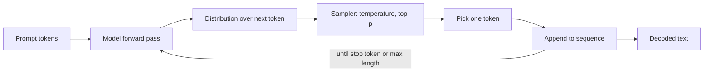

# LLM fundamentals for application engineers

## Why this matters

It's a Tuesday afternoon, two days before launch. Your team built a feature that asks the model to extract an invoice total from a PDF and write it to the billing table. In the demo it works perfectly: "The total is $1,240.00." Everyone claps. You ship.

Wednesday, a customer's invoice comes through and the model returns "The total is approximately $1,240, though you should verify against line items." Your code did `float(response.split("$")[1])` and threw a `ValueError` on the comma and the word "approximately." Thursday, a different invoice returns a confident, well-formatted total of `$0.00` — because the PDF was a scanned image the model couldn't read, and instead of saying so, it guessed. Nobody noticed until finance asked why three accounts showed zero balances.

None of these were bugs in the usual sense. The model did exactly what it does: it generated the most probable continuation of your prompt, in natural language, with no obligation to be parseable, consistent, or correct. The gap this chapter closes is the one between "the demo worked" and "I understand the machine well enough to build on it." An LLM is not a function that returns answers. It is a probability distribution over next tokens that you sample from, and once you hold that one idea clearly, the non-determinism, the hallucinations, the formatting drift, and the defensive code you need around all of it stop being surprises and become design constraints you plan for.

## Mental model

A large language model is an autoregressive next-token predictor. You give it a sequence of tokens; it produces a probability distribution over what the next token should be; a sampler picks one; the chosen token is appended to the sequence; and the whole thing repeats until a stop condition. That loop is the entire interface. Everything else — chat, tool calls, JSON output, reasoning — is that loop dressed up.



Three consequences fall directly out of this picture, and they drive almost every decision you'll make as an application engineer:

**Text is tokens, not characters or words.** Before anything runs, your text is split into tokens — subword chunks from a fixed vocabulary. "tokenization" might be one token; "antidisestablishmentarianism" might be several; a Chinese character or an emoji might be several. This is why you're billed per token, why the context window is measured in tokens, and why "count the characters" is the wrong way to estimate cost or fit.

**There is a finite context window.** The model can only attend to a bounded number of tokens at once — the sum of your input and its output. Modern models stretch to hundreds of thousands of tokens, but the window is still finite, attention cost grows with it, and quality often degrades for facts buried in the middle of a very long context. Your prompt, the retrieved documents, the conversation history, and the model's reply all compete for the same budget.

**Output is sampled, so it is non-deterministic by default.** At each step the model emits *logits* — raw scores for every token in the vocabulary — which `softmax` turns into probabilities. The sampler then chooses. **Temperature** rescales the distribution before sampling: low temperature sharpens it toward the single most probable token (more deterministic, more repetitive); high temperature flattens it (more varied, more prone to going off the rails). **Top-p** (nucleus sampling) restricts the choice to the smallest set of tokens whose probabilities sum to *p*, cutting off the long tail of unlikely tokens. Not every model exposes these knobs — some newer models fix the sampling policy and reject `temperature`/`top_p` outright — but the underlying mechanism is the same everywhere. Even greedy decoding (always take the single most probable token) is not guaranteed identical across calls: floating-point non-associativity across hardware and batched inference means greedy is "almost always the same," not "provably identical."

The hardest thing to internalize: the model has no notion of truth, no database it consults, and no awareness of what it doesn't know. It has learned which tokens tend to follow which other tokens. A fluent, confident, correctly-formatted answer and a fluent, confident, completely fabricated one are produced by the exact same mechanism and look identical from the outside. The model also has a **knowledge cutoff** — it knows nothing about events after its training data ends — and will happily generate plausible-sounding claims about things it cannot know. Treat the model as a brilliant, fast, extremely well-read intern who never says "I'm not sure" unless you explicitly build a way for them to.

## In practice

### A minimal API call

Here is the smallest useful call against a modern chat model. The shape is the same across providers; this uses the Anthropic Python SDK.

```python
import anthropic

client = anthropic.Anthropic()  # reads ANTHROPIC_API_KEY from env

resp = client.messages.create(
    model="claude-opus-4-8",        # use the latest capable model your provider offers
    max_tokens=512,                 # hard cap on OUTPUT tokens
    system="You extract structured data. Reply with JSON only.",
    messages=[
        {"role": "user", "content": "Invoice total is $1,240.00. Return {\"total_usd\": number}."}
    ],
)

# resp.content is a list of blocks; pull the first text block.
print(next(b.text for b in resp.content if b.type == "text"))
print(resp.usage)   # input_tokens / output_tokens — this is what you pay for
```

Two things to note before we go further. `max_tokens` limits the *output*, and the model can hit that ceiling mid-sentence — truncation is a normal, expected outcome you must handle, not an error. And `resp.usage` is your ground truth for cost and context budgeting; log it on every call.

### Counting tokens before you send

Never guess token counts from string length. Count them.

```python
# Provider-side count (most accurate; one network call):
count = client.messages.count_tokens(
    model="claude-opus-4-8",
    system="You extract structured data. Reply with JSON only.",
    messages=[{"role": "user", "content": some_long_document}],
)
print(count.input_tokens)
```

Token counts are model-specific — different model families tokenize the same text differently, so always pass the model you'll actually call. For OpenAI-family models the local equivalent is `tiktoken`; for open-weight models, the tokenizer ships with the model. The point is the same: know your token count *before* you send, so you can reject or chunk inputs that won't fit instead of discovering it at request time.

### The naive way: trust the output

This is the code from the launch story. It is the most common LLM integration mistake, and it looks completely reasonable.

```python
# ANTI-PATTERN — do not ship this
def get_total(invoice_text: str) -> float:
    resp = client.messages.create(
        model="claude-opus-4-8",
        max_tokens=256,
        messages=[{"role": "user",
                   "content": f"What is the total on this invoice?\n\n{invoice_text}"}],
    )
    text = resp.content[0].text
    return float(text.split("$")[1])   # this will bite you
```

Every assumption here is wrong. It assumes the reply contains a `$`. It assumes exactly one. It assumes what follows is a clean float (it won't survive `"1,240.00"`, `"approximately 1,240"`, or `"1240 USD"`). It assumes the model read the data at all rather than guessing. And because the prompt asked an open question in natural language, the model's most probable continuation is a *sentence*, not a number.

### The defensive way: constrain, validate, and verify

Fix it in layers. First, constrain the output to a schema the model is told to honor. Second, parse defensively and validate against a real schema. Third, give the model an explicit, machine-checkable way to say "I couldn't determine this" so a failure to read is not silently rendered as a confident number.

```python
import json
from pydantic import BaseModel, ValidationError

class InvoiceResult(BaseModel):
    total_usd: float | None      # None is a legal, meaningful answer
    confident: bool              # did the model actually find it?

SYSTEM = """You extract the invoice total. Return ONLY a JSON object:
{"total_usd": <number or null>, "confident": <true|false>}
If the total is not clearly present, set total_usd to null and confident to false.
Do not guess. Do not add commentary."""

def get_total(invoice_text: str) -> InvoiceResult:
    resp = client.messages.create(
        model="claude-opus-4-8",
        max_tokens=256,
        system=SYSTEM,
        messages=[{"role": "user", "content": invoice_text}],
    )

    if resp.stop_reason == "max_tokens":
        raise RuntimeError("Output truncated; raise max_tokens or shrink input")

    raw = next(b.text for b in resp.content if b.type == "text").strip()
    try:
        data = json.loads(raw)
        result = InvoiceResult.model_validate(data)
    except (json.JSONDecodeError, ValidationError) as e:
        # The model broke the contract. Fail loudly; do not fall back to a guess.
        raise ValueError(f"Unparseable model output: {raw!r}") from e

    if not result.confident or result.total_usd is None:
        raise ValueError("Model could not confidently extract a total")

    return result
```

The defensive version is longer, and that is the point. The extra lines encode the things the model will not do for you: guarantee structure, admit uncertainty, and stay within your token budget. Many providers also support a *structured output* or *tool-calling* mode that constrains the decoding to valid JSON conforming to a schema — prefer that over free-text-plus-`json.loads` when it's available, because it removes the "model emitted prose around the JSON" failure mode entirely. But even with enforced JSON, you still validate, because schema-valid does not mean *correct* — `{"total_usd": 0.0, "confident": true}` can be schema-valid and wrong.

> **Connect the dots:** Treat the model like any untrusted upstream service from Part 7 (System Design) and Part 5 (Backend): validate at the boundary, set timeouts and retries with backoff, and never let an unvalidated response flow into your database (Part 6). The model is a probabilistic dependency with a non-trivial error rate — give it the same circuit breakers, fallbacks, and schema validation you'd give a flaky third-party API.

### Choosing the sampling policy deliberately

When your model and provider expose sampling controls, set them on purpose for every call rather than leaving them at the default.

- **Extraction, classification, routing, anything you'll parse:** the most deterministic, most stable setting your model offers (e.g. `temperature=0` where supported). You want the single most probable answer.
- **Drafting prose, brainstorming, generating variations:** a higher temperature (often `0.7–1.0`). You want spread.
- **Almost never push temperature above ~1.0 in production** — past that the tail tokens get enough mass to produce genuinely broken output.

Some newer models remove these parameters entirely and decide sampling internally; with those you steer behavior through the prompt instead. Either way, do not assume identical output across calls — as noted, even greedy decoding is "nearly" deterministic, not "exactly." For tasks that must be auditable, pin whatever sampling controls your provider exposes and record the model version alongside the result.

## Pitfalls and anti-patterns

**1. Trusting confident output (the hallucination trap).** The model's tone of certainty carries zero information about correctness. *Recognize it* when a number, citation, API name, or fact looks plausible but you never verified it against a source. *Fix it* by grounding the model in provided data (retrieval, Part 12's RAG chapter), giving it an explicit "I don't know" escape hatch, and verifying any factual claim that has real-world consequences against an authoritative source before acting on it.

**2. Estimating cost and context by character or word count.** *Recognize it* when your "this fits in the window" math is off, requests fail with context-length errors, or your bill is higher than your estimate. Tokenization is non-linear: code, JSON, non-English text, and unusual strings tokenize denser than plain English prose. *Fix it* by counting tokens with the real tokenizer (`count_tokens`, `tiktoken`, or the model's own tokenizer) and logging `usage` on every call.

**3. Assuming determinism.** *Recognize it* when a regression test asserts exact string equality on model output and flakes intermittently, even with sampling pinned to its most deterministic setting. *Fix it* by testing properties, not exact strings — assert the JSON parses, the schema validates, the number is in range, the answer contains the required field — and run evals over a set of cases with pass thresholds (Part 11, Testing; Part 12's Evals chapter) rather than golden-string snapshots.

**4. Ignoring the knowledge cutoff and treating the model as a live database.** *Recognize it* when the model confidently describes a library version, price, person, or event it could not possibly know about, or invents a function that doesn't exist. *Fix it* by supplying current facts in the prompt (retrieval or tool calls) and never relying on the model's parametric memory for anything time-sensitive or verifiable.

**5. Silently swallowing truncation and refusals.** *Recognize it* when output is valid JSON that's cut off mid-array, or when the model returns a polite refusal that your parser treats as data. *Fix it* by always checking `stop_reason` / `finish_reason`: handle `max_tokens` (truncation) and refusal/safety stops as distinct, explicit branches — never let them fall through to your happy path.

## Production checklist

- [ ] Pin `model` and `max_tokens` explicitly on every call, and pin any sampling controls your provider exposes — no relying on SDK defaults
- [ ] Count tokens before sending; reject or chunk inputs that exceed your budget
- [ ] Log `usage` (input/output tokens) and `stop_reason` for every request, with a request id
- [ ] Validate every response against a schema (Pydantic / zod) before it touches your system
- [ ] Give the model an explicit, machine-checkable "unknown / not found" path; never let "couldn't determine" render as a confident value
- [ ] Use structured-output / tool-calling mode for anything you parse, when the provider supports it
- [ ] Handle `max_tokens` truncation and safety refusals as distinct, explicit error branches
- [ ] Set timeouts, retries with exponential backoff, and a fallback path for the model API like any other network dependency
- [ ] Test with property/eval assertions, not exact-string snapshots
- [ ] Never put secrets, raw PII, or untrusted user content into a prompt without review (see Security note)

## Exercises

1. **(Comprehension)** Take one paragraph of English prose, one block of minified JSON, and one line of a non-Latin-script language of roughly equal *character* count. Run each through `count_tokens` (or `tiktoken`). Explain why the token counts differ so much, and what that implies for estimating the cost of a multilingual or code-heavy product.

2. **(Applied)** Rewrite the naive `get_total` from this chapter for a *new* extraction task of your choosing (e.g. pulling a shipping address from an email). Build the full defensive stack: a constrained system prompt, a Pydantic schema with a nullable "not found" path, `stop_reason` handling, and validation. Then feed it three adversarial inputs — one clean, one ambiguous, one where the field is genuinely absent — and confirm each is handled without throwing an unhandled exception or fabricating a value.

3. **(Design)** You're building a customer-facing support assistant on top of an LLM. Design the boundary between the model and your system: where do you validate, where do you ground the model in real data versus letting it answer from parametric memory, how do you detect and contain hallucinations before they reach a user, and how do you make outputs reproducible enough to debug a complaint a week later? Name the tradeoffs (latency, cost, quality) for each choice and state your defaults.

## Further reading

- Vaswani et al., ["Attention Is All You Need"](https://arxiv.org/abs/1706.03762) — the transformer paper; the architecture under every model in this Part.
- Holtzman et al., ["The Curious Case of Neural Text Degeneration"](https://arxiv.org/abs/1904.09751) — introduces nucleus (top-p) sampling and explains *why* pure greedy and high-temperature decoding both fail.
- Anthropic, [Messages API documentation](https://docs.anthropic.com/en/api/messages) — request/response shape, `stop_reason`, token counting, and structured output.
- OpenAI, [tiktoken](https://github.com/openai/tiktoken) — the byte-pair-encoding tokenizer; read the README to see how text becomes tokens.
- Liu et al., ["Lost in the Middle: How Language Models Use Long Contexts"](https://arxiv.org/abs/2307.03172) — empirical evidence that facts buried in the middle of a long context are recalled worst.
- Ji et al., ["Survey of Hallucination in Natural Language Generation"](https://arxiv.org/abs/2202.03629) — a taxonomy of how and why models fabricate.

> **Security note:** Everything you put in a prompt is attack surface. **Prompt injection** — instructions hidden inside data the model reads (a web page, a PDF, an email, a tool result) — can override your system prompt and make the model exfiltrate data or call tools maliciously; treat all model input that originated from outside your trust boundary as untrusted, and never let model output directly trigger a privileged action without validation (Part 10, Security). **Do not paste secrets, credentials, or raw customer PII into prompts**: they may be logged by the provider, retained, or surfaced in a later completion. Redact or tokenize PII before it leaves your system, prefer providers and plans with explicit no-training / zero-retention guarantees for sensitive workloads, and assume any data in a prompt could end up in an output you don't control.
