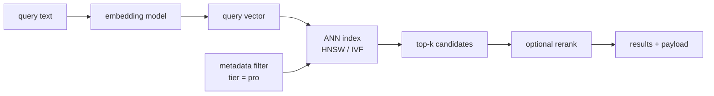
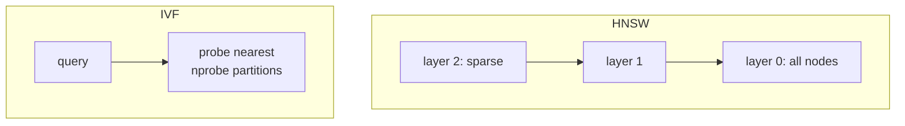

# Vector databases

## Why this matters

It's Tuesday afternoon and your RAG-powered support assistant just told a customer that their Enterprise plan includes a feature it doesn't. You trace the bug back through the chain. The prompt was fine. The model was fine. The problem was retrieval: the query "can I export to CSV on the Pro tier?" pulled back a chunk about the *Enterprise* tier's export feature, because both chunks talk about exporting and the embedding model put them right next to each other in vector space. Your metadata filter for `tier = "pro"` never fired, because you stored the embeddings in a flat NumPy array and filtered in Python *after* taking the top-k. By the time the filter ran, the right chunk was already off the list.

That's the failure mode that pushes teams toward a real vector database. When you have a few thousand vectors, a brute-force cosine scan in NumPy is genuinely fine, and reaching for Pinecone is over-engineering. But the moment you need approximate-nearest-neighbor search over millions of vectors, *with* metadata filters applied during the search, *with* a hybrid of semantic and keyword matching, *with* fresh inserts and deletes happening live — you're building a small database. You can build it badly yourself or use a system that does it well.

The engineers who treat the vector store as "just where the embeddings go" ship demos that fall apart at scale and leak data across tenants. The ones who understand what the index is actually doing — the recall/latency tradeoff they're dialing, why filtering interacts with the index, when cosine beats dot product — make deliberate choices and debug retrieval the way they'd debug a SQL query. This chapter is that bridge.

## Mental model

A vector database does one core job: given a query vector, find the stored vectors closest to it, fast. "Closest" is defined by a **distance metric**. "Fast" means it does *not* compare your query against every stored vector — that's the exact (brute-force) approach, which is O(N) per query and dies at scale. Instead it uses an **Approximate Nearest Neighbor (ANN) index** that trades a little recall for a lot of speed.

Everything else a vector DB offers — metadata filtering, hybrid search, replication, multi-tenancy — is bookkeeping and machinery built around that core ANN search.



**Distance metrics.** Three show up everywhere:

| Metric | Formula intuition | Use when |
|---|---|---|
| **Cosine** | angle between vectors, ignores magnitude | text embeddings (the default; most embedding models are trained for it) |
| **Dot product** | cosine × magnitudes | vectors are already normalized, or magnitude carries meaning |
| **L2 (Euclidean)** | straight-line distance | image/spatial embeddings where magnitude matters |

A crucial fact: if your vectors are L2-normalized (length 1), cosine, dot product, and L2 rank results *identically*. Many embedding APIs return normalized vectors, so the metric choice often collapses to "match what the model was trained with." Check your model card; for most modern text embedding models, that's cosine.

**Two index families** dominate, and the distinction matters when you tune:

- **HNSW** (Hierarchical Navigable Small World) builds a multi-layer graph where each node links to nearby neighbors. Search starts at a sparse top layer and greedily descends, narrowing in on the target region. It's the default in pgvector, Qdrant, and Weaviate because it gives excellent recall at low latency. The cost is memory (the graph lives in RAM) and slower inserts.
- **IVF** (Inverted File) clusters vectors into `nlist` partitions via k-means, then at query time searches only the `nprobe` nearest partitions. It uses less memory and indexes faster, but recall depends heavily on `nprobe`, and it needs a representative sample to train the clusters.



The mental shortcut: **HNSW for low-latency, high-recall search where you can afford the RAM; IVF when memory or index-build time is the binding constraint.** HNSW's key knobs are `m` (links per node) and `ef_construction`/`ef_search` (how wide the candidate beam is). Bigger `ef_search` means better recall and higher latency. That knob *is* the recall/latency tradeoff, exposed.

## In practice

### Brute force first — know when you don't need a database

For a few thousand vectors, this is the right answer, and it has zero operational cost:

```python
import numpy as np

# embeddings: (N, d) matrix, already L2-normalized; query: (d,) normalized
def top_k(query: np.ndarray, embeddings: np.ndarray, k: int = 5):
    scores = embeddings @ query          # cosine == dot product when normalized
    idx = np.argpartition(-scores, k)[:k]
    return idx[np.argsort(-scores[idx])]
```

If your corpus fits in RAM, rarely changes, and you don't need cross-process concurrency or live metadata filtering, ship this. Don't add infrastructure to solve a problem you don't have.

### pgvector: the database you probably already run

If you're already on Postgres (Part 6), `pgvector` lets you keep embeddings *next to* your relational data, so metadata filtering is just a `WHERE` clause and you keep transactions, backups, and joins. For most teams under tens of millions of vectors, this is the pragmatic default.

```sql
CREATE EXTENSION IF NOT EXISTS vector;

CREATE TABLE doc_chunks (
    id          bigserial PRIMARY KEY,
    tier        text NOT NULL,
    content     text NOT NULL,
    embedding   vector(1536)        -- match your embedding model's dimension
);

-- HNSW index. vector_cosine_ops picks the cosine metric.
CREATE INDEX ON doc_chunks
    USING hnsw (embedding vector_cosine_ops)
    WITH (m = 16, ef_construction = 64);
```

The query that fixes the opening bug — the filter and the ANN search happen *together*, in one engine:

```sql
SET hnsw.ef_search = 100;            -- recall/latency knob, per session

SELECT id, content, 1 - (embedding <=> :query_vec) AS similarity
FROM   doc_chunks
WHERE  tier = 'pro'                  -- metadata filter, applied by the planner
ORDER  BY embedding <=> :query_vec   -- <=> is cosine distance
LIMIT  5;
```

The `<=>` operator is cosine distance (`<#>` is negative inner product, `<->` is L2). One subtlety to understand, not memorize: with a selective filter Postgres may use the index then filter, or filter then scan exactly, depending on the planner's estimate. On highly selective filters HNSW can return fewer than `k` rows that pass the filter, hurting recall. pgvector's `iterative_scan` setting (and partitioning by tenant) addresses this — exactly the kind of thing a flat NumPy array can't.

Calling it from Python:

```python
import psycopg
from pgvector.psycopg import register_vector

conn = psycopg.connect("postgresql://localhost/app")
register_vector(conn)

query_vec = embed("can I export to CSV on the Pro tier?")  # -> list[float], len 1536
rows = conn.execute(
    """
    SELECT content, 1 - (embedding <=> %s) AS similarity
    FROM doc_chunks
    WHERE tier = %s
    ORDER BY embedding <=> %s
    LIMIT 5
    """,
    (query_vec, "pro", query_vec),
).fetchall()
```

### A dedicated vector DB: Qdrant

When you outgrow Postgres — hundreds of millions of vectors, sharding, per-vector payload filtering at high QPS — a purpose-built store earns its keep. Qdrant is a strong open-source default; the API shape is representative of Pinecone and Weaviate too.

```python
from qdrant_client import QdrantClient
from qdrant_client.models import Distance, VectorParams, PointStruct, Filter, FieldCondition, MatchValue

client = QdrantClient(url="http://localhost:6333")

client.create_collection(
    collection_name="doc_chunks",
    vectors_config=VectorParams(size=1536, distance=Distance.COSINE),
)

client.upsert(
    collection_name="doc_chunks",
    points=[PointStruct(id=1, vector=embed(chunk), payload={"tier": "pro", "content": chunk})],
)

# Filtered ANN search — the filter is applied *during* HNSW traversal,
# not after, so recall holds even with selective filters.
hits = client.query_points(
    collection_name="doc_chunks",
    query=embed("can I export to CSV on the Pro tier?"),
    query_filter=Filter(must=[FieldCondition(key="tier", match=MatchValue(value="pro"))]),
    limit=5,
).points
```

The line that matters: dedicated vector DBs build **filterable indexes** so metadata constraints are enforced inside the graph walk. That's the structural reason they beat "embed-then-filter-in-app-code."

### Hybrid search: dense plus keyword

Pure vector search is weak on exact tokens — error codes, SKUs, names, acronyms. "ERR_429" embeds to roughly the same place as "ERR_431." Keyword search (BM25) nails exact matches but misses paraphrase. **Hybrid search** runs both and fuses the rankings, most commonly with Reciprocal Rank Fusion (RRF):

```python
def rrf(dense_ids: list, sparse_ids: list, k: int = 60) -> list:
    """Fuse two ranked lists by reciprocal rank. Higher score = better."""
    scores: dict = {}
    for ranked in (dense_ids, sparse_ids):
        for rank, doc_id in enumerate(ranked):
            scores[doc_id] = scores.get(doc_id, 0) + 1 / (k + rank)
    return sorted(scores, key=scores.get, reverse=True)
```

RRF needs no score normalization between the two systems — it only uses rank position, which is why it's robust and ubiquitous. The `k = 60` constant is the value used in the original RRF paper and the common default. Qdrant and Weaviate support hybrid natively; with pgvector you combine the `<=>` ordering with Postgres full-text search (`tsvector` / `ts_rank`) and fuse in SQL or app code. (This connects directly to the RAG chapter's reranking step — fuse, then optionally rerank the fused top-N with a cross-encoder.)

### Choosing a store

| Store | Sweet spot | Watch out for |
|---|---|---|
| **pgvector** | already on Postgres; up to ~tens of millions of vectors; want SQL joins + transactions | RAM for HNSW; filter/recall interaction on selective filters |
| **Qdrant** | open-source, self-host or cloud; strong payload filtering; Rust performance | you operate it (or pay for managed) |
| **Weaviate** | built-in hybrid + module ecosystem (rerankers, vectorizers) | heavier; opinionated schema |
| **Pinecone** | fully managed, zero-ops, serverless scaling | vendor lock-in; cost at scale; data leaves your infra |

My default for a new team: **start with pgvector** because it removes a moving part and keeps your data in one place. Reach for Qdrant or Pinecone when you've measured a real ceiling — vector count, QPS, or filtering complexity Postgres can't meet — not before.

## Pitfalls and anti-patterns

**1. Filter-after-retrieve.** You take top-k from the index, *then* apply `tier == "pro"` in Python. The right chunk may have ranked 11th and never made the top-10. Recognize it when filtered results feel sparse or wrong despite the data existing. Fix: push the filter into the database so it's applied during the search (pgvector `WHERE`, Qdrant `query_filter`). Never filter in app code after top-k.

**2. Metric mismatch.** You index with L2 but your embedding model was trained for cosine, or you forgot to normalize and used dot product. Results look plausible-but-off — semantically related items rank below noise. Recognize it with a sanity test: a chunk should be its own nearest neighbor with near-perfect similarity. Fix: match the metric to the model card; if unsure, normalize vectors and use cosine.

**3. Dimension and model drift.** You re-embed new documents with a newer embedding model but leave old vectors from the previous model in the same collection. The two live in *incompatible* spaces; distances between them are meaningless. Recognize it as a quality cliff right after a model upgrade. Fix: treat the embedding model as part of the index identity. Re-embed the entire corpus on model change, or version collections per model and never mix.

**4. Forgetting the recall/latency knob exists.** Teams accept default `ef_search`/`nprobe` and then either complain about latency or about poor recall, not realizing it's one tunable dial. Recognize it when "the vector DB is slow" or "retrieval misses obvious matches" with no measurement behind it. Fix: measure recall@k against a brute-force ground truth on a sample, then tune `ef_search` (HNSW) or `nprobe` (IVF) to your latency budget.

**5. Cross-tenant leakage via shared collections.** In multi-tenant apps, storing every customer's vectors in one collection with `tenant_id` in the payload means one missing filter clause leaks tenant A's documents into tenant B's answers — a serious data breach via retrieval. Recognize it in any system where the tenant filter is application-enforced and easy to omit. Fix: prefer hard isolation (per-tenant collection or partition) and make the tenant filter non-optional at the data-access layer (Part 10).

## Production checklist

- [ ] Embedding model and its dimension are pinned and recorded as part of the collection's identity; a model change triggers a full re-embed or a new versioned collection
- [ ] Distance metric matches the embedding model's training objective (cosine for most text models)
- [ ] Metadata filters are applied *inside* the search engine, never after top-k in app code
- [ ] Multi-tenant isolation is enforced at the data layer (per-tenant partition/collection or a mandatory, untrippable filter)
- [ ] `ef_search` / `nprobe` tuned against a measured recall@k vs. latency curve, not left at defaults
- [ ] Recall is monitored in production: log retrieval scores and periodically spot-check against brute-force ground truth (Part 9)
- [ ] Hybrid search enabled where exact tokens matter (codes, SKUs, names); fusion via RRF
- [ ] Inserts/updates/deletes keep the index consistent; stale or orphaned vectors are garbage-collected
- [ ] Index build/memory cost sized for peak vector count, not today's count
- [ ] PII in payloads is governed by the same retention/redaction policy as the source store (Part 10)

## Exercises

1. **(Comprehension)** Take 1,000 normalized embeddings. Compute exact cosine top-5 for a query with a brute-force NumPy scan, then the same query through an HNSW index at `ef_search = 10`, `40`, and `100`. Compute recall@5 (overlap with the exact result) at each setting and explain the trend in terms of the candidate-beam width.

2. **(Applied)** Reproduce the opening bug, then fix it. Load chunks tagged `tier = "pro"` and `tier = "enterprise"` into pgvector. First retrieve top-5 with *no* filter and apply `tier == "pro"` in Python; show a case where the correct Pro chunk is missing. Then move the filter into the SQL `WHERE` clause and show the correct chunk now appears. Explain why.

3. **(Design)** You're designing retrieval for a multi-tenant SaaS: 5,000 tenants, up to 2M vectors each, hard data-isolation requirements, a tight p95 retrieval latency target, and hybrid (semantic + keyword) search. Choose a store and an isolation model (per-tenant collection vs. shared with partition keys vs. namespace-per-tenant). Justify the recall/latency/cost tradeoffs and name what would make you switch stores later.

## Further reading

- Malkov & Yashunin, ["Efficient and robust approximate nearest neighbor search using Hierarchical Navigable Small World graphs"](https://arxiv.org/abs/1603.09320) — the HNSW paper; the source of the index in most vector DBs.
- Johnson, Douze & Jégou, ["Billion-scale similarity search with GPUs"](https://arxiv.org/abs/1702.08734) — the FAISS paper; foundational for IVF and quantization intuition.
- [pgvector documentation](https://github.com/pgvector/pgvector) — index types, operators, `ef_search`/`iterative_scan`, and tuning notes.
- [Qdrant documentation](https://qdrant.tech/documentation/) — filterable HNSW, payload indexing, and hybrid search APIs.
- Cormack, Clarke & Büttcher, ["Reciprocal Rank Fusion outperforms Condorcet and individual rank learning methods"](https://plg.uwaterloo.ca/~gvcormac/cormacksigir09-rrf.pdf) — why RRF is the standard fusion method for hybrid search.

> **Connect the dots:** The recall/latency knob is the same shape of tradeoff you tune everywhere in this book — index vs. write cost in databases (Part 6), cache hit-rate vs. freshness in system design (Part 7). A vector index is just a specialized index; treat it with the same rigor you'd treat a B-tree, and measure before you tune.

> **Security note:** Retrieval is an exfiltration surface. In multi-tenant systems, a missing filter clause leaks one customer's documents into another's answers, and an attacker who can influence stored content can plant text that becomes part of a future prompt (indirect prompt injection via the corpus). Enforce tenant isolation at the data layer, treat retrieved chunks as untrusted input to the model (Part 10), and keep PII in payloads under the same redaction and retention policy as the system of record — embeddings are derived data, not anonymization.
