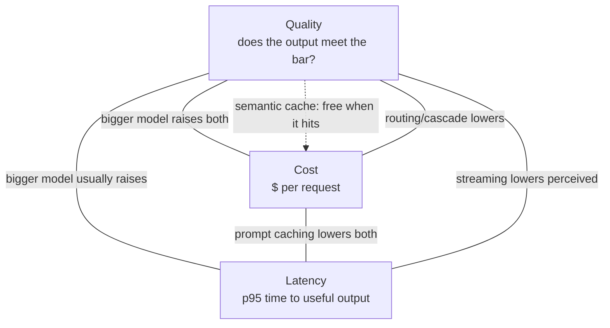

# The cost, latency, and quality triangle

## Why this matters

It's a Tuesday afternoon and your support-triage feature shipped two weeks ago. It works beautifully: every inbound ticket gets classified, summarized, and routed by the latest, most capable model from your provider. Then finance forwards the monthly bill. The feature cost more than the three engineers who built it. Worse, the on-call channel has been quietly filling with complaints that the "instant" summary takes eight seconds to appear, and the p95 is closer to fourteen. The demo never showed this because the demo sent one ticket at a time, on a warm afternoon, with nobody watching the clock.

Here's what actually happened. You sent the entire 6,000-token routing playbook as a fresh system prompt on every single request, so you paid full input price for it tens of thousands of times. You used a frontier model to decide whether a ticket says "I love this" or "this is broken" — a task a model costing a fifth as much does perfectly. And you waited for the complete response before rendering anything, so the user stared at a spinner while 400 output tokens generated one at a time. None of these were bugs. Each was a default that's correct in isolation and ruinous at scale.

This chapter is about the triangle those three failures sit on: **cost**, **latency**, and **quality**. You rarely get to maximize all three. A bigger model raises quality and cost and usually latency. Caching cuts cost and latency but constrains how you structure prompts. Routing cheap-first cuts cost but adds a failure mode where the cheap model gets it wrong. The job of an AI engineer in production is not to pick one corner — it's to know which lever moves which axis, measure the axes honestly, and spend money only where it buys quality a user can feel.

## Mental model

The three properties trade against each other, but not symmetrically. Quality is the one you're usually unwilling to sacrifice past a threshold, so the real game is buying a fixed quality bar at the lowest cost and latency. Almost every production technique is a move on this triangle:



Two distinctions make the rest of the chapter tractable.

**Real latency vs. perceived latency.** Real latency is wall-clock time to the last token. Perceived latency is time until the user sees *something useful*. Streaming attacks the second without touching the first — the total generation time is unchanged, but the user reads along instead of waiting. For a chat UI this is most of the battle. For a batch job that writes to a database, perceived latency is irrelevant and only throughput matters.

**Prefix cost vs. completion cost.** Input tokens (your prompt) and output tokens (the model's reply) are priced separately, and output is typically several times more expensive per token. A long static system prompt is a large *input* cost you pay on every call — and the prime target for caching, because it's identical across requests. A long generated answer is an *output* cost you can only reduce by asking for less or routing to a cheaper model. Knowing which side of the ledger your spend lands on tells you which lever to pull.

The levers, roughly in order of effort-to-payoff: **prompt caching** (cache the static prefix), **streaming** (perceived latency, near-zero effort), **model selection** (match model capability to task difficulty), **routing/cascades** (try cheap, escalate on failure), **semantic caching** (skip the model entirely for near-duplicate requests), and **batching** (trade latency for ~half price on non-urgent work).

## In practice

Let's make the opening disaster concrete, then fix it lever by lever. All examples use the Anthropic Python SDK; the principles transfer to any provider.

### The unoptimized flow

```python
import anthropic

client = anthropic.Anthropic()

ROUTING_PLAYBOOK = open("routing_playbook.md").read()  # ~6,000 tokens, static

def triage(ticket_text: str) -> str:
    resp = client.messages.create(
        model="claude-opus-4-8",          # frontier model for everything
        max_tokens=1000,
        system=f"{ROUTING_PLAYBOOK}\n\nClassify, summarize, and route this ticket.",
        messages=[{"role": "user", "content": ticket_text}],
    )
    return next(b.text for b in resp.content if b.type == "text")
```

Three problems, in the order we'll fix them: the playbook is re-sent uncached every call; the most expensive model handles even trivial tickets; and the caller blocks until the full response lands.

### Lever 1: prompt caching for the static prefix

The playbook is byte-identical on every request. Caching it means you pay the full input price once, then a small fraction of that on every subsequent hit within the cache window. Move the static content into a `system` block with `cache_control`, and keep the volatile content (the ticket) after it:

```python
def triage_cached(ticket_text: str) -> str:
    resp = client.messages.create(
        model="claude-opus-4-8",
        max_tokens=1000,
        system=[
            {
                "type": "text",
                "text": ROUTING_PLAYBOOK,
                "cache_control": {"type": "ephemeral"},  # cache the static prefix
            },
            {"type": "text", "text": "Classify, summarize, and route this ticket."},
        ],
        messages=[{"role": "user", "content": ticket_text}],
    )
    # Verify the cache is actually working:
    u = resp.usage
    print(f"cache_write={u.cache_creation_input_tokens} "
          f"cache_read={u.cache_read_input_tokens} uncached={u.input_tokens}")
    return next(b.text for b in resp.content if b.type == "text")
```

Caching is a **prefix match** — any byte change anywhere before the cache breakpoint invalidates everything after it. The single most common reason a cache silently never hits is a `datetime.now()` or a per-request UUID interpolated into the prefix. After the first request, `cache_read_input_tokens` should be large and `input_tokens` small. If `cache_read_input_tokens` stays zero across identical-prefix calls, something is mutating the prefix; diff the rendered bytes between two requests to find it. (See Part 6 on cache invalidation generally — the prefix-hash idea is the same one databases use for query plan caches.)

### Lever 2: streaming for perceived latency

The total generation time doesn't change, but the user sees the first words almost immediately instead of staring at a spinner. For any interactive surface this is the highest-payoff, lowest-effort change you can make:

```python
def triage_streaming(ticket_text: str):
    with client.messages.stream(
        model="claude-opus-4-8",
        max_tokens=1000,
        system=[
            {"type": "text", "text": ROUTING_PLAYBOOK,
             "cache_control": {"type": "ephemeral"}},
        ],
        messages=[{"role": "user", "content": ticket_text}],
    ) as stream:
        for text in stream.text_stream:
            yield text                      # render token-by-token in the UI
        final = stream.get_final_message()  # full message + usage when done
    print(f"output_tokens={final.usage.output_tokens}")
```

A useful instinct: time-to-first-token is what users *feel*; time-to-last-token is what your throughput budget *pays for*. Optimize the first for chat, the second for pipelines.

### Lever 3: model selection — match capability to difficulty

The classification step does not need a frontier model. Pricing makes the case starkly: at the time of writing, a frontier model in the Opus tier runs about $5 per million input tokens and $25 per million output, while a small fast model in the same family runs about $1 / $5 — roughly a 5x difference. If a small model classifies sentiment as accurately as the big one (and for genuinely easy tasks, it does), running it on the big model is pure waste. The rule of thumb: **use the smallest model that clears your quality bar on your eval set, not the biggest model you can afford.** You only know where that line is by measuring — which is what Part 12's evals chapter is for.

### Lever 4: routing and cascades — cheap first, escalate on doubt

Most real workloads are a mix: lots of easy requests and a few genuinely hard ones. A cascade runs the cheap model first and escalates to the expensive model only when the cheap one signals low confidence. You capture the cost savings on the easy majority while preserving quality on the hard tail.

```python
def classify_with_cascade(ticket_text: str) -> dict:
    # 1. Cheap model first, with a structured confidence signal.
    cheap = client.messages.create(
        model="claude-haiku-4-5",
        max_tokens=300,
        system=[{"type": "text", "text": ROUTING_PLAYBOOK,
                 "cache_control": {"type": "ephemeral"}}],
        messages=[{"role": "user", "content": ticket_text}],
        output_config={
            "format": {
                "type": "json_schema",
                "schema": {
                    "type": "object",
                    "properties": {
                        "category": {"type": "string"},
                        "confidence": {"type": "number"},  # model's self-rated 0..1
                    },
                    "required": ["category", "confidence"],
                    "additionalProperties": False,
                },
            }
        },
    )
    import json
    result = json.loads(next(b.text for b in cheap.content if b.type == "text"))

    # 2. Escalate only when the cheap model is unsure.
    if result["confidence"] >= 0.75:
        result["model_used"] = "claude-haiku-4-5"
        return result

    strong = client.messages.create(
        model="claude-opus-4-8",
        max_tokens=300,
        system=[{"type": "text", "text": ROUTING_PLAYBOOK,
                 "cache_control": {"type": "ephemeral"}}],
        messages=[{"role": "user", "content": ticket_text}],
    )
    return {"category": next(b.text for b in strong.content if b.type == "text"),
            "model_used": "claude-opus-4-8"}
```

The catch worth naming out loud: a model's self-reported confidence is a soft signal, not a calibrated probability. Validate it against labeled data before you trust the threshold — if the cheap model is confidently wrong some of the time, your cascade leaks those errors straight through. Tune the threshold against your eval set, and treat the escalation rate as a metric you watch: if almost everything escalates, the cascade is costing you *more* than just running the big model, because you're paying for both.

### Lever 5: semantic caching — skip the model entirely

Exact-match caching (have I seen this byte-identical request before?) helps for genuinely repeated inputs. Semantic caching goes further: if a new request is *close enough in meaning* to one you've already answered, return the cached answer and skip the model call entirely. You embed the request, look for a near neighbor above a similarity threshold, and serve the stored response on a hit.

```python
import numpy as np

class SemanticCache:
    """Toy in-memory semantic cache. In production back this with a vector DB
    (pgvector, Pinecone, Qdrant — see Part 12's vector database chapter)."""

    def __init__(self, embed_fn, threshold: float = 0.92):
        self.embed = embed_fn          # text -> np.ndarray (normalized)
        self.threshold = threshold
        self.keys: list[np.ndarray] = []
        self.values: list[str] = []

    def get(self, query: str) -> str | None:
        if not self.keys:
            return None
        q = self.embed(query)
        sims = np.array([float(np.dot(q, k)) for k in self.keys])
        best = int(sims.argmax())
        return self.values[best] if sims[best] >= self.threshold else None

    def put(self, query: str, answer: str) -> None:
        self.keys.append(self.embed(query))
        self.values.append(answer)
```

Semantic caching is powerful for high-traffic, low-variation surfaces — FAQ bots, doc search, repeated analytics questions — where the same intent arrives phrased a dozen ways. The threshold is the entire ballgame. Set it too low and you serve a confidently wrong answer to a subtly different question ("how do I *cancel* my plan" matching a cached "how do I *change* my plan"). Set it too high and you almost never hit. Calibrate it on real traffic, log every hit so you can audit false positives, and never use it for requests whose answer depends on time, the specific user, or anything outside the query text.

### Lever 6: batching for non-urgent work

If a workload isn't latency-sensitive — overnight re-classification of a backlog, bulk enrichment, eval runs — the Batches API processes requests asynchronously at roughly half the per-token price. Most batches finish within an hour. The trade is explicit: you give up immediacy to halve cost.

```python
from anthropic.types.message_create_params import MessageCreateParamsNonStreaming
from anthropic.types.messages.batch_create_params import Request

batch = client.messages.batches.create(
    requests=[
        Request(
            custom_id=f"ticket-{i}",
            params=MessageCreateParamsNonStreaming(
                model="claude-haiku-4-5",
                max_tokens=300,
                system=[{"type": "text", "text": ROUTING_PLAYBOOK,
                         "cache_control": {"type": "ephemeral"}}],
                messages=[{"role": "user", "content": text}],
            ),
        )
        for i, text in enumerate(backlog)
    ]
)
# Poll batch.processing_status until "ended", then stream results by custom_id.
```

### Measuring the triangle

You cannot manage what you don't measure. Capture per-request cost and latency from `usage` and wall-clock timing, and report **p95**, not the mean — the mean hides the tail your users actually complain about.

```python
import time

def call_with_metrics(model: str, **kwargs) -> tuple[object, dict]:
    # Per-MTok rates; keep these in one place and update when pricing changes.
    PRICES = {
        "claude-opus-4-8":  {"in": 5.0, "out": 25.0, "cache_read": 0.5},
        "claude-haiku-4-5": {"in": 1.0, "out": 5.0,  "cache_read": 0.1},
    }
    t0 = time.perf_counter()
    resp = client.messages.create(model=model, **kwargs)
    latency_ms = (time.perf_counter() - t0) * 1000

    u, p = resp.usage, PRICES[model]
    cost = (
        u.input_tokens / 1e6 * p["in"]
        + getattr(u, "cache_read_input_tokens", 0) / 1e6 * p["cache_read"]
        + u.output_tokens / 1e6 * p["out"]
    )
    return resp, {"latency_ms": latency_ms, "cost_usd": cost, "model": model}
```

Emit these as structured logs or metrics (Part 9 covers the observability stack — treat `cost_usd` and `latency_ms` as first-class custom metrics with per-route dimensions). This is the foundation of **AI FinOps**: a dashboard of cost-per-request and p95 latency *broken down by route and model*, with alerts when either drifts. The number that matters most is cost-per-successful-outcome, not cost-per-token — a cheap model that fails and forces a retry is more expensive than the model you skipped.

> **Connect the dots:** Routing and cascades are the same idea as a CDN or a multi-tier cache in system design (Part 7): serve the cheap, fast path for the common case and fall through to the expensive, authoritative path only when you must. Semantic caching leans directly on the vector-database machinery from earlier in Part 12, and the cost/latency metrics belong in the observability pipeline of Part 9.

## Pitfalls and anti-patterns

**The frontier-model reflex.** Reaching for the most capable model for every task because it's the safest choice. It's the most *expensive* choice, and for easy tasks it buys no quality a user can perceive. *Recognize it* when your bill is dominated by simple, high-volume calls (classification, extraction, routing). *Fix it* by building an eval set, measuring where a smaller model's quality crosses your acceptance bar, and routing everything below the hard tail to it.

**The silent cache miss.** You added `cache_control` and assumed it works. A `datetime.now()` in the system prompt, an unsorted `json.dumps`, or a per-request ID interpolated into the prefix invalidates the cache on every call — you pay the cache-*write* premium forever and never get a read. *Recognize it* by checking `cache_read_input_tokens`: if it's zero across repeated identical-prefix requests, the prefix is mutating. *Fix it* by moving all volatile content after the last cache breakpoint and keeping the prefix byte-stable.

**Confidence theater in cascades.** Trusting a model's self-reported confidence score as if it were a calibrated probability. Models are often confidently wrong, so a naive threshold leaks errors through the cheap tier. *Recognize it* by comparing cheap-model "high confidence" predictions against ground truth on a labeled set — if accuracy at confidence ≥ 0.75 is well below 0.75, the signal is miscalibrated. *Fix it* by calibrating the threshold empirically, or by using a cheap independent verifier (a second small-model check) rather than the model grading its own homework.

**Semantic cache false positives.** Setting the similarity threshold by vibes, so near-but-different questions collide and you serve a wrong answer with full confidence. *Recognize it* by sampling cache hits and checking whether the served answer actually fits the new query. *Fix it* by raising the threshold, logging every hit for audit, and excluding any request whose answer depends on time, user identity, or context outside the query string.

**Optimizing real latency when users only feel perceived latency.** Spending a sprint shaving milliseconds off total generation when streaming would have made the feature *feel* instant for free. *Recognize it* by asking whether a human is watching the output appear. *Fix it* by streaming to any interactive surface first, and only then chasing total latency where throughput (not feel) is the constraint.

## Production checklist

- [ ] Every static prompt prefix (system prompt, few-shot examples, retrieved context) is behind a `cache_control` breakpoint, with volatile content placed after it
- [ ] `cache_read_input_tokens` is asserted non-zero in a smoke test, so a silent invalidator can't ship unnoticed
- [ ] Interactive surfaces stream; users see first tokens in well under a second
- [ ] Each route is mapped to the smallest model that clears its quality bar on a real eval set, not the default frontier model
- [ ] Cascades log the escalation rate; an alert fires if it climbs past the point where the cascade costs more than the big model alone
- [ ] Cascade confidence thresholds are calibrated against labeled data, not guessed
- [ ] Semantic cache (if used) logs every hit for false-positive auditing and excludes time-, user-, and context-dependent requests
- [ ] Non-urgent bulk work runs through the Batches API at the lower async price
- [ ] Per-request `cost_usd` and `latency_ms` are emitted as metrics with per-route, per-model dimensions
- [ ] Dashboards report **p95** latency and cost-per-successful-outcome, with drift alerts — not just per-token cost
- [ ] No PII or secrets are written into a cache key or a logged prompt (see Security note)

## Exercises

1. **(Comprehension)** Given a request whose system prompt is a 5,000-token static playbook and whose user message is a 200-token ticket, and a model priced at $5/MTok input and $25/MTok output producing a 400-token answer: compute the per-request cost with no caching, then with the playbook cached (cache reads at roughly a tenth of the input price) on the second and all subsequent calls. Explain why caching helps the input side of the ledger but does nothing for the output side.

2. **(Applied)** Take the `classify_with_cascade` function and instrument it: log `model_used`, the cheap model's confidence, and per-request cost for a batch of at least 50 requests drawn from your own data (or a public ticket dataset). Compute the cascade's total cost and accuracy, compare against running everything on the big model and everything on the small model, and find the confidence threshold that minimizes cost while keeping accuracy within 1% of the all-big-model baseline.

3. **(Open-ended design)** Design the routing layer for a customer-facing assistant that handles three request types: simple FAQ lookups (the bulk of traffic), account-specific questions requiring retrieval (a moderate share), and complex multi-step troubleshooting (a small tail). Specify which combination of semantic cache, small model, large model, and streaming you'd apply to each path; what you'd measure to know the design is working; and how you'd detect and respond to a drift where the cheap path starts silently degrading quality. State the tradeoffs you're accepting on each axis of the triangle and why.

## Further reading

- Anthropic, [Prompt caching](https://platform.claude.com/docs/en/build-with-claude/prompt-caching) — the prefix-match invariant, breakpoint placement, and how to verify cache hits via the `usage` fields
- Anthropic, [Message Batches](https://platform.claude.com/docs/en/build-with-claude/batch-processing) — asynchronous processing at reduced cost, limits, and result retrieval
- Anthropic, [Models overview](https://platform.claude.com/docs/en/about-claude/models/overview) — current model IDs, context windows, and pricing for matching capability to task
- Chen, Zaharia, and Zou, ["FrugalGPT: How to Use Large Language Models While Reducing Cost and Improving Performance"](https://arxiv.org/abs/2305.05176) — the foundational paper on LLM cascades and cost-aware model routing
- Bang et al., ["GPTCache: An Open-Source Semantic Cache for LLM Applications"](https://aclanthology.org/2023.nlposs-1.24/) — design and tradeoffs of semantic response caching
- Anthropic, [Streaming Messages](https://platform.claude.com/docs/en/build-with-claude/streaming) — Server-Sent Event types and how to render token-by-token

> **Security note:** Cost optimization opens two data-leak paths that are easy to miss. First, **cache keys and cached responses are storage**: if you key a cache on raw prompt text that contains PII (a customer's email, a support ticket body), you've now persisted that PII somewhere it may not belong, and a semantic-cache false positive can serve *one user's* cached answer to *another user* whose query was merely similar. Scope caches per-tenant where answers are user-specific, and strip or tokenize PII before it becomes a key. Second, treat any text that flows into a prompt — including a ticket body or a cached answer being reused — as untrusted input subject to prompt injection (Part 10): a cheap-first cascade does not make the escalation model immune, and a poisoned cache entry will be confidently re-served until you evict it. Log prompts carefully — a cost dashboard that captures full prompt text is also an unaudited PII store.
