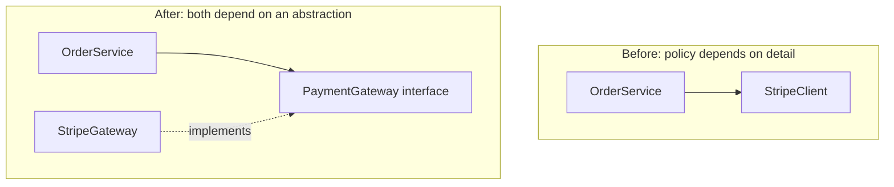

# SOLID, honestly

## Why this matters

It's a Tuesday afternoon and you're adding Apple Pay to checkout. The ticket says "small change — we already take cards." You open `OrderService` and find a 600-line method that validates the cart, computes tax, charges the card via a hard-coded `StripeClient`, writes three database tables, sends a confirmation email through SendGrid, posts to the analytics pipeline, and updates the inventory cache. To add one payment method you have to understand all of it, because the payment logic is woven through the email logic which is woven through the tax logic. You change four lines, and the test suite — the integration tests, because there are no unit tests, because nothing here can be tested in isolation — goes red in nine places you didn't touch.

That class is the reason "small change" took two weeks. Nobody set out to build it. It grew one urgent ticket at a time, each one adding "just one more thing" to the method that was already there. Every reason the business might change — a new tax rule, a new payment provider, a new email template, a new analytics event — is a reason to edit this exact method. That's the disease SOLID is trying to prevent, and it's why the principles are worth knowing even when half the advice written about them is nonsense.

Here's the honest version. SOLID is five heuristics Robert Martin collected in the early 2000s, drawn from earlier work by Bertrand Meyer and Barbara Liskov. They are not laws. They are not a checklist you pass or fail. Four of the five point at the same underlying goal: **manage coupling so that a change has a small, predictable blast radius.** The fifth (Liskov) is about a specific correctness trap in inheritance. Used as a thinking aid, SOLID is genuinely useful. Used as a cargo cult — one interface per class, a factory for every constructor, dependency injection for things that never vary — it produces the second-worst codebase you'll ever maintain. This chapter is about telling the two apart.

## Mental model

Strip the acronym down and there is one idea underneath most of it: **things that change together should live together; things that change for different reasons should be separated by a stable boundary.** Coupling is the cost; cohesion is the goal; the boundary is an interface you control.

The five principles are angles on that idea:

| Principle | One-line intent | When it earns its keep |
|---|---|---|
| **S** — Single Responsibility | One reason to change per module | A class accumulates unrelated concerns (the 600-line method) |
| **O** — Open/Closed | Extend without modifying existing code | A known axis of variation (payment providers, exporters) |
| **L** — Liskov Substitution | Subtypes must honor the supertype's contract | You're actually using inheritance/polymorphism |
| **I** — Interface Segregation | Don't force clients to depend on methods they don't use | Fat interfaces with reluctant implementers |
| **D** — Dependency Inversion | Depend on abstractions, not concretions | A policy needs to outlive a specific technology choice |

The relationship worth drawing is how a dependency points before and after you apply Dependency Inversion. Before, your business logic reaches out and grabs a concrete vendor. After, both sides depend on an interface that *your domain* owns:



The arrow flip is the whole point. In *Before*, the high-value, slow-to-change thing (your order policy) depends on the low-value, fast-to-change thing (a specific vendor SDK). When Stripe changes their API or you add a second provider, the change reaches straight into your core logic. In *After*, the dependency points inward toward an interface the domain defines, and the vendor adapter is a leaf you can swap, mock, or delete. This is the same direction-of-dependency idea you'll see again in Clean Architecture and Hexagonal/Ports-and-Adapters — SOLID's "D" is the cell-level version of that organ-level pattern.

The trap to hold in your head from the start: **every abstraction you add to satisfy a principle is itself a cost.** An interface is a thing future readers must understand, jump through, and keep in sync. You add it when a real axis of change justifies it, not preemptively.

## In practice

Let's take the opening disaster and refactor it for real. We'll apply exactly two of the five principles — SRP and DIP — because those are the two that pay off most of the time, and watch the testability problem dissolve as a side effect.

### The tangled version

```typescript
// order-service.ts — the Tuesday-afternoon nightmare, abridged
import Stripe from "stripe";
import { sendGridSend } from "./vendor/sendgrid";
import { db } from "./db";

export class OrderService {
  private stripe = new Stripe(process.env.STRIPE_KEY!);

  async placeOrder(cart: Cart, customer: Customer): Promise<string> {
    // validation
    if (cart.items.length === 0) throw new Error("empty cart");

    // tax + totals
    let subtotal = 0;
    for (const i of cart.items) subtotal += i.price * i.qty;
    const tax = subtotal * taxRateFor(customer.region);
    const total = subtotal + tax;

    // payment — hard-wired to Stripe
    const charge = await this.stripe.charges.create({
      amount: Math.round(total * 100),
      currency: "usd",
      source: customer.cardToken,
    });

    // persistence
    const orderId = await db.orders.insert({ customer: customer.id, total, charge: charge.id });

    // notification — hard-wired to SendGrid
    await sendGridSend(customer.email, "Order confirmed", renderReceipt(orderId, total));

    return orderId;
  }
}
```

You cannot unit-test `placeOrder` without a Stripe key and a live SendGrid account. Every concern is welded to a vendor. Adding PayPal means editing the method. This single method violates SRP (it changes for at least five different reasons) and DIP (it depends on concrete vendors).

### Step 1 — Dependency Inversion: define interfaces the domain owns

The domain doesn't care *how* a payment happens. It cares that money moves and it gets back a reference. So the domain declares the contract:

```typescript
// domain/ports.ts — interfaces OWNED by the business logic
export interface PaymentGateway {
  charge(amountCents: number, currency: string, token: string): Promise<{ id: string }>;
}

export interface OrderRepository {
  save(order: NewOrder): Promise<string>;
}

export interface Notifier {
  orderConfirmed(email: string, orderId: string, totalCents: number): Promise<void>;
}
```

These three interfaces are small and stated in the domain's own vocabulary — note `charge` takes an amount, not a `Stripe.ChargeCreateParams`. The vendor leaks nothing inward. Concrete adapters implement them at the edge:

```typescript
// infra/stripe-gateway.ts — a leaf the domain never imports
import Stripe from "stripe";
import { PaymentGateway } from "../domain/ports";

export class StripeGateway implements PaymentGateway {
  constructor(private stripe: Stripe) {}
  async charge(amountCents: number, currency: string, token: string) {
    const c = await this.stripe.charges.create({ amount: amountCents, currency, source: token });
    return { id: c.id };
  }
}
```

### Step 2 — Single Responsibility: split by reason-to-change

Tax computation changes when tax law changes. Order placement changes when the *flow* changes. Those are different reasons, so they become different units:

```typescript
// domain/pricing.ts — pure, no I/O, trivially testable
export function priceCart(cart: Cart, region: Region): { subtotalCents: number; totalCents: number } {
  const subtotal = cart.items.reduce((s, i) => s + i.price * i.qty, 0);
  const total = subtotal * (1 + taxRateFor(region));
  return { subtotalCents: Math.round(subtotal * 100), totalCents: Math.round(total * 100) };
}
```

```typescript
// domain/place-order.ts — orchestrates collaborators it receives, depends on nothing concrete
import { PaymentGateway, OrderRepository, Notifier } from "./ports";
import { priceCart } from "./pricing";

export class PlaceOrder {
  constructor(
    private payments: PaymentGateway,
    private orders: OrderRepository,
    private notifier: Notifier,
  ) {}

  async execute(cart: Cart, customer: Customer): Promise<string> {
    if (cart.items.length === 0) throw new Error("empty cart");

    const { totalCents } = priceCart(cart, customer.region);
    const charge = await this.payments.charge(totalCents, "usd", customer.cardToken);
    const orderId = await this.orders.save({ customer: customer.id, totalCents, chargeId: charge.id });
    await this.notifier.orderConfirmed(customer.email, orderId, totalCents);
    return orderId;
  }
}
```

`PlaceOrder` now reads like a sentence. It changes only when the *steps* of placing an order change. Pricing changes elsewhere. Vendors change in adapters. The composition happens once, at the edge of the app:

```typescript
// main.ts — the composition root, the ONE place concretions are named
const place = new PlaceOrder(
  new StripeGateway(new Stripe(process.env.STRIPE_KEY!)),
  new PostgresOrderRepository(db),
  new SendGridNotifier(),
);
```

### The payoff: tests that run in milliseconds

```typescript
// place-order.test.ts — no network, no vendor keys, no database
import { test, expect } from "vitest";
import { PlaceOrder } from "../domain/place-order";

test("charges the taxed total and persists the order", async () => {
  const charged: number[] = [];
  const place = new PlaceOrder(
    { charge: async (cents) => { charged.push(cents); return { id: "ch_1" }; } },
    { save: async () => "ord_1" },
    { orderConfirmed: async () => {} },
  );

  const id = await place.execute(twoItemCart(), customerInRegion("test-region"));

  expect(id).toBe("ord_1");
  expect(charged[0]).toBe(11000); // fixture: 100.00 subtotal at a 10% test-region rate
});
```

That is the dividend. We applied SRP and DIP not because a rulebook said to, but because they bought us a unit-testable core and a one-line path to adding PayPal (`class PayPalGateway implements PaymentGateway`). We did **not** add an interface for the pricing function — it's a pure function with one implementation and no axis of variation, so a `TaxStrategy` interface would be pure ceremony. Knowing where to stop is the skill.

> **Connect the dots:** The interface boundary here is the same seam you exploit for contract testing in API versioning (Part 13, ch. 5) and for the test doubles discussed in the testing chapters (Part 9). Define the boundary once and you get substitutability, testability, and a deprecation surface for free.

> **Security note:** The composition root is also the natural chokepoint for credentials and trust. Because every concrete vendor is instantiated in one place, secrets like the Stripe key and SendGrid token live and are injected there rather than being read ad hoc deep inside business logic — which keeps them out of the unit-tested core and easy to audit. Interface Segregation has a security payoff too: a narrow `PaymentGateway` exposes only `charge`, so a consumer that should never issue refunds cannot reach a `refund` method it was never handed. Wide interfaces over-grant capability the same way over-broad IAM roles do; slice them to what each client legitimately needs.

## Pitfalls and anti-patterns

**1. The Single Responsibility shrapnel.** Misreading "one responsibility" as "one method per class" or "one verb," developers explode a cohesive module into `OrderValidator`, `OrderPricer`, `OrderPersister`, `OrderNotifier`, `OrderOrchestrator`, and `OrderFactory` — each 12 lines, each only ever called by the next. *How to recognize:* classes that have exactly one caller and exist only to be wired together; you have to open six files to follow one request. *How to fix:* Martin's actual definition is "one reason to change," where a reason maps to a stakeholder or business axis. Tax law and email templates are different reasons; the four lines that compute a subtotal and the line that rounds it are the same reason. Group by what changes together.

**2. Speculative Dependency Inversion (the "what if we swap databases?" tax).** Every class hidden behind an interface with exactly one implementation, injected through three layers, "in case we change vendors." You almost never change the database. *How to recognize:* interfaces named `IFooService` that have one implementor named `FooService`, and a DI container configured with a hundred single-binding registrations. *How to fix:* invert a dependency when there's a *real* second implementation today (a test double counts as one, which is why payment gateways and notifiers usually qualify) or a concrete, near-term plan for one. For everything else, depend on the concrete class and extract the interface the day you actually need it. The refactor is cheap; the premature abstraction is not.

**3. Liskov violations via the refused bequest.** A subclass inherits a method it can't honor, so it throws: `class ReadOnlyList extends List { add() { throw new Error("unsupported"); } }`. Now any code holding a `List` can break when handed a `ReadOnlyList`. The classic example is `Square extends Rectangle`: setting width independently of height breaks every caller that assumed rectangles. *How to recognize:* overrides that throw `UnsupportedOperationException`, narrow a return type, strengthen a precondition, or check `instanceof` to special-case a subtype. *How to fix:* prefer composition over inheritance; model the real relationship (an immutable list is not a kind of mutable list). If a subtype can't satisfy the supertype's contract, it isn't a subtype.

**4. Fat interface forcing dummy implementations.** A `Repository` interface with 20 methods means every implementer — including your in-memory test fake — must stub all 20, most as `throw` or `return null`. This is the Interface Segregation failure. *How to recognize:* implementations littered with empty or throwing methods; clients that import a broad interface to call one method. *How to fix:* split the interface along client needs. A read-only consumer depends on `ReadOrders`; a writer depends on `WriteOrders`. Clients depend only on the slice they use, and fakes shrink accordingly.

**5. Open/Closed as a strategy-pattern reflex.** Treating "open for extension, closed for modification" as a mandate to replace every `if`/`switch` with a polymorphic class hierarchy. A two-branch conditional that has changed twice in three years does not need a registry of strategy objects. *How to recognize:* a factory, an interface, and three classes standing in for what was a five-line `switch`, with no third case in sight. *How to fix:* apply Open/Closed at proven axes of variation — places where you've *already* added the third and fourth case and felt the pain of editing the same `switch` each time. The rule of three is a better guide than the principle alone: write it inline, duplicate once, abstract on the third.

## Production checklist

- [ ] Each class/module has one identifiable reason to change, mapped to a stakeholder or business axis — not "one method"
- [ ] Business logic depends on interfaces it *owns*, stated in domain vocabulary, with vendor types never leaking inward
- [ ] Concrete vendor/IO classes are instantiated only at a single composition root, not scattered through the code
- [ ] Every interface has either two real implementations today (a test double counts) or a concrete near-term need for one — otherwise it's deleted and the concrete class used directly
- [ ] No override throws "unsupported" or strengthens a precondition; subtypes are genuinely substitutable for their supertypes
- [ ] No interface forces implementers to stub methods they don't use; interfaces are sliced by client need
- [ ] `if`/`switch` is left inline until the third case appears (rule of three) before reaching for polymorphism
- [ ] Core domain logic has fast unit tests that run with no network, database, or vendor credentials
- [ ] Abstractions are reviewed for cost: each interface, factory, and indirection is justified by a real, named axis of change

## Exercises

1. **(Comprehension)** Take the tangled `OrderService` from this chapter and list every distinct *reason to change* it has (a new tax jurisdiction, a new payment provider, a new email vendor, a schema change, a new analytics event, a flow change). For each reason, name which class in the refactored version would change instead. Confirm that no single refactored class appears for more than one reason.

2. **(Applied)** Add a second payment provider to the refactored code. Write a `PayPalGateway implements PaymentGateway` without editing `PlaceOrder`, `pricing.ts`, or any existing test. Then write a unit test that runs `PlaceOrder` against an in-memory fake gateway and asserts the charged amount, with no network calls. Measure and compare the wall-clock time of this unit test against an equivalent integration test that hits a real sandbox account, and note the order-of-magnitude difference you observe.

3. **(Design)** You maintain a reporting module that exports data to CSV. Product wants PDF and XLSX next quarter, and "probably more formats later." Sketch two designs: (a) an `Exporter` interface with one implementation per format, and (b) a single function with a `switch`. State the conditions under which each is the right call, decide which you'd ship *today* given exactly the CSV requirement in hand, and describe the exact trigger that would make you migrate from one to the other. Defend the cost of the abstraction you chose to add — or chose to defer.

## Further reading

- Robert C. Martin, *Agile Software Development, Principles, Patterns, and Practices* (2002) — the original full treatment of all five principles, with the motivating examples.
- Barbara Liskov and Jeannette Wing, ["A Behavioral Notion of Subtyping"](https://dl.acm.org/doi/10.1145/197320.197383) (ACM TOPLAS, 1994) — the rigorous source of the substitution principle, well beyond the pop summary.
- Bertrand Meyer, *Object-Oriented Software Construction*, 2nd ed. (1997) — the origin of Open/Closed and design-by-contract, which underpins Liskov in practice.
- Robert C. Martin, *Clean Architecture* (2017), chapters 7–11 — SOLID restated, then scaled up to the dependency-rule version of architecture-level boundaries.
- Dan North, ["CUPID — for joyful coding"](https://dannorth.net/cupid-for-joyful-coding/) — a thoughtful, opinionated counterpoint arguing SOLID's limits and proposing property-based heuristics instead. Read it to keep the principles honest.
