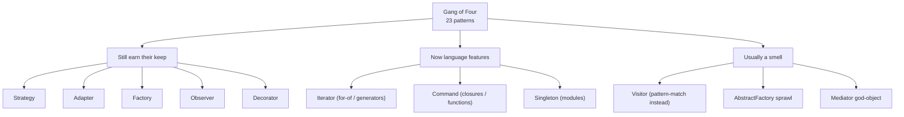

# Design patterns that survived

## Why this matters

It's a Tuesday afternoon and you're reviewing a pull request from a teammate. The diff adds a new payment method — Apple Pay — to the checkout flow. You open the file and find a 400-line `PaymentProcessor` class with a `process()` method that's now a six-branch `if/elif` ladder: card, PayPal, bank transfer, crypto, gift card, and now Apple Pay. Each branch reaches into different fields, calls different SDKs, handles different error shapes. The new branch touched a method that three other features depend on, so the test suite for cards now has to run for a change that has nothing to do with cards. The PR has a dozen review comments, all variations of "are you sure this didn't break X?"

Two weeks earlier, a different teammate added Klarna to a different checkout system. Their diff was one new file, `KlarnaStrategy.ts`, implementing a `PaymentStrategy` interface, plus one line in a registry. Nothing else changed. The review took a few minutes. The card tests didn't run because the card code didn't move.

Same feature, same company, wildly different cost. The difference wasn't talent or seniority. It was that one codebase had absorbed a 30-year-old idea — the Strategy pattern — and the other hadn't. This chapter is about which of those old ideas still pay rent in 2026, which have quietly become language features you already use without naming, and which were always more smell than solution. The goal is not to memorize the Gang of Four catalog. It's to recognize, on a Tuesday, which shape your problem actually has.

The patterns that survived survived because they name a recurring tension between "code that's easy to change" and "code that's easy to read right now," and they resolve it in a way that's still true whether you're writing TypeScript, Python, Go, or Rust. The ones that died, died because the language grew a keyword that does the same job in one line.

## Mental model

The Gang of Four book (Gamma, Helm, Johnson, Vlissides, *Design Patterns*, 1994) catalogued 23 patterns. Most of what's worth keeping reduces to a single principle: **separate the thing that varies from the thing that stays the same, and connect them through a stable interface.** Strategy varies an algorithm. Adapter varies an interface. Decorator varies behavior by wrapping. Observer varies who reacts to an event. Factory varies which concrete type gets built. They're all the same move applied to a different axis of change.

The honest 2026 taxonomy looks like this:



The dividing line is leverage. A pattern earns its keep when the axis of variation it isolates is an axis your system actually varies along — new payment methods, new export formats, new notification channels. It becomes ceremony when you apply it speculatively, to an axis that never moves. A `Strategy` with exactly one implementation that will never grow is just an interface you have to click through to read the real code. The pattern isn't free; it costs a layer of indirection. You pay that cost willingly when variation is real and recurring, and you refuse to pay it when it isn't.

It helps to make that cost concrete. Every abstraction you introduce adds a hop a reader has to make: from the call site, to the interface, to the concrete implementation that actually runs. When variation is real, that hop buys you something enormous — the ability to change one implementation without reading or retesting the others. When variation is imaginary, the hop buys nothing and you've simply made the code longer to follow. This is why the same construct can be excellent engineering in one file and cargo-cult ceremony in another. The pattern is never good or bad in the abstract; it's good or bad relative to how the system actually changes over time.

Hold two questions in your head. First: *what varies here, and how often?* Second: *would a junior reading this in six months understand it faster with the pattern or without?* If both answers point the same way, use the pattern. When they conflict, the second question usually wins, because code is read far more than it's written.

## In practice

### Strategy: the one that earns its keep most often

Here's the tangled version from the opening scenario. This is the code that made the PR take an hour.

```typescript
// Anti-pattern: the algorithm and the dispatch are fused into one growing method.
class PaymentProcessor {
  async process(order: Order, method: string): Promise<Receipt> {
    if (method === "card") {
      const token = await StripeSDK.tokenize(order.cardDetails);
      const charge = await StripeSDK.charge(token, order.totalCents);
      return { id: charge.id, status: charge.paid ? "ok" : "failed" };
    } else if (method === "paypal") {
      const pp = await PayPalSDK.createOrder(order.totalCents, order.currency);
      const cap = await PayPalSDK.capture(pp.id);
      return { id: cap.captureId, status: cap.completed ? "ok" : "failed" };
    } else if (method === "applepay") {
      // ...the branch that triggered the review pile-up
    }
    // ...four more branches
    throw new Error(`Unknown method: ${method}`);
  }
}
```

Every new payment method edits a method that every existing method shares. The blast radius of a one-method change is the entire class. Now the refactor. Pull the part that *varies* (how a single method charges) behind a stable interface, and keep the part that *stays the same* (validate order, persist receipt, emit event) in the caller.

```typescript
interface PaymentStrategy {
  readonly id: string;
  charge(order: Order): Promise<Receipt>;
}

class CardStrategy implements PaymentStrategy {
  readonly id = "card";
  async charge(order: Order): Promise<Receipt> {
    const token = await StripeSDK.tokenize(order.cardDetails);
    const charge = await StripeSDK.charge(token, order.totalCents);
    return { id: charge.id, status: charge.paid ? "ok" : "failed" };
  }
}

class PayPalStrategy implements PaymentStrategy {
  readonly id = "paypal";
  async charge(order: Order): Promise<Receipt> {
    const pp = await PayPalSDK.createOrder(order.totalCents, order.currency);
    const cap = await PayPalSDK.capture(pp.id);
    return { id: cap.captureId, status: cap.completed ? "ok" : "failed" };
  }
}

// The registry — Factory's honest, modern form (see below).
const strategies = new Map<string, PaymentStrategy>(
  [new CardStrategy(), new PayPalStrategy()].map((s) => [s.id, s]),
);

class PaymentProcessor {
  async process(order: Order, method: string): Promise<Receipt> {
    const strategy = strategies.get(method);
    if (!strategy) throw new Error(`Unknown method: ${method}`);
    // The invariant work lives here, once, for every method.
    await assertOrderValid(order);
    const receipt = await strategy.charge(order);
    await saveReceipt(receipt);
    return receipt;
  }
}
```

Adding Apple Pay is now one new file and one entry in the registry. The card tests don't run for a Klarna change. That is the whole payoff: the cost of change drops because the unit of change is isolated. Notice also what the caller gained — `assertOrderValid` and `saveReceipt` now run exactly once, for every method, instead of being copy-pasted into six branches where one of them inevitably drifts out of sync. Consolidating the invariant work is often a bigger win than isolating the variable work.

Note that in a functional language — or modern TypeScript — a strategy with a single method doesn't even need a class. A `Map<string, (order: Order) => Promise<Receipt>>` of plain functions does the same job with less ceremony. Reach for the class only when a strategy needs its own state or several related methods.

### Adapter: when you don't control the other side's interface

You're integrating a third-party fraud-scoring service. Your code expects `FraudCheck.score(order): number`. Their SDK gives you `riskEngine.evaluateTransaction(payload): { risk_level: "LOW" | "HIGH" }`. You don't own their interface and you don't want their vocabulary leaking into your domain. Adapter is the seam.

```typescript
interface FraudCheck {
  score(order: Order): Promise<number>; // 0..1, our domain's shape
}

// Their interface, frozen, not ours to change.
import { riskEngine } from "third-party-risk-sdk";

class RiskEngineAdapter implements FraudCheck {
  async score(order: Order): Promise<number> {
    const result = await riskEngine.evaluateTransaction({
      amount_cents: order.totalCents,
      currency_code: order.currency,
    });
    return result.risk_level === "HIGH" ? 0.95 : 0.1;
  }
}
```

The vendor's field names, enums, and quirks are quarantined in one file. The day you switch vendors, you write one new adapter and delete one old one; nothing else in your codebase knows the vendor changed. This is the pattern that ages best, because integrating systems you don't control is a permanent condition of software, not a phase.

### Decorator: layering behavior without subclass explosion

You want to add caching, retries, and metrics to the `FraudCheck` call. The wrong instinct is `CachedRetryingMeteredFraudCheck` — a subclass per combination, which explodes combinatorially. Decorator wraps the same interface, so each concern is independent and composable.

```typescript
class RetryingFraudCheck implements FraudCheck {
  constructor(private inner: FraudCheck, private attempts = 3) {}
  async score(order: Order): Promise<number> {
    let lastErr: unknown;
    for (let i = 0; i < this.attempts; i++) {
      try {
        return await this.inner.score(order);
      } catch (e) {
        lastErr = e;
      }
    }
    throw lastErr;
  }
}

class MeteredFraudCheck implements FraudCheck {
  constructor(private inner: FraudCheck) {}
  async score(order: Order): Promise<number> {
    const start = performance.now();
    try {
      return await this.inner.score(order);
    } finally {
      metrics.timing("fraud.score.ms", performance.now() - start);
    }
  }
}

// Compose at the edge. Order is explicit and readable.
const fraud: FraudCheck = new MeteredFraudCheck(
  new RetryingFraudCheck(new RiskEngineAdapter()),
);
```

Each decorator does one thing, and you assemble exactly the stack you want at wiring time. If this looks familiar, it's because it's the same shape as Express/Koa middleware and Python's function decorators — those are Decorator the pattern, blessed into idiom.

### Observer: decoupling who-does-what from when-it-happens

When an order is paid, you need to send a receipt email, update inventory, notify the warehouse, and bump analytics. Hard-coding all four into `process()` recreates the god-method problem. Observer lets the payment code announce an event without knowing who listens.

```python
from typing import Callable
from dataclasses import dataclass, field

@dataclass
class EventBus:
    _subs: dict[str, list[Callable]] = field(default_factory=dict)

    def on(self, event: str, handler: Callable) -> None:
        self._subs.setdefault(event, []).append(handler)

    def emit(self, event: str, payload: dict) -> None:
        for handler in self._subs.get(event, []):
            handler(payload)  # in production: dispatch to a queue, not inline

bus = EventBus()
bus.on("order.paid", send_receipt)
bus.on("order.paid", update_inventory)
bus.on("order.paid", notify_warehouse)

# The payment code knows nothing about its four downstream consumers.
bus.emit("order.paid", {"order_id": order.id, "total": order.total_cents})
```

> **Connect the dots:** Observer scaled up across process boundaries *is* event-driven architecture — the publish/subscribe backbone of Kafka, SNS/SQS, and webhooks covered in Part 8. The in-process version here and the distributed version there are the same idea at different blast radii. The hard parts (ordering, retries, idempotency, what happens when a subscriber throws) are exactly the parts the toy in-memory bus hides, which is why production observers hand off to a real queue.

### Factory: usually just a function now

Factory's classic form — an `AbstractFactory` hierarchy with `createButton()` and `createCheckbox()` — is mostly overkill in a language with first-class functions. Most real factory needs are met by the registry `Map` you already saw in the Strategy example, or a single function that decides which concrete type to build:

```typescript
function makeStorage(env: string): BlobStore {
  switch (env) {
    case "prod": return new S3Store();
    case "test": return new InMemoryStore();
    default: return new LocalDiskStore();
  }
}
```

That's a factory. It earns its keep because it puts the construction decision in exactly one place. You almost never need the full abstract-factory class hierarchy unless you're building a cross-platform UI toolkit, which most of us are not.

### The ones that became language features

Three GoF patterns are now keywords or idioms, and writing them out longhand is the smell:

- **Iterator.** You do not write an `Iterator` class. You write a generator (`function*` / `yield`, or Python's `yield`) and consume it with `for...of` / `for x in`. The pattern survived by becoming syntax.
- **Command.** "Encapsulate a request as an object" is just a closure or a function value. `const undo = () => state.restore(snapshot)` is the Command pattern. You need the object form only when commands must be serialized (for an undo stack persisted to disk, or a job queue).
- **Singleton.** A module is a singleton. `import { db } from "./db"` gives every caller the same instance. The classic `getInstance()` with a private constructor adds global mutable state, which makes tests order-dependent and hides dependencies. Prefer a module, or pass the instance in (dependency injection).

> **Security note:** The one time you genuinely reify a Command into a serialized object — persisting it to a job queue or an undo log — you reintroduce a deserialization boundary. Treat the payload as untrusted input: deserialize into a known, allow-listed set of command types with explicit fields, never into arbitrary objects via a language's native pickle/`readObject`/unsafe-YAML path. Insecure deserialization of serialized commands is a recurring source of remote-code-execution bugs (it sits on the OWASP Top 10 as part of "Software and Data Integrity Failures"). A closure can't be smuggled across the wire; a naively deserialized command object can.

## Pitfalls and anti-patterns

**Pattern-driven design (the speculative interface).** You add a `Strategy` interface with one implementation because you "might need more later." Now every reader clicks through an indirection to find the single real implementation, and the "later" never comes. Recognize it by counting implementations: an interface with exactly one implementer that isn't a test double or a published API boundary is usually premature. Fix it by inlining — delete the interface, keep the concrete class, and reintroduce the seam the day the *second* implementation actually arrives. The refactor is cheap; the speculative abstraction is not.

**The Singleton that's really global mutable state.** `Config.getInstance().set(...)` looks like a tidy pattern and is actually a global variable wearing a tie. Recognize it when tests start failing depending on run order, or when you can't instantiate two of the thing in one test. Fix it by passing the dependency in explicitly (constructor injection) so each test gets its own instance, and reserve module-level singletons for genuinely stateless or read-only things.

**Visitor where pattern matching belongs.** Visitor exists to add operations to a fixed type hierarchy without editing each type, in languages that lacked pattern matching. In TypeScript with discriminated unions, or Python 3.10+ with `match`, or any Rust/Scala/Kotlin codebase, a `match` on a tagged union is shorter, exhaustiveness-checked by the compiler, and far easier to read than the double-dispatch dance. Recognize Visitor-as-smell when you see `accept(visitor)` methods threaded through a type tree. Fix it by replacing the hierarchy with a tagged union and matching on the tag.

**Decorator order amnesia.** Decorators compose, but order is semantic. `Retrying(Metered(x))` records one timing per attempt; `Metered(Retrying(x))` records one timing for the whole retried operation. Teams wire these at the edge and forget the order encodes a decision. Recognize it when metrics look wrong after someone reshuffled the wiring. Fix it by writing the composition once, in one place, with a comment stating the intended semantics, and asserting it in a test.

**Pattern vocabulary as a substitute for thinking.** A PR description that says "I used the Abstract Factory and Mediator patterns" tells you nothing about whether the design is good. Patterns are a communication shorthand for a structure, not a justification for it. Recognize this when pattern names appear in design docs but the actual axis of variation is never stated. Fix it by always answering "what varies, how often, and who reads this" *before* naming any pattern.

## Production checklist

- [ ] For each interface/abstract base in the change, can you name two or more real, present (not hypothetical) implementations? If not, justify the seam or inline it.
- [ ] Strategy/Factory dispatch lives in exactly one registry or function, not scattered across the codebase.
- [ ] Adapters quarantine every third-party type and vocabulary; no vendor field names leak past the adapter into domain code.
- [ ] Single-method strategies use plain functions, not ceremony classes, unless they carry state.
- [ ] No `getInstance()` singletons holding mutable state; shared instances come from modules or are injected.
- [ ] Decorator/middleware composition is defined in one place with its order documented and test-asserted.
- [ ] No hand-written Iterator, Command-object, or Visitor where a generator, closure, or `match`/discriminated union would be clearer.
- [ ] Any serialized Command/job payload deserializes only into an allow-listed set of types, never via an unsafe native deserializer.
- [ ] Pattern names in design docs are accompanied by the concrete axis of variation they isolate.
- [ ] Each pattern's indirection is paid for by a change that's actually cheaper now; if you can't point to the saved cost, remove the pattern.

## Exercises

1. **(Comprehension)** Take the tangled `PaymentProcessor` `if/elif` ladder from the start of "In practice" and, without writing code, list every line that must change to add a seventh payment method, then do the same for the Strategy version. Write one sentence explaining why the difference in blast radius is the entire point of the pattern.

2. **(Applied)** You have a `Notifier` that emails users. Product wants the same notifications to optionally go to SMS and Slack, in any combination per user, and wants every send to be retried up to 3 times and timed for metrics. Implement this using Strategy (per channel) plus Decorator (retry, metrics), wired through a registry. Write a test that proves adding a fourth channel touches exactly one new file plus one registry line, and that the retry and metrics decorators compose in a documented order.

3. **(Open-ended design)** Your team's reporting service exports data to CSV, and three more formats are coming (XLSX, PDF, JSON), each with format-specific options (page size for PDF, sheet names for XLSX). Design the type and module structure. Decide where Strategy, Factory, and Decorator do and don't apply, where a discriminated union beats a class hierarchy, and where you'd deliberately *not* abstract yet. State the axis of variation for each abstraction you introduce, and name one place you chose to leave a duplicated concrete implementation rather than build a seam, and why.

## Further reading

- Erich Gamma, Richard Helm, Ralph Johnson, John Vlissides, *Design Patterns: Elements of Reusable Object-Oriented Software* (1994) — the source. Read the intent and "applicability" sections; skim the C++ implementations, which are dated.
- *Refactoring*, Martin Fowler (2nd ed., 2018) — treats patterns as destinations you refactor *toward* when the code demands them, not blueprints you start from. The healthier mental model.
- Peter Norvig, ["Design Patterns in Dynamic Languages"](https://norvig.com/design-patterns/) — the classic talk showing how many GoF patterns dissolve into first-class functions and language features. Required reading for the "now a language feature" half of this chapter.
- Brian Goetz et al., [JEP 406: Pattern Matching for switch](https://openjdk.org/jeps/406) — primary-source rationale for why pattern matching supersedes the Visitor pattern in modern type systems.
- *A Philosophy of Software Design*, John Ousterhout (2nd ed., 2021) — chapters on deep modules and information hiding give the principle (separate what varies behind a narrow interface) that every surviving pattern is a special case of.
