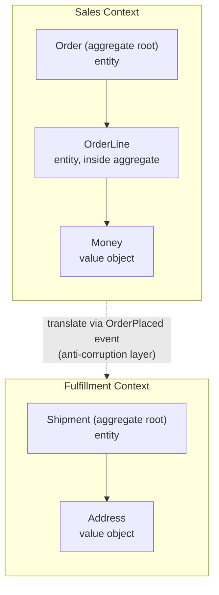

# Domain-driven design

## Why this matters

It's a Tuesday afternoon and a support escalation lands on your desk: a customer was charged twice for one order. You start tracing it. The `orders` table has a `status` column, and so does the `shipments` table, and so does `billing_invoices`. Three services write to all three. Somewhere, the checkout service marked an order `paid`, the billing service independently created an invoice and charged the card, and a retry from the payment webhook created a second invoice because nothing in the system knew that "this order already has an invoice" was an invariant anyone was supposed to enforce. There was no single place that owned the rule "an order has at most one open invoice." The rule lived in three people's heads and zero lines of code.

This is the failure domain-driven design is built to prevent. Not bad SQL, not a missing unique constraint (though that would have helped) — the deeper problem is that the *concept* of an order's payment lifecycle had no home. The word "order" meant something different in the checkout code, the warehouse code, and the finance code, and nobody had drawn the line where one meaning stops and the next begins. When concepts blur, invariants leak across boundaries, and bugs like double-charging stop being accidents and start being inevitable.

Domain-driven design (DDD), introduced by Eric Evans in 2003, is a large book with a small number of ideas that genuinely pay off and a larger number of patterns that mostly add ceremony. This chapter separates the two. The parts that matter — bounded contexts, ubiquitous language, and a disciplined aggregate boundary — are the difference between a codebase where rules have a home and one where they leak. The rest is optional, and treating the optional parts as mandatory is its own failure mode: teams that adopt the full pattern catalog before they understand which one concept owns which one rule end up with more files and the same bugs.

## Mental model

DDD has exactly three load-bearing ideas. Everything else in the book is implementation detail layered on top of them.

**Ubiquitous language**: the code uses the same words the domain experts use, with the same meanings, and nobody translates between "what the business calls it" and "what the table is called." If finance says "invoice," there is a type called `Invoice`, not a `BillingRecord`. This sounds trivial and is not. Every translation layer between the words spoken in a planning meeting and the identifiers in the codebase is a place where a misunderstanding hides until it ships. When the names match, a domain expert can read a method signature and tell you it's wrong.

**Bounded context**: a boundary inside which a word has exactly one meaning. "Order" in the Sales context (a cart being assembled, prices being quoted) is a genuinely different thing from "Order" in the Fulfillment context (a packing list with a shipping address). Trying to make one `Order` class serve both is the root cause of the god-object you've seen in every legacy system — the class that has forty fields because each team bolted on the three it needed. Draw the boundary; let each side have its own model; translate explicitly at the seam.

**Aggregate**: a cluster of objects treated as a single unit for the purpose of data changes, with one **entity** designated the *aggregate root*. The root owns the invariants. Nothing outside the aggregate may hold a reference to anything inside it except the root, and every change to the aggregate goes through the root so the root can enforce its rules. This is the single most valuable mechanical idea in the book, because it gives every invariant exactly one home. The aggregate is also the unit of transactional consistency: one transaction should change exactly one aggregate, and consistency *between* aggregates is achieved later, through events, not inside the same database transaction.

Within an aggregate you distinguish **entities** (things with identity that persists through change — an `Order` is the same order even after every line item is replaced) from **value objects** (things defined entirely by their attributes, with no identity — a `Money(amount, currency)` or an `Address`; two `Money(5, "USD")` are interchangeable and should be immutable). The test for "entity versus value object" is simple: do you care *which one* it is, or only *what it is*? You care which order this is; you do not care which five-dollar amount this is.



The dashed line is the most important part of the diagram. The two contexts do not share a class. When an order is placed, Sales emits an event; Fulfillment consumes it and builds its *own* model from the data it cares about. Neither side reaches into the other's tables. That seam is where you put an anti-corruption layer so a change to the Sales model doesn't ripple into Fulfillment. The cost of this is that the two sides are eventually consistent rather than instantly consistent — there is a window where Sales considers the order placed and Fulfillment hasn't heard yet. Accepting that window is the price of decoupling, and for most domains it is the right trade, because the alternative is a distributed transaction across two contexts, which is far more expensive and far more fragile.

> **Connect the dots:** Bounded contexts map almost one-to-one onto service boundaries when you split a monolith (Part 14). A context that shares no aggregates with its neighbors is a context you can extract into its own service with a clean API. Conversely, if you can't draw the bounded contexts, you're not ready to split the monolith — you'll just distribute the entanglement and turn in-process function calls into network calls that fail in new ways.

## In practice

Let's model the order domain that caused the double-charge, and put the "at most one open invoice" invariant somewhere it can actually be enforced.

### The tangled version first

Here's the shape that produces double-charges. An anemic `Order` with public setters, and rules scattered across whatever service happens to touch it:

```typescript
// anti-pattern: anemic model, invariants live nowhere
class Order {
  id: string;
  status: string;          // "cart" | "paid" | "shipped" ... stringly typed
  lines: OrderLine[] = [];
  invoiceIds: string[] = [];
}

// somewhere in checkout-service
order.status = "paid";
db.save(order);

// somewhere in billing-service, reacting to the same webhook, twice
const invoice = createInvoice(order);
order.invoiceIds.push(invoice.id);  // nothing stops a second push
db.save(order);
```

Nothing here owns the rule that an order has at most one open invoice. Any caller can mutate any field. `status` is a string, so `"PAID"`, `"paid"`, and `"Paid"` are three different bugs waiting to happen. The data structure permits every illegal state the business says must never occur, and so the illegal states occur.

### The aggregate version

Make `Order` the aggregate root. All state is private. All mutation goes through methods that enforce invariants. Value objects are immutable.

```typescript
// value object: identity-free, immutable, self-validating
class Money {
  constructor(readonly amount: number, readonly currency: string) {
    if (!Number.isInteger(amount)) throw new Error("Money is in minor units");
    if (amount < 0) throw new Error("Money cannot be negative");
  }
  add(other: Money): Money {
    if (other.currency !== this.currency) throw new Error("currency mismatch");
    return new Money(this.amount + other.amount, this.currency);
  }
  equals(other: Money): boolean {
    return this.amount === other.amount && this.currency === other.currency;
  }
}

// entity inside the aggregate — not referenced from outside the root
class OrderLine {
  constructor(
    readonly sku: string,
    readonly quantity: number,
    readonly unitPrice: Money,
  ) {
    if (quantity <= 0) throw new Error("quantity must be positive");
  }
  subtotal(): Money {
    return new Money(this.unitPrice.amount * this.quantity, this.unitPrice.currency);
  }
}

type OrderStatus = "draft" | "placed" | "invoiced" | "cancelled";

// the aggregate root: it owns every invariant about an order
class Order {
  private _lines: OrderLine[] = [];
  private _status: OrderStatus = "draft";
  private _openInvoiceId: string | null = null;
  private _events: DomainEvent[] = [];

  constructor(readonly id: string, readonly currency: string) {}

  addLine(line: OrderLine): void {
    if (this._status !== "draft") throw new Error("cannot modify a placed order");
    if (line.unitPrice.currency !== this.currency) throw new Error("currency mismatch");
    this._lines.push(line);
  }

  total(): Money {
    return this._lines.reduce(
      (sum, l) => sum.add(l.subtotal()),
      new Money(0, this.currency),
    );
  }

  place(): void {
    if (this._status !== "draft") throw new Error("order already placed");
    if (this._lines.length === 0) throw new Error("cannot place an empty order");
    this._status = "placed";
    this._events.push(new OrderPlaced(this.id, this.total()));
  }

  // the invariant that prevents the double-charge, with exactly one home:
  attachInvoice(invoiceId: string): void {
    if (this._status !== "placed") throw new Error("order is not awaiting invoice");
    if (this._openInvoiceId !== null) {
      throw new Error(`order ${this.id} already has open invoice ${this._openInvoiceId}`);
    }
    this._openInvoiceId = invoiceId;
    this._status = "invoiced";
  }

  pullEvents(): DomainEvent[] {
    const out = this._events;
    this._events = [];
    return out;
  }
}
```

The second `attachInvoice` call now throws instead of silently creating a duplicate. The rule lives in one method on one class, and a database unique constraint on `(order_id) where status = 'open'` backs it up as a second line of defence. The retried webhook becomes a no-op error you log, not a second charge. Notice also that there is no way to reach an `OrderLine` from outside `Order`: the field is private and the only methods that touch lines run the currency and status checks first. The type makes the illegal states from the tangled version unrepresentable rather than merely discouraged.

### The boundary and the repository

You load and save whole aggregates, never their internal pieces. The repository deals only in roots:

```typescript
interface OrderRepository {
  load(id: string): Promise<Order>;
  save(order: Order): Promise<void>;   // persists the whole aggregate atomically
}

// application service: one transaction == one aggregate change
async function invoiceOrder(repo: OrderRepository, bus: EventBus, orderId: string) {
  const order = await repo.load(orderId);
  const invoiceId = crypto.randomUUID();
  order.attachInvoice(invoiceId);      // throws on the second attempt
  await repo.save(order);              // commit the aggregate
  for (const e of order.pullEvents()) await bus.publish(e);
}
```

The Fulfillment context never imports this `Order` class. It subscribes to `OrderPlaced` and builds a `Shipment` from the fields it needs. That is the bounded-context seam in code: an event crossing a boundary, with each side keeping its own model. One detail worth getting right in production: publishing the event after the commit, as written here, opens a small window where the aggregate is saved but the event never reaches the bus (the process crashes between the two lines). If that loss is unacceptable, write the event into the same transaction as the aggregate (the transactional-outbox pattern) and let a separate relay publish it. The point is that the seam is an explicit, named place where you get to make that durability decision — not an accidental shared table where you never noticed there was a decision.

### What pays off versus what's ceremony

The parts that earn their keep on almost every project: ubiquitous language, bounded contexts, value objects, and a disciplined aggregate root. They cost little and prevent whole classes of bug.

The parts that are often ceremony: a full hexagonal/ports-and-adapters scaffold for a CRUD service, separate `Repository` + `Factory` + `Service` + `DomainService` layers when a single module would do, event sourcing adopted for its own sake, and one-aggregate-per-microservice taken as dogma. Adopt these only when a concrete pain (audit requirements, genuine concurrency on a hot aggregate, independent scaling) justifies them. DDD's "tactical patterns" are a menu, not a checklist. The strategic ideas — where the boundaries are and which concept owns which rule — pay off long before any of the tactical scaffolding does, and they pay off even in a single deployable monolith.

## Pitfalls and anti-patterns

**The anemic domain model.** Classes are bags of public getters and setters; all behaviour lives in `*Service` classes that reach in and mutate fields. Recognize it when your domain objects have no methods except accessors, and your "business logic" is a pile of procedural services. Fix it by moving each invariant onto the aggregate that owns the data it constrains — the `attachInvoice` rule belongs on `Order`, not in a `BillingService`. Martin Fowler popularized the name for this anti-pattern precisely because it looks like DDD (you have an `Order` class) while delivering none of its benefits.

**The god aggregate.** Someone makes `Customer` the root and hangs orders, addresses, payment methods, and support tickets off it, so loading a customer drags in a large object graph and every write contends on one row. Recognize it when a single aggregate is loaded for unrelated operations and you get lock contention or oversized transactions. Fix it by splitting on invariant boundaries: if two things don't need to be consistent in the *same transaction*, they belong in different aggregates that reference each other by ID, not by object pointer. "What must be true atomically?" is the question that draws the boundary; everything that can be eventually consistent belongs on the other side of it.

**Shared database, shared model across contexts.** Sales and Fulfillment both read and write the same `orders` table directly, so a column added for one breaks the other and "order status" means three things at once. Recognize it when a schema change requires coordinating across teams that shouldn't need to talk. Fix it by giving each context its own model and translating at the seam — an event, an API call, an anti-corruption layer — never a shared table.

**Stringly-typed concepts.** `status: string`, `currency: string`, `money: number` (dollars or cents?). Recognize it from the runtime errors that a type could have caught at compile time, and from `if (status === "Paid")` typos. Fix it with value objects and union types: `OrderStatus`, `Money` in minor units, branded ID types. The compiler then enforces what code review was supposed to catch.

**Cargo-culted tactical patterns.** A three-file CRUD endpoint arrives wrapped in repositories, factories, domain services, DTOs, and mappers because "that's DDD." Recognize it when the abstraction count exceeds the invariant count. Fix it by deleting layers until each one earns its place; strategic DDD (language, contexts, aggregates) is what matters, and the tactical scaffolding is optional weight.

> **Security note:** An aggregate invariant is not an authorization check, and conflating the two leaves a hole. `Order.attachInvoice` enforces *what is consistent* ("at most one open invoice") but says nothing about *who is allowed* to invoice this order. Authorization belongs in the application service that loads the aggregate — check the caller's permissions before invoking the domain method, because the domain model deliberately doesn't know about users, sessions, or roles. Keep the two concerns separate: the aggregate guarantees the data can never reach an illegal state, and the application layer guarantees only an entitled actor can ask it to change.

## Production checklist

- [ ] Every core concept has one name shared by code, conversation, and docs (ubiquitous language); renames in the domain trigger renames in code
- [ ] Bounded contexts are drawn explicitly (a context map), and each has a single owning team
- [ ] No two contexts read or write the same table; integration happens via events or APIs, never shared schema
- [ ] Each aggregate root makes all internal state private and exposes intent-revealing methods, not setters
- [ ] Every business invariant is enforced inside exactly one aggregate, and named in a single method
- [ ] Critical invariants have a database constraint backing the in-code check (defence in depth)
- [ ] One transaction changes one aggregate; cross-aggregate consistency is eventual, via events
- [ ] Cross-context events are published durably (transactional outbox) where their loss would corrupt state
- [ ] Authorization lives in the application layer, not inside aggregate invariants
- [ ] Value objects are immutable, self-validating, and compared by value (`Money`, `Address`, `Email`)
- [ ] References across aggregates are by ID, never by object reference
- [ ] Tactical patterns (repositories, factories, hexagonal layering, event sourcing) are present only where a concrete need justifies them

## Exercises

1. **(Comprehension)** For the `Order` aggregate above, list every invariant the root enforces and the method that enforces each. Then explain why `OrderLine` is an entity here but `Money` is a value object — what would change about equality and persistence if you made `Money` an entity with an ID?

2. **(Applied)** Add a cancellation flow. `Order.cancel()` must be allowed only before an invoice is attached, must emit an `OrderCancelled` event, and must be idempotent (calling it twice is a safe no-op, not an error). Write the method, the state changes it makes, and a test that proves the double-charge bug from the opening scenario can no longer happen even under a retried webhook that calls `attachInvoice` twice.

3. **(Design)** You're handed a monolith where `Order`, `Shipment`, and `Invoice` all live in one module sharing one table. Draw a context map splitting it into Sales, Fulfillment, and Billing contexts. Decide where each aggregate lives, what events cross each boundary, and what each context's anti-corruption layer must translate. State which split you'd do first and what concrete pain (not theory) would justify doing the rest.

## Further reading

- Eric Evans, *Domain-Driven Design: Tackling Complexity in the Heart of Software* (Addison-Wesley, 2003) — the source; read Part II (building blocks) and Part IV (strategic design / bounded contexts) first.
- Vaughn Vernon, *Implementing Domain-Driven Design* (Addison-Wesley, 2013) — the practical companion; the aggregate-design rules ("reference by identity," "one aggregate per transaction") are worth memorizing.
- Martin Fowler, ["AnemicDomainModel"](https://martinfowler.com/bliki/AnemicDomainModel.html) and ["BoundedContext"](https://martinfowler.com/bliki/BoundedContext.html) — short, canonical definitions of the two ideas that matter most.
- Eric Evans, [*Domain-Driven Design Reference*](https://www.domainlanguage.com/ddd/reference/) — the free, condensed pattern catalog; the fastest way to see the whole vocabulary.
- Vaughn Vernon, ["Effective Aggregate Design"](https://www.dddcommunity.org/library/vernon_2011/) — a three-part paper specifically on getting aggregate boundaries right; the single most useful thing to read if you only read one.
