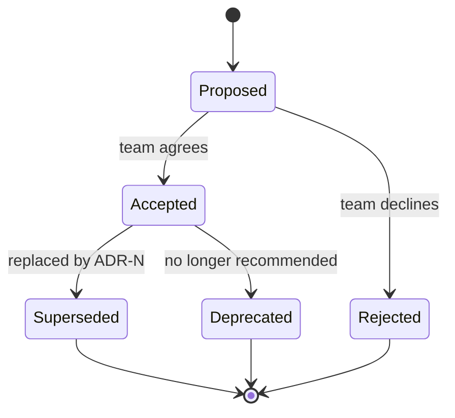

# Architecture Decision Records

## Why this matters

It's a Tuesday afternoon. You're three weeks into a new team and someone files a bug: the payments service writes to both Postgres and a Kafka topic on every charge, and the two are drifting out of sync under load. The obvious fix is to drop the Kafka write and have downstream consumers read from a Postgres change-data-capture stream instead. Clean. Simpler. One source of truth.

You open a PR. Within an hour a staff engineer who's on vacation half-replies from their phone: "We tried CDC in 2023, it caused the incident that took down checkout for four hours on Black Friday. Don't." No link. No detail. The thread dies. Now you're stuck: was CDC actually the cause, or a scapegoat? What specifically went wrong — the tooling, the ordering guarantees, the operational load? Could it be revisited with a different tool? Nobody who was in the room is reachable, and the only record is a `git blame` that points to a commit message reading "revert CDC experiment."

That is the cost of decisions made without recorded context. The code tells you *what* the system does. It never tells you *why* it does it that way, what alternatives were weighed, or what constraints made the "obviously better" option a trap. Six months after any non-trivial decision, the reasoning evaporates — people leave, memories fade, the Slack thread is unsearchable. The team is then doomed to either repeat the mistake or cargo-cult the workaround forever, too afraid to touch it because nobody remembers why it's there. An Architecture Decision Record (ADR) is the cheapest insurance against this: a short, immutable, version-controlled note that captures one decision, its context, and its consequences at the moment you had the most information you'll ever have about it — right now.

## Mental model

An ADR is a single decision, captured as a small Markdown file that lives in the repository next to the code it governs (conventionally `docs/adr/0001-some-title.md`). The format was popularized by Michael Nygard in 2011, and the core insight is narrow and powerful: **decisions are events, not state.** You do not edit an old ADR to reflect a new reality. You write a *new* ADR that supersedes the old one. The history of decisions, like Git history, is append-only. Reading the chain back tells you not just what you believe today but how your understanding evolved.

The minimum viable ADR has four fields: a **title**, a **status**, the **context** (the forces in play — technical, business, organizational), and the **decision** with its **consequences** (both the good and the bad you're accepting). Everything else is optional ceremony.

Each ADR moves through a small lifecycle, and the status field is how you read the chain charitably:



The thing to hold in your head: an ADR is *not* documentation of the current architecture. It is a dated journal entry written by people with specific knowledge at a specific moment. When you read an old ADR that now looks wrong, the correct reaction is not "they were idiots" — it is "what did they know, and what constraints did they have, that I no longer see?" The CDC decision from the opening scenario was probably *correct in 2023* given the tooling and team maturity of that moment. An ADR would have told you exactly which of those conditions changed, and whether your present-day proposal is genuinely different or just the same mistake wearing new clothes.

## In practice

### The template

Start from a template so the team doesn't bikeshed the format. Here is a complete, opinionated one — Nygard's structure with a couple of additions that earn their place:

```markdown
# ADR-NNNN: <short title of decision>

- Status: Proposed | Accepted | Rejected | Deprecated | Superseded by ADR-XXXX
- Date: YYYY-MM-DD
- Deciders: <names / roles in the room>
- Tags: <e.g. data, security, build>

## Context

What is the situation? What forces are at play — technical constraints,
business deadlines, team skills, existing systems? State facts, not
conclusions. This section should make the decision feel inevitable by
the time the reader finishes it.

## Decision

We will <do this>. State it in active voice, as a sentence the team is
committing to. Be specific enough that someone can tell whether the
code complies.

## Alternatives considered

- **Option A** — why we didn't pick it.
- **Option B** — why we didn't pick it.
(This section is what makes an ADR worth reading years later.)

## Consequences

What becomes easier? What becomes harder? What new risks or follow-up
work does this create? Include the bad — an ADR with no downsides is
lying.
```

Two rules that keep ADRs cheap and therefore actually written: keep them to one or two pages, and never block a PR on ADR perfection. The point is the reasoning, not the prose.

### A complete, real ADR

Here is a worked example for a decision most full-stack teams actually face: how to manage schema migrations against a Postgres database that must stay available during deploys. The numbers below are illustrative of one team's situation — yours will differ, but the *shape* of the reasoning carries over.

```markdown
# ADR-0007: Expand-and-contract for all schema migrations

- Status: Accepted
- Date: 2026-02-18
- Deciders: Platform team (Priya, Marcus, Gaurav), Staff eng review
- Tags: data, deployment, availability

## Context

We deploy the API many times per day via rolling updates. During a
rollout, old and new application code run simultaneously for a few
minutes. Today, migrations are run as a pre-deploy step and frequently
include destructive or renaming DDL (e.g. `ALTER TABLE ... RENAME
COLUMN`, `DROP COLUMN`). More than once last quarter a rename broke the
old pods still serving traffic, causing 4xx/5xx spikes until the
rollout completed.

Postgres takes an `ACCESS EXCLUSIVE` lock for many `ALTER TABLE`
operations; on our largest table an unqualified column type change has
locked writes long enough to trip client timeouts.

Constraints:
- We cannot take maintenance windows; the product has a strict
  availability SLO and is used across all time zones.
- The ORM (Prisma) generates migrations but does not enforce safety.
- Team is comfortable with SQL but not all engineers know which DDL
  operations are lock-heavy in Postgres.

## Decision

All schema changes will follow the expand-and-contract (a.k.a.
parallel-change) pattern, split across at least two deploys:

1. **Expand** — add new columns/tables as nullable/additive only.
   Backfill in batches out-of-band. Never rename or drop in this step.
2. **Migrate** — ship application code that writes to both old and
   new shapes, reads from new, falling back to old.
3. **Contract** — once no code reads the old shape, drop it in a
   later, separate deploy.

We will adopt a migration linter (squawk) in CI to reject lock-heavy
DDL, and require `CREATE INDEX CONCURRENTLY` for new indexes.

## Alternatives considered

- **Maintenance windows for risky migrations.** Rejected: violates the
  availability SLO and the product is used across all time zones, so
  there is no "quiet" window.
- **Single-deploy migrations with a brief lock, accepting some errors.**
  Rejected: our largest table locks long enough to exceed client
  timeout budgets, which is visible to users.
- **Online schema-change tooling (pg_repack / pgroll).** Deferred, not
  rejected: pgroll implements expand/contract at the database layer and
  is promising, but it is young and adds an operational dependency our
  on-call rotation isn't trained on yet. Revisit in a future ADR once
  we've run it in staging for a quarter.

## Consequences

Good:
- Every migration is reversible mid-rollout; old pods never see a shape
  they don't understand.
- The linter turns tribal knowledge ("don't rename columns") into an
  automated gate.

Bad / costs:
- Every destructive change now spans multiple PRs and deploys, often
  across days. This is more work and requires discipline to finish the
  contract step (we will track unfinished contractions as tech-debt
  tickets so they don't rot).
- Dual-writing code is temporarily more complex and must be cleaned up.
- Backfills on large tables need batching and monitoring; a naive
  `UPDATE` still locks.
```

Notice what this ADR does that a code comment or wiki page cannot. It records the *rejected* options with reasons, so a future engineer proposing "let's just use a maintenance window" gets an immediate, dated answer. It admits the costs honestly, so nobody is surprised when expand-and-contract slows down a simple rename. And it leaves an explicit door open ("revisit pgroll in a future ADR"), which is how the decision chain stays alive instead of calcifying.

### Tooling

You do not need much. The popular CLI `adr-tools` scaffolds and links records:

```bash
$ adr new "Use expand-and-contract for schema migrations"
# creates docs/adr/0007-use-expand-and-contract-for-schema-migrations.md

$ adr new -s 4 "Move to single-deploy migrations"
# creates a new ADR whose status supersedes ADR-0004, and
# automatically flips ADR-0004's status to "Superseded by 0007"
```

The superseding link is the feature that matters: it means an old, wrong ADR is never silently deleted. A reader landing on ADR-0004 sees a pointer forward to the decision that replaced it. That forward link is the whole reason ADRs beat a wiki, where stale pages just sit there lying to you with no breadcrumb to the truth.

Keep them in-repo, reviewed via normal PRs, and rendered in your docs site (an `adr-log` or a simple index page). Decisions reviewed alongside the code they affect get scrutiny from the people who'll live with them. The review itself is part of the value: the ADR is the artifact the discussion happens *on*, so the disagreement that would otherwise scatter across Slack threads and meeting rooms gets pinned to a single diff that anyone can read later.

> **Security note:** ADRs are public to everyone with repo access, so never paste secrets, internal hostnames, customer data, or exploit details into the Context or Consequences sections. When a decision turns on something sensitive — a vendor's confidential pricing, a not-yet-disclosed vulnerability, a credential rotation plan — record the *shape* of the constraint ("bound by a contractual data-residency requirement") and link to the access-controlled document that holds the specifics. The ADR captures the reasoning; it is not the place for the secret itself.

> **Connect the dots:** ADRs are the prose companion to the C4 diagrams in the next chapter. A C4 container diagram shows you the *shape* of the system as it is today; the ADR log shows you *why* it has that shape and what you tried before. Read together, a newcomer can reconstruct both the structure and the reasoning. The append-only, never-edit-the-past discipline is the same one you learned for Git history in Part 3 — decisions, like commits, are events you add to, not state you mutate.

## Pitfalls and anti-patterns

**The Retroactive Rationalization.** The ADR is written *after* the decision shipped, to justify a choice already made, often by someone who wasn't in the room. You recognize it by the missing or hand-wavy "Alternatives considered" section and consequences that list only upsides. The fix: write the ADR while the decision is still being debated, in the "Proposed" state, and use it as the artifact you review *to make* the decision. An ADR is a thinking tool first and a record second.

**The Living Document.** Someone keeps editing ADR-0007 every time the migration strategy evolves, so it now reflects the present reality but you've lost the 2023 reasoning entirely. You recognize it by an ADR whose `git log` shows a dozen content edits over two years. The fix: ADRs are immutable once accepted. New reality means a *new* ADR that supersedes the old one. The whole value is the dated chain; editing in place destroys it.

**The Novel.** A ten-page ADR with embedded sequence diagrams, a literature review, and a glossary. It took two days to write, so the next three decisions never got an ADR at all because nobody had two days. You recognize it by ADR count dropping to near zero after the first heroic effort. The fix: cap ADRs at one or two pages. If it needs more, link out to a design doc and keep the ADR as the decision summary. Cheap-to-write is the only way they get written consistently.

**The Trivia Log.** Recording decisions with no architectural weight — "we will use 2-space indentation," "the button is blue." These drown the signal. You recognize it by an ADR directory where the genuinely load-bearing decisions are buried among formatting preferences. The fix: ADRs are for decisions that are *expensive to reverse* and *non-obvious in hindsight*. Style and naming go in a linter config or a CONTRIBUTING file, not an ADR.

**The Graveyard.** The team adopts ADRs with enthusiasm, writes fifteen in the first month, then stops. New decisions go undocumented and the log becomes a misleading snapshot of one quarter in the project's life. You recognize it by a max ADR date that's a year stale while the architecture has visibly moved on. The fix: wire ADR-or-explicitly-decline into the definition of done for any RFC-sized change, and review the log in architecture syncs so its staleness is visible and embarrassing.

## Production checklist

- [ ] ADRs live in-repo under `docs/adr/`, numbered sequentially, reviewed via normal PRs
- [ ] A committed `template.md` (or `adr-tools` installed) so format is never debated
- [ ] Every ADR has a `Status` and `Date`; accepted ADRs are treated as immutable
- [ ] Superseding is done by a *new* ADR that links back and flips the old one's status to `Superseded by ADR-NNNN`
- [ ] Every ADR includes an honest "Alternatives considered" and a "Consequences" section that lists real downsides
- [ ] ADRs are scoped to expensive-to-reverse, non-obvious decisions — not style or naming preferences
- [ ] Kept to one to two pages; deeper analysis links out to a design doc
- [ ] An index/log page (or `adr-log`) is rendered in the docs site so the chain is browsable
- [ ] No secrets, customer data, or exploit detail in an ADR — link to an access-controlled doc instead
- [ ] "Write an ADR or explicitly decline" is in the definition of done for RFC-sized changes
- [ ] Old ADRs are read charitably in review — "what changed since?" not "who approved this?"

## Exercises

1. **(Comprehension)** Re-read the ADR-0007 example. Identify the three forces in its Context section that, taken together, make expand-and-contract feel inevitable. Then find the one alternative that was *deferred* rather than *rejected*, and explain in two sentences what specific future condition would justify writing a new ADR to adopt it.

2. **(Applied)** Pick a real, non-trivial decision in a codebase you work on whose reasoning isn't written down anywhere — a database choice, an auth approach, a build-tool migration. Write a complete ADR for it using the template above, including a genuine "Alternatives considered" with at least two rejected options and an honest "Consequences" section with at least two downsides. Then ask a teammate who was *not* part of that original decision to read it and tell you whether they could now defend the choice in a design review.

3. **(Design)** Your team has roughly 60 undocumented architectural decisions across three years and no ADR practice. Design a rollout that gets you to a healthy ADR culture without trying to retroactively write 60 records (which would be a make-work death march). Decide: which past decisions are worth back-filling and by what criterion; how you stop the bleeding for *new* decisions; where ADRs live and how they're reviewed; and how you'll detect, six months in, whether the practice is becoming a Graveyard. State which single step you'd do first and why.

## Further reading

- Michael Nygard, ["Documenting Architecture Decisions"](https://cognitect.com/blog/2011/11/15/documenting-architecture-decisions) — the original 2011 post that defined the format. Short; read it whole.
- Joel Parker Henderson, [architecture-decision-record](https://github.com/joelparkerhenderson/architecture-decision-record) — a comprehensive GitHub collection of ADR templates (Nygard, MADR, Tyree-Akerman, and more) with examples.
- [adr-tools](https://github.com/npryce/adr-tools) — the canonical CLI for creating, numbering, and linking/superseding ADRs from the command line.
- [MADR (Markdown Any Decision Records)](https://adr.github.io/madr/) — a more structured template with explicit decision drivers and per-option pros/cons; useful when decisions have many stakeholders.
- ThoughtWorks Technology Radar, ["Lightweight Architecture Decision Records"](https://www.thoughtworks.com/radar/techniques/lightweight-architecture-decision-records) — the entry that moved ADRs into "Adopt" and made them mainstream practice.
- Martin Fowler / Pramod Sadalage, ["Evolutionary Database Design"](https://martinfowler.com/articles/evodb.html) — background for the expand-and-contract pattern used in the worked ADR above.
