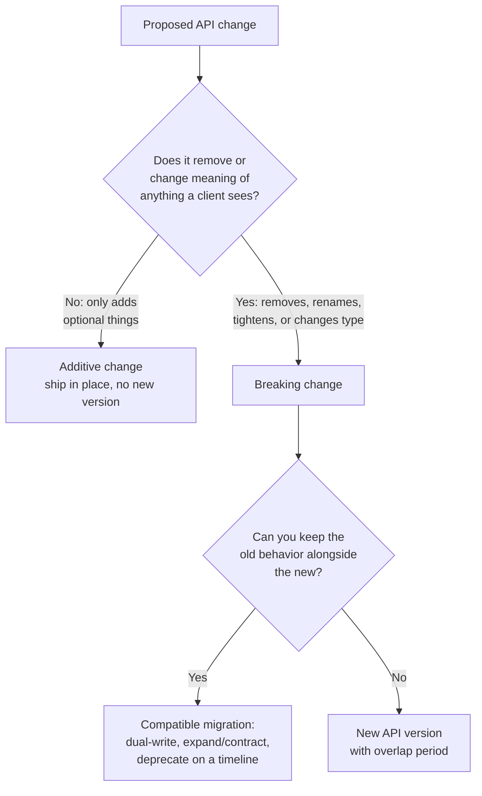

# API versioning and backward compatibility

## Why this matters

It's a Tuesday afternoon and the mobile team is in your channel asking why their app is crashing in production. Nothing on your side changed today — except the small refactor you shipped this morning, where you renamed a JSON field from `full_name` to `name` because `full_name` always bothered you. The web client picked up the change in its next deploy and is fine. The iOS app, version 4.2, parses `full_name` into a non-optional struct field, gets `nil`, and panics on launch. A large fraction of your install base is still on version 4.2. You cannot deploy a fix to them today, or this week, because Apple review takes days and users update on their own schedule.

That's the asymmetry that makes API design different from internal refactoring. Inside a single deployable, a rename is a find-and-replace and the compiler catches the stragglers. Across a network boundary, every client is a separate deployable on a separate release schedule that you do not control. The moment a third party — a mobile app, a partner integration, a customer's cron job — depends on your response shape, that shape is a contract, and breaking it breaks them at a time of your choosing and their suffering.

The engineers who learn this the hard way start versioning everything defensively and end up with `/v7/` endpoints nobody can explain. The ones who learn it well understand a smaller, sharper rule: **most changes don't need a new version at all if you make them additively, and the rare change that does need one needs a migration plan, not just a new URL.** This chapter is about telling those two cases apart, and handling the breaking case so that the mobile team never pings you on a Tuesday again.

## Mental model

A version is a promise about a contract. The contract is the full surface a client can observe: request shape, response shape, status codes, error formats, pagination, defaults, and the *semantics* behind all of them. Backward compatibility means an old client keeps working unchanged against a new server. Forward compatibility — equally important and usually forgotten — means a new client's *requests* don't break an old server, and that clients tolerate fields they don't recognize.

The central distinction is **additive vs. breaking**:



This maps almost exactly onto Semantic Versioning (semver.org). For a library, semver encodes the same promise in a `MAJOR.MINOR.PATCH` string: PATCH for backward-compatible bug fixes, MINOR for backward-compatible additions, MAJOR for breaking changes. An HTTP API is a published library whose "import" is a URL or a header. A new optional field is a MINOR bump nobody needs to know about. Removing a field is a MAJOR bump, and for an API that means a real version boundary with two versions running at once.

The asymmetry of obligations is the part worth internalizing. As the server, you must accept the old request shape and you must keep producing the old response shape, for as long as old clients exist. As a client, you must ignore response fields you don't understand rather than rejecting them — this is Postel's Law ("be conservative in what you send, liberal in what you accept," from RFC 1122), and it's what lets a server add fields without a version bump in the first place. A client that validates responses with a strict, closed schema turns every additive server change into a breaking one. The contract is a two-party agreement even when only one party writes it down.

## In practice

### What counts as additive (safe) vs. breaking

Ship these in place, no version bump:

- Adding a new endpoint or a new optional request parameter (with a sensible default).
- Adding a new field to a response.
- Relaxing a validation constraint (accepting input you previously rejected).

These break someone and need a migration:

- Removing or renaming a field, endpoint, or parameter.
- Changing a field's type (`string` → `number`), or its meaning (cents → dollars).
- Making an optional request field required, or tightening validation.
- Changing default behavior, pagination size, sort order, or error status codes.
- Adding a new enum value that an *old* client receives and can't handle.

Enum values deserve their own note, because they sit exactly on the boundary. Adding a value an old client never actually receives is safe. Adding one it *can* receive — and switches on with no default branch — breaks it: the `switch` falls through, the exhaustiveness check the client never wrote isn't there to save it, and you get a crash or a silently dropped case. The only way an enum extension is genuinely additive is if you documented, from day one, that clients must tolerate unknown values and route them to a default. Absent that contract, treat any new enum value a client can observe as breaking.

### Where the version lives: URL vs. header

Two dominant styles, and the field genuinely disagrees.

**URL path versioning** (`GET /v2/orders/123`) is what Stripe-scale public APIs mostly avoid but what most internal and partner APIs use, because it is impossible to get wrong. The version is visible in every log line, curl command, and browser address bar. It is trivially routable at the gateway. The cost is that the version applies to the whole path, so "v2" tends to mean "we rewrote a lot," and URLs that should identify a resource now also encode a release.

**Header versioning** keeps URLs clean and versions the representation, not the resource:

```http
GET /orders/123 HTTP/1.1
Accept: application/vnd.acme.order+json; version=2
```

This is the more REST-purist position (a `/orders/123` is one resource; `version=2` selects a representation of it, exactly what content negotiation is for, RFC 9110 §12). The cost is real: it's invisible in a browser, easy to forget in a curl, and harder for caches and CDNs to vary on correctly. Stripe uses a third style — a per-account pinned date version (`Stripe-Version: 2024-06-20`) sent as a header, defaulting to the version the account first integrated against — which gives every customer a stable contract and lets Stripe ship frequently.

> **Connect the dots:** Header-based versioning interacts directly with caching (Part 9). If a response varies by `Accept` version, the cache key must include it via the `Vary` header, or a CDN will serve a v2 body to a v1 client. URL versioning sidesteps this because the version is already part of the cache key. This is a concrete case where an architecture decision has a caching consequence three layers down.

My default for a new API: **URL path versioning with a major number only** (`/v1`, `/v2`), reserved for genuinely breaking redesigns, combined with disciplined additive evolution *within* a version so you almost never need `/v2`. It optimizes for the thing that actually hurts in production — debuggability and routability — and it's the version scheme a new engineer understands without a document. Save header/date versioning for when you have Stripe's problem: thousands of external integrators and a need to ship breaking changes frequently without coordinating.

### Handling a breaking change compatibly: expand and contract

Back to the `full_name` → `name` rename. The wrong way is one commit that renames the field. The right way is the **expand/contract** pattern (also called parallel change), borrowed from database migrations. You never have a moment where old and new can't coexist.

**Phase 1 — Expand.** Add the new field. Keep the old one. Populate both. Nothing breaks because nothing was removed.

```typescript
// Response serializer — Phase 1: both fields present, same value
interface UserResponse {
  id: string;
  /** @deprecated since v1.4 (2026-06-15); use `name`. Removed no earlier than 2026-12-15. */
  full_name: string;
  name: string;
}

function serializeUser(u: User): UserResponse {
  return {
    id: u.id,
    full_name: u.displayName, // old clients keep reading this
    name: u.displayName,      // new clients read this
  };
}
```

For a breaking change to a *request* field, expand means accepting both spellings, preferring the new one:

```typescript
// Request handler — accept old and new param names during overlap
function parseName(body: Record<string, unknown>): string {
  const name = body.name ?? body.full_name; // new wins; old still works
  if (typeof name !== "string" || name.length === 0) {
    throw new BadRequest("`name` is required");
  }
  return name;
}
```

**Phase 2 — Migrate and announce.** Update your own first-party clients to use `name`. Announce the deprecation: changelog, `Deprecation` and `Sunset` HTTP headers (RFC 9745 and RFC 8594), and ideally a direct email to known integrators. The `Sunset` header carries a machine-readable date.

```http
HTTP/1.1 200 OK
Deprecation: @1750000000
Sunset: Sat, 15 Dec 2026 00:00:00 GMT
Link: <https://docs.acme.com/changelog#user-name>; rel="deprecation"
```

**Phase 3 — Measure.** Do not remove the field on a calendar date alone. Instrument it. Log every request that still reads `full_name` (for a request field) or, for a response field, track which API keys are still on old client versions. You remove the field when usage hits zero *or* when the announced sunset passes and remaining users have been individually warned — whichever your policy says, but never blind.

```typescript
// Phase 3: emit a metric whenever the deprecated path is exercised
function parseName(body: Record<string, unknown>): string {
  if (body.full_name !== undefined && body.name === undefined) {
    metrics.increment("api.deprecated_field.used", {
      field: "full_name",
      api_key_hash: hashKey(currentRequest.apiKey),
    });
  }
  const name = body.name ?? body.full_name;
  if (typeof name !== "string" || name.length === 0) {
    throw new BadRequest("`name` is required");
  }
  return name;
}
```

**Phase 4 — Contract.** Usage is zero or the sunset has passed with notice given. Remove `full_name`. This is the only phase that breaks anyone, and by now it breaks no one.

### Locking the contract with tests

A changelog is a promise; a test is enforcement. Two layers catch regressions before they reach a client.

**Schema snapshot / linting.** Diff your OpenAPI spec on every PR and fail the build on a breaking diff. Tools like `oasdiff` classify changes as breaking or not:

```bash
$ oasdiff breaking openapi.base.yaml openapi.head.yaml
1 breaking changes:
  error  response property removed  GET /users/{id}  full_name (200)
```

**Consumer-driven contract testing** flips the dependency. Each consumer publishes a *pact* — the exact requests it makes and responses it expects — and the provider's CI verifies it can still satisfy every published pact before deploying (the Pact framework, pact.io). Now the question "will this change break the mobile app?" has a CI answer instead of a Tuesday answer.

```typescript
// Consumer test (mobile team) — publishes the contract it depends on
await provider
  .uponReceiving("a request for a user")
  .withRequest({ method: "GET", path: "/users/123" })
  .willRespondWith({
    status: 200,
    body: { id: like("123"), name: like("Ada Lovelace") }, // does NOT depend on full_name
  });
```

If the mobile team's pact never references `full_name`, the provider's contract verification goes green the moment you drop it — proof, not hope.

> **Security note:** Every version you keep alive for the overlap period is attack surface you keep alive too. An old `/v1` may carry weaker input validation, looser auth scopes, or a serializer that leaks a field the new version stopped returning. "We'll deprecate it eventually" quietly becomes "we run a less-secure API forever." Patch security fixes across *all* live versions, not just the latest, and let the security cost of an unretired version be one of the forces driving its sunset.

## Pitfalls and anti-patterns

**The Big Bang v2.** You decide v1 is messy, design a beautiful v2, ship it, and announce v1 dies in three months. Three months later, a large share of traffic is still on v1 because migration is *your* convenience and *their* cost. Now you maintain two full APIs indefinitely. *Recognize it* by a v2 that changes many unrelated things at once "while we're in here." *Fix it* by never doing redesign-driven versioning: evolve additively within v1, and if you truly need v2, scope it to the minimum breaking set and plan for a long, measured overlap, not a deadline.

**The strict consumer.** A client validates responses against a closed schema (`additionalProperties: false`) and rejects any field it doesn't recognize. Now your safe additive change — a new field — crashes that client, turning every MINOR into a MAJOR. *Recognize it* when clients break on changes that added nothing they used. *Fix it* on the client by ignoring unknown fields (open schemas, tolerant readers); document this requirement in your API guidelines so integrators build tolerant parsers from day one.

**Calendar-only deprecation.** You announce a sunset date and delete the field when it arrives, without measuring whether anyone still calls it. *Recognize it* as the incident where a partner integration breaks on the sunset date because they never read the email. *Fix it* by gating removal on telemetry: instrument the deprecated path, drive usage toward zero, and treat the date as the *earliest* removal, not an automatic one.

**Version sprawl from non-breaking changes.** Every change, even adding a field, spawns `/v3`, `/v4`, `/v5`. Clients can't tell which version has what, and you maintain a museum. *Recognize it* by a version number that climbs on additive changes. *Fix it* by reserving version bumps strictly for breaking changes and routing everything else through additive evolution; a version that increments monthly is a smell.

**Semantic breakage with a stable shape.** The JSON shape is byte-for-byte identical, but `amount` now means dollars instead of cents, or `status: "active"` now excludes trials it used to include. Schema diffs and contract tests pass; clients silently compute wrong numbers. *Recognize it* as the worst kind of break — no error, just wrong results downstream. *Fix it* by treating meaning as part of the contract: a semantic change needs a new field (`amount_cents` alongside `amount`) or a new version, never a quiet redefinition of an existing one.

## Production checklist

- [ ] A written API style guide that defines additive vs. breaking and names the chosen versioning scheme (URL major version is a safe default)
- [ ] OpenAPI spec checked into the repo and treated as the source of truth, generated from or validated against the running server
- [ ] CI step that diffs the spec on every PR and fails on a breaking change (`oasdiff` or equivalent)
- [ ] Consumer-driven contract tests (Pact) for every known programmatic consumer, verified in the provider's pipeline before deploy
- [ ] Clients (yours and documented for third parties) ignore unknown response fields and tolerate unknown enum values
- [ ] Deprecation process: `Deprecation` + `Sunset` headers, changelog entry, and direct notice to known integrators
- [ ] Telemetry on every deprecated field/endpoint, keyed by API consumer, with a dashboard that drives removal decisions
- [ ] Removal gated on measured usage reaching zero (or post-sunset with documented individual notice), never on a date alone
- [ ] Overlap policy stating how long two versions run concurrently and who owns sunsetting the old one
- [ ] Security fixes applied across every live version, not just the latest, with old-version risk treated as pressure to retire it
- [ ] Default API behavior (pagination size, sort order, included fields) treated as part of the contract and change-controlled

## Exercises

1. **(Comprehension)** For each change, classify it as additive or breaking, and if breaking, say why an old client would fail: (a) adding an optional `?include=address` query parameter; (b) renaming response field `created` to `created_at`; (c) changing `price` from an integer of cents to a decimal string of dollars; (d) adding a new `"refunded"` value to an existing `status` enum that clients switch on; (e) returning `404` instead of `200` with an empty body for a missing resource.

2. **(Applied)** Take an endpoint that returns `{ "name": "Ada", "email": "ada@x.com" }` and you must split `name` into `first_name` and `last_name` without breaking existing clients. Write the four expand/contract phases: the serializer that emits all three fields, the deprecation headers, a metric that fires when a client still depends on `name`, and the condition under which you'd delete it. Add a Pact contract for a consumer that reads only `first_name`/`last_name` and show it stays green through the contraction.

3. **(Open-ended design)** You run a public API with thousands of external integrators and need to ship breaking changes roughly monthly without coordinating with each integrator. Design the versioning strategy. Decide between URL, header, and pinned-date versioning; specify how a client selects a version and what the default is for a brand-new integrator; define the deprecation/sunset lifecycle and how long versions overlap; and explain how you'd keep the maintenance burden bounded as versions accumulate. Justify each decision against the alternative you rejected.

## Further reading

- RFC 9110, *HTTP Semantics* — §12 content negotiation, the formal basis for header/`Accept`-based versioning (https://www.rfc-editor.org/rfc/rfc9110)
- RFC 9745, *The Deprecation HTTP Response Header Field* — the `Deprecation` header and its `deprecation` link relation (https://www.rfc-editor.org/rfc/rfc9745)
- RFC 8594, *The Sunset HTTP Header Field* — the machine-readable deprecation date (https://www.rfc-editor.org/rfc/rfc8594)
- Semantic Versioning 2.0.0 — the MAJOR/MINOR/PATCH contract that API evolution mirrors (https://semver.org)
- *Stripe API: Versioning* — the canonical pinned-date, per-account versioning scheme and the reasoning behind it (https://stripe.com/docs/api/versioning)
- Pact: consumer-driven contract testing — turning "will this break a consumer?" into a CI check (https://docs.pact.io)
- Roy Fielding, *Architectural Styles and the Design of Network-based Software Architectures* (2000), ch. 5 — REST, resources, and representations, the source of the "version the representation, not the resource" argument (https://ics.uci.edu/~fielding/pubs/dissertation/top.htm)
- *Google API Improvement Proposals* — AIP-180 (backwards compatibility) and AIP-185 (versioning), a rigorous public ruleset for what counts as breaking (https://google.aip.dev)
