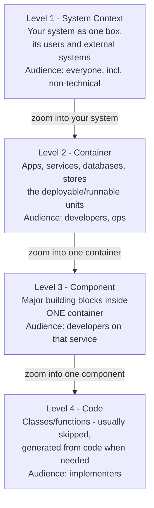
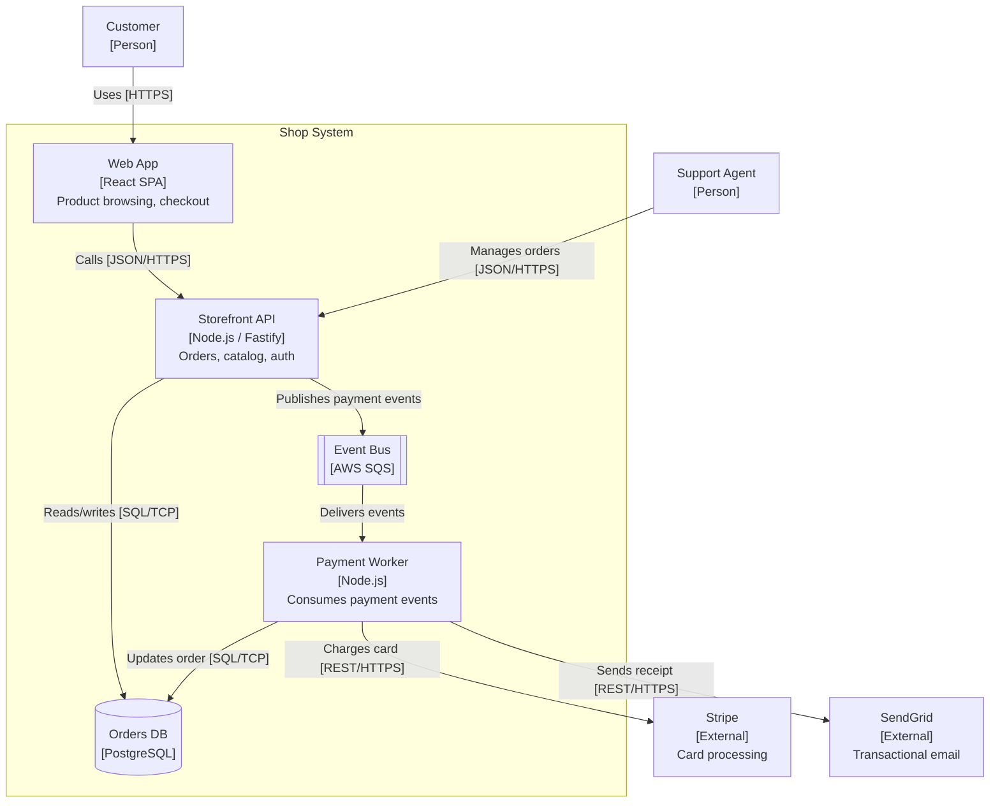
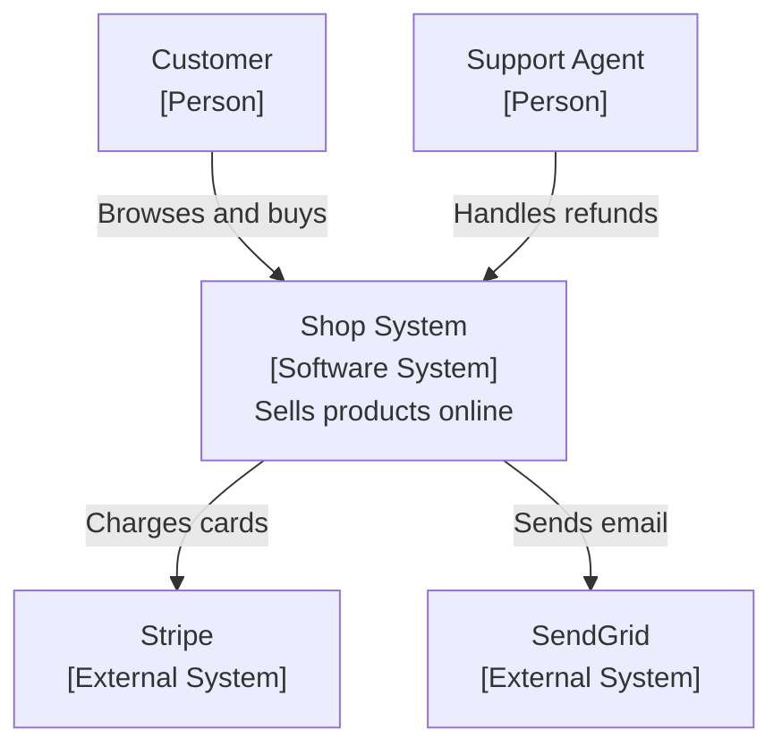
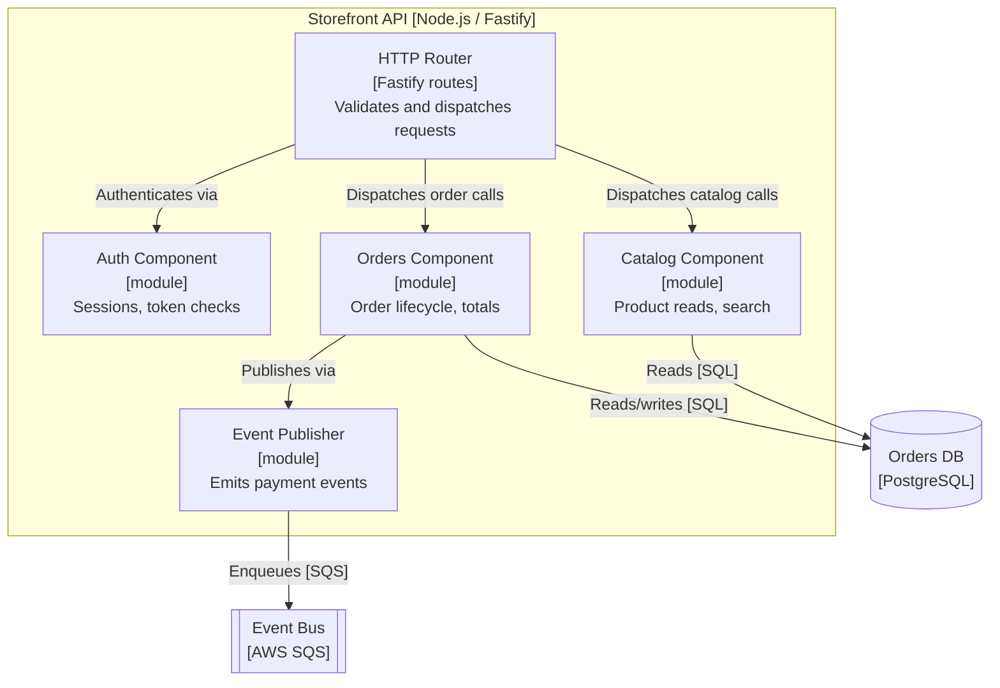

# C4 diagrams and architecture docs

## Why this matters

It's a Tuesday afternoon and a new backend engineer, three days into the job, pings you: "Where does the payment webhook actually get processed? I see a `PaymentController`, a `BillingService`, a `webhooks` queue, and something called `recon-worker`, and I can't tell which one is the source of truth." You answer in Slack. Twenty minutes of back-and-forth, a screenshot of a whiteboard you drew six months ago, a "wait, that diagram is out of date, we moved that to the worker in Q1." By the time they understand the flow, you've lost half an hour and they've lost their morning.

Multiply that by every new hire, every on-call engineer paged at 2 a.m. into a service they've never touched, every architecture review where someone asks "and what calls this?" and the room goes quiet. The cost of not having a system diagram others can read without you is not one expensive afternoon. It's a tax on every person who ever touches the system, paid continuously, forever. And the cruel part is that the people who pay it most are the ones with the least context: the new hire, the on-call engineer, the auditor, the future you who has forgotten.

The reflexive fix is "draw a diagram." But most architecture diagrams make things worse. They're a cloud of boxes with unlabeled arrows, a mix of abstraction levels where a Kafka topic sits next to a class named `Helper`, and no legend telling you whether an arrow means "calls over HTTP," "writes to," or "vaguely related to." C4 is the discipline that fixes this. It's not a tool or a notation you have to buy into. It's a way of choosing what to put on each diagram so that a reader can actually answer their question. This chapter is how you draw systems people read without asking you.

## Mental model

C4, created by Simon Brown, is a set of four nested zoom levels for describing software architecture. The "C4" is the four levels: **Context, Container, Component, Code.** The core insight is that a single diagram cannot serve everyone, so you draw a small set of diagrams at decreasing zoom, and you never mix levels on one diagram.

The map analogy is the one that sticks. Context is the map of the world showing your country. Container is the map of the country showing its cities. Component is the street map of one city. Code is the floor plan of one building. You'd never put street-level detail on a world map, and you'd never try to show the whole world on a street map. Each level answers a different question for a different reader.



A word on vocabulary, because the levels are only useful if you use the words precisely. A **container** in C4 has nothing to do with Docker. It is any separately deployable or runnable thing: a single-page app, an API process, a mobile app, a database, a message broker, a serverless function, a scheduled job. The test is "could this be started, stopped, or deployed on its own?" A **component** is a grouping of related code inside one container that has a clear responsibility, like an "Order Reconciliation" module or a "Payment Gateway adapter." It is not a single class, and it is not a deployable unit. Getting these two words right resolves most arguments about which level a box belongs on.

Two rules carry most of the value. **First: one level of abstraction per diagram.** If a box on your container diagram is a class, you've leaked Level 3 into Level 2 and the diagram is now lying about its zoom. **Second: every element and every arrow has a label that says what it is and how it talks.** A box is "Web Application [React SPA]," not "Frontend." An arrow is "Reads orders from [JSON/HTTPS]," not a bare line. The notation is deliberately boring so the content carries the meaning. A C4 diagram should be legible to someone who has never heard of C4, which is exactly what a UML-heavy diagram fails at.

There is a third, quieter rule that matters once more than one person draws diagrams: **pick a small, consistent visual grammar and write it down.** People (sharp-cornered boxes), software systems (one fill color), external systems (a different, muted fill), datastores (cylinders), and infrastructure nodes should look the same in every diagram your team produces. C4 deliberately leaves the styling to you, which means without a one-paragraph convention in your repo, two engineers will produce two visual dialects and readers will burn attention decoding the style instead of the system.

In practice almost everyone draws Levels 1 and 2, draws Level 3 only for the few services complex enough to need it, and skips Level 4 entirely because the IDE and the code are a better, always-current "Level 4" than any diagram you'd maintain by hand.

## In practice

The most useful single artifact for a typical team is the **Container diagram** (Level 2). It shows the runnable units of your system and how they communicate, which is exactly what an on-call engineer or a new hire needs. Here's one for a modest e-commerce backend, written as Mermaid so it lives next to the code in version control.

### A Container diagram



Read it the way the new hire would. The payment webhook question from the opening answers itself: the API publishes events, the queue delivers them, the worker charges Stripe and updates the order. There's exactly one source of truth for "who talks to Stripe," and it's labeled with the protocol. Nobody had to Slack you.

Notice what's deliberately absent. There are no class names, no function calls, no internal layering of the API. That's Level 3, and it doesn't belong here. There's also a legend baked into the labels themselves: `[React SPA]`, `[PostgreSQL]`, `[HTTPS]`. Shapes carry a hint too (cylinder for a datastore, subroutine box for a queue), but the text is what's authoritative, because shape conventions are the first thing readers forget.

### The Context diagram

One level up, the Context diagram drops all internal detail and shows your system as a single box among its users and neighbors. It's the diagram you put on the first slide of any review.



This is the whole point of separating levels: the CFO can read the Context diagram, and the on-call engineer can read the Container diagram, and neither is drowning in the other's detail.

### When (and only when) to draw a Component diagram

Most teams never need Level 3, and reaching for it reflexively is a mistake — it ages fastest because it sits closest to the code. Draw one only for a container that is genuinely intricate enough that "where does responsibility X live inside this service?" is a recurring question. The Storefront API above is a fine candidate, because it mixes auth, catalog, and order logic. A Component diagram zooms into exactly one container and shows the major code groupings inside it and how they collaborate.



Note the discipline that keeps this honest. Each box is a responsibility, not a class — "Orders Component," not `OrderService`, `OrderRepository`, and `OrderDto` as three boxes. The moment you find yourself drawing individual classes, you've fallen through to Level 4, and Level 4 is the IDE's job, not the diagram's. If this diagram and the code disagree a month from now, delete the diagram rather than letting it lie; a Component diagram earns its keep only while it's true.

### Diagrams as code, checked into the repo

The single most important practical decision is to store diagrams **as text in the repository**, not as binaries in a wiki. Mermaid (shown above) renders natively in GitHub, GitLab, and most docs tools. For larger systems, the **Structurizr DSL** lets you describe the model once and generate every level from it, so the container and context views can never drift from each other.

```text
workspace {
    model {
        customer = person "Customer"
        shop = softwareSystem "Shop System" {
            web = container "Web App" "Product browsing, checkout" "React SPA"
            api = container "Storefront API" "Orders, catalog, auth" "Node.js / Fastify"
            db  = container "Orders DB" "" "PostgreSQL" {
                tags "Database"
            }
        }
        stripe = softwareSystem "Stripe" "Card processing" {
            tags "External"
        }

        customer -> web "Uses" "HTTPS"
        web -> api "Calls" "JSON/HTTPS"
        api -> db "Reads/writes" "SQL/TCP"
        api -> stripe "Charges cards" "REST/HTTPS"
    }
    views {
        systemContext shop { include * autolayout lr }
        container shop { include * autolayout lr }
        theme default
    }
}
```

Define the model once; the `systemContext` and `container` views render from the same element set. Add a container and it appears in every view that includes it. This is the structural fix for the "the diagram is out of date" problem: there's one model, and the views are projections of it. The trade-off is real, so name it honestly. Mermaid is zero-setup and renders in a GitHub PR with no toolchain, but each view is hand-maintained and the views can drift from one another. Structurizr removes that drift by deriving views from a single model, at the cost of a build step and a DSL your team has to learn. A reasonable default: start with Mermaid, and graduate a system to Structurizr only when it has enough containers that keeping the Context and Container views in sync by hand has actually bitten you.

### Keeping docs alive

A diagram dies the moment it lives somewhere the code change can't see it. The discipline that keeps docs alive is to bind them to the change that would invalidate them:

- **Co-locate.** Put diagrams in `/docs/architecture/*.md` in the same repo as the code. A PR that adds the Payment Worker is the same PR that adds it to `container.md`.
- **Make staleness reviewable.** Add a checklist item to your PR template: "Architecture diagram updated if containers/components changed?" Reviewers can see the diff in the Mermaid source, the same way they review code, so an out-of-date diagram is a reviewable omission rather than an invisible one.
- **Render in CI.** Run a Structurizr or Mermaid lint/render step in CI so a broken diagram fails the build like broken code does. This catches the unbalanced bracket or the renamed container before it reaches a reader, and it makes the diagram source a first-class build artifact rather than a comment nobody runs.
- **Pair diagrams with ADRs.** The diagram shows *what* the architecture is; the Architecture Decision Record (Part 13, Chapter 4) records *why*. A diagram without the reasoning gets second-guessed; an ADR without the diagram is hard to picture. Link them in both directions so a reader landing on either one can find the other.

> **Connect the dots:** The Container diagram is the most useful single input to a threat model. Each box is a trust boundary candidate and each labeled arrow is a data flow to classify (Part 11, Security). Drawing the C4 container view first makes a STRIDE pass dramatically faster, because the data flows are already named.

> **Security note:** Treat the labels as a security artifact, not just documentation. An arrow labeled "Charges card [REST/HTTPS]" tells a reviewer that cardholder data crosses a boundary to an external system; an unlabeled line hides it. Be deliberate about what the diagram itself reveals, too: a public Context diagram is fine, but a Container diagram that names internal hostnames, queue ARNs, or admin endpoints is reconnaissance if it leaks. Keep the detailed views in the private repo with the code, and keep secrets (credentials, tokens, exact internal addresses) out of labels entirely.

## Pitfalls and anti-patterns

**The Mixed-Abstraction Diagram.** A single picture where a load balancer, a microservice, a database, and a class named `OrderValidator` all sit as peer boxes. *Recognize it* when you can't answer "what level is this?" in one word, or when zooming in reveals nothing because the detail is already on the page. *Fix it* by splitting into separate Context, Container, and Component diagrams and moving each box to the level it belongs to. If a box is a deployable unit, it's Level 2; if it's a thing inside a deployable unit, it's Level 3.

**The Unlabeled Spaghetti.** Boxes connected by bare lines or arrows with no text, so the reader can't tell an HTTP call from a database write from "these are conceptually related." *Recognize it* when the diagram needs you standing next to it narrating. *Fix it* with the rule that every arrow gets a verb and a protocol: "Reads orders from [JSON/HTTPS]." If you can't label an arrow, you don't understand the relationship well enough to draw it.

**The Wiki Mausoleum.** A beautiful diagram exported as a PNG into Confluence, last edited many months ago, that everyone quietly knows is wrong but nobody trusts enough to use or fix. *Recognize it* by asking three engineers if the diagram is current and getting three shrugs. *Fix it* by moving the source into the repo as Mermaid or Structurizr DSL, deleting the PNG, and making updates part of the PR that changes the architecture. A diagram that isn't versioned with the code will rot.

**The Big Ball of Everything.** One enormous diagram trying to show every service, queue, and dependency in the company on a single canvas, requiring an oversized monitor and minutes of panning. *Recognize it* by the horizontal scrollbar and the font shrunk to fit. *Fix it* by respecting the zoom levels: the company-wide view is a System Landscape (systems only, no internals), and each system gets its own container diagram. As a rule of thumb, if a diagram has grown past roughly a dozen or so boxes, it is probably trying to be two diagrams.

**Over-documenting Level 4.** Hand-drawn class diagrams that are obsolete before the PR merges, maintained out of a sense of completeness. *Recognize it* by a `code-diagram.png` that contradicts the actual classes. *Fix it* by deleting it. If you genuinely need code-level diagrams, generate them from the source on demand (IDE class diagrams, `pyreverse`, etc.) so they're never stale, and only for the rare module complex enough to warrant it.

**The Inconsistent Dialect.** Two teams draw the same kind of system with different shapes, colors, and label conventions, so a reader who moves between repos has to relearn the visual language each time. *Recognize it* when "is that box a database or an external system?" depends on which team drew it. *Fix it* by committing a one-paragraph styling convention next to the diagrams (what shape and fill mean person, system, external, datastore) and applying it everywhere, so the notation is invisible and the content does the talking.

## Production checklist

- [ ] A System Context diagram exists and is legible to a non-engineer (one box for your system, plus users and external systems)
- [ ] A Container diagram exists showing every deployable/runnable unit and datastore
- [ ] Component diagrams exist only for the services complex enough to need them, not reflexively for all
- [ ] Every element label states what it is, including technology: `[PostgreSQL]`, `[React SPA]`
- [ ] Every arrow has a verb and a protocol: "Reads from [SQL/TCP]," "Publishes to [SQS]"
- [ ] No diagram mixes abstraction levels (no class sitting next to a load balancer)
- [ ] A one-paragraph styling convention (shapes/colors for person, system, external, datastore) is committed alongside the diagrams
- [ ] Diagram source is text (Mermaid or Structurizr DSL) committed in the same repo as the code
- [ ] No secrets or sensitive internal addresses (credentials, tokens, internal hostnames/ARNs) appear in any label
- [ ] PR template includes "architecture diagram updated?" when containers/components change
- [ ] CI renders/validates the diagram source so broken diagrams fail the build
- [ ] Each significant diagram links to the ADR(s) that explain the decisions behind it
- [ ] No exported PNG/JPG diagram is the source of truth anywhere

## Exercises

1. **(Comprehension)** Take the Container diagram in this chapter and identify, for each of the four C4 levels, what would and would not appear on it. Specifically: name one element that belongs on the Context diagram but not the Container diagram, and one that belongs on the Component diagram but not the Container diagram. Then explain why the Payment Worker is a container and not a component, using the "could this be deployed on its own?" test from the mental model.

2. **(Applied)** Pick a service you currently work on. Draw its Container diagram in Mermaid, following both rules: one abstraction level, and every element and arrow labeled with technology and protocol. Commit it to `/docs/architecture/container.md` in the repo. Then open the diagram with one teammate who didn't help draw it and have them trace a single user request through it without you speaking. Note every point where they had to ask a question, and fix the diagram so the next reader doesn't have to.

3. **(Design)** Your company has grown to roughly 30 services across 6 teams and there is no coherent architecture documentation. Design a documentation system that stays alive as the org scales. Decide: which C4 levels are mandatory versus optional, where diagrams live, how a model-once tool like Structurizr fits (or doesn't), how you'd enforce updates in code review and CI, and how you'd handle the System Landscape view across team boundaries without it becoming a Big Ball of Everything. State your defaults and the trade-offs you're accepting.

## Further reading

- Simon Brown, [The C4 model for visualising software architecture](https://c4model.com) — the canonical, free, primary source; read this first
- [Structurizr DSL documentation](https://docs.structurizr.com/dsl) — define the model once, generate every level from it
- [Mermaid documentation](https://mermaid.js.org/) — diagrams-as-code that render natively in GitHub, GitLab, and most doc tools
- Simon Brown, *Software Architecture for Developers* (Leanpub) — book-length treatment of communicating architecture, the source of the C4 model
- [arc42](https://arc42.org/overview) — a complementary, free template for the surrounding architecture documentation (context, constraints, decisions) that diagrams slot into
- George Fairbanks, *Just Enough Software Architecture* — on choosing how much architecture documentation is worth maintaining, which pairs well with C4's "skip Level 4" pragmatism
