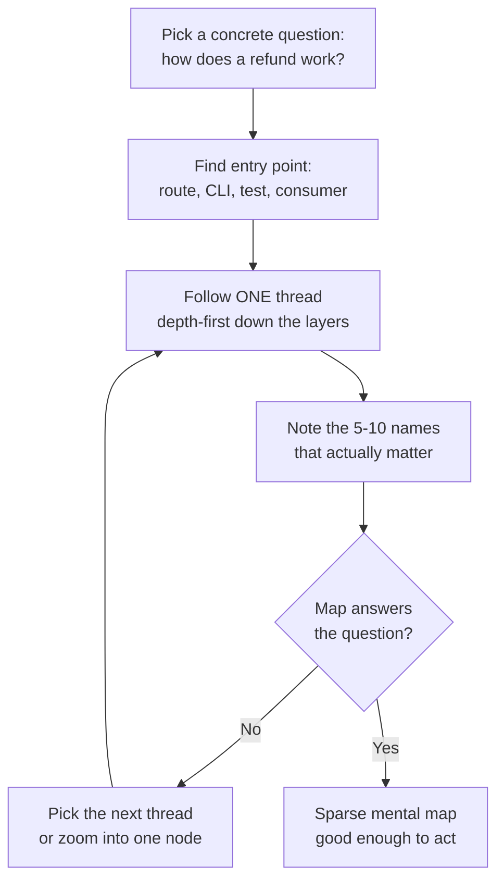

# Reading code at speed

## Why this matters

It's your first Tuesday at a new job. The onboarding doc says "the checkout service lives in `payments-api`," and a ticket is already assigned to you: a bug where refunds occasionally apply twice. You clone the repo. It's 240,000 lines of Kotlin across 900 files, eleven years of history, four people who wrote most of it have left. You open `main()` and find a Spring Boot entry point that does almost nothing but wire beans. You open the file the ticket mentions, `RefundService.kt`, and it calls six other services, each of which calls more. By lunch you've read forty files and understand nothing. You feel like a fraud.

The senior engineer sitting next to you was handed an equally unfamiliar codebase last month. By the end of *her* first Tuesday she had a one-page diagram of how a request flows from the API gateway to the database, knew which three classes mattered for refunds, and had already found the missing idempotency key that causes the double-refund. She is not smarter than you. She has a method. She knows that you do not read a codebase the way you read a novel — front to back — you read it the way a detective reads a crime scene: find the entry point, follow one thread all the way through, and let the structure reveal itself.

This is the single most leveraged skill in software, and no bootcamp teaches it. Bootcamps teach you to *write* code on a blank canvas. But over a twenty-year career you will spend far more time reading code you didn't write than writing code from scratch — onboarding to new teams, debugging across service boundaries, reviewing PRs, evaluating a dependency before you adopt it. The engineers who orient fast in unfamiliar code are the ones who ship in week one instead of week six. This chapter is the method they use.

## Mental model

The wrong model is "read the code linearly until you understand it." A large codebase has no meaningful beginning, and you will run out of working memory long before you run out of files. The right model has three moves, applied in a loop:

1. **Find an entry point** — a place where execution demonstrably *starts*: an HTTP route, a CLI command, a cron handler, a message consumer, a test. Entry points are anchors because you know something real happens there.
2. **Follow one thread** — trace a single request or operation from that entry point down through the layers, ignoring everything off the path. Depth-first, not breadth-first.
3. **Build a map** — write down the few names that matter (the 5 to 10 types and functions the thread passes through) and how they connect. The map, not the full codebase, is what you hold in your head.

The key insight is that **you are building a sparse map, not a complete one.** A city has millions of buildings; a useful subway map shows a few dozen stations and the lines between them. Your goal on day one is the subway map, not the satellite photo.



Three forces make this work. **Locality**: in well-structured code, the things that change together live together, so once you find the right module you rarely need to leave it. **Naming**: names are the cheapest documentation, and following well-named symbols is faster than reading bodies. **Tests as oracles**: a test is executable documentation of intended behavior with the entry point and the expected output both written down. When the prose docs lie, the tests usually don't.

## In practice

Let's orient in a real repo from cold. The exact commands matter; run these in order on any unfamiliar codebase.

### Step 1: Read the shape before any code

Before opening a single source file, learn the topology. The directory structure and build manifest tell you what kind of program this is and where the seams are.

```bash
# What is this, and how big?
$ tokei            # or: cloc . — language breakdown and line counts
$ git ls-files | sed 's,/[^/]*$,,' | sort | uniq -c | sort -rn | head -20
   312 src/main/kotlin/com/acme/payments/domain
   188 src/main/kotlin/com/acme/payments/api
    96 src/test/kotlin/com/acme/payments/domain
    ...
```

That one-liner — count files per directory, sort descending — is the fastest "where does the weight live?" signal there is. The biggest directories are where the domain logic concentrates. Then read the manifest (`package.json`, `build.gradle`, `go.mod`, `Cargo.toml`, `pyproject.toml`). Dependencies are a fingerprint: a `spring-boot-starter-web` plus `flyway` plus `postgresql` tells you "HTTP service, relational DB, versioned migrations" before you've read a line of logic.

Then skim the README and any `docs/` or `ARCHITECTURE.md`. Treat docs as a hypothesis, not ground truth — they rot — but they're the cheapest way to learn the intended structure.

### Step 2: Find the entry point

You need the place execution starts for the behavior you care about. For an HTTP service, that's the route table. Grep for the framework's routing primitives:

```bash
# Spring: find HTTP mappings
$ grep -rn "@\(Get\|Post\|Put\|Delete\)Mapping" src/main --include=*.kt | grep -i refund
src/main/kotlin/com/acme/payments/api/RefundController.kt:24:  @PostMapping("/refunds")
src/main/kotlin/com/acme/payments/api/RefundController.kt:41:  @PostMapping("/refunds/{id}/cancel")
```

The pattern generalizes. For Express: `grep -rn "app\.\(get\|post\|put\)\|router\." src/`. For Flask/FastAPI: `grep -rn "@app\.\|@router\." .`. For a CLI: find the arg-parser setup (`argparse`, `cobra.Command`, `clap`). For an event consumer: grep for the subscribe/`@KafkaListener`/`@SqsListener` annotation. The principle is identical: locate where the outside world hands control to this code.

### Step 3: Follow one thread, depth-first

Open `RefundController.kt:24` and trace. Use your editor's "go to definition" (or `grep` for the symbol) at each hop. Write the chain as you go. Don't read the whole body of each function — read the *call* you're following and skip the rest.

```kotlin
// RefundController.kt
@PostMapping("/refunds")
fun createRefund(@RequestBody req: RefundRequest): RefundResponse {
    val refund = refundService.refund(req.paymentId, req.amount)  // <- follow this
    return RefundResponse.from(refund)
}
```

```kotlin
// RefundService.kt
fun refund(paymentId: PaymentId, amount: Money): Refund {
    val payment = paymentRepo.findById(paymentId)              // DB read
    require(payment.refundableAmount() >= amount)              // a business rule!
    val refund = Refund.create(payment, amount)
    gateway.submitRefund(refund)                               // external call
    return refundRepo.save(refund)                             // DB write
}
```

In two hops you've found the spine of the operation: read payment, check a rule, call the external gateway, persist. That `require(...)` line is a business rule worth noting. And notice what's *missing* — there's no idempotency check. Hold that thought; it's your bug. The point is you reached it by following one thread, not by reading 900 files.

Keep a running scratch note. Plain text is fine:

```text
THREAD: POST /refunds
  RefundController.createRefund        api/RefundController.kt:24
    -> RefundService.refund            domain/RefundService.kt:31
       reads  PaymentRepository
       rule   refundableAmount >= amount
       calls  PaymentGateway.submitRefund   (external, money moves here)
       writes RefundRepository
  NOTE: no idempotency key checked before submitRefund  <-- suspected bug
```

### Step 4: Read the tests as documentation

The fastest way to confirm intended behavior is the test for the code you just read. Tests give you a runnable entry point, realistic inputs, and the expected output, all in one place.

```bash
$ find . -name '*RefundService*Test*' -o -name '*RefundServiceSpec*'
src/test/kotlin/com/acme/payments/domain/RefundServiceTest.kt
```

```kotlin
@Test fun `refund fails when amount exceeds refundable balance`() { ... }
@Test fun `partial refund leaves remaining balance refundable`() { ... }
// Notice what is NOT tested: a duplicate refund request.
```

The *absence* of a test for duplicate requests is a second strong signal pointing at your idempotency bug. Reading tests tells you both what the code is supposed to do and where the author's attention wasn't.

### Step 5: Use history to find the "why"

Code tells you *what*; `git` tells you *why* and *who*. When a line looks strange, blame it.

```bash
# Who wrote this line, in what commit, with what message?
$ git log -L 31,45:src/main/kotlin/com/acme/payments/domain/RefundService.kt
# Or, line-by-line authorship:
$ git blame -L 31,45 src/main/kotlin/com/acme/payments/domain/RefundService.kt
```

`git log -L` is underused and powerful: it shows the full history of *just those lines*, newest first, so you can read how that exact logic evolved. `git log -S 'submitRefund'` (the "pickaxe") finds every commit that added or removed that string — the fastest way to find where a concept was introduced. The commit message that introduced the gateway call may say "TODO: add idempotency, tracked in PAY-1042." Now you have a ticket and a person to ask.

### Step 6: Run it and watch it move

Static reading has limits. The fastest way to confirm a thread is to make the code tell you about itself: run the relevant test under a debugger and step through, or — when a debugger is awkward across service boundaries — add temporary log lines at the hops you care about and trigger the path once. A stack trace from a deliberately-thrown exception is a free, accurate call graph. Generated artifacts help too: an OpenAPI spec, a dependency graph (`./gradlew dependencies`, `go mod graph`, `madge --image graph.svg src/`), or the DB schema from migrations all give you structure for free.

> **Connect the dots:** Following a request end-to-end is exactly the skill distributed tracing automates in production (Part 11, Observability). A trace span tree *is* the runtime version of the depth-first thread you just traced by hand. Reading code and reading traces are the same mental motion at different timescales.

## Pitfalls and anti-patterns

**The boil-the-ocean read.** You open the repo and start reading files alphabetically, or worse, top-to-bottom in the biggest file, trying to understand everything before touching anything. *Recognize it:* you've read for two hours and can't state what any single request does. *Fix:* throw away the goal of "understand the codebase." Replace it with one concrete question ("how does a refund happen?") and follow exactly one thread to answer it. Comprehension is a byproduct of answering specific questions, never the goal itself.

**Definition-chasing into the abyss.** You go-to-definition on `submitRefund`, which leads to an interface, which has three implementations, and you open all three, then chase each of their dependencies, and forty tabs later you're lost. *Recognize it:* your tab count exceeds your map's node count. *Fix:* at an interface, find the *one* implementation actually wired in (grep for where the bean/DI binding is configured, or set a breakpoint and look at the concrete type at runtime). Trace the real path, not every possible path.

**Trusting names and comments over behavior.** A function called `validateAndSave` that no longer validates, a comment describing logic that was refactored away two years ago. *Recognize it:* the behavior in tests or production contradicts what a name or comment implies. *Fix:* treat names and comments as hints with a confidence level, and let tests, `git blame`, and a running debugger be the tiebreaker. Behavior is ground truth; everything else is a claim.

**Ignoring the build and dependency graph.** Diving straight into `src/` without learning how the project is assembled, so you can't tell generated code from hand-written, or a vendored copy from the real source. *Recognize it:* you're confused about why your edits "don't take effect" (you edited generated output) or why two near-identical files exist. *Fix:* read the build manifest and `.gitignore` first; know what's generated, what's vendored, and what's hand-authored before reading any of it.

**Reading without writing anything down.** Holding the whole call chain in your head, re-deriving it every time you get interrupted. *Recognize it:* you re-trace the same path on Wednesday that you traced on Tuesday. *Fix:* keep a scratch map (the plain-text format above is enough). Externalizing the map is what turns a one-time trace into durable understanding, and it doubles as the start of your onboarding notes for the next hire.

## Production checklist

Use this when dropped into any unfamiliar repo:

- [ ] Read the file-count-per-directory histogram and the build manifest before any source file
- [ ] Skim README / `ARCHITECTURE.md` / `docs/` as a hypothesis, not as truth
- [ ] Identify the program type and entry points (HTTP routes, CLI commands, consumers, cron, `main`)
- [ ] Write down one concrete question to answer first
- [ ] Trace exactly one thread depth-first from an entry point; skip everything off the path
- [ ] Maintain a plain-text scratch map of the 5 to 10 names that matter and their connections
- [ ] Read the test for the code you're tracing; note what is *not* tested
- [ ] Use `git log -L`, `git blame`, and `git log -S` on anything that looks strange
- [ ] Run one path under a debugger or with temporary logging to confirm the static read
- [ ] Generate the structural artifacts you can: dependency graph, API spec, DB schema from migrations
- [ ] Save your scratch map back into the repo's docs — the next person will thank you

## Exercises

1. **(Comprehension)** Take a service you already know and, without looking at code, draw the path of one request from its HTTP entry point to the database and back. Now open the code and verify your drawing. List every place your mental model was wrong. The gaps are exactly the spots where you'd have been slow in an unfamiliar repo.

2. **(Applied)** Clone a mid-sized open-source project you've never seen (for example, a popular Express or FastAPI app). Within 30 minutes, produce a one-page map answering a single concrete question — "how does it authenticate a user?" — using only the steps in this chapter: entry-point grep, one depth-first thread, the relevant test, and `git log -L` on the trickiest line. Time-box it strictly and note where you exceeded budget.

3. **(Design)** Your team onboards a new engineer every quarter and each one spends two weeks lost in a 300k-line monorepo. Design a "code orientation kit" that cuts time-to-first-meaningful-PR in half: which artifacts you'd generate and keep fresh (entry-point index, request-flow diagrams, a "start here" reading order), how you'd prevent them from rotting, and how you'd measure whether it worked. State the one artifact you'd build first and why.

## Further reading

- John Ousterhout, *A Philosophy of Software Design*, 2nd ed. — chapters on complexity, naming, and "obvious code"; the inverse view of what makes code *readable* tells you what to look for when it isn't.
- Diomidis Spinellis, *Code Reading: The Open Source Perspective* (Addison-Wesley) — the rare full-length book devoted to reading rather than writing code, with worked examples on real systems.
- Michael Feathers, *Working Effectively with Legacy Code* — "characterization tests" and seams: how to understand and safely change code with no documentation and no tests.
- `git help log` and `git help blame` — read the sections on `-L` (line-range history), `-S`/`-G` (the pickaxe), and `--follow`; these are the highest-leverage archaeology tools Git ships.
- Peter Naur, ["Programming as Theory Building"](https://pages.cs.wisc.edu/~remzi/Naur.pdf) (1985) — the classic argument that a program *is* the theory in its authors' heads, and reading code is the act of rebuilding that theory.
