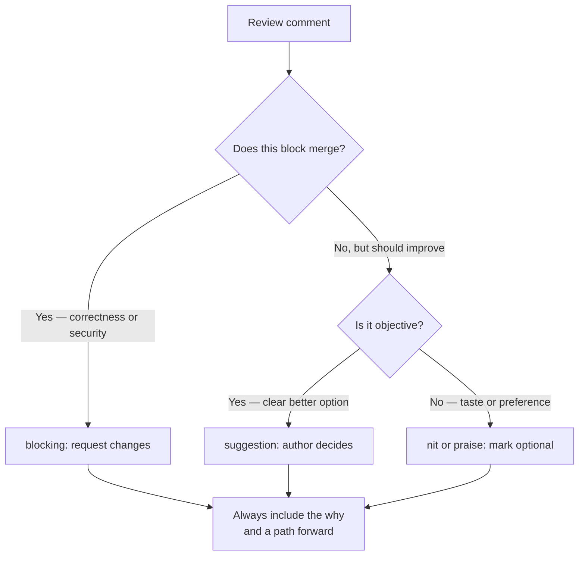

# Code review as a teaching act

## Why this matters

It's a Tuesday afternoon. A new hire, three weeks in, opens their first non-trivial pull request: a fix for a race condition in the payment retry path. They've been nervous about it for two days. The first review comment lands within ten minutes: "This is wrong, you're not even holding the lock here." No question, no link, no suggestion. The author re-reads their own code four times, can't see what the reviewer means, and spends the next hour afraid to ask. The PR sits for three days. When it finally merges, the author has learned exactly one thing: send smaller PRs so fewer people look at them.

Now rewind and run the same change through a different reviewer. The comment reads: "I think there's a window between the `get` on line 42 and the `set` on line 47 where another worker can retry the same charge — two workers both see `attempts=2`, both increment, and we double-charge. Am I reading that right? If so, an atomic compare-and-swap or a `SELECT ... FOR UPDATE` would close it. Here's how we solved the same thing in the refunds path: [link]." Same defect. Same severity. But the second comment teaches the author to *see* the race themselves next time, gives them the vocabulary (`compare-and-swap`), and points at a pattern the codebase already trusts. The author merges in an hour and catches the next race condition on their own.

Code review is the highest-leverage teaching surface most teams have. It happens continuously, on real code, in context, with a built-in feedback loop. A team that reviews well compounds: every engineer absorbs the standards, the patterns, and the failure modes of everyone senior to them, a few comments at a time. A team that reviews badly compounds too, in the wrong direction: people learn to dodge review, ship in fear, and treat the approval as a gate to game rather than a conversation to have. The defect-catching value of review is real but secondary. The durable value is that it's how a team's collective judgment gets transmitted.

And the leverage runs both ways. The reviewer who writes the same explanation three times realizes the third time that the explanation belongs in a linter rule, a doc, or the architecture itself — review surfaces the gaps in your tooling and your onboarding as fast as it surfaces bugs. Treat the comments you write most often as a backlog of automation and documentation you haven't built yet.

## Mental model

A review comment carries two payloads at once: a *change request* (do this differently) and a *signal about why* (here's the principle, so you can apply it yourself next time). Bad reviews carry only the first. Great reviews lead with the second, because the principle is the part that transfers. A change request fixes one line in one PR; a principle fixes a category of mistakes across every PR that author writes for the rest of their tenure. The return on the extra sentence is enormous and it compounds.

The other axis that matters is authority. Not every comment is equal: some block the merge, some are suggestions, some are just the reviewer thinking out loud. When that distinction is implicit, the author has to guess which comments are mandatory — and they'll guess conservatively, treating every nitpick as a blocker, which slows everyone down and breeds resentment. Make it explicit.



Two principles fall out of this model. First, **the cost of a comment is asymmetric**. A blocking comment that turns out to be wrong, or pedantic, costs the author hours and costs you trust. A non-blocking suggestion you forgot to mark as optional costs the same, because the author can't tell the difference. So the default move is to label authority explicitly and reserve "blocking" for things that are actually unsafe to merge. Second, **review is for the author, not the audience**. You are not performing rigor for the benefit of onlookers; you are trying to leave one specific person more capable than they were this morning. That reframe changes the tone of nearly every comment you write.

A useful mantra, borrowed from Google's widely-cited engineering practices: approve when the change *improves the overall code health of the system*, even if it isn't perfect. Review is not the place to make the code match the version you would have written. Perfect is the enemy of merged — a PR held hostage to your stylistic preferences is a PR not shipping value, and the marginal improvement you're extracting rarely justifies the delay or the goodwill it burns.

## In practice

### What to actually look for, in priority order

Reviewers waste enormous energy on the wrong layer. Style and formatting should be the machine's job, not yours. Spend your human attention top-down:

1. **Correctness and intent** — does it do what the description says, and is what the description says the right thing to do? Race conditions, off-by-ones, error handling, edge cases (empty, null, huge, concurrent).
2. **Security and data integrity** — injection, authz checks, secrets in code, irreversible migrations, anything that can lose or leak data.
3. **API and interface design** — names, signatures, and contracts are the expensive-to-change part. A bad internal implementation is cheap to fix later; a bad public method name lives for years.
4. **Tests** — do they test behavior, not implementation? Would they actually fail if the code were wrong?
5. **Readability and maintainability** — will the next person understand this in six months?
6. **Style and formatting** — *let the linter do this*. If you're commenting on quote style or import order, you've automated the wrong thing.

The ordering is the point. Attention is finite, and a comment thread about brace placement crowds out the comment about the unhandled error path. If you find yourself deep in layer six before you've thought about layer one, stop and re-read the diff for what could actually break in production.

### Good comment vs. bad comment, on the same change

Suppose the PR adds this function:

```python
def get_user_orders(user_id):
    orders = db.query(f"SELECT * FROM orders WHERE user_id = {user_id}")
    return [o for o in orders if o.status != 'cancelled']
```

*The same idea in TypeScript:*

```typescript
async function getUserOrders(userId: number): Promise<Order[]> {
  const orders = await db.query(`SELECT * FROM orders WHERE user_id = ${userId}`);
  return orders.filter((o) => o.status !== "cancelled");
}
```

A weak review produces comments like these:

```text
- line 2: SQL injection.
- line 2: don't use SELECT *.
- line 3: filter in the DB.
- why isn't there a test?
```

Each is technically correct and each teaches nothing. The author now has a chore list and no understanding. Compare a teaching review of the identical code:

```text
[blocking] line 2: This interpolates `user_id` straight into SQL, so a
crafted id can run arbitrary queries — the classic injection hole. Use a
parameterized query and the driver escapes it for you:
    db.query("SELECT ... WHERE user_id = %s", [user_id])
We standardized on parameterized queries everywhere; OWASP has the
canonical writeup if useful: https://owasp.org/www-community/attacks/SQL_Injection

[suggestion] lines 2-3: We filter `cancelled` in Python after pulling every
row. For a user with thousands of orders that's a lot of wasted I/O. Pushing
`AND status != 'cancelled'` into the WHERE clause lets the DB use the index.
Not blocking, but worth it if it's quick.

[nit, optional] `SELECT *` will silently pull new columns as the schema grows.
Listing the columns you need is more stable. Take it or leave it.

[blocking] No test covers the cancelled-order filtering. A test that inserts
one active and one cancelled order and asserts only the active one returns
would lock the behavior in. Happy to pair on the fixture if it's fiddly.
```

The difference is not length, it's structure. Each comment states the *why*, labels its authority, and where it blocks, offers a path forward. The injection comment teaches a transferable rule (never interpolate untrusted input into a query string). The filtering comment teaches a performance intuition (push work to the index). The `SELECT *` nit teaches a stability principle (depend on the narrowest contract you can). The author leaves the review having learned four things, not having completed four tasks — and the next time they touch a query, they reach for the parameterized form on their own.

Notice also what the teaching version does *not* do: it doesn't bury the injection blocker — the one comment that genuinely must be addressed — in a flat list next to a stylistic nit. The labels triage the author's attention for them.

### Phrasing that lands

Small wording choices change how a comment is received without changing its content:

- Ask, don't assert, when you might be wrong: "Is there a reason this isn't memoized?" beats "memoize this." You might be missing context, and the question invites the answer instead of a defense.
- Critique the code, not the person: "this function does three things" not "you wrote this confusingly."
- Use "we" for shared standards: "we parameterize queries here" signals a team norm, not your personal preference.
- Say what's good. A "nice — I didn't know about `functools.cache`, going to steal that" costs nothing and makes the next blocking comment land as collaboration rather than attack.
- Offer to pair on anything you're asking for that's non-obvious. It converts a demand into help.

Some teams encode this with a lightweight convention — prefixes like `nit:`, `suggestion:`, `question:`, `blocking:` — sometimes formalized (see the Conventional Comments convention in Further reading). The exact labels don't matter; the explicit authority does. The convention also does quiet cultural work: once "nit" is a sanctioned, low-status category, reviewers feel free to raise a small preference without it reading as an order, and authors feel free to wave it off without it reading as defiance.

### The author's half of the contract

Receiving review well is a skill, and it's at least half of what makes review work. The defensive author — who argues every point, takes feedback as an attack, and treats the diff as their identity — slowly trains reviewers to stop bothering, and the quality of the review they get decays to "looks fine." The author who treats review as free senior attention gets better fast.

- **Make the PR reviewable.** Small, single-purpose, with a description that states *what* and *why* and what you considered and rejected. A 2,000-line PR doesn't get reviewed; it gets rubber-stamped. Self-review your own diff first and leave comments on the tricky parts before anyone else looks — half the questions a reviewer would ask, you can pre-empt.
- **Assume good faith.** A blunt comment is almost always time pressure, not contempt. Read it as the most charitable version, and respond to the technical content rather than the tone.
- **Disagree in the open, then commit.** If you think a blocking comment is wrong, say why — "I considered FOR UPDATE but we're on read-replicas here, so I used an advisory lock instead, does that address it?" Reviewers are often missing context, and surfacing it is exactly the conversation review is for. Once a decision is made, commit to it even if it wasn't your preference.
- **Don't argue nits, just fix them.** Spending ten minutes defending a variable name burns goodwill you'll want for the comment that actually matters.
- **Say thank you, and close the loop.** Mark each comment resolved with what you did, so the reviewer doesn't have to re-derive the whole diff to see what changed.

> **Connect the dots:** A reviewable PR depends on a reviewable history. The atomic, single-purpose commits and clean branch hygiene from Part 3 are what make a diff legible enough to teach from in the first place — review and version control are the same craft seen from two angles.

## Pitfalls and anti-patterns

**The Rubber Stamp.** "LGTM" on a 1,500-line PR thirty seconds after it's posted. Recognize it when approval speed correlates inversely with PR size — the bigger the change, the *faster* it's approved, because nobody can actually hold it in their head. The fix is upstream: enforce small PRs (a soft cap is a commonly cited practice; any specific line-count threshold against your own data before mandating it), and if a large PR is unavoidable, ask the author to walk you through it synchronously or split it into a reviewable stack. An approval you didn't earn is worse than no review, because it launders risk into false confidence — the change now carries the institutional weight of "reviewed" with none of the scrutiny.

**The Gauntlet.** A reviewer who treats every PR as a test the author must pass, piling on dozens of comments, blocking on personal taste, demanding the code be rewritten their way. Recognize it by the author's behavior: they start splitting work to avoid that reviewer, or stop asking questions. The fix is the code-health bar — approve anything that improves the system, even imperfect, and separate "this is wrong" from "I'd have done it differently." If you have many style opinions, encode them in a linter, not in comments, so they apply uniformly and impersonally.

**Unlabeled authority.** Every comment reads as mandatory because none of them say otherwise, so the author treats your idle musing as a blocker and grinds on it for an hour. Recognize it when authors over-comply, reworking things you only wondered about aloud. The fix is mechanical: prefix non-blocking comments (`nit:`, `optional:`, `consider:`) and reserve plain or `blocking:` comments for things that genuinely must change.

**Latency as a silent tax.** A PR that sits a day waiting on review isn't free — the author context-switches away, the branch drifts from main, and the eventual review is slower because everyone has to page the change back in. Recognize it in cycle-time metrics: time-to-first-review creeping past a day. The fix is to treat review as interrupt-worthy work, not something you get to "when you have time." A two-minute review now beats a thorough one tomorrow for almost every small PR.

**Reviewing the diff, not the change.** Looking only at the red and green lines and missing what the diff *doesn't* show: the caller three files away that now passes the wrong argument, the migration that's irreversible, the deleted test that was load-bearing. Recognize it when bugs land in code that "passed review" but in untouched files. The fix is to check out the branch for anything non-trivial, read the surrounding code, and ask "what could this break that isn't in the diff?"

> **Security note:** Review is the last human gate before code reaches production, which makes it the right place to catch the failures automation misses — a leaked credential in a config file, an authz check quietly dropped from a hot path, a dependency bump that pulls in an unvetted transitive package. Don't rely on it as the *only* gate (secret scanning and SAST belong in CI), but route security-relevant diffs — auth, crypto, migrations, dependency changes — to a reviewer who is expected to look specifically for these, and say so in the PR.

## Production checklist

- [ ] Linting, formatting, and import-ordering are fully automated in CI and pre-commit — zero human comments on style
- [ ] PRs have a soft size cap; larger changes are split into a reviewable stack or walked through synchronously
- [ ] A PR template prompts for *what*, *why*, *what was considered and rejected*, and *how it was tested*
- [ ] Comment-authority convention is documented and used (`nit:` / `suggestion:` / `question:` / `blocking:`)
- [ ] Blocking comments include the *why* and, where non-obvious, a concrete path forward or an offer to pair
- [ ] Time-to-first-review is tracked; a target SLA (e.g. same business day) is set and visible
- [ ] Authors self-review their own diff and annotate tricky sections before requesting review
- [ ] Branch protection requires review on `main`, with no self-approval (see Part 3)
- [ ] Security-relevant changes (authz, migrations, crypto, dependencies) get a required reviewer or a checklist
- [ ] The team periodically reviews its own review norms — what's blocking too often, what's rubber-stamped

## Exercises

1. **(Comprehension)** Take the bad-review comment list from the "In practice" section (`line 2: SQL injection`, etc.). For each terse comment, write the teaching version: state the *why*, label its authority (blocking / suggestion / nit), and where it blocks, include a concrete path forward. Then articulate, in one sentence per comment, what transferable principle the author should walk away with.

2. **(Applied)** Find a PR you reviewed (or authored) in the last month. Categorize every comment on it as blocking, suggestion, or nit, and tag each as *teaching* (states a why the author can reuse) or *transactional* (a bare change request). Compute the ratio. If more than half were transactional, rewrite three of them as teaching comments. If you were the author, audit your responses for the receiving-review behaviors above.

3. **(Design)** Your team of twelve has a median time-to-first-review of roughly a day and a half and a recurring complaint that review feels like a gauntlet for juniors but a rubber stamp for seniors. Design a set of review norms and the automation to support them: PR size policy, comment-authority convention, reviewer assignment, an SLA and how you'd measure it, and what you'd automate out of human hands entirely. State which single change you'd ship first and why, and how you'd know in a month whether it worked.

## Further reading

- Google, *[Engineering Practices: Code Review Developer Guide](https://google.github.io/eng-practices/review/)* — the most cited practical guide; the "code health" bar and the reviewer/author guides are essential.
- Karl Wiegers, *Peer Reviews in Software: A Practical Guide* — the canonical book on review as a quality and learning practice, predating modern PR tooling but still the deepest treatment.
- Michaela Greiler, *[Code Review research and best practices](https://www.michaelagreiler.com/code-review-best-practices/)* — writing grounded in empirical studies of what makes review effective, from a researcher who studied large-scale industry practices.
- *[Conventional Comments](https://conventionalcomments.org/)* — a lightweight, widely-adopted convention for labeling comment authority (`praise:`, `nit:`, `suggestion:`, `issue:`).
- SmartBear / Cisco, *[Best Practices for Peer Code Review](https://smartbear.com/learn/code-review/best-practices-for-peer-code-review/)* — source of the often-cited findings on review velocity and a per-session effectiveness ceiling. the specific numbers before quoting them.
- *The Pragmatic Programmer* (Hunt & Thomas), 20th Anniversary Edition — on egoless programming and treating feedback as information, not judgment.
