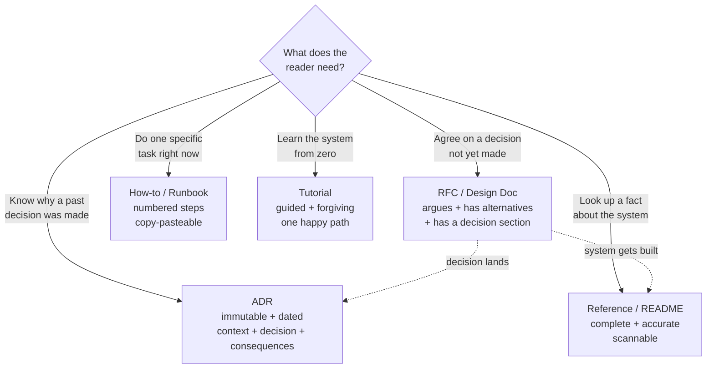

# Writing documentation, RFCs, and design docs

## Why this matters

It's a Tuesday afternoon and the payments team is three weeks into building a new refund pipeline. In standup, someone mentions they're calling the ledger service synchronously on every refund. The tech lead frowns: "Wait, we decided two months ago that all ledger writes go through the async queue because of the lock contention incident." Half the room nods. The other half has no idea this decision was ever made. There's no document. The decision lived in a Slack thread that's now buried under ten thousand messages, and the person who made it left in March. So the team relitigates it for forty-five minutes, reaches the same conclusion, and goes back to work three weeks of partially-wrong code later.

That meeting cost the same as writing the design doc would have, except the doc would have paid for itself ten times over: onboarding the next hire, settling the argument the first time someone asked, and giving the reviewer who approved the synchronous call something to check against. The decision was made. It just wasn't *durable*. Undocumented decisions don't bind the team — they evaporate the moment the people in the room change, and on any team longer-lived than a few months, the people in the room always change.

This is the gap this chapter closes. Documentation is not bureaucratic overhead you produce after the real work. For anything that touches more than one person, the document *is* the work — it's the artifact that turns one engineer's opinion into the team's shared decision, that lets ten people act as if they were in a room they were never in. The senior engineers who get listened to are not the ones with the best ideas in the moment. They're the ones who write the doc that makes the idea checkable, debatable, and durable. This chapter is about writing those documents so they actually get read, actually get used, and don't rot.

## Mental model

Documentation is not one thing. The single most common failure is treating it as one thing — writing a "design doc" that's secretly a tutorial, or an API reference that's secretly an argument. Each kind of document answers a different question for a different reader at a different time, and the four big kinds barely overlap. The Diátaxis framework names them well: tutorials (learning), how-to guides (a specific task), reference (lookup), and explanation (understanding). An RFC or design doc is a fifth kind that the four-quadrant model doesn't cover: it's a document written *before* the thing exists, to get agreement on building it.

The axis that matters most is **time relative to the decision**. Some documents argue toward a decision that hasn't been made yet (RFCs, design docs, proposals). Some record a decision that's already final and immutable (ADRs — Architecture Decision Records). Some describe a system that already exists and changes under you (reference docs, runbooks, READMEs). Confusing these is fatal: a design doc that reads like settled reference invites no debate and gets rubber-stamped; a reference doc full of "we're considering" hedging tells the reader nothing they can act on.



The second mental model is about the reader, not the writer. You are not writing to record what you know. You are writing to change what *one specific reader* can do after reading. A design doc's reader is a skeptical peer who will look for the case you didn't consider. A runbook's reader is a stressed on-call engineer at 3 a.m. who needs the exact command and cannot afford prose. Write for that person's state of mind, and most stylistic questions answer themselves.

## In practice

### The RFC / design doc skeleton

An RFC (Request for Comments, the name borrowed from the IETF tradition that gave us the documents defining TCP, HTTP, and email) is the workhorse document for any non-trivial technical decision. Here is a skeleton that holds up across teams. Steal it.

```markdown
# RFC 042: Async refund processing via ledger queue

**Status:** Draft | In Review | Accepted | Rejected | Superseded by RFC-NNN
**Author:** @yourname
**Reviewers:** @ledger-team-lead, @payments-eng
**Created:** 2026-06-15
**Decision by:** 2026-06-25   (a real date forces the discussion to close)

## Summary
One paragraph. What are we proposing and why, in language a new
hire could follow. If a reader stops after this paragraph, they
should still know what's being decided.

## Background / Problem
What is true today, and what specifically is wrong with it. Link
the incident, the metric, the customer complaint. Establish the
problem *before* proposing anything — reviewers can't evaluate a
solution to a problem they don't yet believe exists.

## Goals / Non-goals
- Goal: refunds never block on ledger lock contention.
- Goal: refund status observable within seconds of request.
- Non-goal: changing the refund *authorization* flow (separate RFC).
- Non-goal: sub-second refund settlement (out of scope).

## Proposal
The design. Diagrams, schemas, API shapes, sequence of operations.
Be concrete enough that someone could start building from this.
Show the data model and the failure modes, not just the happy path.

## Alternatives considered
The most important section, and the one most often skipped.
- **Synchronous with row-level locking.** Rejected: reproduces the
  earlier incident under load; tail latency unacceptable.
- **Dual-write to ledger + cache.** Rejected: no clean consistency
  story on partial failure.
For each: what it was, and the *specific* reason it lost.

## Risks / Tradeoffs
What we give up. Eventual consistency means refund status is briefly
"pending"; here's how we surface that to support. Name the cost
honestly — a doc with no tradeoffs section reads as either naive
or dishonest, and reviewers trust it less.

## Rollout / Migration
Feature flag, backfill, the order of operations, the rollback plan.

## Open questions
Things you genuinely don't know yet. Listing them invites help
instead of hiding gaps.
```

The two sections that separate a strong RFC from a weak one are **Alternatives considered** and **Goals / Non-goals**. Alternatives prove you did the work and pre-empt the reviewer's "but why not just…?" — answer it in the doc, not in forty comment threads. Non-goals are a fence around the discussion: without them, every review devolves into someone dragging in an adjacent problem you never intended to solve.

### Status is not decoration

The `Status` field is the single most load-bearing line in the document. An RFC moves `Draft → In Review → Accepted`. Once accepted, the *decision* is frozen even as the system evolves — which is exactly the ADR pattern. An ADR (Michael Nygard's format) is the minimal immutable record of one decision:

```markdown
# ADR 7: Use the async queue for all ledger writes

## Status
Accepted (2026-06-25). Supersedes the synchronous pattern in ADR-3.

## Context
Synchronous ledger writes caused lock contention under refund
spikes (see the March incident review). We need writes that don't
block request handlers.

## Decision
All ledger writes go through the durable async queue. Read paths
may query the ledger directly.

## Consequences
- Ledger state is eventually consistent (typically within seconds).
- Callers must handle a "pending" status.
- The queue is now a tier-1 dependency requiring its own on-call.
```

The discipline that makes ADRs work: **you never edit a decision, you supersede it.** When a new RFC overturns an old choice, the old ADR's status becomes `Superseded by ADR-12` and stays in the repo. Six months later, when someone asks "why didn't we just write synchronously?", the trail is right there — the original reasoning *and* the reason it changed. Store ADRs as markdown next to the code in `docs/adr/`, numbered sequentially, reviewed through the same pull request as the code that implements them.

### Writing for the reader, not the writer

Compare two openings for the same runbook entry. The wrong way:

```markdown
## Ledger Queue Consumer Lag

The ledger queue consumer is a Go service that subscribes to the
refunds topic. It was introduced in Q2 2026 as part of the async
migration. The architecture uses a consumer group with at-least-once
delivery semantics. Lag can occur for various reasons including but
not limited to network partitions, slow downstream calls, or
consumer crashes. If you observe lag, you may want to investigate.
```

The right way:

```markdown
## Runbook: ledger consumer lag > 60s

**Symptom:** `ledger_consumer_lag_seconds` alert firing.
**Impact:** refunds stuck in "pending"; customers see no refund yet.

1. Check consumer health: `kubectl get pods -n ledger -l app=consumer`
2. If pods are CrashLooping → see "consumer crash" below.
3. If pods are healthy but lag is climbing, check downstream:
   `curl -s ledger-api/health/db | jq .latency_p99`
4. If db latency is elevated → page the database on-call (#db-oncall).
5. To drain a backlog fast, scale consumers: `kubectl scale ...`

**Rollback:** there is none; this is operational. Do not redeploy.
```

The first version tells a story to no one. The second one assumes the reader is stressed, scanning, and needs the next command. It leads with symptom and impact (so the reader confirms they're in the right place), then gives numbered, copy-pasteable, branching steps. The historical context — "introduced in Q2 2026" — is irrelevant to someone fixing an outage and belongs in a design doc, not a runbook. Match the document's density to the reader's state.

A few concrete habits that travel across all document types:

- **Lead with the answer.** Summary first, then detail. Readers decide in the first paragraph whether to keep reading; reward them.
- **One canonical home per fact.** If the retry count is documented in three places, two of them are already wrong. Link, don't copy.
- **Show, then tell.** A schema, a diagram, a sample request/response beats two paragraphs describing them.
- **Date and own everything.** Every doc gets an author and a date. Anonymous, undated docs are untrustworthy by default — the reader can't tell if they describe the current system or one from two years ago.

### Which docs are worth maintaining

Not all documentation deserves to live. A document is a liability the moment it's written, because a *wrong* doc is worse than no doc: it actively misleads with the authority of the written word. The maintenance question is the real question.

The heuristic that works: maintain docs whose **cost of being wrong is high** and whose **rate of change is low**, or that have an owner who feels the pain of staleness. Concretely:

- **Worth maintaining:** runbooks (wrong ones cause outages), public API references (wrong ones break customers), onboarding setup guides (wrong ones burn every new hire), ADRs (immutable by design, so they never rot).
- **Let it die or automate it:** anything describing code that changes weekly, internal API docs that can be generated from the source of truth (OpenAPI specs, type definitions, `--help` output), and "current architecture" diagrams that drift the day after you draw them.

The strongest move is to make the docs that change a lot *not be docs at all* — generate them. Derive API reference from the OpenAPI spec, derive the config table from the typed config schema, derive the CLI docs from the command definitions. A generated doc cannot drift from the code, because the code is its source. Reserve hand-written prose for the things that genuinely need a human to explain *why* — and write those well, because they're the ones you've committed to keeping alive.

> **Connect the dots:** The RFC's "Alternatives considered" section is the same muscle as the code-review comment that asks "why this approach over X?" (Part 14, Code review as a teaching act). And ADRs stored in `docs/adr/` and reviewed through pull requests inherit every guarantee from Part 3 — versioned, blamed, immutable history. The decision record is just another commit.

## Pitfalls and anti-patterns

**The Settled-Tone RFC.** The doc is written as if the decision is already made — confident, no alternatives, no open questions. Recognize it by the absence of an "Alternatives considered" section and the reviewers leaving only "LGTM." The fix: explicitly invite dissent. Add the alternatives you rejected *with their strongest case*, list open questions, and set a real decision deadline. An RFC that no one argues with is an RFC that no one read.

**The Living Document That's Already Dead.** A wiki page titled "Current Architecture" last edited eighteen months ago, still presented as truth. Recognize it by the lack of a "last reviewed" date and by the gap between what it says and what's deployed. The fix: put a visible `Last reviewed: <date>` on every maintained doc, assign an owner, and add a quarterly review checkbox. If no one will own it, delete it — an honestly-absent doc beats a confidently-wrong one.

**Documentation as the Bug Fix.** A confusing API or a fragile setup gets a long doc instead of being fixed. The doc explains how to work around the sharp edge instead of filing it down. Recognize it by docs that mostly say "you have to remember to…" or "note that you must first…". The fix: treat repeated documentation of the same gotcha as a signal to fix the thing. The best documentation is the API that needs none.

**Copy-Paste Drift.** The same fact — a retry limit, an endpoint URL, an environment variable name — documented in four places, three of which are now stale. Recognize it by searching for any specific value and finding multiple, disagreeing hits. The fix: one canonical source per fact, everything else links to it. Better yet, generate the doc from the value's actual definition so drift is structurally impossible.

**The Wall of Prose.** A design doc that's twelve paragraphs with no diagram, no schema, no headings a reader can scan. Recognize it by reviewers who comment only on the first and last paragraph — that's all they read. The fix: break it with headers, lead each section with its conclusion, replace descriptions of structures with the structures themselves (a Mermaid diagram, a table, a code block).

## Production checklist

- [ ] Every RFC/design doc has: Status, Author, Date, a real "decision by" deadline, and an Alternatives-considered section
- [ ] Goals *and* non-goals are stated explicitly to fence the discussion
- [ ] Decisions are recorded as numbered, immutable ADRs in `docs/adr/`, superseded rather than edited
- [ ] ADRs and design docs are reviewed through the same pull-request flow as code
- [ ] Every maintained doc shows an owner and a `Last reviewed` date
- [ ] Runbooks lead with symptom + impact, then numbered copy-pasteable steps with branch points
- [ ] Reference docs that track fast-changing code are *generated* from the source of truth, not hand-written
- [ ] Each fact has exactly one canonical home; everything else links to it
- [ ] A quarterly review (or trigger-on-change) deletes or refreshes stale docs
- [ ] New-hire onboarding doubles as a doc test: where they get stuck is where the docs are wrong

## Exercises

1. **(Comprehension)** Take the Diátaxis four categories plus RFC and ADR, and classify five documents from a codebase you work in (a README, a runbook, an architecture page, a setup guide, a Slack-thread decision). For each, name its intended reader and that reader's state of mind. Identify at least one document that is secretly two kinds mashed together, and say how you'd split it.

2. **(Applied)** Find a real decision your team made informally — in Slack, in a meeting, in a code review — that was never written down. Write it up as an ADR using the four-section format (Status, Context, Decision, Consequences) in under 250 words. Open it as a pull request and see whether the reviewers agree the "Decision" line actually matches what was decided. The disagreement, if any, is the value.

3. **(Open-ended design)** Your team's documentation has rotted: contradictory wiki pages, three stale "architecture" diagrams, runbooks that reference deleted services. Design a documentation strategy that's still accurate in two years with realistic maintenance effort. Decide what to generate vs. hand-write, where docs live relative to code, who owns what, what the staleness-detection mechanism is, and — hardest — what you will choose *not* to document at all. State the tradeoffs of your plan.

## Further reading

- [Diátaxis](https://diataxis.fr/) — Daniele Procida's framework for the four kinds of documentation; the single most useful lens for deciding what a doc should be.
- Michael Nygard, ["Documenting Architecture Decisions"](https://cognitect.com/blog/2011/11/15/documenting-architecture-decisions) — the original ADR proposal, short and complete.
- [RFC 2119](https://www.rfc-editor.org/rfc/rfc2119) and the IETF RFC tradition — the model the industry borrowed; read a real protocol RFC (e.g. RFC 9110, HTTP Semantics) to see rigorous technical writing under pressure.
- Google, [*Software Engineering at Google*](https://abseil.io/resources/swe-book) — chapter 10, "Documentation," on treating docs as code with owners, reviews, and freshness.
- [Write the Docs](https://www.writethedocs.org/guide/) — a practitioner community guide covering docs-as-code, style, and maintenance.
- Julia Evans, [the wizardzines blog](https://jvns.ca/) — a masterclass in writing technical explanations for a real, specific reader.
