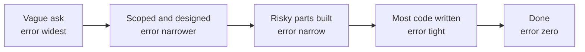

# Estimation that doesn't lie

## Why this matters

It's a Tuesday afternoon. Your PM stops by your desk: "Roughly how long for the CSV export feature? I just need a ballpark for the roadmap." You think about it for ten seconds — it's basically a query, a serializer, and a download endpoint — and you say "a couple of days." She nods, writes something down, and walks away. What she wrote down was "Thursday." What she told the VP was "Thursday." What the VP told the customer was "this week."

You ship eleven days later. The export had to stream because some accounts have two million rows. Streaming meant backpressure handling. The CSV had to match the exact column order of the legacy system or the customer's downstream import broke, which nobody mentioned until you demoed it. There was a timezone bug in the date columns that took a day to track down. None of this was visible from your desk on Tuesday. Your "couple of days" wasn't wrong about the happy path — it was wrong because it was a single number with no uncertainty attached, delivered for a problem you hadn't looked at yet, and it traveled up three levels of the org hardening into a promise at each hop.

The cost here isn't the four extra days of work. The work was always going to take as long as it took. The cost is the broken commitment: a customer who was told "this week," a VP who looks bad, a PM who now trusts your numbers less, and a you who feels pressure to cut corners to hit a date you invented in ten seconds. This chapter is about never being in that position again — not by estimating more accurately (you mostly can't), but by being honest about what you know and don't, attaching uncertainty to every number, and knowing when the correct answer is "I can't give you that yet, and here's what I can give you instead."

## Mental model

Three ideas do most of the work: the cone of uncertainty, reference-class forecasting, and ranges over points.

The **cone of uncertainty** says your estimation error is widest at the start of a project and narrows as you learn. At the moment someone first describes a feature, your honest error bar might be several-fold in either direction. After you've designed it, much narrower. After you've built the risky 20%, you can often call the rest tightly. The cone is not a failure of skill; it's a property of information. You cannot estimate away uncertainty you haven't yet resolved by doing the work.



The practical consequence: an estimate given at stage A and an estimate given at stage C are different kinds of object, and they should not be communicated the same way. The Tuesday-afternoon failure was giving a stage-A guess in stage-D language.

The cone is also *asymmetric*, which matters more than its width. Tasks can blow up far beyond the most-likely case — an undocumented requirement, a vendor outage, a subtle data-corruption bug — but they almost never finish dramatically faster than planned, because the happy path is already the floor. So the high tail is long and the low tail is short. An honest estimate reflects that lopsidedness: the distance from your midpoint up to the pessimistic case should be larger than the distance down to the optimistic case. A symmetric "plus or minus two days" quietly understates the real risk, because the bad surprises have more room to run than the good ones.

**Reference-class forecasting** comes from Daniel Kahneman and Amos Tversky's work on the planning fallacy and was formalized for projects by Bent Flyvbjerg. The idea: instead of building an estimate bottom-up from the inside of *this* task ("the query is easy, the endpoint is easy, so two days"), look at the outside view — the distribution of how long *similar* tasks actually took. "The last three export features we shipped took 9, 14, and 6 days." That reference class is a far better predictor than your decomposition, because it silently includes all the integration, review, timezone-bug, and surprise-requirement time that the inside view always forgets. The inside view estimates the work you can see; the outside view estimates the work that actually happened to people like you.

**Ranges over points.** A single number is a lie of precision. The honest unit of estimation is a range with a confidence level: "70% confident it's between 5 and 12 days." This isn't hedging — it's the actual shape of your knowledge, and it forces the conversation that a point estimate suppresses: *what would have to be true for the low end? what risks push it to the high end?* T-shirt sizing (S/M/L/XL) is the coarse, deliberately-imprecise version of the same instinct: it refuses to pretend you can tell 6 days from 7, and groups work into buckets whose boundaries everyone understands.

## In practice

### Turning a vague ask into a ranged estimate

Here's the Tuesday conversation, done right. Start by refusing to answer the question as asked, and decompose instead.

```text
PM:  Roughly how long for the CSV export feature?

You: Before I give you a number — a few things change the answer by a
     lot. Can exports be huge? Does column order need to match the
     legacy importer exactly? Do they need it scheduled, or just
     on-demand? Those are the difference between 2 days and 2 weeks.

PM:  Some accounts are big. I think column order matters but let me
     check. On-demand is fine for v1.

You: Okay. Assuming on-demand only, and that we have to stream for
     large accounts: I'm about 70% confident it's 4 to 9 working days.
     The big risk is the legacy column-order match — if that's exact
     and undocumented, add a few days. I'll know the range tighter
     after I spike the streaming piece, probably by Thursday.
```

Notice the moves: surface the variables that swing the estimate, anchor on the assumptions, give a range with a confidence level, name the single biggest risk explicitly, and promise a *tighter* estimate at a known point in the cone rather than a *firm* one now.

You can make the range mechanical with a three-point (PERT-style) estimate. Capture optimistic (`O`), most-likely (`M`), and pessimistic (`P`) for each chunk:

```python
# Three-point estimation. E = expected days, sd = rough std dev.
# O = everything goes right, M = normal, P = the bad-but-plausible case.
tasks = {
    "stream query + endpoint":   (1, 2, 4),
    "CSV serializer + columns":  (1, 2, 6),   # P high: legacy column match
    "timezone / formatting":     (0.5, 1, 3),
    "tests + review + fixes":    (1, 2, 4),
}

def pert(o, m, p):
    expected = (o + 4 * m + p) / 6
    sd = (p - o) / 6
    return expected, sd

total_e = sum(pert(*v)[0] for v in tasks.values())
# Variances add; standard deviations do not. Combine in quadrature.
total_sd = sum(pert(*v)[1] ** 2 for v in tasks.values()) ** 0.5

low  = total_e - total_sd      # ~1 sd band ≈ 68% interval
high = total_e + total_sd
print(f"Expected ~{total_e:.1f}d, ~68% range {low:.1f}–{high:.1f}d")
# Expected ~8.1d, ~68% range 6.9–9.3d
```

Two things this makes concrete. The expected total (`~8.1d`) is well above your gut "couple of days," because summing most-likely values and adding the asymmetric pessimistic tail captures the surprises your gut skips. And uncertainties combine in quadrature, not by simple addition — which is why a project of many small uncertain tasks has a tighter *relative* range than any single task, but a wider absolute one than you'd guess. Don't present the spreadsheet to the PM; present the range it produces.

### Reference classes beat decomposition

Before trusting the bottom-up number, pull the outside view. Your team's tracker already has the data.

```bash
# Pull closed issues labeled "export" and show calendar days open.
gh issue list --state closed --label export --limit 20 \
  --json title,createdAt,closedAt \
  --jq '.[] | "\(.title)\t\(((.closedAt|fromdateiso8601) - (.createdAt|fromdateiso8601))/86400 | floor)d"'

# Backend Data Export v2     14d
# Scheduled report export     9d
# Account CSV download        6d
```

If your bottom-up estimate lands wildly outside the reference class, the reference class is usually right and your decomposition forgot something. When they agree, you can present the number with much more confidence — "this matches the last three exports we shipped" is a far stronger sentence to a PM than "I added up the tasks."

### When to refuse a number

Refusing to estimate is a legitimate, senior move — but only when paired with an alternative. Refuse when:

- **The ask is genuinely undefined.** "How long to make search better?" has no answer because "better" isn't specified. Refuse, and offer to scope it: "Give me a day to write down what 'better' means as three concrete changes, then I'll size each."
- **The unknown dominates.** If most of the risk is in a thing you've never done (a new vendor API, an unproven scaling approach), any number is fiction. Offer a **timeboxed spike** instead: "I can't size the migration honestly. Give me two days to spike the risky part, and I'll come back with a real range." A spike is a fixed-cost purchase of information that collapses the cone.
- **The estimate will become a deadline you can't influence.** If you know the number will be hardened into a commitment without buffer and used to pressure the team, naming that dynamic is more useful than feeding it: "I can give you a range, but I want it on the record as a 70% range, not a date."

The phrase that does the work is **"I can't give you that number yet, but here's what I can give you"** — a smaller commitment (a spike, a scoped breakdown, a date for the date) that's actually true.

### Communicating uncertainty so it survives the telephone game

The Tuesday number broke because it lost its uncertainty as it traveled. Defend against that:

- Always attach the confidence and the assumptions *in the same sentence as the number*. "5–12 days, 70% confident, assuming on-demand only." A naked number gets repeated; a number welded to its caveats travels with them.
- State the **biggest risk** explicitly and what would move the estimate. This gives the PM something to go reduce ("let me confirm the column-order requirement") instead of just a date to anxiously hold.
- When reality diverges, **re-forecast loudly and early**, not silently at the deadline. The day you learn the export must stream, that's news — say it: "New information: large accounts force streaming, that moves my range to 8–15 days. Wanted you to know now, not Friday." A surprise on the due date is a failure; a re-forecast two-thirds of the way through the cone is the system working as designed.

## Pitfalls and anti-patterns

**The point-estimate-as-promise.** You say "about three days" meaning a midpoint; the listener hears a commitment for Thursday. *Recognize it* when your number gets repeated back to you as a date with no range. *Fix it* by never emitting a bare number — always a range with a confidence level, and correct the record immediately when you hear your estimate quoted as a deadline.

**Anchoring to the desired answer.** Someone says "this is small, right? like a day?" and your estimate mysteriously collapses toward their anchor. *Recognize it* when your number moves based on who's asking or what they're hoping for rather than the work. *Fix it* by estimating *before* you hear anyone's expectation, ideally in writing, and by pulling the reference class, which is immune to social pressure.

**Padding instead of ranging.** Burned once, you start silently doubling every estimate. Now you're sandbagging: the number is dishonest in the other direction, you lose credibility when you finish early, and you've hidden the uncertainty rather than communicated it. *Recognize it* by a suspiciously round multiplier applied uniformly. *Fix it* by exposing the range explicitly — buffer belongs in the visible high end of an honest range and in the project's schedule risk, not baked invisibly into the midpoint.

**Estimating in absolute time too early.** "Days" implies a precision the start of the cone doesn't have, and bakes in assumptions about who's doing the work and how many meetings they have. *Recognize it* by giving day-counts for things you haven't designed. *Fix it* by using relative sizing (story points, T-shirt sizes) for unscoped work and converting to calendar time only via observed throughput, late in the cone.

**The 90%-done trap.** "Almost done, just polishing" for two weeks. The last 10% — error handling, edge cases, review feedback, the timezone bug — routinely takes as long as the first 90%, because it's exactly the work the inside view omitted. *Recognize it* when "percent done" stops moving while effort continues. *Fix it* by tracking *remaining* work explicitly (what's left, what's unknown), never cumulative percent-done, and by counting review and bug-fix time as first-class tasks in the original estimate.

## Production checklist

- [ ] Every estimate is a **range with a confidence level**, never a bare number
- [ ] The **assumptions** that bound the range are written in the same place as the range
- [ ] The **single biggest risk** to the estimate is named explicitly
- [ ] An **outside-view reference class** (how long similar past work took) was checked against the bottom-up number
- [ ] Work you haven't designed is sized in **relative units** (points / T-shirt), not calendar days
- [ ] Genuinely-unknown work gets a **timeboxed spike**, not a guessed number
- [ ] The estimate states **where in the cone** it sits and when a tighter one will be available
- [ ] Divergence from the estimate triggers a **re-forecast early and loudly**, not a silent slip to the deadline
- [ ] Progress is tracked as **remaining work**, not cumulative percent-done
- [ ] You have an explicit answer ready for **"I can't give you that yet, but here's what I can"**

## Exercises

1. **(Comprehension)** Explain, in your own words, why summing the most-likely estimates of five subtasks systematically *underestimates* the whole, and why the combined uncertainty of those five tasks is smaller (in relative terms) than the sum of their individual uncertainties. Reference the cone of uncertainty and quadrature in your answer.

2. **(Applied)** Take a feature you shipped in the last quarter. Reconstruct the three-point (O/M/P) estimate you would have given at kickoff, compute the PERT expected value and one-sigma range, then compare against what it actually took. Separately, build the reference class: pull the calendar duration of your last 3–5 similar tasks from your issue tracker. Which view — your bottom-up estimate or the reference class — would have predicted reality better, and by how much?

3. **(Design)** Your organization treats every estimate as a hard deadline, so engineers have learned to pad silently by a large multiplier, which makes the deadlines meaningless and erodes trust in both directions. Design a lightweight estimation protocol the team could adopt that (a) preserves and communicates uncertainty up the chain, (b) makes padding unnecessary and visible, and (c) survives being repeated by a PM to a VP to a customer without hardening into a false promise. Specify what artifacts are produced, who sees them, and how a re-forecast is triggered and communicated.

## Further reading

- Steve McConnell, *Software Estimation: Demystifying the Black Art* (Microsoft Press, 2006) — the definitive practical treatment; the source of the cone-of-uncertainty framing used here.
- Daniel Kahneman, *Thinking, Fast and Slow* (2011) — chapters on the planning fallacy and the inside vs. outside view; the cognitive foundation for reference-class forecasting.
- Bent Flyvbjerg, ["From Nobel Prize to Project Management: Getting Risks Right"](https://arxiv.org/abs/1302.3642) (*Project Management Journal*, 2006) — formalizes reference-class forecasting for real projects.
- Tom DeMarco and Tim Lister, *Waltzing with Bears: Managing Risk on Software Projects* (Dorset House, 2003) — risk-based scheduling and why single-date commitments are dishonest.
- Allen Holub, ["Why estimates are usually wrong"](https://www.youtube.com/watch?v=QVBlnCTu9Ms) — the opinionated #NoEstimates argument; worth engaging even if you don't fully adopt it.
- The original PERT formulation, U.S. Navy Special Projects Office (1958) — the three-point weighted-average estimate is older than software and still useful.

> **Connect the dots:** A ranged estimate with named assumptions and the biggest risk called out is essentially a miniature RFC (Part 14, "Writing documentation, RFCs, and design docs"). The same discipline that makes a design doc trustworthy — state your assumptions, surface the risky unknowns, commit to what you actually know — is what makes an estimate trustworthy. And the spike you propose when you refuse a number is a deliberate purchase of information to collapse risk, the same instinct behind tracking tech debt as a budget (next chapter).
