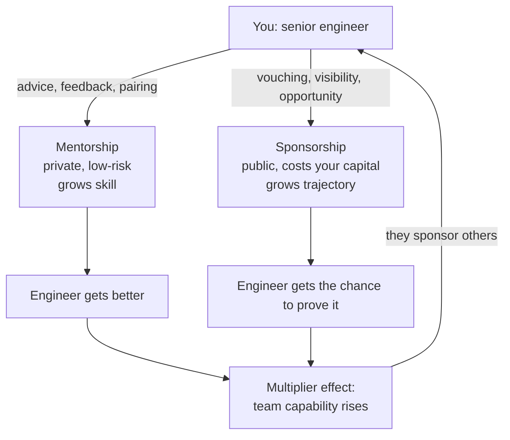

# Mentoring and influence

## Why this matters

It's a Tuesday afternoon and you're three weeks from a launch. A junior engineer on your team, Priya, has a pull request open that touches the payment retry logic. It's her second month. The diff is 400 lines, the tests pass, and it's almost right — but the retry backoff doubles on every attempt with no cap, which means a downstream outage will turn into a thundering herd that takes down the queue. You have two options. You can pull the branch, fix it yourself, push, and ship on time. Or you can spend forty-five minutes pairing with her on why unbounded exponential backoff is a footgun, watch her fix it, and ship on time anyway.

The first option is faster today. The second option is the only one that scales. If you fix it yourself, you've shipped one correct retry policy and taught nobody anything; next quarter you'll be fixing the same class of bug in someone else's PR. If you pair, you've shipped one correct retry policy *and* created an engineer who will catch unbounded backoff in code review for the rest of her career — and who will teach the next person. That's the multiplier. A senior engineer who only writes code produces a senior engineer's worth of output. A senior engineer who grows the people around them produces a team's worth, and that gap compounds.

The engineers who get stuck at the senior level are usually the ones who confuse "being indispensable" with "being valuable." They hoard context, they're the only one who can touch the legacy billing service, and they mistake the resulting dependency for job security. The engineers who get promoted past senior are the ones whose teams get measurably better at things the senior used to be the only one good at. This chapter is about how you actually do that — not the platitudes about "lifting others up," but the specific, repeatable tactics that turn one good engineer into a team of them.

## Mental model

The core distinction most people get wrong is **mentorship versus sponsorship**, and conflating them is the reason a lot of well-meaning senior engineers help people without ever changing their trajectory.

Mentorship is what you give: advice, feedback, context, a safe place to ask dumb questions. It happens in private, in 1:1s and pairing sessions, and it's about the mentee's growth. Sponsorship is what you spend: your own credibility and political capital, used in rooms the person isn't in, to put their name forward for the stretch project, the conference talk, the promotion. Mentorship costs your time. Sponsorship costs your reputation — you're vouching, and if they fail, it reflects on you. That risk is exactly why sponsorship is the thing that actually moves careers and why it's rarer than mentorship.



The second model to hold is **leading without authority**. As a senior IC you have no one reporting to you. You cannot tell anyone what to do. Your only levers are credibility, reciprocity, and clarity — people follow you because your past calls were right, because you've helped them before, and because you make the path obvious. Influence is not a personality trait you either have or lack. It's a balance you accumulate through visible good judgment and spend deliberately. Every strong technical opinion you state and then turn out to be right about is a deposit. Every time you're confidently wrong in a design review is a withdrawal.

A useful way to keep the two models straight: mentorship and sponsorship are *how* you grow a person, and leading without authority is *how* that growth turns into team-level direction. You mentor someone into competence, you sponsor them into the rooms where competence gets noticed, and the credibility you build doing both is the currency you later spend to steer technical decisions you have no formal power over. They are one system, not three separate activities.

## In practice

### Pairing that teaches instead of performing

The default failure mode of pairing is the senior driving the keyboard at full speed while the junior watches a magic show. They learn nothing because they never struggle, and struggle is where learning happens. Invert it. **The less experienced person drives; the more experienced person navigates.** Your job is to ask questions, not type answers.

The progression that works, sometimes called "I do, we do, you do":

```text
1. I do    — You drive, narrating every decision out loud.
              ("I'm checking the existing retry helper before writing a new one
               because we probably already solved this.")
2. We do   — They drive, you take the navigator role with leading questions, not answers.
              ("What happens to the queue if all 10k clients retry at once?")
3. You do  — They drive solo; you're available but silent unless asked.
```

In the navigator role, prefer questions that expose the gap over statements that fill it. Compare:

```text
# Performing (teaches nothing):
"No, you need a jitter and a max cap here, let me just type it."

# Teaching (creates a permanent skill):
"Walk me through what this backoff does on the 8th retry.
 ...Right, 256 seconds. Now imagine 10k clients all hit that at once.
 What do we want instead?"
```

The second version takes a minute or two longer and the lesson sticks for years. The reason it works is that the mentee builds the causal chain themselves — backoff doubles, eighth retry is hundreds of seconds, correlated clients create a spike — instead of memorizing a rule ("always add a cap") whose justification they never internalized. A rule without its justification is forgotten the moment the situation looks slightly different. A chain of reasoning the person built once is reusable forever.

### Code review as the highest-leverage mentoring surface

You will review far more code than you'll ever pair on, which makes review your primary teaching channel (Chapter 2 of this Part covers review mechanics in depth). The mentoring move in review is to make your reasoning visible and to separate the binding from the optional. A review comment that just says "use a map here" transfers a fix. A comment that says *why* transfers judgment:

```diff
- for (const u of users) {
-   if (lookup.find(l => l.id === u.id)) { ... }
- }
+ // nit (optional): lookup.find inside the loop is O(n*m). For the
+ // batch sizes we see in prod (10k+ users) this is the kind of thing
+ // that's invisible in tests and a P1 at scale. A Map keyed by id
+ // makes it O(n). Not blocking the PR, but worth internalizing the pattern.
```

Tag the *weight* of every comment so the author knows what's blocking versus what's a teaching aside. A simple convention: `blocking:`, `nit:`, `question:`, `praise:`. The convention does two jobs at once. It tells the author exactly what they must change before merge, which removes the anxious guessing that makes review feel adversarial. And it lets you teach generously — you can leave five observations on a PR without the author fearing that all five gate the merge. Use `praise:` deliberately: calling out a genuinely good test or a clean abstraction is sponsorship in miniature, especially when others can see it on a public PR thread.

### Sponsorship in concrete moves

Sponsorship sounds abstract until you list the actual actions. They're small and specific:

- **In planning:** "Priya should own the payments migration — she's been deep in that code and it'll stretch her into cross-service work." (Said in the room, when she's not there.)
- **Redirecting credit:** When your manager praises a fix you guided, "That was mostly Priya's debugging — she found the root cause." Public, specific, true.
- **Creating visibility:** Ask the junior to write up the incident retro and present it, then you sit in the audience instead of presenting it yourself.
- **The stretch handoff:** Give away the interesting project you'd normally keep, then make yourself available as backup.

The asymmetry to internalize: senior engineers are constantly offered more opportunities than they can take. Sponsorship is largely the act of *forwarding the overflow to people who'd be stretched by it*, and then backing them when they take it. The cost is real and worth naming honestly — when you put someone's name forward, you've attached your judgment to their performance. If they stumble, the person who trusted your recommendation remembers that it was your call. That exposure is precisely what makes a sponsorship worth something to the person receiving it; a recommendation that costs the giver nothing signals nothing.

### The multiplier as something you can point at

"Multiplier effect" is promotion-packet language, which makes it sound fuzzy. Make it concrete by tracking what changed in the team because of you, not in the code because of you:

```text
Wrong artifact for a senior+ case:
  "Shipped the new rate limiter, the payments migration, and the cache layer."
  (This is one person's output. It doesn't justify a higher level.)

Right artifact:
  "Onboarding for the payments domain got meaningfully faster after I wrote the
   runbook and paired with the last two hires through their first on-call shift.
   Priya and Marcus now review payments PRs independently;
   I'm no longer a bottleneck on that service."
```

The second framing is harder to produce because it requires you to have *removed yourself* as a dependency. That's the whole point. It is also harder to fake: anyone can list shipped features, but "someone else now does the thing I used to be the only one who could do" is a claim a promotion committee can verify by asking that someone. When you write your own review or your manager writes yours, push every accomplishment through one filter — did this make the team more capable, or did it just add to my personal output column? The second kind of work is necessary, but it is not what gets argued in a senior-plus case.

> **Connect the dots:** Influence runs on the same artifacts as the rest of senior work. The RFC you write (Chapter 3) is how you lead a technical direction without authority — a well-argued design doc convinces by reasoning, not rank. The estimates you defend (Chapter 4) and the tech-debt budget you advocate for (Chapter 5) are influence expressed in writing. Mentoring isn't a separate skill bolted onto engineering; it's the same craft pointed at people instead of systems.

## Pitfalls and anti-patterns

**1. The Hero / Indispensable Engineer.** You recognize it when you're the only person who can deploy the billing service, you're paged for every incident in your domain, and you secretly like it. The failure is that the team's bus factor is one and your own growth is capped — you can't take the next project because you can't put down the current one. The fix is deliberate, scheduled de-skilling of yourself: write the runbook, pair someone through the scary deploy until they've done it solo several times, and then *actually stop doing it*. Resist the urge to swoop in. Your discomfort watching someone do it slower than you is the cost of scaling.

**2. Mentoring without sponsoring.** You give great advice in 1:1s, your mentee is genuinely better, and they're still not getting promoted or stretched. The gap is that growth without visibility is invisible to the people who hand out opportunities. Recognize it when you can describe how someone has improved but can't name a single room you've advocated for them in. Fix it by spending capital, not just time: put their name forward, redirect credit publicly, hand off a high-visibility task.

**3. Solving instead of teaching (rescue mode).** Under deadline pressure you grab the keyboard, fix the bug, and move on. It feels efficient and it's the single most common way good engineers fail to multiply. Recognize it by counting: if you're fixing the same *class* of mistake across different people's PRs, you're rescuing, not teaching. The fix is to optimize for the second occurrence, not the first — spend the extra forty minutes the first time so there's no third time.

**4. The condescending mentor.** Feedback framed as "obviously you should..." or pairing where you sigh and take over teaches people to hide confusion from you, which is the opposite of what you want. You'll notice your mentees stop asking questions and start guessing. The fix is to make struggle safe: narrate your *own* mistakes ("I got bitten by exactly this last year"), ask genuine questions, and treat "I don't know" as the correct, expected answer for someone two months in.

**5. Influence by volume.** Trying to lead by being the loudest in every channel, commenting on every PR, and having a strong opinion on every decision. It reads as territorial and it dilutes your credibility, because if everything is a hill, none of them are. Recognize it when people start routing around you. The fix is to pick your battles: stay quiet on the reversible, low-stakes decisions and spend your accumulated capital on the few that are expensive to undo (Part 1's reversible-vs-irreversible framing applies directly here).

## Production checklist

- [ ] Each direct mentee or close collaborator has at least one explicit growth goal you both can name
- [ ] You can name a specific room/meeting in the last quarter where you advocated for someone who wasn't present (sponsorship, not just mentorship)
- [ ] At least one task you used to be the sole owner of is now owned independently by someone you taught
- [ ] Your review comments tag weight (`blocking` / `nit` / `question` / `praise`) so authors know what's binding
- [ ] You pair with the driver-navigator roles set so the *less* experienced person is on the keyboard
- [ ] A runbook exists for every "only I can do this" operation in your domain, and someone else has executed it from the doc
- [ ] You redirect credit publicly and specifically when work you guided gets praised
- [ ] Your last self-assessment described team capability that changed because of you, not just features you shipped
- [ ] You've said "I don't know" or "I was wrong about that" in front of a junior recently — modeling that it's safe
- [ ] You're spending influence on the few irreversible decisions and staying quiet on the reversible ones

## Exercises

1. **(Comprehension)** In your own words, explain the difference between mentorship and sponsorship, and why sponsorship costs the sponsor more. Then audit your last quarter: list every instance of each you can recall. If your mentorship list is long and your sponsorship list is empty, write down why — and name one sponsorship action you could take next week.

2. **(Applied)** Pick a real, slightly-imperfect pull request from someone more junior than you. Write three review comments using the I-do/we-do/you-do mindset: one that asks a leading question instead of giving the answer, one tagged `praise:` for something genuinely good, and one `blocking:` comment that explains the *why* (the consequence at scale or in production), not just the *what*. Compare how long it takes versus just stating the fixes, and reflect on which version the author will remember in six months.

3. **(Open-ended design)** You're a senior engineer and the only person who can safely operate a critical legacy service. Design a six-month plan to make yourself non-essential to it without dropping reliability. Address: which knowledge to document versus which to transfer by pairing, how you'll measure that the transfer worked (not "I wrote a doc" but "someone resolved an incident without me"), how to handle the inevitable temptation to swoop in during a real outage, and what you'll do with the capacity you free up. Identify the riskiest assumption in your plan.

## Further reading

- Lara Hogan, [*Resilient Management*](https://resilientmanagement.com/) — the clearest practical treatment of sponsorship, growing people, and the manager/mentor distinction; the sponsorship sections apply directly to senior ICs.
- The Engineering Ladders and career-framework references in Chapter 7 of this Part — the formal definitions of "impact through others" that promotion committees actually use.
- Tanya Reilly, ["Being Glue"](https://noidea.dog/glue) — a talk and essay on the invisible, team-multiplying work that doesn't show up in a diff, and how to make it count.
- Will Larson, [*Staff Engineer: Leadership Beyond the Management Track*](https://staffeng.com/) — on operating with influence and no authority at the senior+ IC levels; the archetypes chapter is essential.
- Camille Fournier, *The Manager's Path* — the early chapters on mentoring, teaching, and being a tech lead are written for engineers stepping into influence before any title change.
- [*Lean In*](https://leanin.org/) and the surrounding sponsorship-vs-mentorship literature popularized the distinction for a wide audience; the framing itself predates it in workplace research, so treat Lean In as an accessible entry point rather than the origin.
