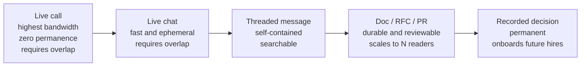

# Async work, remote-first habits, and career ladders

## Why this matters

It's a Tuesday afternoon in your time zone and a Wednesday morning in your teammate's. You picked up a ticket that depends on a change she shipped last week, you hit an edge case her code doesn't handle, and you have a question. So you send a one-line Slack message: "hey, quick question about the billing webhook — got a sec?" She's asleep. You stop, because you're blocked and the question lives only in your head. Twelve hours later she wakes up, sees the ping, replies "sure, what's up?", and now *she's* blocked waiting on the actual question. By the time you're both awake again it's Thursday. A two-minute answer cost two days because it was never written down in a form anyone could act on.

Now replay it the writing-first way. Tuesday afternoon you open the thread and write the whole thing: what you're trying to do, the input that breaks it, the two interpretations you see, the one you're leaning toward and why, and the line "I'm going to proceed with option B at end of my day unless you flag it — no need to reply if B is fine." She wakes up, reads it in ninety seconds, thumbs-up. You were never blocked. Nobody scheduled a call. The decision and its reasoning are now searchable forever.

That's the whole game of remote-first work, and it's also, not coincidentally, the whole game of getting promoted. The skills that make async collaboration work — writing clearly, making decisions legible, creating artifacts other people can build on — are the same skills every career ladder is quietly measuring when it talks about "scope" and "impact." The engineer who internalizes this compounds. The one who keeps "hopping on a quick call" stays a strong individual contributor with a small blast radius, and wonders why the promotion never lands. This chapter is about both halves and the fact that they're the same half.

## Mental model

Remote work fails or succeeds on one axis: how much of your communication is *self-contained*. A self-contained message carries enough context that the reader can act without a synchronous round-trip. The opposite — "got a sec?", "thoughts?", "can we hop on a call?" — is a request for a round-trip, and every round-trip costs one full timezone-overlap cycle, which on a distributed team can be a full day.

Think of every interaction as sitting somewhere on a synchronicity spectrum, trading latency against bandwidth and permanence:



The remote-first instinct is to push communication *rightward* on this diagram until something genuinely needs the bandwidth of a live conversation — and then, after that conversation, to push the *outcome* back rightward by writing it down. A call that ends without a written summary didn't happen, as far as the rest of the org is concerned.

The career-ladder model rhymes with this. A ladder is the org's attempt to make the function `compensation = f(value you create)` legible. Most ladders measure roughly three things that grow with level: **scope** (how much surface area you're trusted with — a function, a service, a system, a domain), **autonomy** (how ambiguous a problem you can be handed before you need direction), and **multiplier** (how much you raise the output of people around you). Junior levels are scored on *your* output. Senior levels are scored on *everyone else's* output going up because you exist. The artifacts you produce asynchronously — docs, reviews, RFCs — are the primary evidence the ladder reads. Async skill and ladder progression are the same curve viewed from two angles.

## In practice

### Make every message self-contained

The single highest-leverage habit. Before you hit send on a blocking question, run it through a structure. Here's the difference, concretely.

The round-trip version, which costs a full cycle:

```text
14:02  me: hey, quick q about the webhook handler when you're free?
```

The self-contained version, which costs zero:

```text
14:02  me: @priya — billing webhook question, no rush, async is fine.

  Context: I'm adding retry logic to handleStripeWebhook (PR #4412).
  Problem: when Stripe sends `invoice.payment_failed`, we already
    log it but never enqueue a retry. The ticket (BILL-321) implies
    we should, but the original spec doc doesn't mention failures.
  Two options:
    A) enqueue a retry on every payment_failed (matches ticket)
    B) only retry if attempt_count < 3 (matches Stripe's own model)
  I'm leaning B because unbounded retries hammer their API and ours.
  Plan: I'll implement B and open the PR by EOD my time (~5h from now).
  Reply only if B is wrong — silence = I proceed.
```

The second message has four properties worth naming: it states the **context** (what, where, link), the **decision to be made**, the **options with a recommendation**, and a **default action with a deadline**. That last property — "silence = I proceed" — is the most underused tool in distributed work. It converts a blocking question into a non-blocking notification. You only need a reply in the failure case.

> **Connect the dots:** The "options with a recommendation and a default" structure is the same shape as a good RFC (Part 14, Chapter 3) and a good incident update (Part 12). Once you can write a decision down so a reader can act on it cold, you can write any of these. It's one skill wearing different hats.

### Work across time zones on purpose

Overlap is a budget. If you and a teammate share three hours a day, spend those three hours on the things that genuinely need bandwidth — pairing on a gnarly bug, a design disagreement that's been ping-ponging in text, a 1:1 — and push everything else out of that window. Anti-pattern: burning your only overlap on a status meeting that could have been three sentences in a channel.

A practical setup:

```bash
# See a teammate's local time at a glance before you ping them.
$ TZ="Europe/Lisbon" date
Wed Jun 18 09:14:22 WEST 2026

# Schedule a message to land at the start of their day, not the end of yours,
# so it's the first thing they see (most chat tools support this natively).
```

Document your own working hours and overlap windows somewhere the team can see — a team README, a Slack status, a shared "who's online when" doc. The goal is that nobody has to guess whether a 6pm ping will be seen tonight or tomorrow.

Working out loud is the day-to-day version of pushing outcomes rightward. Instead of doing your investigation privately and posting only the conclusion, narrate the work in a public thread as you go: "looking at the slow query now," "it's the missing index on `orders.customer_id`, confirming with `EXPLAIN`," "fix is up in PR #4501." A teammate twelve hours ahead can read the whole arc when they wake up, catch a wrong turn before it ships, or pick the thread up if you log off. The cost is a few seconds per update; the payoff is that your reasoning becomes a shared asset instead of dying in your head.

One more timezone discipline: attach an explicit decision deadline to anything that needs input. "Deciding the cache TTL by 16:00 UTC Thursday; current plan is 5 minutes, speak up before then" gives every timezone a fair window to weigh in and converts an open-ended thread into one that closes itself. Without a deadline, async threads drift for days because nobody knows when the window shuts.

Two team-level norms make timezone work humane:

- **No-meeting overlap protection.** Protect at least part of the shared window from recurring meetings so it stays available for real-time problem-solving when needed.
- **Handoff notes.** On teams that follow-the-sun, end your day by writing what you did, what's in flight, and what the next person should pick up. The handoff note is a gift to a colleague who is currently asleep.

### Read the ladder honestly

Most companies publish a leveling rubric (or adapt a public one — collections like [progression.fyi](https://www.progression.fyi/) aggregate many real frameworks). Get yours. Then read it adversarially, the way a lawyer reads a contract, not the way a fan reads praise.

The trap is reading the level *above* you and pattern-matching the adjectives ("drives cross-team impact," "operates with autonomy") onto things you already do. Everyone feels like they already operate with autonomy. The honest read asks: *what evidence would a skeptical promotion committee accept that I do this consistently, at the expected scope, and would the people I work with independently say so?*

Here's what one rung looks like rendered concretely, instead of as adjectives. Take a generic "Senior Engineer (L5)" definition and translate it into observable behavior:

```markdown
## Senior Engineer (L5) — what it actually looks like

Scope: owns a service or a significant subsystem end to end.
  Evidence: you are the person paged for it; you decide its roadmap;
  new work on it routes through your review.

Autonomy: handed a vague problem ("checkout is slow"), you can go from
  ambiguity to a scoped plan without a senior breaking it down for you.
  Evidence: you wrote the RFC; you identified the constraints nobody
  stated; you said no to two approaches and explained why.

Impact beyond yourself: your work makes other engineers faster.
  Evidence: the test harness you built is used by other teams; your
  review comments are why two juniors stopped making the same mistake;
  the doc you wrote is in the onboarding flow.

Failure modes that hold people at L4 despite strong coding:
  - ships great code but only when handed a fully-specified ticket
  - solves the problem, never writes down how, so nobody else can
  - high personal output, zero multiplier
```

Notice that every "Evidence" line is an *artifact or a behavior other people can observe* — exactly the things async work produces. This is not a coincidence. Promotion committees can't see your thoughts; they can see your docs, your reviews, your RFCs, and what your peers say in calibration. Working out loud, in writing, is how you make your impact legible to people who weren't in the room.

A note on the two tracks. Most ladders fork at the senior level into a management track and an individual-contributor track that stay roughly equivalent in level and pay. The IC track (staff, principal, distinguished) is not "the consolation prize for people who don't want to manage" — at serious engineering orgs it is a real career with real scope, and the dimensions that grow are technical leadership, judgment under ambiguity, and influence across teams, not headcount. If you want to stay technical, read the IC side of your ladder specifically; do not assume growth requires becoming a manager.

### Drive your own promotion

Nobody is tracking your case as carefully as you should. Run it like a small project.

1. **Get the rubric and pick the target level.** Read it adversarially as above.
2. **Do a gap analysis.** For each dimension of the next level, list concrete evidence you already have and where you're thin. Be honest about the thin parts — that's the whole point.
3. **Keep a brag document.** A running file where you log shipped work, its impact, and links to the artifacts, updated weekly while it's fresh. (Julia Evans' "Get your work recognized: write a brag document" is the canonical treatment.) At review time you assemble, not excavate.
4. **Negotiate the gaps with your manager, in writing.** "Here's the L5 rubric, here's where I think I'm solid, here are the two areas I'm thin — can you point me at projects that build that evidence?" Now your manager is a collaborator on a documented plan, not a judge of a surprise request.
5. **Seek scope, not titles.** The title is a lagging indicator. Go acquire the *scope* the next level describes — own the migration, write the RFC nobody else will, mentor the new hire — and the title follows the demonstrated behavior. Trying to get the title first, then grow into it, almost never works.

The through-line: every step produces a written artifact, and every artifact does double duty as async-collaboration value *and* promotion evidence.

## Pitfalls and anti-patterns

**The "quick call" reflex.** You hit any friction and your instinct is "let's hop on a call." Calls feel productive because they're high-bandwidth, but they're invisible to everyone not on them and they evaporate the moment they end. *How to recognize:* your calendar is full and your team's written record is thin; new hires can't find why decisions were made. *How to fix:* default to writing. Reserve synchronous time for the cases where the text round-trips are genuinely diverging, and always end a call with a written summary posted where the team can see it. A call with no artifact is a decision the org will have to make again.

**Availability theater.** You stay green on Slack, reply to every ping in two minutes, and feel like a great teammate. You're actually training yourself and everyone else to expect synchronous responses, which destroys deep work and quietly punishes teammates in other time zones who can't compete on response speed. *How to recognize:* you're constantly responsive and never make progress on hard things; your best uninterrupted hours go to chat. *How to fix:* batch communication into a few windows a day, set status honestly ("heads down until 2pm, async only"), and normalize slow replies to non-urgent threads. Speed of response is not a measure of contribution.

**Invisible work.** You do excellent, important work — the load-bearing refactor, the silent on-call saves, the mentoring in DMs — and none of it is written down anywhere a promotion committee or your peers can see. *How to recognize:* at review time you struggle to remember what you did, and your manager is surprised by half of it. *How to fix:* the brag document, updated weekly, plus a bias toward doing your thinking in shared docs and PRs rather than your head and DMs. Work that isn't legible doesn't count, however good it is.

**Reading the ladder as a fan, not a lawyer.** You map the next level's flattering adjectives onto your existing self-image and conclude you're already operating there, then feel cheated when the promotion doesn't come. *How to recognize:* you can't name the specific artifacts that prove each line of the rubric; your evidence is "I feel like I do this." *How to fix:* for every rubric line, write the concrete evidence a skeptic would accept, and ask a peer or manager whether they'd independently corroborate it. If you can't produce the evidence, you have your gap analysis.

**Mistaking activity for scope.** You're busy, you close many tickets, you're in every standup — but every ticket is handed to you fully specified and small. High activity, narrow scope. *How to recognize:* you never write the plan, only execute someone else's; your impact ends at your own keyboard. *How to fix:* deliberately pick up ambiguous, larger problems and own them from problem statement to shipped outcome, including the writing. Scope is about the size and ambiguity of what you own, not the count of what you complete.

## Production checklist

- [ ] Every blocking question I send states context, the decision, options with a recommendation, and a default action with a deadline ("silence = I proceed")
- [ ] My working hours and timezone are documented somewhere my team can see without asking
- [ ] Decisions made in calls get a written summary posted to a shared, searchable place within the hour
- [ ] Shared overlap windows are protected for real-time problem-solving, not consumed by status meetings
- [ ] I keep a brag document and update it weekly, with links to artifacts and their impact
- [ ] I have my team's leveling rubric, have read the level above me adversarially, and have a written gap analysis
- [ ] My manager and I have a written, agreed plan for the evidence I'm building toward the next level
- [ ] My most important work lives in durable artifacts (docs, RFCs, PRs), not in my head or DMs
- [ ] I default to async and reserve synchronous time for genuinely high-bandwidth needs
- [ ] On follow-the-sun teams, I write a handoff note at the end of my day

## Exercises

1. **(Comprehension)** Take the last three blocking questions you asked a teammate over chat. For each, classify it as round-trip or self-contained. For any that were round-trips, rewrite them in the self-contained structure (context, decision, options + recommendation, default action with deadline). Note for each rewrite how many timezone cycles the original would have cost versus the rewrite.

2. **(Applied)** Get your organization's leveling rubric (or pick a public one from a collection like progression.fyi if you don't have one). For the level directly above yours, take every line of the description and write next to it the specific, observable evidence a skeptical promotion committee would accept that you meet it — an artifact, a named project, a behavior a peer would corroborate. Mark each line green (solid evidence), yellow (partial), or red (none). The red and yellow lines are your six-month plan.

3. **(Design)** You're tech-leading a new team split across three time zones with only two hours of daily overlap, and one engineer has zero overlap with another. Design the team's communication norms: what goes async vs. synchronous, how decisions get recorded, how handoffs work, what the overlap window is reserved for, and how you'll make each person's work legible for performance reviews. State the tradeoffs of your choices — what does your design make harder, and for whom?

## Further reading

- Julia Evans, ["Get your work recognized: write a brag document"](https://jvns.ca/blog/brag-documents/) — the canonical, practical guide to making your work legible.
- GitLab, ["The GitLab Handbook"](https://handbook.gitlab.com/) — the most thorough public documentation of how an all-remote, async-first company actually operates; read the Communication and async sections.
- Dropbox, ["Engineering Career Framework"](https://dropbox.github.io/dbx-career-framework/) — a real, published engineering ladder you can read end to end and compare against your own.
- Will Larson, *An Elegant Puzzle* and *Staff Engineer* (also at [lethain.com](https://lethain.com/)) — the clearest writing on scope, levels, and what changes at senior and staff.
- Camille Fournier, *The Manager's Path* — the chapters on the IC track and what each level is actually measured on, useful even if you never want to manage.
- [progression.fyi](https://www.progression.fyi/) — an aggregated collection of real, public career frameworks from many companies, useful for calibrating your own.

> **Security note:** Brag documents and handoff notes routinely accumulate links to internal incidents, customer names, and unreleased plans. Keep them in your company's sanctioned, access-controlled tooling — not a personal cloud drive or a notes app that syncs to a personal account — and scrub specifics before reusing any of it in an external promotion packet, conference talk, or job interview.
