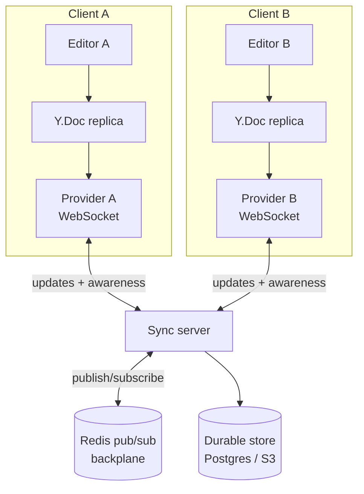
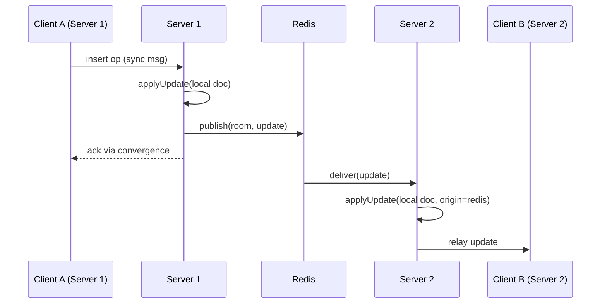

# Capstone: a real-time collaborative editor

## Why this matters

It's a Tuesday afternoon. Two writers are editing the same paragraph in your team's new doc tool. Alice fixes a typo at the start of the line; Bob, at the exact same moment, deletes a word in the middle. The server receives Alice's edit first, applies it, then applies Bob's edit using the character offset Bob's client computed against the *old* text. Bob's delete lands one character to the left. A letter from a neighboring word vanishes. Nobody touched that letter. The document is now subtly, silently wrong, and neither user can explain it.

That bug — index drift under concurrent edits — is the entire reason collaborative editing is hard. A naive "send the offset, apply on the server" design works perfectly in the demo, with one user, and falls apart the instant two cursors share a line. The fix is not "lock the document" (that destroys the collaboration) and it is not "last write wins" (that destroys data). The fix is a data structure and a protocol designed so that concurrent edits *commute*: applying them in any order on any replica converges to the same result.

This capstone proves you can build that. By the end you'll have a working editor where N clients edit the same document over WebSockets, every replica converges to byte-identical state regardless of network ordering, users see each other's cursors and selections live, and the whole thing scales past a single server process without a sticky-session hack. The skills it exercises — conflict-free replicated data types, stateful connection management, pub/sub fan-out, presence — are the same ones behind Google Docs, Figma, Notion, and Linear. If you can ship this, you can reason about any always-connected, multi-writer system.

## Mental model

There are two classical approaches to concurrent text editing, and you should understand both before picking one.

**Operational Transformation (OT)** sends *operations* (`insert "x" at index 5`, `delete 3 chars at index 10`) and transforms each incoming operation against operations it didn't yet know about, adjusting indices so the intent survives reordering. OT is what Google Docs uses. It is correct, compact on the wire, and notoriously hard to implement: the transformation functions must satisfy convergence properties (TP1/TP2) that have tripped up published algorithms for years.

**Conflict-free Replicated Data Types (CRDTs)** sidestep transformation entirely. Instead of integer indices, every character gets a stable, globally unique identifier that never changes once assigned. An insert says "place this character *between* IDs A and B," not "at offset 5." Because IDs don't drift, operations commute by construction — there's nothing to transform. The cost is metadata: each character carries an ID. Modern sequence CRDTs (Yjs's YATA, Automerge's RGA-family) and clever run-length encoding make that cost small in practice.



The mental shift: there is no authoritative document on the server. Each client holds a full replica; the server is a relay that fans out binary updates and persists the merged state. Updates are commutative and idempotent, so "deliver at least once, in any order" is a sufficient guarantee from the transport — which is exactly what makes scaling tractable. A character's identity is `(clientID, clock)`, a Lamport-style logical timestamp. Order between two replicas is resolved deterministically by that tuple, so every replica that has seen the same set of operations computes the same string.

The library does this with tombstones and run-length encoding. A deleted character is not physically removed; it is marked deleted so that a concurrent insert that referenced it as a neighbor still has a stable anchor. Yjs then groups consecutive characters from the same client into runs, so a paragraph typed left to right costs a handful of structs rather than one struct per character. The worst case for any sequence CRDT is *interleaving*: two users typing into the exact same position can produce characters from each user woven together rather than kept in contiguous blocks. YATA and RGA both bound this, but it is the corner that separates a toy implementation from a production one, and another reason to lean on a vetted library.

A second payoff falls out of this model for free: offline editing. Because a replica is authoritative for its own edits and merges by identity rather than by wall-clock timestamp, a client can disconnect, accumulate hours of changes, and reconnect to a single sync handshake that reconciles both directions. There is no special offline mode and no conflict dialog. Undo and redo work the same way: Yjs ships an `UndoManager` that tracks the structs a given origin created and inverts only those, so one user pressing undo never reverts a collaborator's keystrokes. Both behaviors are consequences of stable identity, not features bolted on top.

A subtle correctness point worth internalizing: convergence guarantees that every replica ends at the same string, but it does not guarantee that the result is what either human intended. CRDTs solve the data-integrity problem, not the social one. If two people overwrite each other's sentence, the bytes converge cleanly and the prose is still garbage. That is the right division of labor: the data structure keeps replicas identical, and product features — suggestions, comments, locking a section — handle human intent.

My recommendation, stated plainly: **use a CRDT, and use an existing library (Yjs or Automerge) rather than writing your own.** OT is a fine choice if you're Google and can afford to maintain it; for everyone else the implementation risk is not worth it. The rest of this chapter builds on Yjs because its update format is compact and its ecosystem (editor bindings, providers) is the most mature.

## In practice

We'll build the system in four layers: the shared document type, the WebSocket sync server, presence/awareness, and the pub/sub backplane that lets us run more than one server.

### 1. The shared document

Yjs gives you shared types (`Y.Text`, `Y.Array`, `Y.Map`) that behave like ordinary data structures but emit binary update messages on every change. Two replicas exchange updates and converge.

```typescript
import * as Y from 'yjs'

// Two independent replicas, as if on two machines.
const docA = new Y.Doc()
const docB = new Y.Doc()

docA.getText('body').insert(0, 'Hello world')
docB.getText('body').insert(0, 'Goodbye')

// Exchange state. encodeStateAsUpdate produces a binary diff
// relative to the other replica's state vector.
const updateA = Y.encodeStateAsUpdate(docA, Y.encodeStateVector(docB))
const updateB = Y.encodeStateAsUpdate(docB, Y.encodeStateVector(docA))

Y.applyUpdate(docB, updateA)
Y.applyUpdate(docA, updateB)

console.log(docA.getText('body').toString() === docB.getText('body').toString())
// true — both replicas converged to the SAME string, deterministically.
```

The `encodeStateVector` / `encodeStateAsUpdate` pair is the heart of efficient sync: a client tells the peer "here's everything I've seen" (a vector of `clientID → clock`), and the peer replies with only the operations the client is missing. This is a delta, not the whole document.

On the wire we don't roll our own framing. The `y-protocols` package defines a tiny sync protocol (sync step 1 = "here's my state vector," sync step 2 = "here are the updates you're missing," update = "here's a new change"). The browser uses `y-websocket` as the client provider:

```typescript
import * as Y from 'yjs'
import { WebsocketProvider } from 'y-websocket'

const doc = new Y.Doc()
const provider = new WebsocketProvider(
  'wss://collab.example.com',
  `doc:${documentId}`,   // room name — namespaces the document
  doc,
  { params: { token: authToken } } // sent as query string; validate server-side
)

const ytext = doc.getText('body')
ytext.observe(() => render(ytext.toString()))
```

### 2. The sync server

The server's job is small and dumb on purpose: accept a WebSocket, join it to a room, relay every message it receives to the other members of that room, and persist the merged state. Here's the load-bearing logic, deliberately framework-light.

```typescript
import { WebSocketServer, WebSocket } from 'ws'
import * as Y from 'yjs'
import * as syncProtocol from 'y-protocols/sync'
import * as awarenessProtocol from 'y-protocols/awareness'
import * as encoding from 'lib0/encoding'
import * as decoding from 'lib0/decoding'

const MESSAGE_SYNC = 0
const MESSAGE_AWARENESS = 1

interface Room {
  doc: Y.Doc
  awareness: awarenessProtocol.Awareness
  conns: Set<WebSocket>
}
const rooms = new Map<string, Room>()

function getRoom(name: string): Room {
  let room = rooms.get(name)
  if (!room) {
    const doc = new Y.Doc()
    loadFromStore(name, doc) // hydrate from Postgres/S3 on first open
    const awareness = new awarenessProtocol.Awareness(doc)
    room = { doc, awareness, conns: new Set() }
    // Persist on every change, debounced.
    doc.on('update', (update: Uint8Array, origin) => {
      broadcast(room!, encodeSync(update), origin)
      schedulePersist(name, doc)
    })
    rooms.set(name, room)
  }
  return room
}

const wss = new WebSocketServer({ noServer: true })

wss.on('connection', (ws: WebSocket, roomName: string) => {
  const room = getRoom(roomName)
  room.conns.add(ws)

  // Sync step 1: tell the new client our state vector.
  const enc = encoding.createEncoder()
  encoding.writeVarUint(enc, MESSAGE_SYNC)
  syncProtocol.writeSyncStep1(enc, room.doc)
  ws.send(encoding.toUint8Array(enc))

  ws.on('message', (data: ArrayBuffer) => {
    const dec = decoding.createDecoder(new Uint8Array(data))
    const out = encoding.createEncoder()
    const type = decoding.readVarUint(dec)

    if (type === MESSAGE_SYNC) {
      encoding.writeVarUint(out, MESSAGE_SYNC)
      // readSyncMessage applies incoming updates to room.doc AND
      // writes any reply (e.g. the updates the client is missing).
      syncProtocol.readSyncMessage(dec, out, room.doc, ws)
      if (encoding.length(out) > 1) ws.send(encoding.toUint8Array(out))
    } else if (type === MESSAGE_AWARENESS) {
      awarenessProtocol.applyAwarenessUpdate(
        room.awareness, decoding.readVarUint8Array(dec), ws
      )
    }
  })

  ws.on('close', () => {
    room.conns.delete(ws)
    awarenessProtocol.removeAwarenessStates(
      room.awareness, [/* this conn's clientID */], ws
    )
    if (room.conns.size === 0) scheduleRoomEviction(roomName)
  })
})

function broadcast(room: Room, msg: Uint8Array, origin: unknown) {
  for (const conn of room.conns) {
    if (conn !== origin && conn.readyState === WebSocket.OPEN) conn.send(msg)
  }
}
```

The critical property: the server applies updates to its own `Y.Doc` *and* relays them. It never parses or rewrites the user's text. It moves opaque binary deltas around and lets the CRDT guarantee convergence. Because `Y.applyUpdate` is idempotent and commutative, a message delivered twice or out of order is harmless.

### 3. Presence and awareness

Cursors, selections, and "who's online" are *not* part of the document — you don't want a cursor blink in the undo history or persisted to disk. Yjs models this separately as **awareness**: ephemeral, per-client state with last-write-wins semantics and automatic timeout when a client disconnects.

```typescript
// Client side: publish my cursor and identity.
provider.awareness.setLocalStateField('user', {
  name: currentUser.name,
  color: currentUser.color,
})
editor.on('selectionChange', (range) => {
  provider.awareness.setLocalStateField('cursor', {
    anchor: range.anchor, head: range.head,
  })
})

// Render everyone else's cursors.
provider.awareness.on('change', () => {
  const states = provider.awareness.getStates() // Map<clientID, state>
  renderRemoteCursors(
    [...states.entries()].filter(([id]) => id !== provider.awareness.clientID)
  )
})
```

Awareness updates flow through the same WebSocket on a separate message channel (`MESSAGE_AWARENESS`). They're high-frequency and disposable: if one drops, the next one corrects it within milliseconds, so you can throttle cursor broadcasts to a few dozen per second without anyone noticing.

### 4. Scaling past one server: the pub/sub backplane

Here's where most tutorials stop and most production systems begin. Your single Node process holds rooms in memory. Add a second process behind a load balancer and you've split the brain: clients on server 1 never see edits from clients on server 2, because they're in different processes' `rooms` maps.

The wrong fix is **sticky sessions** — pinning every client of a document to one server by hashing the room. It "works" until that server restarts (everyone drops, the room's in-memory doc is gone) or until one hot document overloads a single box while others idle. You've made the system stateful and unscalable in the same move.

The right fix is a **pub/sub backplane**. Every server subscribes to a channel per room. When a server applies an update locally, it also publishes the binary update to the channel; every *other* server holding that room receives it and applies it to its own replica, then fans out to its local connections. Redis pub/sub is the common choice; NATS or a Kafka topic work too.

```typescript
import { createClient } from 'redis'

const pub = createClient({ url: process.env.REDIS_URL })
const sub = pub.duplicate()
await Promise.all([pub.connect(), sub.connect()])

// When THIS server's doc changes, publish to the room channel.
// `origin` distinguishes local edits from edits we received via Redis,
// so we don't echo them back into an infinite loop.
function publishUpdate(roomName: string, update: Uint8Array, origin: unknown) {
  if (origin === REDIS_ORIGIN) return // came from Redis; don't republish
  pub.publish(channelFor(roomName), Buffer.from(update))
}

// When ANY server publishes, apply it locally (tagged with REDIS_ORIGIN
// so the doc.on('update') handler won't republish it).
async function subscribeRoom(roomName: string) {
  const room = getRoom(roomName)
  await sub.subscribe(channelFor(roomName), (message: Buffer) => {
    Y.applyUpdate(room.doc, new Uint8Array(message), REDIS_ORIGIN)
  })
}
```

This is clean precisely because CRDT updates are commutative and idempotent. Redis pub/sub is fire-and-forget with no delivery guarantee — and that's *fine*, because the periodic sync-step-1 handshake on reconnect reconciles any update a server missed. The backplane carries the fast path; the state-vector sync is the correctness backstop. Persistence (Postgres `bytea` of the encoded doc, or S3) is the durable floor: on cold start a server hydrates the room from the store, then catches up via Redis.



## Pitfalls and anti-patterns

**Sending and applying integer offsets.** This is the opening-scenario bug. If your protocol says "insert at index 5," concurrent edits drift indices and corrupt the document. Recognize it when edits are *almost* right but land one or two characters off under concurrency. Fix it by using a CRDT or OT where positions are stable identifiers, not offsets — never raw indices on the wire.

**Persisting on every keystroke.** Writing the full encoded document to Postgres on each `doc.on('update')` will melt your database under a few active editors. Recognize it by write IOPS that scale with typing speed. Fix it with debounced persistence (flush every few seconds or every N updates) plus an append-only update log for crash recovery between flushes; compact the log into a snapshot periodically.

**Unbounded awareness and room growth.** Awareness states for crashed clients that never sent a clean disconnect linger and accumulate; rooms with zero connections stay resident in memory. Recognize it by RSS that only ever climbs. Fix it with awareness timeouts (the protocol has them — wire up `removeAwarenessStates` on close and on heartbeat timeout) and an eviction timer that persists then drops a room after it's been empty for a grace period.

**The pub/sub echo loop.** If a server republishes updates it received *from* the backplane, two servers will ping-pong the same update forever, saturating Redis. Recognize it by Redis CPU pegged with no user activity. Fix it by tagging the origin of every `applyUpdate` (as shown above) and refusing to republish anything whose origin is the backplane.

**Trusting the room name from the client.** A client asks to join `doc:1234`; if you don't check that this user may read/write document 1234, anyone can join any room by guessing IDs — full read/write to other tenants' documents. Recognize it in a pen test, or never, until it's a breach. Fix it by authenticating the WebSocket upgrade (validate the token in the `upgrade` handler) and authorizing the specific document *before* calling `getRoom`.

## Production checklist

- [ ] WebSocket `upgrade` handler validates the auth token and authorizes the specific document before joining a room
- [ ] CRDT updates persisted with debounced snapshots plus an append-only update log between snapshots
- [ ] Cold-start hydration: server loads the latest snapshot + log from durable store on first room open
- [ ] Pub/sub backplane (Redis/NATS) wired with origin tagging to prevent echo loops
- [ ] Awareness states removed on disconnect and on heartbeat timeout; cursor broadcasts throttled
- [ ] Empty-room eviction timer that flushes to durable store before dropping in-memory state
- [ ] Heartbeat/ping-pong on every socket to detect half-open connections; client auto-reconnect with backoff
- [ ] Backpressure handling: drop or coalesce when a client's `bufferedAmount` exceeds a threshold
- [ ] Document size and per-room connection caps to bound blast radius of a hot document
- [ ] Metrics: active rooms, connections per room, update rate, persist latency, Redis publish lag
- [ ] Periodic snapshot compaction to keep the update log from growing unbounded

## Exercises

1. **(Comprehension)** Using the two-replica snippet from "In practice," construct three concurrent edits on three `Y.Doc` instances, exchange updates in a *different* order between each pair, and assert all three converge to the same string. Explain in two sentences why the order didn't matter, referencing the `(clientID, clock)` identity scheme.

2. **(Applied)** Add durable persistence to the sync server: store the encoded document in Postgres as `bytea`, debounced to flush at most once every two seconds. Then kill and restart the server mid-session and confirm a reconnecting client recovers the full document. Measure write throughput before and after debouncing.

3. **(Design)** You need to support documents with a couple hundred simultaneous editors and tens of thousands of active documents across a fleet of servers. Design the sharding and backplane strategy: how do you assign rooms to servers, route a reconnecting client to a server that already holds (or can cheaply load) the room, and bound memory per node? Compare a Redis-pub/sub fan-out against a partitioned approach (consistent hashing of rooms to nodes with a routing layer), and state which you'd ship first and why.

## Further reading

- Marc Shapiro et al., ["Conflict-free Replicated Data Types"](https://hal.inria.fr/inria-00609399/document) (INRIA, 2011) — the foundational paper defining CvRDTs and CmRDTs.
- Petru Nicolaescu et al., ["Near Real-Time Peer-to-Peer Shared Editing on Extensible Data Types"](https://dl.acm.org/doi/10.1145/2957276.2957310) — the YATA algorithm that underpins Yjs.
- C. Sun and C. Ellis, ["Operational Transformation in Real-Time Group Editors: Issues, Algorithms, and Achievements"](https://dl.acm.org/doi/10.1145/289444.289469) (CSCW 1998) — the canonical OT reference and its convergence pitfalls.
- [Yjs documentation](https://docs.yjs.dev/) — shared types, providers, awareness, and the binary update protocol.
- Martin Kleppmann and Alastair R. Beresford, ["A Conflict-Free Replicated JSON Datatype"](https://arxiv.org/abs/1608.03960) — rigorous treatment behind Automerge; pairs with *Designing Data-Intensive Applications* ch. 5.
- [RFC 6455 — The WebSocket Protocol](https://www.rfc-editor.org/rfc/rfc6455) — the transport these systems ride on; read the framing and close-handshake sections.

> **Connect the dots:** The commutative/idempotent update model here is the same convergence story as the event-sourced ledger in chapter 5 of this Part — both replace "mutate shared state under a lock" with "merge an append-only stream of facts." The pub/sub backplane is the same pattern you'll meet in message queues (Part 9), and the logical-clock identity scheme `(clientID, clock)` is Lamport timestamps from the distributed-systems material in Part 11.

> **Security note:** A collaborative editor is a shared mutable surface across users and, in a SaaS, across tenants. Authenticate the WebSocket *upgrade* request (not just the initial page load — tokens in query strings get logged, so prefer a short-lived signed token or a cookie validated at upgrade) and authorize the exact `documentId` before joining a room. Enforce tenant isolation at the room boundary: a user from tenant A must never be able to subscribe to tenant B's room channel, even by guessing the room name. Treat document content as untrusted on render (CRDTs happily replicate an XSS payload to every connected client) and sanitize on output. Finally, cap document size and update rate per connection — without limits, one malicious client can balloon a shared doc and degrade every other editor in the room.
