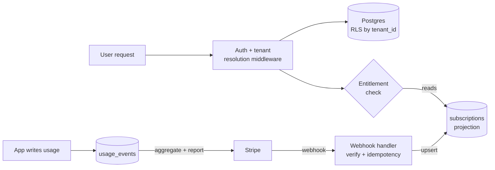

# Capstone: multi-tenant SaaS with billing

## Why this matters

It's a Tuesday afternoon and your support inbox has a ticket that makes your stomach drop: a customer at Acme Corp says they can see a project named "Globex Q3 Layoffs." Globex is a different customer. Your application just leaked one tenant's data to another, and the cause is a single missing `WHERE tenant_id = $1` on a query that someone wrote three sprints ago when they were in a hurry. There is no recovering the trust you lost in that moment, and depending on what was in that project, there may be a breach-notification clock now running.

Now flip to a second ticket from the same afternoon. Globex's CFO emails: "You charged us twice this month." You pull up Stripe and find two `invoice.paid` events, two charges, one subscription. Your webhook handler ran twice — once on Stripe's initial delivery, once on its automatic retry after your server returned a 500 — and you provisioned and billed for both. Stripe documents that it retries webhooks; you just didn't make your handler idempotent.

Both of these failures are the defining hazards of multi-tenant SaaS, and both are entirely preventable with architecture you decide on day one. Tenant isolation determines whether a forgotten clause leaks data or just returns an empty set. Idempotent webhook handling determines whether a retried event double-bills a customer or quietly no-ops. This chapter builds the spine of a multi-tenant SaaS — isolation model, Stripe subscription lifecycle, usage metering, and webhook idempotency — and shows the load-bearing code for each. Get these four right and the rest of the product is ordinary CRUD.

## Mental model

A multi-tenant SaaS has two planes that must stay in sync but fail independently. The **application plane** owns tenants, users, and their data, and must guarantee that tenant A never sees tenant B. The **billing plane** lives mostly in Stripe and is the source of truth for who is entitled to what. Your job is to keep an accurate, lagging projection of Stripe's state in your own database, updated by webhooks, and to enforce entitlements from that projection on every request.



The first decision is the **isolation model**, and there are three:

| Model | What separates tenants | Isolation strength | Cost per tenant | Where it breaks |
|---|---|---|---|---|
| **Shared schema, row-level** | A `tenant_id` column on every table | Weakest by default; strong with RLS | Near zero | One missing filter leaks everything |
| **Schema-per-tenant** | A Postgres schema per tenant, same database | Medium | Low; migrations fan out | Thousands of schemas strain `pg_catalog` and migrations |
| **Database-per-tenant** | A separate database (or cluster) per tenant | Strongest | High; connection pools explode | Operational overhead, slow onboarding |

The right default for most SaaS is **shared schema with Postgres Row-Level Security (RLS)**. It gives you one migration, one connection pool, and trivial cross-tenant analytics, while RLS turns "did the developer remember the `WHERE` clause?" into a database-enforced invariant. You escalate to schema- or database-per-tenant only when a specific tenant's compliance contract demands physical separation, and the clean designs let a few enterprise tenants live in their own database while everyone else shares — a hybrid you should plan for but not build until a contract pays for it. AWS's tenant-isolation whitepaper calls these the pool, bridge, and silo models, and the same tradeoff curve applies whatever cloud you run on: stronger isolation buys you compliance and a smaller blast radius at the cost of per-tenant operational overhead.

The second mental model is **Stripe as the source of truth, your DB as a cache**. You never compute "is this tenant a paying customer" from your own counters. You read it from your `subscriptions` table, which webhooks keep in sync with Stripe. When the two disagree, Stripe wins, and a nightly reconciliation job corrects drift. This is a deliberate inversion of where most CRUD apps put their authority: billing state is owned by an external system, and your database is only ever a fast, local, eventually-consistent read replica of it. Treating it as authoritative is how teams end up with customers who cancelled in Stripe but still have access in your app for weeks.

## In practice

The stack: TypeScript on Node, Postgres with RLS, Stripe for billing. The same patterns port to any language.

### Row-level isolation with Postgres RLS

Start with the schema. Every tenant-scoped table carries `tenant_id`, and RLS enforces the filter at the database level so application code physically cannot read across tenants.

```sql
CREATE TABLE tenants (
  id          uuid PRIMARY KEY DEFAULT gen_random_uuid(),
  name        text NOT NULL,
  created_at  timestamptz NOT NULL DEFAULT now()
);

CREATE TABLE projects (
  id          uuid PRIMARY KEY DEFAULT gen_random_uuid(),
  tenant_id   uuid NOT NULL REFERENCES tenants(id),
  name        text NOT NULL,
  created_at  timestamptz NOT NULL DEFAULT now()
);
CREATE INDEX ON projects (tenant_id);

-- Turn on RLS and force it even for the table owner.
ALTER TABLE projects ENABLE ROW LEVEL SECURITY;
ALTER TABLE projects FORCE ROW LEVEL SECURITY;

-- The policy: a row is visible only if its tenant_id matches the
-- tenant_id set on the current connection via a session variable.
CREATE POLICY tenant_isolation ON projects
  USING (tenant_id = current_setting('app.current_tenant')::uuid);
```

The application connects as a role that is *subject* to RLS (not a superuser, not the table owner without `FORCE`), and sets `app.current_tenant` per request inside the transaction:

```typescript
import { Pool } from "pg";
const pool = new Pool();

// Run a callback with the tenant context bound for the whole transaction.
export async function withTenant<T>(
  tenantId: string,
  fn: (client: import("pg").PoolClient) => Promise<T>,
): Promise<T> {
  const client = await pool.connect();
  try {
    await client.query("BEGIN");
    // set_config(..., true) scopes the setting to this transaction only,
    // so a pooled connection never leaks one tenant's context to the next.
    await client.query("SELECT set_config('app.current_tenant', $1, true)", [
      tenantId,
    ]);
    const result = await fn(client);
    await client.query("COMMIT");
    return result;
  } catch (err) {
    await client.query("ROLLBACK");
    throw err;
  } finally {
    client.release();
  }
}
```

The `true` third argument to `set_config` is the load-bearing detail. A connection pool hands the same physical Postgres connection to request after request; if you set the tenant with a session-scoped `SET` instead, tenant A's context survives into the next checkout and silently becomes tenant B's default. Transaction-scoped `set_config` is reset on `COMMIT` or `ROLLBACK`, so every request starts from a clean, unbound context.

Now the dangerous query is safe even when the developer forgets the filter:

```typescript
// Note: NO explicit tenant_id filter here. RLS adds it.
const projects = await withTenant(req.tenantId, (c) =>
  c.query("SELECT id, name FROM projects ORDER BY created_at DESC"),
);
```

If `app.current_tenant` is unset, `current_setting('app.current_tenant')` raises an error rather than returning everything — set the policy up so an unbound context fails closed. That transforms the opening disaster from "leaks Globex's data" into "throws a 500," which is a bug you find in staging instead of a breach you find in the press.

### Resolving the tenant on every request

Tenant identity comes from the authenticated session, never from a client-supplied parameter. A subdomain or path can *route*, but the trust boundary is the JWT.

```typescript
import { expressjwt } from "express-jwt";

app.use(expressjwt({ secret: process.env.JWT_SECRET!, algorithms: ["HS256"] }));

app.use((req, _res, next) => {
  // tenantId comes from the verified token claims — not from req.params,
  // not from a header the client controls.
  req.tenantId = (req.auth as { tenant_id: string }).tenant_id;
  next();
});
```

The anti-pattern this kills: trusting `?tenant_id=` or an `X-Tenant-ID` header. Either lets any authenticated user pivot to any tenant by editing the request. The subdomain (`acme.app.com`) is fine for routing requests to the right place and for branding, but you still verify that the tenant in the verified token matches the tenant the subdomain claims, and reject the request if they disagree.

### Modeling the subscription projection

```sql
CREATE TABLE subscriptions (
  tenant_id              uuid PRIMARY KEY REFERENCES tenants(id),
  stripe_customer_id     text NOT NULL,
  stripe_subscription_id text,
  status                 text NOT NULL,   -- active, trialing, past_due, canceled...
  plan                   text NOT NULL,   -- free, pro, enterprise
  current_period_end     timestamptz,
  cancel_at_period_end   boolean NOT NULL DEFAULT false,
  updated_at             timestamptz NOT NULL DEFAULT now()
);

-- Every webhook we've processed, so retries are no-ops.
CREATE TABLE processed_events (
  event_id     text PRIMARY KEY,        -- Stripe's evt_... id
  processed_at timestamptz NOT NULL DEFAULT now()
);
```

The `subscriptions.status` mirrors Stripe's [subscription statuses](https://docs.stripe.com/api/subscriptions/object). Your entitlement check reads this table — never a local guess:

```typescript
const ENTITLED = new Set(["active", "trialing"]);

export async function assertEntitled(tenantId: string) {
  const { rows } = await pool.query(
    "SELECT status, current_period_end FROM subscriptions WHERE tenant_id = $1",
    [tenantId],
  );
  const sub = rows[0];
  if (!sub || !ENTITLED.has(sub.status)) {
    throw new HttpError(402, "Subscription required");
  }
}
```

### Creating a subscription with Stripe Checkout

Don't build your own card form. Use Stripe Checkout so card data never touches your servers (this also keeps you in the lighter PCI-DSS SAQ A scope). You create a Checkout Session, redirect the user, and wait for the webhook to tell you it succeeded.

```typescript
import Stripe from "stripe";
const stripe = new Stripe(process.env.STRIPE_SECRET_KEY!);

app.post("/billing/checkout", async (req, res) => {
  const { rows } = await pool.query(
    "SELECT stripe_customer_id FROM subscriptions WHERE tenant_id = $1",
    [req.tenantId],
  );
  let customerId = rows[0]?.stripe_customer_id;
  if (!customerId) {
    const customer = await stripe.customers.create({
      metadata: { tenant_id: req.tenantId }, // critical: link back to our tenant
    });
    customerId = customer.id;
  }

  const session = await stripe.checkout.sessions.create({
    mode: "subscription",
    customer: customerId,
    line_items: [{ price: process.env.STRIPE_PRICE_PRO!, quantity: 1 }],
    success_url: `${process.env.APP_URL}/billing/success`,
    cancel_url: `${process.env.APP_URL}/billing`,
    // client_reference_id is echoed back on the webhook event.
    client_reference_id: req.tenantId,
  });
  res.json({ url: session.url });
});
```

The `metadata.tenant_id` on the customer is the thread that ties Stripe back to your tenant. Set it once and every future webhook can resolve the tenant from the customer. Notice what this endpoint does *not* do: it does not write to the `subscriptions` table. Provisioning happens only when the webhook confirms the payment, because a user who reaches `success_url` may still have a payment that fails seconds later. The redirect is a UX hint; the webhook is the truth.

### The webhook handler: verify, then make idempotent

This is the most failure-prone code in the system, so it gets the most care. Three rules: verify the signature, persist the event id before acting, and treat a duplicate as a no-op.

```typescript
// Stripe needs the RAW body to verify the signature — register this route
// with express.raw(), NOT the JSON body parser.
app.post(
  "/webhooks/stripe",
  express.raw({ type: "application/json" }),
  async (req, res) => {
    let event: Stripe.Event;
    try {
      event = stripe.webhooks.constructEvent(
        req.body,
        req.headers["stripe-signature"]!,
        process.env.STRIPE_WEBHOOK_SECRET!,
      );
    } catch {
      return res.status(400).send("invalid signature");
    }

    // Idempotency: claim the event id atomically. If it's already there,
    // a retry or duplicate delivery is happening — ack and stop.
    const client = await pool.connect();
    try {
      await client.query("BEGIN");
      const claimed = await client.query(
        "INSERT INTO processed_events (event_id) VALUES ($1) ON CONFLICT DO NOTHING",
        [event.id],
      );
      if (claimed.rowCount === 0) {
        await client.query("COMMIT");
        return res.status(200).send("duplicate"); // already handled
      }

      await handleEvent(client, event);
      await client.query("COMMIT");
    } catch (err) {
      await client.query("ROLLBACK");
      // Return 500 so Stripe retries. Because the event id was rolled back
      // too, the retry will re-claim and re-process cleanly.
      return res.status(500).send("processing failed");
    } finally {
      client.release();
    }
    res.status(200).send("ok");
  },
);
```

The subtle correctness point: the `processed_events` insert and the side effects share one transaction. If processing fails, the rollback un-claims the event, so Stripe's retry gets a clean shot. If processing succeeds, the claim is committed atomically with the side effects, so a duplicate delivery finds the row and no-ops. This is the precise fix for the double-billing in the opening scenario.

```typescript
async function handleEvent(client: PoolClient, event: Stripe.Event) {
  switch (event.type) {
    case "customer.subscription.created":
    case "customer.subscription.updated":
    case "customer.subscription.deleted": {
      const sub = event.data.object as Stripe.Subscription;
      const tenantId = await tenantForCustomer(client, sub.customer as string);
      // In current Stripe API versions the billing period lives on the
      // subscription ITEM, not the subscription. Read it from the first item.
      const periodEnd = sub.items.data[0]?.current_period_end;
      await client.query(
        `INSERT INTO subscriptions
           (tenant_id, stripe_customer_id, stripe_subscription_id, status,
            plan, current_period_end, cancel_at_period_end, updated_at)
         VALUES ($1,$2,$3,$4,$5,to_timestamp($6),$7, now())
         ON CONFLICT (tenant_id) DO UPDATE SET
           stripe_subscription_id = EXCLUDED.stripe_subscription_id,
           status                 = EXCLUDED.status,
           plan                   = EXCLUDED.plan,
           current_period_end     = EXCLUDED.current_period_end,
           cancel_at_period_end   = EXCLUDED.cancel_at_period_end,
           updated_at             = now()`,
        [
          tenantId,
          sub.customer,
          sub.id,
          sub.status,
          planFromSubscription(sub),
          periodEnd,
          sub.cancel_at_period_end,
        ],
      );
      break;
    }
    // invoice.paid, invoice.payment_failed → update status, send dunning email
  }
}
```

Note we handle `created`, `updated`, and `deleted` with the same upsert. Webhook ordering is not guaranteed, so a handler that assumes "created comes before updated" will eventually corrupt state. An idempotent upsert keyed on `tenant_id` is order-independent: whichever event lands last with the freshest data wins, and a nightly reconciliation against `stripe.subscriptions.retrieve` corrects any lingering drift. If you need strict ordering — say, to never regress a `canceled` status back to `active` because two events arrived out of order — gate the update on the event's timestamp and skip writes that are older than what you've already stored.

### Usage metering

For usage-based pricing, record raw events locally and report aggregates to Stripe on a schedule. Recording locally first means a Stripe outage never loses billable usage.

```typescript
// Hot path: cheap append. tenant_id present so RLS still applies.
export async function recordUsage(tenantId: string, metric: string, qty = 1) {
  await pool.query(
    "INSERT INTO usage_events (tenant_id, metric, quantity, ts) VALUES ($1,$2,$3, now())",
    [tenantId, metric, qty],
  );
}
```

A cron job aggregates per billing period and reports to Stripe's metering API, using an idempotency key so a retried report doesn't double-count:

```typescript
await stripe.billing.meterEvents.create(
  {
    event_name: "api_calls",
    payload: { stripe_customer_id: customerId, value: String(total) },
  },
  { idempotencyKey: `usage-${tenantId}-${periodStart}` },
);
```

The idempotency key is deterministic — derived from the tenant and the period start — so if the cron job crashes after reporting but before recording success, the next run produces the same key and Stripe treats the second call as a no-op rather than doubling the meter. Recording raw events locally also gives you an audit trail to reconcile against Stripe's view of the meter, which matters the first time a customer disputes a usage charge.

> **Connect the dots:** The webhook idempotency pattern here — claim a unique event id in the same transaction as the side effect — is the same exactly-once-processing discipline you'll meet in the event-sourced ledger capstone (this Part) and in any message-queue consumer (Part 9). And RLS leans directly on the Postgres internals and transaction isolation covered in Part 6.

## Pitfalls and anti-patterns

**1. Tenant from the request, not the token.** Reading `tenant_id` from a query param, path segment, or client-controlled header lets any authenticated user access any tenant by editing the request. *Recognize it:* grep for `tenant_id` sourced from `req.params`, `req.query`, or headers. *Fix it:* derive `tenant_id` only from verified JWT claims or server-side session, and bind it into the RLS session variable before any query runs.

**2. RLS bypassed by the connection role.** RLS does not apply to superusers or to a table's owner unless you add `FORCE ROW LEVEL SECURITY`. Teams enable RLS, test as the owner, see the policy "work" (because the owner is exempt in the opposite direction), and ship a policy that never actually filters in production. *Recognize it:* connect as your app role and run a query with no tenant set — it should error or return zero rows, not everything. *Fix it:* `FORCE` RLS, run the app as a non-owner role, and add an automated test that asserts cross-tenant reads fail.

**3. Non-idempotent webhook handlers.** Stripe retries deliveries and may deliver the same event more than once. A handler that provisions or charges without deduplicating will double-act. *Recognize it:* your handler has no `processed_events` table and no unique constraint on the event id. *Fix it:* persist the event id in the same transaction as the side effect, `ON CONFLICT DO NOTHING`, and ack duplicates with a 200.

**4. Trusting webhook ordering or local entitlement guesses.** Events can arrive out of order, and computing entitlement from local counters drifts from Stripe. *Recognize it:* code that assumes `created` precedes `updated`, or an `isPaid` flag you set yourself instead of reading the projection. *Fix it:* idempotent upserts keyed on tenant, entitlement read from the `subscriptions` projection, plus a nightly reconciliation job that pulls from Stripe and corrects drift.

**5. Parsing the webhook body before verifying the signature.** Mounting the JSON body parser ahead of the Stripe route mutates the raw bytes, so `constructEvent` can't verify the HMAC and either every webhook 400s or, worse, someone disables verification to "fix" it. *Recognize it:* a global `express.json()` and webhook verification failures. *Fix it:* register the webhook route with `express.raw()` and verify before doing anything else.

## Production checklist

- [ ] Every tenant-scoped table has `tenant_id`, an index on it, and `ENABLE` + `FORCE ROW LEVEL SECURITY`
- [ ] Application connects as a non-owner role subject to RLS; superuser connections are forbidden in app code
- [ ] An automated test asserts that a query with no tenant context returns zero rows or errors (fails closed)
- [ ] `tenant_id` is derived only from verified auth claims, never from client-supplied params or headers
- [ ] Webhook route uses the raw body parser and verifies the Stripe signature before any processing
- [ ] Webhook side effects and the `processed_events` claim share one transaction; duplicates ack with 200
- [ ] Entitlement checks read the `subscriptions` projection, never a locally computed flag
- [ ] A nightly reconciliation job compares the projection against Stripe and alerts on drift
- [ ] Usage is recorded locally first, then reported to Stripe with an idempotency key per period
- [ ] Stripe keys and webhook secrets are in a secrets manager, separate per environment, with test/live mode segregation
- [ ] Dunning is handled: `invoice.payment_failed` triggers email and a grace period before downgrade

## Exercises

1. **(Comprehension)** Explain, in three or four sentences, why the `processed_events` insert and the subscription upsert must be in the *same* transaction. What specifically goes wrong if you commit the event id first and then run the side effect in a separate transaction that fails?

2. **(Applied)** Stand up the schema with RLS and write two integration tests: one that confirms a query under tenant A's context returns only A's rows, and one that confirms a connection with no `app.current_tenant` set returns zero rows (or errors) rather than leaking all rows. Then trigger the same Stripe `customer.subscription.updated` event twice (the Stripe CLI's `stripe trigger` plus a manual replay) and assert your `subscriptions` row is written exactly once.

3. **(Design)** A prospective enterprise customer's contract requires their data to live in a physically separate database, while your other tenants stay on shared-schema RLS. Design the hybrid: how does tenant resolution pick the right connection pool, how do migrations fan out to the isolated database without doubling your release process, and how does billing and reconciliation stay uniform across both models? Name the one piece of state that must be the single source of "which tenant lives where" and where it lives.

## Further reading

- Stripe, [Webhooks documentation](https://docs.stripe.com/webhooks) and [Best practices](https://docs.stripe.com/webhooks#best-practices) — retries, signature verification, and idempotency, from the source
- Stripe, [Build a subscriptions integration](https://docs.stripe.com/billing/subscriptions/build-subscriptions) — the canonical subscription lifecycle walkthrough
- PostgreSQL, [Row Security Policies](https://www.postgresql.org/docs/current/ddl-rowsecurity.html) — the authoritative reference for RLS, `FORCE`, and policy semantics
- AWS, ["SaaS Tenant Isolation Strategies" whitepaper](https://docs.aws.amazon.com/whitepapers/latest/saas-tenant-isolation-strategies/saas-tenant-isolation-strategies.html) — silo vs. pool vs. bridge models with tradeoffs
- Stripe, [Idempotent requests](https://docs.stripe.com/api/idempotent_requests) — how idempotency keys work on the API side, the mirror image of webhook dedup

> **Security note:** Tenant isolation is the security property of this entire project, and RLS is your defense in depth, not your only defense. Add an automated cross-tenant access test to CI that fails the build if a query ever returns another tenant's rows — treat it like a smoke alarm, not a nice-to-have. Keep Stripe live keys out of the codebase and out of preview environments entirely; a leaked live secret key can issue refunds and read every customer's PII. Scope your API to PCI-DSS SAQ A by using Stripe Checkout or Elements so raw card numbers never touch your servers, and log webhook event ids (never card data) so you can audit exactly what you processed and when.
