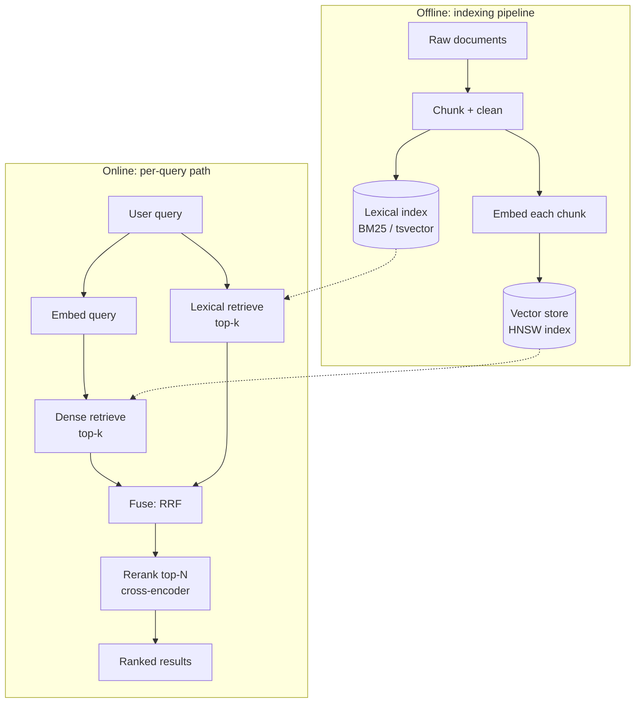

# Capstone: an AI semantic search engine

## Why this matters

It's a Tuesday afternoon. Support has escalated a complaint: a customer searched the docs for "my deploy is stuck waiting for a lock" and got nothing useful. You check the index. The page that answers it exactly is titled "Resolving concurrent migration contention" and the body says "the schema migration holds an advisory lock until the transaction commits." Not one keyword overlaps with the query. Your full-text search did its job perfectly and still failed the user, because the user and the author described the same thing with different words.

That gap — the vocabulary mismatch between how people ask and how documents are written — is the entire reason semantic search exists. Lexical search (BM25, the algorithm behind Postgres `tsvector`, Elasticsearch, and Lucene) matches tokens. It is fast, cheap, and unbeatable when the user types an exact error code, a SKU, or a function name. It is helpless when the user types a paraphrase. Embedding-based search matches *meaning*: it maps "stuck waiting for a lock" and "advisory lock until commit" to nearby points in a vector space, so the right page surfaces even with zero shared words.

The trap most teams fall into is treating this as a binary choice and then over-correcting. They rip out their working keyword search, replace it with a pure vector store, ship it, and discover that now exact-match queries — the customer who pastes `ERR_LOCK_TIMEOUT` verbatim — return fuzzy, vaguely-related garbage because embeddings smear precise tokens into approximate neighborhoods. The production answer is almost always *both*: hybrid retrieval that runs dense and lexical search in parallel, fuses the results, and then reranks the top candidates with a model that actually reads the query and document together. This chapter builds that system end to end — ingestion, embeddings, a vector store, hybrid retrieval, a reranker, and the part everyone skips until it bites them, an eval harness that tells you whether a change made search better or worse.

## Mental model

Semantic search is a pipeline with two distinct phases that people constantly conflate: an **offline indexing** phase that runs when documents change, and an **online query** phase that runs on every search. The expensive, batchable work (chunking, embedding the whole corpus) belongs offline. The latency-sensitive work (embed one query, search, rerank) belongs online. Getting this split wrong is the most common architecture mistake: teams that embed documents on the read path pay the corpus embedding cost on every search and watch p99 latency explode the moment traffic arrives. The corpus is embedded *once* per content change; only the query is embedded per request.



Three ideas carry the whole design.

**An embedding is a learned coordinate.** A model maps text to a fixed-length vector (768 or 1536 floats is typical) such that texts with similar meaning land close together under cosine similarity. You do not interpret the dimensions; you only ever compare vectors. The model that produces them is the single biggest determinant of quality — a better embedding model raises the ceiling for everything downstream, and no amount of clever fusion or reranking rescues a weak one.

**Retrieval and ranking are different jobs.** A *bi-encoder* (the embedding model) encodes query and document *separately*, so you can embed the whole corpus once, offline, and at query time only embed the query — that's what makes search over millions of documents fast. The price is that it never sees query and document together; it has to commit each document to a point in space before it knows what anyone will ask. A *cross-encoder* (the reranker) takes the pair `(query, document)` as one input and scores their relevance directly, so it can attend to exactly which words in the query match which words in the document. It is far more accurate and far too slow to run against the whole corpus — its cost is linear in the number of documents scored, with no precomputation possible. So you use the cheap bi-encoder to fetch ~50 candidates and the expensive cross-encoder to reorder the top of that list. This two-stage retrieve-then-rerank pattern is the backbone of every serious system.

**Approximate nearest neighbor (ANN) trades a little recall for orders of magnitude of speed.** Exact nearest-neighbor search is O(n) per query — you'd compare the query vector against every document. HNSW (Hierarchical Navigable Small World graphs, Malkov & Yashunin 2016) builds a navigable graph so search is roughly logarithmic, at the cost of occasionally missing a true neighbor. You tune the recall/speed tradeoff with the `ef_search` parameter at query time and `m`/`ef_construction` at build time: higher values visit more of the graph and recover more true neighbors at the cost of latency. For search, missing one borderline neighbor in fifty is invisible to users, so that tradeoff is almost always correct.

## In practice

We'll build this in TypeScript/Node with Postgres + `pgvector` as the store. Postgres is the right default: you probably already run it, it gives you transactional consistency between your documents and their vectors, and `pgvector` supports both HNSW indexing and lexical search in the same database, so hybrid retrieval needs no second system. Reach for a dedicated vector DB (Qdrant, Weaviate, Pinecone) only when you outgrow a single Postgres node or need features it lacks.

### The schema

```sql
CREATE EXTENSION IF NOT EXISTS vector;

CREATE TABLE chunks (
  id           BIGSERIAL PRIMARY KEY,
  document_id  TEXT NOT NULL,
  tenant_id    TEXT NOT NULL,
  content      TEXT NOT NULL,
  embedding    vector(1536),          -- match your model's dimension
  tsv          tsvector
                 GENERATED ALWAYS AS (to_tsvector('english', content)) STORED
);

-- Dense ANN index (cosine distance). Build AFTER bulk load for speed.
CREATE INDEX ON chunks USING hnsw (embedding vector_cosine_ops);

-- Lexical index for BM25-style ranking.
CREATE INDEX ON chunks USING gin (tsv);

-- Always filter by tenant before searching (see Security note).
CREATE INDEX ON chunks (tenant_id);
```

One table holds the chunk text, its dense vector, and a generated `tsvector` for lexical search. That co-location is the payoff for choosing Postgres: a hybrid query touches one row, and the document and its vector commit or roll back in the same transaction, so you never have an index that disagrees with the source of truth.

### Chunking and the embeddings pipeline

You do not embed whole documents. A 4,000-word page embeds to a single vector that is the blurry average of every topic it covers, and retrieval against it is useless. Split into overlapping chunks of a few hundred tokens. Overlap (carrying the tail of one chunk into the head of the next) keeps a sentence that straddles a boundary findable from either side.

Chunk *on token counts, not character counts*, because that is the unit the embedding model and its context limit actually work in — a "500 character" chunk can be 80 tokens of English or 400 tokens of code, and silently truncating at the model's limit drops the tail of your content from the index without an error. Where the document has structure (Markdown headings, function boundaries), prefer to split on those boundaries first and only fall back to a fixed window inside an oversized section; a chunk that respects a section boundary carries cleaner meaning than one that ends mid-sentence.

```typescript
// chunk.ts — token-aware splitting with overlap
import { encoding_for_model } from "tiktoken";

export function chunk(
  text: string,
  { size = 400, overlap = 80 } = {},
): string[] {
  const enc = encoding_for_model("text-embedding-3-small");
  const tokens = enc.encode(text);
  const out: string[] = [];
  for (let i = 0; i < tokens.length; i += size - overlap) {
    const slice = tokens.slice(i, i + size);
    out.push(new TextDecoder().decode(enc.decode(slice)));
    if (i + size >= tokens.length) break;
  }
  enc.free();
  return out;
}
```

Embedding is a batched, idempotent batch job. Send chunks in batches (the API accepts arrays), and store a content hash so re-running ingestion on an unchanged document is a no-op instead of a re-spend.

```typescript
// ingest.ts
import OpenAI from "openai";
import { createHash } from "node:crypto";
import { sql } from "./db";

const openai = new OpenAI();
const MODEL = "text-embedding-3-small"; // 1536 dims, cheap, strong baseline

async function embedBatch(texts: string[]): Promise<number[][]> {
  const res = await openai.embeddings.create({ model: MODEL, input: texts });
  return res.data.map((d) => d.embedding);
}

export async function ingest(
  doc: { id: string; tenantId: string; body: string },
) {
  const hash = createHash("sha256").update(doc.body).digest("hex");
  const seen = await sql`
    SELECT 1 FROM ingested WHERE document_id = ${doc.id} AND hash = ${hash}`;
  if (seen.length) return; // unchanged — skip the API spend

  const chunks = chunk(doc.body);
  // Batch to stay under token limits and to parallelize.
  for (let i = 0; i < chunks.length; i += 96) {
    const batch = chunks.slice(i, i + 96);
    const vectors = await embedBatch(batch);
    await sql.begin(async (tx) => {
      for (let j = 0; j < batch.length; j++) {
        await tx`
          INSERT INTO chunks (document_id, tenant_id, content, embedding)
          VALUES (${doc.id}, ${doc.tenantId}, ${batch[j]},
                  ${JSON.stringify(vectors[j])})`;
      }
    });
  }
  await sql`
    INSERT INTO ingested (document_id, hash) VALUES (${doc.id}, ${hash})
    ON CONFLICT (document_id) DO UPDATE SET hash = ${hash}`;
}
```

### Hybrid retrieval with Reciprocal Rank Fusion

Now the query path. Run dense and lexical retrieval independently, then fuse. The naive fusion — adding cosine similarity to a BM25 score — is broken, because the two scores live on incomparable scales. The robust answer is **Reciprocal Rank Fusion** (Cormack, Clarke, and Büttcher, 2009): ignore the raw scores entirely and combine *ranks*. A document that ranks high in either list floats up; one that ranks high in both wins.

$$\text{RRF}(d) = \sum_{r \in \text{retrievers}} \frac{1}{k + \text{rank}_r(d)}$$

with `k ≈ 60` a smoothing constant (the value used in the original paper). The constant flattens the contribution of the very top ranks so that a single retriever cannot dominate on the strength of one confident result — it takes agreement across retrievers, or a strong showing in one plus a decent showing in the other, to win. Because it consumes only ranks, RRF needs no per-corpus tuning and no score normalization, which is exactly why it's the sane default.

```typescript
// retrieve.ts
import { sql } from "./db";
import { embedBatch } from "./ingest";

const RRF_K = 60;

export async function search(query: string, tenantId: string, topN = 50) {
  const [qvec] = await embedBatch([query]);

  // Dense: nearest neighbors by cosine distance (<=> is pgvector's operator).
  const dense = await sql<{ id: number }[]>`
    SELECT id FROM chunks
    WHERE tenant_id = ${tenantId}
    ORDER BY embedding <=> ${JSON.stringify(qvec)}
    LIMIT ${topN}`;

  // Lexical: BM25-style ranking via ts_rank_cd.
  const lexical = await sql<{ id: number }[]>`
    SELECT id FROM chunks
    WHERE tenant_id = ${tenantId}
      AND tsv @@ plainto_tsquery('english', ${query})
    ORDER BY ts_rank_cd(tsv, plainto_tsquery('english', ${query})) DESC
    LIMIT ${topN}`;

  const scores = new Map<number, number>();
  const fuse = (rows: { id: number }[]) =>
    rows.forEach((row, i) => {
      scores.set(row.id, (scores.get(row.id) ?? 0) + 1 / (RRF_K + i + 1));
    });
  fuse(dense);
  fuse(lexical);

  return [...scores.entries()]
    .sort((a, b) => b[1] - a[1])
    .map(([id]) => id);
}
```

### Reranking the shortlist

The fused list is good but not great: it never compared query and document jointly. Take the top ~25 candidates, hydrate their text, and score each pair with a cross-encoder. Cohere's Rerank API and open models like `bge-reranker` both expose the same shape — give it a query and a list of documents, get relevance scores back.

```typescript
// rerank.ts
import { CohereClient } from "cohere-ai";
import { sql } from "./db";

const cohere = new CohereClient();

export async function rerank(query: string, ids: number[], k = 8) {
  const rows = await sql<{ id: number; content: string }[]>`
    SELECT id, content FROM chunks WHERE id = ANY(${ids})`;
  const res = await cohere.rerank({
    model: "rerank-english-v3.0",
    query,
    documents: rows.map((r) => r.content),
    topN: k,
  });
  return res.results.map((r) => rows[r.index]); // already sorted by relevance
}

export async function searchAndRank(query: string, tenantId: string) {
  const fusedIds = await search(query, tenantId, 50);
  return rerank(query, fusedIds.slice(0, 25), 8);
}
```

That `searchAndRank` is the whole engine: embed the query, retrieve hybrid, fuse by rank, rerank the shortlist, return eight results. Note the funnel — 50 candidates from each retriever, fused, narrowed to 25, reranked down to 8. The widths are knobs you tune against the eval set, not constants handed down from on high; a wider rerank window costs latency and money for a shot at higher quality.

### The eval harness — the part that makes this engineering

Without evaluation, every tuning decision is vibes. You'll swap an embedding model, eyeball five queries, declare victory, and silently regress the other ninety-five. Build a labeled set of `(query, relevant_chunk_ids)` pairs — fifty good ones beat zero — and measure two metrics on every change.

**Recall@k**: of the relevant chunks, how many appear in the top *k* retrieved? This grades the *retriever*. **nDCG@k** (normalized discounted cumulative gain): are the relevant results near the *top*? This grades the *ranker*, because it rewards position, not just presence — a relevant result at rank 1 contributes more than the same result at rank 8.

```typescript
// eval.ts
type Judged = { query: string; relevant: Set<number> };

function dcg(ranked: number[], rel: Set<number>, k: number) {
  return ranked.slice(0, k).reduce(
    (s, id, i) => s + (rel.has(id) ? 1 / Math.log2(i + 2) : 0), 0);
}

export async function evaluate(set: Judged[], tenantId: string, k = 8) {
  let recall = 0, ndcg = 0;
  for (const { query, relevant } of set) {
    const ranked = (await searchAndRank(query, tenantId)).map((r) => r.id);
    const hits = ranked.slice(0, k).filter((id) => relevant.has(id)).length;
    recall += hits / relevant.size;

    const ideal = [...relevant].slice(0, k); // all relevant at the top
    ndcg += dcg(ranked, relevant, k) / (dcg(ideal, relevant, k) || 1);
  }
  const n = set.length;
  return { recallAtK: recall / n, ndcgAtK: ndcg / n };
}
```

Run `evaluate` in CI on every change to chunking, the model, or the fusion weights. A drop in `recallAtK` means the retriever is missing relevant docs (look at chunking and the embedding model); a drop in `ndcgAtK` with stable recall means the ranker is the problem (look at the reranker). That decomposition is why you track both: one number tells you *whether* the right answer was found at all, the other tells you whether it was found *first*. A single blended metric would hide which half of the pipeline regressed.

> **Connect the dots:** The reranker and embedding calls are LLM API calls with all the reliability concerns from Part 12 (AI-powered features): rate limits, timeouts, retries with backoff, cost ceilings, and caching identical query embeddings. Wrap every provider call in the same resilience layer you'd give any third-party dependency — and cache embeddings of repeated queries, because the same searches recur constantly.

## Pitfalls and anti-patterns

**Embedding whole documents instead of chunks.** A long document collapses to one averaged vector that matches everything weakly and nothing strongly. *Recognize it:* retrieval returns plausible-but-wrong long documents and never the specific paragraph. *Fix it:* chunk to a few hundred tokens with overlap, embed and index per chunk, and return chunks (with a link back to the parent doc), not whole documents.

**Mixing embedding models between index and query.** Vectors from `text-embedding-3-small` and `text-embedding-3-large` are not comparable — they live in different spaces with different dimensions. *Recognize it:* recall collapses to near-random after a model "upgrade," or a dimension-mismatch error on insert. *Fix it:* pin the model in config, store it alongside the vector, and treat any model change as a full re-index of the corpus. There is no incremental migration between embedding spaces.

**Summing raw similarity and BM25 scores to "fuse."** Cosine similarity is roughly 0–1; BM25 is unbounded and corpus-dependent. Adding them lets whichever score happens to be larger dominate arbitrarily. *Recognize it:* hybrid search performs *worse* than either retriever alone in eval. *Fix it:* fuse by rank with RRF, or if you must use scores, min-max normalize each retriever's scores within the result set first.

**Skipping the reranker because "retrieval looks fine."** Bi-encoder retrieval optimizes for being *in* the top 50, not for ordering the top 5 correctly. *Recognize it:* the right answer is reliably on the first page but rarely in the first position, so users scroll or give up. *Fix it:* add a cross-encoder rerank over the top ~25. It is the single highest-leverage quality improvement per line of code in the whole pipeline.

**Building the HNSW index before bulk loading.** Inserting millions of rows into a live HNSW index re-balances the graph on every insert and is brutally slow. *Recognize it:* ingestion that should take minutes takes hours. *Fix it:* bulk-load rows first, then `CREATE INDEX ... USING hnsw`. Build it once over the full set.

## Production checklist

- [ ] Chunking is token-aware (not character-count) with overlap, and chunk size is tuned against the eval set, not guessed
- [ ] Embedding model name and dimension are stored per-vector; a model change triggers a full re-index
- [ ] Ingestion is idempotent — content-hashed so unchanged documents cost zero API spend on re-run
- [ ] Every retrieval query filters by `tenant_id` (or ACL) **before** the ANN search, never after
- [ ] Hybrid retrieval fuses by rank (RRF), and the fused result is verified to beat both retrievers alone in eval
- [ ] A cross-encoder reranker runs over the top ~25 candidates before results reach the user
- [ ] HNSW index is built after bulk load; index build parameters (`m`, `ef_construction`) are set deliberately
- [ ] An eval harness reports Recall@k and nDCG@k, and runs in CI to block regressions
- [ ] Embedding/rerank API calls have timeouts, retries with backoff, a cost ceiling, and query-embedding caching
- [ ] Result responses link each chunk back to its source document and section for citation and trust

## Exercises

1. **(Comprehension)** Explain why a bi-encoder is used for first-stage retrieval and a cross-encoder for reranking, in terms of *when* each model sees the query relative to the documents. Why can't you just run the cross-encoder over the whole corpus, and why does retrieve-then-rerank recover most of its accuracy at a fraction of the cost?

2. **(Applied)** Build a 30-query labeled eval set against a corpus you know (your own docs, a Wikipedia dump). Measure Recall@8 and nDCG@8 for three configurations: lexical only, dense only, and hybrid + rerank. Report the numbers and identify at least one query where dense beats lexical and one where lexical beats dense — explain each in terms of vocabulary mismatch versus exact-match precision.

3. **(Design)** Your corpus grows to 50 million chunks across 10,000 tenants and a single Postgres node can no longer hold the HNSW index in memory. Design the next architecture. Address: per-tenant index isolation versus a shared index with metadata filtering, when to move to a dedicated vector DB, how to keep documents and vectors consistent during re-indexing, and how you'd run the eval harness continuously without it becoming a cost center. State what you'd build first and why.

## Further reading

- Yu. A. Malkov and D. A. Yashunin, ["Efficient and robust approximate nearest neighbor search using Hierarchical Navigable Small World graphs"](https://arxiv.org/abs/1603.09320) — the HNSW paper behind `pgvector`, Qdrant, and most vector stores.
- Gordon V. Cormack, Charles L. A. Clarke, and Stefan Büttcher, ["Reciprocal Rank Fusion Outperforms Condorcet and Individual Rank Learning Methods"](https://plg.uwaterloo.ca/~gvcormack/cormacksigir09-rrf.pdf) — the original RRF paper; short and decisive.
- Nils Reimers and Iryna Gurevych, ["Sentence-BERT: Sentence Embeddings using Siamese BERT-Networks"](https://arxiv.org/abs/1908.10084) — the bi-encoder versus cross-encoder distinction, formalized.
- The [`pgvector` documentation](https://github.com/pgvector/pgvector) — HNSW vs. IVFFlat, distance operators, and index tuning parameters.
- The [BEIR benchmark](https://github.com/beir-cellar/beir) — a heterogeneous suite for evaluating retrieval; a reference for building your own harness and for understanding why no single retriever wins everywhere.

> **Security note:** Tenant isolation is a *retrieval correctness* problem here, not just an authorization one. An ANN index does not respect row-level security the way a `WHERE` clause does — if you embed all tenants' chunks in one HNSW graph and filter *after* the nearest-neighbor search, a query can leak which neighbors exist and, worse, post-filtering can return zero results while the index "knows" the answer belongs to another tenant. Always pass `tenant_id` as a pre-filter so the search only ever traverses one tenant's vectors, and treat document content as PII: scrub secrets before embedding (the embedding and any cached query is a copy of the source text living in a new system), and ensure your provider's data-retention terms permit sending that content off-box at all. When in doubt, self-host the embedding model for regulated corpora.
