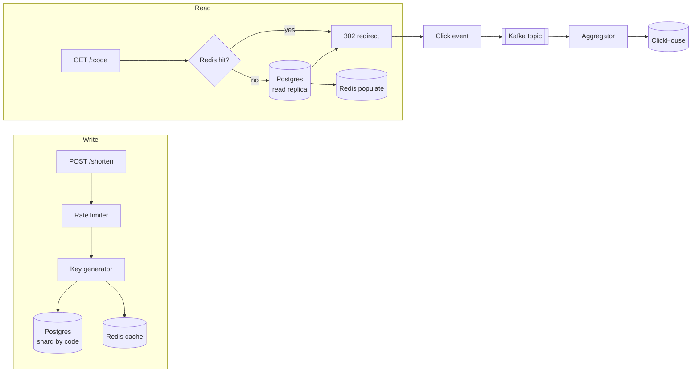

# Capstone: a distributed URL shortener

## Why this matters

It's a Tuesday afternoon and your marketing team just sent a campaign blast to four million inboxes. Every link in that email runs through your shortener: `go.acme.co/x7Kp2q`. The first thousand clicks land fine. Then someone notices the redirect latency graph is climbing — 40ms, 120ms, 400ms — and the on-call pager fires. Your single Postgres instance is doing a primary-key lookup for every single redirect, the connection pool is saturated, and because the redirect path is in the critical path of someone else's email open, every slow lookup is a real human staring at a spinner.

The fix isn't more Postgres. The shortener is the textbook case of a read-heavy, write-light system: you write a short code once and then serve it thousands or millions of times. The whole architecture follows from that one asymmetry. If you treat reads and writes the same way — one database, one code path — you'll build something that works in a demo and falls over the first time it matters.

This is the most-asked system design interview question for a reason: it's small enough to hold in your head and rich enough to touch key generation, sharding, caching, an analytics pipeline, and rate limiting. The interview version stops at a whiteboard. This chapter builds the real thing — the load-bearing code, the data model, and the decisions that separate "passes the interview" from "survives the campaign blast."

## Mental model

A URL shortener is two systems wearing one domain name. The **write path** turns a long URL into a short code and persists the mapping. The **read path** takes a short code and redirects — and it must be fast, cheap, and survive the database being slow or down. Bolted onto the side is an **analytics path** that records every click without ever blocking the redirect.



The traffic asymmetry is not a detail; it is the entire shape of the system. A healthy shortener serves reads to writes at ratios of hundreds or thousands to one — a link is created once and clicked for as long as it lives in an email, a tweet, or a printed QR code. That ratio dictates everything downstream: you provision read capacity independently of write capacity, you put the read path behind a cache that the write path merely warms, and you accept that the write path can be an order of magnitude slower because almost nobody is waiting on it. Conflating the two is the original sin every naive design commits.

Three ideas carry the whole design:

1. **The mapping is immutable.** Once `x7Kp2q → https://...` exists, it never changes. Immutable data is trivially cacheable — you can cache it forever, at every layer, with no invalidation problem. This single property is why a shortener scales so gracefully.

2. **The short code IS the lookup key.** You don't search for the URL; you decode or look up the code directly. The code generation strategy and the sharding strategy are the same decision, because the code determines which shard owns the row.

3. **Analytics is fire-and-forget.** A click write must never slow a redirect. The redirect emits an event to a log (Kafka, Kinesis, Redis Streams) and returns immediately. Aggregation happens downstream and asynchronously.

The one genuinely interesting design question is **how you generate the short code**, because it forks into two families with very different operational profiles.

| Strategy | How | Pro | Con |
|---|---|---|---|
| **Counter + Base62** | Global monotonic counter, encode integer to Base62 | Shortest codes, no collisions ever | Counter is a coordination point; sequential codes are enumerable |
| **Random / hash** | Random 7 chars, or hash(URL) truncated | No central counter, embarrassingly parallel | Must handle collisions; longer codes for same capacity |

Base62 (`[0-9a-zA-Z]`) gives 62 characters. Seven characters yield 62⁷ ≈ 3.5 trillion codes — comfortably more than any real shortener needs. Six characters give 62⁶ ≈ 56 billion, which is plenty for most. That's the capacity budget you're spending against.

## In practice

We'll build the core in TypeScript/Node with Postgres for durable storage, Redis for the read cache and distributed counter, and Kafka for the analytics log. The same shapes translate directly to Go or Python.

### Key generation: the counter approach, done right

The naive counter is `SELECT max(id) + 1` — a coordination bottleneck and a race condition in one line. The right way is to hand out **ranges** of IDs so each app instance can mint codes locally without touching the counter on every write. Redis `INCRBY` is atomic and gives us a batch.

```typescript
const BLOCK_SIZE = 1000;

class IdAllocator {
  private next = 0;
  private max = -1;

  constructor(private redis: Redis) {}

  // Atomically reserve a block; only one round-trip per 1000 codes.
  async nextId(): Promise<number> {
    if (this.next > this.max) {
      const end = await this.redis.incrby("urlshortener:id_counter", BLOCK_SIZE);
      this.next = end - BLOCK_SIZE + 1;
      this.max = end;
    }
    return this.next++;
  }
}
```

Encoding the integer to Base62 is where the code gets its length:

```typescript
const ALPHABET =
  "0123456789abcdefghijklmnopqrstuvwxyzABCDEFGHIJKLMNOPQRSTUVWXYZ";

function encodeBase62(num: number): string {
  if (num === 0) return ALPHABET[0];
  let s = "";
  while (num > 0) {
    s = ALPHABET[num % 62] + s;
    num = Math.floor(num / 62);
  }
  return s;
}
```

There's a real privacy problem with raw sequential codes: code `4` and code `5` were created consecutively, so a competitor can enumerate your entire link database by incrementing. The fix is to encode the counter value but **permute the integer space first** with a reversible bijection (e.g. multiply by a large coprime modulo 62⁷, or a small Feistel network). You keep collision-free guarantees while making codes non-sequential. Don't reach for this unless enumeration is a real threat in your model — it adds complexity.

### Key generation: the hash approach

If you can't tolerate a central counter (multi-region, no shared Redis), generate random codes and rely on the database's unique constraint to catch the rare collision:

```typescript
import { randomBytes } from "crypto";

function randomCode(len = 7): string {
  const bytes = randomBytes(len);
  let s = "";
  for (let i = 0; i < len; i++) s += ALPHABET[bytes[i] % 62];
  return s;
}

async function createShortUrl(longUrl: string, db: Pool): Promise<string> {
  for (let attempt = 0; attempt < 5; attempt++) {
    const code = randomCode();
    try {
      await db.query(
        "INSERT INTO urls (code, long_url, created_at) VALUES ($1, $2, now())",
        [code, longUrl],
      );
      return code;
    } catch (err: any) {
      if (err.code === "23505") continue; // unique_violation: retry
      throw err;
    }
  }
  throw new Error("code allocation failed after 5 attempts");
}
```

At low fill ratios (you're using a tiny fraction of 3.5 trillion codes), collisions are astronomically rare, so the retry loop almost never fires. This is my default for new systems: it's stateless, multi-region-safe, and the only cost is one extra character of code length versus a tight counter.

**Which would I pick?** Random/hash, unless the product genuinely needs the shortest possible codes or you've measured the unique-index contention and it hurts. The counter buys you one character at the price of a global coordination point and an enumeration risk. That's rarely a good trade.

### Sharding by code

The code is the shard key. With random codes, the high bits are already uniformly distributed, so a simple modulo works:

```typescript
function shardFor(code: string, shardCount: number): number {
  let h = 2166136261; // FNV-1a offset basis
  for (let i = 0; i < code.length; i++) {
    h ^= code.charCodeAt(i);
    h = Math.imul(h, 16777619);
  }
  return (h >>> 0) % shardCount;
}
```

The trap here is **resharding**: if you go from 8 shards to 16, plain modulo remaps almost every key. Use consistent hashing or pre-split into many logical shards (say 1024) mapped onto few physical nodes, so growing means moving logical shards, not rehashing every row. The schema per shard is deliberately boring:

```sql
CREATE TABLE urls (
  code        TEXT PRIMARY KEY,
  long_url    TEXT NOT NULL,
  created_at  TIMESTAMPTZ NOT NULL DEFAULT now(),
  expires_at  TIMESTAMPTZ,
  owner_id    BIGINT
);
```

The primary key on `code` means redirect lookups are index-only. No secondary indexes are needed on the hot path.

### The read path: cache first, always

This is the code that runs millions of times. Every decision here is about shaving latency and protecting the database.

```typescript
async function resolve(code: string): Promise<string | null> {
  // 1. Cache hit — the overwhelmingly common case.
  const cached = await redis.get(`u:${code}`);
  if (cached !== null) {
    return cached === "" ? null : cached; // "" caches a known miss
  }

  // 2. Cache miss — go to the (replica) database.
  const row = await readReplica.query(
    "SELECT long_url FROM urls WHERE code = $1 AND (expires_at IS NULL OR expires_at > now())",
    [code],
  );
  const url = row.rows[0]?.long_url ?? null;

  // 3. Populate cache. Cache misses too, to stop cache penetration.
  await redis.set(`u:${code}`, url ?? "", "EX", url ? 86400 : 60);
  return url;
}
```

Two details earn their keep. First, **caching the miss** (the empty-string sentinel with a short TTL) defends against *cache penetration* — an attacker hammering random non-existent codes would otherwise send every request straight to your database. Second, mappings are immutable, so the 24-hour TTL on hits exists only to bound memory, not for correctness; you could cache far longer.

There's a subtlety in that `expires_at` clause. A link can be alive in the cache and dead in the model, so the resolve path must check expiry — folding the predicate into the query keeps an expired link from redirecting for the rest of its cache TTL. If you cache hits for very long durations, you also need to invalidate (`DEL u:code`) the moment a link is expired or killed, because that is the one case where the mapping's *servability* changes even though the mapping itself does not.

Single-flight deserves its own mention, because it is the difference between a cache that protects the database and one that merely delays the stampede. The idea: a per-process map keyed by code holds an in-flight promise; the first request for a cold code creates the promise and queries the database, every concurrent request for the same code awaits that one promise, and the entry is deleted when it resolves. Ten thousand simultaneous misses collapse into one query. Go has `golang.org/x/sync/singleflight`; in Node a small `Map` of pending promises does the job.

The HTTP handler keeps the redirect itself trivial and pushes analytics off the critical path:

```typescript
app.get("/:code", async (req, res) => {
  const url = await resolve(req.params.code);
  if (!url) return res.status(404).send("Not found");

  // Fire-and-forget: never await the analytics write.
  emitClick({
    code: req.params.code,
    ts: Date.now(),
    ip: req.ip,
    ua: req.get("user-agent") ?? "",
    referer: req.get("referer") ?? "",
  }).catch((e) => logger.warn({ e }, "click emit failed"));

  res.redirect(302, url);
});
```

Use **302, not 301**. A 301 (permanent) is aggressively cached by browsers and intermediaries, which means you stop seeing clicks for that code entirely — fatal if your product *is* the analytics. 302 keeps every click flowing through your service. The cost is that the browser asks you every time, which is exactly what you want.

Because the read path *is* the product, its latency is your SLO. Instrument it with a histogram of redirect latency split by cache hit versus miss, so a rising miss rate (a cache that is undersized, or being flushed, or under a penetration attack) is visible on a dashboard before it turns into a page.

### The click analytics pipeline

`emitClick` writes to a log, not a database. The redirect doesn't care if aggregation is backed up.

```typescript
async function emitClick(event: ClickEvent): Promise<void> {
  await producer.send({
    topic: "clicks",
    messages: [{ key: event.code, value: JSON.stringify(event) }],
  });
}
```

Downstream, a consumer batches events and writes to a column store built for analytical scans. ClickHouse is the standard pick here because click analytics is `SELECT count(*) ... GROUP BY day` over enormous append-only tables — exactly what columnar storage is for.

```sql
CREATE TABLE clicks (
  code       String,
  ts         DateTime,
  country    LowCardinality(String),
  referer    String,
  ua_family  LowCardinality(String)
) ENGINE = MergeTree
ORDER BY (code, ts);

-- A daily rollup the dashboard can query quickly:
SELECT code, toDate(ts) AS day, count() AS clicks
FROM clicks
WHERE code = 'x7Kp2q'
GROUP BY code, day
ORDER BY day;
```

Ordering by `(code, ts)` means per-code time-range queries — the dashboard's bread and butter — read a contiguous slice instead of scanning the table. The consumer side matters as much as the producer: a single consumer group reads the `clicks` topic, batches events in memory for a second or a few thousand rows (whichever comes first), and does one bulk insert. Batching is mandatory — ClickHouse hates many small inserts and loves few large ones. If the consumer falls behind, the topic absorbs the backlog and the redirect path never notices. That is the whole point of decoupling through a log.

### Rate limiting the write path

Anyone can POST to `/shorten`, so it's a spam and abuse magnet. A token-bucket limiter in Redis, evaluated atomically in a Lua script, stops one client from minting millions of codes:

```lua
-- KEYS[1] = bucket key, ARGV = rate, capacity, now, requested
local tokens = tonumber(redis.call("hget", KEYS[1], "tokens") or ARGV[2])
local last   = tonumber(redis.call("hget", KEYS[1], "ts") or ARGV[3])
local rate, cap, now = tonumber(ARGV[1]), tonumber(ARGV[2]), tonumber(ARGV[3])
local filled = math.min(cap, tokens + (now - last) * rate)
if filled < tonumber(ARGV[4]) then
  redis.call("hset", KEYS[1], "tokens", filled, "ts", now)
  return 0  -- denied
end
redis.call("hset", KEYS[1], "tokens", filled - tonumber(ARGV[4]), "ts", now)
redis.call("expire", KEYS[1], 3600)
return 1    -- allowed
```

Doing the read-compute-write inside Lua makes the whole check atomic — no race where two concurrent requests both see the last token and both spend it. Key the bucket by API key for authenticated callers and by IP (or IP subnet) for anonymous ones.

> **Connect the dots:** The fire-and-forget click log here is the same append-only-log idea that powers the event-sourced ledger (Chapter 5 of this Part) and underlies Kafka itself (Part 9). Once you see "write an immutable event, project it later," you'll reach for it everywhere — analytics, audit trails, and CDC pipelines are all the same pattern.

## Pitfalls and anti-patterns

**1. Lookups straight to the primary database.** The most common failure: the redirect handler does `SELECT ... FROM urls` against the write primary on every click. It works in the demo and dies under load, because reads and writes now contend for the same connection pool and the same disk. *Recognize it* by a redirect-latency graph that tracks database CPU. *Fix it* by putting Redis in front and routing any unavoidable DB reads to replicas, never the primary.

**2. Using 301 redirects.** Reach for "permanent" because the mapping is permanent, and browsers will cache the redirect for days. You'll see click counts mysteriously crater while traffic is obviously flowing. *Recognize it* by analytics that undercount versus server logs or third-party data. *Fix it* by serving 302 (temporary) so every click hits your service, accepting the extra round-trip as the price of measurement.

**3. Cache penetration via random codes.** An attacker requests thousands of random non-existent codes per second. Each one misses the cache and slams the database, because you only cache *hits*. *Recognize it* by a flood of 404s correlated with a database load spike. *Fix it* by caching negative lookups with a short TTL (the empty-string sentinel above) and, if it's adversarial, fronting the lookup with a Bloom filter of known codes.

**4. Hot-key thundering herd.** A celebrity tweets your link; that one code's cache entry expires; ten thousand concurrent requests all miss and stampede the database simultaneously. *Recognize it* by a periodic latency spike that lines up with a TTL boundary on a popular code. *Fix it* with request coalescing (single-flight: let one request fill the cache while the rest wait on it) and jittered TTLs so popular keys don't all expire at the same instant.

**5. Synchronous analytics writes.** The redirect handler `await`s the click insert. Now your redirect latency is your analytics database's latency, and an analytics outage becomes a redirect outage. *Recognize it* by redirect latency that moves in lockstep with the analytics store's health. *Fix it* by emitting to a log asynchronously and never awaiting it on the request path; the redirect should succeed even if the entire analytics pipeline is down.

## Production checklist

- [ ] Redirects served from cache; database reads go to replicas, never the write primary
- [ ] Negative (miss) results cached with a short TTL to prevent cache penetration
- [ ] Single-flight / request coalescing on cache fill to prevent thundering herd
- [ ] Jittered cache TTLs so popular keys don't expire simultaneously
- [ ] 302 (not 301) redirects so every click is observable
- [ ] Short-code allocation is collision-safe: unique constraint + retry, or block-allocated counter
- [ ] Shard key is the code; resharding plan uses consistent hashing or many logical shards
- [ ] Click events are fire-and-forget to a log; redirect path never awaits analytics
- [ ] Rate limiting on `POST /shorten`, keyed per API key and per IP, evaluated atomically
- [ ] Input validation on submitted URLs: scheme allowlist (`http`/`https` only), max length, reject `javascript:` and `data:`
- [ ] Malicious-URL screening (Safe Browsing or equivalent) before serving redirects
- [ ] `expires_at` honored on read so expired links 404 even if still cached
- [ ] Redirect-latency histogram split by cache hit/miss, alerting on a rising miss rate
- [ ] Redirect path has an aggressive timeout and a graceful 503 if both cache and DB are unreachable

## Exercises

1. **(Comprehension)** Given a 7-character Base62 code, compute the total address space and explain why caching the URL mapping needs no invalidation strategy. Then explain in one paragraph why a 301 redirect would corrupt your click analytics but a 302 would not.

2. **(Applied)** Implement the read path end to end: a `GET /:code` handler backed by Redis with negative-result caching, falling through to a Postgres replica on miss. Add a single-flight wrapper so that N concurrent misses for the same cold code produce exactly one database query. Load-test it with a tool like `k6` or `wrk` and capture the cache hit ratio and p99 latency under a hot-key workload.

3. **(Design)** You're asked to make the shortener multi-region active-active: writes and reads in both `us-east` and `eu-west`, with a regional outage tolerated. Design the key-generation scheme (a global counter is now a liability), the cross-region replication strategy for the mappings, and how click analytics from both regions converge into one dataset. Name the consistency tradeoffs you're accepting and justify your choice of code-generation strategy under this constraint.

## Further reading

- Werner Vogels, ["Eventually Consistent"](https://www.allthingsdistributed.com/2008/12/eventually_consistent.html) — the CAP tradeoffs you'll make when you take this multi-region
- Martin Kleppmann, *Designing Data-Intensive Applications* (O'Reilly, 2017) — Chapter 6 on partitioning and Chapter 5 on replication map directly onto sharding and read replicas here
- [Redis documentation: rate limiting patterns](https://redis.io/docs/latest/develop/use-cases/) and the `INCR`/scripting reference for atomic counters and token buckets
- [ClickHouse documentation](https://clickhouse.com/docs) — the `MergeTree` engine and materialized views, the right tool for the click-aggregation pipeline
- [RFC 9110, HTTP Semantics](https://www.rfc-editor.org/rfc/rfc9110), §15.4 — the precise, normative difference between 301, 302, 307, and 308 redirects
- [Google Safe Browsing API](https://developers.google.com/safe-browsing) — for screening submitted URLs before you become a malware delivery vector

> **Security note:** A URL shortener is an open redirector by definition, which makes it a favorite tool for phishing and malware distribution — your clean-looking `go.acme.co` link can mask anything. Treat every submitted URL as hostile: enforce an `http`/`https` scheme allowlist (reject `javascript:`, `data:`, `file:`), cap length, screen against a malicious-URL feed like Safe Browsing on both write and periodically thereafter, and rate-limit creation per identity. Log the creator (`owner_id`, source IP) for every code so abusive links are traceable and revocable. The mapping being immutable does not mean it must stay *servable* — keep a kill switch that 410s a code (and evicts its cache entry) without deleting its analytics history.
