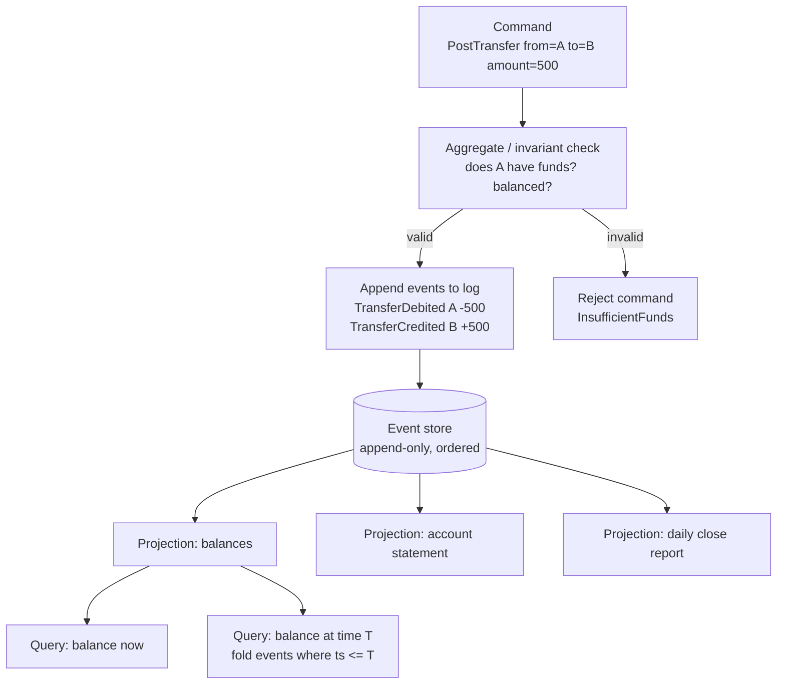

# Capstone: an event-sourced ledger

## Why this matters

It's a Tuesday afternoon and a customer-support manager pings you: a merchant is disputing their February statement. The merchant says their balance on February 14th was $4,210.00. Your dashboard says $3,990.00 today, and the merchant insists you "lost" a $220 refund. You open the production database. The `accounts` table has one row for that merchant with a single column, `balance: 399000` (cents). There is no row for February 14th. There is no row for the refund. The number was overwritten the moment the next transaction landed. You have no idea what the balance was on the 14th, whether the refund ever applied, or who changed what. You are about to spend two days reconstructing a timeline from Stripe webhooks, application logs, and guesswork — and you still won't be able to prove anything to the merchant or to a regulator.

That's the failure mode of a mutable-balance ledger: it stores the *answer* and throws away the *question*. The number in the row is a running total with no provenance. Every `UPDATE accounts SET balance = balance + ?` is a small act of forgetting. When money is involved — and "money" includes credits, points, API usage quotas, anything you'll be asked to audit — forgetting is a liability, not an optimization.

An event-sourced ledger inverts this. You never store the balance as a primary fact. You store an append-only log of immutable events — `FundsDeposited`, `TransferPosted`, `RefundIssued` — and the balance is a *derived* value you compute by folding over the log. The current balance, the balance on February 14th, the balance the instant before a disputed transaction: all of them are queries against the same immutable history. The audit trail isn't a feature you bolt on; it *is* the database. This chapter builds that system: the append-only event store, the double-entry invariants that make it a real ledger and not just a log, the projections that make it fast to read, and the replay machinery that lets you reconstruct any balance at any point in time. It ties directly to the data-storage and consistency material in Part 7 — event sourcing is the most demanding application of "the log is the source of truth" that you'll build.

## Mental model

A ledger has three layers, and the whole design hinges on keeping them separate.

The **event store** is the append-only source of truth. Events are immutable, ordered, and never updated or deleted. The **command side** validates business rules and decides whether to append new events. The **projection side** consumes events and builds read-optimized views — current balances, account statements, dashboards. The read models are disposable: you can delete every projection and rebuild it by replaying the log.



The second non-negotiable idea is **double-entry accounting**, an invariant that predates computers by centuries — Italian merchants were using it well before Luca Pacioli wrote it down in 1494 — and survives them for good reason. Every transaction moves value *between* accounts, and the sum of all movements in a transaction is exactly zero. Money is never created or destroyed inside the ledger; it only moves. If you debit account A by 500, you must credit some other account by 500 in the same transaction. This gives you a continuous, checkable invariant: at any moment, summing every entry across every account in a closed system must equal zero. If it doesn't, you have a bug, and you can find exactly which transaction broke it because the events are still there.

The events are the facts; everything else is a fold over the facts. `balance = events.reduce((sum, e) => sum + e.delta, 0)`. Once that sentence is load-bearing in your head, point-in-time reconstruction stops being a feature and becomes a `WHERE` clause: `balance at T = fold(events where ts <= T)`.

## In practice

We'll build the core in TypeScript on Postgres. Postgres is a fine event store for most teams up to large scale — you get transactions, `SERIALIZABLE` isolation, and `BIGSERIAL` ordering for free, and you defer the operational cost of Kafka or a dedicated store like EventStoreDB until you actually need it.

### The schema: an append-only log plus per-account ordering

```sql
CREATE TABLE accounts (
    id          UUID PRIMARY KEY,
    name        TEXT NOT NULL,
    type        TEXT NOT NULL CHECK (type IN ('asset','liability','equity','revenue','expense')),
    currency    CHAR(3) NOT NULL DEFAULT 'USD',
    created_at  TIMESTAMPTZ NOT NULL DEFAULT now()
);

-- The append-only event log. This table is INSERT-only.
-- No UPDATE, no DELETE, ever. Enforce it with a trigger or table grants.
CREATE TABLE ledger_events (
    global_seq   BIGSERIAL PRIMARY KEY,        -- total order across the whole log
    transfer_id  UUID NOT NULL,                -- groups the legs of one transaction
    account_id   UUID NOT NULL REFERENCES accounts(id),
    amount       BIGINT NOT NULL,              -- signed minor units (cents). +credit / -debit
    event_type   TEXT NOT NULL,               -- 'TransferDebited', 'RefundIssued', ...
    metadata     JSONB NOT NULL DEFAULT '{}',
    occurred_at  TIMESTAMPTZ NOT NULL DEFAULT now(),
    idempotency_key TEXT
);

CREATE INDEX idx_events_account ON ledger_events (account_id, global_seq);
CREATE INDEX idx_events_transfer ON ledger_events (transfer_id);
CREATE UNIQUE INDEX idx_events_idem ON ledger_events (idempotency_key)
    WHERE idempotency_key IS NOT NULL;
```

Two design decisions carry their weight here. First, **money is `BIGINT` minor units, never a float.** `0.1 + 0.2 !== 0.3` in IEEE 754, and a financial system that loses fractions of a cent under rounding is a system that fails its own audit. Store cents (or whatever the currency's minor unit is) as integers. Second, the `idempotency_key` unique index makes appends safe to retry. A payment webhook that fires twice — and they always fire twice — inserts once.

### Appending events with the double-entry invariant enforced

The command handler is where the invariants live. It must do three things atomically: check business rules, verify the transaction balances to zero, and append all legs in one transaction.

```typescript
import { Pool } from "pg";

interface Leg {
  accountId: string;
  amount: bigint; // signed: negative = debit, positive = credit
  eventType: string;
}

const pool = new Pool();

export async function postTransfer(opts: {
  transferId: string;
  legs: Leg[];
  idempotencyKey?: string;
  metadata?: Record<string, unknown>;
}): Promise<void> {
  // INVARIANT 1: double-entry — the transaction must net to zero.
  const sum = opts.legs.reduce((acc, l) => acc + l.amount, 0n);
  if (sum !== 0n) {
    throw new Error(`Unbalanced transfer: legs sum to ${sum}, must be 0`);
  }
  if (opts.legs.length < 2) {
    throw new Error("A transfer needs at least two legs (debit and credit)");
  }

  const client = await pool.connect();
  try {
    // SERIALIZABLE so concurrent transfers on the same account can't
    // both read a stale balance and both pass the funds check.
    await client.query("BEGIN ISOLATION LEVEL SERIALIZABLE");

    // INVARIANT 2: no asset/equity account may go negative.
    // Compute current balance for each debited account FROM THE LOG.
    for (const leg of opts.legs) {
      if (leg.amount >= 0n) continue; // credits never overdraw
      const { rows } = await client.query<{ balance: string }>(
        `SELECT COALESCE(SUM(amount), 0) AS balance
           FROM ledger_events WHERE account_id = $1`,
        [leg.accountId],
      );
      const projected = BigInt(rows[0].balance) + leg.amount;
      if (projected < 0n) {
        throw new Error(`InsufficientFunds on ${leg.accountId}`);
      }
    }

    // Append every leg as its own immutable event row.
    for (const leg of opts.legs) {
      await client.query(
        `INSERT INTO ledger_events
           (transfer_id, account_id, amount, event_type, metadata, idempotency_key)
         VALUES ($1, $2, $3, $4, $5, $6)`,
        [
          opts.transferId,
          leg.accountId,
          leg.amount.toString(),
          leg.eventType,
          JSON.stringify(opts.metadata ?? {}),
          opts.idempotencyKey ?? null,
        ],
      );
    }

    await client.query("COMMIT");
  } catch (err) {
    await client.query("ROLLBACK");
    // A unique-violation on idempotency_key means a retry of an already-
    // applied transfer. That's success, not failure — swallow it.
    if ((err as { code?: string }).code === "23505") return;
    throw err;
  } finally {
    client.release();
  }
}
```

The `SELECT SUM` inside `SERIALIZABLE` is the load-bearing piece. Two transfers racing to drain the same account will conflict on serialization and one retries, so you can never approve two withdrawals against the same dollar. Recomputing the balance from the log every time is correct but O(n) — we fix that next with a snapshot, not by mutating a balance column.

### Projections: turning the log into fast reads

Folding the entire log on every read is fine at thousands of events and ruinous at hundreds of millions. The standard fix is a projection: a read model maintained incrementally as events arrive, with periodic snapshots so you never replay from zero.

```sql
-- A materialized current-balance projection. This is DERIVED and DISPOSABLE.
-- last_seq records how far into the log this row has consumed.
CREATE TABLE balance_projection (
    account_id  UUID PRIMARY KEY REFERENCES accounts(id),
    balance     BIGINT NOT NULL DEFAULT 0,
    last_seq    BIGINT NOT NULL DEFAULT 0
);
```

```typescript
// Idempotent projector: advances each account from its last_seq forward.
// Safe to run repeatedly; safe to crash and restart.
export async function projectBalances(): Promise<void> {
  const client = await pool.connect();
  try {
    await client.query("BEGIN");
    const { rows: events } = await client.query<{
      global_seq: string; account_id: string; amount: string;
    }>(
      `SELECT e.global_seq, e.account_id, e.amount
         FROM ledger_events e
         LEFT JOIN balance_projection p ON p.account_id = e.account_id
        WHERE e.global_seq > COALESCE(p.last_seq, 0)
        ORDER BY e.global_seq
        FOR UPDATE OF e SKIP LOCKED`,
    );
    for (const ev of events) {
      await client.query(
        `INSERT INTO balance_projection (account_id, balance, last_seq)
         VALUES ($1, $2, $3)
         ON CONFLICT (account_id) DO UPDATE
           SET balance = balance_projection.balance + EXCLUDED.balance,
               last_seq = EXCLUDED.last_seq`,
        [ev.account_id, ev.amount, ev.global_seq],
      );
    }
    await client.query("COMMIT");
  } finally {
    client.release();
  }
}
```

The projection tracks `last_seq` so it's *resumable* and *idempotent*: if the projector crashes mid-batch, restarting picks up exactly where it left off and never double-counts. This is the single most important property of a projection. A projection that can be corrupted by a retry is worse than no projection, because it lies confidently.

### Point-in-time reconstruction: the payoff

Because the log is immutable and ordered by `occurred_at`, "what was the balance on February 14th?" is a query, not an archaeology project.

```sql
-- Balance of one account as of a point in time.
SELECT COALESCE(SUM(amount), 0) AS balance_cents
  FROM ledger_events
 WHERE account_id = $1
   AND occurred_at <= $2;   -- e.g. '2026-02-14 23:59:59+00'
```

And the system-wide health check that double-entry buys you — across the *entire* ledger, every cent must net to zero:

```sql
-- If this is ever non-zero, money was created or destroyed. Alert on it.
SELECT SUM(amount) AS should_be_zero FROM ledger_events;
```

Run that as a continuous invariant check. A failing result is a five-alarm fire that points you at the exact `transfer_id` range where the imbalance entered, because the events are all still there with their `global_seq` ordering intact.

### Replay: rebuilding a projection from scratch

When you add a new read model — say, a monthly statement view — or when a projection bug corrupts a balance, you don't patch the balance. You `TRUNCATE` the projection and replay:

```typescript
export async function rebuildBalances(): Promise<void> {
  await pool.query("TRUNCATE balance_projection");
  await projectBalances(); // re-folds the entire log from seq 0
}
```

This is the property mutable-balance systems can never have: the read model is cheap and disposable because the truth is the log. Get a projection wrong, ship a fix, replay. No data migration, no reconciliation script, no apologies to the auditor.

## Pitfalls and anti-patterns

**1. The mutable-balance shortcut.** "We'll just keep a `balance` column and also write an audit log." The two diverge the first time a code path updates the column without writing the log, or writes the log without the column, and now you have two sources of truth that disagree and no way to know which is right. The balance must be derived from the log — a projection with a `last_seq`, not a hand-maintained counter. Recognize it by a `UPDATE accounts SET balance` anywhere in the codebase. Fix it by making that column read-only and rebuildable.

**2. Floating-point money.** Storing amounts as `NUMERIC` is acceptable; storing them as `float`/`double` or JavaScript `number` is a latent corruption bug. `0.1 + 0.2` is `0.30000000000000004`, and once you sum millions of those the error is real money. Recognize it by `amount: number` in a money type or `FLOAT` in a schema. Fix it with integer minor units (`BIGINT` cents) or a fixed-precision decimal, and JavaScript `BigInt` end to end.

**3. Mutable events.** Someone "fixes a typo" in an event's metadata with an `UPDATE`, or deletes a "wrong" event. The instant an event changes, every projection derived from it is silently wrong and replay no longer reproduces history. Events are immutable. To correct a mistake you append a *compensating* event (a reversal), the same way accountants never erase ink — they post an adjusting entry. Enforce immutability at the database level with `REVOKE UPDATE, DELETE ON ledger_events` or a trigger that raises on non-INSERT.

**4. Non-idempotent projections.** A projector that does `balance = balance + delta` without tracking how far it has consumed will double-count on any retry, redelivery, or restart. Since at-least-once delivery is the norm for any queue or webhook, this *will* fire. Recognize it by the absence of a `last_seq` / consumed-offset column. Fix it by making the projection track its position and apply each event exactly once relative to that position.

**5. Unbalanced transactions slipping through.** Appending a single-sided event — a debit with no matching credit — quietly breaks the global zero-sum invariant. It often hides in "adjustment" or "fee" code paths written in a hurry. Recognize it with the `SELECT SUM(amount) FROM ledger_events` check coming back non-zero. Fix it by validating `legs.sum() === 0` before *any* append, and never exposing a primitive that writes one leg at a time.

## Production checklist

- [ ] Money stored as integer minor units (`BIGINT`) or fixed-precision decimal — never floating point — end to end, including the API boundary
- [ ] `ledger_events` is INSERT-only: `UPDATE`/`DELETE` revoked at the grant level or blocked by a trigger
- [ ] Every transfer validated to net to zero before any event is appended (double-entry invariant)
- [ ] Idempotency key with a unique index on every command path so retried webhooks/messages apply exactly once
- [ ] Command handlers run at `SERIALIZABLE` (or use explicit row locks) so concurrent debits can't both pass a funds check
- [ ] Every projection tracks a consumed offset (`last_seq`) and is idempotent and resumable across crashes
- [ ] A continuous invariant check alerts when the global sum of all entries is non-zero
- [ ] Projections are rebuildable from the log via a tested `TRUNCATE` + replay path, exercised in CI
- [ ] Point-in-time balance reconstruction covered by a test asserting a known balance at a past timestamp
- [ ] Event schema is versioned (a `schema_version` field) with an explicit upcasting strategy for old events
- [ ] Snapshots for high-volume accounts so reconstruction never replays from `global_seq = 0` on the hot path
- [ ] Append latency, projection lag (`now - max consumed occurred_at`), and replay duration are monitored

## Exercises

1. **(Comprehension)** Given the `ledger_events` schema above and a single account that has events `+10000`, `-3000`, `+500`, `-2000` (in `global_seq` order, with timestamps an hour apart), write the SQL that returns the balance *as of* the timestamp of the second event. Explain why this query needs no `balance` column to exist anywhere, and why the answer is stable even if later events are appended.

2. **(Applied)** Extend `postTransfer` to support a multi-currency transfer that moves USD out of one account and EUR into another via an FX rate. Decide how to keep the double-entry invariant meaningful when the two legs are in different currencies (hint: you cannot sum dollars and euros to zero — you need a balancing account per currency, or a two-transaction clearing pattern). Implement it and write a test proving each currency's events still sum to zero independently.

3. **(Open-ended design)** Your ledger now handles tens of millions of events on a single account for your largest merchant, and balance reconstruction on the hot path is too slow. Design a snapshotting scheme: how often to snapshot, where snapshots live, how reconstruction combines "nearest snapshot before T" with "events after the snapshot up to T," and how you keep snapshots correct when you discover and fix a projection bug. Address how a snapshot differs from the projection in trust level (a snapshot is a cache; the log is truth) and how you'd detect a corrupted snapshot.

## Further reading

- Martin Fowler, ["Event Sourcing"](https://martinfowler.com/eaaDev/EventSourcing.html) — the canonical articulation of the pattern, including snapshots and replay.
- Greg Young, ["CQRS Documents"](https://cqrs.files.wordpress.com/2010/11/cqrs_documents.pdf) — the separation of command and query sides that event sourcing pairs with.
- Martin Kleppmann, *Designing Data-Intensive Applications*, Ch. 11 ("Stream Processing") — change data capture, the log as source of truth, and rebuilding derived state.
- Pat Helland, ["Immutability Changes Everything"](https://www.cidrdb.org/cidr2015/Papers/CIDR15_Paper16.pdf) — why append-only, immutable data is the right foundation for systems of record.
- TigerBeetle's [documentation](https://docs.tigerbeetle.com/) — a purpose-built double-entry accounting database; reading its data model is a fast way to internalize ledger invariants at scale.
- Martin Kleppmann, ["Accounting for Computer Scientists"](https://martin.kleppmann.com/2011/03/07/accounting-for-computer-scientists.html) — double-entry's zero-sum invariant explained as a directed graph; the fastest on-ramp for engineers to the debit/credit model.

> **Connect the dots:** The "log is the source of truth, read models are derived and disposable" idea here is the same principle behind change data capture, Kafka log compaction, and database replication streams covered in Part 7. An event-sourced ledger is what you get when you make that log a first-class part of your domain model instead of an implementation detail of the database. The CQRS split also rhymes with the read-replica patterns in the data-storage material — projections are application-level read replicas you fully control.

> **Security note:** A financial ledger is a magnet for both fraud and compliance scrutiny. Enforce append-only at the database privilege level, not just in application code: `REVOKE UPDATE, DELETE ON ledger_events FROM app_user`, and run a separate, narrowly-scoped role for the rare administrative correction (which still appends a compensating event, never mutates). Treat every event's `metadata` as potential PII — it may carry names, payment references, or memo lines — so encrypt at rest, scope read access by tenant on every query (`WHERE tenant_id = $current`), and keep an immutable access audit of who read whose ledger. Idempotency keys must be unguessable and scoped per tenant so one tenant can't replay or probe another's transactions. Finally, retention is not your decision alone: financial records often carry multi-year legal retention requirements, so "garbage collect old events" is a compliance question before it's an engineering one.
