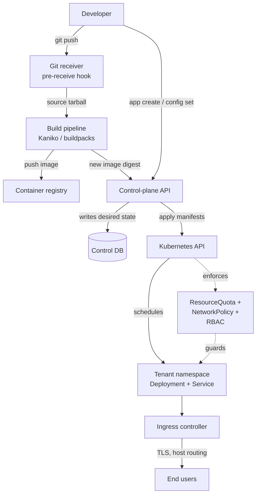

# Capstone: a self-hosted PaaS on Kubernetes

## Why this matters

It's a Tuesday afternoon and your five-person startup just got its AWS bill. The line item that hurts isn't compute, it's the platform tax: a managed PaaS charging per dyno, per add-on, per seat, and the numbers have crossed the point where someone on the team says "we already pay for a Kubernetes cluster, why are we also paying for this?" So you do the math on building your own. The naive estimate is "it's just `kubectl apply`, how hard can it be?" The real answer is that the gap between `kubectl apply` and Heroku is enormous, and the gap is exactly the interesting part: turning a raw orchestrator into a product that a developer who has never heard of a Deployment can use by typing `git push`.

The same Tuesday, three months later if you skip the hard parts: a tenant's build pulls a base image with a known CVE and you have no scanning gate. Two services collide on the same in-cluster DNS name because nobody scoped namespaces. A customer's `DATABASE_URL` ends up in a plaintext ConfigMap, readable by anyone with cluster-read. A runaway build pod with no resource limits evicts a paying customer's API. Each of these is a one-line policy you didn't write because you were focused on the happy path of `git push` to running container.

This chapter builds the happy path and the policies. The deliverable is a Heroku-shaped platform: a developer pushes code to a git remote, a build pipeline turns it into an image, the image runs as a multi-tenant workload, secrets are injected safely, traffic routes to it over TLS, and a control-plane API ties it together. You won't out-engineer Heroku in one chapter, but you'll understand every layer they hide, and you'll know which ones you can't afford to skip.

## Mental model

A PaaS is a translation layer. On one side, a developer's mental model: "here is my app, run it, give me a URL." On the other side, Kubernetes primitives: Deployments, Services, Ingress, Secrets, Namespaces, ResourceQuotas. The PaaS is the machine that compiles the first into the second, plus a build step that compiles source code into a runnable image.

Split it into two planes, the same split every orchestration system makes (this is the [Kubernetes architecture](https://kubernetes.io/docs/concepts/architecture/) idea applied one level up): a **control plane** that holds desired state and reconciles toward it, and a **data plane** where tenant workloads actually run. Your control-plane API never runs tenant code. The data plane never makes policy decisions. Keep that boundary clean and the security story stays tractable.



The unit of tenancy is the **Kubernetes namespace**. One tenant (or one app, depending on how you slice it) gets one namespace, and that namespace carries a `ResourceQuota`, a `NetworkPolicy`, RBAC bindings, and a `LimitRange`. Namespace isolation is soft isolation: it's a logical boundary enforced by policy, not a hardware boundary. For hostile multi-tenancy you'd reach for per-tenant node pools or a sandboxed runtime like gVisor or Kata Containers. For "trusted internal teams" or "our own customers running their own code," namespace-plus-policy is the standard, well-understood baseline, and that's what we build here.

The reconciliation loop is the other load-bearing idea. You don't imperatively "start a container." You write desired state (a Deployment with `replicas: 3`, image digest `sha256:...`) and Kubernetes' controllers drive the cluster toward it, continuously, forever. Your control plane is a thin desired-state author on top of theirs.

## In practice

We'll build four pieces: the control-plane API, the git-push build pipeline, the tenant workload manifests with isolation policy, and routing. Stack: TypeScript/Node for the control plane (it's mostly an HTTP server talking to the Kubernetes API), Kaniko for in-cluster builds, and standard Kubernetes objects everywhere else.

The control plane is the only component that holds Kubernetes credentials. Everything else — the git server, the build job, the running app — talks *to* the control plane or runs entirely without cluster access. That single rule keeps the privilege blast radius small: the only process that can write to the Kubernetes API is the one piece you wrote, reviewed, and scoped. Its job is narrow on purpose: own a small control database of apps, tenants, and the current desired image digest per app; expose an HTTP API for the developer-facing verbs (`app create`, `config set`, `deploy`, `logs`); and translate those verbs into Kubernetes objects. It is a desired-state author and an audit log, nothing more.

### Tenant provisioning: namespace as the isolation unit

When a tenant signs up, the control plane creates a namespace and stamps it with policy. Never let tenant workloads land in a shared namespace.

```typescript
import * as k8s from "@kubernetes/client-node";

const kc = new k8s.KubeConfig();
kc.loadFromCluster(); // in-cluster service account
const core = kc.makeApiClient(k8s.CoreV1Api);
const net = kc.makeApiClient(k8s.NetworkingV1Api);

export async function provisionTenant(tenantId: string) {
  const ns = `tenant-${tenantId}`;

  await core.createNamespace({
    metadata: { name: ns, labels: { "paas.io/tenant": tenantId } },
  });

  // Cap total resources so one tenant can't starve the cluster.
  await core.createNamespacedResourceQuota(ns, {
    metadata: { name: "tenant-quota" },
    spec: {
      hard: {
        "requests.cpu": "2",
        "requests.memory": "4Gi",
        "limits.cpu": "4",
        "limits.memory": "8Gi",
        pods: "20",
      },
    },
  });

  // Default per-container limits so a pod with no limits can't run unbounded.
  await core.createNamespacedLimitRange(ns, {
    metadata: { name: "tenant-defaults" },
    spec: {
      limits: [{
        type: "Container",
        default: { cpu: "500m", memory: "512Mi" },
        defaultRequest: { cpu: "100m", memory: "128Mi" },
      }],
    },
  });

  // Deny all traffic by default; routing is opened explicitly later.
  await net.createNamespacedNetworkPolicy(ns, {
    metadata: { name: "default-deny" },
    spec: { podSelector: {}, policyTypes: ["Ingress", "Egress"] },
  });
}
```

That `default-deny` NetworkPolicy is the single most important line for tenant isolation. Without it, every pod in the cluster can reach every other pod across namespaces, which means one compromised tenant app can scan and attack its neighbors. We open exactly the paths we need (ingress controller in, DNS and registry out) and nothing else.

### The git-push build pipeline

The Heroku magic is `git push heroku main`. We replicate it with a git server that runs a `pre-receive` hook. The hook archives the pushed commit, hands the tarball to a build job, and the build job produces an image. The critical constraint: **builds run tenant-controlled code, so they must run in the data plane, sandboxed, never on the control plane.**

The hook (running on the git server pod) kicks off a build by calling the control-plane API rather than touching Kubernetes itself:

```bash
#!/usr/bin/env bash
# hooks/pre-receive — runs on the git server when a tenant pushes
set -euo pipefail

while read -r oldrev newrev refname; do
  [[ "$refname" == "refs/heads/main" ]] || continue
  app="$(basename "$(pwd)" .git)"

  # Archive the pushed tree to a tarball in shared object storage.
  tar_url="s3://paas-sources/${app}/${newrev}.tar.gz"
  git archive "$newrev" | gzip | aws s3 cp - "$tar_url"

  # Ask the control plane to build it. The git server has a scoped token,
  # not cluster credentials.
  curl -fsS -X POST "http://control-plane.paas.svc/internal/builds" \
    -H "Authorization: Bearer ${BUILD_TRIGGER_TOKEN}" \
    -H "Content-Type: application/json" \
    -d "{\"app\":\"${app}\",\"commit\":\"${newrev}\",\"source\":\"${tar_url}\"}"
done
```

The control plane launches a Kaniko build Job in the tenant's namespace. Kaniko builds an OCI image from a Dockerfile inside an unprivileged container — no Docker daemon, no privileged mode, which matters enormously because giving build pods access to a host Docker socket is equivalent to giving them root on the node.

```typescript
import * as k8s from "@kubernetes/client-node";

const batch = kc.makeApiClient(k8s.BatchV1Api);

export async function startBuild(opts: {
  tenantId: string; app: string; commit: string; sourceUrl: string;
}) {
  const ns = `tenant-${opts.tenantId}`;
  const image = `registry.paas.svc/${opts.app}:${opts.commit.slice(0, 12)}`;

  await batch.createNamespacedJob(ns, {
    metadata: { name: `build-${opts.commit.slice(0, 8)}` },
    spec: {
      backoffLimit: 1,
      activeDeadlineSeconds: 900, // builds that hang get killed
      ttlSecondsAfterFinished: 3600,
      template: {
        spec: {
          restartPolicy: "Never",
          containers: [{
            name: "kaniko",
            image: "gcr.io/kaniko-project/executor:latest",
            args: [
              `--context=${opts.sourceUrl}`,
              `--destination=${image}`,
              "--reproducible",
              "--no-push-cache",
            ],
            resources: {
              requests: { cpu: "500m", memory: "1Gi" },
              limits: { cpu: "2", memory: "4Gi" },
            },
          }],
        },
      },
    },
  });

  return image;
}
```

For language autodetection (the part where you push a Node app with no Dockerfile and it just works), swap Kaniko for [Cloud Native Buildpacks](https://buildpacks.io/) via the `pack` CLI or a `lifecycle` image. Buildpacks inspect the source, pick a builder, and produce an image without anyone writing a Dockerfile. That's the real Heroku experience, and it's the right default for a PaaS where the whole point is that developers don't think about containers.

When the build Job succeeds, the control plane needs to learn the exact image that came out and then trigger a deploy. There are two clean ways to wire this handoff. The first is a Job-watch informer in the control plane that fires on completion and reads the pushed digest from the build's output (Kaniko can write the digest to a known location or you can re-resolve the tag against the registry). The second is to have the build container `POST` back to the control plane on exit with its digest and exit code. Either way the control plane records the result in its control database and, on success, triggers a deploy. **Pin by digest, not tag** — `image:abc123` is mutable, `image@sha256:...` is the exact bytes you scanned and approved. This is also the natural place to insert the image-scanning gate: resolve the digest, scan it (Trivy or Grype), and refuse to deploy if it carries a critical CVE, all before any tenant traffic reaches it.

### Deploying the workload

A deploy is: write a Deployment and a Service into the tenant namespace, then update the Ingress.

```typescript
const apps = kc.makeApiClient(k8s.AppsV1Api);

export async function deploy(opts: {
  tenantId: string; app: string; imageDigest: string; replicas: number;
}) {
  const ns = `tenant-${opts.tenantId}`;
  const labels = { "paas.io/app": opts.app };

  await apps.replaceNamespacedDeployment(opts.app, ns, {
    metadata: { name: opts.app, labels },
    spec: {
      replicas: opts.replicas,
      selector: { matchLabels: labels },
      strategy: { type: "RollingUpdate",
        rollingUpdate: { maxUnavailable: 0, maxSurge: 1 } },
      template: {
        metadata: { labels },
        spec: {
          automountServiceAccountToken: false, // app code needs no k8s API access
          securityContext: { runAsNonRoot: true, seccompProfile: { type: "RuntimeDefault" } },
          containers: [{
            name: "app",
            image: `registry.paas.svc/${opts.app}@${opts.imageDigest}`,
            ports: [{ containerPort: 8080 }],
            envFrom: [{ secretRef: { name: `${opts.app}-config` } }],
            readinessProbe: { httpGet: { path: "/healthz", port: 8080 } },
            securityContext: {
              allowPrivilegeEscalation: false,
              readOnlyRootFilesystem: true,
              capabilities: { drop: ["ALL"] },
            },
          }],
        },
      },
    },
  });
}
```

`maxUnavailable: 0` gives a zero-downtime rolling deploy: a new pod must pass its readiness probe before an old one is torn down. The `securityContext` block is the container-hardening baseline aligned with the [Pod Security Standards](https://kubernetes.io/docs/concepts/security/pod-security-standards/) "restricted" profile — drop all capabilities, no privilege escalation, read-only root, non-root user. Enforce it cluster-wide with a `restricted` Pod Security admission label on every tenant namespace so a tenant can't deploy a privileged pod even if they try.

### Config and secrets

`config set DATABASE_URL=...` is the Heroku verb. Behind it, values land in a Kubernetes Secret that's injected as environment variables via `envFrom`. The trap is that Kubernetes Secrets are only base64-encoded, not encrypted, and are readable by anyone with namespace-read RBAC and stored in etcd.

Two non-negotiable mitigations: enable [encryption at rest for etcd](https://kubernetes.io/docs/tasks/administer-cluster/encrypt-data/) (`EncryptionConfiguration` with a KMS provider), and lock down RBAC so tenants can read only their own namespace. For higher assurance, integrate an external secrets manager (Vault, or cloud KMS via the External Secrets Operator) so the source of truth is encrypted and audited, and Kubernetes only ever holds a short-lived synced copy.

```typescript
export async function setConfig(
  tenantId: string, app: string, kv: Record<string, string>
) {
  const ns = `tenant-${tenantId}`;
  await core.replaceNamespacedSecret(`${app}-config`, ns, {
    metadata: { name: `${app}-config` },
    stringData: kv, // client lib base64-encodes; etcd encryption protects at rest
  });

  // Force a rollout so running pods pick up new values. Bumping an annotation
  // on the pod template is enough to make the Deployment controller roll.
  const patch = {
    spec: {
      template: {
        metadata: {
          annotations: { "paas.io/config-version": Date.now().toString() },
        },
      },
    },
  };
  await apps.patchNamespacedDeployment(
    app,
    ns,
    patch,
    undefined, // pretty
    undefined, // dryRun
    undefined, // fieldManager
    undefined, // fieldValidation
    undefined, // force
    { headers: { "Content-Type": k8s.PatchUtils.PATCH_FORMAT_STRATEGIC_MERGE_PATCH } },
  );
}
```

That annotation bump is a common trick: changing the pod template forces a new rollout, so a config change actually reaches running pods instead of only affecting the next deploy. The strategic-merge content type matters — without it the client library defaults to a different patch format and the partial object above won't apply the way you expect.

### Routing and TLS

Each app gets a hostname like `app.tenant.paas.example.com`. An Ingress maps the host to the app's Service, and cert-manager issues TLS certs automatically.

```yaml
apiVersion: networking.k8s.io/v1
kind: Ingress
metadata:
  name: myapp
  namespace: tenant-acme
  annotations:
    cert-manager.io/cluster-issuer: letsencrypt-prod
spec:
  ingressClassName: nginx
  tls:
    - hosts: ["myapp.acme.paas.example.com"]
      secretName: myapp-tls
  rules:
    - host: myapp.acme.paas.example.com
      http:
        paths:
          - path: /
            pathType: Prefix
            backend:
              service:
                name: myapp
                port: { number: 80 }
```

For the `default-deny` NetworkPolicy to allow this traffic, add a companion policy permitting ingress from the ingress-controller namespace and egress to kube-dns and the registry. Without that, the deploy succeeds but every request times out, which is one of the most common "it deployed but I get 502s" debugging sessions in PaaS work.

### Metering for billing

The reason you built this instead of paying Heroku was cost, so you need to measure cost. The `ResourceQuota` and `LimitRange` already give you per-namespace requests and limits; pairing those with usage from the metrics pipeline (kube-state-metrics plus a Prometheus-style scrape of cAdvisor) gives you per-tenant CPU-seconds, memory-byte-seconds, and pod counts over time. That stream is both your billing input and your capacity-planning input — the same numbers that tell you what to charge a tenant tell you when to add a node. Treat the metering pipeline as a first-class component, not an afterthought, because a PaaS that can't attribute cost to a tenant can't price itself.

## Pitfalls and anti-patterns

**1. Running builds with a privileged container or a mounted Docker socket.** The classic "use Docker-in-Docker for builds" pattern mounts `/var/run/docker.sock` or runs `--privileged`. Either one is root on the node, and since builds run untrusted tenant code, you've handed every tenant root on your data plane. *Recognize it:* a build pod with `securityContext.privileged: true` or a `hostPath` volume to the Docker socket. *Fix:* use a daemonless builder (Kaniko, buildah in rootless mode, or Buildpacks `lifecycle`) that builds OCI images in an unprivileged container.

**2. Soft multi-tenancy treated as hard isolation.** Selling "isolated" workloads while running mutually-distrusting tenant code as ordinary pods on shared nodes. Namespaces, quotas, and NetworkPolicies stop accidents; they do not stop a kernel-exploit container escape. *Recognize it:* hostile tenants (you run arbitrary customer code) with no node-level boundary. *Fix:* for hostile tenancy, isolate at the node (per-tenant node pools with taints/tolerations) or the kernel (gVisor, Kata Containers). Be honest in your threat model about which one you have.

**3. Mutable image tags in Deployments.** Deploying `myapp:latest` or `myapp:main` means the running bytes drift from what you tested and scanned. A rollback to "the last good tag" can pull a different image than it did yesterday. *Recognize it:* Deployment `image` fields with tags, no `@sha256:` digest. *Fix:* resolve to a digest at build time and pin the Deployment to the digest. Tags are for humans; digests are for the cluster.

**4. No resource limits on tenant pods.** A pod without CPU/memory limits can consume an entire node and trigger evictions of healthy neighbors — the "noisy neighbor" failure that takes down paying customers because of a free-tier infinite loop. *Recognize it:* containers with no `resources.limits`; nodes under memory pressure evicting unrelated pods. *Fix:* a `LimitRange` per namespace sets defaults, and a `ResourceQuota` caps the namespace total. Both are shown above; neither is optional.

**5. Control plane with cluster-admin, reachable from tenant workloads.** Giving the control-plane service account `cluster-admin` and putting it on the same network as tenant pods turns any control-plane RCE into full cluster compromise. *Recognize it:* a broad `ClusterRoleBinding` to the API's service account; no NetworkPolicy isolating the control-plane namespace. *Fix:* scope RBAC to exactly the verbs and resources the control plane uses, run it in its own namespace behind a `default-deny` policy, and set `automountServiceAccountToken: false` on every workload that doesn't call the Kubernetes API.

## Production checklist

- [ ] One namespace per tenant (or per app), every namespace carrying `ResourceQuota`, `LimitRange`, and a `default-deny` `NetworkPolicy`
- [ ] Pod Security admission set to `restricted` on all tenant namespaces; `runAsNonRoot`, `readOnlyRootFilesystem`, `drop: ["ALL"]` enforced
- [ ] Builds run daemonless and unprivileged (Kaniko / buildah-rootless / Buildpacks); no Docker socket, no `privileged: true`
- [ ] Build images pinned and deployed by `@sha256:` digest, never by mutable tag
- [ ] Container image scanning gate (Trivy/Grype) between build and deploy; block on critical CVEs
- [ ] etcd encryption at rest enabled with a KMS provider; secrets ideally sourced from an external manager (Vault / External Secrets Operator)
- [ ] Control plane runs with least-privilege RBAC in its own isolated namespace; tenant pods have `automountServiceAccountToken: false`
- [ ] TLS automated via cert-manager; HTTP redirects to HTTPS at the ingress
- [ ] Rolling deploys with readiness probes and `maxUnavailable: 0`; rollbacks tested
- [ ] Resource quotas alerting before exhaustion; per-tenant cost/usage metering for billing
- [ ] Build and deploy logs streamed back to the developer; structured audit log of every control-plane action
- [ ] `activeDeadlineSeconds` on build jobs and `ttlSecondsAfterFinished` cleanup so failed builds don't accumulate

## Exercises

1. **(Comprehension)** Trace a single `git push` through the system end to end. List every component it touches in order — git receiver, build job, registry, control plane, Kubernetes API, Deployment, Service, Ingress — and for each, name the one piece of isolation or policy that protects it. Where exactly does untrusted tenant code execute, and what stops it from reaching another tenant?

2. **(Applied)** On a local cluster (kind or minikube), implement tenant provisioning from the `provisionTenant` function: create a namespace with a `ResourceQuota`, `LimitRange`, and `default-deny` `NetworkPolicy`. Deploy a small app into it. Confirm the deny policy works by `exec`-ing into the pod and failing to reach a pod in another namespace, then write the minimal companion policy that allows ingress-controller traffic and DNS, and confirm the app becomes reachable.

3. **(Design)** Your PaaS currently runs trusted internal teams on shared nodes with namespace isolation. Sales just signed a deal to run *external customers'* arbitrary code on the same platform. Redesign the isolation model for hostile multi-tenancy. Compare per-tenant node pools, gVisor/Kata sandboxed runtimes, and full per-tenant clusters across three axes: blast radius of a container escape, cost/utilization, and operational complexity. State what you'd ship first and what you'd defer, and justify the threat-model assumptions behind your choice.

## Further reading

- *Kubernetes documentation* — [Pod Security Standards](https://kubernetes.io/docs/concepts/security/pod-security-standards/) and [Multi-tenancy](https://kubernetes.io/docs/concepts/security/multi-tenancy/) — the canonical guidance on isolation tiers and the soft/hard tenancy distinction
- *Kubernetes: Up and Running*, Burns, Beda, Hightower & Evenson (O'Reilly) — the standard mental model for Deployments, Services, and controllers
- [Kaniko](https://github.com/GoogleContainerTools/kaniko) and [Cloud Native Buildpacks](https://buildpacks.io/) — official docs for daemonless, unprivileged image builds
- *Encrypting Confidential Data at Rest* — [Kubernetes task docs](https://kubernetes.io/docs/tasks/administer-cluster/encrypt-data/) on the `EncryptionConfiguration` and KMS providers for Secrets
- [The Twelve-Factor App](https://12factor.net/) — Adam Wiggins (Heroku) — the product philosophy you're re-implementing: config in the environment, stateless processes, disposability
- [gVisor](https://gvisor.dev/docs/) — official docs on the userspace kernel for sandboxing untrusted workloads when namespace isolation isn't enough

> **Connect the dots:** The container image you build here is the same content-addressable, layered artifact from Part 8's container internals — Kaniko produces OCI layers keyed by digest, which is why pinning `@sha256:` is both a security control and a reproducibility guarantee. The reconciliation loop driving your Deployments is the same desired-state pattern you'd write a custom controller for, and the git-push trigger is the build half of the CI/CD pipeline from Part 8's delivery chapters.

> **Security note:** The central risk in a PaaS is that you execute code you didn't write — every build and every running app is tenant-controlled. Three controls carry most of the weight: builds run unprivileged and daemonless so a malicious Dockerfile can't escape to the node; tenant pods get `default-deny` NetworkPolicies and the `restricted` Pod Security profile so a compromised app can't pivot to neighbors or escalate; and the control plane runs least-privilege in an isolated namespace so its own compromise doesn't become cluster-admin. If you remember one thing: namespace isolation is *soft*. The moment you run mutually-distrusting tenants, you need a node-level or kernel-level boundary (separate node pools, gVisor, or Kata), and no quota or NetworkPolicy substitutes for it.
